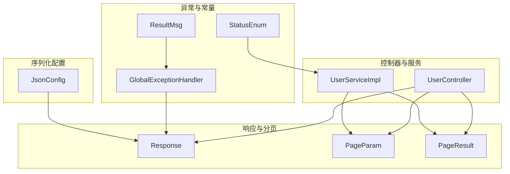
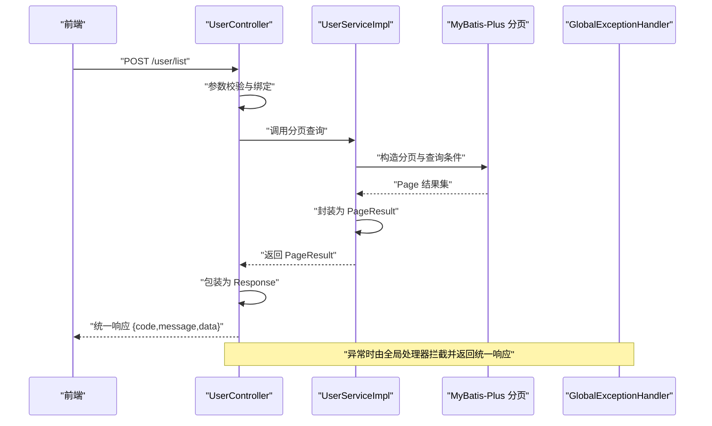
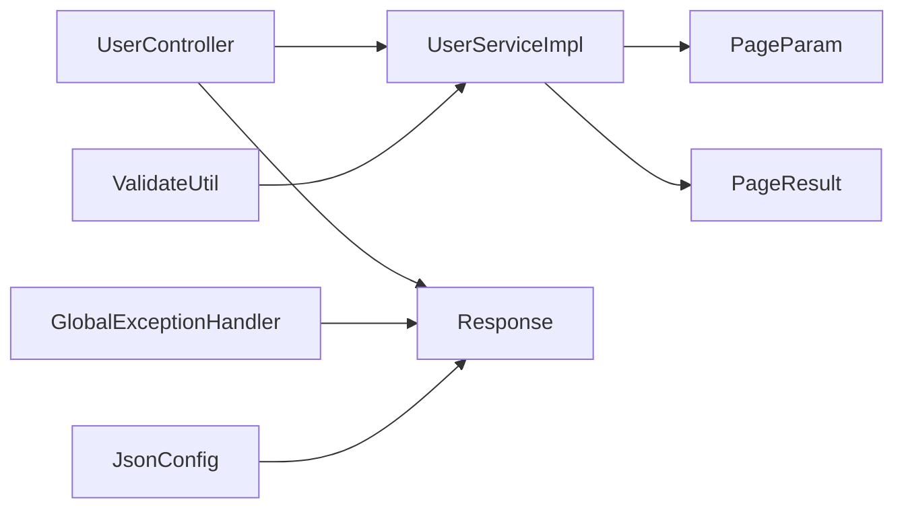

# 响应封装

<cite>
**本文引用的文件**
- [src/main/java/com/dw/admin/common/entity/Response.java](file://src/main/java/com/dw/admin/common/entity/Response.java)
- [src/main/java/com/dw/admin/common/entity/PageParam.java](file://src/main/java/com/dw/admin/common/entity/PageParam.java)
- [src/main/java/com/dw/admin/common/entity/PageResult.java](file://src/main/java/com/dw/admin/common/entity/PageResult.java)
- [src/main/java/com/dw/admin/common/constant/ResultMsg.java](file://src/main/java/com/dw/admin/common/constant/ResultMsg.java)
- [src/main/java/com/dw/admin/common/enums/StatusEnum.java](file://src/main/java/com/dw/admin/common/enums/StatusEnum.java)
- [src/main/java/com/dw/admin/common/exception/GlobalExceptionHandler.java](file://src/main/java/com/dw/admin/common/exception/GlobalExceptionHandler.java)
- [src/main/java/com/dw/admin/common/utils/ValidateUtil.java](file://src/main/java/com/dw/admin/common/utils/ValidateUtil.java)
- [src/main/java/com/dw/admin/config/JsonConfig.java](file://src/main/java/com/dw/admin/config/JsonConfig.java)
- [src/main/java/com/dw/admin/controller/UserController.java](file://src/main/java/com/dw/admin/controller/UserController.java)
- [src/main/java/com/dw/admin/service/impl/UserServiceImpl.java](file://src/main/java/com/dw/admin/service/impl/UserServiceImpl.java)
- [src/main/resources/application.yml](file://src/main/resources/application.yml)
</cite>

## 目录
1. [简介](#简介)
2. [项目结构](#项目结构)
3. [核心组件](#核心组件)
4. [架构总览](#架构总览)
5. [组件详解](#组件详解)
6. [依赖关系分析](#依赖关系分析)
7. [性能与传输优化](#性能与传输优化)
8. [安全与加密](#安全与加密)
9. [故障排查指南](#故障排查指南)
10. [结论](#结论)
11. [附录](#附录)

## 简介
本文件围绕“响应封装系统”进行系统化技术文档整理，重点覆盖以下方面：
- 统一响应格式的设计原则与数据结构
- 分页参数构建与分页结果封装机制
- 响应实体的序列化与反序列化处理
- 状态码与消息的标准化管理
- 响应数据的压缩与传输优化
- 版本兼容性与向后兼容策略
- 响应性能与网络传输优化技巧
- 响应数据的安全传输与加密机制
- 面向前后端开发者的完整响应协议指南

## 项目结构
响应封装体系由“统一响应实体、分页参数与结果、全局异常处理、序列化配置、控制器与服务层使用”等模块组成，形成从请求到响应的闭环。

图表来源
- [src/main/java/com/dw/admin/common/entity/Response.java](file://src/main/java/com/dw/admin/common/entity/Response.java#L1-L132)
- [src/main/java/com/dw/admin/common/entity/PageParam.java](file://src/main/java/com/dw/admin/common/entity/PageParam.java#L1-L44)
- [src/main/java/com/dw/admin/common/entity/PageResult.java](file://src/main/java/com/dw/admin/common/entity/PageResult.java#L1-L94)
- [src/main/java/com/dw/admin/common/exception/GlobalExceptionHandler.java](file://src/main/java/com/dw/admin/common/exception/GlobalExceptionHandler.java#L1-L76)
- [src/main/java/com/dw/admin/common/constant/ResultMsg.java](file://src/main/java/com/dw/admin/common/constant/ResultMsg.java#L1-L20)
- [src/main/java/com/dw/admin/common/enums/StatusEnum.java](file://src/main/java/com/dw/admin/common/enums/StatusEnum.java#L1-L31)
- [src/main/java/com/dw/admin/config/JsonConfig.java](file://src/main/java/com/dw/admin/config/JsonConfig.java#L1-L28)
- [src/main/java/com/dw/admin/controller/UserController.java](file://src/main/java/com/dw/admin/controller/UserController.java#L1-L138)
- [src/main/java/com/dw/admin/service/impl/UserServiceImpl.java](file://src/main/java/com/dw/admin/service/impl/UserServiceImpl.java#L1-L270)

章节来源
- [src/main/java/com/dw/admin/common/entity/Response.java](file://src/main/java/com/dw/admin/common/entity/Response.java#L1-L132)
- [src/main/java/com/dw/admin/common/entity/PageParam.java](file://src/main/java/com/dw/admin/common/entity/PageParam.java#L1-L44)
- [src/main/java/com/dw/admin/common/entity/PageResult.java](file://src/main/java/com/dw/admin/common/entity/PageResult.java#L1-L94)
- [src/main/java/com/dw/admin/common/exception/GlobalExceptionHandler.java](file://src/main/java/com/dw/admin/common/exception/GlobalExceptionHandler.java#L1-L76)
- [src/main/java/com/dw/admin/config/JsonConfig.java](file://src/main/java/com/dw/admin/config/JsonConfig.java#L1-L28)
- [src/main/java/com/dw/admin/controller/UserController.java](file://src/main/java/com/dw/admin/controller/UserController.java#L1-L138)
- [src/main/java/com/dw/admin/service/impl/UserServiceImpl.java](file://src/main/java/com/dw/admin/service/impl/UserServiceImpl.java#L1-L270)

## 核心组件
- 统一响应实体：提供标准的 code、message、data 字段，并内置常用静态构造方法，确保前后端交互的一致性与可读性。
- 分页参数与结果：以泛型参数承载查询条件，以固定字段顺序输出分页统计与数据列表，便于前端稳定解析。
- 全局异常处理：集中捕获业务异常与参数校验异常，统一转换为统一响应格式，减少重复逻辑。
- 序列化配置：针对 Long 类型避免精度丢失，保证数值字段在 JSON 中的稳定性。
- 控制器与服务：控制器直接返回统一响应，服务层负责业务逻辑与分页封装，形成清晰职责边界。

章节来源
- [src/main/java/com/dw/admin/common/entity/Response.java](file://src/main/java/com/dw/admin/common/entity/Response.java#L1-L132)
- [src/main/java/com/dw/admin/common/entity/PageParam.java](file://src/main/java/com/dw/admin/common/entity/PageParam.java#L1-L44)
- [src/main/java/com/dw/admin/common/entity/PageResult.java](file://src/main/java/com/dw/admin/common/entity/PageResult.java#L1-L94)
- [src/main/java/com/dw/admin/common/exception/GlobalExceptionHandler.java](file://src/main/java/com/dw/admin/common/exception/GlobalExceptionHandler.java#L1-L76)
- [src/main/java/com/dw/admin/config/JsonConfig.java](file://src/main/java/com/dw/admin/config/JsonConfig.java#L1-L28)
- [src/main/java/com/dw/admin/controller/UserController.java](file://src/main/java/com/dw/admin/controller/UserController.java#L1-L138)
- [src/main/java/com/dw/admin/service/impl/UserServiceImpl.java](file://src/main/java/com/dw/admin/service/impl/UserServiceImpl.java#L1-L270)

## 架构总览
下图展示从前端请求到统一响应返回的关键流程，包括参数校验、业务处理、分页封装与异常拦截。

图表来源
- [src/main/java/com/dw/admin/controller/UserController.java](file://src/main/java/com/dw/admin/controller/UserController.java#L128-L135)
- [src/main/java/com/dw/admin/service/impl/UserServiceImpl.java](file://src/main/java/com/dw/admin/service/impl/UserServiceImpl.java#L230-L267)
- [src/main/java/com/dw/admin/common/exception/GlobalExceptionHandler.java](file://src/main/java/com/dw/admin/common/exception/GlobalExceptionHandler.java#L54-L73)

## 组件详解

### 统一响应实体 Response<T>
- 数据结构
  - code：整型状态码，用于标识请求处理结果与错误类型
  - message：字符串消息，用于描述处理结果或错误原因
  - data：泛型数据体，承载具体业务数据
- 设计原则
  - 固定字段与语义明确，便于前端统一解析
  - 提供多种静态构造方法，覆盖成功、失败、参数校验失败等场景
  - 内置常用状态码常量，避免魔法数字
- 使用建议
  - 成功场景优先使用 success() 或 success(data)
  - 失败场景使用 fail() 或 fail(code, msg)，便于前端分支处理
  - 参数校验失败使用 validateFail()

章节来源
- [src/main/java/com/dw/admin/common/entity/Response.java](file://src/main/java/com/dw/admin/common/entity/Response.java#L1-L132)

### 分页参数 PageParam<T>
- 字段说明
  - pageNum：当前页（从1开始），pageNum=0 表示不分页，返回全部
  - pageSize：每页大小，最小为1
  - param：附加查询参数，支持嵌套校验
- 校验约束
  - pageNum 最小为0，pageSize 最小为1
  - param 使用 @Valid 进行嵌套校验
- 设计要点
  - 泛型化设计，适配不同业务的查询条件
  - 与 MyBatis-Plus 分页插件配合良好

章节来源
- [src/main/java/com/dw/admin/common/entity/PageParam.java](file://src/main/java/com/dw/admin/common/entity/PageParam.java#L1-L44)

### 分页结果 PageResult<T>
- 字段说明（JSON 输出顺序）
  - pageNum：页码，从1开始
  - pageSize：每页大小
  - pages：总页数
  - total：总记录数
  - list：当前页数据列表
- 构建逻辑
  - 提供多种构造函数，满足不同场景
  - build 方法根据 pageNum、pageSize、total 自动计算 pages
  - pageNum=0 时，视为不分页，将 pageSize 设置为 total，pages=1
- 序列化特性
  - 使用 JSONField 指定字段输出顺序，提升前后端契约稳定性

章节来源
- [src/main/java/com/dw/admin/common/entity/PageResult.java](file://src/main/java/com/dw/admin/common/entity/PageResult.java#L1-L94)

### 异常处理与消息标准化
- 全局异常处理
  - 捕获通用异常并返回未知错误响应
  - 捕获业务异常，使用异常中的 code 与 message
  - 参数校验异常统一转为参数校验失败响应
- 消息常量
  - ResultMsg 提供成功、失败、鉴权失败等默认消息常量
- 参数校验工具
  - ValidateUtil 提供丰富的断言方法，统一抛出参数校验异常

章节来源
- [src/main/java/com/dw/admin/common/exception/GlobalExceptionHandler.java](file://src/main/java/com/dw/admin/common/exception/GlobalExceptionHandler.java#L1-L76)
- [src/main/java/com/dw/admin/common/constant/ResultMsg.java](file://src/main/java/com/dw/admin/common/constant/ResultMsg.java#L1-L20)
- [src/main/java/com/dw/admin/common/utils/ValidateUtil.java](file://src/main/java/com/dw/admin/common/utils/ValidateUtil.java#L1-L83)

### 序列化与反序列化
- Jackson 配置
  - 针对 Long/long 类型注册 ToStringSerializer，避免 JSON 中出现精度丢失
- Fastjson2 注解
  - PageResult 使用 JSONField 指定字段顺序，确保序列化顺序稳定
- 建议
  - 前后端约定字段顺序与命名，避免因默认排序差异导致的兼容问题

章节来源
- [src/main/java/com/dw/admin/config/JsonConfig.java](file://src/main/java/com/dw/admin/config/JsonConfig.java#L1-L28)
- [src/main/java/com/dw/admin/common/entity/PageResult.java](file://src/main/java/com/dw/admin/common/entity/PageResult.java#L1-L94)

### 控制器与服务层协作
- 控制器
  - 直接返回 Response<T>，屏蔽内部实现细节
  - 对分页接口返回 PageResult<T>
- 服务层
  - 使用 PageParam 构造查询条件与分页参数
  - 使用 PageResult.build 封装分页结果
  - 抛出业务异常由全局处理器统一转换

章节来源
- [src/main/java/com/dw/admin/controller/UserController.java](file://src/main/java/com/dw/admin/controller/UserController.java#L1-L138)
- [src/main/java/com/dw/admin/service/impl/UserServiceImpl.java](file://src/main/java/com/dw/admin/service/impl/UserServiceImpl.java#L1-L270)

## 依赖关系分析
- 组件耦合
  - 控制器依赖统一响应与分页模型
  - 服务层依赖分页参数与结果，以及校验工具
  - 全局异常处理器依赖统一响应与校验异常类型
  - 序列化配置独立于业务逻辑，仅影响 JSON 输出
- 关键依赖链
  - 控制器 -> 服务层 -> Mapper -> PageResult -> Response
  - 参数校验异常 -> GlobalExceptionHandler -> Response

图表来源
- [src/main/java/com/dw/admin/controller/UserController.java](file://src/main/java/com/dw/admin/controller/UserController.java#L1-L138)
- [src/main/java/com/dw/admin/service/impl/UserServiceImpl.java](file://src/main/java/com/dw/admin/service/impl/UserServiceImpl.java#L1-L270)
- [src/main/java/com/dw/admin/common/entity/Response.java](file://src/main/java/com/dw/admin/common/entity/Response.java#L1-L132)
- [src/main/java/com/dw/admin/common/entity/PageParam.java](file://src/main/java/com/dw/admin/common/entity/PageParam.java#L1-L44)
- [src/main/java/com/dw/admin/common/entity/PageResult.java](file://src/main/java/com/dw/admin/common/entity/PageResult.java#L1-L94)
- [src/main/java/com/dw/admin/common/exception/GlobalExceptionHandler.java](file://src/main/java/com/dw/admin/common/exception/GlobalExceptionHandler.java#L1-L76)
- [src/main/java/com/dw/admin/config/JsonConfig.java](file://src/main/java/com/dw/admin/config/JsonConfig.java#L1-L28)
- [src/main/java/com/dw/admin/common/utils/ValidateUtil.java](file://src/main/java/com/dw/admin/common/utils/ValidateUtil.java#L1-L83)

## 性能与传输优化
- 分页策略
  - 合理设置 pageSize，避免过大导致内存压力与网络拥塞
  - 对高频查询开启数据库索引，减少排序与过滤开销
- 序列化优化
  - 使用 JSONField 固定字段顺序，降低字段名长度与解析复杂度
  - 避免在 data 中传递冗余字段，按需裁剪 VO
- 压缩传输
  - 在网关或服务器端启用 gzip/deflate 压缩，显著降低大分页响应体积
  - 对图片、文件等二进制内容采用 CDN 与直链返回，减少应用层传输
- 缓存策略
  - 对热点查询结果增加缓存层，减少数据库与序列化开销
- 并发与限流
  - 结合控制器上的限流注解，防止突发流量压垮服务

## 安全与加密
- 传输安全
  - 强制使用 HTTPS，避免中间人攻击与数据泄露
  - 对敏感字段（如密码、令牌）不在响应中返回
- 响应完整性
  - 可选引入响应签名或摘要机制，防止篡改（需前后端约定）
- 认证与授权
  - 响应中不暴露内部错误堆栈，统一返回标准化 message
  - 对鉴权失败与权限不足场景，使用明确的状态码与提示

## 故障排查指南
- 常见问题定位
  - 参数校验失败：检查控制器入参是否符合 PageParam 校验规则
  - 业务异常：查看服务层抛出的 BizException，确认 code 与 message
  - 未知异常：查看全局异常处理器日志，定位异常根因
- 日志与监控
  - 控制器与服务层添加必要的日志埋点
  - 对异常响应进行指标采集，关注失败率与耗时分布

章节来源
- [src/main/java/com/dw/admin/common/exception/GlobalExceptionHandler.java](file://src/main/java/com/dw/admin/common/exception/GlobalExceptionHandler.java#L1-L76)
- [src/main/java/com/dw/admin/common/utils/ValidateUtil.java](file://src/main/java/com/dw/admin/common/utils/ValidateUtil.java#L1-L83)

## 结论
该响应封装体系以统一响应实体为核心，结合分页参数与结果、全局异常处理与序列化配置，形成了高内聚、低耦合且易于演进的响应协议。通过标准化状态码与消息、稳定的 JSON 字段顺序、以及完善的异常处理机制，能够有效提升前后端协作效率与系统可靠性。建议在后续版本中持续完善版本兼容策略与安全加固措施，确保在复杂业务场景下的稳健运行。

## 附录

### 响应协议规范（前后端参考）
- 统一响应结构
  - 字段：code、message、data
  - 成功：code=200，message 通常为“成功”，data 为业务数据
  - 失败：code=500，message 为失败描述
  - 参数校验失败：code=400，message 为校验失败描述
  - 鉴权失败：code=401，权限不足：code=403
  - 未知错误：code=999，message 为异常堆栈文本
- 分页响应结构
  - 字段：pageNum、pageSize、pages、total、list
  - list 为当前页数据数组
  - pageNum=0 时表示不分页，pageSize=total，pages=1
- 序列化注意事项
  - 字段顺序固定，避免前端解析差异
  - Long 数值以字符串形式传输，避免精度丢失

章节来源
- [src/main/java/com/dw/admin/common/entity/Response.java](file://src/main/java/com/dw/admin/common/entity/Response.java#L1-L132)
- [src/main/java/com/dw/admin/common/entity/PageResult.java](file://src/main/java/com/dw/admin/common/entity/PageResult.java#L1-L94)
- [src/main/java/com/dw/admin/config/JsonConfig.java](file://src/main/java/com/dw/admin/config/JsonConfig.java#L1-L28)