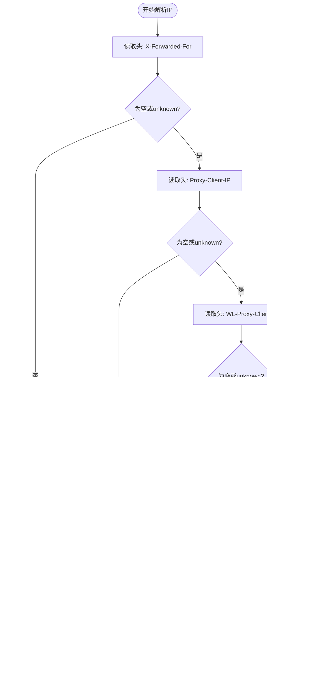

# 工具类库

<cite>
**本文引用的文件**
- [AddressUtil.java](file://src/main/java/com/dw/admin/common/utils/AddressUtil.java)
- [DateUtil.java](file://src/main/java/com/dw/admin/common/utils/DateUtil.java)
- [PasswordUtils.java](file://src/main/java/com/dw/admin/common/utils/PasswordUtils.java)
- [RequestHolder.java](file://src/main/java/com/dw/admin/common/utils/RequestHolder.java)
- [SpringContextHolder.java](file://src/main/java/com/dw/admin/common/utils/SpringContextHolder.java)
- [ValidateUtil.java](file://src/main/java/com/dw/admin/common/utils/ValidateUtil.java)
- [Response.java](file://src/main/java/com/dw/admin/common/entity/Response.java)
- [BizException.java](file://src/main/java/com/dw/admin/common/exception/BizException.java)
- [PageParam.java](file://src/main/java/com/dw/admin/common/entity/PageParam.java)
- [PageResult.java](file://src/main/java/com/dw/admin/common/entity/PageResult.java)
- [AuthAspect.java](file://src/main/java/com/dw/admin/components/auth/AuthAspect.java)
</cite>

## 目录
1. [简介](#简介)
2. [项目结构](#项目结构)
3. [核心组件](#核心组件)
4. [架构总览](#架构总览)
5. [详细组件分析](#详细组件分析)
6. [依赖关系分析](#依赖关系分析)
7. [性能考量](#性能考量)
8. [故障排查指南](#故障排查指南)
9. [结论](#结论)
10. [附录：扩展与自定义指南](#附录扩展与自定义指南)

## 简介
本文件为工具类库的技术文档，覆盖以下工具类的功能、使用场景、实现要点与最佳实践：
- 验证工具类：统一参数校验与异常抛出策略
- 密码工具类：基于 BCrypt 的安全加密与校验
- 地址解析工具：多代理头兼容的客户端 IP 解析
- 日期工具类：当前时间格式化与耗时计算
- Spring 上下文工具：静态访问 ApplicationContext 与 Bean
- 请求上下文工具：统一获取 HttpServletRequest/Response、请求头、请求体与 IP
同时提供扩展与自定义指南、单元测试与质量保障建议，帮助开发者高效、安全地使用这些工具。

## 项目结构
工具类集中位于 common/utils 包中，配合通用实体与异常类共同构成统一的基础设施层。

图表来源
- [ValidateUtil.java](file://src/main/java/com/dw/admin/common/utils/ValidateUtil.java#L1-L83)
- [PasswordUtils.java](file://src/main/java/com/dw/admin/common/utils/PasswordUtils.java#L1-L28)
- [AddressUtil.java](file://src/main/java/com/dw/admin/common/utils/AddressUtil.java#L1-L101)
- [DateUtil.java](file://src/main/java/com/dw/admin/common/utils/DateUtil.java#L1-L31)
- [SpringContextHolder.java](file://src/main/java/com/dw/admin/common/utils/SpringContextHolder.java#L1-L75)
- [RequestHolder.java](file://src/main/java/com/dw/admin/common/utils/RequestHolder.java#L1-L135)
- [Response.java](file://src/main/java/com/dw/admin/common/entity/Response.java#L1-L132)
- [BizException.java](file://src/main/java/com/dw/admin/common/exception/BizException.java#L1-L54)
- [PageParam.java](file://src/main/java/com/dw/admin/common/entity/PageParam.java#L1-L44)
- [PageResult.java](file://src/main/java/com/dw/admin/common/entity/PageResult.java#L1-L94)
- [AuthAspect.java](file://src/main/java/com/dw/admin/components/auth/AuthAspect.java#L1-L61)

章节来源
- [ValidateUtil.java](file://src/main/java/com/dw/admin/common/utils/ValidateUtil.java#L1-L83)
- [PasswordUtils.java](file://src/main/java/com/dw/admin/common/utils/PasswordUtils.java#L1-L28)
- [AddressUtil.java](file://src/main/java/com/dw/admin/common/utils/AddressUtil.java#L1-L101)
- [DateUtil.java](file://src/main/java/com/dw/admin/common/utils/DateUtil.java#L1-L31)
- [SpringContextHolder.java](file://src/main/java/com/dw/admin/common/utils/SpringContextHolder.java#L1-L75)
- [RequestHolder.java](file://src/main/java/com/dw/admin/common/utils/RequestHolder.java#L1-L135)
- [Response.java](file://src/main/java/com/dw/admin/common/entity/Response.java#L1-L132)
- [BizException.java](file://src/main/java/com/dw/admin/common/exception/BizException.java#L1-L54)
- [PageParam.java](file://src/main/java/com/dw/admin/common/entity/PageParam.java#L1-L44)
- [PageResult.java](file://src/main/java/com/dw/admin/common/entity/PageResult.java#L1-L94)
- [AuthAspect.java](file://src/main/java/com/dw/admin/components/auth/AuthAspect.java#L1-L61)

## 核心组件
- 验证工具类（ValidateUtil）：提供统一的参数校验入口，为空或条件不满足时抛出自定义业务异常，便于在控制器或服务层快速拦截非法入参。
- 密码工具类（PasswordUtils）：基于 BCrypt 实现密码加密与校验，自动处理盐值生成与比对，确保密码存储安全。
- 地址解析工具（AddressUtil/RequestHolder）：兼容多代理头与 IPv6/IPv4，解析真实客户端 IP，并提供请求对象与请求体读取能力。
- 日期工具类（DateUtil）：提供当前时间格式化与耗时计算，便于日志与监控统计。
- Spring 上下文工具（SpringContextHolder）：在静态环境中获取 ApplicationContext 与 Bean 实例，便于跨模块调用。
- 请求上下文工具（RequestHolder）：封装请求头、请求体、IP 等常用信息的获取逻辑，减少重复代码。

章节来源
- [ValidateUtil.java](file://src/main/java/com/dw/admin/common/utils/ValidateUtil.java#L1-L83)
- [PasswordUtils.java](file://src/main/java/com/dw/admin/common/utils/PasswordUtils.java#L1-L28)
- [AddressUtil.java](file://src/main/java/com/dw/admin/common/utils/AddressUtil.java#L1-L101)
- [RequestHolder.java](file://src/main/java/com/dw/admin/common/utils/RequestHolder.java#L1-L135)
- [DateUtil.java](file://src/main/java/com/dw/admin/common/utils/DateUtil.java#L1-L31)
- [SpringContextHolder.java](file://src/main/java/com/dw/admin/common/utils/SpringContextHolder.java#L1-L75)

## 架构总览
工具类作为基础设施层，向上支撑控制器与服务层的通用逻辑，向下依赖 Spring 容器与第三方库（如 Hutool）。鉴权切面通过请求上下文工具获取请求头与远程地址，体现了工具类在横切关注点中的作用。

图表来源
- [ValidateUtil.java](file://src/main/java/com/dw/admin/common/utils/ValidateUtil.java#L1-L83)
- [PasswordUtils.java](file://src/main/java/com/dw/admin/common/utils/PasswordUtils.java#L1-L28)
- [DateUtil.java](file://src/main/java/com/dw/admin/common/utils/DateUtil.java#L1-L31)
- [SpringContextHolder.java](file://src/main/java/com/dw/admin/common/utils/SpringContextHolder.java#L1-L75)
- [RequestHolder.java](file://src/main/java/com/dw/admin/common/utils/RequestHolder.java#L1-L135)
- [AddressUtil.java](file://src/main/java/com/dw/admin/common/utils/AddressUtil.java#L1-L101)
- [AuthAspect.java](file://src/main/java/com/dw/admin/components/auth/AuthAspect.java#L1-L61)

## 详细组件分析

### 验证工具类（ValidateUtil）
- 功能概述
  - 提供 isTrue/isFalse、isNull、isEmpty（字符串/集合/数组）等校验方法
  - 默认抛出业务异常，异常码与消息可由上层统一响应封装
- 设计要点
  - 统一异常类型：BizException，便于全局异常处理
  - 默认异常码来自 Response.VALIDATE_FAIL，保持前后端一致
  - 方法链式易用，适合在接口层快速拦截非法参数
- 使用场景
  - 控制器参数校验前置
  - 服务层业务规则校验
  - 批量参数校验与条件断言

图表来源
- [ValidateUtil.java](file://src/main/java/com/dw/admin/common/utils/ValidateUtil.java#L24-L40)
- [Response.java](file://src/main/java/com/dw/admin/common/entity/Response.java#L34-L35)
- [BizException.java](file://src/main/java/com/dw/admin/common/exception/BizException.java#L34-L38)

章节来源
- [ValidateUtil.java](file://src/main/java/com/dw/admin/common/utils/ValidateUtil.java#L1-L83)
- [Response.java](file://src/main/java/com/dw/admin/common/entity/Response.java#L1-L132)
- [BizException.java](file://src/main/java/com/dw/admin/common/exception/BizException.java#L1-L54)

### 密码工具类（PasswordUtils）
- 功能概述
  - encode：对原始密码进行 BCrypt 加密，自动处理盐值
  - matches：校验原始密码与已加密密码是否匹配
- 安全机制
  - BCrypt 自动随机盐值，不可逆加密，抗彩虹表
  - 校验时内部完成盐值与哈希比较
- 使用场景
  - 用户注册/修改密码时的加密存储
  - 登录时的密码校验流程

图表来源
- [PasswordUtils.java](file://src/main/java/com/dw/admin/common/utils/PasswordUtils.java#L15-L27)

章节来源
- [PasswordUtils.java](file://src/main/java/com/dw/admin/common/utils/PasswordUtils.java#L1-L28)

### 地址解析工具（AddressUtil 与 RequestHolder）
- AddressUtil
  - 支持多代理头（X-Forwarded-For、Proxy-Client-IP、WL-Proxy-Client-IP、HTTP_CLIENT_IP、HTTP_X_FORWARDED_FOR、X-Real-IP 等）
  - 处理 127.0.0.1/IPv6 回环地址，回退到本机 IP
  - 提供 getRemoteIP/getLocalIP/getHttpServletRequest
- RequestHolder
  - 提供 getHttpServletRequest/getHttpServletResponse
  - 提供 getHttpServletRequestIpAddress（支持 Servlet 与 ServerHttpRequest）
  - 提供 getBoyBytes（读取请求体字节数组）、getHeader（读取请求头）

图表来源
- [AddressUtil.java](file://src/main/java/com/dw/admin/common/utils/AddressUtil.java#L22-L68)
- [AddressUtil.java](file://src/main/java/com/dw/admin/common/utils/AddressUtil.java#L70-L84)
- [AddressUtil.java](file://src/main/java/com/dw/admin/common/utils/AddressUtil.java#L89-L99)
- [RequestHolder.java](file://src/main/java/com/dw/admin/common/utils/RequestHolder.java#L59-L79)
- [RequestHolder.java](file://src/main/java/com/dw/admin/common/utils/RequestHolder.java#L81-L108)

章节来源
- [AddressUtil.java](file://src/main/java/com/dw/admin/common/utils/AddressUtil.java#L1-L101)
- [RequestHolder.java](file://src/main/java/com/dw/admin/common/utils/RequestHolder.java#L1-L135)

### 日期工具类（DateUtil）
- 功能概述
  - 当前时间格式化（精确到秒）
  - 计算毫秒级耗时并换算为秒级字符串
- 使用场景
  - 日志时间戳输出
  - 接口耗时统计与埋点

图表来源
- [DateUtil.java](file://src/main/java/com/dw/admin/common/utils/DateUtil.java#L14-L28)

章节来源
- [DateUtil.java](file://src/main/java/com/dw/admin/common/utils/DateUtil.java#L1-L31)

### Spring 上下文工具（SpringContextHolder）
- 功能概述
  - 在静态方法中获取 ApplicationContext
  - 提供按名称与类型获取 Bean 的方法
  - 提供按类型获取 Bean 映射的方法
- 使用场景
  - 工具类或静态方法中获取 Spring Bean
  - 组件间解耦的轻量依赖注入

图表来源
- [SpringContextHolder.java](file://src/main/java/com/dw/admin/common/utils/SpringContextHolder.java#L19-L74)

章节来源
- [SpringContextHolder.java](file://src/main/java/com/dw/admin/common/utils/SpringContextHolder.java#L1-L75)

### 请求上下文工具（RequestHolder）
- 功能概述
  - 获取 HttpServletRequest/HttpServletResponse
  - 解析请求 IP（兼容多种代理头与 IPv6 回环）
  - 读取请求体字节数组
  - 读取指定请求头
- 使用场景
  - 鉴权切面中读取 Token 与远端 IP
  - 日志记录与审计追踪

图表来源
- [AuthAspect.java](file://src/main/java/com/dw/admin/components/auth/AuthAspect.java#L38-L52)
- [RequestHolder.java](file://src/main/java/com/dw/admin/common/utils/RequestHolder.java#L127-L133)
- [RequestHolder.java](file://src/main/java/com/dw/admin/common/utils/RequestHolder.java#L59-L79)

章节来源
- [RequestHolder.java](file://src/main/java/com/dw/admin/common/utils/RequestHolder.java#L1-L135)
- [AuthAspect.java](file://src/main/java/com/dw/admin/components/auth/AuthAspect.java#L1-L61)

## 依赖关系分析
- ValidateUtil 依赖 Response 与 BizException，用于统一异常码与消息
- AddressUtil 与 RequestHolder 依赖 Spring Web 上下文与 Hutool 字符串工具
- PasswordUtils 依赖 BCrypt（Hutool 提供）
- SpringContextHolder 依赖 Spring ApplicationContext
- AuthAspect 依赖 RequestHolder 进行请求上下文读取

图表来源
- [ValidateUtil.java](file://src/main/java/com/dw/admin/common/utils/ValidateUtil.java#L4-L8)
- [AddressUtil.java](file://src/main/java/com/dw/admin/common/utils/AddressUtil.java#L3-L8)
- [RequestHolder.java](file://src/main/java/com/dw/admin/common/utils/RequestHolder.java#L3-L11)
- [PasswordUtils.java](file://src/main/java/com/dw/admin/common/utils/PasswordUtils.java#L3)
- [SpringContextHolder.java](file://src/main/java/com/dw/admin/common/utils/SpringContextHolder.java#L7)
- [AuthAspect.java](file://src/main/java/com/dw/admin/components/auth/AuthAspect.java#L6)

章节来源
- [ValidateUtil.java](file://src/main/java/com/dw/admin/common/utils/ValidateUtil.java#L1-L83)
- [AddressUtil.java](file://src/main/java/com/dw/admin/common/utils/AddressUtil.java#L1-L101)
- [RequestHolder.java](file://src/main/java/com/dw/admin/common/utils/RequestHolder.java#L1-L135)
- [PasswordUtils.java](file://src/main/java/com/dw/admin/common/utils/PasswordUtils.java#L1-L28)
- [SpringContextHolder.java](file://src/main/java/com/dw/admin/common/utils/SpringContextHolder.java#L1-L75)
- [AuthAspect.java](file://src/main/java/com/dw/admin/components/auth/AuthAspect.java#L1-L61)

## 性能考量
- IP 解析路径短且分支明确，时间复杂度为 O(1)，对高频请求影响极小
- BCrypt 加密与校验为 CPU 密集型操作，建议在必要时才触发（如注册/登录），并避免在循环中重复加密
- 请求体读取采用流拷贝，注意控制请求体大小，防止内存压力
- SpringContextHolder 仅持有 ApplicationContext 引用，静态访问成本低，但需确保容器初始化完成

## 故障排查指南
- IP 解析异常
  - 现象：返回 unknown 或空
  - 排查：确认代理头是否正确透传；检查回环地址与本机 IP 获取逻辑
  - 参考：[AddressUtil.java](file://src/main/java/com/dw/admin/common/utils/AddressUtil.java#L29-L68)
- 请求体读取失败
  - 现象：读取到空字节数组或异常
  - 排查：确认请求体未被提前消费；检查输入流可用性
  - 参考：[RequestHolder.java](file://src/main/java/com/dw/admin/common/utils/RequestHolder.java#L113-L125)
- 密码校验失败
  - 现象：matches 返回 false
  - 排查：确认存储的加密密码未被篡改；核对原始密码一致性
  - 参考：[PasswordUtils.java](file://src/main/java/com/dw/admin/common/utils/PasswordUtils.java#L25-L27)
- 参数校验异常
  - 现象：抛出业务异常，响应码为 VALIDATE_FAIL
  - 排查：检查调用处是否传入空值或非法参数
  - 参考：[ValidateUtil.java](file://src/main/java/com/dw/admin/common/utils/ValidateUtil.java#L24-L40)，[Response.java](file://src/main/java/com/dw/admin/common/entity/Response.java#L34-L35)

章节来源
- [AddressUtil.java](file://src/main/java/com/dw/admin/common/utils/AddressUtil.java#L1-L101)
- [RequestHolder.java](file://src/main/java/com/dw/admin/common/utils/RequestHolder.java#L1-L135)
- [PasswordUtils.java](file://src/main/java/com/dw/admin/common/utils/PasswordUtils.java#L1-L28)
- [ValidateUtil.java](file://src/main/java/com/dw/admin/common/utils/ValidateUtil.java#L1-L83)
- [Response.java](file://src/main/java/com/dw/admin/common/entity/Response.java#L1-L132)

## 结论
该工具类库以简洁、稳定、安全为核心设计目标，覆盖参数校验、密码安全、请求上下文、IP 解析与时间处理等常见需求。通过统一异常与响应模型，降低重复代码，提升开发效率与系统一致性。建议在新增工具时遵循现有命名与异常规范，并在关键路径上做好性能与安全评估。

## 附录：扩展与自定义指南
- 新增工具类建议
  - 命名规范：工具类以 Util 结尾，功能单一、职责清晰
  - 异常规范：优先复用 BizException 与 Response 中的统一码值
  - 日志规范：对异常路径进行日志记录，便于定位问题
  - 线程安全：避免在工具类中维护可变状态，必要时使用 ThreadLocal
- 验证工具扩展
  - 可增加更多规则方法（如邮箱、手机号、身份证号等），统一抛出业务异常
  - 参考：[ValidateUtil.java](file://src/main/java/com/dw/admin/common/utils/ValidateUtil.java#L1-L83)
- 密码工具扩展
  - 可增加密码强度检测、历史密码校验等功能
  - 参考：[PasswordUtils.java](file://src/main/java/com/dw/admin/common/utils/PasswordUtils.java#L1-L28)
- IP 解析扩展
  - 可增加黑名单过滤、白名单放行、IP 归属地查询等
  - 参考：[AddressUtil.java](file://src/main/java/com/dw/admin/common/utils/AddressUtil.java#L1-L101)，[RequestHolder.java](file://src/main/java/com/dw/admin/common/utils/RequestHolder.java#L1-L135)
- Spring 上下文扩展
  - 可增加按注解筛选 Bean、动态注册 Bean 等高级能力（谨慎使用）
  - 参考：[SpringContextHolder.java](file://src/main/java/com/dw/admin/common/utils/SpringContextHolder.java#L1-L75)
- 单元测试与质量保证
  - 验证工具：构造边界值与异常场景，确保异常码与消息正确
  - 密码工具：覆盖加密与校验正反例，避免硬编码密码
  - IP 解析：模拟多代理头与 IPv6 回环，验证解析结果
  - Spring 上下文：在测试环境启动 ApplicationContext，验证 Bean 获取
  - 参考：[ValidateUtil.java](file://src/main/java/com/dw/admin/common/utils/ValidateUtil.java#L1-L83)，[PasswordUtils.java](file://src/main/java/com/dw/admin/common/utils/PasswordUtils.java#L1-L28)，[AddressUtil.java](file://src/main/java/com/dw/admin/common/utils/AddressUtil.java#L1-L101)，[SpringContextHolder.java](file://src/main/java/com/dw/admin/common/utils/SpringContextHolder.java#L1-L75)