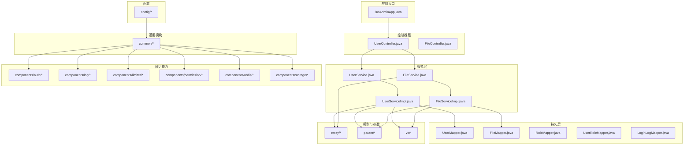
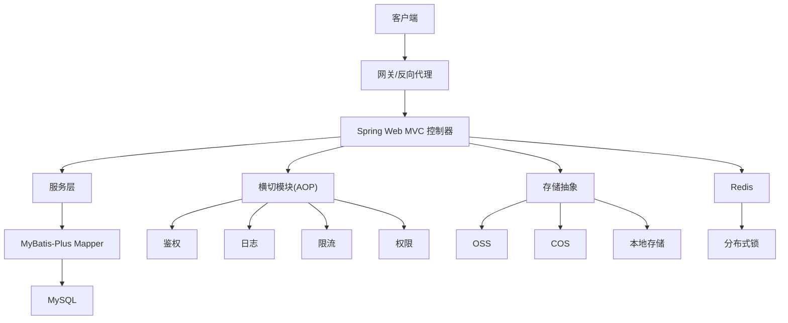
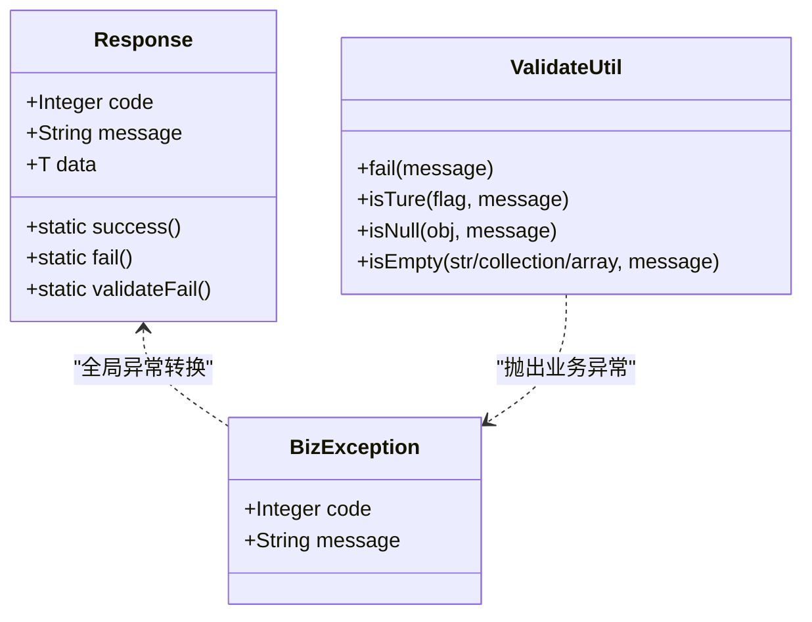
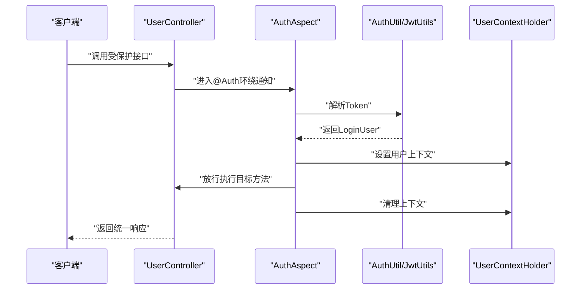
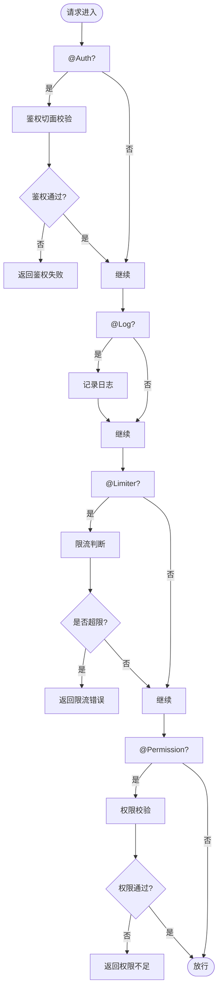
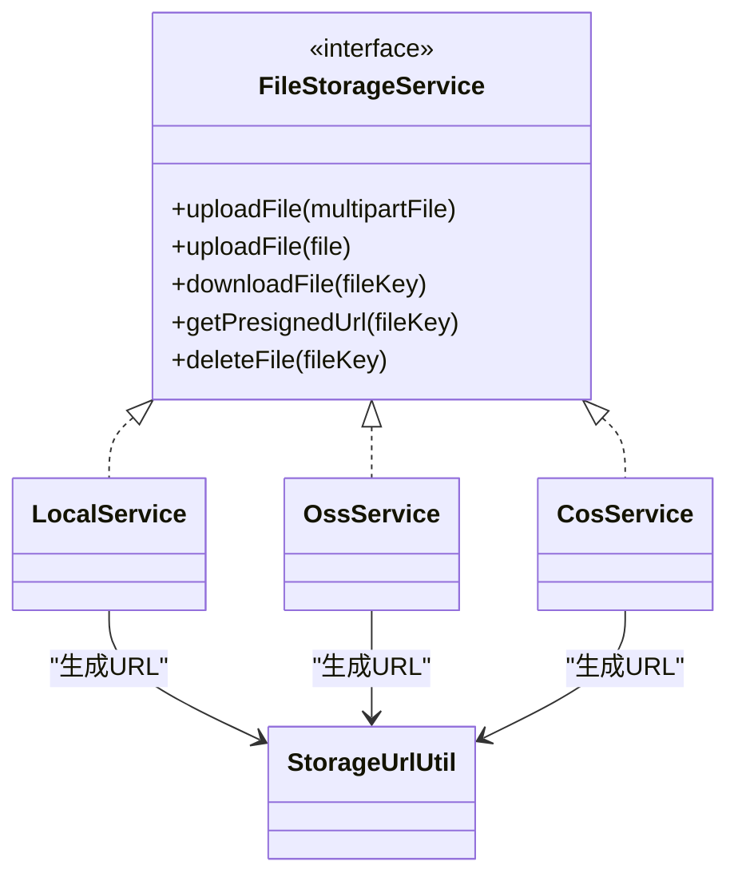
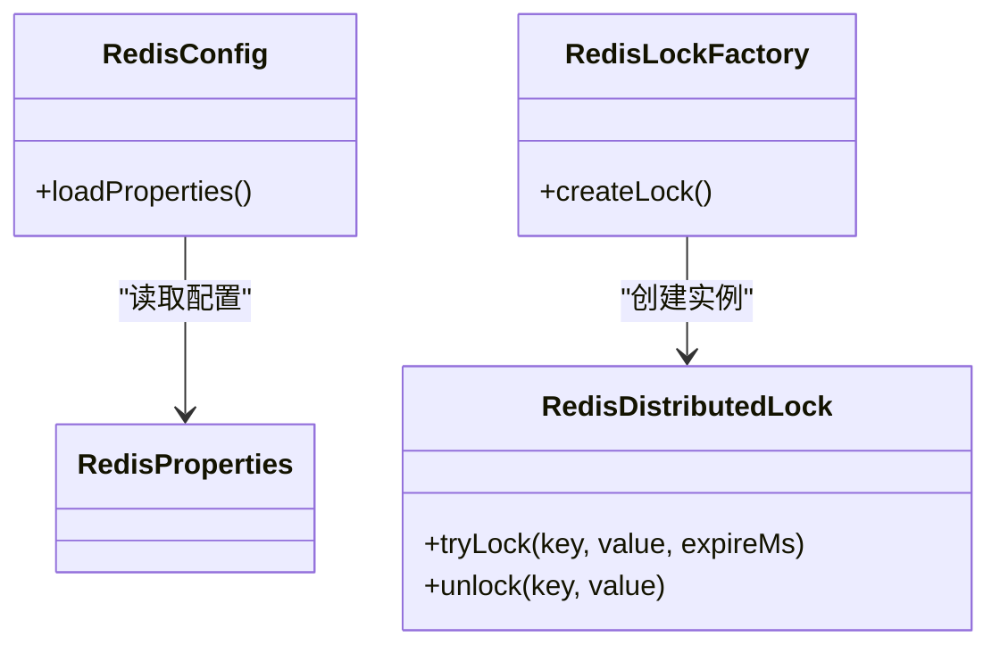
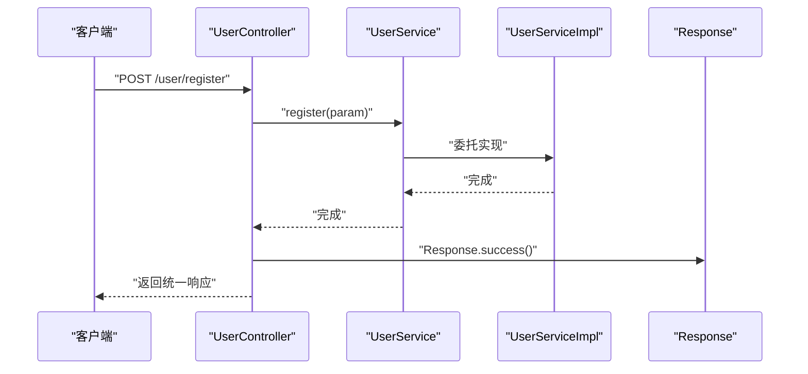
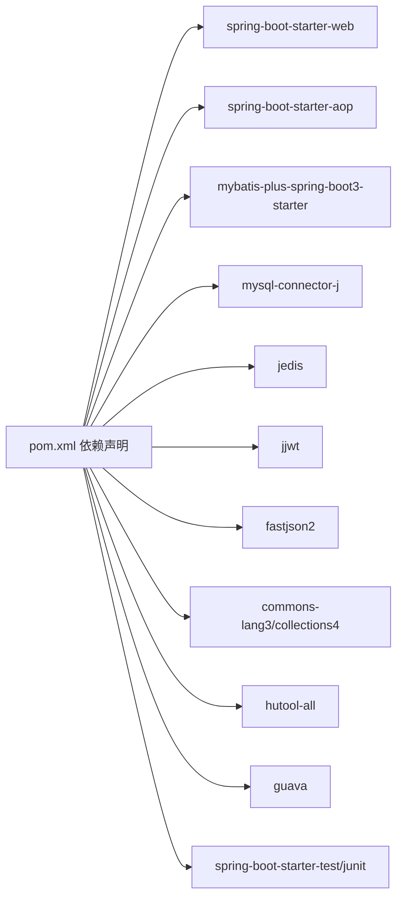

# 开发规范

<cite>
**本文引用的文件**
- [pom.xml](file://pom.xml)
- [README.md](file://README.md)
- [application.yml](file://src/main/resources/application.yml)
- [Dockerfile](file://Dockerfile)
- [build.sh](file://build.sh)
- [BizException.java](file://src/main/java/com/dw/admin/common/exception/BizException.java)
- [GlobalExceptionHandler.java](file://src/main/java/com/dw/admin/common/exception/GlobalExceptionHandler.java)
- [ResultMsg.java](file://src/main/java/com/dw/admin/common/constant/ResultMsg.java)
- [Response.java](file://src/main/java/com/dw/admin/common/entity/Response.java)
- [ValidateUtil.java](file://src/main/java/com/dw/admin/common/utils/ValidateUtil.java)
- [AuthAspect.java](file://src/main/java/com/dw/admin/components/auth/AuthAspect.java)
- [Auth.java](file://src/main/java/com/dw/admin/components/auth/Auth.java)
- [AuthConstant.java](file://src/main/java/com/dw/admin/components/auth/AuthConstant.java)
- [AuthProperties.java](file://src/main/java/com/dw/admin/components/auth/AuthProperties.java)
- [JwtUtils.java](file://src/main/java/com/dw/admin/components/auth/JwtUtils.java)
- [LoginUser.java](file://src/main/java/com/dw/admin/components/auth/LoginUser.java)
- [TokenCacheHelper.java](file://src/main/java/com/dw/admin/components/auth/TokenCacheHelper.java)
- [TokenDBCacheHelper.java](file://src/main/java/com/dw/admin/components/auth/TokenDBCacheHelper.java)
- [TokenRedisCacheHelper.java](file://src/main/java/com/dw/admin/components/auth/TokenRedisCacheHelper.java)
- [UserContextHolder.java](file://src/main/java/com/dw/admin/components/auth/UserContextHolder.java)
- [Limiter.java](file://src/main/java/com/dw/admin/components/limiter/Limiter.java)
- [LimiterAspect.java](file://src/main/java/com/dw/admin/components/limiter/LimiterAspect.java)
- [LimiterConstant.java](file://src/main/java/com/dw/admin/components/limiter/LimiterConstant.java)
- [LimiterProperties.java](file://src/main/java/com/dw/admin/components/limiter/LimiterProperties.java)
- [Log.java](file://src/main/java/com/dw/admin/components/log/Log.java)
- [LogAspect.java](file://src/main/java/com/dw/admin/components/log/LogAspect.java)
- [Permission.java](file://src/main/java/com/dw/admin/components/permission/Permission.java)
- [PermissionAspect.java](file://src/main/java/com/dw/admin/components/permission/PermissionAspect.java)
- [PermissionCacheHelper.java](file://src/main/java/com/dw/admin/components/permission/PermissionCacheHelper.java)
- [PermissionConstant.java](file://src/main/java/com/dw/admin/components/permission/PermissionConstant.java)
- [PermissionLocalCacheHelper.java](file://src/main/java/com/dw/admin/components/permission/PermissionLocalCacheHelper.java)
- [PermissionProperties.java](file://src/main/java/com/dw/admin/components/permission/PermissionProperties.java)
- [PermissionRedisCacheHelper.java](file://src/main/java/com/dw/admin/components/permission/PermissionRedisCacheHelper.java)
- [RedisConfig.java](file://src/main/java/com/dw/admin/components/redis/RedisConfig.java)
- [RedisConstant.java](file://src/main/java/com/dw/admin/components/redis/RedisConstant.java)
- [RedisDistributedLock.java](file://src/main/java/com/dw/admin/components/redis/RedisDistributedLock.java)
- [RedisLockFactory.java](file://src/main/java/com/dw/admin/components/redis/RedisLockFactory.java)
- [RedisProperties.java](file://src/main/java/com/dw/admin/components/redis/RedisProperties.java)
- [CosService.java](file://src/main/java/com/dw/admin/components/storage/cos/CosService.java)
- [LocalService.java](file://src/main/java/com/dw/admin/components/storage/local/LocalService.java)
- [OssService.java](file://src/main/java/com/dw/admin/components/storage/oss/OssService.java)
- [FileInfo.java](file://src/main/java/com/dw/admin/components/storage/FileInfo.java)
- [FileStorageService.java](file://src/main/java/com/dw/admin/components/storage/FileStorageService.java)
- [StorageConstant.java](file://src/main/java/com/dw/admin/components/storage/StorageConstant.java)
- [StorageProperties.java](file://src/main/java/com/dw/admin/components/storage/StorageProperties.java)
- [StorageUrlUtil.java](file://src/main/java/com/dw/admin/components/storage/StorageUrlUtil.java)
- [CorsConfig.java](file://src/main/java/com/dw/admin/config/CorsConfig.java)
- [DwAdminAppConfig.java](file://src/main/java/com/dw/admin/config/DwAdminAppConfig.java)
- [JsonConfig.java](file://src/main/java/com/dw/admin/config/JsonConfig.java)
- [MybatisPlusConfig.java](file://src/main/java/com/dw/admin/config/MybatisPlusConfig.java)
- [ThreadPoolConfig.java](file://src/main/java/com/dw/admin/config/ThreadPoolConfig.java)
- [UserController.java](file://src/main/java/com/dw/admin/controller/UserController.java)
- [UserService.java](file://src/main/java/com/dw/admin/service/UserService.java)
- [UserServiceImpl.java](file://src/main/java/com/dw/admin/service/impl/UserServiceImpl.java)
- [FileController.java](file://src/main/java/com/dw/admin/controller/FileController.java)
- [FileService.java](file://src/main/java/com/dw/admin/service/FileService.java)
- [FileServiceImpl.java](file://src/main/java/com/dw/admin/service/impl/FileServiceImpl.java)
- [CodeGenerator.java](file://src/main/java/com/dw/admin/components/generator/CodeGenerator.java)
- [AddressUtil.java](file://src/main/java/com/dw/admin/common/utils/AddressUtil.java)
- [DateUtil.java](file://src/main/java/com/dw/admin/common/utils/DateUtil.java)
- [PasswordUtils.java](file://src/main/java/com/dw/admin/common/utils/PasswordUtils.java)
- [RequestHolder.java](file://src/main/java/com/dw/admin/common/utils/RequestHolder.java)
- [SpringContextHolder.java](file://src/main/java/com/dw/admin/common/utils/SpringContextHolder.java)
- [logback-spring.xml](file://src/main/resources/logback/logback-spring.xml)
</cite>

## 目录
1. 引言
2. 项目结构
3. 核心组件
4. 架构总览
5. 详细组件分析
6. 依赖关系分析
7. 性能考虑
8. 故障排查指南
9. 结论
10. 附录

## 引言
本开发规范旨在为DW后台管理系统提供统一、可执行的工程化标准，覆盖代码规范与命名约定、注解使用最佳实践、开发流程与代码审查标准、Maven依赖管理与版本控制策略、IDE与开发工具配置、代码质量检查与静态分析、团队协作与版本管理、以及CI/CD配置要求。文档结合现有代码库的实际实现进行说明，并给出可操作的建议与流程图示。

## 项目结构
项目采用Spring Boot标准目录结构，按功能域分层组织：common（通用）、components（横切能力）、config（配置）、controller/service/dao/model（业务层）、resources（资源）与test（测试）。Dockerfile与脚本用于构建与运行，README提供常用命令参考。

图表来源
- [DwAdminApp.java](file://src/main/java/com/dw/admin/DwAdminApp.java)
- [UserController.java](file://src/main/java/com/dw/admin/controller/UserController.java)
- [UserService.java](file://src/main/java/com/dw/admin/service/UserService.java)
- [UserServiceImpl.java](file://src/main/java/com/dw/admin/service/impl/UserServiceImpl.java)
- [FileController.java](file://src/main/java/com/dw/admin/controller/FileController.java)
- [FileService.java](file://src/main/java/com/dw/admin/service/FileService.java)
- [FileServiceImpl.java](file://src/main/java/com/dw/admin/service/impl/FileServiceImpl.java)
- [UserMapper.java](file://src/main/java/com/dw/admin/dao/UserMapper.java)
- [FileMapper.java](file://src/main/java/com/dw/admin/dao/FileMapper.java)
- [RoleMapper.java](file://src/main/java/com/dw/admin/dao/RoleMapper.java)
- [UserRoleMapper.java](file://src/main/java/com/dw/admin/dao/UserRoleMapper.java)
- [LoginLogMapper.java](file://src/main/java/com/dw/admin/dao/LoginLogMapper.java)
- [Response.java](file://src/main/java/com/dw/admin/common/entity/Response.java)
- [AuthAspect.java](file://src/main/java/com/dw/admin/components/auth/AuthAspect.java)
- [LogAspect.java](file://src/main/java/com/dw/admin/components/log/LogAspect.java)
- [LimiterAspect.java](file://src/main/java/com/dw/admin/components/limiter/LimiterAspect.java)
- [PermissionAspect.java](file://src/main/java/com/dw/admin/components/permission/PermissionAspect.java)
- [RedisConfig.java](file://src/main/java/com/dw/admin/components/redis/RedisConfig.java)
- [FileStorageService.java](file://src/main/java/com/dw/admin/components/storage/FileStorageService.java)
- [CorsConfig.java](file://src/main/java/com/dw/admin/config/CorsConfig.java)
- [MybatisPlusConfig.java](file://src/main/java/com/dw/admin/config/MybatisPlusConfig.java)
- [JsonConfig.java](file://src/main/java/com/dw/admin/config/JsonConfig.java)
- [ThreadPoolConfig.java](file://src/main/java/com/dw/admin/config/ThreadPoolConfig.java)

章节来源
- [README.md](file://README.md#L1-L51)
- [Dockerfile](file://Dockerfile#L1-L19)
- [pom.xml](file://pom.xml#L1-L205)

## 核心组件
- 统一响应封装：统一返回体与状态码常量，便于前后端一致交互。
- 全局异常处理：集中捕获业务异常与运行时异常，输出标准化响应。
- 参数校验工具：提供简洁的断言式校验方法，配合业务异常抛出。
- 鉴权切面：基于注解与JWT的统一鉴权拦截，自动注入登录用户上下文。
- 日志、限流、权限横切：通过注解与AOP实现非侵入式增强。
- 存储抽象：统一文件存储接口，支持本地与云存储（OSS/COS）。
- Redis能力：分布式锁与缓存配置，支撑高并发场景。
- MyBatis-Plus配置：分页、XML映射等基础配置。

章节来源
- [Response.java](file://src/main/java/com/dw/admin/common/entity/Response.java#L1-L132)
- [GlobalExceptionHandler.java](file://src/main/java/com/dw/admin/common/exception/GlobalExceptionHandler.java)
- [ValidateUtil.java](file://src/main/java/com/dw/admin/common/utils/ValidateUtil.java#L1-L83)
- [BizException.java](file://src/main/java/com/dw/admin/common/exception/BizException.java#L1-L54)
- [AuthAspect.java](file://src/main/java/com/dw/admin/components/auth/AuthAspect.java#L1-L62)
- [FileStorageService.java](file://src/main/java/com/dw/admin/components/storage/FileStorageService.java#L1-L52)
- [RedisConfig.java](file://src/main/java/com/dw/admin/components/redis/RedisConfig.java)
- [MybatisPlusConfig.java](file://src/main/java/com/dw/admin/config/MybatisPlusConfig.java)

## 架构总览
系统采用分层架构与横切关注点分离，控制器负责HTTP请求，服务层承载业务逻辑，DAO层访问数据库，横切模块通过注解与AOP实现鉴权、日志、限流、权限控制与缓存。

图表来源
- [UserController.java](file://src/main/java/com/dw/admin/controller/UserController.java#L1-L138)
- [UserService.java](file://src/main/java/com/dw/admin/service/UserService.java#L1-L59)
- [UserServiceImpl.java](file://src/main/java/com/dw/admin/service/impl/UserServiceImpl.java)
- [AuthAspect.java](file://src/main/java/com/dw/admin/components/auth/AuthAspect.java#L1-L62)
- [LogAspect.java](file://src/main/java/com/dw/admin/components/log/LogAspect.java)
- [LimiterAspect.java](file://src/main/java/com/dw/admin/components/limiter/LimiterAspect.java)
- [PermissionAspect.java](file://src/main/java/com/dw/admin/components/permission/PermissionAspect.java)
- [FileStorageService.java](file://src/main/java/com/dw/admin/components/storage/FileStorageService.java#L1-L52)
- [OssService.java](file://src/main/java/com/dw/admin/components/storage/oss/OssService.java)
- [CosService.java](file://src/main/java/com/dw/admin/components/storage/cos/CosService.java)
- [LocalService.java](file://src/main/java/com/dw/admin/components/storage/local/LocalService.java)
- [RedisConfig.java](file://src/main/java/com/dw/admin/components/redis/RedisConfig.java)

## 详细组件分析

### 统一响应与异常体系
- 统一响应：封装code、message、data，提供success/fail/validateFail等工厂方法。
- 业务异常：BizException携带code/message，便于前端识别与提示。
- 全局异常：GlobalExceptionHandler将BizException转换为统一响应，其他异常转UNKNOWN或FAIL。
- 参数校验：ValidateUtil提供isTure/isNull/isEmpty等断言方法，统一抛出业务异常。

图表来源
- [Response.java](file://src/main/java/com/dw/admin/common/entity/Response.java#L1-L132)
- [BizException.java](file://src/main/java/com/dw/admin/common/exception/BizException.java#L1-L54)
- [ValidateUtil.java](file://src/main/java/com/dw/admin/common/utils/ValidateUtil.java#L1-L83)
- [GlobalExceptionHandler.java](file://src/main/java/com/dw/admin/common/exception/GlobalExceptionHandler.java)

章节来源
- [Response.java](file://src/main/java/com/dw/admin/common/entity/Response.java#L1-L132)
- [BizException.java](file://src/main/java/com/dw/admin/common/exception/BizException.java#L1-L54)
- [ValidateUtil.java](file://src/main/java/com/dw/admin/common/utils/ValidateUtil.java#L1-L83)
- [GlobalExceptionHandler.java](file://src/main/java/com/dw/admin/common/exception/GlobalExceptionHandler.java)
- [ResultMsg.java](file://src/main/java/com/dw/admin/common/constant/ResultMsg.java#L1-L20)

### 鉴权与用户上下文
- 注解驱动：@Auth标注需要鉴权的方法；切面在进入目标方法前解析Token并校验，失败则抛出业务异常。
- 上下文：UserContextHolder在线程内保存登录用户信息，供后续逻辑使用。
- 工具：JwtUtils负责Token生成与解析；TokenCacheHelper系列支持DB/Redis缓存策略。
- 常量：AuthConstant定义TOKEN_KEY、TOKEN_VALUE_PREFIX、ORDER等常量。

图表来源
- [AuthAspect.java](file://src/main/java/com/dw/admin/components/auth/AuthAspect.java#L1-L62)
- [Auth.java](file://src/main/java/com/dw/admin/components/auth/Auth.java)
- [AuthConstant.java](file://src/main/java/com/dw/admin/components/auth/AuthConstant.java)
- [JwtUtils.java](file://src/main/java/com/dw/admin/components/auth/JwtUtils.java)
- [UserContextHolder.java](file://src/main/java/com/dw/admin/components/auth/UserContextHolder.java)
- [UserController.java](file://src/main/java/com/dw/admin/controller/UserController.java#L1-L138)

章节来源
- [AuthAspect.java](file://src/main/java/com/dw/admin/components/auth/AuthAspect.java#L1-L62)
- [Auth.java](file://src/main/java/com/dw/admin/components/auth/Auth.java)
- [AuthConstant.java](file://src/main/java/com/dw/admin/components/auth/AuthConstant.java)
- [JwtUtils.java](file://src/main/java/com/dw/admin/components/auth/JwtUtils.java)
- [UserContextHolder.java](file://src/main/java/com/dw/admin/components/auth/UserContextHolder.java)
- [UserController.java](file://src/main/java/com/dw/admin/controller/UserController.java#L1-L138)

### 日志、限流与权限
- 日志：@Log注解记录请求/响应摘要，便于审计与排错。
- 限流：@Limiter基于IP限速，防止暴力请求。
- 权限：@Permission基于角色控制，仅允许管理员访问敏感接口。
- 切面：LogAspect/LimiterAspect/PermissionAspect分别拦截对应注解，统一处理。

图表来源
- [LogAspect.java](file://src/main/java/com/dw/admin/components/log/LogAspect.java)
- [LimiterAspect.java](file://src/main/java/com/dw/admin/components/limiter/LimiterAspect.java)
- [PermissionAspect.java](file://src/main/java/com/dw/admin/components/permission/PermissionAspect.java)
- [UserController.java](file://src/main/java/com/dw/admin/controller/UserController.java#L1-L138)

章节来源
- [Log.java](file://src/main/java/com/dw/admin/components/log/Log.java)
- [LogAspect.java](file://src/main/java/com/dw/admin/components/log/LogAspect.java)
- [Limiter.java](file://src/main/java/com/dw/admin/components/limiter/Limiter.java)
- [LimiterAspect.java](file://src/main/java/com/dw/admin/components/limiter/LimiterAspect.java)
- [Permission.java](file://src/main/java/com/dw/admin/components/permission/Permission.java)
- [PermissionAspect.java](file://src/main/java/com/dw/admin/components/permission/PermissionAspect.java)
- [UserController.java](file://src/main/java/com/dw/admin/controller/UserController.java#L1-L138)

### 存储抽象与多提供商支持
- 接口：FileStorageService定义上传/下载/删除/预签名URL等能力。
- 实现：LocalService/OssService/CosService分别对接本地与云存储。
- 配置：StorageProperties与StorageConstant承载Provider选择与密钥配置。
- 工具：StorageUrlUtil统一生成可访问URL。

图表来源
- [FileStorageService.java](file://src/main/java/com/dw/admin/components/storage/FileStorageService.java#L1-L52)
- [LocalService.java](file://src/main/java/com/dw/admin/components/storage/local/LocalService.java)
- [OssService.java](file://src/main/java/com/dw/admin/components/storage/oss/OssService.java)
- [CosService.java](file://src/main/java/com/dw/admin/components/storage/cos/CosService.java)
- [StorageUrlUtil.java](file://src/main/java/com/dw/admin/components/storage/StorageUrlUtil.java)

章节来源
- [FileStorageService.java](file://src/main/java/com/dw/admin/components/storage/FileStorageService.java#L1-L52)
- [LocalService.java](file://src/main/java/com/dw/admin/components/storage/local/LocalService.java)
- [OssService.java](file://src/main/java/com/dw/admin/components/storage/oss/OssService.java)
- [CosService.java](file://src/main/java/com/dw/admin/components/storage/cos/CosService.java)
- [StorageUrlUtil.java](file://src/main/java/com/dw/admin/components/storage/StorageUrlUtil.java)
- [StorageProperties.java](file://src/main/java/com/dw/admin/components/storage/StorageProperties.java)
- [StorageConstant.java](file://src/main/java/com/dw/admin/components/storage/StorageConstant.java)

### Redis与分布式锁
- 配置：RedisConfig加载连接参数与序列化策略。
- 锁：RedisDistributedLock基于Redis实现分布式互斥锁；RedisLockFactory根据配置选择具体实现。
- 常量：RedisConstant定义键空间与前缀。

图表来源
- [RedisConfig.java](file://src/main/java/com/dw/admin/components/redis/RedisConfig.java)
- [RedisDistributedLock.java](file://src/main/java/com/dw/admin/components/redis/RedisDistributedLock.java)
- [RedisLockFactory.java](file://src/main/java/com/dw/admin/components/redis/RedisLockFactory.java)
- [RedisProperties.java](file://src/main/java/com/dw/admin/components/redis/RedisProperties.java)
- [RedisConstant.java](file://src/main/java/com/dw/admin/components/redis/RedisConstant.java)

章节来源
- [RedisConfig.java](file://src/main/java/com/dw/admin/components/redis/RedisConfig.java)
- [RedisDistributedLock.java](file://src/main/java/com/dw/admin/components/redis/RedisDistributedLock.java)
- [RedisLockFactory.java](file://src/main/java/com/dw/admin/components/redis/RedisLockFactory.java)
- [RedisProperties.java](file://src/main/java/com/dw/admin/components/redis/RedisProperties.java)
- [RedisConstant.java](file://src/main/java/com/dw/admin/components/redis/RedisConstant.java)

### 控制器与服务层
- 控制器：UserController对注册、登录、查询、分页等接口进行REST暴露，统一使用@Log/@Auth/@Permission/@Limiter注解增强。
- 服务接口：UserService定义用户相关业务契约；UserServiceImpl实现具体逻辑。
- 参数与返回：param/vo/entity清晰分离，避免跨层耦合。

图表来源
- [UserController.java](file://src/main/java/com/dw/admin/controller/UserController.java#L1-L138)
- [UserService.java](file://src/main/java/com/dw/admin/service/UserService.java#L1-L59)
- [UserServiceImpl.java](file://src/main/java/com/dw/admin/service/impl/UserServiceImpl.java)
- [Response.java](file://src/main/java/com/dw/admin/common/entity/Response.java#L1-L132)

章节来源
- [UserController.java](file://src/main/java/com/dw/admin/controller/UserController.java#L1-L138)
- [UserService.java](file://src/main/java/com/dw/admin/service/UserService.java#L1-L59)
- [UserServiceImpl.java](file://src/main/java/com/dw/admin/service/impl/UserServiceImpl.java)

## 依赖关系分析
- 运行时依赖：Spring Web/AOP/Validation/Actuator、MyBatis-Plus、MySQL驱动、Redis客户端、JWT、FastJSON2、Apache Commons/Hutool/Guava等。
- 构建插件：maven-compiler-plugin、spring-boot-maven-plugin（排除lombok）。
- 仓库：配置阿里云中央仓库加速下载。

图表来源
- [pom.xml](file://pom.xml#L25-L163)

章节来源
- [pom.xml](file://pom.xml#L1-L205)

## 性能考虑
- 连接池与线程池：合理配置HikariCP连接池大小与MyBatis-Plus分页策略，避免慢查询。
- 缓存策略：鉴权与权限结果建议结合Redis缓存，降低重复计算成本。
- 限流与熔断：对高频接口启用@Limiter，必要时引入熔断降级。
- 存储优化：大文件上传建议使用云存储直传与分片，减少单次IO时间。
- 日志级别：生产环境避免过度DEBUG，聚焦关键链路。

## 故障排查指南
- 统一异常：优先查看全局异常处理器对BizException的映射，确认业务错误码与消息。
- 鉴权失败：检查Token格式、过期时间与UserContextHolder是否正确设置。
- 参数校验：ValidateUtil断言失败会抛出业务异常，需核对入参与校验规则。
- 存储问题：确认StorageProperties中的Provider与密钥配置，检查URL生成逻辑。
- Redis异常：核对RedisConfig配置与连接状态，验证分布式锁释放逻辑。

章节来源
- [GlobalExceptionHandler.java](file://src/main/java/com/dw/admin/common/exception/GlobalExceptionHandler.java)
- [BizException.java](file://src/main/java/com/dw/admin/common/exception/BizException.java#L1-L54)
- [ValidateUtil.java](file://src/main/java/com/dw/admin/common/utils/ValidateUtil.java#L1-L83)
- [AuthAspect.java](file://src/main/java/com/dw/admin/components/auth/AuthAspect.java#L1-L62)
- [StorageProperties.java](file://src/main/java/com/dw/admin/components/storage/StorageProperties.java)
- [RedisConfig.java](file://src/main/java/com/dw/admin/components/redis/RedisConfig.java)

## 结论
本规范以现有代码库为基础，建立了统一的响应、异常、鉴权、日志、限流、权限与存储抽象体系，并配套Maven依赖管理与Docker构建流程。建议在团队内推广注解驱动的横切增强与参数校验工具，强化代码质量与可维护性，同时完善CI/CD流水线以保障交付效率与稳定性。

## 附录

### 代码规范与命名约定
- 包名：采用反向域名+小写分段，如com.dw.admin。
- 类名：采用帕斯卡命名，接口以名词或形容词开头，实现类加Impl后缀。
- 方法：动词短语，参数与返回值明确，异常抛出清晰。
- 常量：全大写下划线分隔。
- 注释：公共API与复杂逻辑必须有清晰注释，遵循JavaDoc规范。

### 注解使用最佳实践
- @Auth：对需要登录的接口使用，确保Token解析与上下文设置。
- @Log：对所有对外接口使用，记录请求摘要与耗时。
- @Limiter：对高频接口使用，合理设置速率阈值。
- @Permission：对敏感操作使用，限定角色范围。
- 参数校验：在控制器层使用@Validated，结合ValidateUtil进行补充校验。

### 开发流程与代码审查
- 分支策略：主分支保护，特性分支开发，合并前强制代码审查。
- 提交规范：提交信息清晰描述变更内容与影响范围。
- 代码审查：至少一名Reviewer同意，确保一致性与可维护性。

### Maven依赖管理与版本控制
- 版本锁定：使用Spring Boot Parent统一管理版本，第三方库尽量使用稳定版本。
- 仓库镜像：使用阿里云中央仓库提升下载速度。
- 插件配置：编译与打包插件保持默认行为，避免过度定制。

章节来源
- [pom.xml](file://pom.xml#L1-L205)
- [application.yml](file://src/main/resources/application.yml#L1-L64)

### IDE与开发工具推荐
- JDK：使用与项目一致的版本（Java 21）。
- Lombok：启用注解处理器，减少样板代码。
- 插件：Spring Boot、MyBatis、Lombok、Checkstyle/SpotBugs等。
- 格式化：统一EditorConfig与IDE格式化规则，保持一致性。

### 代码质量检查与静态分析
- 单元测试：覆盖率不低于关键路径，使用JUnit与Mock。
- 静态分析：引入SpotBugs/FindBugs/PMD等工具，定期扫描。
- 规范检查：使用Checkstyle或Google Java Style，统一风格。

### 团队协作与版本管理
- Git工作流：Git Flow或GitHub Flow，主干稳定，分支隔离。
- 冲突解决：冲突必须当面沟通或二次Review，避免历史回滚。
- 文档同步：变更及时更新README与设计文档。

### 持续集成与持续部署
- 构建：Dockerfile使用多阶段构建，先构建后运行。
- 镜像：镜像标签与版本号一致，保留最近N个版本。
- 运行：通过环境变量切换profile，挂载日志目录，设置时区。

章节来源
- [Dockerfile](file://Dockerfile#L1-L19)
- [build.sh](file://build.sh#L1-L5)
- [application.yml](file://src/main/resources/application.yml#L1-L64)
- [README.md](file://README.md#L1-L51)