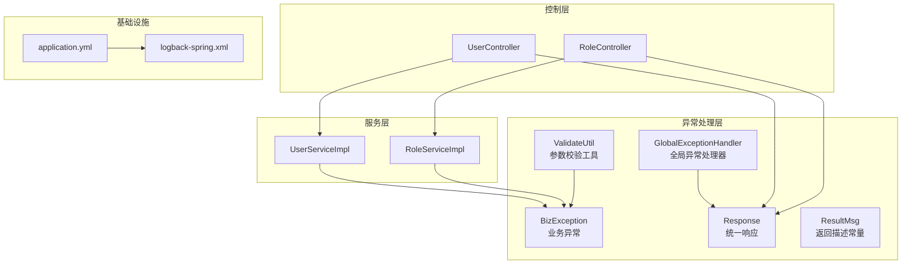
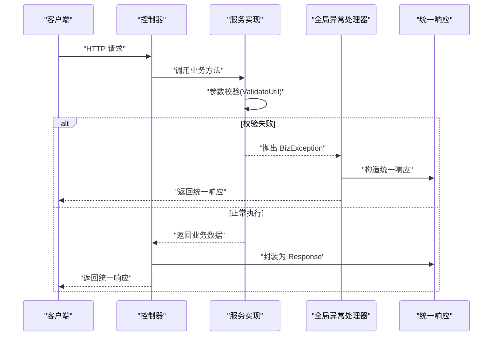
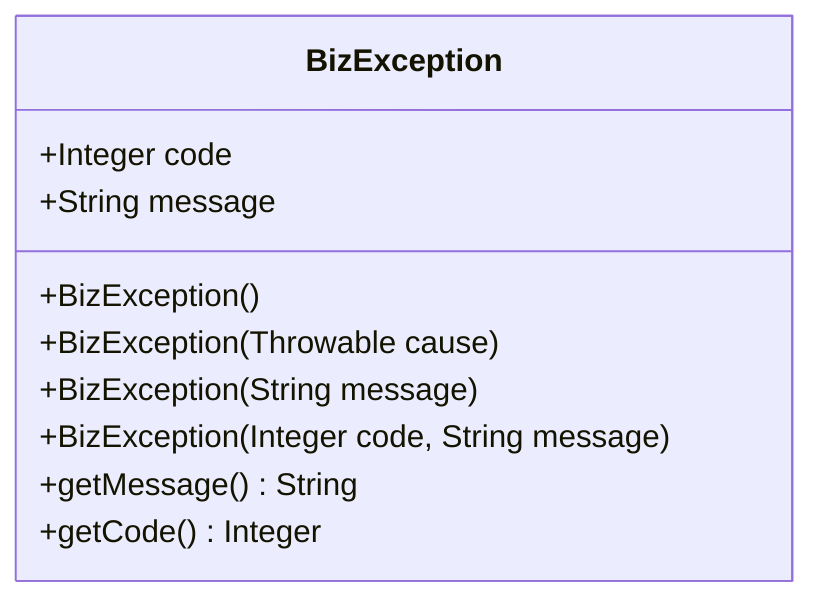
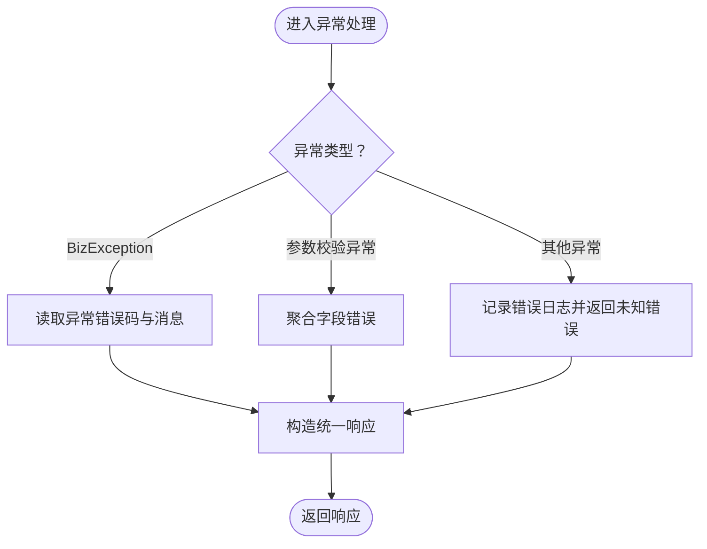
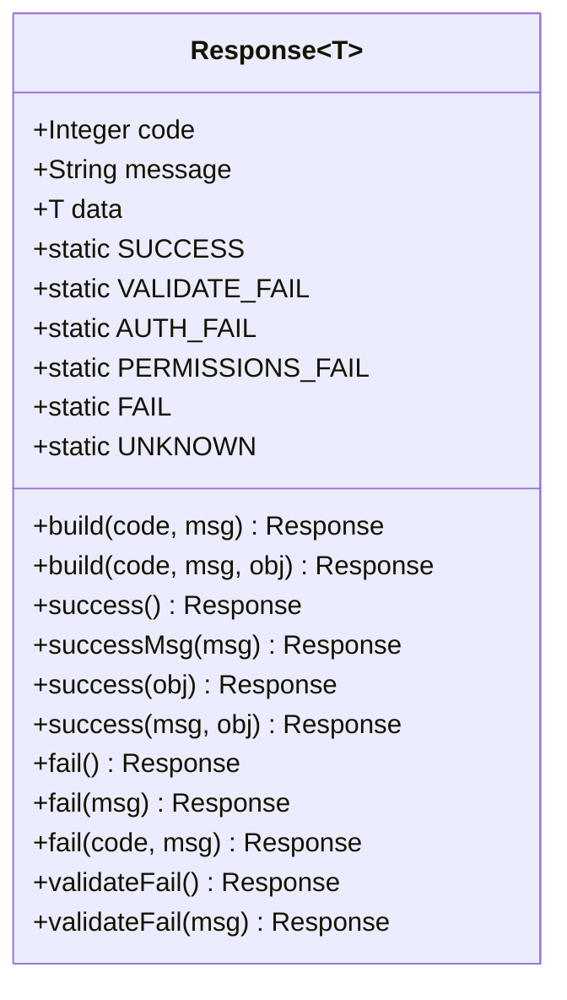
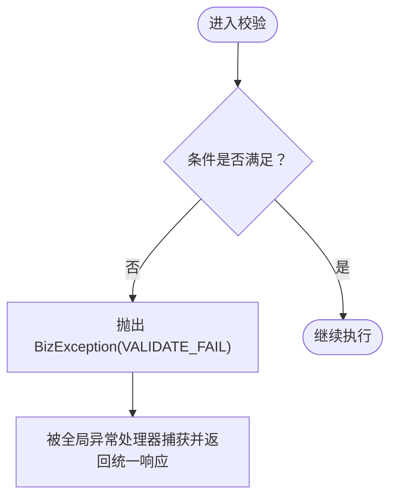
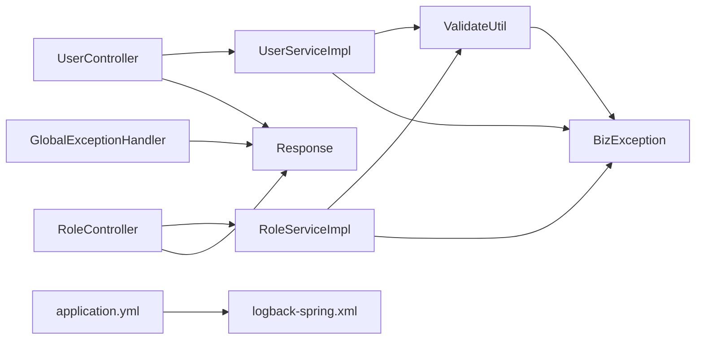

# 异常处理

<cite>
**本文引用的文件**
- [BizException.java](file://src/main/java/com/dw/admin/common/exception/BizException.java)
- [GlobalExceptionHandler.java](file://src/main/java/com/dw/admin/common/exception/GlobalExceptionHandler.java)
- [Response.java](file://src/main/java/com/dw/admin/common/entity/Response.java)
- [ResultMsg.java](file://src/main/java/com/dw/admin/common/constant/ResultMsg.java)
- [ValidateUtil.java](file://src/main/java/com/dw/admin/common/utils/ValidateUtil.java)
- [UserController.java](file://src/main/java/com/dw/admin/controller/UserController.java)
- [RoleController.java](file://src/main/java/com/dw/admin/controller/RoleController.java)
- [UserServiceImpl.java](file://src/main/java/com/dw/admin/service/impl/UserServiceImpl.java)
- [RoleServiceImpl.java](file://src/main/java/com/dw/admin/service/impl/RoleServiceImpl.java)
- [application.yml](file://src/main/resources/application.yml)
- [logback-spring.xml](file://src/main/resources/logback/logback-spring.xml)
</cite>

## 目录
1. [简介](#简介)
2. [项目结构与定位](#项目结构与定位)
3. [核心组件](#核心组件)
4. [架构总览](#架构总览)
5. [详细组件分析](#详细组件分析)
6. [依赖关系分析](#依赖关系分析)
7. [性能与可维护性考量](#性能与可维护性考量)
8. [故障排查指南](#故障排查指南)
9. [结论](#结论)
10. [附录](#附录)

## 简介
本技术文档围绕异常处理系统进行系统化梳理，重点包括：
- 自定义业务异常的设计理念与分类体系
- 全局异常处理器的实现机制与捕获策略
- 统一响应格式的设计与错误码标准化
- 异常信息的国际化与本地化处理现状与建议
- 异常处理最佳实践、调试技巧与常见异常类型处理方案
- 异常监控与告警机制的实现现状与改进建议
- 对用户体验的影响与优雅降级方案

## 项目结构与定位
异常处理相关代码主要分布在以下模块：
- 异常模型与全局处理器：common.exception
- 统一响应封装：common.entity
- 参数校验工具：common.utils
- 控制器层：controller（调用服务层，接收统一响应）
- 服务层：service.impl（抛出业务异常）
- 日志与配置：resources（logback、application）

图表来源
- [GlobalExceptionHandler.java](file://src/main/java/com/dw/admin/common/exception/GlobalExceptionHandler.java#L1-L76)
- [Response.java](file://src/main/java/com/dw/admin/common/entity/Response.java#L1-L132)
- [ValidateUtil.java](file://src/main/java/com/dw/admin/common/utils/ValidateUtil.java#L1-L82)
- [UserController.java](file://src/main/java/com/dw/admin/controller/UserController.java#L1-L138)
- [RoleController.java](file://src/main/java/com/dw/admin/controller/RoleController.java#L1-L108)
- [UserServiceImpl.java](file://src/main/java/com/dw/admin/service/impl/UserServiceImpl.java#L1-L270)
- [RoleServiceImpl.java](file://src/main/java/com/dw/admin/service/impl/RoleServiceImpl.java#L1-L245)
- [application.yml](file://src/main/resources/application.yml#L1-L64)
- [logback-spring.xml](file://src/main/resources/logback/logback-spring.xml#L1-L72)

章节来源
- [GlobalExceptionHandler.java](file://src/main/java/com/dw/admin/common/exception/GlobalExceptionHandler.java#L1-L76)
- [Response.java](file://src/main/java/com/dw/admin/common/entity/Response.java#L1-L132)
- [ValidateUtil.java](file://src/main/java/com/dw/admin/common/utils/ValidateUtil.java#L1-L82)
- [UserController.java](file://src/main/java/com/dw/admin/controller/UserController.java#L1-L138)
- [RoleController.java](file://src/main/java/com/dw/admin/controller/RoleController.java#L1-L108)
- [UserServiceImpl.java](file://src/main/java/com/dw/admin/service/impl/UserServiceImpl.java#L1-L270)
- [RoleServiceImpl.java](file://src/main/java/com/dw/admin/service/impl/RoleServiceImpl.java#L1-L245)
- [application.yml](file://src/main/resources/application.yml#L1-L64)
- [logback-spring.xml](file://src/main/resources/logback/logback-spring.xml#L1-L72)

## 核心组件
- 自定义业务异常 BizException：承载业务错误码与消息，便于在全局处理器中统一处理。
- 全局异常处理器 GlobalExceptionHandler：集中捕获运行时异常、业务异常、参数校验异常，并统一返回 Response。
- 统一响应 Response<T>：标准化接口返回结构，包含 code、message、data，并提供静态构建方法。
- 参数校验工具 ValidateUtil：在服务层前置校验，不符合条件时抛出 BizException。
- 控制器层：直接返回 Response，不暴露底层异常细节。
- 日志与配置：application.yml 指定日志配置；logback-spring.xml 定义日志输出格式与级别。

章节来源
- [BizException.java](file://src/main/java/com/dw/admin/common/exception/BizException.java#L1-L54)
- [GlobalExceptionHandler.java](file://src/main/java/com/dw/admin/common/exception/GlobalExceptionHandler.java#L1-L76)
- [Response.java](file://src/main/java/com/dw/admin/common/entity/Response.java#L1-L132)
- [ValidateUtil.java](file://src/main/java/com/dw/admin/common/utils/ValidateUtil.java#L1-L82)
- [UserController.java](file://src/main/java/com/dw/admin/controller/UserController.java#L1-L138)
- [RoleController.java](file://src/main/java/com/dw/admin/controller/RoleController.java#L1-L108)
- [application.yml](file://src/main/resources/application.yml#L27-L31)
- [logback-spring.xml](file://src/main/resources/logback/logback-spring.xml#L1-L72)

## 架构总览
异常处理流程从控制器到服务层，再到全局异常处理器，最终统一返回响应体。参数校验在服务层前置执行，不符合条件即抛出业务异常，由全局处理器拦截并返回标准响应。

图表来源
- [UserController.java](file://src/main/java/com/dw/admin/controller/UserController.java#L36-L42)
- [UserServiceImpl.java](file://src/main/java/com/dw/admin/service/impl/UserServiceImpl.java#L129-L170)
- [ValidateUtil.java](file://src/main/java/com/dw/admin/common/utils/ValidateUtil.java#L24-L26)
- [GlobalExceptionHandler.java](file://src/main/java/com/dw/admin/common/exception/GlobalExceptionHandler.java#L42-L49)
- [Response.java](file://src/main/java/com/dw/admin/common/entity/Response.java#L75-L95)

## 详细组件分析

### 自定义业务异常 BizException
- 设计理念：继承 RuntimeException，支持携带业务错误码与消息；便于在全局处理器中区分业务异常与其他异常。
- 构造方式：支持无参、Throwable、仅消息、带错误码的消息等构造形式，满足不同场景。
- 使用方式：服务层在参数校验或业务判断失败时抛出；控制器层无需感知具体异常类型，直接接收统一响应。

图表来源
- [BizException.java](file://src/main/java/com/dw/admin/common/exception/BizException.java#L11-L53)

章节来源
- [BizException.java](file://src/main/java/com/dw/admin/common/exception/BizException.java#L1-L54)

### 全局异常处理器 GlobalExceptionHandler
- 捕获范围：
  - Exception.class：兜底处理未预期异常，记录错误日志并返回未知错误。
  - BizException.class：业务异常，优先使用异常内错误码，否则回退到通用失败码。
  - MethodArgumentNotValidException.class：Spring 参数校验异常，聚合字段级错误消息。
  - ConstraintViolationException.class：Bean Validation 异常，直接返回异常消息。
- 日志记录：对业务异常进行日志记录，便于问题追踪与审计。
- 统一返回：所有异常最终转换为 Response，保证接口一致性。

图表来源
- [GlobalExceptionHandler.java](file://src/main/java/com/dw/admin/common/exception/GlobalExceptionHandler.java#L30-L73)
- [Response.java](file://src/main/java/com/dw/admin/common/entity/Response.java#L57-L69)

章节来源
- [GlobalExceptionHandler.java](file://src/main/java/com/dw/admin/common/exception/GlobalExceptionHandler.java#L1-L76)

### 统一响应 Response<T>
- 结构设计：code、message、data 三段式结构，配合静态工厂方法快速构建成功、失败、校验失败等响应。
- 错误码标准化：定义 SUCCESS、VALIDATE_FAIL、AUTH_FAIL、PERMISSIONS_FAIL、FAIL、UNKNOWN 等标准码，便于前后端约定。
- 返回描述：内置默认文案，可在后续扩展国际化支持。

图表来源
- [Response.java](file://src/main/java/com/dw/admin/common/entity/Response.java#L14-L132)

章节来源
- [Response.java](file://src/main/java/com/dw/admin/common/entity/Response.java#L1-L132)

### 参数校验工具 ValidateUtil
- 功能：提供 isNull、isEmpty、isTrue/isFalse 等断言方法，不符合条件时抛出 BizException。
- 错误码：统一使用 VALIDATE_FAIL 错误码，确保校验失败与业务异常一致的处理路径。
- 位置：服务层前置校验，避免无效请求进入复杂业务逻辑。

图表来源
- [ValidateUtil.java](file://src/main/java/com/dw/admin/common/utils/ValidateUtil.java#L24-L26)
- [GlobalExceptionHandler.java](file://src/main/java/com/dw/admin/common/exception/GlobalExceptionHandler.java#L54-L65)

章节来源
- [ValidateUtil.java](file://src/main/java/com/dw/admin/common/utils/ValidateUtil.java#L1-L82)

### 控制器层与服务层协作
- 控制器：接收参数并进行基础校验（@Validated），调用服务层，直接返回 Response.success(...) 或 Response.fail(...)。
- 服务层：前置参数校验（ValidateUtil），业务判断失败抛出 BizException；数据库或外部依赖异常交由全局处理器兜底。
- 优点：控制器与服务层职责清晰，异常处理集中在全局处理器，接口返回一致。

章节来源
- [UserController.java](file://src/main/java/com/dw/admin/controller/UserController.java#L36-L42)
- [RoleController.java](file://src/main/java/com/dw/admin/controller/RoleController.java#L64-L67)
- [UserServiceImpl.java](file://src/main/java/com/dw/admin/service/impl/UserServiceImpl.java#L129-L170)
- [RoleServiceImpl.java](file://src/main/java/com/dw/admin/service/impl/RoleServiceImpl.java#L118-L147)

## 依赖关系分析
- 控制器依赖服务层，服务层依赖 ValidateUtil 与 BizException，全局异常处理器依赖 Response。
- 全局异常处理器作为横切关注点，对异常进行统一拦截与转换。
- 日志配置通过 application.yml 指向 logback-spring.xml，统一输出格式与级别。

图表来源
- [UserController.java](file://src/main/java/com/dw/admin/controller/UserController.java#L29-L30)
- [RoleController.java](file://src/main/java/com/dw/admin/controller/RoleController.java#L31-L32)
- [UserServiceImpl.java](file://src/main/java/com/dw/admin/service/impl/UserServiceImpl.java#L14-L14)
- [RoleServiceImpl.java](file://src/main/java/com/dw/admin/service/impl/RoleServiceImpl.java#L14-L14)
- [ValidateUtil.java](file://src/main/java/com/dw/admin/common/utils/ValidateUtil.java#L5-L5)
- [BizException.java](file://src/main/java/com/dw/admin/common/exception/BizException.java#L11-L11)
- [GlobalExceptionHandler.java](file://src/main/java/com/dw/admin/common/exception/GlobalExceptionHandler.java#L22-L22)
- [Response.java](file://src/main/java/com/dw/admin/common/entity/Response.java#L14-L14)
- [application.yml](file://src/main/resources/application.yml#L28-L29)
- [logback-spring.xml](file://src/main/resources/logback/logback-spring.xml#L1-L72)

章节来源
- [application.yml](file://src/main/resources/application.yml#L27-L31)
- [logback-spring.xml](file://src/main/resources/logback/logback-spring.xml#L1-L72)

## 性能与可维护性考量
- 性能影响：全局异常处理器仅在异常发生时介入，正常路径零开销；日志输出按级别分桶，避免过多 IO。
- 可维护性：统一错误码与响应结构，便于前端对接；异常处理集中，降低重复代码。
- 建议优化：
  - 在高并发场景下，对未知异常进行限流与熔断，避免雪崩。
  - 对频繁触发的业务异常增加缓存或降级策略，减少数据库压力。
  - 对日志量较大的异常类型增加采样率，平衡可观测性与性能。

[本节为通用建议，不直接分析具体文件]

## 故障排查指南
- 如何定位业务异常：
  - 查看全局异常处理器的日志记录，确认异常类型与错误码。
  - 在服务层抛出 BizException 的位置添加更详细的上下文信息，便于定位。
- 参数校验失败：
  - 关注 MethodArgumentNotValidException 与 ConstraintViolationException 的聚合错误消息，逐项修复。
- 日志与配置：
  - 检查 application.yml 中 logging 配置是否生效。
  - 检查 logback-spring.xml 的输出级别与文件路径，确保错误日志落盘。

章节来源
- [GlobalExceptionHandler.java](file://src/main/java/com/dw/admin/common/exception/GlobalExceptionHandler.java#L30-L73)
- [application.yml](file://src/main/resources/application.yml#L27-L31)
- [logback-spring.xml](file://src/main/resources/logback/logback-spring.xml#L65-L69)

## 结论
该异常处理体系通过“前置校验 + 业务异常 + 全局统一处理 + 统一响应”的模式，实现了清晰的异常边界与一致的对外接口。建议在现有基础上进一步完善国际化、监控告警与优雅降级能力，以提升系统的稳定性与可运维性。

[本节为总结性内容，不直接分析具体文件]

## 附录

### 错误码与状态语义对照
- SUCCESS：200，表示业务受理成功
- VALIDATE_FAIL：400，参数校验不通过
- AUTH_FAIL：401，鉴权失败
- PERMISSIONS_FAIL：403，权限不足
- FAIL：500，业务处理失败
- UNKNOWN：999，未知错误

章节来源
- [Response.java](file://src/main/java/com/dw/admin/common/entity/Response.java#L32-L47)

### 国际化与本地化处理现状与建议
- 现状：返回描述采用中文常量，未见国际化配置与切换逻辑。
- 建议：
  - 引入 Spring MessageSource，按语言环境加载文案。
  - 在 Response 中增加 locale 参数或通过请求头识别语言。
  - 对 BizException 的 message 支持占位符替换，便于动态拼接。

[本节为概念性建议，不直接分析具体文件]

### 常见异常类型与恢复策略
- 参数校验异常：
  - 策略：聚合字段错误，提示用户修正；必要时返回部分字段错误明细。
- 业务异常（如用户不存在、角色已存在）：
  - 策略：返回明确业务原因，引导用户重试或变更输入。
- 未知异常：
  - 策略：记录 traceId 并返回统一错误码，后台定位问题后修复。

[本节为通用指导，不直接分析具体文件]

### 异常监控与告警机制现状与建议
- 现状：日志输出已配置，但未见专门的异常监控与告警集成。
- 建议：
  - 在全局异常处理器中增加 traceId 与用户标识，便于链路追踪。
  - 对高频业务异常设置阈值告警，结合日志平台进行可视化。
  - 对未知异常进行自动上报与分级告警，保障线上稳定。

[本节为通用建议，不直接分析具体文件]

### 对用户体验的影响与优雅降级方案
- 影响：异常统一返回有助于前端稳定展示，避免因异常类型差异导致的 UI 不一致。
- 方案：
  - 对网络波动或第三方依赖超时，提供重试与缓存兜底。
  - 对权限不足场景，引导用户跳转授权页面或提示重新登录。
  - 对参数错误，提供即时反馈与修复建议。

[本节为通用建议，不直接分析具体文件]