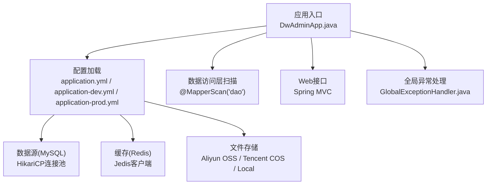
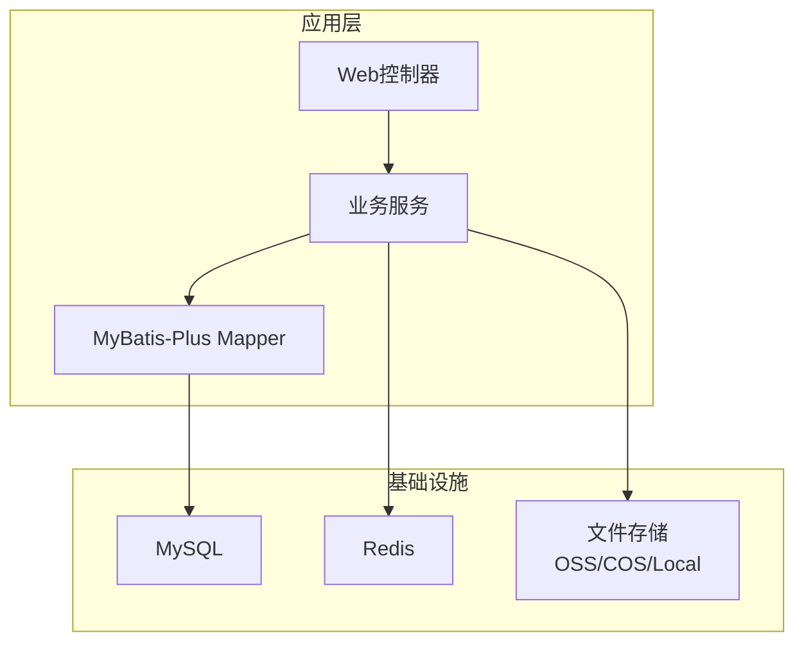
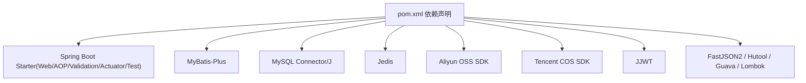

# 快速开始

<cite>
**本文引用的文件**
- [README.md](file://README.md)
- [pom.xml](file://pom.xml)
- [src/main/resources/application.yml](file://src/main/resources/application.yml)
- [src/main/resources/application-dev.yml](file://src/main/resources/application-dev.yml)
- [src/main/resources/application-prod.yml](file://src/main/resources/application-prod.yml)
- [docs/sql/init_ddl.sql](file://docs/sql/init_ddl.sql)
- [Dockerfile](file://Dockerfile)
- [docker-compose.yml](file://docker-compose.yml)
- [run.sh](file://run.sh)
- [build.sh](file://build.sh)
- [stop.sh](file://stop.sh)
- [src/main/java/com/dw/admin/DwAdminApp.java](file://src/main/java/com/dw/admin/DwAdminApp.java)
- [src/main/java/com/dw/admin/common/exception/GlobalExceptionHandler.java](file://src/main/java/com/dw/admin/common/exception/GlobalExceptionHandler.java)
</cite>

## 目录
1. [简介](#简介)
2. [项目结构](#项目结构)
3. [核心组件](#核心组件)
4. [架构总览](#架构总览)
5. [详细组件分析](#详细组件分析)
6. [依赖分析](#依赖分析)
7. [性能考虑](#性能考虑)
8. [故障排查指南](#故障排查指南)
9. [结论](#结论)
10. [附录](#附录)

## 简介
本指南面向新手开发者，帮助你在约30分钟内完成DW后台管理系统的环境准备、数据库初始化、配置与启动，并提供常见问题排查与Docker部署方案。系统基于Spring Boot 3.5.6、Java 21、MySQL、Redis与多种文件存储服务（阿里云OSS、腾讯云COS、本地存储），通过Maven进行构建与打包。

## 项目结构
- 应用入口位于主类，负责启动Spring Boot应用并扫描DAO层。
- 配置文件采用多环境分离：默认开发环境，生产环境可切换。
- 数据库初始化SQL位于docs/sql目录，包含用户、角色、文件、登录日志等表结构。
- Dockerfile与docker-compose.yml提供容器化构建与运行方案。
- Maven脚本与Shell脚本用于本地构建、运行与停止。

图表来源
- [src/main/java/com/dw/admin/DwAdminApp.java](file://src/main/java/com/dw/admin/DwAdminApp.java#L1-L25)
- [src/main/resources/application.yml](file://src/main/resources/application.yml#L1-L64)
- [src/main/java/com/dw/admin/common/exception/GlobalExceptionHandler.java](file://src/main/java/com/dw/admin/common/exception/GlobalExceptionHandler.java#L1-L76)

章节来源
- [src/main/java/com/dw/admin/DwAdminApp.java](file://src/main/java/com/dw/admin/DwAdminApp.java#L1-L25)
- [src/main/resources/application.yml](file://src/main/resources/application.yml#L1-L64)

## 核心组件
- 应用入口与启动
  - 主类负责启动Spring Boot应用并打印启动日志。
- 配置体系
  - 默认使用开发环境配置；可通过激活profile切换至生产环境。
  - 关键配置项包括：端口、数据源、MyBatis-Plus映射路径、日志配置、鉴权密钥、Redis连接、文件存储提供商与凭证。
- 异常处理
  - 全局异常处理器统一返回响应体，便于前端与接口调试。

章节来源
- [src/main/java/com/dw/admin/DwAdminApp.java](file://src/main/java/com/dw/admin/DwAdminApp.java#L1-L25)
- [src/main/resources/application.yml](file://src/main/resources/application.yml#L1-L64)
- [src/main/java/com/dw/admin/common/exception/GlobalExceptionHandler.java](file://src/main/java/com/dw/admin/common/exception/GlobalExceptionHandler.java#L1-L76)

## 架构总览
下图展示从请求到数据库与缓存的关键交互路径，以及文件存储的扩展能力。

图表来源
- [src/main/resources/application.yml](file://src/main/resources/application.yml#L9-L25)
- [src/main/resources/application.yml](file://src/main/resources/application.yml#L33-L64)

## 详细组件分析

### 环境要求与依赖安装
- Java 21
  - 项目属性中明确指定Java版本为21。
- Maven
  - 使用Maven进行构建与打包，支持本地Maven Wrapper脚本。
- MySQL
  - 数据源驱动与URL在配置文件中定义；需先创建数据库与表结构。
- Redis
  - 作为鉴权与权限缓存的后端，需独立部署并配置连接信息。
- 文件存储
  - 支持阿里云OSS、腾讯云COS与本地存储，按需启用并填写凭证。

章节来源
- [pom.xml](file://pom.xml#L20-L22)
- [src/main/resources/application.yml](file://src/main/resources/application.yml#L9-L25)
- [src/main/resources/application.yml](file://src/main/resources/application.yml#L37-L64)

### 数据库初始化步骤
- 创建数据库与表结构
  - 使用提供的DDL脚本创建数据库与各业务表。
- 初始化数据
  - 可根据需要在初始化后插入基础数据（如管理员账号、默认角色等）。

章节来源
- [docs/sql/init_ddl.sql](file://docs/sql/init_ddl.sql#L1-L93)

### 配置文件设置
- 默认配置
  - 开发环境配置文件提供本地数据库、Redis连接与文件存储示例。
  - 生产环境配置文件提供远程数据库与Redis连接示例。
- 关键字段说明
  - 数据源：驱动类名、连接URL、用户名、密码、连接池参数。
  - 日志：Logback配置路径与DAO层日志级别。
  - 鉴权：缓存类型与密钥。
  - Redis：连接URL与密码。
  - 文件存储：提供商选择与对应凭证、前缀路径、URL过期时间等。

章节来源
- [src/main/resources/application.yml](file://src/main/resources/application.yml#L1-L64)
- [src/main/resources/application-dev.yml](file://src/main/resources/application-dev.yml#L1-L88)
- [src/main/resources/application-prod.yml](file://src/main/resources/application-prod.yml#L1-L71)

### 项目启动流程
- 本地启动（推荐）
  - 使用Maven直接启动Spring Boot应用。
- 本地打包与运行
  - 跳过测试打包后，使用Java命令运行生成的JAR文件。
- Shell脚本辅助
  - 提供构建镜像、运行容器与停止应用的脚本。
- Docker Compose部署
  - 通过Compose文件拉起应用容器，挂载日志目录与生产配置文件。

章节来源
- [README.md](file://README.md#L17-L25)
- [README.md](file://README.md#L32-L40)
- [README.md](file://README.md#L42-L50)
- [run.sh](file://run.sh#L1-L5)
- [build.sh](file://build.sh#L1-L5)
- [docker-compose.yml](file://docker-compose.yml#L1-L27)

### Docker构建与运行
- 构建镜像
  - 使用多阶段构建，先在Builder阶段执行Maven打包，再复制到运行时JRE镜像。
- 运行容器
  - 暴露端口8020，挂载日志目录，设置时区与激活生产配置文件。
- Compose运行
  - 指定镜像、端口映射、重启策略、卷挂载与环境变量。

章节来源
- [Dockerfile](file://Dockerfile#L1-L19)
- [docker-compose.yml](file://docker-compose.yml#L1-L27)
- [README.md](file://README.md#L42-L50)

## 依赖分析
- 核心框架与组件
  - Spring Web、AOP、Validation、Actuator、MyBatis-Plus、Jedis、JWT、FastJSON2、Hutool、Guava等。
- 数据库与连接池
  - MySQL Connector/J与HikariCP连接池。
- 文件存储
  - 阿里云OSS与腾讯云COS SDK。
- 构建与仓库
  - Spring Boot Maven Plugin、Maven Compiler Plugin、阿里云Maven仓库镜像。

图表来源
- [pom.xml](file://pom.xml#L25-L162)

章节来源
- [pom.xml](file://pom.xml#L1-L205)

## 性能考虑
- 连接池与线程
  - 合理配置HikariCP连接池大小以匹配并发访问。
- 缓存策略
  - Redis作为鉴权与权限缓存，建议开启并合理设置过期时间。
- 文件上传
  - 控制单文件与请求总大小，避免内存压力过大。
- 并发与异步
  - 应用已启用异步与定时任务注解，可按需扩展异步处理逻辑。

## 故障排查指南
- 端口占用
  - 若端口8020被占用，可在配置文件中调整server.port或释放端口。
- 数据库连接失败
  - 检查数据库URL、用户名、密码与网络连通性；确认数据库与表已初始化。
- Redis连接失败
  - 检查Redis连接URL与密码；确保Redis服务可用。
- 文件存储凭证错误
  - 校验OSS/COS的AccessKey/SecretKey/Region/Bucket等配置。
- 启动日志定位
  - 查看应用日志输出，结合全局异常处理器返回的错误信息定位问题。
- 停止应用
  - 使用提供的脚本按进程ID安全终止应用。

章节来源
- [src/main/resources/application.yml](file://src/main/resources/application.yml#L1-L64)
- [src/main/java/com/dw/admin/common/exception/GlobalExceptionHandler.java](file://src/main/java/com/dw/admin/common/exception/GlobalExceptionHandler.java#L1-L76)
- [stop.sh](file://stop.sh#L1-L34)

## 结论
按照本指南完成环境准备、数据库初始化与配置后，你可以在本地或容器环境中快速启动DW后台管理系统。若遇到问题，优先检查数据库与Redis连通性、配置文件中的敏感信息与端口占用情况。生产部署建议使用Docker Compose并结合外部数据库与Redis服务。

## 附录

### 常用命令清单
- 清理项目
  - mvn clean
- 编译项目
  - mvn compile
- 启动项目
  - mvn spring-boot:run
- 停止项目
  - ./stop.sh
- 测试项目
  - mvn test
- 打包项目（跳过测试）
  - mvn install -Dmaven.test.skip=true
- 运行打包后的JAR文件
  - java -jar target/dw-admin-1.0.0.jar
- 构建镜像
  - docker build -t dw-admin:1.0.0 .
- 运行容器
  - docker run -d -p 8020:8020 -v ./logs:/app/logs -e TZ=Asia/Shanghai -e SPRING_PROFILES_ACTIVE=dev --name dw-admin dw-admin:1.0.0

章节来源
- [README.md](file://README.md#L7-L50)
- [run.sh](file://run.sh#L1-L5)