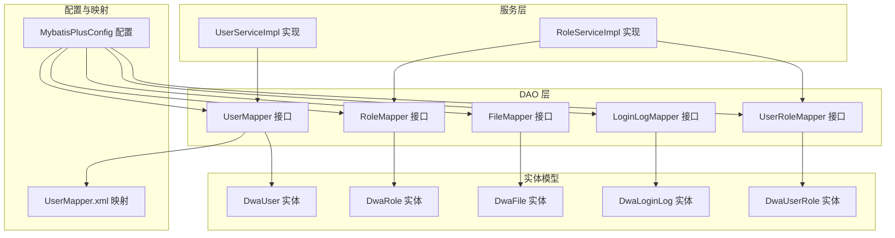
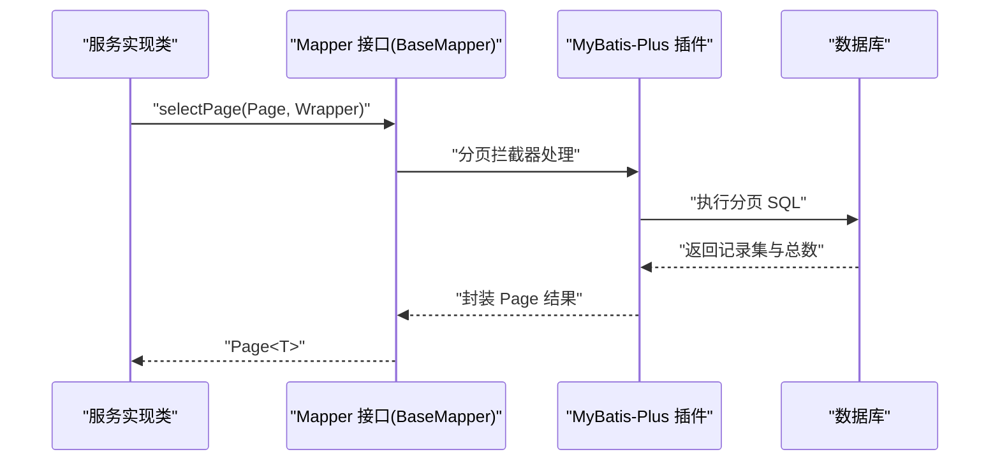
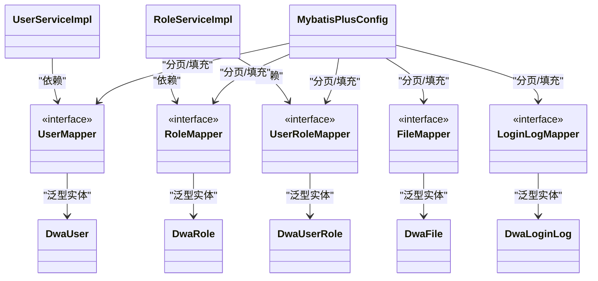

# Mapper 接口设计

<cite>
**本文引用的文件**
- [UserMapper.java](file://src/main/java/com/dw/admin/dao/UserMapper.java)
- [RoleMapper.java](file://src/main/java/com/dw/admin/dao/RoleMapper.java)
- [FileMapper.java](file://src/main/java/com/dw/admin/dao/FileMapper.java)
- [LoginLogMapper.java](file://src/main/java/com/dw/admin/dao/LoginLogMapper.java)
- [UserRoleMapper.java](file://src/main/java/com/dw/admin/dao/UserRoleMapper.java)
- [UserMapper.xml](file://src/main/resources/mapper/UserMapper.xml)
- [MybatisPlusConfig.java](file://src/main/java/com/dw/admin/config/MybatisPlusConfig.java)
- [UserServiceImpl.java](file://src/main/java/com/dw/admin/service/impl/UserServiceImpl.java)
- [RoleServiceImpl.java](file://src/main/java/com/dw/admin/service/impl/RoleServiceImpl.java)
- [DwaUser.java](file://src/main/java/com/dw/admin/model/entity/DwaUser.java)
- [DwaRole.java](file://src/main/java/com/dw/admin/model/entity/DwaRole.java)
- [DwaFile.java](file://src/main/java/com/dw/admin/model/entity/DwaFile.java)
- [DwaLoginLog.java](file://src/main/java/com/dw/admin/model/entity/DwaLoginLog.java)
- [DwaUserRole.java](file://src/main/java/com/dw/admin/model/entity/DwaUserRole.java)
- [PageParam.java](file://src/main/java/com/dw/admin/common/entity/PageParam.java)
</cite>

## 目录
1. [引言](#引言)
2. [项目结构](#项目结构)
3. [核心组件](#核心组件)
4. [架构总览](#架构总览)
5. [详细组件分析](#详细组件分析)
6. [依赖关系分析](#依赖关系分析)
7. [性能考量](#性能考量)
8. [故障排查指南](#故障排查指南)
9. [结论](#结论)
10. [附录](#附录)

## 引言
本文件围绕项目中的 Mapper 接口设计进行系统化技术说明，重点覆盖以下方面：
- Mapper 接口命名规范与设计原则
- BaseMapper 通用方法的使用与自定义扩展
- 条件构造器 QueryWrapper/LambdaQueryWrapper 的链式调用技巧
- 类型安全优势与最佳实践
- 复杂查询构建与性能优化建议
- 常见查询模式与业务场景实战案例
- 面向开发者的实用使用指南

## 项目结构
本项目采用典型的分层架构，Mapper 层位于 DAO 层，配合 MyBatis-Plus 提供的 BaseMapper 实现快速 CRUD；服务层通过注入 Mapper 完成业务逻辑编排；XML 映射文件用于补充通用字段映射与可选 SQL。

图表来源
- [UserMapper.java](file://src/main/java/com/dw/admin/dao/UserMapper.java#L1-L16)
- [RoleMapper.java](file://src/main/java/com/dw/admin/dao/RoleMapper.java#L1-L17)
- [FileMapper.java](file://src/main/java/com/dw/admin/dao/FileMapper.java#L1-L17)
- [LoginLogMapper.java](file://src/main/java/com/dw/admin/dao/LoginLogMapper.java#L1-L18)
- [UserRoleMapper.java](file://src/main/java/com/dw/admin/dao/UserRoleMapper.java#L1-L16)
- [UserMapper.xml](file://src/main/resources/mapper/UserMapper.xml#L1-L23)
- [MybatisPlusConfig.java](file://src/main/java/com/dw/admin/config/MybatisPlusConfig.java#L1-L53)
- [UserServiceImpl.java](file://src/main/java/com/dw/admin/service/impl/UserServiceImpl.java#L1-L270)
- [RoleServiceImpl.java](file://src/main/java/com/dw/admin/service/impl/RoleServiceImpl.java#L1-L245)
- [DwaUser.java](file://src/main/java/com/dw/admin/model/entity/DwaUser.java#L1-L73)
- [DwaRole.java](file://src/main/java/com/dw/admin/model/entity/DwaRole.java#L1-L71)
- [DwaFile.java](file://src/main/java/com/dw/admin/model/entity/DwaFile.java#L1-L88)
- [DwaLoginLog.java](file://src/main/java/com/dw/admin/model/entity/DwaLoginLog.java#L1-L80)
- [DwaUserRole.java](file://src/main/java/com/dw/admin/model/entity/DwaUserRole.java#L1-L55)

章节来源
- [UserMapper.java](file://src/main/java/com/dw/admin/dao/UserMapper.java#L1-L16)
- [RoleMapper.java](file://src/main/java/com/dw/admin/dao/RoleMapper.java#L1-L17)
- [FileMapper.java](file://src/main/java/com/dw/admin/dao/FileMapper.java#L1-L17)
- [LoginLogMapper.java](file://src/main/java/com/dw/admin/dao/LoginLogMapper.java#L1-L18)
- [UserRoleMapper.java](file://src/main/java/com/dw/admin/dao/UserRoleMapper.java#L1-L16)
- [UserMapper.xml](file://src/main/resources/mapper/UserMapper.xml#L1-L23)
- [MybatisPlusConfig.java](file://src/main/java/com/dw/admin/config/MybatisPlusConfig.java#L1-L53)

## 核心组件
- Mapper 接口均继承 BaseMapper，天然具备通用 CRUD 能力，无需编写 XML 即可完成常见操作。
- 实体类通过注解标注表名、主键策略与字段填充规则，确保 ORM 映射一致且自动维护时间戳。
- 服务层通过资源注入 Mapper，结合条件构造器与分页插件，实现复杂查询与批量操作。
- MyBatis-Plus 全局配置启用分页插件与元对象处理器，统一处理插入/更新时间字段。

章节来源
- [UserMapper.java](file://src/main/java/com/dw/admin/dao/UserMapper.java#L13-L13)
- [RoleMapper.java](file://src/main/java/com/dw/admin/dao/RoleMapper.java#L14-L14)
- [FileMapper.java](file://src/main/java/com/dw/admin/dao/FileMapper.java#L14-L14)
- [LoginLogMapper.java](file://src/main/java/com/dw/admin/dao/LoginLogMapper.java#L15-L15)
- [UserRoleMapper.java](file://src/main/java/com/dw/admin/dao/UserRoleMapper.java#L13-L13)
- [DwaUser.java](file://src/main/java/com/dw/admin/model/entity/DwaUser.java#L24-L71)
- [DwaRole.java](file://src/main/java/com/dw/admin/model/entity/DwaRole.java#L23-L69)
- [DwaFile.java](file://src/main/java/com/dw/admin/model/entity/DwaFile.java#L24-L86)
- [DwaLoginLog.java](file://src/main/java/com/dw/admin/model/entity/DwaLoginLog.java#L26-L76)
- [DwaUserRole.java](file://src/main/java/com/dw/admin/model/entity/DwaUserRole.java#L23-L53)
- [MybatisPlusConfig.java](file://src/main/java/com/dw/admin/config/MybatisPlusConfig.java#L27-L50)

## 架构总览
下图展示服务层调用 Mapper 的典型流程，以及分页与字段填充的全局配置参与点。

图表来源
- [UserServiceImpl.java](file://src/main/java/com/dw/admin/service/impl/UserServiceImpl.java#L262-L266)
- [RoleServiceImpl.java](file://src/main/java/com/dw/admin/service/impl/RoleServiceImpl.java#L94-L98)
- [MybatisPlusConfig.java](file://src/main/java/com/dw/admin/config/MybatisPlusConfig.java#L28-L33)

## 详细组件分析

### 组件一：基础 Mapper 接口与命名规范
- 命名规范
  - 接口名：以“实体名 + Mapper”命名，如 UserMapper、RoleMapper、FileMapper、LoginLogMapper、UserRoleMapper。
  - 包结构：统一置于 dao 包下，便于扫描与管理。
  - 继承 BaseMapper：直接继承，获得通用 CRUD 方法，减少重复 XML。
- 设计原则
  - 保持单一职责：每个 Mapper 对应一张表。
  - 与实体类一一对应：实体类注解声明表名与字段映射，Mapper 仅负责数据访问。
  - 最小暴露：仅公开必要的查询/更新方法，复杂逻辑在服务层组合。

章节来源
- [UserMapper.java](file://src/main/java/com/dw/admin/dao/UserMapper.java#L1-L16)
- [RoleMapper.java](file://src/main/java/com/dw/admin/dao/RoleMapper.java#L1-L17)
- [FileMapper.java](file://src/main/java/com/dw/admin/dao/FileMapper.java#L1-L17)
- [LoginLogMapper.java](file://src/main/java/com/dw/admin/dao/LoginLogMapper.java#L1-L18)
- [UserRoleMapper.java](file://src/main/java/com/dw/admin/dao/UserRoleMapper.java#L1-L16)

### 组件二：BaseMapper 通用方法使用与扩展
- 常用通用方法
  - 插入：insert(T)
  - 批量插入：insertBatchSomeColumn(List<T>)
  - 更新：updateById(T)、update(T, Wrapper)
  - 删除：deleteById(Serializable)、deleteBatchIds(Collection<?>)
  - 查询：selectById、selectBatchIds、selectList、selectPage、selectMaps、selectObjs
- 自定义扩展
  - 在 Mapper 接口中新增方法签名，并在 XML 中编写 SQL 或使用注解 SQL。
  - 若需复用通用字段映射，可在 XML 中复用通用 resultMap 与列清单。
- 示例参考
  - 用户分页查询中使用 selectPage 与 LambdaQueryWrapper。
  - 角色分页查询中使用 selectPage 与 LambdaQueryWrapper。
  - XML 中定义了通用结果映射与列清单，便于复用。

章节来源
- [UserServiceImpl.java](file://src/main/java/com/dw/admin/service/impl/UserServiceImpl.java#L262-L266)
- [RoleServiceImpl.java](file://src/main/java/com/dw/admin/service/impl/RoleServiceImpl.java#L94-L98)
- [UserMapper.xml](file://src/main/resources/mapper/UserMapper.xml#L5-L20)

### 组件三：条件构造器 QueryWrapper 与 LambdaQueryWrapper
- QueryWrapper
  - 适用于传统写法，适合动态拼接条件。
  - 示例：基于 QueryWrapper 设置实体后进行查询。
- LambdaQueryWrapper
  - 通过 Lambda 表达式引用字段，避免硬编码字符串，提升类型安全与重构友好性。
  - 示例：eq、like、in、orderByAsc/Desc 等链式调用。
- 链式调用技巧
  - 条件拼接：根据参数是否为空决定是否加入条件，避免无效过滤。
  - 动态排序：默认按更新时间倒序，支持按创建/更新时间升/降序切换。
  - 组合条件：使用 or() 组合多条件，如角色新增时对 roleCode 与 roleName 去重校验。

章节来源
- [UserServiceImpl.java](file://src/main/java/com/dw/admin/service/impl/UserServiceImpl.java#L60-L65)
- [UserServiceImpl.java](file://src/main/java/com/dw/admin/service/impl/UserServiceImpl.java#L80-L82)
- [UserServiceImpl.java](file://src/main/java/com/dw/admin/service/impl/UserServiceImpl.java#L136-L139)
- [UserServiceImpl.java](file://src/main/java/com/dw/admin/service/impl/UserServiceImpl.java#L233-L259)
- [RoleServiceImpl.java](file://src/main/java/com/dw/admin/service/impl/RoleServiceImpl.java#L66-L92)
- [RoleServiceImpl.java](file://src/main/java/com/dw/admin/service/impl/RoleServiceImpl.java#L124-L127)
- [RoleServiceImpl.java](file://src/main/java/com/dw/admin/service/impl/RoleServiceImpl.java#L175-L178)

### 组件四：类型安全优势与最佳实践
- 类型安全
  - 使用 LambdaQueryWrapper 可避免字段名拼写错误与重构后失效问题。
  - 编译期检查字段是否存在，降低运行时异常风险。
- 最佳实践
  - 参数判空：先判断参数是否为空再拼接条件，避免无效过滤。
  - 默认排序：未指定排序时提供合理默认（如按更新时间倒序）。
  - 动态排序：支持多字段排序，优先使用枚举值控制升降序。
  - 组合条件：使用 or()、and() 明确逻辑关系，避免歧义。
  - 分页：统一使用 Page 对象与 MyBatis-Plus 分页插件，避免全量加载。

章节来源
- [UserServiceImpl.java](file://src/main/java/com/dw/admin/service/impl/UserServiceImpl.java#L233-L259)
- [RoleServiceImpl.java](file://src/main/java/com/dw/admin/service/impl/RoleServiceImpl.java#L66-L92)
- [MybatisPlusConfig.java](file://src/main/java/com/dw/admin/config/MybatisPlusConfig.java#L28-L33)

### 组件五：复杂查询构建与性能优化
- 复杂查询构建
  - 多表关联：通过服务层组合多次查询或使用原生 SQL/存储过程（如用户角色关联查询）。
  - 动态筛选：根据前端传参动态拼接 where 条件，注意索引字段优先。
  - 排序与分页：统一在 Wrapper 中设置排序，在 Service 中设置 Page，避免 N+1。
- 性能优化建议
  - 合理使用索引：对高频过滤字段（如用户名、角色码）建立索引。
  - 控制返回列：尽量只查询必要字段，避免 SELECT *。
  - 分页参数校验：使用 PageParam 校验 pageNum/pageSize，防止过大分页导致内存压力。
  - 批量操作：使用 insertBatchSomeColumn 等批量方法减少往返次数。
  - 元对象填充：利用全局填充器自动维护创建/更新时间，减少手动赋值。

章节来源
- [RoleServiceImpl.java](file://src/main/java/com/dw/admin/service/impl/RoleServiceImpl.java#L167-L181)
- [RoleServiceImpl.java](file://src/main/java/com/dw/admin/service/impl/RoleServiceImpl.java#L193-L205)
- [PageParam.java](file://src/main/java/com/dw/admin/common/entity/PageParam.java#L26-L33)
- [MybatisPlusConfig.java](file://src/main/java/com/dw/admin/config/MybatisPlusConfig.java#L39-L49)

### 组件六：常用查询模式与业务场景
- 场景一：用户注册与登录
  - 注册：使用 QueryWrapper 校验用户名是否存在，不存在则加密保存。
  - 登录：使用 LambdaQueryWrapper 按用户名查询，比对密码后生成令牌并异步记录登录日志。
- 场景二：用户信息维护
  - 新增：校验用户名唯一，加密密码后插入。
  - 修改：按 ID 查询后按需更新邮箱、手机、头像等字段，统一设置更新时间。
- 场景三：分页查询与排序
  - 用户分页：支持按名称、邮箱、手机模糊查询，支持默认与自定义排序。
  - 角色分页：支持角色码、名称、状态过滤，支持默认与自定义排序。
- 场景四：用户角色管理
  - 查询用户角色：先查用户角色关联表，再按角色码批量查询角色，过滤禁用状态。
  - 保存用户角色：先删除旧角色，再批量插入新角色，异步清理权限缓存。

章节来源
- [UserServiceImpl.java](file://src/main/java/com/dw/admin/service/impl/UserServiceImpl.java#L58-L72)
- [UserServiceImpl.java](file://src/main/java/com/dw/admin/service/impl/UserServiceImpl.java#L78-L108)
- [UserServiceImpl.java](file://src/main/java/com/dw/admin/service/impl/UserServiceImpl.java#L129-L170)
- [UserServiceImpl.java](file://src/main/java/com/dw/admin/service/impl/UserServiceImpl.java#L231-L267)
- [RoleServiceImpl.java](file://src/main/java/com/dw/admin/service/impl/RoleServiceImpl.java#L64-L99)
- [RoleServiceImpl.java](file://src/main/java/com/dw/admin/service/impl/RoleServiceImpl.java#L163-L181)
- [RoleServiceImpl.java](file://src/main/java/com/dw/admin/service/impl/RoleServiceImpl.java#L188-L212)

### 组件七：实体类与字段映射
- 实体类注解
  - @TableName：声明表名，保证 ORM 映射一致性。
  - @TableId/@TableField：声明主键与字段映射，支持插入/更新自动填充。
  - @Serial：序列化标识，保证跨进程传输安全。
- 字段填充
  - 全局配置 MetaObjectHandler：插入时填充创建时间，更新时填充更新时间。
- 映射文件
  - UserMapper.xml 定义通用 resultMap 与列清单，便于复用。

章节来源
- [DwaUser.java](file://src/main/java/com/dw/admin/model/entity/DwaUser.java#L24-L71)
- [DwaRole.java](file://src/main/java/com/dw/admin/model/entity/DwaRole.java#L23-L69)
- [DwaFile.java](file://src/main/java/com/dw/admin/model/entity/DwaFile.java#L24-L86)
- [DwaLoginLog.java](file://src/main/java/com/dw/admin/model/entity/DwaLoginLog.java#L26-L76)
- [DwaUserRole.java](file://src/main/java/com/dw/admin/model/entity/DwaUserRole.java#L23-L53)
- [MybatisPlusConfig.java](file://src/main/java/com/dw/admin/config/MybatisPlusConfig.java#L39-L49)
- [UserMapper.xml](file://src/main/resources/mapper/UserMapper.xml#L5-L20)

## 依赖关系分析
- 服务层依赖 Mapper 接口，Mapper 接口依赖 BaseMapper，实体类提供表结构与字段映射。
- MyBatis-Plus 配置为所有 Mapper 注入分页与字段填充能力。
- XML 映射文件为实体类提供通用结果映射与列清单，便于复用。

图表来源
- [UserMapper.java](file://src/main/java/com/dw/admin/dao/UserMapper.java#L1-L16)
- [RoleMapper.java](file://src/main/java/com/dw/admin/dao/RoleMapper.java#L1-L17)
- [FileMapper.java](file://src/main/java/com/dw/admin/dao/FileMapper.java#L1-L17)
- [LoginLogMapper.java](file://src/main/java/com/dw/admin/dao/LoginLogMapper.java#L1-L18)
- [UserRoleMapper.java](file://src/main/java/com/dw/admin/dao/UserRoleMapper.java#L1-L16)
- [DwaUser.java](file://src/main/java/com/dw/admin/model/entity/DwaUser.java#L1-L73)
- [DwaRole.java](file://src/main/java/com/dw/admin/model/entity/DwaRole.java#L1-L71)
- [DwaFile.java](file://src/main/java/com/dw/admin/model/entity/DwaFile.java#L1-L88)
- [DwaLoginLog.java](file://src/main/java/com/dw/admin/model/entity/DwaLoginLog.java#L1-L80)
- [DwaUserRole.java](file://src/main/java/com/dw/admin/model/entity/DwaUserRole.java#L1-L55)
- [UserServiceImpl.java](file://src/main/java/com/dw/admin/service/impl/UserServiceImpl.java#L1-L270)
- [RoleServiceImpl.java](file://src/main/java/com/dw/admin/service/impl/RoleServiceImpl.java#L1-L245)
- [MybatisPlusConfig.java](file://src/main/java/com/dw/admin/config/MybatisPlusConfig.java#L1-L53)

章节来源
- [UserServiceImpl.java](file://src/main/java/com/dw/admin/service/impl/UserServiceImpl.java#L42-L49)
- [RoleServiceImpl.java](file://src/main/java/com/dw/admin/service/impl/RoleServiceImpl.java#L51-L54)
- [MybatisPlusConfig.java](file://src/main/java/com/dw/admin/config/MybatisPlusConfig.java#L28-L50)

## 性能考量
- 分页与排序
  - 使用 Page 对象与分页插件，避免一次性加载全量数据。
  - 默认排序字段应建立索引，避免排序导致的全表扫描。
- 条件过滤
  - 优先使用索引字段作为过滤条件，避免函数计算导致索引失效。
  - 条件拼接遵循“先判空再拼接”，减少无效过滤带来的额外开销。
- 批量操作
  - 使用批量插入/更新方法减少网络往返与事务开销。
- 字段填充
  - 通过全局填充器自动维护时间戳，减少业务代码中的重复赋值。

章节来源
- [MybatisPlusConfig.java](file://src/main/java/com/dw/admin/config/MybatisPlusConfig.java#L28-L33)
- [MybatisPlusConfig.java](file://src/main/java/com/dw/admin/config/MybatisPlusConfig.java#L39-L49)
- [UserServiceImpl.java](file://src/main/java/com/dw/admin/service/impl/UserServiceImpl.java#L262-L266)
- [RoleServiceImpl.java](file://src/main/java/com/dw/admin/service/impl/RoleServiceImpl.java#L94-L98)

## 故障排查指南
- 常见问题
  - 字段名拼写错误：使用 LambdaQueryWrapper 替代字符串常量，避免重构后失效。
  - 无索引导致慢查询：为高频过滤字段建立索引，检查执行计划。
  - 分页过大导致内存溢出：校验 PageParam 的 pageNum/pageSize，限制最大页大小。
  - 时间戳未更新：确认全局 MetaObjectHandler 是否生效，检查实体字段注解。
- 排查步骤
  - 检查 Wrapper 条件拼接逻辑，确保参数判空。
  - 查看分页插件是否正确注入与启用。
  - 核对实体类注解与 XML 映射是否一致。
  - 关注服务层是否正确使用 Page 对象与 selectPage。

章节来源
- [UserServiceImpl.java](file://src/main/java/com/dw/admin/service/impl/UserServiceImpl.java#L233-L259)
- [RoleServiceImpl.java](file://src/main/java/com/dw/admin/service/impl/RoleServiceImpl.java#L66-L92)
- [PageParam.java](file://src/main/java/com/dw/admin/common/entity/PageParam.java#L26-L33)
- [MybatisPlusConfig.java](file://src/main/java/com/dw/admin/config/MybatisPlusConfig.java#L39-L49)

## 结论
本项目通过规范的 Mapper 接口命名、继承 BaseMapper 快速实现通用 CRUD、结合 LambdaQueryWrapper 提升类型安全性与可维护性，并借助 MyBatis-Plus 全局配置实现分页与字段填充，形成了一套高效、稳定、易扩展的数据访问层方案。在实际业务中，建议严格遵循参数判空、默认排序、索引优化与批量操作等最佳实践，以获得更优的性能与可维护性。

## 附录
- 术语
  - BaseMapper：MyBatis-Plus 提供的通用 Mapper 接口，内置常用 CRUD 方法。
  - LambdaQueryWrapper：基于 Lambda 表达式的条件构造器，提供类型安全的链式调用。
  - 分页插件：MyBatis-Plus 内置分页拦截器，自动改写 SQL 并返回分页结果。
  - 元对象填充：全局配置的字段自动填充机制，简化时间戳维护。
- 参考文件
  - [UserMapper.java](file://src/main/java/com/dw/admin/dao/UserMapper.java#L1-L16)
  - [RoleMapper.java](file://src/main/java/com/dw/admin/dao/RoleMapper.java#L1-L17)
  - [FileMapper.java](file://src/main/java/com/dw/admin/dao/FileMapper.java#L1-L17)
  - [LoginLogMapper.java](file://src/main/java/com/dw/admin/dao/LoginLogMapper.java#L1-L18)
  - [UserRoleMapper.java](file://src/main/java/com/dw/admin/dao/UserRoleMapper.java#L1-L16)
  - [UserMapper.xml](file://src/main/resources/mapper/UserMapper.xml#L1-L23)
  - [MybatisPlusConfig.java](file://src/main/java/com/dw/admin/config/MybatisPlusConfig.java#L1-L53)
  - [UserServiceImpl.java](file://src/main/java/com/dw/admin/service/impl/UserServiceImpl.java#L1-L270)
  - [RoleServiceImpl.java](file://src/main/java/com/dw/admin/service/impl/RoleServiceImpl.java#L1-L245)
  - [DwaUser.java](file://src/main/java/com/dw/admin/model/entity/DwaUser.java#L1-L73)
  - [DwaRole.java](file://src/main/java/com/dw/admin/model/entity/DwaRole.java#L1-L71)
  - [DwaFile.java](file://src/main/java/com/dw/admin/model/entity/DwaFile.java#L1-L88)
  - [DwaLoginLog.java](file://src/main/java/com/dw/admin/model/entity/DwaLoginLog.java#L1-L80)
  - [DwaUserRole.java](file://src/main/java/com/dw/admin/model/entity/DwaUserRole.java#L1-L55)
  - [PageParam.java](file://src/main/java/com/dw/admin/common/entity/PageParam.java#L1-L44)