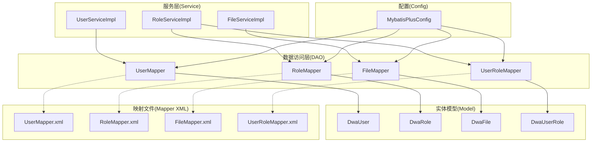
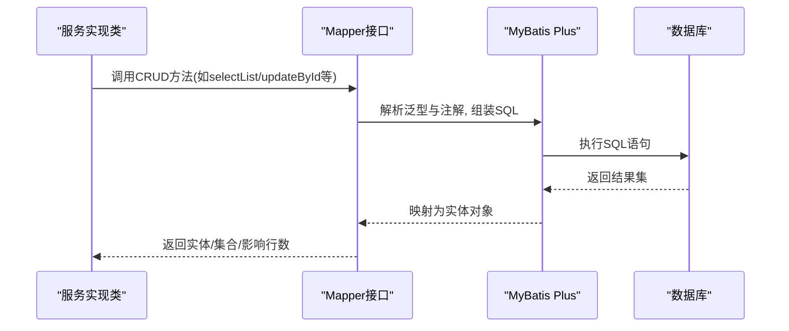
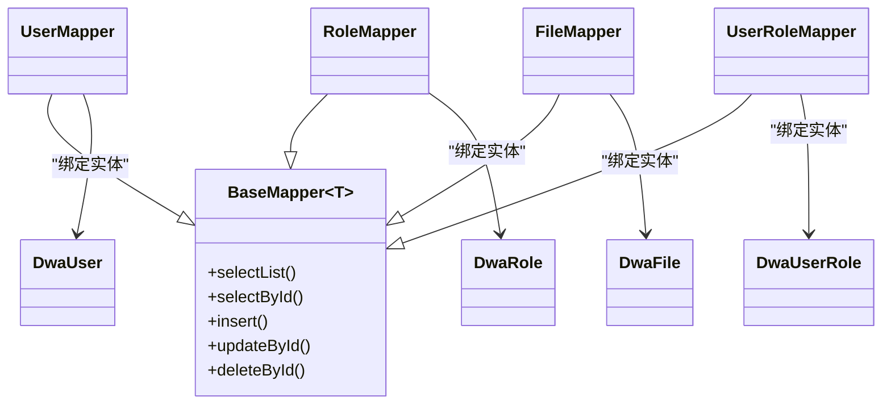
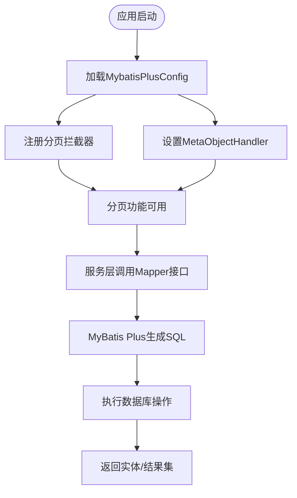
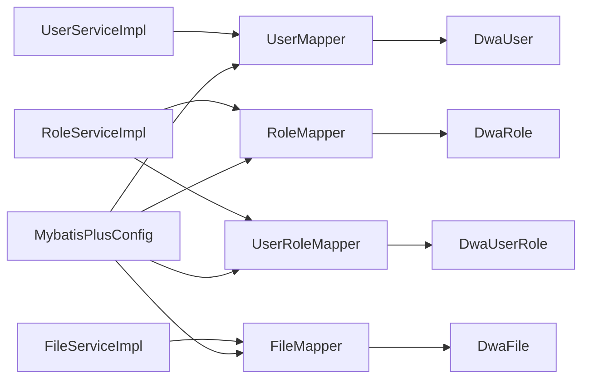

# 基础Mapper接口设计

<cite>
**本文档引用的文件**
- [UserMapper.java](file://src/main/java/com/dw/admin/dao/UserMapper.java)
- [RoleMapper.java](file://src/main/java/com/dw/admin/dao/RoleMapper.java)
- [FileMapper.java](file://src/main/java/com/dw/admin/dao/FileMapper.java)
- [UserRoleMapper.java](file://src/main/java/com/dw/admin/dao/UserRoleMapper.java)
- [DwaUser.java](file://src/main/java/com/dw/admin/model/entity/DwaUser.java)
- [DwaRole.java](file://src/main/java/com/dw/admin/model/entity/DwaRole.java)
- [DwaFile.java](file://src/main/java/com/dw/admin/model/entity/DwaFile.java)
- [DwaUserRole.java](file://src/main/java/com/dw/admin/model/entity/DwaUserRole.java)
- [MybatisPlusConfig.java](file://src/main/java/com/dw/admin/config/MybatisPlusConfig.java)
- [UserMapper.xml](file://src/main/resources/mapper/UserMapper.xml)
- [RoleMapper.xml](file://src/main/resources/mapper/RoleMapper.xml)
- [FileMapper.xml](file://src/main/resources/mapper/FileMapper.xml)
- [UserRoleMapper.xml](file://src/main/resources/mapper/UserRoleMapper.xml)
- [UserServiceImpl.java](file://src/main/java/com/dw/admin/service/impl/UserServiceImpl.java)
- [RoleServiceImpl.java](file://src/main/java/com/dw/admin/service/impl/RoleServiceImpl.java)
- [FileServiceImpl.java](file://src/main/java/com/dw/admin/service/impl/FileServiceImpl.java)
</cite>

## 目录
1. [简介](#简介)
2. [项目结构](#项目结构)
3. [核心组件](#核心组件)
4. [架构总览](#架构总览)
5. [详细组件分析](#详细组件分析)
6. [依赖关系分析](#依赖关系分析)
7. [性能考虑](#性能考虑)
8. [故障排除指南](#故障排除指南)
9. [结论](#结论)
10. [附录](#附录)

## 简介
本文件围绕基础Mapper接口设计展开，系统性阐述BaseMapper的继承与使用方式，说明实体Mapper接口的命名规范与设计原则，并对UserMapper、RoleMapper、FileMapper、UserRoleMapper等具体实现进行对比分析。文档还解释了泛型参数的使用、实体类与Mapper接口的对应关系、以及MyBatis Plus的集成配置要点。最后提供接口继承关系图、最佳实践指南与常见问题解决方案，帮助初学者快速上手。

## 项目结构
本项目采用标准的分层架构，数据访问层（DAO）位于dao包，实体模型位于model.entity包，MyBatis Plus配置位于config包，SQL映射文件位于resources/mapper目录。服务层（service）通过资源注入Mapper接口完成数据库操作。

图表来源
- [UserMapper.java](file://src/main/java/com/dw/admin/dao/UserMapper.java#L1-L16)
- [RoleMapper.java](file://src/main/java/com/dw/admin/dao/RoleMapper.java#L1-L17)
- [FileMapper.java](file://src/main/java/com/dw/admin/dao/FileMapper.java#L1-L17)
- [UserRoleMapper.java](file://src/main/java/com/dw/admin/dao/UserRoleMapper.java#L1-L16)
- [DwaUser.java](file://src/main/java/com/dw/admin/model/entity/DwaUser.java#L1-L73)
- [DwaRole.java](file://src/main/java/com/dw/admin/model/entity/DwaRole.java#L1-L71)
- [DwaFile.java](file://src/main/java/com/dw/admin/model/entity/DwaFile.java#L1-L88)
- [DwaUserRole.java](file://src/main/java/com/dw/admin/model/entity/DwaUserRole.java#L1-L55)
- [MybatisPlusConfig.java](file://src/main/java/com/dw/admin/config/MybatisPlusConfig.java#L1-L53)
- [UserMapper.xml](file://src/main/resources/mapper/UserMapper.xml#L1-L23)
- [RoleMapper.xml](file://src/main/resources/mapper/RoleMapper.xml#L1-L23)
- [FileMapper.xml](file://src/main/resources/mapper/FileMapper.xml#L1-L26)
- [UserRoleMapper.xml](file://src/main/resources/mapper/UserRoleMapper.xml#L1-L20)

章节来源
- [UserMapper.java](file://src/main/java/com/dw/admin/dao/UserMapper.java#L1-L16)
- [RoleMapper.java](file://src/main/java/com/dw/admin/dao/RoleMapper.java#L1-L17)
- [FileMapper.java](file://src/main/java/com/dw/admin/dao/FileMapper.java#L1-L17)
- [UserRoleMapper.java](file://src/main/java/com/dw/admin/dao/UserRoleMapper.java#L1-L16)
- [MybatisPlusConfig.java](file://src/main/java/com/dw/admin/config/MybatisPlusConfig.java#L1-L53)

## 核心组件
- BaseMapper接口：MyBatis Plus提供的基础数据访问接口，提供通用的CRUD方法，无需编写SQL即可完成基本操作。
- 实体Mapper接口：以“实体名 + Mapper”命名，如UserMapper、RoleMapper、FileMapper、UserRoleMapper，均直接继承BaseMapper并绑定对应实体类型。
- 实体类与注解：实体类通过@TableId、@TableField等注解映射数据库字段，配合MyBatis Plus自动填充策略实现审计字段的统一处理。
- 映射文件：每个Mapper接口对应一个XML文件，定义resultMap与通用列清单，确保查询结果与实体属性正确映射。
- 配置类：MybatisPlusConfig负责分页插件与全局元对象处理器（MetaObjectHandler），实现自动填充与分页功能。

章节来源
- [UserMapper.java](file://src/main/java/com/dw/admin/dao/UserMapper.java#L13-L13)
- [RoleMapper.java](file://src/main/java/com/dw/admin/dao/RoleMapper.java#L14-L14)
- [FileMapper.java](file://src/main/java/com/dw/admin/dao/FileMapper.java#L14-L14)
- [UserRoleMapper.java](file://src/main/java/com/dw/admin/dao/UserRoleMapper.java#L13-L13)
- [DwaUser.java](file://src/main/java/com/dw/admin/model/entity/DwaUser.java#L24-L71)
- [DwaRole.java](file://src/main/java/com/dw/admin/model/entity/DwaRole.java#L23-L69)
- [DwaFile.java](file://src/main/java/com/dw/admin/model/entity/DwaFile.java#L24-L86)
- [DwaUserRole.java](file://src/main/java/com/dw/admin/model/entity/DwaUserRole.java#L23-L53)
- [UserMapper.xml](file://src/main/resources/mapper/UserMapper.xml#L5-L20)
- [RoleMapper.xml](file://src/main/resources/mapper/RoleMapper.xml#L5-L20)
- [FileMapper.xml](file://src/main/resources/mapper/FileMapper.xml#L5-L23)
- [UserRoleMapper.xml](file://src/main/resources/mapper/UserRoleMapper.xml#L5-L17)
- [MybatisPlusConfig.java](file://src/main/java/com/dw/admin/config/MybatisPlusConfig.java#L27-L50)

## 架构总览
下图展示了从服务层到数据访问层再到数据库的整体调用链路，体现Mapper接口在整体架构中的位置与职责。

图表来源
- [UserServiceImpl.java](file://src/main/java/com/dw/admin/service/impl/UserServiceImpl.java#L62-L71)
- [RoleServiceImpl.java](file://src/main/java/com/dw/admin/service/impl/RoleServiceImpl.java#L94-L95)
- [FileServiceImpl.java](file://src/main/java/com/dw/admin/service/impl/FileServiceImpl.java#L73-L73)
- [MybatisPlusConfig.java](file://src/main/java/com/dw/admin/config/MybatisPlusConfig.java#L27-L50)

## 详细组件分析

### 接口继承关系与命名规范
- 继承关系：所有实体Mapper接口均直接继承BaseMapper<实体类>，从而获得通用的CRUD能力。
- 命名规范：接口名采用“实体名 + Mapper”的形式，保持与实体类的一一对应；例如UserMapper对应DwaUser。
- 设计原则：接口仅声明职责边界，不包含业务逻辑；业务逻辑由服务层实现，数据访问由Mapper接口承担。

图表来源
- [UserMapper.java](file://src/main/java/com/dw/admin/dao/UserMapper.java#L13-L13)
- [RoleMapper.java](file://src/main/java/com/dw/admin/dao/RoleMapper.java#L14-L14)
- [FileMapper.java](file://src/main/java/com/dw/admin/dao/FileMapper.java#L14-L14)
- [UserRoleMapper.java](file://src/main/java/com/dw/admin/dao/UserRoleMapper.java#L13-L13)
- [DwaUser.java](file://src/main/java/com/dw/admin/model/entity/DwaUser.java#L24-L24)
- [DwaRole.java](file://src/main/java/com/dw/admin/model/entity/DwaRole.java#L23-L23)
- [DwaFile.java](file://src/main/java/com/dw/admin/model/entity/DwaFile.java#L24-L24)
- [DwaUserRole.java](file://src/main/java/com/dw/admin/model/entity/DwaUserRole.java#L23-L23)

章节来源
- [UserMapper.java](file://src/main/java/com/dw/admin/dao/UserMapper.java#L13-L13)
- [RoleMapper.java](file://src/main/java/com/dw/admin/dao/RoleMapper.java#L14-L14)
- [FileMapper.java](file://src/main/java/com/dw/admin/dao/FileMapper.java#L14-L14)
- [UserRoleMapper.java](file://src/main/java/com/dw/admin/dao/UserRoleMapper.java#L13-L13)

### 泛型参数与实体映射
- 泛型参数：Mapper接口通过BaseMapper<T>绑定实体类型，使CRUD方法返回值与实体类型一致，提升类型安全。
- 实体注解：实体类通过@TableId、@TableField等注解标注主键与字段映射，配合MetaObjectHandler实现审计字段自动填充。
- XML映射：每个Mapper的XML文件定义resultMap与Base_Column_List，确保查询结果与实体属性一一对应。

章节来源
- [DwaUser.java](file://src/main/java/com/dw/admin/model/entity/DwaUser.java#L33-L71)
- [DwaRole.java](file://src/main/java/com/dw/admin/model/entity/DwaRole.java#L31-L69)
- [DwaFile.java](file://src/main/java/com/dw/admin/model/entity/DwaFile.java#L33-L86)
- [DwaUserRole.java](file://src/main/java/com/dw/admin/model/entity/DwaUserRole.java#L31-L53)
- [UserMapper.xml](file://src/main/resources/mapper/UserMapper.xml#L5-L20)
- [RoleMapper.xml](file://src/main/resources/mapper/RoleMapper.xml#L5-L20)
- [FileMapper.xml](file://src/main/resources/mapper/FileMapper.xml#L5-L23)
- [UserRoleMapper.xml](file://src/main/resources/mapper/UserRoleMapper.xml#L5-L17)

### 具体Mapper实现特点与差异

#### UserMapper
- 特点：继承BaseMapper<DwaUser>，提供用户相关的通用CRUD能力；服务层通过LambdaQueryWrapper进行条件查询。
- 差异：实体字段包含头像URL、邮箱、手机号等，适合用户资料管理场景。

章节来源
- [UserMapper.java](file://src/main/java/com/dw/admin/dao/UserMapper.java#L13-L13)
- [DwaUser.java](file://src/main/java/com/dw/admin/model/entity/DwaUser.java#L33-L71)
- [UserServiceImpl.java](file://src/main/java/com/dw/admin/service/impl/UserServiceImpl.java#L62-L82)

#### RoleMapper
- 特点：继承BaseMapper<DwaRole>，结合分页插件与排序规则，支持角色列表的分页查询与多字段筛选。
- 差异：角色实体包含状态字段，服务层在查询用户角色时会过滤禁用状态。

章节来源
- [RoleMapper.java](file://src/main/java/com/dw/admin/dao/RoleMapper.java#L14-L14)
- [DwaRole.java](file://src/main/java/com/dw/admin/model/entity/DwaRole.java#L31-L69)
- [RoleServiceImpl.java](file://src/main/java/com/dw/admin/service/impl/RoleServiceImpl.java#L64-L99)

#### FileMapper
- 特点：继承BaseMapper<DwaFile>，用于文件信息的持久化与查询；服务层在上传后写入文件元数据。
- 差异：文件实体包含URL过期时间字段，服务层在查询时会检测并刷新过期URL。

章节来源
- [FileMapper.java](file://src/main/java/com/dw/admin/dao/FileMapper.java#L14-L14)
- [DwaFile.java](file://src/main/java/com/dw/admin/model/entity/DwaFile.java#L33-L86)
- [FileServiceImpl.java](file://src/main/java/com/dw/admin/service/impl/FileServiceImpl.java#L46-L76)

#### UserRoleMapper
- 特点：继承BaseMapper<DwaUserRole>，用于用户与角色的关联关系维护；服务层在保存用户角色前先清理旧关系。
- 差异：关联表主键使用自增类型，便于批量插入与清理。

章节来源
- [UserRoleMapper.java](file://src/main/java/com/dw/admin/dao/UserRoleMapper.java#L13-L13)
- [DwaUserRole.java](file://src/main/java/com/dw/admin/model/entity/DwaUserRole.java#L31-L53)
- [RoleServiceImpl.java](file://src/main/java/com/dw/admin/service/impl/RoleServiceImpl.java#L188-L200)

### MyBatis Plus集成与配置
- 分页插件：在MybatisPlusConfig中注册PaginationInnerInterceptor，针对MySQL数据库启用分页。
- 全局元对象处理器：通过MetaObjectHandler实现创建时间与更新时间的自动填充，减少重复代码。
- Mapper扫描：项目通过注解与XML映射文件约定Mapper接口与其SQL映射的关系，无需额外扫描配置。

图表来源
- [MybatisPlusConfig.java](file://src/main/java/com/dw/admin/config/MybatisPlusConfig.java#L27-L50)
- [UserServiceImpl.java](file://src/main/java/com/dw/admin/service/impl/UserServiceImpl.java#L62-L71)
- [RoleServiceImpl.java](file://src/main/java/com/dw/admin/service/impl/RoleServiceImpl.java#L94-L95)
- [FileServiceImpl.java](file://src/main/java/com/dw/admin/service/impl/FileServiceImpl.java#L73-L73)

章节来源
- [MybatisPlusConfig.java](file://src/main/java/com/dw/admin/config/MybatisPlusConfig.java#L27-L50)

## 依赖关系分析
- 服务层依赖Mapper接口：UserServiceImpl依赖UserMapper，RoleServiceImpl依赖RoleMapper与UserRoleMapper，FileServiceImpl依赖FileMapper。
- Mapper接口依赖实体类：每个Mapper接口绑定对应的实体类，确保类型安全与自动映射。
- 配置类影响Mapper行为：MyBatis Plus配置决定分页与自动填充策略，间接影响所有Mapper的运行时行为。

图表来源
- [UserServiceImpl.java](file://src/main/java/com/dw/admin/service/impl/UserServiceImpl.java#L42-L43)
- [RoleServiceImpl.java](file://src/main/java/com/dw/admin/service/impl/RoleServiceImpl.java#L50-L54)
- [FileServiceImpl.java](file://src/main/java/com/dw/admin/service/impl/FileServiceImpl.java#L40-L40)
- [UserMapper.java](file://src/main/java/com/dw/admin/dao/UserMapper.java#L13-L13)
- [RoleMapper.java](file://src/main/java/com/dw/admin/dao/RoleMapper.java#L14-L14)
- [FileMapper.java](file://src/main/java/com/dw/admin/dao/FileMapper.java#L14-L14)
- [UserRoleMapper.java](file://src/main/java/com/dw/admin/dao/UserRoleMapper.java#L13-L13)
- [MybatisPlusConfig.java](file://src/main/java/com/dw/admin/config/MybatisPlusConfig.java#L27-L50)

章节来源
- [UserServiceImpl.java](file://src/main/java/com/dw/admin/service/impl/UserServiceImpl.java#L42-L43)
- [RoleServiceImpl.java](file://src/main/java/com/dw/admin/service/impl/RoleServiceImpl.java#L50-L54)
- [FileServiceImpl.java](file://src/main/java/com/dw/admin/service/impl/FileServiceImpl.java#L40-L40)

## 性能考虑
- 使用分页插件：在大数据量查询时启用分页，避免一次性加载全部数据。
- 合理使用条件查询：通过LambdaQueryWrapper构建查询条件，减少不必要的全表扫描。
- 自动填充字段：利用MetaObjectHandler减少手动赋值，降低出错概率并提高一致性。
- 关联表操作：在保存用户角色时先清理旧关系再批量插入，避免脏数据与重复记录。

## 故障排除指南
- 无法识别Mapper接口：检查XML映射文件的namespace是否与Mapper接口全限定名一致。
- 字段映射异常：确认实体类注解与XML resultMap中的column/property是否匹配。
- 分页无效：确认分页拦截器是否正确注册且处于拦截器链末尾。
- 审计字段未填充：检查MetaObjectHandler是否正确配置并生效。

章节来源
- [UserMapper.xml](file://src/main/resources/mapper/UserMapper.xml#L3-L15)
- [RoleMapper.xml](file://src/main/resources/mapper/RoleMapper.xml#L3-L15)
- [FileMapper.xml](file://src/main/resources/mapper/FileMapper.xml#L3-L18)
- [UserRoleMapper.xml](file://src/main/resources/mapper/UserRoleMapper.xml#L3-L12)
- [MybatisPlusConfig.java](file://src/main/java/com/dw/admin/config/MybatisPlusConfig.java#L27-L50)

## 结论
本项目通过统一的BaseMapper继承模式与严格的命名规范，实现了清晰的数据访问层设计。结合MyBatis Plus的自动填充与分页插件，既保证了开发效率，又提升了系统的可维护性。建议在新增实体时遵循现有命名与注解规范，确保Mapper接口与实体类、XML映射文件之间的强一致性。

## 附录

### 最佳实践指南
- 命名规范：接口名为“实体名 + Mapper”，实体类使用@TableName与@Id/@Field注解明确映射关系。
- 泛型绑定：确保Mapper接口泛型与实体类一致，避免类型不匹配导致的编译或运行时错误。
- XML映射：为每个Mapper提供独立的resultMap与Base_Column_List，便于复用与扩展。
- 服务层调用：优先使用LambdaQueryWrapper构建查询条件，配合分页插件实现高效查询。
- 自动填充：通过MetaObjectHandler统一处理创建/更新时间，减少重复代码与遗漏风险。

### 常见问题解答
- Q：为什么需要为每个实体都创建一个Mapper接口？
  A：Mapper接口提供通用CRUD能力，便于在服务层直接调用；同时与实体类绑定，确保类型安全与自动映射。
- Q：如何新增一个实体的Mapper？
  A：创建实体类并添加注解，新建Mapper接口继承BaseMapper<实体类>，编写对应的XML映射文件，最后在服务层注入使用。
- Q：分页查询如何使用？
  A：在服务层构造Page对象与QueryWrapper，调用Mapper的selectPage方法，即可获得分页结果。