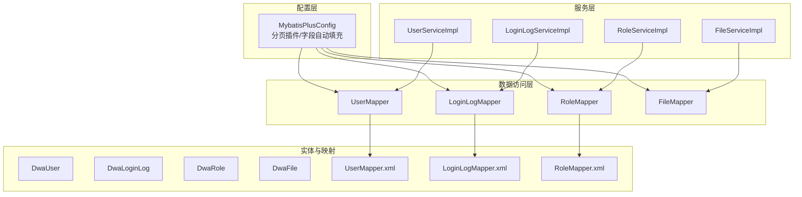
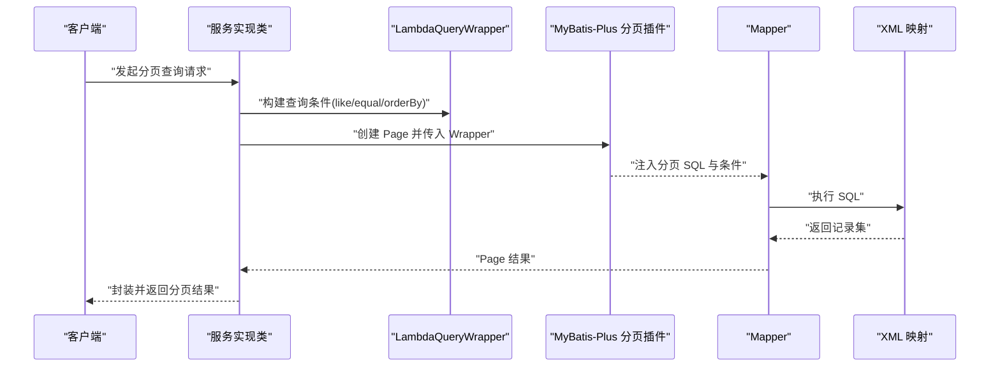
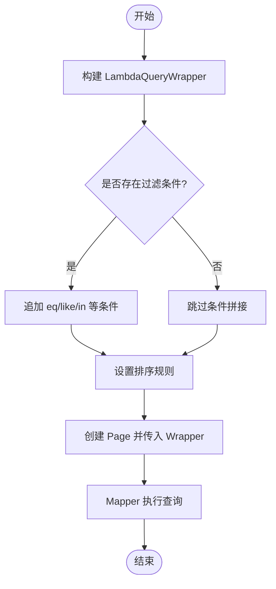
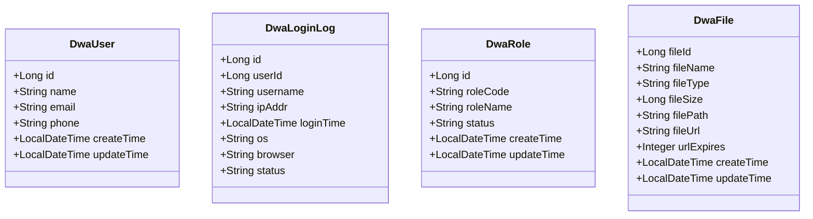
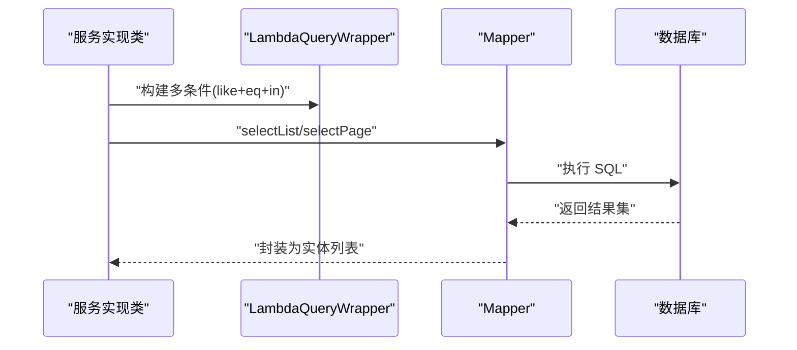
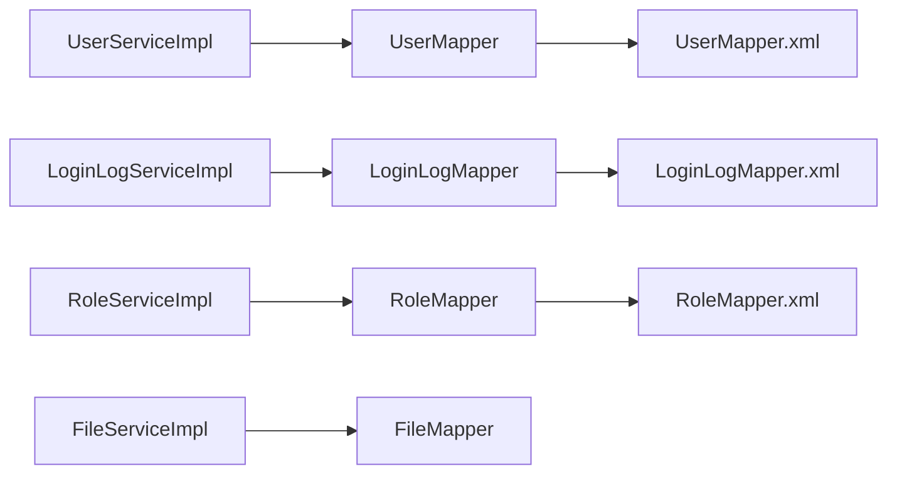

# 高级查询模式与技巧

<cite>
**本文引用的文件**
- [MybatisPlusConfig.java](file://src/main/java/com/dw/admin/config/MybatisPlusConfig.java)
- [UserMapper.java](file://src/main/java/com/dw/admin/dao/UserMapper.java)
- [LoginLogMapper.java](file://src/main/java/com/dw/admin/dao/LoginLogMapper.java)
- [UserMapper.xml](file://src/main/resources/mapper/UserMapper.xml)
- [LoginLogMapper.xml](file://src/main/resources/mapper/LoginLogMapper.xml)
- [RoleMapper.xml](file://src/main/resources/mapper/RoleMapper.xml)
- [UserServiceImpl.java](file://src/main/java/com/dw/admin/service/impl/UserServiceImpl.java)
- [LoginLogServiceImpl.java](file://src/main/java/com/dw/admin/service/impl/LoginLogServiceImpl.java)
- [RoleServiceImpl.java](file://src/main/java/com/dw/admin/service/impl/RoleServiceImpl.java)
- [FileServiceImpl.java](file://src/main/java/com/dw/admin/service/impl/FileServiceImpl.java)
- [DwaUser.java](file://src/main/java/com/dw/admin/model/entity/DwaUser.java)
- [DwaLoginLog.java](file://src/main/java/com/dw/admin/model/entity/DwaLoginLog.java)
- [DwaRole.java](file://src/main/java/com/dw/admin/model/entity/DwaRole.java)
- [DwaFile.java](file://src/main/java/com/dw/admin/model/entity/DwaFile.java)
</cite>

## 目录
1. [简介](#简介)
2. [项目结构](#项目结构)
3. [核心组件](#核心组件)
4. [架构总览](#架构总览)
5. [详细组件分析](#详细组件分析)
6. [依赖关系分析](#依赖关系分析)
7. [性能考虑](#性能考虑)
8. [故障排查指南](#故障排查指南)
9. [结论](#结论)
10. [附录](#附录)

## 简介
本文件面向中高级开发者，系统化讲解基于 MyBatis-Plus 的高级查询模式与技巧，重点覆盖：
- 条件构造器 QueryWrapper 与 UpdateWrapper 的链式调用与使用场景
- LambdaQueryWrapper 与 LambdaUpdateWrapper 的类型安全与 Lambda 表达式优势
- 复杂查询条件构建：多表关联、子查询、聚合函数等
- XML 映射文件的编写规范与 SQL 优化技巧
- 性能优化建议、索引使用策略与查询缓存机制
- 基于真实业务场景的查询模式应用示例

## 项目结构
本项目采用标准的分层架构：控制器层负责请求入口，服务层封装业务逻辑，数据访问层通过 MyBatis-Plus Mapper 与 XML 映射文件进行数据库交互；全局配置启用分页插件与字段自动填充。

图表来源
- [MybatisPlusConfig.java](file://src/main/java/com/dw/admin/config/MybatisPlusConfig.java#L27-L33)
- [UserMapper.java](file://src/main/java/com/dw/admin/dao/UserMapper.java#L1-L16)
- [LoginLogMapper.java](file://src/main/java/com/dw/admin/dao/LoginLogMapper.java#L1-L18)
- [UserMapper.xml](file://src/main/resources/mapper/UserMapper.xml#L1-L23)
- [LoginLogMapper.xml](file://src/main/resources/mapper/LoginLogMapper.xml#L1-L24)
- [RoleMapper.xml](file://src/main/resources/mapper/RoleMapper.xml#L1-L23)

章节来源
- [MybatisPlusConfig.java](file://src/main/java/com/dw/admin/config/MybatisPlusConfig.java#L27-L33)
- [UserMapper.java](file://src/main/java/com/dw/admin/dao/UserMapper.java#L1-L16)
- [LoginLogMapper.java](file://src/main/java/com/dw/admin/dao/LoginLogMapper.java#L1-L18)
- [UserMapper.xml](file://src/main/resources/mapper/UserMapper.xml#L1-L23)
- [LoginLogMapper.xml](file://src/main/resources/mapper/LoginLogMapper.xml#L1-L24)
- [RoleMapper.xml](file://src/main/resources/mapper/RoleMapper.xml#L1-L23)

## 核心组件
- 条件构造器与分页：项目广泛使用 LambdaQueryWrapper 构建查询条件，并结合 Page 实现分页查询；MyBatis-Plus 分页插件在全局配置中启用。
- 类型安全与可维护性：LambdaQueryWrapper 通过字段方法引用避免硬编码字符串，降低重构风险。
- 自动填充：全局配置 MetaObjectHandler 在插入/更新时自动填充时间字段，减少重复代码。
- XML 映射：通过 resultMap 与 sql 片段统一管理列清单与映射关系，提升可读性与一致性。

章节来源
- [UserServiceImpl.java](file://src/main/java/com/dw/admin/service/impl/UserServiceImpl.java#L233-L267)
- [LoginLogServiceImpl.java](file://src/main/java/com/dw/admin/service/impl/LoginLogServiceImpl.java#L90-L112)
- [RoleServiceImpl.java](file://src/main/java/com/dw/admin/service/impl/RoleServiceImpl.java#L64-L99)
- [FileServiceImpl.java](file://src/main/java/com/dw/admin/service/impl/FileServiceImpl.java#L177-L212)
- [MybatisPlusConfig.java](file://src/main/java/com/dw/admin/config/MybatisPlusConfig.java#L35-L50)
- [UserMapper.xml](file://src/main/resources/mapper/UserMapper.xml#L5-L20)
- [LoginLogMapper.xml](file://src/main/resources/mapper/LoginLogMapper.xml#L5-L21)
- [RoleMapper.xml](file://src/main/resources/mapper/RoleMapper.xml#L5-L20)

## 架构总览
下图展示查询流程的关键节点：服务层使用条件构造器拼装查询条件，分页插件自动注入分页 SQL，Mapper 调用 XML 映射执行查询，最终返回分页结果。

图表来源
- [UserServiceImpl.java](file://src/main/java/com/dw/admin/service/impl/UserServiceImpl.java#L231-L267)
- [LoginLogServiceImpl.java](file://src/main/java/com/dw/admin/service/impl/LoginLogServiceImpl.java#L90-L112)
- [RoleServiceImpl.java](file://src/main/java/com/dw/admin/service/impl/RoleServiceImpl.java#L64-L99)
- [FileServiceImpl.java](file://src/main/java/com/dw/admin/service/impl/FileServiceImpl.java#L177-L212)
- [MybatisPlusConfig.java](file://src/main/java/com/dw/admin/config/MybatisPlusConfig.java#L27-L33)

## 详细组件分析

### 条件构造器与链式调用技巧
- 基础条件组合：使用 eq/like/in 等方法按需拼接，结合 StringUtils 判断输入是否为空，避免无效条件。
- 排序控制：默认按更新时间倒序，支持动态切换创建时间/更新时间升/降序。
- 分页集成：将 Wrapper 与 Page 组合，交由分页插件处理分页 SQL。

图表来源
- [UserServiceImpl.java](file://src/main/java/com/dw/admin/service/impl/UserServiceImpl.java#L233-L259)
- [LoginLogServiceImpl.java](file://src/main/java/com/dw/admin/service/impl/LoginLogServiceImpl.java#L92-L105)
- [RoleServiceImpl.java](file://src/main/java/com/dw/admin/service/impl/RoleServiceImpl.java#L66-L92)
- [FileServiceImpl.java](file://src/main/java/com/dw/admin/service/impl/FileServiceImpl.java#L179-L205)

章节来源
- [UserServiceImpl.java](file://src/main/java/com/dw/admin/service/impl/UserServiceImpl.java#L233-L259)
- [LoginLogServiceImpl.java](file://src/main/java/com/dw/admin/service/impl/LoginLogServiceImpl.java#L92-L105)
- [RoleServiceImpl.java](file://src/main/java/com/dw/admin/service/impl/RoleServiceImpl.java#L66-L92)
- [FileServiceImpl.java](file://src/main/java/com/dw/admin/service/impl/FileServiceImpl.java#L179-L205)

### LambdaQueryWrapper 的类型安全与 Lambda 表达式优势
- 使用字段方法引用替代字符串，编译期检查字段变更，降低重构成本。
- 与实体类属性一一对应，提升可读性与可维护性。
- 与 XML 映射配合，确保列名与实体属性映射一致。

图表来源
- [DwaUser.java](file://src/main/java/com/dw/admin/model/entity/DwaUser.java#L24-L72)
- [DwaLoginLog.java](file://src/main/java/com/dw/admin/model/entity/DwaLoginLog.java#L26-L77)
- [DwaRole.java](file://src/main/java/com/dw/admin/model/entity/DwaRole.java#L23-L69)
- [DwaFile.java](file://src/main/java/com/dw/admin/model/entity/DwaFile.java#L24-L86)

章节来源
- [DwaUser.java](file://src/main/java/com/dw/admin/model/entity/DwaUser.java#L24-L72)
- [DwaLoginLog.java](file://src/main/java/com/dw/admin/model/entity/DwaLoginLog.java#L26-L77)
- [DwaRole.java](file://src/main/java/com/dw/admin/model/entity/DwaRole.java#L23-L69)
- [DwaFile.java](file://src/main/java/com/dw/admin/model/entity/DwaFile.java#L24-L86)

### 复杂查询条件构建示例
- 多条件组合：如用户列表查询同时支持名称、邮箱、手机的模糊匹配与排序控制。
- 关联查询思路：通过多次 Mapper 查询与内存合并实现关联效果（例如用户角色列表先查用户角色中间表，再根据角色码批量查询角色）。
- 子查询与聚合：项目未直接出现原生子查询/聚合函数示例，但可通过自定义 SQL 或 XML 片段扩展实现。

图表来源
- [RoleServiceImpl.java](file://src/main/java/com/dw/admin/service/impl/RoleServiceImpl.java#L167-L181)
- [RoleServiceImpl.java](file://src/main/java/com/dw/admin/service/impl/RoleServiceImpl.java#L175-L178)

章节来源
- [UserServiceImpl.java](file://src/main/java/com/dw/admin/service/impl/UserServiceImpl.java#L233-L259)
- [RoleServiceImpl.java](file://src/main/java/com/dw/admin/service/impl/RoleServiceImpl.java#L167-L181)

### XML 映射文件编写规范与 SQL 优化
- 统一管理列清单：通过 sql 片段集中定义列，避免分散写法导致的遗漏或不一致。
- 明确 resultMap：将数据库列与实体属性一一映射，保证字段一致性。
- 优化建议：
  - 仅查询必要列，避免 SELECT *
  - 对高频查询列建立合适索引
  - 合理使用分页，避免一次性加载大量数据
  - 使用 LIKE “前缀%” 以利用索引（若业务允许）

章节来源
- [UserMapper.xml](file://src/main/resources/mapper/UserMapper.xml#L5-L20)
- [LoginLogMapper.xml](file://src/main/resources/mapper/LoginLogMapper.xml#L5-L21)
- [RoleMapper.xml](file://src/main/resources/mapper/RoleMapper.xml#L5-L20)

### 全局配置与分页、自动填充
- 分页插件：在全局配置中启用 PaginationInnerInterceptor，MySQL 环境下自动注入分页 SQL。
- 字段自动填充：MetaObjectHandler 在插入/更新时自动填充时间字段，减少重复逻辑。

章节来源
- [MybatisPlusConfig.java](file://src/main/java/com/dw/admin/config/MybatisPlusConfig.java#L27-L33)
- [MybatisPlusConfig.java](file://src/main/java/com/dw/admin/config/MybatisPlusConfig.java#L35-L50)

## 依赖关系分析
服务层通过资源注入 Mapper 接口，Mapper 接口继承 BaseMapper，底层由 MyBatis-Plus 提供实现；XML 映射文件通过命名空间与 Mapper 接口绑定。

图表来源
- [UserServiceImpl.java](file://src/main/java/com/dw/admin/service/impl/UserServiceImpl.java#L42-L43)
- [LoginLogServiceImpl.java](file://src/main/java/com/dw/admin/service/impl/LoginLogServiceImpl.java#L38-L39)
- [RoleServiceImpl.java](file://src/main/java/com/dw/admin/service/impl/RoleServiceImpl.java#L50-L54)
- [FileServiceImpl.java](file://src/main/java/com/dw/admin/service/impl/FileServiceImpl.java#L40-L41)

章节来源
- [UserMapper.java](file://src/main/java/com/dw/admin/dao/UserMapper.java#L1-L16)
- [LoginLogMapper.java](file://src/main/java/com/dw/admin/dao/LoginLogMapper.java#L1-L18)
- [UserMapper.xml](file://src/main/resources/mapper/UserMapper.xml#L3)
- [LoginLogMapper.xml](file://src/main/resources/mapper/LoginLogMapper.xml#L3)
- [RoleMapper.xml](file://src/main/resources/mapper/RoleMapper.xml#L3)

## 性能考虑
- 分页优先：对列表查询一律使用分页，避免全量扫描。
- 索引策略：针对常用过滤字段（如用户名、角色码、创建时间、更新时间）建立索引；复合索引按查询频率与选择性设计。
- SQL 优化：
  - 使用精确相等条件优先于模糊匹配
  - LIKE 使用“前缀%”以利用索引
  - 避免不必要的排序，仅在必要时排序
- 缓存机制：可结合 Redis 缓存热点查询结果，设置合理过期时间，降低数据库压力。
- 异步落日志：登录日志异步写入，避免阻塞主流程。

章节来源
- [LoginLogServiceImpl.java](file://src/main/java/com/dw/admin/service/impl/LoginLogServiceImpl.java#L48-L84)
- [MybatisPlusConfig.java](file://src/main/java/com/dw/admin/config/MybatisPlusConfig.java#L27-L33)

## 故障排查指南
- 参数校验：所有查询接口均进行非空校验，若抛出业务异常，检查请求参数是否为空或格式错误。
- 字段映射：若查询结果字段缺失或类型不匹配，检查 XML 中的 resultMap 与 sql 片段是否与实体类一致。
- 分页异常：确认分页参数 pageNum/pageSize 合法，且分页插件已正确启用。
- 排序异常：确认排序字段存在于实体类且与数据库列名一致。

章节来源
- [UserServiceImpl.java](file://src/main/java/com/dw/admin/service/impl/UserServiceImpl.java#L231-L233)
- [LoginLogServiceImpl.java](file://src/main/java/com/dw/admin/service/impl/LoginLogServiceImpl.java#L90-L92)
- [RoleServiceImpl.java](file://src/main/java/com/dw/admin/service/impl/RoleServiceImpl.java#L64-L66)
- [FileServiceImpl.java](file://src/main/java/com/dw/admin/service/impl/FileServiceImpl.java#L177-L179)

## 结论
本项目在查询层面体现了良好的工程实践：以 LambdaQueryWrapper 为核心构建类型安全的查询条件，结合分页插件与 XML 映射实现高性能、易维护的数据访问层。通过统一的参数校验、自动填充与异步处理，整体查询体验稳定可靠。建议在后续迭代中进一步引入索引优化、查询缓存与必要的子查询/聚合能力，持续提升系统性能与可扩展性。

## 附录
- 实体类与表名映射参考：
  - DwaUser → dwa_user
  - DwaLoginLog → dwa_login_log
  - DwaRole → dwa_role
  - DwaFile → dwa_file

章节来源
- [DwaUser.java](file://src/main/java/com/dw/admin/model/entity/DwaUser.java#L24)
- [DwaLoginLog.java](file://src/main/java/com/dw/admin/model/entity/DwaLoginLog.java#L26)
- [DwaRole.java](file://src/main/java/com/dw/admin/model/entity/DwaRole.java#L23)
- [DwaFile.java](file://src/main/java/com/dw/admin/model/entity/DwaFile.java#L24)