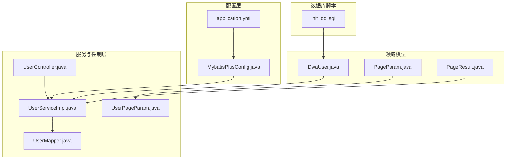
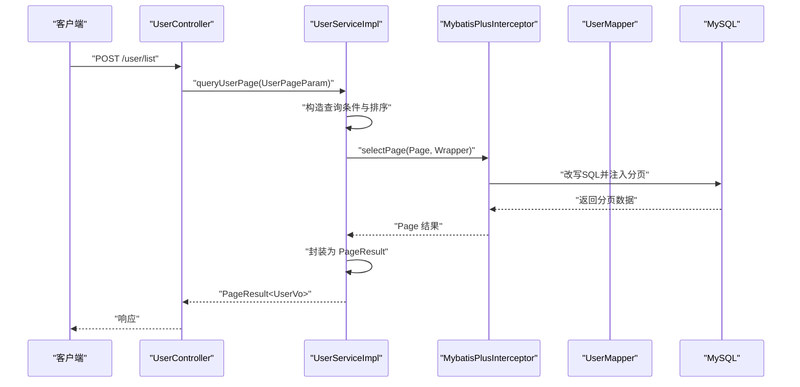
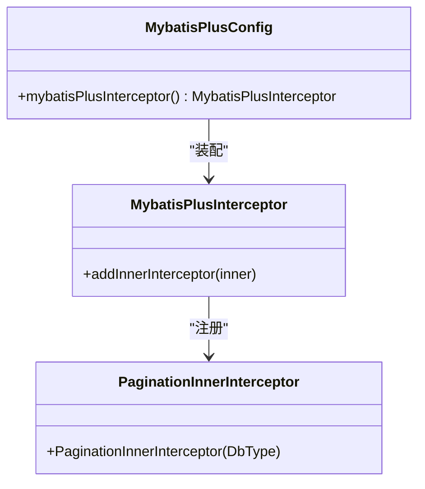
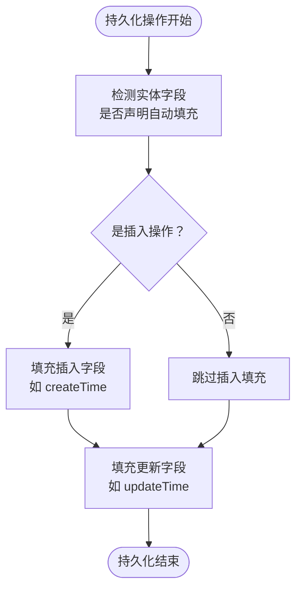
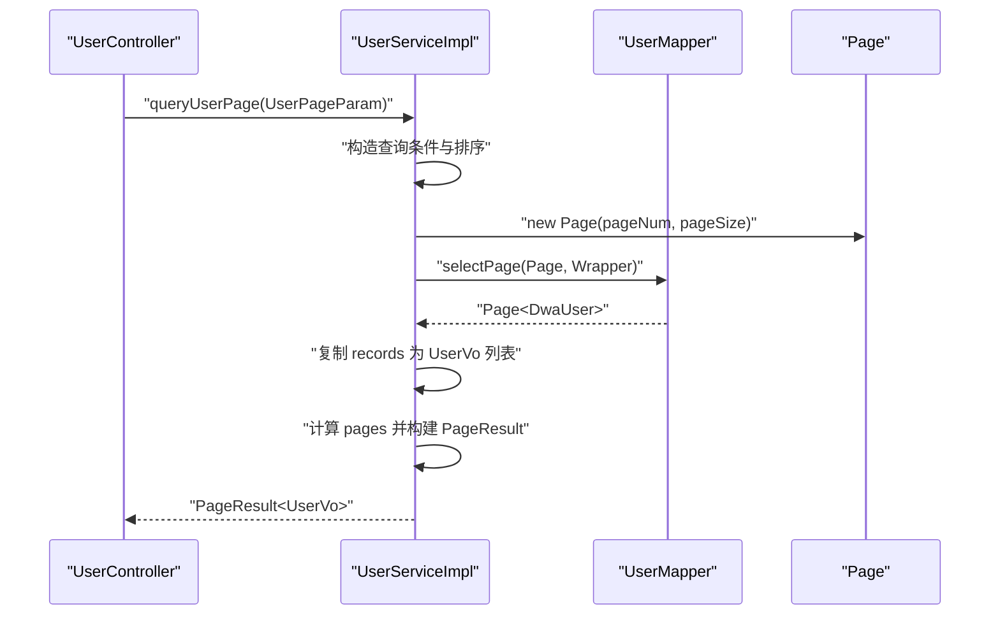
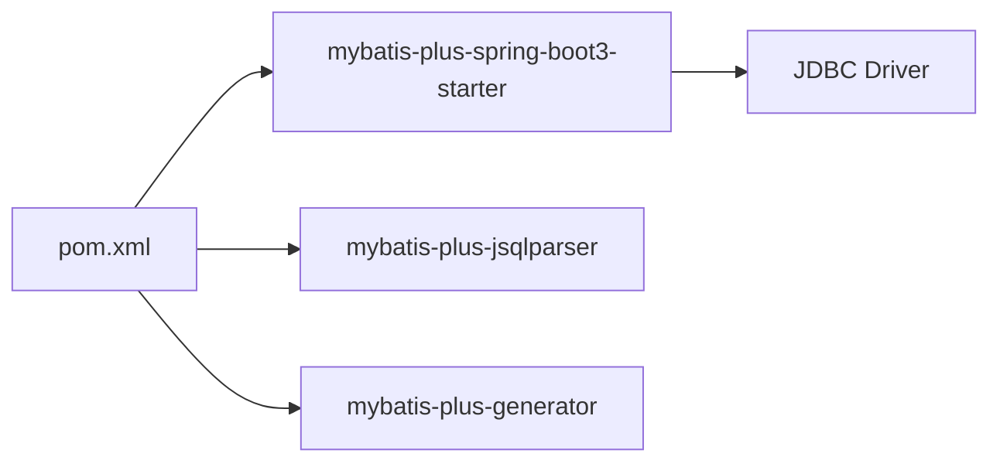

# MyBatis Plus 配置

<cite>
**本文引用的文件**
- [MybatisPlusConfig.java](file://src/main/java/com/dw/admin/config/MybatisPlusConfig.java)
- [application.yml](file://src/main/resources/application.yml)
- [DwaUser.java](file://src/main/java/com/dw/admin/model/entity/DwaUser.java)
- [UserServiceImpl.java](file://src/main/java/com/dw/admin/service/impl/UserServiceImpl.java)
- [UserMapper.java](file://src/main/java/com/dw/admin/dao/UserMapper.java)
- [UserPageParam.java](file://src/main/java/com/dw/admin/model/param/UserPageParam.java)
- [PageParam.java](file://src/main/java/com/dw/admin/common/entity/PageParam.java)
- [PageResult.java](file://src/main/java/com/dw/admin/common/entity/PageResult.java)
- [UserController.java](file://src/main/java/com/dw/admin/controller/UserController.java)
- [init_ddl.sql](file://docs/sql/init_ddl.sql)
- [pom.xml](file://pom.xml)
</cite>

## 目录
1. [简介](#简介)
2. [项目结构](#项目结构)
3. [核心组件](#核心组件)
4. [架构总览](#架构总览)
5. [详细组件分析](#详细组件分析)
6. [依赖关系分析](#依赖关系分析)
7. [性能考量](#性能考量)
8. [故障排查指南](#故障排查指南)
9. [结论](#结论)
10. [附录](#附录)

## 简介
本文件面向数据库开发者，系统性梳理本项目的 MyBatis Plus 配置与使用实践，重点覆盖：
- MyBatis Plus 插件拦截器（Interceptor）的装配与分页插件的配置要点
- 全局 MetaObjectHandler 自动填充机制的实现原理与配置方式
- 全局配置项的作用范围与最佳实践
- 数据库类型适配与插件加载顺序的重要性
- 配置优化建议、性能调优与常见问题解决方案
- 提供可直接对照的配置示例路径与流程图示

## 项目结构
本项目采用 Spring Boot + MyBatis Plus 的标准分层结构，MyBatis Plus 的核心配置集中在配置类中，实体模型与分页参数在通用模块中定义，服务层通过分页接口完成查询与封装。

图表来源
- [MybatisPlusConfig.java](file://src/main/java/com/dw/admin/config/MybatisPlusConfig.java#L20-L52)
- [application.yml](file://src/main/resources/application.yml#L22-L25)
- [DwaUser.java](file://src/main/java/com/dw/admin/model/entity/DwaUser.java#L24-L72)
- [PageParam.java](file://src/main/java/com/dw/admin/common/entity/PageParam.java#L18-L43)
- [PageResult.java](file://src/main/java/com/dw/admin/common/entity/PageResult.java#L16-L93)
- [UserServiceImpl.java](file://src/main/java/com/dw/admin/service/impl/UserServiceImpl.java#L230-L267)
- [UserMapper.java](file://src/main/java/com/dw/admin/dao/UserMapper.java#L13-L15)
- [UserController.java](file://src/main/java/com/dw/admin/controller/UserController.java#L131-L135)
- [UserPageParam.java](file://src/main/java/com/dw/admin/model/param/UserPageParam.java#L14-L39)
- [init_ddl.sql](file://docs/sql/init_ddl.sql#L11-L22)

章节来源
- [MybatisPlusConfig.java](file://src/main/java/com/dw/admin/config/MybatisPlusConfig.java#L20-L52)
- [application.yml](file://src/main/resources/application.yml#L22-L25)

## 核心组件
- MyBatis Plus 插件拦截器（MybatisPlusInterceptor）：用于注册分页等内层插件，确保 SQL 改写与分页生效。
- 全局 MetaObjectHandler：统一处理插入与更新时的时间字段自动填充。
- 全局配置项（mapperLocations）：指定 XML 映射文件位置，便于 MyBatis Plus 加载。
- 实体注解配合自动填充：通过注解声明字段在插入/更新时的填充策略。
- 分页参数与结果封装：PageParam 定义分页入参，PageResult 统一封装分页出参。

章节来源
- [MybatisPlusConfig.java](file://src/main/java/com/dw/admin/config/MybatisPlusConfig.java#L27-L50)
- [application.yml](file://src/main/resources/application.yml#L22-L25)
- [DwaUser.java](file://src/main/java/com/dw/admin/model/entity/DwaUser.java#L64-L71)
- [PageParam.java](file://src/main/java/com/dw/admin/common/entity/PageParam.java#L23-L39)
- [PageResult.java](file://src/main/java/com/dw/admin/common/entity/PageResult.java#L72-L91)

## 架构总览
下图展示从请求到数据库执行的关键链路，以及 MyBatis Plus 插件在其中的位置与职责。

图表来源
- [UserController.java](file://src/main/java/com/dw/admin/controller/UserController.java#L131-L135)
- [UserServiceImpl.java](file://src/main/java/com/dw/admin/service/impl/UserServiceImpl.java#L230-L267)
- [MybatisPlusConfig.java](file://src/main/java/com/dw/admin/config/MybatisPlusConfig.java#L27-L33)
- [UserMapper.java](file://src/main/java/com/dw/admin/dao/UserMapper.java#L13-L15)

## 详细组件分析

### MyBatis Plus 插件拦截器配置
- 职责：注册内层插件（如分页），并保证插件顺序合理。
- 关键点：
  - 使用 MybatisPlusInterceptor 统一管理插件集合。
  - 分页插件应作为最后一个内层插件添加，避免被后续插件覆盖或破坏分页逻辑。
  - 通过 DbType 指定数据库类型，确保分页 SQL 适配目标数据库方言。

图表来源
- [MybatisPlusConfig.java](file://src/main/java/com/dw/admin/config/MybatisPlusConfig.java#L27-L33)

章节来源
- [MybatisPlusConfig.java](file://src/main/java/com/dw/admin/config/MybatisPlusConfig.java#L27-L33)

### 全局 MetaObjectHandler 自动填充机制
- 职责：在实体插入与更新时，自动填充时间字段，减少重复代码与遗漏风险。
- 实现方式：
  - 在配置类中通过 MybatisPlusPropertiesCustomizer 设置全局 MetaObjectHandler。
  - 在实体类中使用注解声明字段的自动填充策略（插入、插入+更新）。
  - 填充字段通常包括创建时间与更新时间。

图表来源
- [MybatisPlusConfig.java](file://src/main/java/com/dw/admin/config/MybatisPlusConfig.java#L35-L50)
- [DwaUser.java](file://src/main/java/com/dw/admin/model/entity/DwaUser.java#L64-L71)

章节来源
- [MybatisPlusConfig.java](file://src/main/java/com/dw/admin/config/MybatisPlusConfig.java#L35-L50)
- [DwaUser.java](file://src/main/java/com/dw/admin/model/entity/DwaUser.java#L64-L71)

### 全局配置项与最佳实践
- mapperLocations：指定 XML 映射文件位置，便于 MyBatis Plus 加载自定义 SQL。
- 最佳实践：
  - 将 mapperLocations 与实际 XML 文件目录保持一致，避免扫描不到映射文件。
  - 若使用注解式 SQL，可省略该配置；若大量使用 XML，建议显式配置以提升可控性。

章节来源
- [application.yml](file://src/main/resources/application.yml#L22-L25)

### 数据库类型适配与插件加载顺序
- 数据库类型适配：通过 PaginationInnerInterceptor(DbType.MYSQL) 指定数据库类型，确保分页 SQL 方言正确。
- 插件加载顺序的重要性：
  - 分页插件必须放在最后添加，防止被其他插件改写或覆盖。
  - 合理的插件顺序能避免 SQL 改写冲突与分页失效。

章节来源
- [MybatisPlusConfig.java](file://src/main/java/com/dw/admin/config/MybatisPlusConfig.java#L31-L32)

### 分页插件使用与分页参数封装
- 分页参数：PageParam 定义 pageNum、pageSize，并支持传入业务查询参数。
- 分页结果：PageResult 统一封装 pageNum、pageSize、pages、total、list。
- 服务层分页流程：
  - 构造查询条件与排序规则。
  - 初始化 Page 对象并调用 selectPage。
  - 将 records 转换为 VO 并构建 PageResult 返回。

图表来源
- [UserController.java](file://src/main/java/com/dw/admin/controller/UserController.java#L131-L135)
- [UserServiceImpl.java](file://src/main/java/com/dw/admin/service/impl/UserServiceImpl.java#L230-L267)
- [PageParam.java](file://src/main/java/com/dw/admin/common/entity/PageParam.java#L23-L39)
- [PageResult.java](file://src/main/java/com/dw/admin/common/entity/PageResult.java#L72-L91)
- [UserPageParam.java](file://src/main/java/com/dw/admin/model/param/UserPageParam.java#L14-L39)

章节来源
- [PageParam.java](file://src/main/java/com/dw/admin/common/entity/PageParam.java#L23-L39)
- [PageResult.java](file://src/main/java/com/dw/admin/common/entity/PageResult.java#L72-L91)
- [UserServiceImpl.java](file://src/main/java/com/dw/admin/service/impl/UserServiceImpl.java#L230-L267)
- [UserPageParam.java](file://src/main/java/com/dw/admin/model/param/UserPageParam.java#L14-L39)

### 数据库表结构与字段映射
- 用户表包含 id、name、password、email、phone、avatarUrl、create_time、update_time 等字段。
- 实体类通过注解映射表名与字段，并对时间字段启用自动填充。

章节来源
- [init_ddl.sql](file://docs/sql/init_ddl.sql#L11-L22)
- [DwaUser.java](file://src/main/java/com/dw/admin/model/entity/DwaUser.java#L24-L71)

## 依赖关系分析
- MyBatis Plus Starter 版本：3.5.14，确保与 Spring Boot 3.x 兼容。
- jsqlparser 依赖：用于 SQL 解析与改写，与分页插件协同工作。
- 代码生成器依赖：便于快速生成实体与 Mapper，保持与数据库结构一致。

图表来源
- [pom.xml](file://pom.xml#L72-L87)

章节来源
- [pom.xml](file://pom.xml#L72-L87)

## 性能考量
- 分页性能建议：
  - 控制每页大小，避免一次性返回过多数据。
  - 使用合适的排序字段与索引，避免全表扫描。
  - 对高频查询建立必要索引，结合业务排序需求设计复合索引。
- 自动填充性能：
  - 时间字段填充为常量开销，影响极小，建议统一使用系统时间。
- 插件顺序：
  - 仅保留必要的内层插件，减少 SQL 改写成本。
  - 分页插件置于末尾，避免被其他插件重复改写。

## 故障排查指南
- 分页无效或 SQL 不正确
  - 检查分页插件是否最后添加。
  - 确认 DbType 与数据库一致。
  - 章节来源
    - [MybatisPlusConfig.java](file://src/main/java/com/dw/admin/config/MybatisPlusConfig.java#L31-L32)
- 自动填充未生效
  - 确认实体字段注解是否声明了插入/更新填充。
  - 确认全局 MetaObjectHandler 是否正确装配。
  - 章节来源
    - [DwaUser.java](file://src/main/java/com/dw/admin/model/entity/DwaUser.java#L64-L71)
    - [MybatisPlusConfig.java](file://src/main/java/com/dw/admin/config/MybatisPlusConfig.java#L35-L50)
- XML 映射文件未加载
  - 检查 mapperLocations 配置与实际目录是否一致。
  - 章节来源
    - [application.yml](file://src/main/resources/application.yml#L22-L25)
- 分页结果异常
  - 检查 PageParam 的 pageNum 与 pageSize 是否符合约束。
  - 章节来源
    - [PageParam.java](file://src/main/java/com/dw/admin/common/entity/PageParam.java#L23-L39)
    - [PageResult.java](file://src/main/java/com/dw/admin/common/entity/PageResult.java#L72-L91)

## 结论
本项目的 MyBatis Plus 配置遵循“集中装配 + 明确顺序”的原则：通过配置类统一注册分页插件与全局自动填充处理器；在实体层通过注解声明字段填充策略；在服务层通过 Page 对象完成分页查询与结果封装。配合合理的数据库类型适配与插件顺序，能够稳定地支撑业务的分页与数据一致性需求。

## 附录
- 配置示例路径
  - 插件与自动填充配置：[MybatisPlusConfig.java](file://src/main/java/com/dw/admin/config/MybatisPlusConfig.java#L27-L50)
  - 全局 mapperLocations 配置：[application.yml](file://src/main/resources/application.yml#L22-L25)
  - 实体自动填充注解：[DwaUser.java](file://src/main/java/com/dw/admin/model/entity/DwaUser.java#L64-L71)
  - 分页参数与结果封装：[PageParam.java](file://src/main/java/com/dw/admin/common/entity/PageParam.java#L23-L39)、[PageResult.java](file://src/main/java/com/dw/admin/common/entity/PageResult.java#L72-L91)
  - 服务层分页调用：[UserServiceImpl.java](file://src/main/java/com/dw/admin/service/impl/UserServiceImpl.java#L230-L267)
  - 控制器分页接口：[UserController.java](file://src/main/java/com/dw/admin/controller/UserController.java#L131-L135)
  - 数据库表结构：[init_ddl.sql](file://docs/sql/init_ddl.sql#L11-L22)
  - 依赖版本与工具：[pom.xml](file://pom.xml#L72-L87)