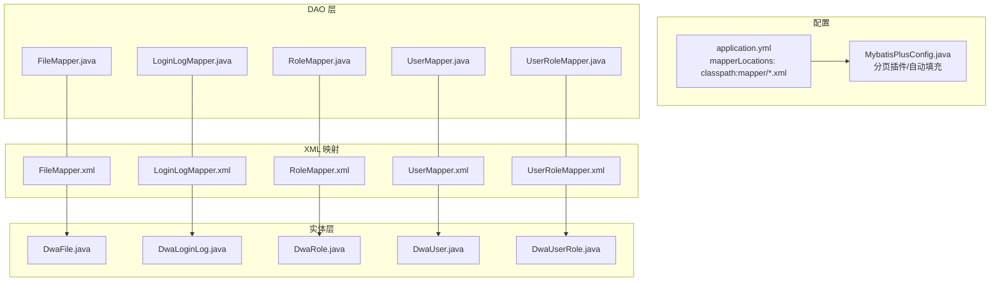
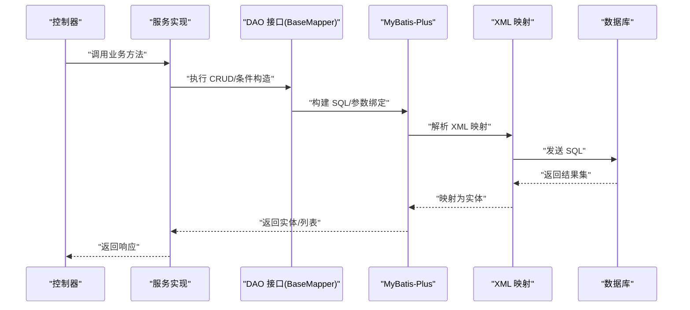
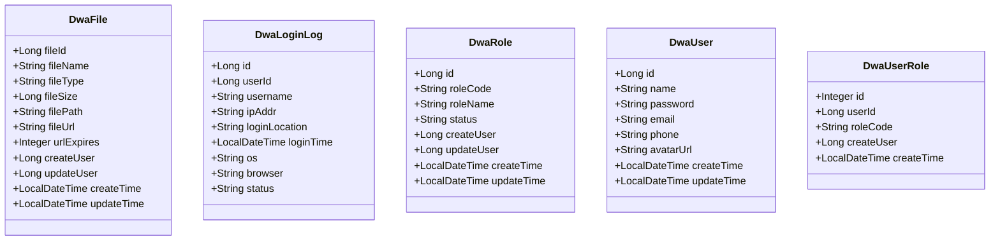
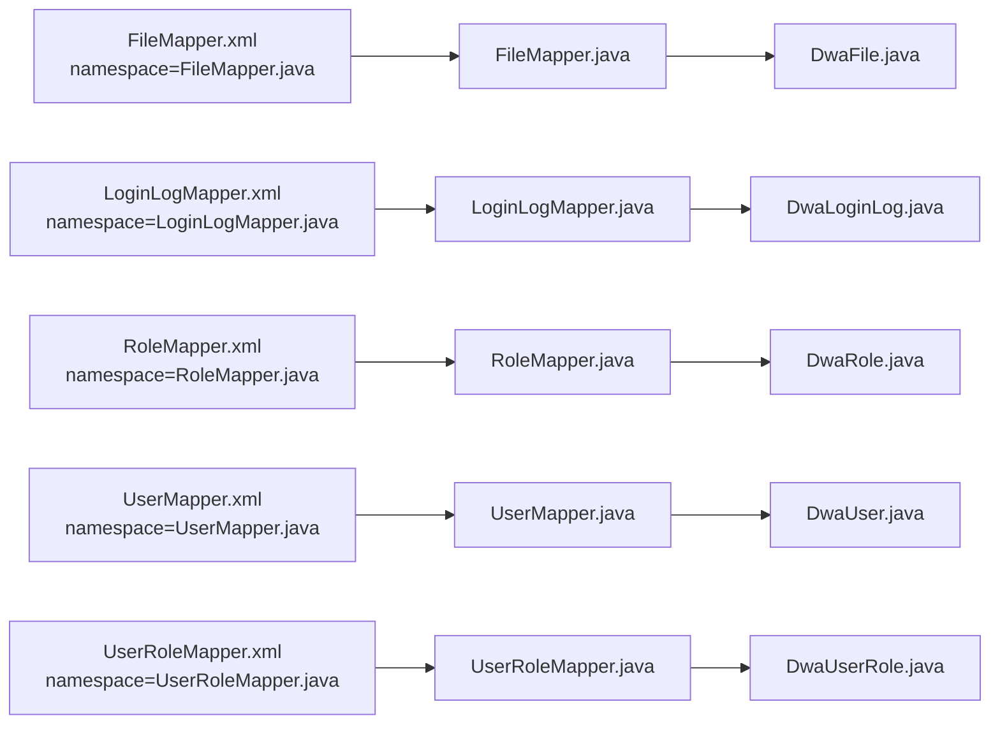

# SQL 映射文件

<cite>
**本文引用的文件**
- [application.yml](file://src/main/resources/application.yml)
- [MybatisPlusConfig.java](file://src/main/java/com/dw/admin/config/MybatisPlusConfig.java)
- [FileMapper.xml](file://src/main/resources/mapper/FileMapper.xml)
- [LoginLogMapper.xml](file://src/main/resources/mapper/LoginLogMapper.xml)
- [RoleMapper.xml](file://src/main/resources/mapper/RoleMapper.xml)
- [UserMapper.xml](file://src/main/resources/mapper/UserMapper.xml)
- [UserRoleMapper.xml](file://src/main/resources/mapper/UserRoleMapper.xml)
- [FileMapper.java](file://src/main/java/com/dw/admin/dao/FileMapper.java)
- [LoginLogMapper.java](file://src/main/java/com/dw/admin/dao/LoginLogMapper.java)
- [RoleMapper.java](file://src/main/java/com/dw/admin/dao/RoleMapper.java)
- [UserMapper.java](file://src/main/java/com/dw/admin/dao/UserMapper.java)
- [UserRoleMapper.java](file://src/main/java/com/dw/admin/dao/UserRoleMapper.java)
- [DwaFile.java](file://src/main/java/com/dw/admin/model/entity/DwaFile.java)
- [DwaLoginLog.java](file://src/main/java/com/dw/admin/model/entity/DwaLoginLog.java)
- [DwaRole.java](file://src/main/java/com/dw/admin/model/entity/DwaRole.java)
- [DwaUser.java](file://src/main/java/com/dw/admin/model/entity/DwaUser.java)
- [DwaUserRole.java](file://src/main/java/com/dw/admin/model/entity/DwaUserRole.java)
</cite>

## 目录
1. [简介](#简介)
2. [项目结构](#项目结构)
3. [核心组件](#核心组件)
4. [架构总览](#架构总览)
5. [详细组件分析](#详细组件分析)
6. [依赖分析](#依赖分析)
7. [性能考量](#性能考量)
8. [故障排查指南](#故障排查指南)
9. [结论](#结论)
10. [附录](#附录)

## 简介
本文件面向数据库工程师与后端开发者，系统化梳理本项目的 SQL 映射文件（MyBatis XML）结构、语法规则、动态 SQL 使用、resultMap 映射关系、嵌套查询思路、SQL 优化与索引实践、安全防护与执行计划分析方法。项目采用 MyBatis-Plus，通过 XML 映射文件定义通用列清单与基础映射，结合 Java 接口与实体类完成 ORM 映射与分页插件配置。

## 项目结构
- MyBatis-Plus 配置位于应用配置中，指定 XML 映射文件位置为 classpath:mapper/*.xml。
- 各模块 DAO 接口继承 MyBatis-Plus 的 BaseMapper，天然具备常用 CRUD；如需自定义 SQL，则在对应 Mapper.xml 中扩展。
- 实体类通过注解标注表名与字段映射，并由 XML 中的 resultMap 对应字段映射。

图表来源
- [application.yml](file://src/main/resources/application.yml#L22-L25)
- [MybatisPlusConfig.java](file://src/main/java/com/dw/admin/config/MybatisPlusConfig.java#L27-L33)
- [FileMapper.xml](file://src/main/resources/mapper/FileMapper.xml#L1-L26)
- [LoginLogMapper.xml](file://src/main/resources/mapper/LoginLogMapper.xml#L1-L24)
- [RoleMapper.xml](file://src/main/resources/mapper/RoleMapper.xml#L1-L23)
- [UserMapper.xml](file://src/main/resources/mapper/UserMapper.xml#L1-L23)
- [UserRoleMapper.xml](file://src/main/resources/mapper/UserRoleMapper.xml#L1-L20)
- [FileMapper.java](file://src/main/java/com/dw/admin/dao/FileMapper.java#L1-L17)
- [LoginLogMapper.java](file://src/main/java/com/dw/admin/dao/LoginLogMapper.java#L1-L18)
- [RoleMapper.java](file://src/main/java/com/dw/admin/dao/RoleMapper.java#L1-L17)
- [UserMapper.java](file://src/main/java/com/dw/admin/dao/UserMapper.java#L1-L16)
- [UserRoleMapper.java](file://src/main/java/com/dw/admin/dao/UserRoleMapper.java#L1-L16)
- [DwaFile.java](file://src/main/java/com/dw/admin/model/entity/DwaFile.java#L24-L87)
- [DwaLoginLog.java](file://src/main/java/com/dw/admin/model/entity/DwaLoginLog.java#L26-L77)
- [DwaRole.java](file://src/main/java/com/dw/admin/model/entity/DwaRole.java#L24-L70)
- [DwaUser.java](file://src/main/java/com/dw/admin/model/entity/DwaUser.java#L24-L72)
- [DwaUserRole.java](file://src/main/java/com/dw/admin/model/entity/DwaUserRole.java#L23-L54)

章节来源
- [application.yml](file://src/main/resources/application.yml#L22-L25)
- [MybatisPlusConfig.java](file://src/main/java/com/dw/admin/config/MybatisPlusConfig.java#L27-L33)

## 核心组件
- XML 映射文件：每个模块均提供一个基础的 resultMap 与通用列清单 sql 片段，便于复用与统一管理。
- DAO 接口：继承 MyBatis-Plus BaseMapper，可直接使用通用 CRUD；自定义 SQL 建议在 XML 中扩展。
- 实体类：通过注解声明表名与字段映射，与 XML 中的 column/property 对应。
- MyBatis-Plus 配置：启用分页插件与自动填充（插入/更新时填充时间字段），提升开发效率与一致性。

章节来源
- [FileMapper.xml](file://src/main/resources/mapper/FileMapper.xml#L5-L23)
- [LoginLogMapper.xml](file://src/main/resources/mapper/LoginLogMapper.xml#L5-L21)
- [RoleMapper.xml](file://src/main/resources/mapper/RoleMapper.xml#L5-L20)
- [UserMapper.xml](file://src/main/resources/mapper/UserMapper.xml#L5-L19)
- [UserRoleMapper.xml](file://src/main/resources/mapper/UserRoleMapper.xml#L5-L17)
- [FileMapper.java](file://src/main/java/com/dw/admin/dao/FileMapper.java#L14-L14)
- [LoginLogMapper.java](file://src/main/java/com/dw/admin/dao/LoginLogMapper.java#L15-L15)
- [RoleMapper.java](file://src/main/java/com/dw/admin/dao/RoleMapper.java#L14-L14)
- [UserMapper.java](file://src/main/java/com/dw/admin/dao/UserMapper.java#L13-L13)
- [UserRoleMapper.java](file://src/main/java/com/dw/admin/dao/UserRoleMapper.java#L13-L13)
- [DwaFile.java](file://src/main/java/com/dw/admin/model/entity/DwaFile.java#L24-L87)
- [DwaLoginLog.java](file://src/main/java/com/dw/admin/model/entity/DwaLoginLog.java#L26-L77)
- [DwaRole.java](file://src/main/java/com/dw/admin/model/entity/DwaRole.java#L24-L70)
- [DwaUser.java](file://src/main/java/com/dw/admin/model/entity/DwaUser.java#L24-L72)
- [DwaUserRole.java](file://src/main/java/com/dw/admin/model/entity/DwaUserRole.java#L23-L54)
- [MybatisPlusConfig.java](file://src/main/java/com/dw/admin/config/MybatisPlusConfig.java#L27-L49)

## 架构总览
下图展示从请求到数据库的典型流程：控制器调用服务层，服务层通过 DAO 接口访问 MyBatis-Plus，最终执行 XML 中定义的 SQL 或默认 CRUD。

图表来源
- [application.yml](file://src/main/resources/application.yml#L22-L25)
- [MybatisPlusConfig.java](file://src/main/java/com/dw/admin/config/MybatisPlusConfig.java#L27-L33)
- [FileMapper.java](file://src/main/java/com/dw/admin/dao/FileMapper.java#L14-L14)
- [UserMapper.java](file://src/main/java/com/dw/admin/dao/UserMapper.java#L13-L13)

## 详细组件分析

### XML 映射文件结构与语法规则
- 文档声明与 DTD：使用标准 XML 声明与 MyBatis 3.0 DTD。
- 命名空间：namespace 与 DAO 接口全限定名一致，确保 XML 与接口绑定。
- 结果映射：resultMap 定义 id/result 映射列与实体属性，type 指向对应实体类。
- 通用列清单：sql 片段定义可复用的列列表，便于在查询中统一选择字段。
- 动态 SQL：当前各模块 XML 未包含动态标签（如 trim/where/set/foreach 等），建议在需要条件拼接或批量操作时按需引入。

章节来源
- [FileMapper.xml](file://src/main/resources/mapper/FileMapper.xml#L1-L26)
- [LoginLogMapper.xml](file://src/main/resources/mapper/LoginLogMapper.xml#L1-L24)
- [RoleMapper.xml](file://src/main/resources/mapper/RoleMapper.xml#L1-L23)
- [UserMapper.xml](file://src/main/resources/mapper/UserMapper.xml#L1-L23)
- [UserRoleMapper.xml](file://src/main/resources/mapper/UserRoleMapper.xml#L1-L20)

### resultMap 映射关系与字段对应
- 字段命名策略：XML 中 column 与实体类字段属性一一对应，注意大小写与下划线/驼峰转换。
- 主键映射：id 标签用于标识主键字段；其余普通字段使用 result。
- 自动填充：实体类通过注解声明插入/更新时间字段，配合 MyBatis-Plus 全局自动填充配置，减少手工赋值。

图表来源
- [DwaFile.java](file://src/main/java/com/dw/admin/model/entity/DwaFile.java#L24-L87)
- [DwaLoginLog.java](file://src/main/java/com/dw/admin/model/entity/DwaLoginLog.java#L26-L77)
- [DwaRole.java](file://src/main/java/com/dw/admin/model/entity/DwaRole.java#L24-L70)
- [DwaUser.java](file://src/main/java/com/dw/admin/model/entity/DwaUser.java#L24-L72)
- [DwaUserRole.java](file://src/main/java/com/dw/admin/model/entity/DwaUserRole.java#L23-L54)

章节来源
- [DwaFile.java](file://src/main/java/com/dw/admin/model/entity/DwaFile.java#L24-L87)
- [DwaLoginLog.java](file://src/main/java/com/dw/admin/model/entity/DwaLoginLog.java#L26-L77)
- [DwaRole.java](file://src/main/java/com/dw/admin/model/entity/DwaRole.java#L24-L70)
- [DwaUser.java](file://src/main/java/com/dw/admin/model/entity/DwaUser.java#L24-L72)
- [DwaUserRole.java](file://src/main/java/com/dw/admin/model/entity/DwaUserRole.java#L23-L54)

### 动态 SQL 使用与性能考虑
- 当前 XML 未使用动态标签，适合固定查询场景；若需条件筛选、批量插入/更新、多表关联等，可在 XML 中引入相应动态标签。
- 性能建议：
  - 避免 SELECT *，优先使用 sql 片段定义的列清单，减少网络与解析开销。
  - 条件拼接时使用 where 标签包裹，避免多余的 AND/OR。
  - 批量操作使用 foreach 与数组/集合，减少多次往返。
  - 控制返回数据量，优先在 XML 中加入分页与排序条件。

章节来源
- [FileMapper.xml](file://src/main/resources/mapper/FileMapper.xml#L20-L23)
- [LoginLogMapper.xml](file://src/main/resources/mapper/LoginLogMapper.xml#L18-L21)
- [RoleMapper.xml](file://src/main/resources/mapper/RoleMapper.xml#L17-L20)
- [UserMapper.xml](file://src/main/resources/mapper/UserMapper.xml#L17-L20)
- [UserRoleMapper.xml](file://src/main/resources/mapper/UserRoleMapper.xml#L14-L17)

### 嵌套查询与复杂关联查询指南
- 嵌套结果：可通过 association 或 collection 在 resultMap 中嵌套映射关联实体。
- 嵌套查询：通过 select 属性指向另一个 XML 的查询方法，实现延迟加载。
- 关联查询建议：
  - 明确 ON 条件与连接类型（内/左/右），避免笛卡尔积导致结果膨胀。
  - 为关联字段建立合适索引，确保连接与过滤高效。
  - 将高频过滤条件前置，尽量缩小中间结果集。

（本节为通用设计指导，不直接分析具体文件）

### SQL 注入防护与安全编码规范
- 使用预编译参数占位符（#{...}）传递变量，避免字符串拼接。
- 动态 SQL 中优先使用 <if>/<where>/<trim> 等标签，避免手写 SQL 片段。
- 对用户输入进行白名单校验与长度限制，必要时进行转义处理。
- 最小权限原则：数据库账号仅授予必要权限，避免高危操作。

（本节为通用安全指导，不直接分析具体文件）

### 执行计划与性能调优方法
- 使用 EXPLAIN/EXPLAIN ANALYZE 分析 SQL 执行计划，关注：
  - 是否使用了预期索引（避免全表扫描）。
  - 访问类型与行数估计是否合理。
  - 是否存在不必要的排序或临时表。
- 常见优化手段：
  - 为过滤与连接字段建立复合索引。
  - 将常用于排序的字段纳入索引覆盖。
  - 减少隐式转换与函数运算，避免索引失效。
  - 合理拆分大事务，降低锁竞争。

（本节为通用调优指导，不直接分析具体文件）

## 依赖分析
- XML 与 DAO 绑定：namespace 与 DAO 接口全限定名一致，确保 XML 与接口正确匹配。
- 实体类与 XML：resultMap 的 type 与实体类全限定名一致，column 与实体属性对应。
- 分页与自动填充：MyBatis-Plus 配置启用分页插件与全局自动填充，影响 SQL 生成与实体字段赋值。

图表来源
- [FileMapper.xml](file://src/main/resources/mapper/FileMapper.xml#L3-L3)
- [LoginLogMapper.xml](file://src/main/resources/mapper/LoginLogMapper.xml#L3-L3)
- [RoleMapper.xml](file://src/main/resources/mapper/RoleMapper.xml#L3-L3)
- [UserMapper.xml](file://src/main/resources/mapper/UserMapper.xml#L3-L3)
- [UserRoleMapper.xml](file://src/main/resources/mapper/UserRoleMapper.xml#L3-L3)
- [FileMapper.java](file://src/main/java/com/dw/admin/dao/FileMapper.java#L1-L17)
- [LoginLogMapper.java](file://src/main/java/com/dw/admin/dao/LoginLogMapper.java#L1-L18)
- [RoleMapper.java](file://src/main/java/com/dw/admin/dao/RoleMapper.java#L1-L17)
- [UserMapper.java](file://src/main/java/com/dw/admin/dao/UserMapper.java#L1-L16)
- [UserRoleMapper.java](file://src/main/java/com/dw/admin/dao/UserRoleMapper.java#L1-L16)
- [DwaFile.java](file://src/main/java/com/dw/admin/model/entity/DwaFile.java#L24-L87)
- [DwaLoginLog.java](file://src/main/java/com/dw/admin/model/entity/DwaLoginLog.java#L26-L77)
- [DwaRole.java](file://src/main/java/com/dw/admin/model/entity/DwaRole.java#L24-L70)
- [DwaUser.java](file://src/main/java/com/dw/admin/model/entity/DwaUser.java#L24-L72)
- [DwaUserRole.java](file://src/main/java/com/dw/admin/model/entity/DwaUserRole.java#L23-L54)

章节来源
- [application.yml](file://src/main/resources/application.yml#L22-L25)
- [MybatisPlusConfig.java](file://src/main/java/com/dw/admin/config/MybatisPlusConfig.java#L27-L49)

## 性能考量
- 分页：已启用 MySQL 分页插件，建议在查询列表时传入分页参数，避免一次性拉取大量数据。
- 自动填充：统一插入/更新时间字段，减少业务代码重复，同时保证数据一致性。
- 字段选择：优先使用 sql 片段定义的列清单，避免无谓的列传输与映射开销。
- 索引策略：对高频过滤、连接与排序字段建立索引；避免在 WHERE 子句中对列进行函数计算或隐式转换。

章节来源
- [MybatisPlusConfig.java](file://src/main/java/com/dw/admin/config/MybatisPlusConfig.java#L27-L49)
- [FileMapper.xml](file://src/main/resources/mapper/FileMapper.xml#L20-L23)
- [LoginLogMapper.xml](file://src/main/resources/mapper/LoginLogMapper.xml#L18-L21)
- [RoleMapper.xml](file://src/main/resources/mapper/RoleMapper.xml#L17-L20)
- [UserMapper.xml](file://src/main/resources/mapper/UserMapper.xml#L17-L20)
- [UserRoleMapper.xml](file://src/main/resources/mapper/UserRoleMapper.xml#L14-L17)

## 故障排查指南
- XML 未生效：检查 application.yml 中 mapperLocations 是否包含目标 XML；确认命名空间与 DAO 接口全限定名一致。
- 字段映射异常：核对 XML 中 column 与实体属性是否一致；确认实体类注解与表结构一致。
- 分页无效：确认 MyBatis-Plus 分页插件已注册且数据库类型配置正确。
- 日志定位：开启 DAO 包 debug 日志，观察生成的 SQL 与参数绑定情况。

章节来源
- [application.yml](file://src/main/resources/application.yml#L22-L31)
- [MybatisPlusConfig.java](file://src/main/java/com/dw/admin/config/MybatisPlusConfig.java#L27-L33)

## 结论
本项目基于 MyBatis-Plus 的 XML 映射文件提供了标准化的基础映射与通用列清单，结合分页与自动填充配置，能够满足常规增删改查与分页场景。对于更复杂的动态查询与关联场景，建议在现有结构基础上按需引入动态 SQL 标签与嵌套映射，并配合索引与执行计划分析持续优化性能与稳定性。

## 附录
- 常用 XML 标签参考（概念性说明，不对应具体文件）：
  - <select>/<insert>/<update>/<delete>：定义 SQL 语句。
  - <resultMap>/<id>/<result>/<association>/<collection>：定义结果映射。
  - <sql>/<include>：抽取与复用 SQL 片段。
  - <where>/<trim>/<set>/<if>/<foreach>：动态 SQL 条件与循环。
- 索引设计建议（概念性说明，不对应具体文件）：
  - 为 WHERE、JOIN、ORDER BY 字段建立合适的单列或复合索引。
  - 避免在索引列上使用函数或表达式，防止索引失效。
  - 定期评估索引使用率，清理冗余索引。