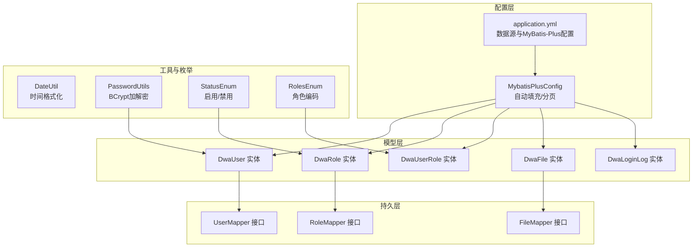
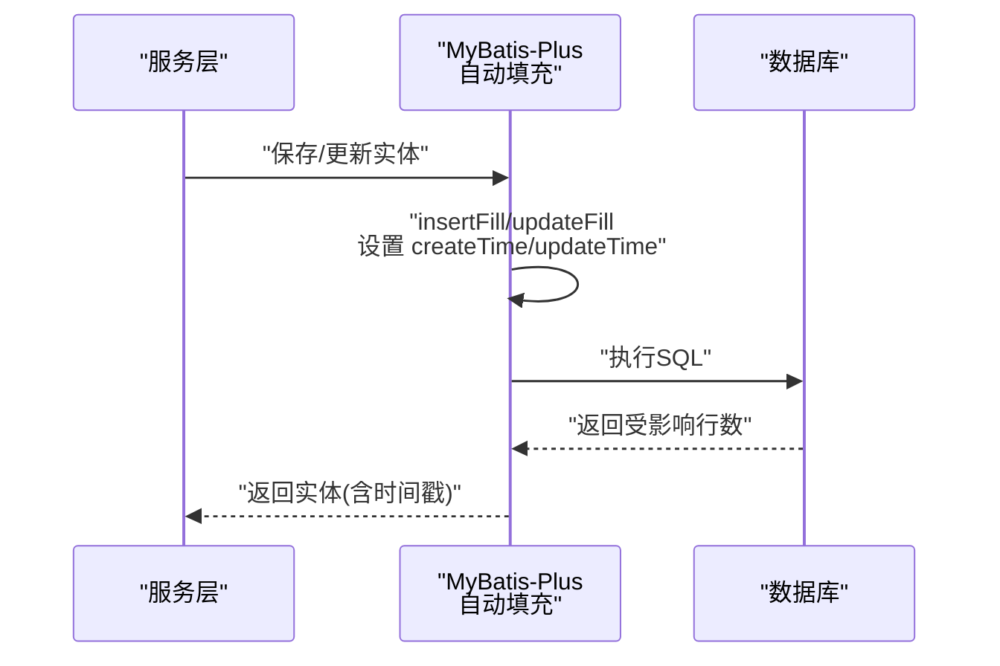
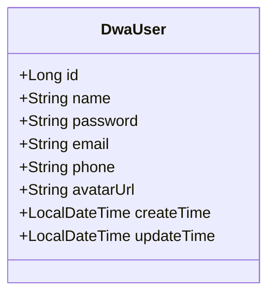
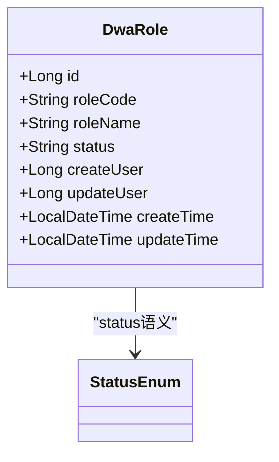
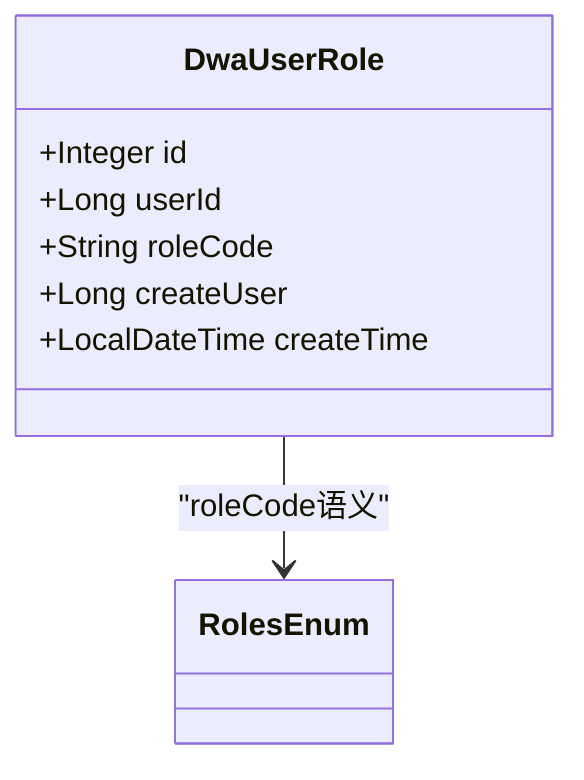
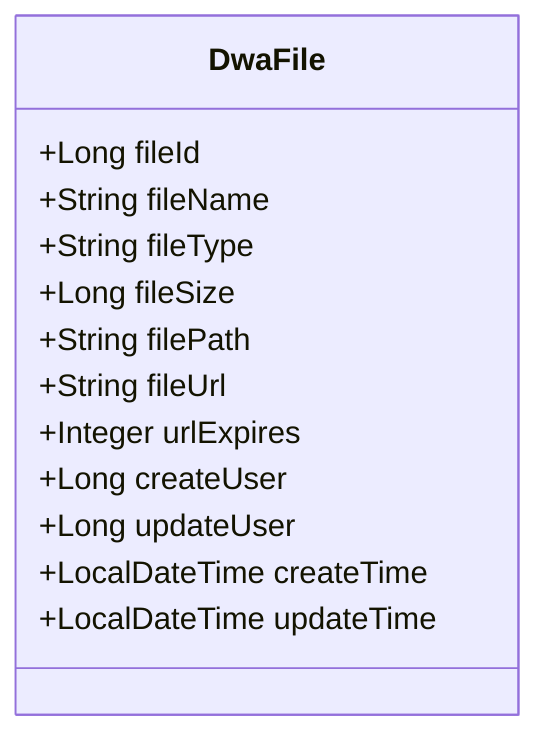
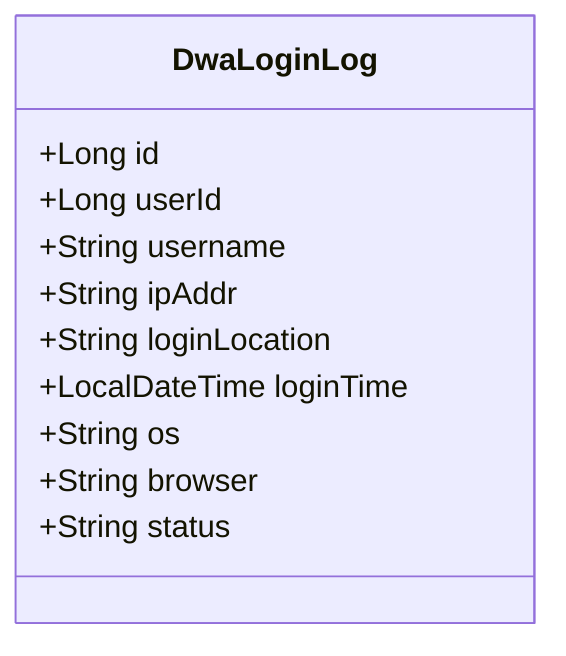
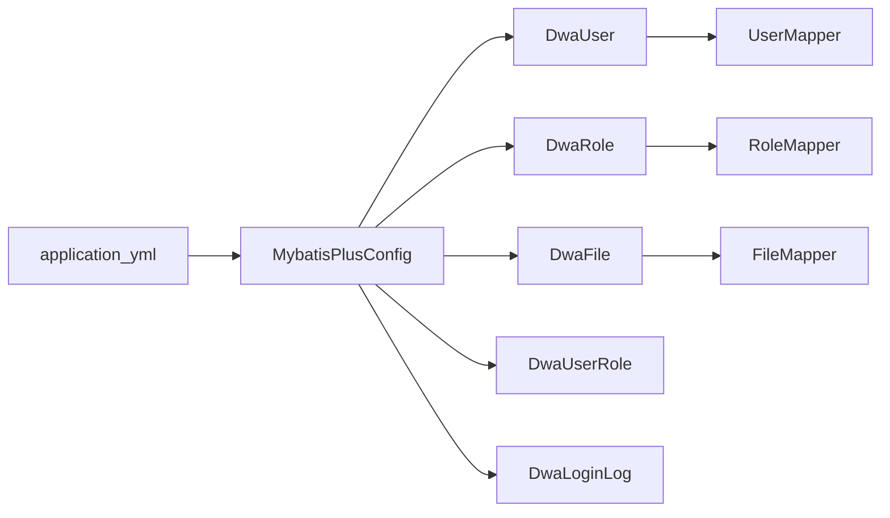

# 实体模型设计

<cite>
**本文引用的文件**
- [DwaUser.java](file://src/main/java/com/dw/admin/model/entity/DwaUser.java)
- [DwaRole.java](file://src/main/java/com/dw/admin/model/entity/DwaRole.java)
- [DwaUserRole.java](file://src/main/java/com/dw/admin/model/entity/DwaUserRole.java)
- [DwaFile.java](file://src/main/java/com/dw/admin/model/entity/DwaFile.java)
- [DwaLoginLog.java](file://src/main/java/com/dw/admin/model/entity/DwaLoginLog.java)
- [MybatisPlusConfig.java](file://src/main/java/com/dw/admin/config/MybatisPlusConfig.java)
- [UserMapper.java](file://src/main/java/com/dw/admin/dao/UserMapper.java)
- [RoleMapper.java](file://src/main/java/com/dw/admin/dao/RoleMapper.java)
- [FileMapper.java](file://src/main/java/com/dw/admin/dao/FileMapper.java)
- [application.yml](file://src/main/resources/application.yml)
- [DateUtil.java](file://src/main/java/com/dw/admin/common/utils/DateUtil.java)
- [PasswordUtils.java](file://src/main/java/com/dw/admin/common/utils/PasswordUtils.java)
- [StatusEnum.java](file://src/main/java/com/dw/admin/common/enums/StatusEnum.java)
- [RolesEnum.java](file://src/main/java/com/dw/admin/common/enums/RolesEnum.java)
- [LoginParam.java](file://src/main/java/com/dw/admin/model/param/LoginParam.java)
- [UserParam.java](file://src/main/java/com/dw/admin/model/param/UserParam.java)
</cite>

## 目录
1. [引言](#引言)
2. [项目结构](#项目结构)
3. [核心组件](#核心组件)
4. [架构总览](#架构总览)
5. [详细组件分析](#详细组件分析)
6. [依赖分析](#依赖分析)
7. [性能考虑](#性能考虑)
8. [故障排查指南](#故障排查指南)
9. [结论](#结论)
10. [附录](#附录)

## 引言
本文件面向后端开发者，系统性梳理本项目的实体模型设计与实现，重点覆盖以下方面：
- 实体类字段定义与注解使用规范
- MyBatis Plus 注解如@TableId、@TableName、@TableField 的作用与配置方法
- 实体类与数据库表的映射关系与命名约定
- 字段类型转换与时间戳处理机制
- 实体类设计最佳实践与业务规则约束
- 数据验证与序列化配置指南

## 项目结构
项目采用标准的分层架构，实体模型位于 model/entity 包中，配合 DAO 层的 Mapper 接口完成持久化操作；全局配置集中在 config 包中，包括 MyBatis-Plus 的自动填充与分页插件；工具类与枚举用于支撑通用能力与业务语义。

图表来源
- [DwaUser.java](file://src/main/java/com/dw/admin/model/entity/DwaUser.java#L20-L72)
- [DwaRole.java](file://src/main/java/com/dw/admin/model/entity/DwaRole.java#L19-L70)
- [DwaUserRole.java](file://src/main/java/com/dw/admin/model/entity/DwaUserRole.java#L19-L54)
- [DwaFile.java](file://src/main/java/com/dw/admin/model/entity/DwaFile.java#L20-L86)
- [DwaLoginLog.java](file://src/main/java/com/dw/admin/model/entity/DwaLoginLog.java#L22-L78)
- [UserMapper.java](file://src/main/java/com/dw/admin/dao/UserMapper.java#L13-L13)
- [RoleMapper.java](file://src/main/java/com/dw/admin/dao/RoleMapper.java#L14-L14)
- [FileMapper.java](file://src/main/java/com/dw/admin/dao/FileMapper.java#L14-L14)
- [MybatisPlusConfig.java](file://src/main/java/com/dw/admin/config/MybatisPlusConfig.java#L20-L52)
- [application.yml](file://src/main/resources/application.yml#L9-L25)

章节来源
- [DwaUser.java](file://src/main/java/com/dw/admin/model/entity/DwaUser.java#L1-L73)
- [DwaRole.java](file://src/main/java/com/dw/admin/model/entity/DwaRole.java#L1-L71)
- [DwaUserRole.java](file://src/main/java/com/dw/admin/model/entity/DwaUserRole.java#L1-L55)
- [DwaFile.java](file://src/main/java/com/dw/admin/model/entity/DwaFile.java#L1-L88)
- [DwaLoginLog.java](file://src/main/java/com/dw/admin/model/entity/DwaLoginLog.java#L1-L80)
- [MybatisPlusConfig.java](file://src/main/java/com/dw/admin/config/MybatisPlusConfig.java#L1-L53)
- [application.yml](file://src/main/resources/application.yml#L1-L64)

## 核心组件
本项目的核心实体围绕“用户-角色-权限-文件-登录日志”展开，每个实体均遵循统一的注解规范与命名约定，并通过 MyBatis-Plus 的自动填充机制统一管理时间戳字段。

- DwaUser：用户主表，包含基础信息与时间戳字段，使用雪花 ID 作为主键策略。
- DwaRole：角色表，包含角色编码、名称与状态字段，使用雪花 ID。
- DwaUserRole：用户与角色的关联表，使用自增 ID。
- DwaFile：文件信息表，包含文件元数据与时间戳字段，使用雪花 ID。
- DwaLoginLog：登录日志表，记录登录行为与环境信息。

章节来源
- [DwaUser.java](file://src/main/java/com/dw/admin/model/entity/DwaUser.java#L24-L72)
- [DwaRole.java](file://src/main/java/com/dw/admin/model/entity/DwaRole.java#L23-L70)
- [DwaUserRole.java](file://src/main/java/com/dw/admin/model/entity/DwaUserRole.java#L23-L54)
- [DwaFile.java](file://src/main/java/com/dw/admin/model/entity/DwaFile.java#L24-L86)
- [DwaLoginLog.java](file://src/main/java/com/dw/admin/model/entity/DwaLoginLog.java#L26-L78)

## 架构总览
实体模型与持久层通过 MyBatis-Plus 的自动填充与分页插件协同工作，应用配置集中于 application.yml，确保数据源、Mapper 映射位置与日志级别的一致性。

图表来源
- [MybatisPlusConfig.java](file://src/main/java/com/dw/admin/config/MybatisPlusConfig.java#L35-L50)
- [DwaUser.java](file://src/main/java/com/dw/admin/model/entity/DwaUser.java#L64-L71)
- [DwaRole.java](file://src/main/java/com/dw/admin/model/entity/DwaRole.java#L62-L69)
- [DwaUserRole.java](file://src/main/java/com/dw/admin/model/entity/DwaUserRole.java#L52-L53)
- [DwaFile.java](file://src/main/java/com/dw/admin/model/entity/DwaFile.java#L79-L86)

## 详细组件分析

### DwaUser 实体
- 表映射：@TableName 指定表名为 dwa_user；@TableId 使用雪花 ID 策略。
- 时间戳：通过 @TableField(fill = INSERT/INSERT_UPDATE) 与全局 MetaObjectHandler 协同，自动维护创建与更新时间。
- 字段类型：Long、String、LocalDateTime 等，遵循 Java 类型与数据库类型的常见映射。
- 序列化：实现 Serializable 并声明 serialVersionUID，便于网络传输与缓存。

图表来源
- [DwaUser.java](file://src/main/java/com/dw/admin/model/entity/DwaUser.java#L24-L72)

章节来源
- [DwaUser.java](file://src/main/java/com/dw/admin/model/entity/DwaUser.java#L24-L72)
- [UserMapper.java](file://src/main/java/com/dw/admin/dao/UserMapper.java#L13-L13)

### DwaRole 实体
- 表映射：@TableName 指定表名为 dwa_role；@TableId 使用雪花 ID。
- 状态字段：使用字符串状态码，结合 StatusEnum 提供语义化约束。
- 时间戳：INSERT/INSERT_UPDATE 自动填充。

图表来源
- [DwaRole.java](file://src/main/java/com/dw/admin/model/entity/DwaRole.java#L23-L70)
- [StatusEnum.java](file://src/main/java/com/dw/admin/common/enums/StatusEnum.java#L8-L30)

章节来源
- [DwaRole.java](file://src/main/java/com/dw/admin/model/entity/DwaRole.java#L23-L70)
- [StatusEnum.java](file://src/main/java/com/dw/admin/common/enums/StatusEnum.java#L8-L30)

### DwaUserRole 实体
- 表映射：@TableName 指定表名为 dwa_user_role；@TableId 使用自增 ID。
- 关联字段：userId 与 roleCode，体现多对多关系的中间表设计。
- 时间戳：仅 INSERT 自动填充。

图表来源
- [DwaUserRole.java](file://src/main/java/com/dw/admin/model/entity/DwaUserRole.java#L23-L54)
- [RolesEnum.java](file://src/main/java/com/dw/admin/common/enums/RolesEnum.java#L8-L30)

章节来源
- [DwaUserRole.java](file://src/main/java/com/dw/admin/model/entity/DwaUserRole.java#L23-L54)
- [RolesEnum.java](file://src/main/java/com/dw/admin/common/enums/RolesEnum.java#L8-L30)

### DwaFile 实体
- 表映射：@TableName 指定表名为 dwa_file；@TableId 使用雪花 ID。
- 文件元数据：fileName、fileType、fileSize、filePath、fileUrl、urlExpires 等。
- 时间戳：INSERT/INSERT_UPDATE 自动填充。

图表来源
- [DwaFile.java](file://src/main/java/com/dw/admin/model/entity/DwaFile.java#L24-L86)

章节来源
- [DwaFile.java](file://src/main/java/com/dw/admin/model/entity/DwaFile.java#L24-L86)
- [FileMapper.java](file://src/main/java/com/dw/admin/dao/FileMapper.java#L14-L14)

### DwaLoginLog 实体
- 表映射：@TableName 指定表名为 dwa_login_log；@TableId 使用雪花 ID。
- 登录信息：userId、username、ipAddr、loginLocation、loginTime、os、browser、status。
- 说明：该实体未参与全局自动填充，由业务侧显式赋值。

图表来源
- [DwaLoginLog.java](file://src/main/java/com/dw/admin/model/entity/DwaLoginLog.java#L26-L78)

章节来源
- [DwaLoginLog.java](file://src/main/java/com/dw/admin/model/entity/DwaLoginLog.java#L26-L78)

## 依赖分析
实体与 Mapper 的依赖关系清晰：每个实体对应一个 Mapper 接口，继承 BaseMapper 后即可获得通用 CRUD 能力；全局配置通过 MyBatis-Plus 自动填充与分页插件统一管理时间戳与分页行为。

图表来源
- [UserMapper.java](file://src/main/java/com/dw/admin/dao/UserMapper.java#L13-L13)
- [RoleMapper.java](file://src/main/java/com/dw/admin/dao/RoleMapper.java#L14-L14)
- [FileMapper.java](file://src/main/java/com/dw/admin/dao/FileMapper.java#L14-L14)
- [MybatisPlusConfig.java](file://src/main/java/com/dw/admin/config/MybatisPlusConfig.java#L20-L52)
- [application.yml](file://src/main/resources/application.yml#L22-L25)

章节来源
- [UserMapper.java](file://src/main/java/com/dw/admin/dao/UserMapper.java#L13-L13)
- [RoleMapper.java](file://src/main/java/com/dw/admin/dao/RoleMapper.java#L14-L14)
- [FileMapper.java](file://src/main/java/com/dw/admin/dao/FileMapper.java#L14-L14)
- [MybatisPlusConfig.java](file://src/main/java/com/dw/admin/config/MybatisPlusConfig.java#L20-L52)
- [application.yml](file://src/main/resources/application.yml#L22-L25)

## 性能考虑
- 主键策略：优先使用雪花 ID（ASSIGN_ID）以避免跨库分片时的冲突，提升写入吞吐。
- 自动填充：通过 MetaObjectHandler 统一设置时间戳，减少重复代码与潜在错误。
- 分页插件：MySQL 下使用 PaginationInnerInterceptor，避免 N+1 查询与全表扫描。
- 字段选择：仅映射必要字段，避免 SELECT *，降低网络与解析开销。
- 缓存与序列化：实体实现 Serializable，便于缓存与消息传递，但需注意字段变更的兼容性。

## 故障排查指南
- 时间戳不更新
  - 检查是否使用了支持自动填充的保存/更新方法，确认全局 MetaObjectHandler 已生效。
  - 章节来源
    - [MybatisPlusConfig.java](file://src/main/java/com/dw/admin/config/MybatisPlusConfig.java#L35-L50)
- 主键冲突或为空
  - 确认实体主键策略与数据库自增/雪花生成一致，避免手动赋值导致冲突。
  - 章节来源
    - [DwaUserRole.java](file://src/main/java/com/dw/admin/model/entity/DwaUserRole.java#L31-L32)
    - [DwaUser.java](file://src/main/java/com/dw/admin/model/entity/DwaUser.java#L33-L34)
- 登录日志未落库
  - DwaLoginLog 未配置自动填充，需在业务侧显式设置字段值。
  - 章节来源
    - [DwaLoginLog.java](file://src/main/java/com/dw/admin/model/entity/DwaLoginLog.java#L35-L78)
- 密码安全
  - 使用 PasswordUtils 进行加密与校验，避免明文存储。
  - 章节来源
    - [PasswordUtils.java](file://src/main/java/com/dw/admin/common/utils/PasswordUtils.java#L15-L27)
- 参数校验
  - 登录参数使用 Jakarta Validation 注解进行非空与长度校验。
  - 章节来源
    - [LoginParam.java](file://src/main/java/com/dw/admin/model/param/LoginParam.java#L23-L29)

## 结论
本项目的实体模型设计遵循统一的注解规范与命名约定，借助 MyBatis-Plus 的自动填充与分页插件，实现了时间戳管理与分页查询的标准化。通过枚举与工具类强化业务语义与安全性，整体具备良好的可维护性与扩展性。建议在新增实体时延续现有规范，确保一致性与可演进性。

## 附录

### MyBatis Plus 注解使用规范
- @TableName：指定实体对应的数据库表名，保持与数据库一致。
- @TableId：指定主键字段与生成策略（雪花 ID、自增等）。
- @TableField：指定字段映射与填充策略（INSERT/INSERT_UPDATE/NEVER 等）。
- 全局自动填充：通过 MetaObjectHandler 在插入与更新时统一设置时间戳。

章节来源
- [MybatisPlusConfig.java](file://src/main/java/com/dw/admin/config/MybatisPlusConfig.java#L35-L50)
- [DwaUser.java](file://src/main/java/com/dw/admin/model/entity/DwaUser.java#L24-L72)
- [DwaRole.java](file://src/main/java/com/dw/admin/model/entity/DwaRole.java#L23-L70)
- [DwaUserRole.java](file://src/main/java/com/dw/admin/model/entity/DwaUserRole.java#L23-L54)
- [DwaFile.java](file://src/main/java/com/dw/admin/model/entity/DwaFile.java#L24-L86)
- [DwaLoginLog.java](file://src/main/java/com/dw/admin/model/entity/DwaLoginLog.java#L26-L78)

### 实体与数据库表映射关系与命名约定
- 表名：统一使用小写下划线命名，实体类使用 PascalCase。
- 字段名：与表字段一一对应，遵循驼峰命名映射。
- 主键：用户、角色、文件、登录日志统一使用雪花 ID；关联表使用自增 ID。
- 时间戳：统一使用 LocalDateTime，自动填充创建与更新时间。

章节来源
- [DwaUser.java](file://src/main/java/com/dw/admin/model/entity/DwaUser.java#L24-L72)
- [DwaRole.java](file://src/main/java/com/dw/admin/model/entity/DwaRole.java#L23-L70)
- [DwaUserRole.java](file://src/main/java/com/dw/admin/model/entity/DwaUserRole.java#L23-L54)
- [DwaFile.java](file://src/main/java/com/dw/admin/model/entity/DwaFile.java#L24-L86)
- [DwaLoginLog.java](file://src/main/java/com/dw/admin/model/entity/DwaLoginLog.java#L26-L78)

### 字段类型转换与时间戳处理机制
- 类型转换：Java 类型与 MySQL 类型遵循常见映射（Long、String、LocalDateTime 等）。
- 时间戳：MetaObjectHandler 在插入与更新时设置 createTime 与 updateTime，避免遗漏。
- 工具类：DateUtil 提供时间格式化辅助，PasswordUtils 提供密码加解密。

章节来源
- [MybatisPlusConfig.java](file://src/main/java/com/dw/admin/config/MybatisPlusConfig.java#L35-L50)
- [DateUtil.java](file://src/main/java/com/dw/admin/common/utils/DateUtil.java#L14-L18)
- [PasswordUtils.java](file://src/main/java/com/dw/admin/common/utils/PasswordUtils.java#L15-L27)

### 实体类设计最佳实践与业务规则约束
- 主键策略：优先雪花 ID，避免跨库冲突。
- 状态字段：使用枚举或固定码值，保证状态一致性。
- 时间戳：统一自动填充，减少手工赋值风险。
- 序列化：实现 Serializable 并声明 serialVersionUID，确保版本兼容。
- 参数校验：在入参类上使用 Jakarta Validation 注解，保障数据质量。

章节来源
- [StatusEnum.java](file://src/main/java/com/dw/admin/common/enums/StatusEnum.java#L8-L30)
- [RolesEnum.java](file://src/main/java/com/dw/admin/common/enums/RolesEnum.java#L8-L30)
- [LoginParam.java](file://src/main/java/com/dw/admin/model/param/LoginParam.java#L23-L29)
- [UserParam.java](file://src/main/java/com/dw/admin/model/param/UserParam.java#L18-L34)

### 数据验证与序列化配置指南
- 数据验证：在参数类中使用 @NotBlank、@Size 等注解，结合全局异常处理统一返回。
- 序列化：实体实现 Serializable，必要时在 VO/DTO 中进行脱敏与字段裁剪。
- 配置文件：application.yml 中配置数据源、MyBatis-Plus Mapper 路径与日志级别。

章节来源
- [LoginParam.java](file://src/main/java/com/dw/admin/model/param/LoginParam.java#L23-L29)
- [application.yml](file://src/main/resources/application.yml#L9-L25)