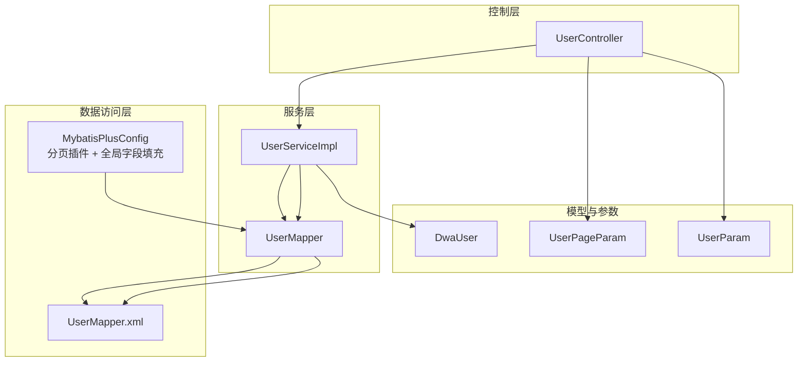
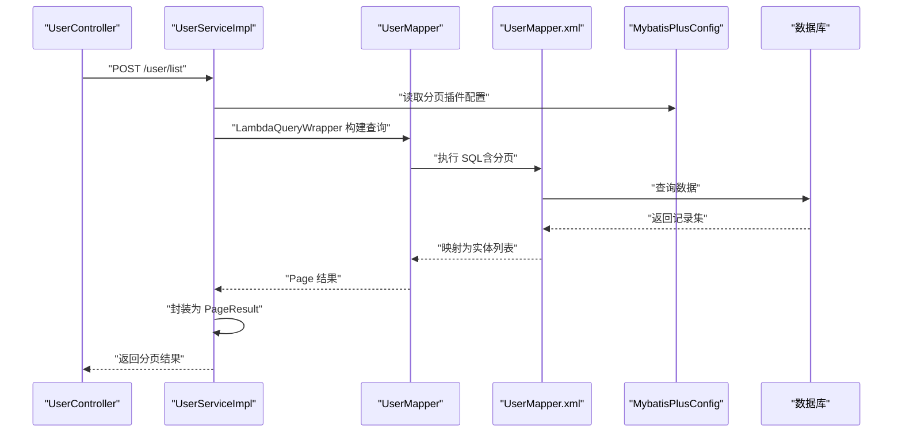
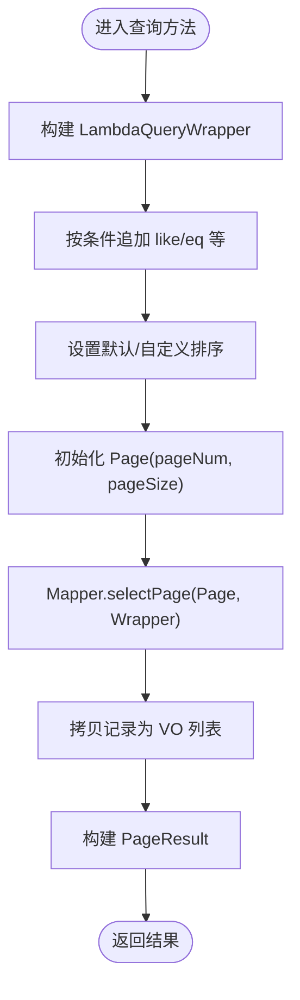
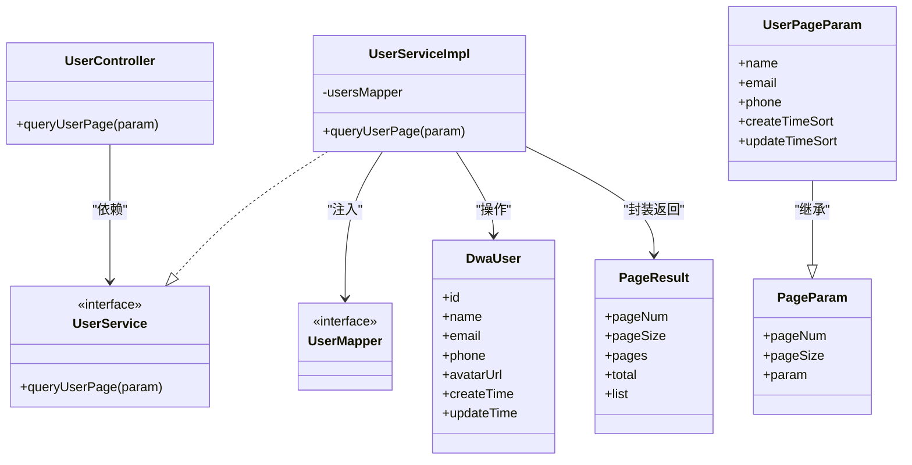

# 数据访问层

<cite>
**本文引用的文件**
- [MybatisPlusConfig.java](file://src/main/java/com/dw/admin/config/MybatisPlusConfig.java)
- [PageParam.java](file://src/main/java/com/dw/admin/common/entity/PageParam.java)
- [PageResult.java](file://src/main/java/com/dw/admin/common/entity/PageResult.java)
- [UserMapper.java](file://src/main/java/com/dw/admin/dao/UserMapper.java)
- [RoleMapper.java](file://src/main/java/com/dw/admin/dao/RoleMapper.java)
- [UserMapper.xml](file://src/main/resources/mapper/UserMapper.xml)
- [RoleMapper.xml](file://src/main/resources/mapper/RoleMapper.xml)
- [UserService.java](file://src/main/java/com/dw/admin/service/UserService.java)
- [UserServiceImpl.java](file://src/main/java/com/dw/admin/service/impl/UserServiceImpl.java)
- [UserController.java](file://src/main/java/com/dw/admin/controller/UserController.java)
- [DwaUser.java](file://src/main/java/com/dw/admin/model/entity/DwaUser.java)
- [UserPageParam.java](file://src/main/java/com/dw/admin/model/param/UserPageParam.java)
- [UserParam.java](file://src/main/java/com/dw/admin/model/param/UserParam.java)
- [init_ddl.sql](file://docs/sql/init_ddl.sql)
</cite>

## 目录
1. [简介](#简介)
2. [项目结构](#项目结构)
3. [核心组件](#核心组件)
4. [架构总览](#架构总览)
5. [组件详解](#组件详解)
6. [依赖关系分析](#依赖关系分析)
7. [性能与优化](#性能与优化)
8. [故障排查指南](#故障排查指南)
9. [结论](#结论)
10. [附录](#附录)

## 简介
本章节面向数据库开发者与架构师，系统化梳理本项目的“数据访问层”技术方案，重点覆盖以下主题：
- MyBatis Plus 的配置与分页插件使用
- Mapper 接口设计原则与命名规范
- XML 映射文件编写技巧与 SQL 优化策略
- 通用 Service 与 BaseMapper 的继承关系与使用方法
- 条件构造器的链式调用与复杂查询构建
- 数据库表结构设计与索引优化建议
- 事务管理与连接池配置最佳实践
- 性能瓶颈识别与优化方案

## 项目结构
数据访问层采用典型的分层架构：控制层通过 Service 调用 Mapper，Mapper 通过 MyBatis Plus 与 XML 映射文件交互数据库。配置集中在 MyBatis Plus 配置类中，统一注入分页插件与字段自动填充。

图表来源
- [MybatisPlusConfig.java](file://src/main/java/com/dw/admin/config/MybatisPlusConfig.java#L27-L50)
- [UserMapper.java](file://src/main/java/com/dw/admin/dao/UserMapper.java#L13-L15)
- [UserMapper.xml](file://src/main/resources/mapper/UserMapper.xml#L3-L22)
- [UserServiceImpl.java](file://src/main/java/com/dw/admin/service/impl/UserServiceImpl.java#L40-L46)
- [UserController.java](file://src/main/java/com/dw/admin/controller/UserController.java#L27-L30)
- [DwaUser.java](file://src/main/java/com/dw/admin/model/entity/DwaUser.java#L24-L72)
- [UserPageParam.java](file://src/main/java/com/dw/admin/model/param/UserPageParam.java#L14-L38)
- [UserParam.java](file://src/main/java/com/dw/admin/model/param/UserParam.java#L13-L36)

章节来源
- [MybatisPlusConfig.java](file://src/main/java/com/dw/admin/config/MybatisPlusConfig.java#L20-L52)
- [UserMapper.java](file://src/main/java/com/dw/admin/dao/UserMapper.java#L1-L16)
- [UserMapper.xml](file://src/main/resources/mapper/UserMapper.xml#L1-L22)
- [UserServiceImpl.java](file://src/main/java/com/dw/admin/service/impl/UserServiceImpl.java#L1-L270)
- [UserController.java](file://src/main/java/com/dw/admin/controller/UserController.java#L1-L138)
- [DwaUser.java](file://src/main/java/com/dw/admin/model/entity/DwaUser.java#L1-L73)
- [UserPageParam.java](file://src/main/java/com/dw/admin/model/param/UserPageParam.java#L1-L39)
- [UserParam.java](file://src/main/java/com/dw/admin/model/param/UserParam.java#L1-L37)

## 核心组件
- MyBatis Plus 配置：启用分页插件与全局字段自动填充，确保分页与审计字段一致性。
- Mapper 接口：基于 BaseMapper 提供通用 CRUD，按需扩展自定义方法。
- XML 映射：定义通用列清单与实体映射，减少重复配置。
- Service 层：封装业务逻辑、参数校验与分页查询，统一返回 PageResult。
- 控制器：对外暴露 REST 接口，负责鉴权、限流、权限等横切关注点。

章节来源
- [MybatisPlusConfig.java](file://src/main/java/com/dw/admin/config/MybatisPlusConfig.java#L27-L50)
- [UserMapper.java](file://src/main/java/com/dw/admin/dao/UserMapper.java#L13-L15)
- [UserMapper.xml](file://src/main/resources/mapper/UserMapper.xml#L5-L20)
- [UserServiceImpl.java](file://src/main/java/com/dw/admin/service/impl/UserServiceImpl.java#L230-L267)
- [UserController.java](file://src/main/java/com/dw/admin/controller/UserController.java#L128-L135)

## 架构总览
下图展示从控制器到数据库的完整调用链路，以及分页与字段填充在 MyBatis Plus 中的注入位置。

图表来源
- [UserController.java](file://src/main/java/com/dw/admin/controller/UserController.java#L128-L135)
- [UserServiceImpl.java](file://src/main/java/com/dw/admin/service/impl/UserServiceImpl.java#L230-L267)
- [UserMapper.java](file://src/main/java/com/dw/admin/dao/UserMapper.java#L13-L15)
- [UserMapper.xml](file://src/main/resources/mapper/UserMapper.xml#L3-L22)
- [MybatisPlusConfig.java](file://src/main/java/com/dw/admin/config/MybatisPlusConfig.java#L27-L33)

## 组件详解

### MyBatis Plus 配置与分页插件
- 分页插件：在拦截器中注册 PaginationInnerInterceptor，并指定数据库类型为 MySQL。分页插件应置于拦截器链末尾，避免被其他插件覆盖。
- 全局字段填充：通过 MetaObjectHandler 在插入与更新时自动填充 createTime、updateTime，保证审计字段一致性。
- 插件定制化：可在此扩展性能分析、乐观锁、租户隔离等插件。

章节来源
- [MybatisPlusConfig.java](file://src/main/java/com/dw/admin/config/MybatisPlusConfig.java#L27-L33)
- [MybatisPlusConfig.java](file://src/main/java/com/dw/admin/config/MybatisPlusConfig.java#L35-L50)

### Mapper 接口设计原则与命名规范
- 接口继承：所有 Mapper 统一继承 BaseMapper<Entity>，获得通用 CRUD 能力。
- 命名规范：接口名以实体名+Mapper 命名，如 UserMapper、RoleMapper；接口位于 dao 包。
- 自定义方法：如需复杂查询，可在 Mapper 中声明方法并在 XML 中实现；或在 Service 层使用 QueryWrapper/LambdaQueryWrapper 组合查询。

章节来源
- [UserMapper.java](file://src/main/java/com/dw/admin/dao/UserMapper.java#L13-L15)
- [RoleMapper.java](file://src/main/java/com/dw/admin/dao/RoleMapper.java#L14-L16)

### XML 映射文件编写技巧
- 命名空间：namespace 对应 Mapper 接口全限定名，避免冲突。
- 通用映射：定义 BaseResultMap 与 Base_Column_List，复用列清单与映射规则，降低维护成本。
- 动态 SQL：结合 Service 层的条件构造器，XML 中尽量保持简洁，复杂逻辑交由 Java 层处理。
- 结果映射：注意数据库列名与实体属性的驼峰映射，必要时显式声明 resultMap。

章节来源
- [UserMapper.xml](file://src/main/resources/mapper/UserMapper.xml#L3-L22)
- [RoleMapper.xml](file://src/main/resources/mapper/RoleMapper.xml#L3-L22)

### 通用 Service 与 BaseMapper 的继承关系
- BaseMapper：提供 insert、deleteById、updateById、selectById、selectList、selectPage 等通用方法。
- Service 层：在实现类中注入对应 Mapper，组合通用方法与业务逻辑；对分页场景，使用 Page<E> 与 selectPage 完成分页查询。
- 返回封装：Service 层将 Page<E> 的 records 与 total 封装为 PageResult，统一输出格式。

章节来源
- [UserServiceImpl.java](file://src/main/java/com/dw/admin/service/impl/UserServiceImpl.java#L42-L46)
- [UserServiceImpl.java](file://src/main/java/com/dw/admin/service/impl/UserServiceImpl.java#L261-L267)
- [PageResult.java](file://src/main/java/com/dw/admin/common/entity/PageResult.java#L72-L91)

### 条件构造器的链式调用与复杂查询构建
- LambdaQueryWrapper：通过实体字段的 Lambda 表达式构建条件，避免硬编码字符串，提升可维护性。
- 多条件组合：支持 eq、like、in、orderByAsc/Desc 等链式组合；默认排序优先使用业务字段，未指定时回退到审计字段。
- 分页集成：将 QueryWrapper 传入 Mapper 的 selectPage(Page, Wrapper)，实现分页查询。

图表来源
- [UserServiceImpl.java](file://src/main/java/com/dw/admin/service/impl/UserServiceImpl.java#L230-L267)
- [UserPageParam.java](file://src/main/java/com/dw/admin/model/param/UserPageParam.java#L14-L38)

章节来源
- [UserServiceImpl.java](file://src/main/java/com/dw/admin/service/impl/UserServiceImpl.java#L230-L267)
- [UserPageParam.java](file://src/main/java/com/dw/admin/model/param/UserPageParam.java#L14-L38)

### 实体类与字段填充
- 实体注解：@TableName 指定表名；@TableId/@TableField 指定主键与字段填充策略。
- 字段填充：通过 MetaObjectHandler 在插入/更新时自动填充审计字段，避免遗漏。

章节来源
- [DwaUser.java](file://src/main/java/com/dw/admin/model/entity/DwaUser.java#L24-L72)
- [MybatisPlusConfig.java](file://src/main/java/com/dw/admin/config/MybatisPlusConfig.java#L39-L49)

### 分页参数与结果封装
- 分页参数：PageParam 支持 pageNum（从 1 开始）、pageSize 与泛型 param；当 pageNum 为 0 时视为不分页。
- 结果封装：PageResult 统一封装 pageNum、pageSize、pages、total 与 list，便于前端渲染。

章节来源
- [PageParam.java](file://src/main/java/com/dw/admin/common/entity/PageParam.java#L18-L39)
- [PageResult.java](file://src/main/java/com/dw/admin/common/entity/PageResult.java#L16-L91)

### 控制器与 Service 的协作
- 控制器负责鉴权、限流、权限校验与请求参数绑定；Service 负责业务逻辑与数据访问。
- 分页接口统一返回 PageResult，非分页场景返回标准响应包装。

章节来源
- [UserController.java](file://src/main/java/com/dw/admin/controller/UserController.java#L128-L135)
- [UserService.java](file://src/main/java/com/dw/admin/service/UserService.java#L56-L56)

## 依赖关系分析

图表来源
- [UserController.java](file://src/main/java/com/dw/admin/controller/UserController.java#L27-L30)
- [UserService.java](file://src/main/java/com/dw/admin/service/UserService.java#L16-L58)
- [UserServiceImpl.java](file://src/main/java/com/dw/admin/service/impl/UserServiceImpl.java#L40-L46)
- [UserMapper.java](file://src/main/java/com/dw/admin/dao/UserMapper.java#L13-L15)
- [DwaUser.java](file://src/main/java/com/dw/admin/model/entity/DwaUser.java#L24-L72)
- [UserPageParam.java](file://src/main/java/com/dw/admin/model/param/UserPageParam.java#L14-L38)
- [PageParam.java](file://src/main/java/com/dw/admin/common/entity/PageParam.java#L18-L39)
- [PageResult.java](file://src/main/java/com/dw/admin/common/entity/PageResult.java#L16-L91)

## 性能与优化
- 分页优化
  - 使用 PageParam.pageNum 从 1 开始，避免 0 页导致全量扫描。
  - 合理设置 PageParam.pageSize，避免过大页导致内存压力与网络传输开销。
  - 在 Service 层先构建精确条件再分页，减少不必要的数据传输。
- SQL 优化
  - 优先使用索引覆盖的查询条件，避免 SELECT *，仅选择必要列。
  - 对高频过滤字段建立索引（如用户名、邮箱、手机号），并结合排序字段优化。
  - 避免在 WHERE 子句中对列进行函数运算或隐式转换，防止索引失效。
- 字段填充与审计
  - 通过全局 MetaObjectHandler 自动填充审计字段，减少业务代码冗余与遗漏。
- 连接池与事务
  - 连接池参数建议：最小空闲连接、最大活跃连接、连接超时、空闲回收周期等，结合压测调优。
  - 事务边界清晰：长事务会放大锁竞争与资源占用，尽量缩短事务时间。
- 缓存与异步
  - 对热点查询结果引入缓存（如 Redis），降低数据库压力。
  - 异步写入日志等非关键路径，减少主流程耗时。

## 故障排查指南
- 分页结果异常
  - 检查 PageParam.pageNum 是否为 0（表示不分页），以及 pageNum/pageSize 是否越界。
  - 确认 Service 层是否正确调用 Mapper.selectPage 并封装 PageResult。
- 字段填充缺失
  - 确认实体类字段注解与全局 MetaObjectHandler 配置一致。
- 查询性能差
  - 检查是否存在全表扫描、未命中索引的 LIKE '%xxx'，调整索引或改写查询条件。
- 控制器无响应
  - 检查控制器是否正确注入 Service，以及 Service 是否正确注入 Mapper。

章节来源
- [PageParam.java](file://src/main/java/com/dw/admin/common/entity/PageParam.java#L26-L33)
- [PageResult.java](file://src/main/java/com/dw/admin/common/entity/PageResult.java#L72-L91)
- [UserServiceImpl.java](file://src/main/java/com/dw/admin/service/impl/UserServiceImpl.java#L261-L267)
- [MybatisPlusConfig.java](file://src/main/java/com/dw/admin/config/MybatisPlusConfig.java#L39-L49)

## 结论
本项目在数据访问层遵循“配置集中、接口简洁、XML 可复用、Service 专注业务”的设计原则，借助 MyBatis Plus 的分页插件与字段自动填充，显著降低了重复工作与出错概率。通过合理的参数封装与结果统一封装，提升了前后端协作效率。建议在后续迭代中持续完善索引策略、连接池参数与缓存机制，进一步提升整体性能与稳定性。

## 附录

### 数据库表结构与索引建议
- 用户表（dwa_user）
  - 主键：id
  - 建议索引：唯一索引(name)，可选索引(email, phone)
- 角色表（dwa_role）
  - 主键：id
  - 建议索引：唯一索引(role_code)，普通索引(role_name, status)
- 用户角色关联表（dwa_user_role）
  - 主键：id
  - 建议索引：普通索引(user_id), (role_code)
- 文件信息表（dwa_file）
  - 主键：file_id
  - 建议索引：普通索引(file_name, file_type, file_path)
- 登录日志表（dwa_login_log）
  - 主键：id
  - 建议索引：普通索引(user_id, login_time), (ip_addr)

章节来源
- [init_ddl.sql](file://docs/sql/init_ddl.sql#L11-L22)
- [init_ddl.sql](file://docs/sql/init_ddl.sql#L27-L38)
- [init_ddl.sql](file://docs/sql/init_ddl.sql#L43-L51)
- [init_ddl.sql](file://docs/sql/init_ddl.sql#L56-L70)
- [init_ddl.sql](file://docs/sql/init_ddl.sql#L75-L87)