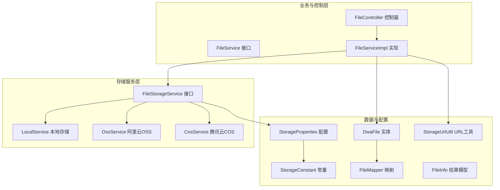
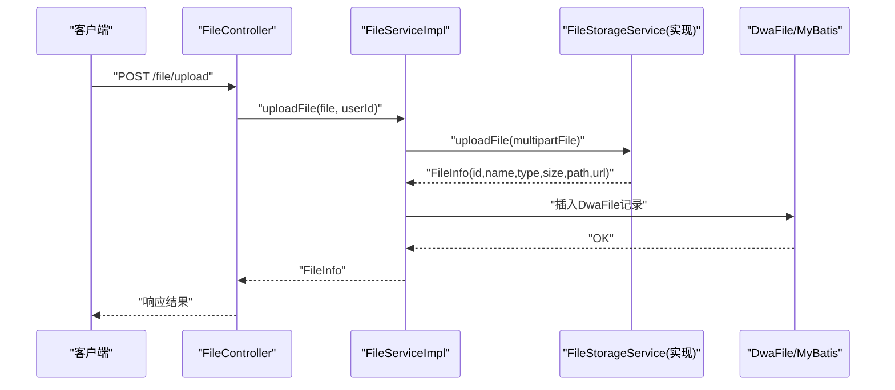
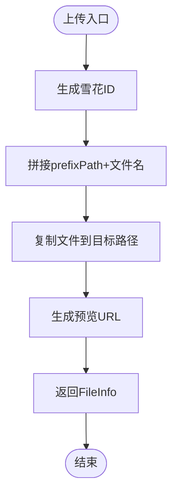
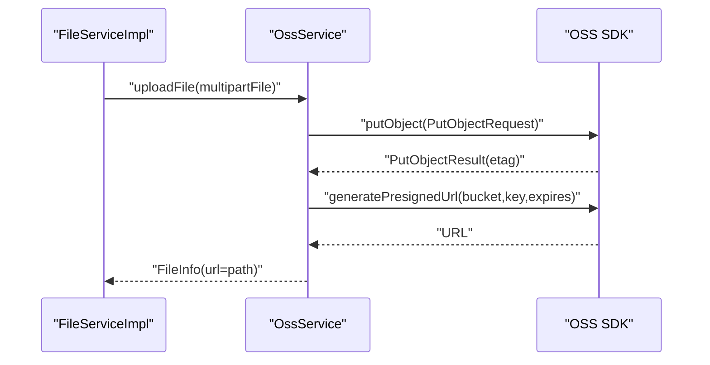
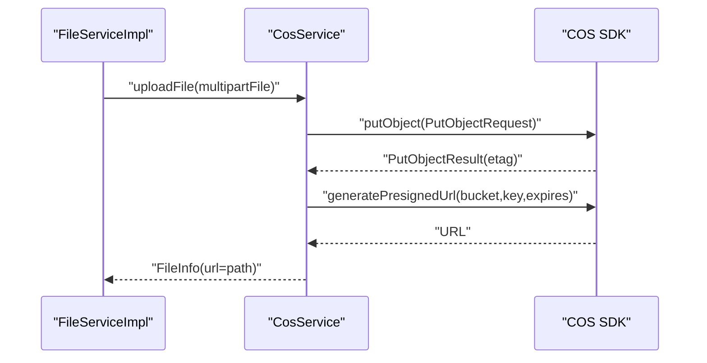
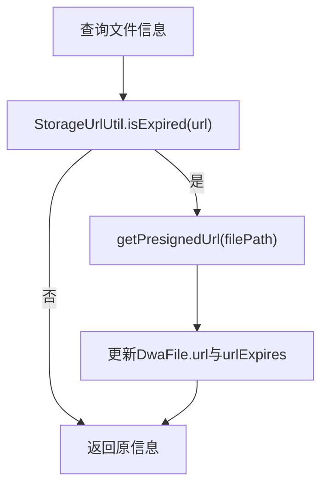
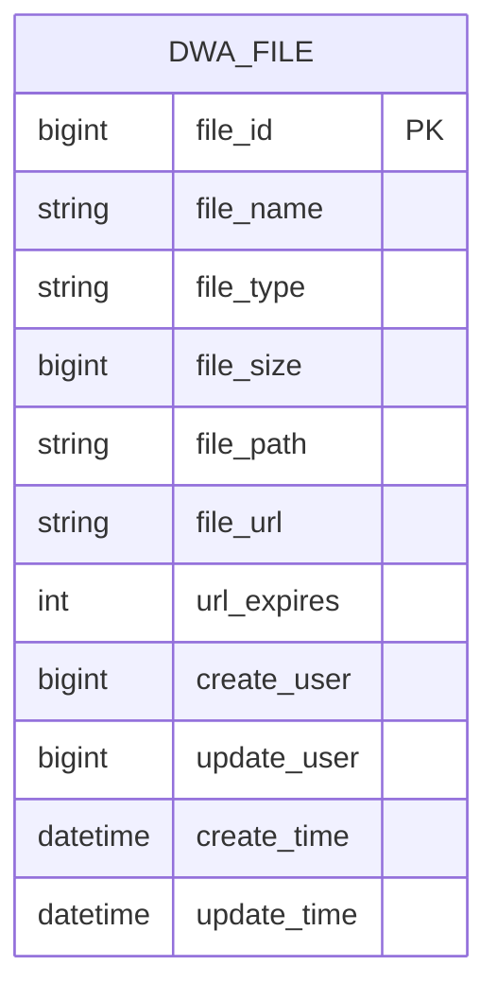
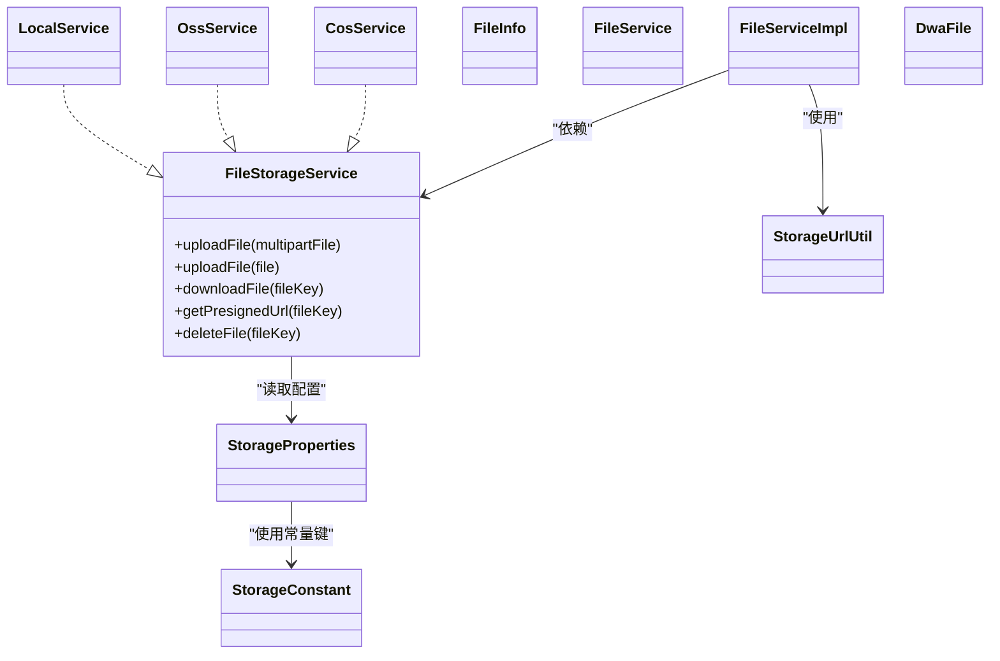

# 多云存储支持

<cite>
**本文引用的文件**
- [FileStorageService.java](file://src/main/java/com/dw/admin/components/storage/FileStorageService.java)
- [LocalService.java](file://src/main/java/com/dw/admin/components/storage/local/LocalService.java)
- [OssService.java](file://src/main/java/com/dw/admin/components/storage/oss/OssService.java)
- [CosService.java](file://src/main/java/com/dw/admin/components/storage/cos/CosService.java)
- [StorageProperties.java](file://src/main/java/com/dw/admin/components/storage/StorageProperties.java)
- [StorageConstant.java](file://src/main/java/com/dw/admin/components/storage/StorageConstant.java)
- [StorageUrlUtil.java](file://src/main/java/com/dw/admin/components/storage/StorageUrlUtil.java)
- [FileInfo.java](file://src/main/java/com/dw/admin/components/storage/FileInfo.java)
- [FileService.java](file://src/main/java/com/dw/admin/service/FileService.java)
- [FileServiceImpl.java](file://src/main/java/com/dw/admin/service/impl/FileServiceImpl.java)
- [FileController.java](file://src/main/java/com/dw/admin/controller/FileController.java)
- [DwaFile.java](file://src/main/java/com/dw/admin/model/entity/DwaFile.java)
- [FileMapper.java](file://src/main/java/com/dw/admin/dao/FileMapper.java)
- [application.yml](file://src/main/resources/application.yml)
- [双重云存储支持设计方案.md](file://docs/双重云存储支持设计方案.md)
</cite>

## 目录
1. [简介](#简介)
2. [项目结构](#项目结构)
3. [核心组件](#核心组件)
4. [架构总览](#架构总览)
5. [详细组件分析](#详细组件分析)
6. [依赖关系分析](#依赖关系分析)
7. [性能考量](#性能考量)
8. [故障排查指南](#故障排查指南)
9. [结论](#结论)
10. [附录](#附录)

## 简介
本文件面向运维人员与系统管理员，提供多云存储支持的完整技术文档。项目通过统一接口抽象，实现了对本地存储(LocalService)、阿里云OSS(OssService)与腾讯云COS(CosService)的统一接入与配置驱动切换。文档深入解析各存储平台的文件系统操作、SDK集成、对象管理、签名机制与URL过期处理，并给出配置差异、性能特点、成本考量、迁移与备份策略、故障转移机制、选型指南与最佳实践。

## 项目结构
多云存储模块位于 components/storage 下，采用按平台拆分的包结构，配合统一接口与配置类实现“配置即服务”的切换能力；业务层通过 FileService/FileServiceImpl 与控制器 FileController 调用统一接口完成文件上传、下载、删除与预签名URL生成等操作；数据持久化通过 MyBatis-Plus 的 DwaFile 实体与 FileMapper 完成。

**图表来源**
- [FileStorageService.java](file://src/main/java/com/dw/admin/components/storage/FileStorageService.java#L1-L52)
- [LocalService.java](file://src/main/java/com/dw/admin/components/storage/local/LocalService.java#L50-L283)
- [OssService.java](file://src/main/java/com/dw/admin/components/storage/oss/OssService.java#L47-L298)
- [CosService.java](file://src/main/java/com/dw/admin/components/storage/cos/CosService.java#L48-L322)
- [FileService.java](file://src/main/java/com/dw/admin/service/FileService.java#L1-L43)
- [FileServiceImpl.java](file://src/main/java/com/dw/admin/service/impl/FileServiceImpl.java#L34-L234)
- [FileController.java](file://src/main/java/com/dw/admin/controller/FileController.java#L21-L83)
- [DwaFile.java](file://src/main/java/com/dw/admin/model/entity/DwaFile.java#L24-L88)
- [FileMapper.java](file://src/main/java/com/dw/admin/dao/FileMapper.java#L14-L17)
- [StorageProperties.java](file://src/main/java/com/dw/admin/components/storage/StorageProperties.java#L14-L82)
- [StorageConstant.java](file://src/main/java/com/dw/admin/components/storage/StorageConstant.java#L8-L27)
- [StorageUrlUtil.java](file://src/main/java/com/dw/admin/components/storage/StorageUrlUtil.java#L17-L112)
- [FileInfo.java](file://src/main/java/com/dw/admin/components/storage/FileInfo.java#L20-L44)

**章节来源**
- [FileStorageService.java](file://src/main/java/com/dw/admin/components/storage/FileStorageService.java#L1-L52)
- [StorageProperties.java](file://src/main/java/com/dw/admin/components/storage/StorageProperties.java#L14-L82)
- [StorageConstant.java](file://src/main/java/com/dw/admin/components/storage/StorageConstant.java#L8-L27)
- [StorageUrlUtil.java](file://src/main/java/com/dw/admin/components/storage/StorageUrlUtil.java#L17-L112)
- [FileInfo.java](file://src/main/java/com/dw/admin/components/storage/FileInfo.java#L20-L44)
- [FileService.java](file://src/main/java/com/dw/admin/service/FileService.java#L1-L43)
- [FileServiceImpl.java](file://src/main/java/com/dw/admin/service/impl/FileServiceImpl.java#L34-L234)
- [FileController.java](file://src/main/java/com/dw/admin/controller/FileController.java#L21-L83)
- [DwaFile.java](file://src/main/java/com/dw/admin/model/entity/DwaFile.java#L24-L88)
- [FileMapper.java](file://src/main/java/com/dw/admin/dao/FileMapper.java#L14-L17)
- [application.yml](file://src/main/resources/application.yml#L40-L64)

## 核心组件
- 统一接口 FileStorageService：定义上传、下载、删除、预签名URL等标准能力，屏蔽不同云厂商差异。
- 本地存储 LocalService：基于文件系统与Tomcat内置下载，提供预览路径与安全校验。
- 阿里云OSS OssService：基于OSS SDK进行对象上传、下载、删除与预签名URL生成。
- 腾讯云COS CosService：基于COS SDK进行对象上传、下载、删除与预签名URL生成。
- 配置与常量 StorageProperties/StorageConstant：集中管理各平台配置与切换键。
- URL工具 StorageUrlUtil：解析与判断预签名URL过期时间，支撑URL刷新逻辑。
- 数据模型 FileInfo/DwaFile：封装上传结果与数据库持久化字段。
- 业务层 FileService/FileServiceImpl：编排存储服务调用、URL过期检测与刷新、分页查询与入库。

**章节来源**
- [FileStorageService.java](file://src/main/java/com/dw/admin/components/storage/FileStorageService.java#L12-L52)
- [LocalService.java](file://src/main/java/com/dw/admin/components/storage/local/LocalService.java#L50-L283)
- [OssService.java](file://src/main/java/com/dw/admin/components/storage/oss/OssService.java#L47-L298)
- [CosService.java](file://src/main/java/com/dw/admin/components/storage/cos/CosService.java#L48-L322)
- [StorageProperties.java](file://src/main/java/com/dw/admin/components/storage/StorageProperties.java#L14-L82)
- [StorageConstant.java](file://src/main/java/com/dw/admin/components/storage/StorageConstant.java#L8-L27)
- [StorageUrlUtil.java](file://src/main/java/com/dw/admin/components/storage/StorageUrlUtil.java#L29-L76)
- [FileInfo.java](file://src/main/java/com/dw/admin/components/storage/FileInfo.java#L20-L44)
- [FileService.java](file://src/main/java/com/dw/admin/service/FileService.java#L14-L42)
- [FileServiceImpl.java](file://src/main/java/com/dw/admin/service/impl/FileServiceImpl.java#L46-L171)
- [DwaFile.java](file://src/main/java/com/dw/admin/model/entity/DwaFile.java#L24-L88)

## 架构总览
多云存储采用“统一接口 + 条件装配”的架构，通过配置键 dwa.storage.provider 决定当前启用的存储实现。业务层仅依赖接口，不感知具体实现，从而实现零代码变更的平台切换。

**图表来源**
- [FileController.java](file://src/main/java/com/dw/admin/controller/FileController.java#L31-L36)
- [FileServiceImpl.java](file://src/main/java/com/dw/admin/service/impl/FileServiceImpl.java#L46-L76)
- [FileStorageService.java](file://src/main/java/com/dw/admin/components/storage/FileStorageService.java#L20-L28)
- [DwaFile.java](file://src/main/java/com/dw/admin/model/entity/DwaFile.java#L24-L88)

## 详细组件分析

### 本地存储 LocalService
- 文件系统操作与路径管理
  - 上传：生成雪花ID拼接原始文件名，写入 prefixPath 指定目录，计算大小，返回 FileInfo。
  - 下载：通过 HttpServletResponse 输出流写出文件字节流，设置 Content-Disposition。
  - 删除：删除物理文件并记录日志。
  - 预览：通过条件装配与映射路径对外暴露预览接口，内置路径穿越安全校验。
- 配置要点
  - preview-domain/preview-path/prefix-path 由 StorageProperties.LocalConfig 提供。
  - 通过 ConditionalOnProperty 依据 dwa.storage.provider=local 激活。
- URL过期与刷新
  - 本地预览URL由配置拼接，不涉及签名，因此 URL过期判断与刷新逻辑由上层统一处理。

**图表来源**
- [LocalService.java](file://src/main/java/com/dw/admin/components/storage/local/LocalService.java#L64-L99)
- [StorageProperties.java](file://src/main/java/com/dw/admin/components/storage/StorageProperties.java#L71-L82)

**章节来源**
- [LocalService.java](file://src/main/java/com/dw/admin/components/storage/local/LocalService.java#L50-L283)
- [StorageProperties.java](file://src/main/java/com/dw/admin/components/storage/StorageProperties.java#L71-L82)

### 阿里云OSS OssService
- SDK集成与Bucket配置
  - 通过 OSSClientBuilder 构建客户端，使用 endpoint/accessKey/secretKey/bucketName。
  - 上传：构造 PutObjectRequest，写入 InputStream，记录ETag，生成预签名URL。
  - 下载：getObject 获取 OSSObject 输入流，写入响应输出流。
  - 删除：deleteObject 返回VoidResult。
  - 预签名URL：基于 OSSClient.generatePresignedUrl，过期时间来自配置 url-expires。
- 路径与命名
  - fileKey = prefixPath + fileId + "_" + originalFilename，便于按前缀归档与检索。
- 异常处理
  - 统一捕获异常并抛出业务异常，finally中关闭OSSClient。

**图表来源**
- [OssService.java](file://src/main/java/com/dw/admin/components/storage/oss/OssService.java#L58-L109)
- [OssService.java](file://src/main/java/com/dw/admin/components/storage/oss/OssService.java#L229-L255)

**章节来源**
- [OssService.java](file://src/main/java/com/dw/admin/components/storage/oss/OssService.java#L47-L298)
- [StorageProperties.java](file://src/main/java/com/dw/admin/components/storage/StorageProperties.java#L42-L55)

### 腾讯云COS CosService
- API调用与签名机制
  - 通过 COSClient 构建客户端，使用 region/secretId/secretKey/bucketName。
  - 上传：设置 ObjectMetadata，构造 PutObjectRequest，返回ETag，生成预签名URL。
  - 下载：GetObjectRequest 获取 COSObject，读取输入流写入响应。
  - 删除：deleteObject。
  - 预签名URL：generatePresignedUrl，过期时间来自配置 url-expires。
- 分片上传
  - 当前实现为简单上传；若需分片上传，可在现有 PutObjectRequest 基础上扩展 Multi-Part Upload API（需引入相应SDK能力与配置）。

**图表来源**
- [CosService.java](file://src/main/java/com/dw/admin/components/storage/cos/CosService.java#L59-L113)
- [CosService.java](file://src/main/java/com/dw/admin/components/storage/cos/CosService.java#L228-L253)

**章节来源**
- [CosService.java](file://src/main/java/com/dw/admin/components/storage/cos/CosService.java#L48-L322)
- [StorageProperties.java](file://src/main/java/com/dw/admin/components/storage/StorageProperties.java#L57-L69)

### 统一接口与URL过期处理
- 统一接口 FileStorageService：uploadFile/downloadFile/deleteFile/getPresignedUrl。
- URL过期判断与刷新：StorageUrlUtil 提取OSS的 Expires 或 COS的 q-sign-time，FileServiceImpl 在查询文件信息时检测过期并刷新URL，随后更新数据库。

**图表来源**
- [FileServiceImpl.java](file://src/main/java/com/dw/admin/service/impl/FileServiceImpl.java#L150-L171)
- [StorageUrlUtil.java](file://src/main/java/com/dw/admin/components/storage/StorageUrlUtil.java#L29-L76)

**章节来源**
- [FileStorageService.java](file://src/main/java/com/dw/admin/components/storage/FileStorageService.java#L12-L52)
- [StorageUrlUtil.java](file://src/main/java/com/dw/admin/components/storage/StorageUrlUtil.java#L17-L112)
- [FileServiceImpl.java](file://src/main/java/com/dw/admin/service/impl/FileServiceImpl.java#L146-L171)

### 数据模型与持久化
- FileInfo：封装上传后的文件标识、类型、大小、路径与URL。
- DwaFile：数据库实体，包含文件名、类型、大小、路径、URL及过期时间、创建与更新信息。
- FileMapper：MyBatis-Plus映射，支持分页查询与排序。

**图表来源**
- [DwaFile.java](file://src/main/java/com/dw/admin/model/entity/DwaFile.java#L24-L88)
- [FileMapper.java](file://src/main/java/com/dw/admin/dao/FileMapper.java#L14-L17)

**章节来源**
- [FileInfo.java](file://src/main/java/com/dw/admin/components/storage/FileInfo.java#L20-L44)
- [DwaFile.java](file://src/main/java/com/dw/admin/model/entity/DwaFile.java#L24-L88)
- [FileMapper.java](file://src/main/java/com/dw/admin/dao/FileMapper.java#L14-L17)

## 依赖关系分析
- 组件耦合
  - FileServiceImpl 依赖 FileStorageService 接口，不依赖具体实现，耦合低、内聚高。
  - LocalService/OssService/CosService 均实现 FileStorageService，遵循开闭原则。
- 外部依赖
  - OSS SDK、COS SDK、Hutool工具库、Spring Web MVC、MyBatis-Plus。
- 配置依赖
  - 通过 StorageProperties 与 StorageConstant 的配置前缀与键值，实现运行时切换。

**图表来源**
- [FileStorageService.java](file://src/main/java/com/dw/admin/components/storage/FileStorageService.java#L12-L52)
- [LocalService.java](file://src/main/java/com/dw/admin/components/storage/local/LocalService.java#L50-L50)
- [OssService.java](file://src/main/java/com/dw/admin/components/storage/oss/OssService.java#L47-L47)
- [CosService.java](file://src/main/java/com/dw/admin/components/storage/cos/CosService.java#L48-L48)
- [StorageProperties.java](file://src/main/java/com/dw/admin/components/storage/StorageProperties.java#L14-L82)
- [StorageConstant.java](file://src/main/java/com/dw/admin/components/storage/StorageConstant.java#L8-L27)
- [StorageUrlUtil.java](file://src/main/java/com/dw/admin/components/storage/StorageUrlUtil.java#L17-L112)
- [FileInfo.java](file://src/main/java/com/dw/admin/components/storage/FileInfo.java#L20-L44)
- [FileService.java](file://src/main/java/com/dw/admin/service/FileService.java#L14-L42)
- [FileServiceImpl.java](file://src/main/java/com/dw/admin/service/impl/FileServiceImpl.java#L34-L37)
- [DwaFile.java](file://src/main/java/com/dw/admin/model/entity/DwaFile.java#L24-L88)

**章节来源**
- [FileStorageService.java](file://src/main/java/com/dw/admin/components/storage/FileStorageService.java#L12-L52)
- [StorageProperties.java](file://src/main/java/com/dw/admin/components/storage/StorageProperties.java#L14-L82)
- [StorageConstant.java](file://src/main/java/com/dw/admin/components/storage/StorageConstant.java#L8-L27)
- [StorageUrlUtil.java](file://src/main/java/com/dw/admin/components/storage/StorageUrlUtil.java#L17-L112)
- [FileInfo.java](file://src/main/java/com/dw/admin/components/storage/FileInfo.java#L20-L44)
- [FileService.java](file://src/main/java/com/dw/admin/service/FileService.java#L14-L42)
- [FileServiceImpl.java](file://src/main/java/com/dw/admin/service/impl/FileServiceImpl.java#L34-L37)
- [DwaFile.java](file://src/main/java/com/dw/admin/model/entity/DwaFile.java#L24-L88)

## 性能考量
- 上传性能
  - 本地存储：受限于磁盘IO与网络带宽；适合小规模或开发测试场景。
  - 阿里云OSS/COS：具备高并发与边缘节点加速能力，适合大流量与跨地域访问。
- 下载性能
  - 本地存储：直读磁盘，延迟低但无CDN加速。
  - 阿里云OSS/COS：结合对象存储的全球分发与CDN，显著降低跨地域访问延迟。
- 成本
  - 本地存储：无云厂商费用，但需自管硬件、带宽与容量。
  - 阿里云OSS/COS：按请求次数、存储容量、流量计费，支持多种存储类型与低频存储节省成本。
- 可靠性
  - 本地存储：单机可靠性有限，需自建备份与容灾。
  - 阿里云OSS/COS：多副本、跨区域冗余、生命周期管理与合规备份，可靠性更高。
- URL过期与刷新
  - 通过 StorageUrlUtil 的过期检测与 FileServiceImpl 的自动刷新，避免因URL失效导致的访问失败。

[本节为通用性能讨论，不直接分析具体文件，故无“章节来源”]

## 故障排查指南
- 常见问题定位
  - 上传失败：检查 StorageProperties 配置是否正确、网络连通性、桶权限与前缀路径是否存在。
  - 下载失败：确认 fileKey 是否正确、URL是否过期、响应输出流是否正常写出。
  - 删除失败：核对 fileKey 与桶名、权限是否允许删除。
  - 本地预览失败：检查 prefixPath 与预览路径映射、路径穿越防护逻辑。
- 日志与异常
  - 各实现类均在异常处记录错误日志并抛出业务异常，便于快速定位。
  - FileServiceImpl 在刷新URL时捕获异常并记录，避免影响整体流程。
- 配置验证
  - 通过 application.yml 的 dwa.storage.provider 与各子配置项验证，确保键名与格式正确。

**章节来源**
- [LocalService.java](file://src/main/java/com/dw/admin/components/storage/local/LocalService.java#L154-L183)
- [OssService.java](file://src/main/java/com/dw/admin/components/storage/oss/OssService.java#L177-L213)
- [CosService.java](file://src/main/java/com/dw/admin/components/storage/cos/CosService.java#L184-L220)
- [FileServiceImpl.java](file://src/main/java/com/dw/admin/service/impl/FileServiceImpl.java#L150-L171)
- [application.yml](file://src/main/resources/application.yml#L40-L64)

## 结论
本多云存储方案以统一接口为核心，结合配置驱动与条件装配，实现了对本地存储、阿里云OSS与腾讯云COS的无缝切换与统一管理。通过清晰的职责划分、完善的URL过期处理与健壮的异常日志体系，为运维与管理员提供了稳定、可扩展且易维护的文件存储解决方案。建议在生产中优先采用云厂商对象存储，结合CDN与生命周期策略优化成本与性能，并建立多云备份与故障转移机制以提升可靠性。

[本节为总结性内容，不直接分析具体文件，故无“章节来源”]

## 附录

### 配置差异与最佳实践
- 配置键与含义
  - dwa.storage.provider：选择存储提供商（local/aliyun-oss/tencent-cos）。
  - dwa.storage.aliyun-oss.*：endpoint、bucket-name、access-key、secret-key、prefix-path、url-expires。
  - dwa.storage.tencent-cos.*：region、bucket-name、secret-id、secret-key、prefix-path、url-expires。
  - dwa.storage.local.*：preview-domain、preview-path、prefix-path。
- 最佳实践
  - 使用环境变量注入敏感信息，避免硬编码。
  - 为不同环境准备独立配置文件，严格区分开发/测试/生产。
  - 为URL过期时间设置合理值，结合自动刷新策略保障用户体验。
  - 对大文件上传建议结合断点续传或分片上传（COS/ OSS均支持），并在应用层做好重试与进度上报。

**章节来源**
- [application.yml](file://src/main/resources/application.yml#L40-L64)
- [StorageProperties.java](file://src/main/java/com/dw/admin/components/storage/StorageProperties.java#L14-L82)
- [StorageConstant.java](file://src/main/java/com/dw/admin/components/storage/StorageConstant.java#L8-L27)

### 存储迁移、备份与故障转移
- 迁移策略
  - 通过 dwa.storage.provider 切换至目标平台，逐步将存量文件迁移至新平台并更新数据库路径。
  - 使用批量任务扫描 DwaFile，逐条触发上传/下载与删除，确保一致性。
- 备份策略
  - 云存储侧开启生命周期与跨区域复制；本地存储侧定期快照与异地备份。
- 故障转移
  - 主平台不可用时，临时切换至备用平台；通过统一接口与配置切换实现零代码变更。

[本节为通用运维建议，不直接分析具体文件，故无“章节来源”]

### 平台选型指南
- 本地存储
  - 适用：小规模、开发测试、对延迟敏感且无公网访问需求。
  - 注意：需自管扩容、备份与高可用。
- 阿里云OSS
  - 适用：国内与全球访问、需要CDN加速、成熟的企业级能力。
  - 特点：多区域节点、丰富存储类型、生命周期管理。
- 腾讯云COS
  - 适用：国内用户为主、与腾讯生态集成良好。
  - 特点：与微信/企业微信等场景契合，API易用。

[本节为通用选型建议，不直接分析具体文件，故无“章节来源”]