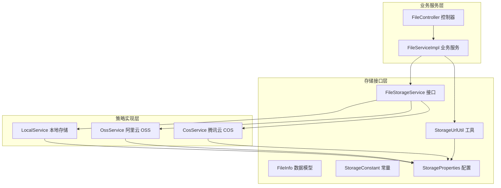
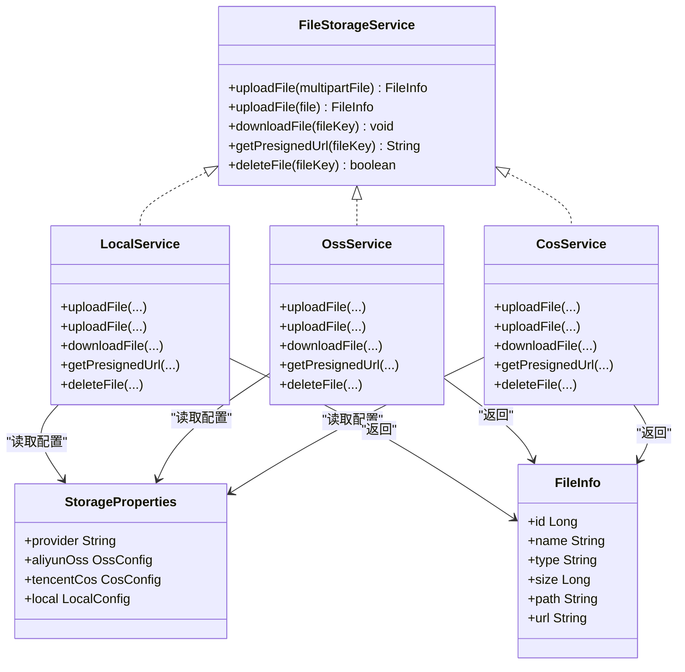
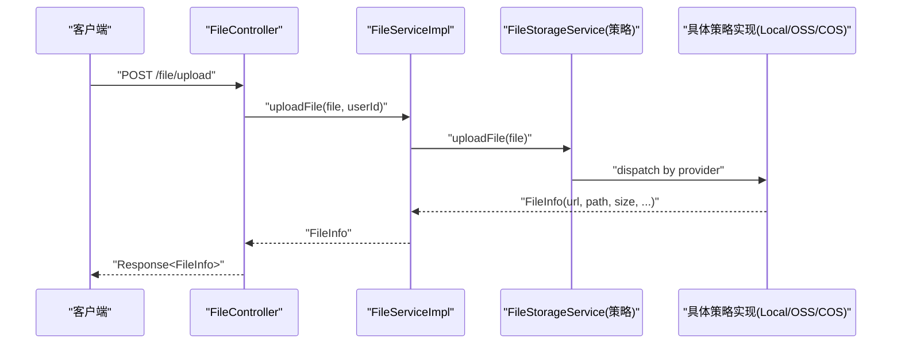
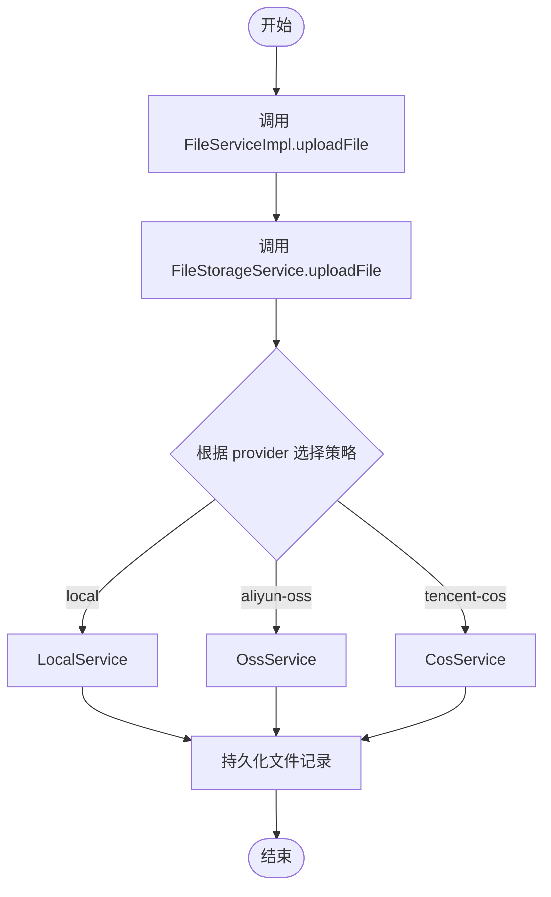
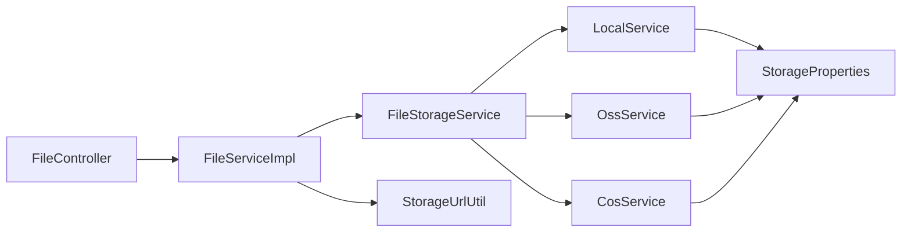

# 存储策略模式

<cite>
**本文引用的文件**
- [FileStorageService.java](file://src/main/java/com/dw/admin/components/storage/FileStorageService.java)
- [StorageConstant.java](file://src/main/java/com/dw/admin/components/storage/StorageConstant.java)
- [StorageProperties.java](file://src/main/java/com/dw/admin/components/storage/StorageProperties.java)
- [FileInfo.java](file://src/main/java/com/dw/admin/components/storage/FileInfo.java)
- [StorageUrlUtil.java](file://src/main/java/com/dw/admin/components/storage/StorageUrlUtil.java)
- [LocalService.java](file://src/main/java/com/dw/admin/components/storage/local/LocalService.java)
- [CosService.java](file://src/main/java/com/dw/admin/components/storage/cos/CosService.java)
- [OssService.java](file://src/main/java/com/dw/admin/components/storage/oss/OssService.java)
- [FileServiceImpl.java](file://src/main/java/com/dw/admin/service/impl/FileServiceImpl.java)
- [FileController.java](file://src/main/java/com/dw/admin/controller/FileController.java)
- [application.yml](file://src/main/resources/application.yml)
- [FileStorageServiceTest.java](file://src/test/java/com/dw/admin/test/storage/FileStorageServiceTest.java)
</cite>

## 目录
1. [引言](#引言)
2. [项目结构](#项目结构)
3. [核心组件](#核心组件)
4. [架构总览](#架构总览)
5. [详细组件分析](#详细组件分析)
6. [依赖关系分析](#依赖关系分析)
7. [性能考量](#性能考量)
8. [故障排查指南](#故障排查指南)
9. [结论](#结论)
10. [附录](#附录)

## 引言
本设计文档围绕“存储策略模式”展开，系统性阐述统一文件存储接口与多存储后端（本地、阿里云 OSS、腾讯云 COS）的策略实现。重点包括：
- FileStorageService 接口的设计理念与职责边界
- 存储策略的选择机制与动态切换
- StorageConstant 常量与 StorageProperties 配置管理
- 策略模式在多存储平台支持中的优势与扩展性
- 策略注册、查找与实例化的流程
- 自定义存储策略的开发指南与最佳实践
- 各存储策略的性能特征与适用场景
- 面向架构师与高级开发者的完整实现参考

## 项目结构
存储相关模块位于 components/storage 及其子包中，配合 service 层与 controller 层完成端到端的文件上传、下载、删除与 URL 预签名能力；配置通过 application.yml 的 dwa.storage 节点集中管理。

图表来源
- [FileStorageService.java](file://src/main/java/com/dw/admin/components/storage/FileStorageService.java#L12-L52)
- [StorageConstant.java](file://src/main/java/com/dw/admin/components/storage/StorageConstant.java#L8-L27)
- [StorageProperties.java](file://src/main/java/com/dw/admin/components/storage/StorageProperties.java#L12-L82)
- [FileInfo.java](file://src/main/java/com/dw/admin/components/storage/FileInfo.java#L16-L44)
- [StorageUrlUtil.java](file://src/main/java/com/dw/admin/components/storage/StorageUrlUtil.java#L17-L112)
- [LocalService.java](file://src/main/java/com/dw/admin/components/storage/local/LocalService.java#L43-L283)
- [OssService.java](file://src/main/java/com/dw/admin/components/storage/oss/OssService.java#L40-L298)
- [CosService.java](file://src/main/java/com/dw/admin/components/storage/cos/CosService.java#L42-L322)
- [FileServiceImpl.java](file://src/main/java/com/dw/admin/service/impl/FileServiceImpl.java#L32-L234)
- [FileController.java](file://src/main/java/com/dw/admin/controller/FileController.java#L21-L83)

章节来源
- [FileStorageService.java](file://src/main/java/com/dw/admin/components/storage/FileStorageService.java#L12-L52)
- [StorageConstant.java](file://src/main/java/com/dw/admin/components/storage/StorageConstant.java#L8-L27)
- [StorageProperties.java](file://src/main/java/com/dw/admin/components/storage/StorageProperties.java#L12-L82)
- [FileInfo.java](file://src/main/java/com/dw/admin/components/storage/FileInfo.java#L16-L44)
- [StorageUrlUtil.java](file://src/main/java/com/dw/admin/components/storage/StorageUrlUtil.java#L17-L112)
- [LocalService.java](file://src/main/java/com/dw/admin/components/storage/local/LocalService.java#L43-L283)
- [OssService.java](file://src/main/java/com/dw/admin/components/storage/oss/OssService.java#L40-L298)
- [CosService.java](file://src/main/java/com/dw/admin/components/storage/cos/CosService.java#L42-L322)
- [FileServiceImpl.java](file://src/main/java/com/dw/admin/service/impl/FileServiceImpl.java#L32-L234)
- [FileController.java](file://src/main/java/com/dw/admin/controller/FileController.java#L21-L83)
- [application.yml](file://src/main/resources/application.yml#L33-L64)

## 核心组件
- FileStorageService：统一文件存储服务接口，定义上传、下载、删除、预签名 URL 获取等能力，屏蔽底层差异。
- StorageConstant：存储常量定义，包括配置前缀、提供商键及各提供商标识。
- StorageProperties：基于 Spring Boot 配置属性的存储配置类，按提供商拆分子配置（OSS、COS、Local）。
- FileInfo：文件上传后的统一返回数据模型，包含文件 ID、名称、类型、大小、路径与 URL。
- StorageUrlUtil：URL 过期检测与参数解析工具，用于判断预签名 URL 是否过期并提取过期时间。
- LocalService/OssService/CosService：三种具体策略实现，分别对接本地文件系统、阿里云 OSS 与腾讯云 COS。
- FileServiceImpl/FileController：业务服务与控制器，调用 FileStorageService 完成文件生命周期管理。

章节来源
- [FileStorageService.java](file://src/main/java/com/dw/admin/components/storage/FileStorageService.java#L12-L52)
- [StorageConstant.java](file://src/main/java/com/dw/admin/components/storage/StorageConstant.java#L8-L27)
- [StorageProperties.java](file://src/main/java/com/dw/admin/components/storage/StorageProperties.java#L12-L82)
- [FileInfo.java](file://src/main/java/com/dw/admin/components/storage/FileInfo.java#L16-L44)
- [StorageUrlUtil.java](file://src/main/java/com/dw/admin/components/storage/StorageUrlUtil.java#L17-L112)
- [LocalService.java](file://src/main/java/com/dw/admin/components/storage/local/LocalService.java#L43-L283)
- [OssService.java](file://src/main/java/com/dw/admin/components/storage/oss/OssService.java#L40-L298)
- [CosService.java](file://src/main/java/com/dw/admin/components/storage/cos/CosService.java#L42-L322)
- [FileServiceImpl.java](file://src/main/java/com/dw/admin/service/impl/FileServiceImpl.java#L32-L234)
- [FileController.java](file://src/main/java/com/dw/admin/controller/FileController.java#L21-L83)

## 架构总览
策略模式在此处体现为：FileStorageService 作为抽象策略接口，LocalService/OssService/CosService 作为具体策略实现，FileServiceImpl 通过注入 FileStorageService 使用策略，运行时根据配置动态选择具体策略。

图表来源
- [FileStorageService.java](file://src/main/java/com/dw/admin/components/storage/FileStorageService.java#L12-L52)
- [LocalService.java](file://src/main/java/com/dw/admin/components/storage/local/LocalService.java#L43-L283)
- [OssService.java](file://src/main/java/com/dw/admin/components/storage/oss/OssService.java#L40-L298)
- [CosService.java](file://src/main/java/com/dw/admin/components/storage/cos/CosService.java#L42-L322)
- [StorageProperties.java](file://src/main/java/com/dw/admin/components/storage/StorageProperties.java#L12-L82)
- [FileInfo.java](file://src/main/java/com/dw/admin/components/storage/FileInfo.java#L16-L44)

## 详细组件分析

### 接口层：FileStorageService
- 设计理念：以最小可用能力集定义文件存储操作，确保上层业务不感知底层差异。
- 关键方法：上传（支持 MultipartFile 与本地 File）、下载、预签名 URL 获取、删除。
- 价值：为多存储平台提供统一契约，便于横向扩展与动态切换。

章节来源
- [FileStorageService.java](file://src/main/java/com/dw/admin/components/storage/FileStorageService.java#L12-L52)

### 配置层：StorageConstant 与 StorageProperties
- StorageConstant
  - 定义配置前缀与提供商键，保证配置键的一致性与可维护性。
  - 提供各提供商标识常量，避免魔法字符串。
- StorageProperties
  - 通过 @ConfigurationProperties 绑定 dwa.storage.* 前缀配置。
  - 按提供商拆分子配置：OssConfig、CosConfig、LocalConfig。
  - 支持 URL 过期时间等通用参数，便于统一处理预签名 URL 生命周期。

章节来源
- [StorageConstant.java](file://src/main/java/com/dw/admin/components/storage/StorageConstant.java#L8-L27)
- [StorageProperties.java](file://src/main/java/com/dw/admin/components/storage/StorageProperties.java#L12-L82)
- [application.yml](file://src/main/resources/application.yml#L33-L64)

### 数据模型：FileInfo
- 统一返回字段：文件 ID、名称、类型、大小、路径与 URL。
- 作用：屏蔽不同存储后端返回差异，便于上层业务统一处理。

章节来源
- [FileInfo.java](file://src/main/java/com/dw/admin/components/storage/FileInfo.java#L16-L44)

### 工具层：StorageUrlUtil
- 功能：解析 URL 参数，提取过期时间；判断 URL 是否过期。
- 实现要点：兼容 OSS 的 Expires 与 COS 的 q-sign-time；对异常进行容错处理。
- 应用：FileServiceImpl 在查询文件信息时，若 URL 过期则刷新预签名 URL 并更新数据库。

章节来源
- [StorageUrlUtil.java](file://src/main/java/com/dw/admin/components/storage/StorageUrlUtil.java#L17-L112)
- [FileServiceImpl.java](file://src/main/java/com/dw/admin/service/impl/FileServiceImpl.java#L147-L171)

### 策略实现层：LocalService、OssService、CosService
- 共同点
  - 均实现 FileStorageService 接口，遵循统一契约。
  - 通过 @ConditionalOnProperty 按配置动态启用对应策略。
  - 通过 @Resource 注入 StorageProperties 读取提供商配置。
- LocalService
  - 本地文件系统：上传复制、下载输出流、预签名 URL 拼接、删除文件。
  - 提供文件预览接口，内置安全校验防止路径穿越。
- OssService
  - 阿里云 OSS：上传、下载、删除、预签名 URL 生成。
  - 使用 @Primary 标注，当 provider=aliyun-oss 时优先被注入。
- CosService
  - 腾讯云 COS：上传、下载、删除、预签名 URL 生成。
  - 通过 COS SDK 构建客户端并执行操作，finally 中关闭客户端。

图表来源
- [FileController.java](file://src/main/java/com/dw/admin/controller/FileController.java#L21-L83)
- [FileServiceImpl.java](file://src/main/java/com/dw/admin/service/impl/FileServiceImpl.java#L32-L234)
- [LocalService.java](file://src/main/java/com/dw/admin/components/storage/local/LocalService.java#L43-L283)
- [OssService.java](file://src/main/java/com/dw/admin/components/storage/oss/OssService.java#L40-L298)
- [CosService.java](file://src/main/java/com/dw/admin/components/storage/cos/CosService.java#L42-L322)

章节来源
- [LocalService.java](file://src/main/java/com/dw/admin/components/storage/local/LocalService.java#L43-L283)
- [OssService.java](file://src/main/java/com/dw/admin/components/storage/oss/OssService.java#L40-L298)
- [CosService.java](file://src/main/java/com/dw/admin/components/storage/cos/CosService.java#L42-L322)

### 业务服务层：FileServiceImpl 与 FileController
- FileServiceImpl
  - 依赖 FileStorageService 完成上传、下载、删除与预签名 URL 获取。
  - 结合 StorageUrlUtil 刷新过期 URL，并持久化到数据库。
- FileController
  - 提供上传、下载、删除、查询文件信息与分页列表的 REST 接口。

图表来源
- [FileServiceImpl.java](file://src/main/java/com/dw/admin/service/impl/FileServiceImpl.java#L32-L234)
- [LocalService.java](file://src/main/java/com/dw/admin/components/storage/local/LocalService.java#L43-L283)
- [OssService.java](file://src/main/java/com/dw/admin/components/storage/oss/OssService.java#L40-L298)
- [CosService.java](file://src/main/java/com/dw/admin/components/storage/cos/CosService.java#L42-L322)

章节来源
- [FileServiceImpl.java](file://src/main/java/com/dw/admin/service/impl/FileServiceImpl.java#L32-L234)
- [FileController.java](file://src/main/java/com/dw/admin/controller/FileController.java#L21-L83)

## 依赖关系分析
- 松耦合：FileServiceImpl 仅依赖 FileStorageService 接口，不关心具体实现。
- 条件装配：各策略通过 @ConditionalOnProperty 按配置启用，避免硬编码。
- 主要依赖链路：
  - Controller -> Service -> FileStorageService -> 具体策略实现
  - 策略实现 -> StorageProperties -> 配置
  - Service -> StorageUrlUtil -> URL 过期判断与刷新

图表来源
- [FileController.java](file://src/main/java/com/dw/admin/controller/FileController.java#L21-L83)
- [FileServiceImpl.java](file://src/main/java/com/dw/admin/service/impl/FileServiceImpl.java#L32-L234)
- [FileStorageService.java](file://src/main/java/com/dw/admin/components/storage/FileStorageService.java#L12-L52)
- [LocalService.java](file://src/main/java/com/dw/admin/components/storage/local/LocalService.java#L43-L283)
- [OssService.java](file://src/main/java/com/dw/admin/components/storage/oss/OssService.java#L40-L298)
- [CosService.java](file://src/main/java/com/dw/admin/components/storage/cos/CosService.java#L42-L322)
- [StorageProperties.java](file://src/main/java/com/dw/admin/components/storage/StorageProperties.java#L12-L82)
- [StorageUrlUtil.java](file://src/main/java/com/dw/admin/components/storage/StorageUrlUtil.java#L17-L112)

章节来源
- [FileController.java](file://src/main/java/com/dw/admin/controller/FileController.java#L21-L83)
- [FileServiceImpl.java](file://src/main/java/com/dw/admin/service/impl/FileServiceImpl.java#L32-L234)
- [FileStorageService.java](file://src/main/java/com/dw/admin/components/storage/FileStorageService.java#L12-L52)
- [LocalService.java](file://src/main/java/com/dw/admin/components/storage/local/LocalService.java#L43-L283)
- [OssService.java](file://src/main/java/com/dw/admin/components/storage/oss/OssService.java#L40-L298)
- [CosService.java](file://src/main/java/com/dw/admin/components/storage/cos/CosService.java#L42-L322)
- [StorageProperties.java](file://src/main/java/com/dw/admin/components/storage/StorageProperties.java#L12-L82)
- [StorageUrlUtil.java](file://src/main/java/com/dw/admin/components/storage/StorageUrlUtil.java#L17-L112)

## 性能考量
- 上传性能
  - 本地存储：文件复制到磁盘，适合小规模或开发环境，注意磁盘 IO 与并发控制。
  - OSS/COS：网络传输为主，建议合理设置分片与并发，关注带宽与延迟。
- 下载性能
  - 预签名 URL 直接访问云端，减少应用服务器压力；URL 过期需定期刷新。
- URL 过期与刷新
  - StorageUrlUtil 提供过期检测与参数解析，FileServiceImpl 在查询时自动刷新，避免用户访问失效链接。
- 资源释放
  - OSS/COS 客户端在 finally 中关闭，避免连接泄漏；本地存储注意流关闭与异常处理。

章节来源
- [StorageUrlUtil.java](file://src/main/java/com/dw/admin/components/storage/StorageUrlUtil.java#L17-L112)
- [FileServiceImpl.java](file://src/main/java/com/dw/admin/service/impl/FileServiceImpl.java#L147-L171)
- [OssService.java](file://src/main/java/com/dw/admin/components/storage/oss/OssService.java#L40-L298)
- [CosService.java](file://src/main/java/com/dw/admin/components/storage/cos/CosService.java#L42-L322)
- [LocalService.java](file://src/main/java/com/dw/admin/components/storage/local/LocalService.java#L43-L283)

## 故障排查指南
- 上传失败
  - 检查 StorageProperties 配置是否正确（access-key/secret-key、endpoint/bucket、prefix-path、url-expires）。
  - 查看具体策略日志与异常栈，确认网络连通性与权限。
- 下载失败
  - 确认 fileKey 正确且文件仍存在于存储桶/本地路径。
  - 对于 OSS/COS，检查预签名 URL 是否过期。
- URL 过期
  - 使用 StorageUrlUtil.isExpired 判断；必要时调用 getPresignedUrl 刷新。
- 本地预览失败
  - 检查 preview-domain、preview-path、prefix-path 配置与文件路径拼接。
  - 注意路径穿越防护逻辑，确保解码后的路径在允许范围内。

章节来源
- [StorageProperties.java](file://src/main/java/com/dw/admin/components/storage/StorageProperties.java#L12-L82)
- [StorageUrlUtil.java](file://src/main/java/com/dw/admin/components/storage/StorageUrlUtil.java#L17-L112)
- [LocalService.java](file://src/main/java/com/dw/admin/components/storage/local/LocalService.java#L191-L281)
- [OssService.java](file://src/main/java/com/dw/admin/components/storage/oss/OssService.java#L177-L213)
- [CosService.java](file://src/main/java/com/dw/admin/components/storage/cos/CosService.java#L184-L220)

## 结论
该实现以 FileStorageService 为核心接口，结合 StorageConstant/StorageProperties 与条件装配机制，实现了灵活的存储策略模式。通过统一的数据模型与 URL 工具，屏蔽了不同存储平台的差异，具备良好的扩展性与可维护性。推荐在生产环境中：
- 明确区分开发/测试/生产环境的 provider 与配置
- 对 OSS/COS 的客户端连接与超时进行调优
- 建立 URL 过期监控与自动刷新机制
- 为新存储平台提供策略实现时，严格遵循接口契约与异常处理规范

## 附录

### 存储策略选择与动态切换机制
- 选择依据：application.yml 中 dwa.storage.provider 决定启用的策略。
- 切换方式：修改 provider 值即可动态切换，无需改动业务代码。
- 条件装配：各策略通过 @ConditionalOnProperty 按键匹配启用。

章节来源
- [application.yml](file://src/main/resources/application.yml#L33-L64)
- [StorageConstant.java](file://src/main/java/com/dw/admin/components/storage/StorageConstant.java#L8-L27)
- [LocalService.java](file://src/main/java/com/dw/admin/components/storage/local/LocalService.java#L43-L49)
- [OssService.java](file://src/main/java/com/dw/admin/components/storage/oss/OssService.java#L40-L46)
- [CosService.java](file://src/main/java/com/dw/admin/components/storage/cos/CosService.java#L42-L47)

### 自定义存储策略开发指南与最佳实践
- 实现步骤
  - 新建类实现 FileStorageService 接口，命名如 XxxService。
  - 添加 @Component 与 @ConditionalOnProperty(name = StorageConstant.STORAGE_PROVIDER_KEY, havingValue = "your-provider-key")。
  - 注入 StorageProperties，按需读取配置项。
  - 实现上传、下载、删除、预签名 URL 获取方法，保持 FileInfo 返回一致。
  - 在 application.yml 中新增 provider 与对应配置段。
- 最佳实践
  - 统一异常包装为业务异常，便于上层捕获与提示。
  - 资源释放放在 finally 中，避免连接泄漏。
  - URL 过期时间与刷新策略应与业务需求匹配。
  - 本地策略注意路径安全与文件名校验，防止路径穿越。

章节来源
- [FileStorageService.java](file://src/main/java/com/dw/admin/components/storage/FileStorageService.java#L12-L52)
- [StorageConstant.java](file://src/main/java/com/dw/admin/components/storage/StorageConstant.java#L8-L27)
- [StorageProperties.java](file://src/main/java/com/dw/admin/components/storage/StorageProperties.java#L12-L82)
- [application.yml](file://src/main/resources/application.yml#L33-L64)

### 策略注册、查找与实例化过程
- 注册：各策略通过 @Component 注册为 Spring Bean。
- 查找：Spring 容器根据 @ConditionalOnProperty 与 provider 值选择启用策略。
- 实例化：FileServiceImpl 注入 FileStorageService，运行时由容器注入具体策略实现。

章节来源
- [LocalService.java](file://src/main/java/com/dw/admin/components/storage/local/LocalService.java#L43-L49)
- [OssService.java](file://src/main/java/com/dw/admin/components/storage/oss/OssService.java#L40-L46)
- [CosService.java](file://src/main/java/com/dw/admin/components/storage/cos/CosService.java#L42-L47)
- [FileServiceImpl.java](file://src/main/java/com/dw/admin/service/impl/FileServiceImpl.java#L32-L37)

### 测试与验证
- 单元测试：FileStorageServiceTest 通过注入 FileStorageService 执行上传本地文件测试，验证策略可用性。
- 验证要点：确保 provider 配置正确、文件路径存在、URL 可访问。

章节来源
- [FileStorageServiceTest.java](file://src/test/java/com/dw/admin/test/storage/FileStorageServiceTest.java#L1-L42)
- [application.yml](file://src/main/resources/application.yml#L33-L64)