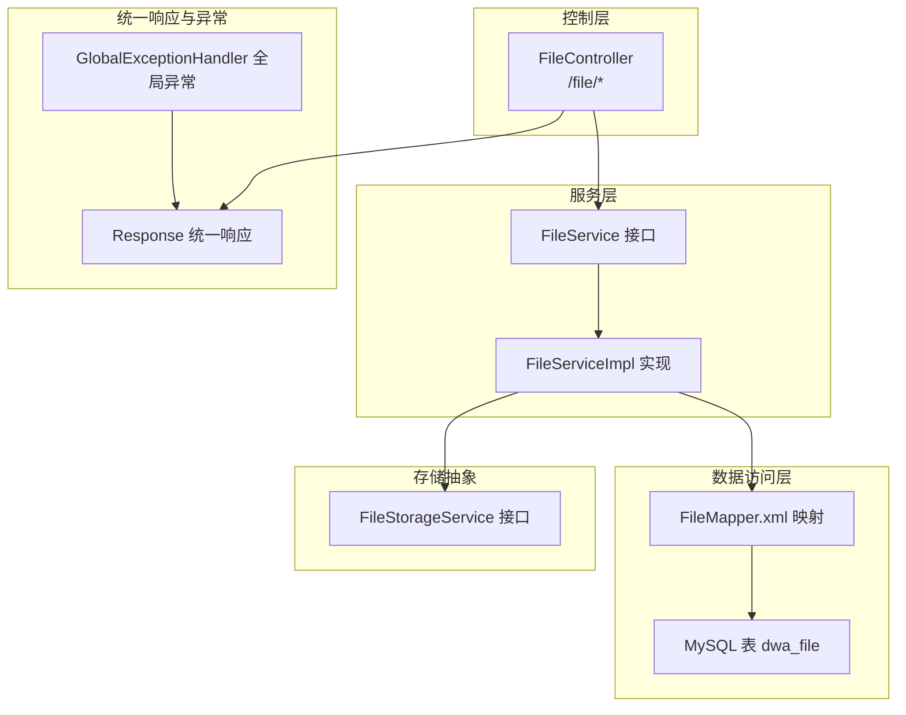
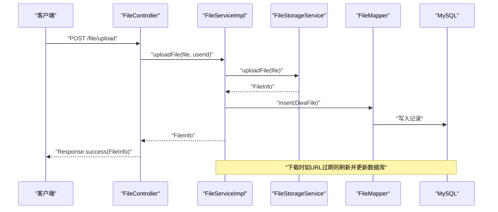
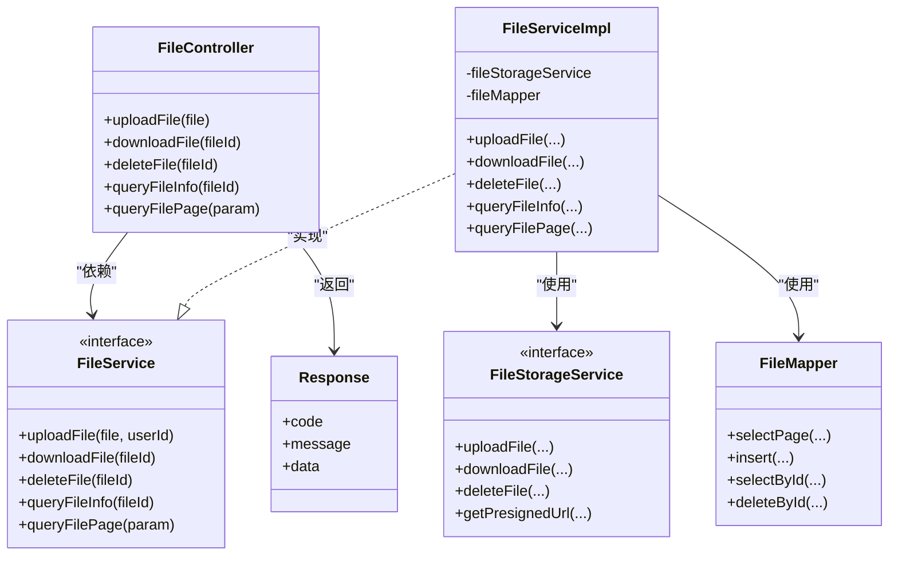

# 文件API接口

<cite>
**本文引用的文件**
- [src/main/java/com/dw/admin/controller/FileController.java](file://src/main/java/com/dw/admin/controller/FileController.java)
- [src/main/java/com/dw/admin/service/FileService.java](file://src/main/java/com/dw/admin/service/FileService.java)
- [src/main/java/com/dw/admin/service/impl/FileServiceImpl.java](file://src/main/java/com/dw/admin/service/impl/FileServiceImpl.java)
- [src/main/java/com/dw/admin/model/entity/DwaFile.java](file://src/main/java/com/dw/admin/model/entity/DwaFile.java)
- [src/main/java/com/dw/admin/model/param/FilePageParam.java](file://src/main/java/com/dw/admin/model/param/FilePageParam.java)
- [src/main/java/com/dw/admin/model/vo/FileVo.java](file://src/main/java/com/dw/admin/model/vo/FileVo.java)
- [src/main/java/com/dw/admin/common/entity/PageParam.java](file://src/main/java/com/dw/admin/common/entity/PageParam.java)
- [src/main/java/com/dw/admin/common/entity/PageResult.java](file://src/main/java/com/dw/admin/common/entity/PageResult.java)
- [src/main/java/com/dw/admin/common/entity/Response.java](file://src/main/java/com/dw/admin/common/entity/Response.java)
- [src/main/java/com/dw/admin/components/storage/FileStorageService.java](file://src/main/java/com/dw/admin/components/storage/FileStorageService.java)
- [src/main/java/com/dw/admin/common/enums/SortEnum.java](file://src/main/java/com/dw/admin/common/enums/SortEnum.java)
- [src/main/java/com/dw/admin/common/utils/ValidateUtil.java](file://src/main/java/com/dw/admin/common/utils/ValidateUtil.java)
- [src/main/java/com/dw/admin/common/exception/BizException.java](file://src/main/java/com/dw/admin/common/exception/BizException.java)
- [src/main/java/com/dw/admin/common/exception/GlobalExceptionHandler.java](file://src/main/java/com/dw/admin/common/exception/GlobalExceptionHandler.java)
- [src/main/resources/mapper/FileMapper.xml](file://src/main/resources/mapper/FileMapper.xml)
- [src/main/resources/application.yml](file://src/main/resources/application.yml)
</cite>

## 目录
1. [简介](#简介)
2. [项目结构](#项目结构)
3. [核心组件](#核心组件)
4. [架构总览](#架构总览)
5. [详细组件分析](#详细组件分析)
6. [依赖关系分析](#依赖关系分析)
7. [性能与安全](#性能与安全)
8. [故障排查指南](#故障排查指南)
9. [结论](#结论)
10. [附录](#附录)

## 简介
本文件为“文件API接口”的完整RESTful API文档，覆盖以下接口：
- 文件上传：POST /file/upload
- 文件下载：GET /file/download/{fileId}
- 文件删除：DELETE /file/delete/{fileId}
- 查询单个文件：GET /file/{fileId}
- 文件列表：POST /file/list

文档内容包括：HTTP方法、请求参数、响应格式、错误处理、鉴权与安全、分页查询实现、请求示例、响应示例、错误码说明、最佳实践与性能优化建议。

## 项目结构
文件模块采用典型的分层架构：
- 控制层：FileController 提供REST接口
- 服务层：FileService 定义接口，FileServiceImpl 实现业务逻辑
- 数据访问层：MyBatis Mapper XML 映射数据库表
- 存储抽象：FileStorageService 抽象统一文件存储能力（OSS/COS/Local）
- 统一响应与异常：Response、GlobalExceptionHandler
- 分页与参数：PageParam、PageResult、FilePageParam
- 数据模型：DwaFile（持久化）、FileVo（对外VO）

图表来源
- [src/main/java/com/dw/admin/controller/FileController.java](file://src/main/java/com/dw/admin/controller/FileController.java#L21-L82)
- [src/main/java/com/dw/admin/service/FileService.java](file://src/main/java/com/dw/admin/service/FileService.java#L14-L42)
- [src/main/java/com/dw/admin/service/impl/FileServiceImpl.java](file://src/main/java/com/dw/admin/service/impl/FileServiceImpl.java#L34-L234)
- [src/main/resources/mapper/FileMapper.xml](file://src/main/resources/mapper/FileMapper.xml#L3-L25)
- [src/main/java/com/dw/admin/common/entity/Response.java](file://src/main/java/com/dw/admin/common/entity/Response.java#L15-L132)
- [src/main/java/com/dw/admin/common/exception/GlobalExceptionHandler.java](file://src/main/java/com/dw/admin/common/exception/GlobalExceptionHandler.java#L22-L76)

章节来源
- [src/main/java/com/dw/admin/controller/FileController.java](file://src/main/java/com/dw/admin/controller/FileController.java#L21-L82)
- [src/main/java/com/dw/admin/service/impl/FileServiceImpl.java](file://src/main/java/com/dw/admin/service/impl/FileServiceImpl.java#L34-L234)
- [src/main/resources/mapper/FileMapper.xml](file://src/main/resources/mapper/FileMapper.xml#L3-L25)

## 核心组件
- 控制器：FileController 提供所有文件接口，使用鉴权注解与日志注解，并统一返回 Response 包装。
- 服务接口与实现：FileService 定义上传/下载/删除/查询/分页等方法；FileServiceImpl 实现具体逻辑，调用存储服务与数据库。
- 存储抽象：FileStorageService 抽象上传、下载、删除、预签名URL生成等能力，具体由 OSS/COS/Local 实现。
- 统一响应：Response 提供标准返回结构与错误码；GlobalExceptionHandler 将异常转换为统一响应。
- 分页与参数：PageParam 定义分页字段；FilePageParam 扩展查询条件；PageResult 封装分页结果。

章节来源
- [src/main/java/com/dw/admin/controller/FileController.java](file://src/main/java/com/dw/admin/controller/FileController.java#L21-L82)
- [src/main/java/com/dw/admin/service/FileService.java](file://src/main/java/com/dw/admin/service/FileService.java#L14-L42)
- [src/main/java/com/dw/admin/service/impl/FileServiceImpl.java](file://src/main/java/com/dw/admin/service/impl/FileServiceImpl.java#L34-L234)
- [src/main/java/com/dw/admin/common/entity/Response.java](file://src/main/java/com/dw/admin/common/entity/Response.java#L15-L132)
- [src/main/java/com/dw/admin/common/exception/GlobalExceptionHandler.java](file://src/main/java/com/dw/admin/common/exception/GlobalExceptionHandler.java#L22-L76)

## 架构总览
下图展示文件上传到入库的关键流程，以及下载时对URL过期刷新的机制。

图表来源
- [src/main/java/com/dw/admin/controller/FileController.java](file://src/main/java/com/dw/admin/controller/FileController.java#L31-L37)
- [src/main/java/com/dw/admin/service/impl/FileServiceImpl.java](file://src/main/java/com/dw/admin/service/impl/FileServiceImpl.java#L46-L76)
- [src/main/java/com/dw/admin/components/storage/FileStorageService.java](file://src/main/java/com/dw/admin/components/storage/FileStorageService.java#L20-L28)
- [src/main/resources/mapper/FileMapper.xml](file://src/main/resources/mapper/FileMapper.xml#L3-L18)

## 详细组件分析

### 文件上传接口
- 接口地址：POST /file/upload
- 鉴权：需要登录态（@Auth 注解）
- 请求体：multipart/form-data，字段名为 file
- 成功响应：data 为 FileInfo 对象
- 失败场景：
  - 参数缺失或为空：抛出业务异常，统一返回 VALIDATE_FAIL
  - 存储上传失败：返回空 FileInfo，上层可视为失败
  - 写入数据库失败：不会回滚（见事务说明）
- URL过期策略：生成URL后解析过期时间，入库保存 urlExpires 字段

请求示例
- curl
  - curl -X POST "http://host:port/file/upload" -H "Authorization: Bearer ..." -F "file=@/path/to/file"

响应示例
- 成功
  - {"code":200,"message":"成功","data":{"id":"...","name":"...","type":"...","size":...,"path":"...","url":"..."}}
- 失败
  - {"code":400,"message":"参数校验不通过","data":null}

错误码
- 200：成功
- 400：参数校验不通过
- 500：业务处理失败
- 999：未知错误

章节来源
- [src/main/java/com/dw/admin/controller/FileController.java](file://src/main/java/com/dw/admin/controller/FileController.java#L31-L37)
- [src/main/java/com/dw/admin/service/impl/FileServiceImpl.java](file://src/main/java/com/dw/admin/service/impl/FileServiceImpl.java#L46-L76)
- [src/main/java/com/dw/admin/common/entity/Response.java](file://src/main/java/com/dw/admin/common/entity/Response.java#L32-L47)
- [src/main/java/com/dw/admin/common/utils/ValidateUtil.java](file://src/main/java/com/dw/admin/common/utils/ValidateUtil.java#L42-L50)

### 文件下载接口
- 接口地址：GET /file/download/{fileId}
- 鉴权：需要登录态（@Auth 注解）
- 路径参数：fileId（字符串）
- 实现机制：
  - 校验 fileId 非空
  - 从数据库查询文件记录
  - 若存在 filePath，调用存储服务进行下载（实际可能输出到响应流或触发下载）
  - 记录下载日志
- 安全考虑：
  - 仅允许已登录用户访问
  - 若文件无 filePath，不执行存储下载动作
  - URL过期刷新在查询接口中处理，下载接口不负责刷新

请求示例
- curl
  - curl -L "http://host:port/file/download/123" -H "Authorization: Bearer ..."

响应示例
- 成功
  - {"code":200,"message":"成功","data":null}
- 失败
  - {"code":400,"message":"参数校验不通过","data":null}

错误码
- 200：成功
- 400：参数校验不通过
- 500：业务处理失败
- 999：未知错误

章节来源
- [src/main/java/com/dw/admin/controller/FileController.java](file://src/main/java/com/dw/admin/controller/FileController.java#L42-L47)
- [src/main/java/com/dw/admin/service/impl/FileServiceImpl.java](file://src/main/java/com/dw/admin/service/impl/FileServiceImpl.java#L83-L93)
- [src/main/java/com/dw/admin/common/utils/ValidateUtil.java](file://src/main/java/com/dw/admin/common/utils/ValidateUtil.java#L42-L50)

### 文件删除接口
- 接口地址：DELETE /file/delete/{fileId}
- 鉴权：需要登录态（@Auth 注解），并记录操作日志（@Log 注解）
- 路径参数：fileId（字符串）
- 实现机制：
  - 校验 fileId 非空
  - 查询记录是否存在
  - 调用存储服务删除文件（根据 filePath）
  - 删除数据库记录
  - 异常捕获并记录日志，返回布尔值表示是否删除成功
- 事务处理：
  - 存储删除与数据库删除分别执行，未包裹在同一事务中，存在不一致风险
  - 建议在存储删除成功后再删除数据库记录，或在存储删除失败时回滚数据库删除

请求示例
- curl
  - curl -X DELETE "http://host:port/file/delete/123" -H "Authorization: Bearer ..."

响应示例
- 成功
  - {"code":200,"message":"成功","data":true}
- 失败
  - {"code":400,"message":"参数校验不通过","data":false}

错误码
- 200：成功
- 400：参数校验不通过
- 500：业务处理失败
- 999：未知错误

章节来源
- [src/main/java/com/dw/admin/controller/FileController.java](file://src/main/java/com/dw/admin/controller/FileController.java#L52-L58)
- [src/main/java/com/dw/admin/service/impl/FileServiceImpl.java](file://src/main/java/com/dw/admin/service/impl/FileServiceImpl.java#L98-L116)
- [src/main/java/com/dw/admin/common/utils/ValidateUtil.java](file://src/main/java/com/dw/admin/common/utils/ValidateUtil.java#L42-L50)

### 查询单个文件接口
- 接口地址：GET /file/{fileId}
- 鉴权：需要登录态（@Auth 注解），并记录操作日志（@Log 注解）
- 路径参数：fileId（字符串）
- 实现机制：
  - 校验 fileId 非空
  - 查询数据库记录
  - 若URL过期，刷新URL并更新数据库
  - 返回 FileVo 对象
- 响应字段：id、name、type、size、path、url、createUser、updateUser、createTime、updateTime

请求示例
- curl
  - curl "http://host:port/file/123" -H "Authorization: Bearer ..."

响应示例
- 成功
  - {"code":200,"message":"成功","data":{"id":123,"name":"...","type":"...","size":...,"path":"...","url":"...","createUser":...,"updateUser":...,"createTime":"yyyy-MM-dd HH:mm:ss","updateTime":"yyyy-MM-dd HH:mm:ss"}}
- 失败
  - {"code":400,"message":"参数校验不通过","data":null}

错误码
- 200：成功
- 400：参数校验不通过
- 500：业务处理失败
- 999：未知错误

章节来源
- [src/main/java/com/dw/admin/controller/FileController.java](file://src/main/java/com/dw/admin/controller/FileController.java#L63-L69)
- [src/main/java/com/dw/admin/service/impl/FileServiceImpl.java](file://src/main/java/com/dw/admin/service/impl/FileServiceImpl.java#L132-L144)
- [src/main/java/com/dw/admin/service/impl/FileServiceImpl.java](file://src/main/java/com/dw/admin/service/impl/FileServiceImpl.java#L150-L171)

### 文件列表接口
- 接口地址：POST /file/list
- 鉴权：需要登录态（@Auth 注解），并记录操作日志（@Log 注解）
- 请求体：FilePageParam
  - name：文件名称（模糊匹配）
  - type：文件类型（模糊匹配）
  - path：文件路径（模糊匹配）
  - createTimeSort：创建时间排序（asc/desc）
  - updateTimeSort：更新时间排序（asc/desc）
  - pageNum/pageSize：分页参数（pageNum默认1，pageSize默认10；pageNum为0表示不分页）
- 实现机制：
  - 构造查询条件（模糊匹配 name/type/path）
  - 设置排序规则，默认按创建时间降序，也可按 createTimeSort 或 updateTimeSort 指定
  - 使用 MyBatis-Plus 分页查询
  - 结果映射为 FileVo 列表，封装为 PageResult

请求示例
- curl
  - curl -X POST "http://host:port/file/list" -H "Authorization: Bearer ..." -H "Content-Type: application/json" -d '{"name":"test","type":"image","pageNum":1,"pageSize":10}'

响应示例
- 成功
  - {"code":200,"message":"成功","data":{"pageNum":1,"pageSize":10,"pages":1,"total":1,"list":[{"id":123,"name":"...","type":"...","size":...,"path":"...","url":"...","createUser":...,"updateUser":...,"createTime":"yyyy-MM-dd HH:mm:ss","updateTime":"yyyy-MM-dd HH:mm:ss"}]}}

错误码
- 200：成功
- 400：参数校验不通过
- 500：业务处理失败
- 999：未知错误

章节来源
- [src/main/java/com/dw/admin/controller/FileController.java](file://src/main/java/com/dw/admin/controller/FileController.java#L74-L80)
- [src/main/java/com/dw/admin/service/impl/FileServiceImpl.java](file://src/main/java/com/dw/admin/service/impl/FileServiceImpl.java#L176-L212)
- [src/main/java/com/dw/admin/model/param/FilePageParam.java](file://src/main/java/com/dw/admin/model/param/FilePageParam.java#L15-L39)
- [src/main/java/com/dw/admin/common/entity/PageParam.java](file://src/main/java/com/dw/admin/common/entity/PageParam.java#L18-L43)
- [src/main/java/com/dw/admin/common/entity/PageResult.java](file://src/main/java/com/dw/admin/common/entity/PageResult.java#L16-L93)

## 依赖关系分析
- 控制器依赖服务接口；服务实现依赖存储接口与Mapper；统一响应与全局异常贯穿各层。
- FileServiceImpl 依赖：
  - FileStorageService：上传/下载/删除/预签名URL
  - FileMapper：数据库读写
  - ValidateUtil：参数校验
  - SortEnum：排序枚举
  - StorageUrlUtil：URL过期判断与解析（通过应用配置与存储实现间接使用）

图表来源
- [src/main/java/com/dw/admin/controller/FileController.java](file://src/main/java/com/dw/admin/controller/FileController.java#L21-L82)
- [src/main/java/com/dw/admin/service/FileService.java](file://src/main/java/com/dw/admin/service/FileService.java#L14-L42)
- [src/main/java/com/dw/admin/service/impl/FileServiceImpl.java](file://src/main/java/com/dw/admin/service/impl/FileServiceImpl.java#L34-L234)
- [src/main/java/com/dw/admin/components/storage/FileStorageService.java](file://src/main/java/com/dw/admin/components/storage/FileStorageService.java#L12-L52)
- [src/main/resources/mapper/FileMapper.xml](file://src/main/resources/mapper/FileMapper.xml#L3-L25)
- [src/main/java/com/dw/admin/common/entity/Response.java](file://src/main/java/com/dw/admin/common/entity/Response.java#L15-L132)

## 性能与安全
- 性能
  - 上传：受存储提供商与网络带宽限制；建议前端分片上传（需另行扩展）。
  - 下载：若URL过期，会触发刷新并更新数据库，建议前端缓存URL并在过期前主动刷新。
  - 列表：使用分页查询，避免一次性加载大量数据；合理设置 pageNum/pageSize。
  - 参数校验：使用注解与工具类统一校验，减少无效请求。
- 安全
  - 鉴权：所有文件接口均需登录态（@Auth），防止未授权访问。
  - URL过期：存储URL具备过期时间，系统会在查询时自动刷新并更新数据库。
  - 存储配置：application.yml 中提供多提供商配置，建议生产环境使用云存储并开启防盗链。
  - 文件大小限制：Spring 配置了最大请求大小与文件大小，防止过大文件导致资源耗尽。

章节来源
- [src/main/resources/application.yml](file://src/main/resources/application.yml#L17-L20)
- [src/main/java/com/dw/admin/service/impl/FileServiceImpl.java](file://src/main/java/com/dw/admin/service/impl/FileServiceImpl.java#L150-L171)
- [src/main/java/com/dw/admin/common/enums/SortEnum.java](file://src/main/java/com/dw/admin/common/enums/SortEnum.java#L8-L30)

## 故障排查指南
- 常见错误码
  - 200：成功
  - 400：参数校验不通过（如缺少fileId或file）
  - 401：鉴权失败（未登录或Token无效）
  - 403：权限不足
  - 500：业务处理失败（如数据库写入失败、存储删除异常）
  - 999：未知异常
- 定位步骤
  - 查看控制器与服务层日志，确认参数校验与业务流程
  - 检查存储服务是否可用（OSS/COS/Local）
  - 核对数据库连接与SQL执行情况
  - 关注全局异常处理器输出的错误信息
- 建议
  - 在删除接口前后增加幂等性校验与重试策略
  - 对URL过期刷新失败进行告警与补偿

章节来源
- [src/main/java/com/dw/admin/common/entity/Response.java](file://src/main/java/com/dw/admin/common/entity/Response.java#L32-L47)
- [src/main/java/com/dw/admin/common/exception/GlobalExceptionHandler.java](file://src/main/java/com/dw/admin/common/exception/GlobalExceptionHandler.java#L30-L73)
- [src/main/java/com/dw/admin/common/utils/ValidateUtil.java](file://src/main/java/com/dw/admin/common/utils/ValidateUtil.java#L42-L50)

## 结论
本文档提供了文件API接口的完整使用指南，涵盖上传、下载、删除、查询与分页等核心能力。通过统一的鉴权、参数校验与响应包装，系统在易用性与一致性方面表现良好。建议在生产环境中关注URL过期刷新、事务一致性与大文件处理策略，以进一步提升稳定性与性能。

## 附录

### 统一响应结构
- 字段
  - code：状态码
  - message：描述信息
  - data：返回数据（可为任意类型）

章节来源
- [src/main/java/com/dw/admin/common/entity/Response.java](file://src/main/java/com/dw/admin/common/entity/Response.java#L15-L132)

### 数据模型与映射
- DwaFile（持久化实体）
  - 字段：fileId、fileName、fileType、fileSize、filePath、fileUrl、urlExpires、createUser、updateUser、createTime、updateTime
- FileVo（对外视图）
  - 字段：id、name、type、size、path、url、createUser、updateUser、createTime、updateTime

章节来源
- [src/main/java/com/dw/admin/model/entity/DwaFile.java](file://src/main/java/com/dw/admin/model/entity/DwaFile.java#L25-L87)
- [src/main/java/com/dw/admin/model/vo/FileVo.java](file://src/main/java/com/dw/admin/model/vo/FileVo.java#L23-L60)
- [src/main/resources/mapper/FileMapper.xml](file://src/main/resources/mapper/FileMapper.xml#L6-L18)

### 分页查询参数
- FilePageParam
  - name、type、path：模糊查询字段
  - createTimeSort、updateTimeSort：排序字段（asc/desc）
  - 继承自 PageParam：pageNum、pageSize

章节来源
- [src/main/java/com/dw/admin/model/param/FilePageParam.java](file://src/main/java/com/dw/admin/model/param/FilePageParam.java#L15-L39)
- [src/main/java/com/dw/admin/common/entity/PageParam.java](file://src/main/java/com/dw/admin/common/entity/PageParam.java#L18-L43)

### 错误码对照
- 200：成功
- 400：参数校验不通过
- 401：鉴权失败
- 403：权限不足
- 500：业务处理失败
- 999：未知错误

章节来源
- [src/main/java/com/dw/admin/common/entity/Response.java](file://src/main/java/com/dw/admin/common/entity/Response.java#L32-L47)