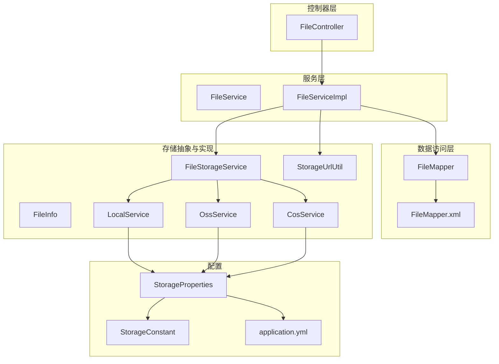
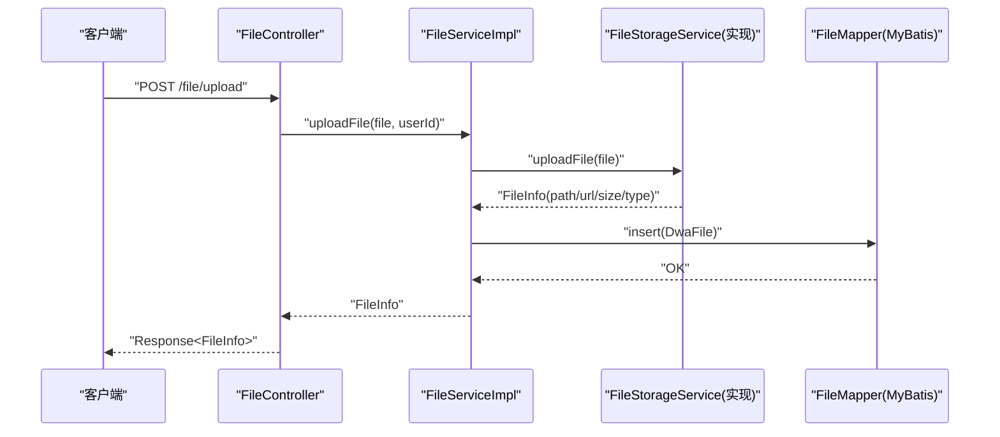
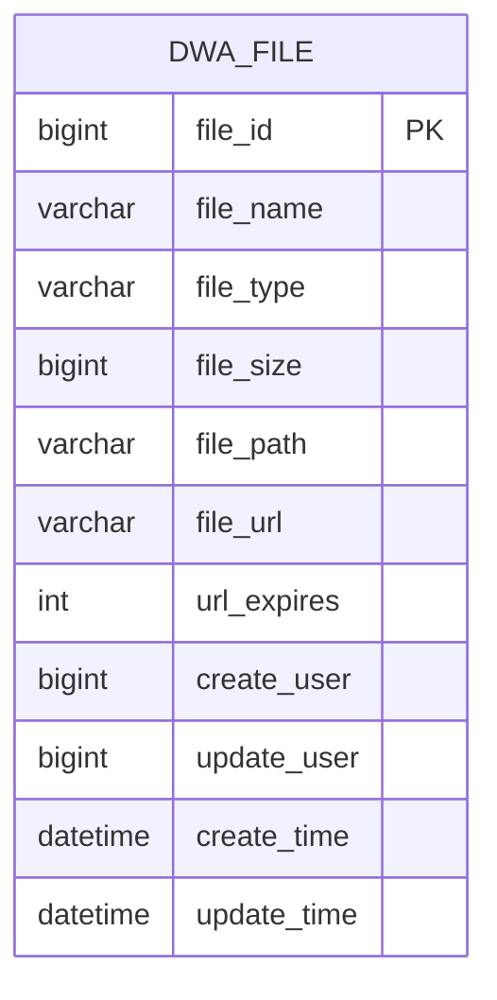
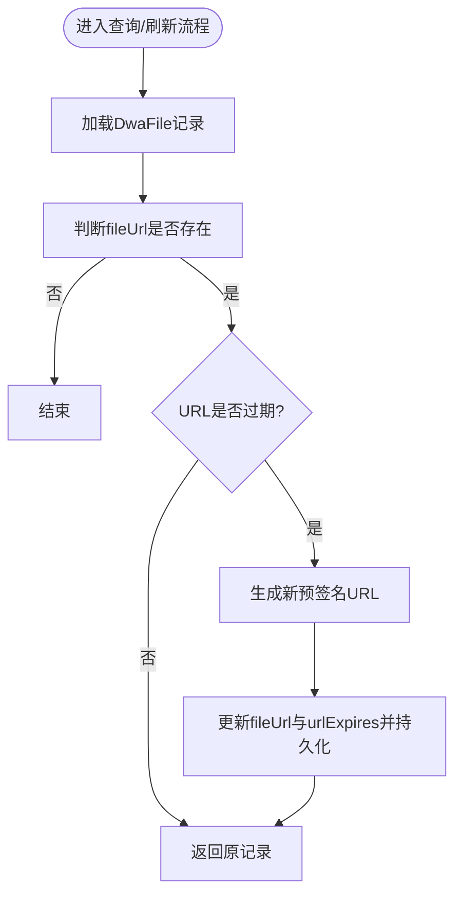
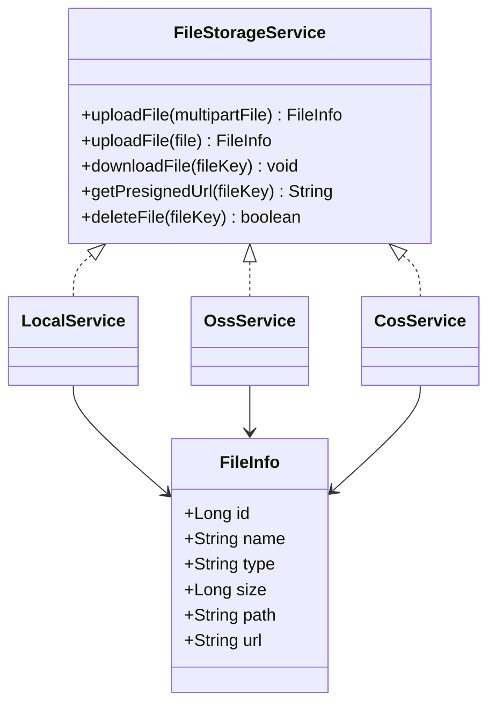
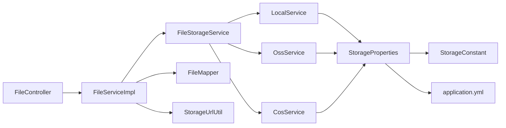

# 文件存储模块

<cite>
**本文引用的文件**
- [DwaFile.java](file://src/main/java/com/dw/admin/model/entity/DwaFile.java)
- [FileService.java](file://src/main/java/com/dw/admin/service/FileService.java)
- [FileServiceImpl.java](file://src/main/java/com/dw/admin/service/impl/FileServiceImpl.java)
- [FileController.java](file://src/main/java/com/dw/admin/controller/FileController.java)
- [FileMapper.java](file://src/main/java/com/dw/admin/dao/FileMapper.java)
- [FileMapper.xml](file://src/main/resources/mapper/FileMapper.xml)
- [FileStorageService.java](file://src/main/java/com/dw/admin/components/storage/FileStorageService.java)
- [FileInfo.java](file://src/main/java/com/dw/admin/components/storage/FileInfo.java)
- [StorageUrlUtil.java](file://src/main/java/com/dw/admin/components/storage/StorageUrlUtil.java)
- [LocalService.java](file://src/main/java/com/dw/admin/components/storage/local/LocalService.java)
- [OssService.java](file://src/main/java/com/dw/admin/components/storage/oss/OssService.java)
- [CosService.java](file://src/main/java/com/dw/admin/components/storage/cos/CosService.java)
- [StorageProperties.java](file://src/main/java/com/dw/admin/components/storage/StorageProperties.java)
- [StorageConstant.java](file://src/main/java/com/dw/admin/components/storage/StorageConstant.java)
- [application.yml](file://src/main/resources/application.yml)
</cite>

## 目录
1. [简介](#简介)
2. [项目结构](#项目结构)
3. [核心组件](#核心组件)
4. [架构总览](#架构总览)
5. [组件详解](#组件详解)
6. [依赖关系分析](#依赖关系分析)
7. [性能与成本优化](#性能与成本优化)
8. [故障排查指南](#故障排查指南)
9. [结论](#结论)
10. [附录](#附录)

## 简介
本文件存储模块提供统一的文件上传、下载、删除与分页查询能力，并通过策略模式适配本地存储、阿里云 OSS 与腾讯云 COS 三大后端。系统以“控制器-服务-存储服务-存储实现”的分层架构组织，结合数据库持久化与URL有效期管理，实现可扩展、可运维的文件服务能力。

## 项目结构
围绕文件存储的关键目录与文件如下：
- 控制器层：FileController
- 服务层：FileService、FileServiceImpl
- 数据访问层：FileMapper、FileMapper.xml
- 存储抽象与实现：FileStorageService、FileInfo、StorageUrlUtil、LocalService、OssService、CosService
- 配置：StorageProperties、StorageConstant、application.yml

图表来源
- [FileController.java](file://src/main/java/com/dw/admin/controller/FileController.java#L1-L83)
- [FileService.java](file://src/main/java/com/dw/admin/service/FileService.java#L1-L43)
- [FileServiceImpl.java](file://src/main/java/com/dw/admin/service/impl/FileServiceImpl.java#L1-L234)
- [FileMapper.java](file://src/main/java/com/dw/admin/dao/FileMapper.java#L1-L17)
- [FileMapper.xml](file://src/main/resources/mapper/FileMapper.xml#L1-L26)
- [FileStorageService.java](file://src/main/java/com/dw/admin/components/storage/FileStorageService.java#L1-L52)
- [FileInfo.java](file://src/main/java/com/dw/admin/components/storage/FileInfo.java#L1-L44)
- [StorageUrlUtil.java](file://src/main/java/com/dw/admin/components/storage/StorageUrlUtil.java#L1-L112)
- [LocalService.java](file://src/main/java/com/dw/admin/components/storage/local/LocalService.java#L1-L283)
- [OssService.java](file://src/main/java/com/dw/admin/components/storage/oss/OssService.java#L1-L298)
- [CosService.java](file://src/main/java/com/dw/admin/components/storage/cos/CosService.java#L1-L322)
- [StorageProperties.java](file://src/main/java/com/dw/admin/components/storage/StorageProperties.java#L1-L82)
- [StorageConstant.java](file://src/main/java/com/dw/admin/components/storage/StorageConstant.java#L1-L27)
- [application.yml](file://src/main/resources/application.yml#L1-L64)

章节来源
- [FileController.java](file://src/main/java/com/dw/admin/controller/FileController.java#L1-L83)
- [FileServiceImpl.java](file://src/main/java/com/dw/admin/service/impl/FileServiceImpl.java#L1-L234)
- [FileStorageService.java](file://src/main/java/com/dw/admin/components/storage/FileStorageService.java#L1-L52)
- [StorageProperties.java](file://src/main/java/com/dw/admin/components/storage/StorageProperties.java#L1-L82)
- [application.yml](file://src/main/resources/application.yml#L1-L64)

## 核心组件
- 实体模型：DwaFile
- 控制器：FileController（上传、下载、删除、查询单个、分页查询）
- 服务接口与实现：FileService、FileServiceImpl
- 存储抽象：FileStorageService、FileInfo
- URL工具：StorageUrlUtil
- 存储实现：LocalService（本地）、OssService（阿里云OSS）、CosService（腾讯云COS）
- 配置：StorageProperties、StorageConstant、application.yml

章节来源
- [DwaFile.java](file://src/main/java/com/dw/admin/model/entity/DwaFile.java#L1-L88)
- [FileController.java](file://src/main/java/com/dw/admin/controller/FileController.java#L1-L83)
- [FileService.java](file://src/main/java/com/dw/admin/service/FileService.java#L1-L43)
- [FileServiceImpl.java](file://src/main/java/com/dw/admin/service/impl/FileServiceImpl.java#L1-L234)
- [FileStorageService.java](file://src/main/java/com/dw/admin/components/storage/FileStorageService.java#L1-L52)
- [FileInfo.java](file://src/main/java/com/dw/admin/components/storage/FileInfo.java#L1-L44)
- [StorageUrlUtil.java](file://src/main/java/com/dw/admin/components/storage/StorageUrlUtil.java#L1-L112)
- [LocalService.java](file://src/main/java/com/dw/admin/components/storage/local/LocalService.java#L1-L283)
- [OssService.java](file://src/main/java/com/dw/admin/components/storage/oss/OssService.java#L1-L298)
- [CosService.java](file://src/main/java/com/dw/admin/components/storage/cos/CosService.java#L1-L322)
- [StorageProperties.java](file://src/main/java/com/dw/admin/components/storage/StorageProperties.java#L1-L82)
- [StorageConstant.java](file://src/main/java/com/dw/admin/components/storage/StorageConstant.java#L1-L27)
- [application.yml](file://src/main/resources/application.yml#L1-L64)

## 架构总览
系统采用“策略模式 + 分层架构”：
- 控制器层负责鉴权、日志与HTTP接口编排
- 服务层封装业务流程（上传、下载、删除、分页、URL刷新）
- 存储服务层抽象出统一接口，具体实现分别对接本地、OSS、COS
- 配置中心集中管理各后端参数与URL过期策略
- 数据层通过MyBatis Plus持久化文件元数据

图表来源
- [FileController.java](file://src/main/java/com/dw/admin/controller/FileController.java#L21-L37)
- [FileServiceImpl.java](file://src/main/java/com/dw/admin/service/impl/FileServiceImpl.java#L46-L76)
- [FileStorageService.java](file://src/main/java/com/dw/admin/components/storage/FileStorageService.java#L12-L52)
- [FileMapper.java](file://src/main/java/com/dw/admin/dao/FileMapper.java#L1-L17)

## 组件详解

### 实体模型与元数据管理
- DwaFile：文件元数据持久化实体，字段覆盖文件ID、名称、类型、大小、路径、URL、URL过期时间、创建/更新用户与时间戳
- FileMapper.xml：定义字段映射与通用列清单，支撑分页查询与条件过滤

图表来源
- [DwaFile.java](file://src/main/java/com/dw/admin/model/entity/DwaFile.java#L24-L87)
- [FileMapper.xml](file://src/main/resources/mapper/FileMapper.xml#L6-L18)

章节来源
- [DwaFile.java](file://src/main/java/com/dw/admin/model/entity/DwaFile.java#L1-L88)
- [FileMapper.xml](file://src/main/resources/mapper/FileMapper.xml#L1-L26)

### 控制器API接口
- 上传：POST /file/upload（参数：file=MultipartFile；返回：Response<FileInfo>）
- 下载：GET /file/download/{fileId}（触发存储后端下载）
- 删除：DELETE /file/delete/{fileId}（返回布尔值）
- 查询单个：GET /{fileId}（返回FileVo）
- 分页列表：POST /file/list（参数：FilePageParam；返回：Response<PageResult<FileVo>>）

鉴权与日志：
- 使用注解鉴权与操作日志切面，确保接口访问可控与可审计

章节来源
- [FileController.java](file://src/main/java/com/dw/admin/controller/FileController.java#L21-L83)

### 服务层业务逻辑
- 上传：调用存储服务上传，解析FileInfo，计算URL过期时间，入库持久化
- 下载：根据fileId查询元数据，若存在filePath则委托存储服务下载
- 删除：先删后端文件，再删数据库记录
- 查询与分页：支持按名称/类型/路径模糊查询与时间排序
- URL刷新：当URL即将过期时，重新生成预签名URL并更新数据库

图表来源
- [FileServiceImpl.java](file://src/main/java/com/dw/admin/service/impl/FileServiceImpl.java#L132-L171)
- [StorageUrlUtil.java](file://src/main/java/com/dw/admin/components/storage/StorageUrlUtil.java#L29-L46)

章节来源
- [FileServiceImpl.java](file://src/main/java/com/dw/admin/service/impl/FileServiceImpl.java#L1-L234)
- [StorageUrlUtil.java](file://src/main/java/com/dw/admin/components/storage/StorageUrlUtil.java#L1-L112)

### 存储服务抽象与策略模式
- FileStorageService：统一上传、下载、删除、预签名URL生成接口
- LocalService：本地文件系统存储，提供预览URL与安全预览接口
- OssService：阿里云OSS存储，基于SDK生成预签名URL
- CosService：腾讯云COS存储，基于SDK生成预签名URL
- 条件装配：通过配置键dwa.storage.provider动态启用对应实现

图表来源
- [FileStorageService.java](file://src/main/java/com/dw/admin/components/storage/FileStorageService.java#L12-L52)
- [LocalService.java](file://src/main/java/com/dw/admin/components/storage/local/LocalService.java#L50-L283)
- [OssService.java](file://src/main/java/com/dw/admin/components/storage/oss/OssService.java#L47-L298)
- [CosService.java](file://src/main/java/com/dw/admin/components/storage/cos/CosService.java#L48-L322)
- [FileInfo.java](file://src/main/java/com/dw/admin/components/storage/FileInfo.java#L20-L44)

章节来源
- [FileStorageService.java](file://src/main/java/com/dw/admin/components/storage/FileStorageService.java#L1-L52)
- [LocalService.java](file://src/main/java/com/dw/admin/components/storage/local/LocalService.java#L1-L283)
- [OssService.java](file://src/main/java/com/dw/admin/components/storage/oss/OssService.java#L1-L298)
- [CosService.java](file://src/main/java/com/dw/admin/components/storage/cos/CosService.java#L1-L322)

### URL生成与过期管理
- StorageUrlUtil：解析OSS与COS的过期参数，判断URL是否过期，并提取过期时间
- 各存储实现：生成预签名URL并设置过期秒数
- 服务层：在查询时自动检测并刷新过期URL，保证对外链接可用性

章节来源
- [StorageUrlUtil.java](file://src/main/java/com/dw/admin/components/storage/StorageUrlUtil.java#L1-L112)
- [FileServiceImpl.java](file://src/main/java/com/dw/admin/service/impl/FileServiceImpl.java#L147-L171)
- [OssService.java](file://src/main/java/com/dw/admin/components/storage/oss/OssService.java#L229-L255)
- [CosService.java](file://src/main/java/com/dw/admin/components/storage/cos/CosService.java#L228-L253)
- [LocalService.java](file://src/main/java/com/dw/admin/components/storage/local/LocalService.java#L191-L198)

### 配置与URL生成机制
- StorageProperties：集中管理provider、OSS、COS、Local三类配置
- StorageConstant：配置前缀与提供商枚举
- application.yml：默认provider为aliyun-oss，包含各后端必要参数与URL过期秒数

章节来源
- [StorageProperties.java](file://src/main/java/com/dw/admin/components/storage/StorageProperties.java#L1-L82)
- [StorageConstant.java](file://src/main/java/com/dw/admin/components/storage/StorageConstant.java#L1-L27)
- [application.yml](file://src/main/resources/application.yml#L40-L64)

## 依赖关系分析
- 控制器依赖服务接口，服务实现依赖存储服务接口与数据访问层
- 存储服务接口由三种实现类分别注入，通过条件装配启用
- URL工具被服务层用于过期判断与刷新
- 配置类与常量类贯穿于存储实现与控制器之间

图表来源
- [FileController.java](file://src/main/java/com/dw/admin/controller/FileController.java#L21-L83)
- [FileServiceImpl.java](file://src/main/java/com/dw/admin/service/impl/FileServiceImpl.java#L36-L41)
- [FileStorageService.java](file://src/main/java/com/dw/admin/components/storage/FileStorageService.java#L12-L52)
- [LocalService.java](file://src/main/java/com/dw/admin/components/storage/local/LocalService.java#L53-L54)
- [OssService.java](file://src/main/java/com/dw/admin/components/storage/oss/OssService.java#L49-L50)
- [CosService.java](file://src/main/java/com/dw/admin/components/storage/cos/CosService.java#L50-L51)
- [StorageProperties.java](file://src/main/java/com/dw/admin/components/storage/StorageProperties.java#L14-L38)
- [StorageConstant.java](file://src/main/java/com/dw/admin/components/storage/StorageConstant.java#L8-L26)
- [application.yml](file://src/main/resources/application.yml#L40-L64)

章节来源
- [FileServiceImpl.java](file://src/main/java/com/dw/admin/service/impl/FileServiceImpl.java#L1-L234)
- [FileStorageService.java](file://src/main/java/com/dw/admin/components/storage/FileStorageService.java#L1-L52)
- [StorageProperties.java](file://src/main/java/com/dw/admin/components/storage/StorageProperties.java#L1-L82)
- [application.yml](file://src/main/resources/application.yml#L1-L64)

## 性能与成本优化
- URL过期策略：合理设置url-expires，平衡安全性与访问频次
- 本地存储：适合开发与小规模场景，注意磁盘容量与IO瓶颈
- 云存储：OSS/COS具备高可用与CDN加速能力，适合生产环境
- 传输优化：控制最大文件大小与请求大小，避免大文件阻塞
- 缓存策略：对热点文件可结合CDN缓存与浏览器缓存头
- 成本优化：按需选择地域与计费方式，定期清理无用文件

[本节为通用指导，不直接分析具体文件]

## 故障排查指南
- 上传失败：检查存储实现异常处理与日志；确认配置项（AccessKey/SecretKey、Endpoint、Bucket、PrefixPath）正确
- 下载失败：确认fileId有效且filePath存在；检查存储实现下载逻辑与响应头设置
- URL过期：确认StorageUrlUtil解析逻辑与各后端过期参数名称一致；服务层刷新逻辑是否正常
- 本地预览异常：检查预览域名、路径与文件系统权限；注意路径穿越防护
- 删除失败：确认fileId存在且后端删除成功；查看日志定位异常

章节来源
- [LocalService.java](file://src/main/java/com/dw/admin/components/storage/local/LocalService.java#L154-L183)
- [OssService.java](file://src/main/java/com/dw/admin/components/storage/oss/OssService.java#L177-L213)
- [CosService.java](file://src/main/java/com/dw/admin/components/storage/cos/CosService.java#L184-L220)
- [StorageUrlUtil.java](file://src/main/java/com/dw/admin/components/storage/StorageUrlUtil.java#L29-L46)
- [FileServiceImpl.java](file://src/main/java/com/dw/admin/service/impl/FileServiceImpl.java#L98-L116)

## 结论
该文件存储模块通过清晰的分层与策略模式，实现了对本地、阿里云OSS与腾讯云COS的统一接入。配合URL过期检测与自动刷新、完善的鉴权与日志机制，满足生产环境对可扩展性、安全性与可维护性的要求。建议在生产中优先选用云存储，并结合CDN与缓存策略进一步提升性能与降低成本。

[本节为总结性内容，不直接分析具体文件]

## 附录

### API一览（路径与职责）
- POST /file/upload：上传文件
- GET /file/download/{fileId}：下载文件
- DELETE /file/delete/{fileId}：删除文件
- GET /{fileId}：查询单个文件
- POST /file/list：分页查询文件

章节来源
- [FileController.java](file://src/main/java/com/dw/admin/controller/FileController.java#L21-L83)

### 存储后端选型建议
- 开发/测试：本地存储（LocalService），便于调试与快速迭代
- 生产/高并发：云存储（OssService/CosService），具备高可用、CDN加速与弹性扩展
- 成本敏感：评估各后端计费模型与地域选择，结合缓存策略降低带宽成本

[本节为通用指导，不直接分析具体文件]