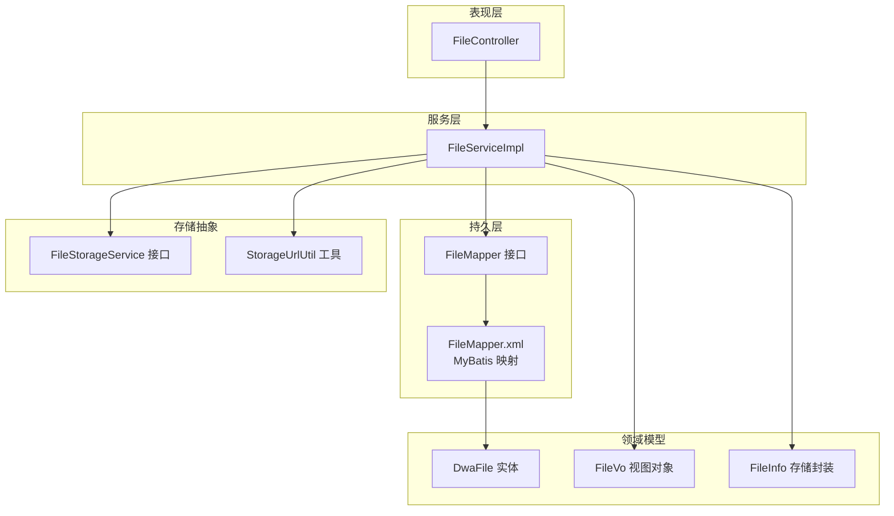
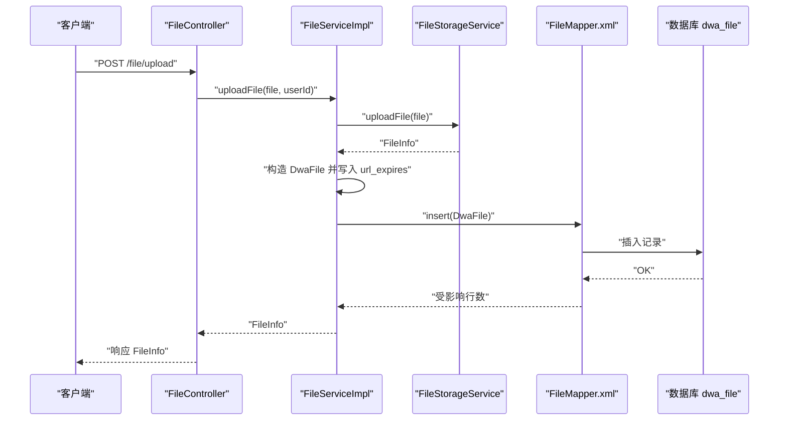
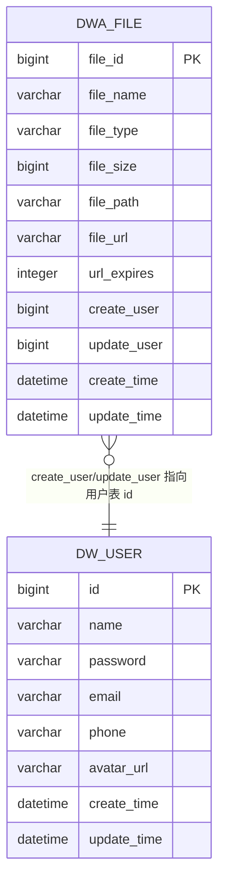
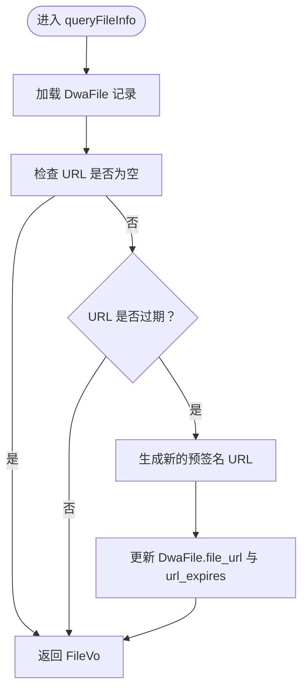
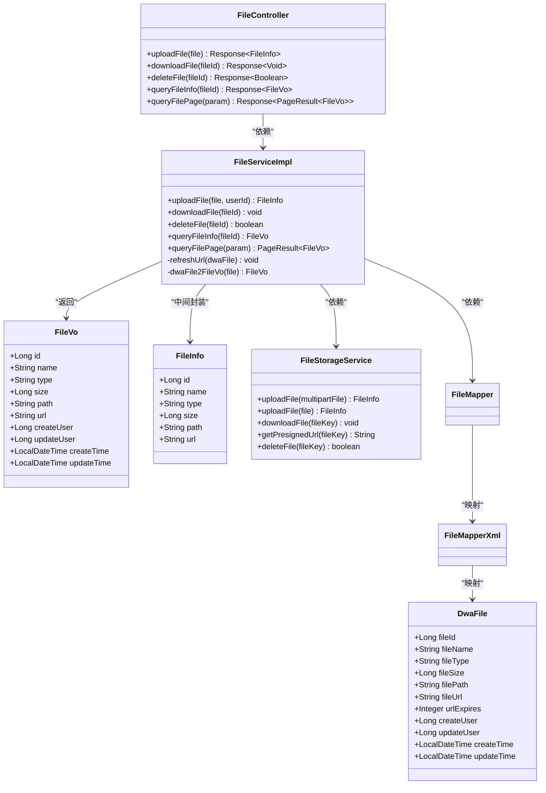

# 文件实体模型

<cite>
**本文引用的文件**
- [DwaFile.java](file://src/main/java/com/dw/admin/model/entity/DwaFile.java)
- [FileVo.java](file://src/main/java/com/dw/admin/model/vo/FileVo.java)
- [FileInfo.java](file://src/main/java/com/dw/admin/components/storage/FileInfo.java)
- [FileStorageService.java](file://src/main/java/com/dw/admin/components/storage/FileStorageService.java)
- [StorageUrlUtil.java](file://src/main/java/com/dw/admin/components/storage/StorageUrlUtil.java)
- [FileMapper.java](file://src/main/java/com/dw/admin/dao/FileMapper.java)
- [FileMapper.xml](file://src/main/resources/mapper/FileMapper.xml)
- [FileServiceImpl.java](file://src/main/java/com/dw/admin/service/impl/FileServiceImpl.java)
- [FileController.java](file://src/main/java/com/dw/admin/controller/FileController.java)
- [FilePageParam.java](file://src/main/java/com/dw/admin/model/param/FilePageParam.java)
- [init_ddl.sql](file://docs/sql/init_ddl.sql)
</cite>

## 目录
1. [简介](#简介)
2. [项目结构](#项目结构)
3. [核心组件](#核心组件)
4. [架构总览](#架构总览)
5. [详细组件分析](#详细组件分析)
6. [依赖关系分析](#依赖关系分析)
7. [性能与索引策略](#性能与索引策略)
8. [故障排查指南](#故障排查指南)
9. [结论](#结论)
10. [附录](#附录)

## 简介
本文件围绕“文件实体模型”进行系统化建模与说明，覆盖以下方面：
- DwaFile 实体类的字段定义、数据类型与约束关系
- FileInfo 文件信息封装类的设计与职责边界
- FileVo 视图对象的作用与字段映射关系
- 文件实体与存储层、控制层、服务层之间的交互流程
- 数据库表结构、索引策略与查询优化建议
- 文件元数据管理最佳实践（类型识别、URL 过期处理、存储路径组织等）

## 项目结构
文件模型相关代码分布在以下模块中：
- 实体层：DwaFile（MyBatis-Plus 实体）
- 视图层：FileVo（对外返回对象）
- 存储封装：FileInfo（存储侧返回的文件元信息）
- 存储接口：FileStorageService（统一抽象）
- 控制层：FileController（HTTP 入口）
- 服务层：FileServiceImpl（业务编排）
- 持久层：FileMapper + FileMapper.xml（MyBatis 映射）
- 参数模型：FilePageParam（分页与筛选参数）
- 数据库脚本：init_ddl.sql（表结构定义）

图表来源
- [FileController.java](file://src/main/java/com/dw/admin/controller/FileController.java#L1-L83)
- [FileServiceImpl.java](file://src/main/java/com/dw/admin/service/impl/FileServiceImpl.java#L1-L234)
- [FileMapper.java](file://src/main/java/com/dw/admin/dao/FileMapper.java#L1-L17)
- [FileMapper.xml](file://src/main/resources/mapper/FileMapper.xml#L1-L26)
- [DwaFile.java](file://src/main/java/com/dw/admin/model/entity/DwaFile.java#L1-L88)
- [FileVo.java](file://src/main/java/com/dw/admin/model/vo/FileVo.java#L1-L61)
- [FileInfo.java](file://src/main/java/com/dw/admin/components/storage/FileInfo.java#L1-L44)
- [FileStorageService.java](file://src/main/java/com/dw/admin/components/storage/FileStorageService.java#L1-L52)
- [StorageUrlUtil.java](file://src/main/java/com/dw/admin/components/storage/StorageUrlUtil.java#L1-L112)

章节来源
- [FileController.java](file://src/main/java/com/dw/admin/controller/FileController.java#L1-L83)
- [FileServiceImpl.java](file://src/main/java/com/dw/admin/service/impl/FileServiceImpl.java#L1-L234)
- [FileMapper.java](file://src/main/java/com/dw/admin/dao/FileMapper.java#L1-L17)
- [FileMapper.xml](file://src/main/resources/mapper/FileMapper.xml#L1-L26)
- [DwaFile.java](file://src/main/java/com/dw/admin/model/entity/DwaFile.java#L1-L88)
- [FileVo.java](file://src/main/java/com/dw/admin/model/vo/FileVo.java#L1-L61)
- [FileInfo.java](file://src/main/java/com/dw/admin/components/storage/FileInfo.java#L1-L44)
- [FileStorageService.java](file://src/main/java/com/dw/admin/components/storage/FileStorageService.java#L1-L52)
- [StorageUrlUtil.java](file://src/main/java/com/dw/admin/components/storage/StorageUrlUtil.java#L1-L112)

## 核心组件
- DwaFile：数据库表 dwa_file 的实体映射，承载文件元数据与审计字段。
- FileVo：对外返回的视图对象，用于 API 响应，字段与 DwaFile 对应但命名更贴近前端语义。
- FileInfo：存储侧返回的文件元信息封装，包含上传后由存储服务生成的文件标识、类型、大小、路径与 URL。
- FileStorageService：统一的文件存储抽象，屏蔽本地/云存储差异。
- StorageUrlUtil：解析与判断存储 URL 是否过期的工具类。
- FileMapper + FileMapper.xml：MyBatis 映射，负责 DwaFile 的 CRUD。
- FileServiceImpl：文件服务编排，负责上传、下载、删除、分页查询、URL 刷新等。
- FileController：HTTP 入口，暴露上传/下载/删除/查询接口。
- FilePageParam：分页与筛选参数对象。

章节来源
- [DwaFile.java](file://src/main/java/com/dw/admin/model/entity/DwaFile.java#L1-L88)
- [FileVo.java](file://src/main/java/com/dw/admin/model/vo/FileVo.java#L1-L61)
- [FileInfo.java](file://src/main/java/com/dw/admin/components/storage/FileInfo.java#L1-L44)
- [FileStorageService.java](file://src/main/java/com/dw/admin/components/storage/FileStorageService.java#L1-L52)
- [StorageUrlUtil.java](file://src/main/java/com/dw/admin/components/storage/StorageUrlUtil.java#L1-L112)
- [FileMapper.java](file://src/main/java/com/dw/admin/dao/FileMapper.java#L1-L17)
- [FileMapper.xml](file://src/main/resources/mapper/FileMapper.xml#L1-L26)
- [FileServiceImpl.java](file://src/main/java/com/dw/admin/service/impl/FileServiceImpl.java#L1-L234)
- [FileController.java](file://src/main/java/com/dw/admin/controller/FileController.java#L1-L83)
- [FilePageParam.java](file://src/main/java/com/dw/admin/model/param/FilePageParam.java#L1-L40)

## 架构总览
文件模型在系统中的流转如下：
- 控制层接收请求，调用服务层
- 服务层通过存储抽象上传/下载/删除文件，并维护数据库记录
- 持久层通过 MyBatis 映射 DwaFile 实体
- 查询时根据分页参数构建条件，返回 FileVo 视图对象

图表来源
- [FileController.java](file://src/main/java/com/dw/admin/controller/FileController.java#L21-L37)
- [FileServiceImpl.java](file://src/main/java/com/dw/admin/service/impl/FileServiceImpl.java#L45-L76)
- [FileMapper.xml](file://src/main/resources/mapper/FileMapper.xml#L5-L18)
- [FileStorageService.java](file://src/main/java/com/dw/admin/components/storage/FileStorageService.java#L12-L52)

## 详细组件分析

### DwaFile 实体类
- 表名映射：实体类通过注解映射到数据库表 dwa_file
- 主键：file_id，采用自增策略（ASSIGN_ID），作为文件唯一标识
- 字段说明
  - file_id：文件ID（主键）
  - file_name：文件名
  - file_type：文件类型（如 text/plain、image/png 等）
  - file_size：文件大小（单位：字节）
  - file_path：文件存储路径（用于定位存储位置）
  - file_url：文件访问 URL
  - url_expires：URL 过期时间（毫秒）
  - create_user / update_user：创建人/修改人（用户ID）
  - create_time / update_time：创建时间/更新时间（自动填充）
- 约束关系
  - 主键约束：file_id 唯一且非空
  - 外键约束：当前实体未声明外键，但 create_user/update_user 字段在业务上指向用户表（dwa_user）的 id
- 设计要点
  - 使用 MyBatis-Plus 注解自动填充时间字段，减少重复代码
  - 字段命名与数据库一致，便于 MyBatis 映射

章节来源
- [DwaFile.java](file://src/main/java/com/dw/admin/model/entity/DwaFile.java#L13-L87)
- [init_ddl.sql](file://docs/sql/init_ddl.sql#L54-L70)

### FileInfo 文件信息封装类
- 作用：存储侧返回的文件元信息，用于上传后的落库与后续操作
- 字段说明
  - id：文件ID（与 DwaFile.file_id 对应）
  - name：文件名
  - type：MIME 类型
  - size：文件大小（字节）
  - path：文件路径
  - url：访问 URL
- 设计要点
  - 与 DwaFile 的字段一一对应，便于快速落库
  - 与 FileVo 的字段命名风格不同，体现“存储侧”与“对外视图”的职责分离

章节来源
- [FileInfo.java](file://src/main/java/com/dw/admin/components/storage/FileInfo.java#L11-L43)
- [FileStorageService.java](file://src/main/java/com/dw/admin/components/storage/FileStorageService.java#L12-L52)

### FileVo 视图对象
- 作用：对外 API 返回的视图对象，字段命名更贴近前端语义
- 字段说明
  - id：文件ID
  - name：文件名
  - type：文件类型
  - size：文件大小（字节）
  - path：文件路径
  - url：访问 URL
  - createUser / updateUser：创建人/修改人
  - createTime / updateTime：创建/更新时间（格式化输出）
- 设计要点
  - 字段与 DwaFile 对应，便于序列化与传输
  - 时间字段使用 JSON 格式化注解，统一输出格式

章节来源
- [FileVo.java](file://src/main/java/com/dw/admin/model/vo/FileVo.java#L14-L60)

### 文件实体之间的关联关系与外键约束
- 关联关系
  - DwaFile 与存储侧：通过 FileInfo 落库，file_id 与存储侧生成的 id 对应
  - DwaFile 与用户：create_user/update_user 在业务上指向用户表（dwa_user）的 id
- 外键约束
  - 当前实体未声明外键约束；若需强一致性，可在数据库层面添加外键约束
- 关系图

图表来源
- [DwaFile.java](file://src/main/java/com/dw/admin/model/entity/DwaFile.java#L24-L87)
- [init_ddl.sql](file://docs/sql/init_ddl.sql#L54-L70)
- [init_ddl.sql](file://docs/sql/init_ddl.sql#L11-L22)

章节来源
- [DwaFile.java](file://src/main/java/com/dw/admin/model/entity/DwaFile.java#L24-L87)
- [init_ddl.sql](file://docs/sql/init_ddl.sql#L54-L70)

### 数据库表结构设计
- 表名：dwa_file
- 字段与类型
  - file_id：bigint（主键）
  - file_name：varchar(255)
  - file_type：varchar(32)
  - file_size：bigint
  - file_path：varchar(255)
  - file_url：varchar(512)
  - url_expires：integer(11)
  - create_user：bigint
  - update_user：bigint
  - create_time：datetime
  - update_time：datetime
- 索引策略
  - 主键：file_id（已定义）
  - 建议索引
    - idx_file_name：按文件名模糊查询
    - idx_file_type：按文件类型过滤
    - idx_create_time：按创建时间排序
    - idx_update_time：按更新时间排序
    - idx_create_user：按创建人过滤
- 约束
  - 当前未定义外键约束，建议在生产环境补充

章节来源
- [init_ddl.sql](file://docs/sql/init_ddl.sql#L54-L70)

### 查询与分页逻辑
- FileServiceImpl.queryFilePage
  - 支持按文件名、类型、路径进行模糊匹配
  - 支持按创建时间/更新时间升序/降序排序，默认按创建时间降序
  - 使用分页器 Page 进行分页查询
  - 将 DwaFile 列表映射为 FileVo 列表返回
- 关键点
  - 条件拼接使用 LambdaQueryWrapper
  - 排序默认值与参数优先级明确
  - 结果封装 PageResult

章节来源
- [FileServiceImpl.java](file://src/main/java/com/dw/admin/service/impl/FileServiceImpl.java#L176-L212)
- [FilePageParam.java](file://src/main/java/com/dw/admin/model/param/FilePageParam.java#L14-L39)

### URL 过期与刷新机制
- StorageUrlUtil
  - 支持解析 OSS 与 COS 的过期参数
  - 提供 isExpired 与 getExpiresValue 方法
- FileServiceImpl.refreshUrl
  - 若 URL 过期则重新获取预签名 URL
  - 更新 DwaFile 的 file_url 与 url_expires
  - 保证对外返回的 URL 始终有效

图表来源
- [FileServiceImpl.java](file://src/main/java/com/dw/admin/service/impl/FileServiceImpl.java#L132-L171)
- [StorageUrlUtil.java](file://src/main/java/com/dw/admin/components/storage/StorageUrlUtil.java#L26-L76)

章节来源
- [StorageUrlUtil.java](file://src/main/java/com/dw/admin/components/storage/StorageUrlUtil.java#L1-L112)
- [FileServiceImpl.java](file://src/main/java/com/dw/admin/service/impl/FileServiceImpl.java#L147-L171)

### 文件元数据管理最佳实践
- 文件类型识别
  - 建议在存储侧或上传前进行 MIME 类型检测，避免误判
  - 若存储服务返回类型为空，可回退至文件扩展名推断
- MD5 校验
  - 可在上传完成后计算文件 MD5 并存入额外字段（如 md5_hash），用于去重与完整性校验
- 存储路径组织
  - 建议按日期/用户/类型等维度组织目录，提升检索效率与管理性
- URL 生命周期
  - 定期刷新预签名 URL，避免过期导致访问失败
  - 对于公开资源，可考虑使用直链并设置合理的缓存策略

[本节为通用实践建议，不直接分析具体文件]

## 依赖关系分析

图表来源
- [DwaFile.java](file://src/main/java/com/dw/admin/model/entity/DwaFile.java#L24-L87)
- [FileVo.java](file://src/main/java/com/dw/admin/model/vo/FileVo.java#L23-L60)
- [FileInfo.java](file://src/main/java/com/dw/admin/components/storage/FileInfo.java#L20-L43)
- [FileStorageService.java](file://src/main/java/com/dw/admin/components/storage/FileStorageService.java#L12-L52)
- [FileServiceImpl.java](file://src/main/java/com/dw/admin/service/impl/FileServiceImpl.java#L34-L234)
- [FileController.java](file://src/main/java/com/dw/admin/controller/FileController.java#L21-L82)
- [FileMapper.java](file://src/main/java/com/dw/admin/dao/FileMapper.java#L14-L16)
- [FileMapper.xml](file://src/main/resources/mapper/FileMapper.xml#L5-L18)

章节来源
- [FileServiceImpl.java](file://src/main/java/com/dw/admin/service/impl/FileServiceImpl.java#L1-L234)
- [FileController.java](file://src/main/java/com/dw/admin/controller/FileController.java#L1-L83)
- [FileMapper.java](file://src/main/java/com/dw/admin/dao/FileMapper.java#L1-L17)
- [FileMapper.xml](file://src/main/resources/mapper/FileMapper.xml#L1-L26)

## 性能与索引策略
- 现状
  - 表 dwa_file 已定义主键 file_id
  - 未见二级索引
- 建议
  - 为高频查询字段建立索引：file_name、file_type、create_time、update_time、create_user
  - 对于大表，建议对 create_time 建立复合索引以优化分页排序
  - 对于高并发场景，考虑读写分离与缓存策略（如 Redis 缓存热点文件信息）
- 查询优化
  - 分页查询默认按 create_time 降序，确保索引命中率
  - 模糊查询使用 LIKE 时注意索引选择性，必要时引入前缀索引或全文索引

章节来源
- [init_ddl.sql](file://docs/sql/init_ddl.sql#L54-L70)
- [FileServiceImpl.java](file://src/main/java/com/dw/admin/service/impl/FileServiceImpl.java#L176-L212)

## 故障排查指南
- 上传失败
  - 检查存储服务是否正常返回 FileInfo
  - 确认 DwaFile 插入是否成功
- 下载失败
  - 检查 file_path 是否存在
  - 确认存储服务是否支持该路径的下载
- 删除失败
  - 检查存储侧删除是否成功
  - 确认数据库记录删除是否返回受影响行数
- URL 过期
  - 使用 StorageUrlUtil.isExpired 判断
  - 若过期，调用 refreshUrl 自动刷新并更新数据库

章节来源
- [FileServiceImpl.java](file://src/main/java/com/dw/admin/service/impl/FileServiceImpl.java#L82-L116)
- [StorageUrlUtil.java](file://src/main/java/com/dw/admin/components/storage/StorageUrlUtil.java#L26-L76)

## 结论
- DwaFile、FileInfo、FileVo 三者分别承担“持久化实体”、“存储侧封装”、“对外视图”的职责，职责清晰、边界明确
- 通过 FileStorageService 抽象屏蔽了存储差异，配合 StorageUrlUtil 的 URL 过期处理，提升了系统的可维护性与可用性
- 建议在生产环境中补充外键约束与二级索引，以满足性能与一致性需求

[本节为总结性内容，不直接分析具体文件]

## 附录

### 字段映射对照表
- DwaFile 与 FileVo 字段映射
  - file_id <-> id
  - file_name <-> name
  - file_type <-> type
  - file_size <-> size
  - file_path <-> path
  - file_url <-> url
  - create_user <-> createUser
  - update_user <-> updateUser
  - create_time <-> createTime
  - update_time <-> updateTime

章节来源
- [DwaFile.java](file://src/main/java/com/dw/admin/model/entity/DwaFile.java#L33-L86)
- [FileVo.java](file://src/main/java/com/dw/admin/model/vo/FileVo.java#L28-L58)
- [FileServiceImpl.java](file://src/main/java/com/dw/admin/service/impl/FileServiceImpl.java#L215-L231)