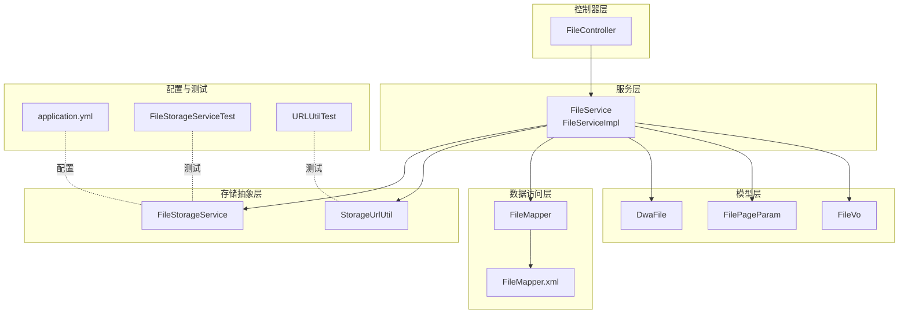
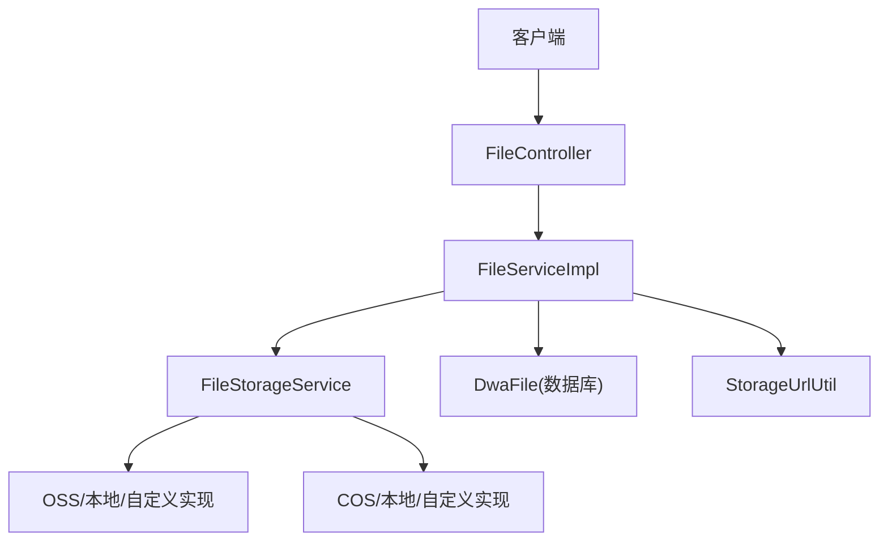
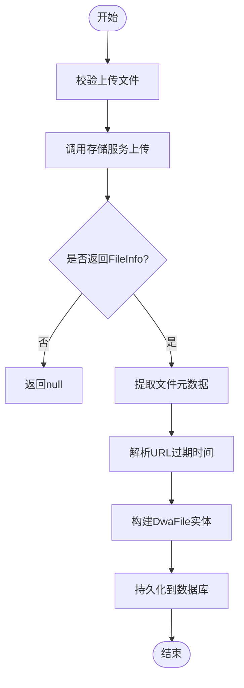
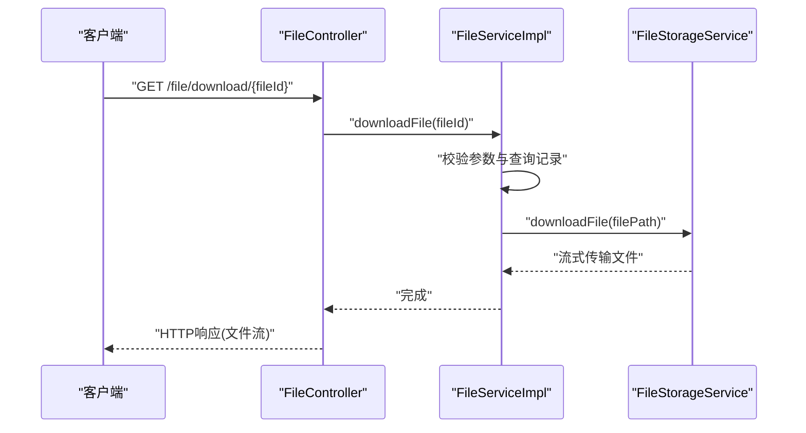
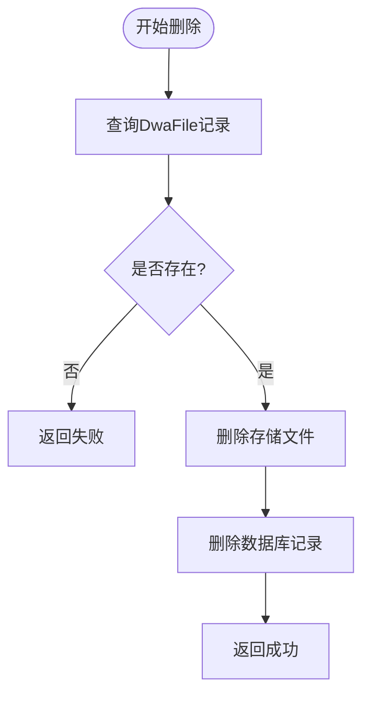
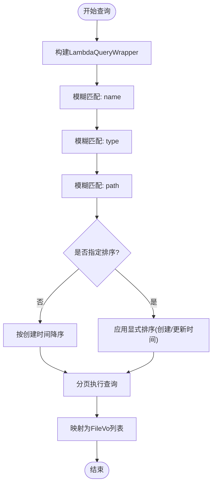
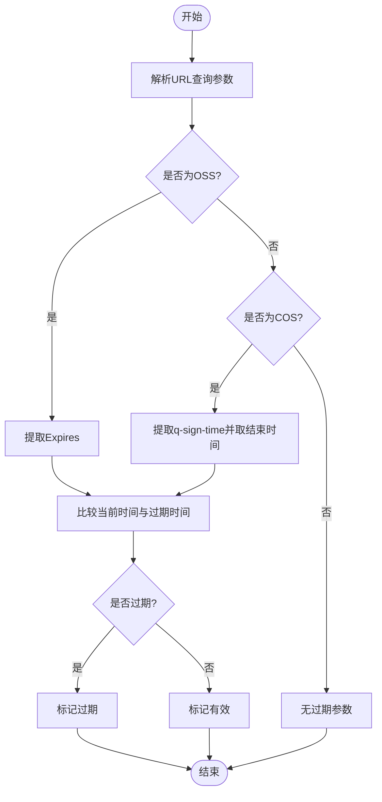
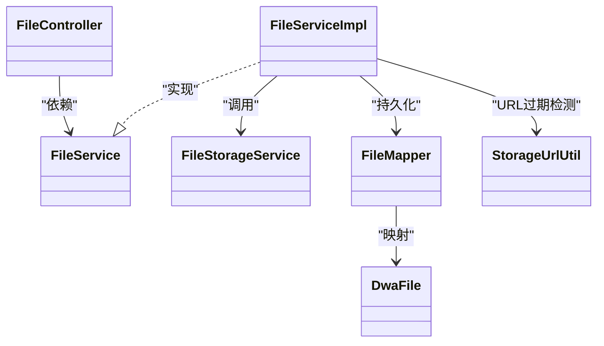

# 文件服务实现

<cite>
**本文引用的文件**
- [src/main/java/com/dw/admin/service/impl/FileServiceImpl.java](file://src/main/java/com/dw/admin/service/impl/FileServiceImpl.java)
- [src/main/java/com/dw/admin/service/FileService.java](file://src/main/java/com/dw/admin/service/FileService.java)
- [src/main/java/com/dw/admin/controller/FileController.java](file://src/main/java/com/dw/admin/controller/FileController.java)
- [src/main/java/com/dw/admin/model/entity/DwaFile.java](file://src/main/java/com/dw/admin/model/entity/DwaFile.java)
- [src/main/java/com/dw/admin/dao/FileMapper.java](file://src/main/java/com/dw/admin/dao/FileMapper.java)
- [src/main/java/com/dw/admin/components/storage/StorageUrlUtil.java](file://src/main/java/com/dw/admin/components/storage/StorageUrlUtil.java)
- [src/main/java/com/dw/admin/components/storage/FileStorageService.java](file://src/main/java/com/dw/admin/components/storage/FileStorageService.java)
- [src/main/java/com/dw/admin/model/param/FilePageParam.java](file://src/main/java/com/dw/admin/model/param/FilePageParam.java)
- [src/main/java/com/dw/admin/model/vo/FileVo.java](file://src/main/java/com/dw/admin/model/vo/FileVo.java)
- [src/main/resources/mapper/FileMapper.xml](file://src/main/resources/mapper/FileMapper.xml)
- [src/main/resources/application.yml](file://src/main/resources/application.yml)
- [src/test/java/com/dw/admin/test/storage/FileStorageServiceTest.java](file://src/test/java/com/dw/admin/test/storage/FileStorageServiceTest.java)
- [src/test/java/com/dw/admin/test/storage/URLUtilTest.java](file://src/test/java/com/dw/admin/test/storage/URLUtilTest.java)
</cite>

## 目录
1. [简介](#简介)
2. [项目结构](#项目结构)
3. [核心组件](#核心组件)
4. [架构总览](#架构总览)
5. [详细组件分析](#详细组件分析)
6. [依赖关系分析](#依赖关系分析)
7. [性能考虑](#性能考虑)
8. [故障排查指南](#故障排查指南)
9. [结论](#结论)
10. [附录](#附录)

## 简介
本文件服务实现围绕统一文件存储接口构建，提供文件上传、下载、删除、查询与URL过期刷新等能力。核心业务由 FileServiceImpl 承载，通过 FileStorageService 抽象对接多种存储后端（如阿里云 OSS、腾讯云 COS、本地存储），并通过 StorageUrlUtil 实现对预签名URL过期时间的解析与刷新。数据库层使用 MyBatis-Plus 的 DwaFile 实体与 FileMapper XML 映射，配合分页查询与排序策略，满足文件管理场景的高可用需求。

## 项目结构
文件服务相关模块按职责分层组织：
- 控制器层：FileController 提供REST接口，负责鉴权注解与日志注解的装配，并调用 FileService。
- 服务层：FileService 定义文件服务契约，FileServiceImpl 实现具体业务逻辑。
- 数据访问层：FileMapper 接口与 FileMapper.xml 映射 DwaFile 表。
- 模型层：DwaFile 实体、FilePageParam 查询参数、FileVo 返回值对象。
- 存储抽象层：FileStorageService 统一接口；StorageUrlUtil 提供URL过期判断与解析。
- 配置与测试：application.yml 中的存储提供商与URL过期时长配置；单元测试覆盖上传与URL解析。

图表来源
- [src/main/java/com/dw/admin/controller/FileController.java](file://src/main/java/com/dw/admin/controller/FileController.java#L1-L83)
- [src/main/java/com/dw/admin/service/impl/FileServiceImpl.java](file://src/main/java/com/dw/admin/service/impl/FileServiceImpl.java#L1-L234)
- [src/main/java/com/dw/admin/components/storage/FileStorageService.java](file://src/main/java/com/dw/admin/components/storage/FileStorageService.java#L1-L52)
- [src/main/java/com/dw/admin/components/storage/StorageUrlUtil.java](file://src/main/java/com/dw/admin/components/storage/StorageUrlUtil.java#L1-L112)
- [src/main/java/com/dw/admin/dao/FileMapper.java](file://src/main/java/com/dw/admin/dao/FileMapper.java#L1-L17)
- [src/main/resources/mapper/FileMapper.xml](file://src/main/resources/mapper/FileMapper.xml#L1-L26)
- [src/main/java/com/dw/admin/model/entity/DwaFile.java](file://src/main/java/com/dw/admin/model/entity/DwaFile.java#L1-L88)
- [src/main/java/com/dw/admin/model/param/FilePageParam.java](file://src/main/java/com/dw/admin/model/param/FilePageParam.java#L1-L40)
- [src/main/java/com/dw/admin/model/vo/FileVo.java](file://src/main/java/com/dw/admin/model/vo/FileVo.java#L1-L61)
- [src/main/resources/application.yml](file://src/main/resources/application.yml#L1-L64)
- [src/test/java/com/dw/admin/test/storage/FileStorageServiceTest.java](file://src/test/java/com/dw/admin/test/storage/FileStorageServiceTest.java#L1-L42)
- [src/test/java/com/dw/admin/test/storage/URLUtilTest.java](file://src/test/java/com/dw/admin/test/storage/URLUtilTest.java#L1-L32)

章节来源
- [src/main/java/com/dw/admin/controller/FileController.java](file://src/main/java/com/dw/admin/controller/FileController.java#L1-L83)
- [src/main/java/com/dw/admin/service/impl/FileServiceImpl.java](file://src/main/java/com/dw/admin/service/impl/FileServiceImpl.java#L1-L234)
- [src/main/java/com/dw/admin/components/storage/FileStorageService.java](file://src/main/java/com/dw/admin/components/storage/FileStorageService.java#L1-L52)
- [src/main/java/com/dw/admin/components/storage/StorageUrlUtil.java](file://src/main/java/com/dw/admin/components/storage/StorageUrlUtil.java#L1-L112)
- [src/main/java/com/dw/admin/dao/FileMapper.java](file://src/main/java/com/dw/admin/dao/FileMapper.java#L1-L17)
- [src/main/resources/mapper/FileMapper.xml](file://src/main/resources/mapper/FileMapper.xml#L1-L26)
- [src/main/java/com/dw/admin/model/entity/DwaFile.java](file://src/main/java/com/dw/admin/model/entity/DwaFile.java#L1-L88)
- [src/main/java/com/dw/admin/model/param/FilePageParam.java](file://src/main/java/com/dw/admin/model/param/FilePageParam.java#L1-L40)
- [src/main/java/com/dw/admin/model/vo/FileVo.java](file://src/main/java/com/dw/admin/model/vo/FileVo.java#L1-L61)
- [src/main/resources/application.yml](file://src/main/resources/application.yml#L1-L64)
- [src/test/java/com/dw/admin/test/storage/FileStorageServiceTest.java](file://src/test/java/com/dw/admin/test/storage/FileStorageServiceTest.java#L1-L42)
- [src/test/java/com/dw/admin/test/storage/URLUtilTest.java](file://src/test/java/com/dw/admin/test/storage/URLUtilTest.java#L1-L32)

## 核心组件
- FileService 接口：定义上传、下载、删除、查询单个文件、分页查询等方法契约。
- FileServiceImpl：实现类，负责文件上传校验、元数据提取、存储执行、数据库持久化、URL过期刷新、分页查询与排序。
- FileController：REST 控制器，负责鉴权与日志切面装配，调用 FileService 并封装响应。
- DwaFile 实体：映射 dwa_file 表，包含文件ID、名称、类型、大小、路径、URL、过期时间、创建/修改用户与时间戳。
- FileMapper 与 FileMapper.xml：MyBatis-Plus 映射，提供分页查询与字段映射。
- FilePageParam：分页查询参数，支持名称/类型/路径模糊搜索与创建/更新时间排序。
- FileVo：对外返回值对象，包含文件基本信息与时间格式化。
- FileStorageService：统一存储接口，屏蔽不同存储提供商差异。
- StorageUrlUtil：URL过期检测与过期时间提取工具，兼容 OSS 与 COS 预签名URL格式。

章节来源
- [src/main/java/com/dw/admin/service/FileService.java](file://src/main/java/com/dw/admin/service/FileService.java#L1-L43)
- [src/main/java/com/dw/admin/service/impl/FileServiceImpl.java](file://src/main/java/com/dw/admin/service/impl/FileServiceImpl.java#L1-L234)
- [src/main/java/com/dw/admin/controller/FileController.java](file://src/main/java/com/dw/admin/controller/FileController.java#L1-L83)
- [src/main/java/com/dw/admin/model/entity/DwaFile.java](file://src/main/java/com/dw/admin/model/entity/DwaFile.java#L1-L88)
- [src/main/java/com/dw/admin/dao/FileMapper.java](file://src/main/java/com/dw/admin/dao/FileMapper.java#L1-L17)
- [src/main/resources/mapper/FileMapper.xml](file://src/main/resources/mapper/FileMapper.xml#L1-L26)
- [src/main/java/com/dw/admin/model/param/FilePageParam.java](file://src/main/java/com/dw/admin/model/param/FilePageParam.java#L1-L40)
- [src/main/java/com/dw/admin/model/vo/FileVo.java](file://src/main/java/com/dw/admin/model/vo/FileVo.java#L1-L61)
- [src/main/java/com/dw/admin/components/storage/FileStorageService.java](file://src/main/java/com/dw/admin/components/storage/FileStorageService.java#L1-L52)
- [src/main/java/com/dw/admin/components/storage/StorageUrlUtil.java](file://src/main/java/com/dw/admin/components/storage/StorageUrlUtil.java#L1-L112)

## 架构总览
文件服务采用“控制器-服务-存储抽象-数据访问”的分层架构，结合统一存储接口与URL工具类，实现跨存储提供商的文件管理能力。

图表来源
- [src/main/java/com/dw/admin/controller/FileController.java](file://src/main/java/com/dw/admin/controller/FileController.java#L1-L83)
- [src/main/java/com/dw/admin/service/impl/FileServiceImpl.java](file://src/main/java/com/dw/admin/service/impl/FileServiceImpl.java#L1-L234)
- [src/main/java/com/dw/admin/components/storage/FileStorageService.java](file://src/main/java/com/dw/admin/components/storage/FileStorageService.java#L1-L52)
- [src/main/java/com/dw/admin/components/storage/StorageUrlUtil.java](file://src/main/java/com/dw/admin/components/storage/StorageUrlUtil.java#L1-L112)
- [src/main/java/com/dw/admin/model/entity/DwaFile.java](file://src/main/java/com/dw/admin/model/entity/DwaFile.java#L1-L88)

## 详细组件分析

### FileServiceImpl 核心业务逻辑与算法
- 上传流程
  - 参数校验：确保上传文件非空。
  - 存储执行：委托 FileStorageService 执行实际上传，获取 FileInfo。
  - 元数据提取：从 FileInfo 中读取文件ID、名称、类型、大小、路径、URL。
  - URL过期时间计算：通过 StorageUrlUtil 从URL中提取过期时间。
  - 数据库持久化：构造 DwaFile 对象，填充创建/更新用户与过期时间，写入数据库。
  - 返回：返回 FileInfo。
- 下载流程
  - 参数校验：校验 fileId 非空。
  - 数据查询：根据 fileId 查询 DwaFile 记录。
  - 权限与存在性：若记录不存在则抛出异常；若存在且包含文件路径，则调用 FileStorageService 下载。
  - 日志记录：记录下载成功日志。
- 删除流程
  - 参数校验：校验 fileId 非空。
  - 读取记录：查询 DwaFile。
  - 存储清理：调用 FileStorageService 删除对应文件路径。
  - 数据库清理：删除对应记录。
  - 异常处理：捕获异常并记录错误日志，返回失败。
- URL刷新流程
  - 过期检测：通过 StorageUrlUtil 判断URL是否过期。
  - 预签名URL生成：调用 FileStorageService.getPresignedUrl 获取新URL。
  - 数据库更新：更新 DwaFile 的 fileUrl 与 urlExpires 字段。
- 查询流程
  - 参数校验：校验 FilePageParam 非空。
  - 构建查询条件：基于 name/type/path 进行模糊匹配。
  - 排序策略：默认按创建时间降序；若显式传入排序参数则按 ASC/DESC 应用到创建/更新时间。
  - 分页查询：使用 MyBatis-Plus Page 与 LambdaQueryWrapper 执行分页查询。
  - 结果转换：将 DwaFile 列表映射为 FileVo 列表，封装为 PageResult。

图表来源
- [src/main/java/com/dw/admin/service/impl/FileServiceImpl.java](file://src/main/java/com/dw/admin/service/impl/FileServiceImpl.java#L45-L76)
- [src/main/java/com/dw/admin/components/storage/StorageUrlUtil.java](file://src/main/java/com/dw/admin/components/storage/StorageUrlUtil.java#L48-L76)

章节来源
- [src/main/java/com/dw/admin/service/impl/FileServiceImpl.java](file://src/main/java/com/dw/admin/service/impl/FileServiceImpl.java#L45-L116)
- [src/main/java/com/dw/admin/components/storage/StorageUrlUtil.java](file://src/main/java/com/dw/admin/components/storage/StorageUrlUtil.java#L26-L76)

### 文件下载的URL生成、权限验证与流式传输
- URL生成：通过 FileStorageService.getPresignedUrl(fileKey) 生成带过期时间的预签名URL。
- 权限验证：控制器层使用 @Auth 注解进行鉴权，确保下载请求具备访问权限。
- 流式传输：FileStorageService.downloadFile(fileKey) 负责将文件以流的方式输出至HTTP响应，避免一次性加载到内存。
- URL过期：在查询或访问时，若发现URL已过期，会触发刷新逻辑，重新生成预签名URL并更新数据库。

图表来源
- [src/main/java/com/dw/admin/controller/FileController.java](file://src/main/java/com/dw/admin/controller/FileController.java#L42-L47)
- [src/main/java/com/dw/admin/service/impl/FileServiceImpl.java](file://src/main/java/com/dw/admin/service/impl/FileServiceImpl.java#L82-L93)
- [src/main/java/com/dw/admin/components/storage/FileStorageService.java](file://src/main/java/com/dw/admin/components/storage/FileStorageService.java#L30-L35)

章节来源
- [src/main/java/com/dw/admin/controller/FileController.java](file://src/main/java/com/dw/admin/controller/FileController.java#L42-L47)
- [src/main/java/com/dw/admin/service/impl/FileServiceImpl.java](file://src/main/java/com/dw/admin/service/impl/FileServiceImpl.java#L82-L93)
- [src/main/java/com/dw/admin/components/storage/FileStorageService.java](file://src/main/java/com/dw/admin/components/storage/FileStorageService.java#L30-L35)

### 文件删除的级联操作、存储清理与缓存更新
- 存储清理：先调用 FileStorageService.deleteFile(filePath) 删除云端/本地文件。
- 数据库清理：再执行删除记录操作。
- 缓存更新：当前实现未直接涉及缓存层更新，建议在删除后增加缓存失效策略（例如基于文件ID的键失效）以避免脏读。

图表来源
- [src/main/java/com/dw/admin/service/impl/FileServiceImpl.java](file://src/main/java/com/dw/admin/service/impl/FileServiceImpl.java#L98-L116)

章节来源
- [src/main/java/com/dw/admin/service/impl/FileServiceImpl.java](file://src/main/java/com/dw/admin/service/impl/FileServiceImpl.java#L98-L116)

### 文件查询的分页实现、排序机制与搜索优化
- 搜索条件：支持按文件名、类型、路径进行模糊匹配。
- 排序规则：默认按创建时间降序；可选按创建时间或更新时间升/降序。
- 分页策略：使用 MyBatis-Plus Page 与 LambdaQueryWrapper 实现分页查询。
- 性能优化建议：
  - 为 dwa_file 上的常用查询字段（如 fileName、fileType、filePath、create_time、update_time）建立索引。
  - 对大文本字段（如 file_path）进行必要性评估，避免不必要的全量扫描。
  - 在高频查询场景下引入二级缓存或Redis缓存热点文件列表。

图表来源
- [src/main/java/com/dw/admin/service/impl/FileServiceImpl.java](file://src/main/java/com/dw/admin/service/impl/FileServiceImpl.java#L176-L212)
- [src/main/java/com/dw/admin/model/param/FilePageParam.java](file://src/main/java/com/dw/admin/model/param/FilePageParam.java#L14-L39)
- [src/main/resources/mapper/FileMapper.xml](file://src/main/resources/mapper/FileMapper.xml#L5-L18)

章节来源
- [src/main/java/com/dw/admin/service/impl/FileServiceImpl.java](file://src/main/java/com/dw/admin/service/impl/FileServiceImpl.java#L176-L212)
- [src/main/java/com/dw/admin/model/param/FilePageParam.java](file://src/main/java/com/dw/admin/model/param/FilePageParam.java#L14-L39)
- [src/main/resources/mapper/FileMapper.xml](file://src/main/resources/mapper/FileMapper.xml#L5-L18)

### StorageUrlUtil 工具类的URL生成策略与缓存机制
- URL过期检测：解析URL查询参数，分别兼容 OSS 的 Expires 与 COS 的 q-sign-time；比较当前时间与过期时间决定是否过期。
- 过期时间提取：从URL中提取过期时间戳，用于后续刷新判断。
- 缓存机制：当前实现未内置缓存，建议在高频刷新场景下引入短时缓存（如基于文件ID的过期时间缓存），降低重复解析与数据库更新频率。

图表来源
- [src/main/java/com/dw/admin/components/storage/StorageUrlUtil.java](file://src/main/java/com/dw/admin/components/storage/StorageUrlUtil.java#L26-L76)

章节来源
- [src/main/java/com/dw/admin/components/storage/StorageUrlUtil.java](file://src/main/java/com/dw/admin/components/storage/StorageUrlUtil.java#L26-L76)

### 异常处理、事务管理与性能优化
- 异常处理：删除流程中捕获异常并记录错误日志，保证服务稳定性。
- 事务管理：当前实现未显式声明事务，建议在需要强一致性的场景（如上传后立即查询）增加事务控制，确保数据库与存储的一致性。
- 性能优化：
  - 存储层：合理设置URL过期时长，平衡安全性与访问频次。
  - 数据库层：为高频查询字段建立索引；分页查询避免一次性加载大量数据。
  - 缓存层：对热点文件URL与元数据进行缓存，减少重复解析与数据库压力。

章节来源
- [src/main/java/com/dw/admin/service/impl/FileServiceImpl.java](file://src/main/java/com/dw/admin/service/impl/FileServiceImpl.java#L112-L115)
- [src/main/resources/application.yml](file://src/main/resources/application.yml#L40-L64)

## 依赖关系分析
- FileController 依赖 FileService；FileServiceImpl 实现 FileService。
- FileServiceImpl 依赖 FileStorageService、FileMapper、StorageUrlUtil。
- FileMapper 通过 XML 映射 DwaFile 实体，提供分页查询能力。
- StorageUrlUtil 与 FileStorageService 协作，支撑URL过期检测与刷新。

图表来源
- [src/main/java/com/dw/admin/controller/FileController.java](file://src/main/java/com/dw/admin/controller/FileController.java#L1-L83)
- [src/main/java/com/dw/admin/service/FileService.java](file://src/main/java/com/dw/admin/service/FileService.java#L1-L43)
- [src/main/java/com/dw/admin/service/impl/FileServiceImpl.java](file://src/main/java/com/dw/admin/service/impl/FileServiceImpl.java#L1-L234)
- [src/main/java/com/dw/admin/components/storage/FileStorageService.java](file://src/main/java/com/dw/admin/components/storage/FileStorageService.java#L1-L52)
- [src/main/java/com/dw/admin/dao/FileMapper.java](file://src/main/java/com/dw/admin/dao/FileMapper.java#L1-L17)
- [src/main/java/com/dw/admin/model/entity/DwaFile.java](file://src/main/java/com/dw/admin/model/entity/DwaFile.java#L1-L88)
- [src/main/java/com/dw/admin/components/storage/StorageUrlUtil.java](file://src/main/java/com/dw/admin/components/storage/StorageUrlUtil.java#L1-L112)

章节来源
- [src/main/java/com/dw/admin/controller/FileController.java](file://src/main/java/com/dw/admin/controller/FileController.java#L1-L83)
- [src/main/java/com/dw/admin/service/FileService.java](file://src/main/java/com/dw/admin/service/FileService.java#L1-L43)
- [src/main/java/com/dw/admin/service/impl/FileServiceImpl.java](file://src/main/java/com/dw/admin/service/impl/FileServiceImpl.java#L1-L234)
- [src/main/java/com/dw/admin/components/storage/FileStorageService.java](file://src/main/java/com/dw/admin/components/storage/FileStorageService.java#L1-L52)
- [src/main/java/com/dw/admin/dao/FileMapper.java](file://src/main/java/com/dw/admin/dao/FileMapper.java#L1-L17)
- [src/main/java/com/dw/admin/model/entity/DwaFile.java](file://src/main/java/com/dw/admin/model/entity/DwaFile.java#L1-L88)
- [src/main/java/com/dw/admin/components/storage/StorageUrlUtil.java](file://src/main/java/com/dw/admin/components/storage/StorageUrlUtil.java#L1-L112)

## 性能考虑
- 存储URL过期策略：通过 application.yml 中的 url-expires 配置控制预签名URL有效期，建议根据业务访问模式调整。
- 数据库查询优化：为高频查询字段建立索引；分页查询避免全表扫描。
- 缓存策略：对热点文件URL与元数据进行缓存，减少重复解析与数据库压力。
- 上传限制：application.yml 中配置了最大请求大小与文件大小，防止过大文件导致资源耗尽。

章节来源
- [src/main/resources/application.yml](file://src/main/resources/application.yml#L17-L21)
- [src/main/resources/application.yml](file://src/main/resources/application.yml#L51-L59)

## 故障排查指南
- 上传失败
  - 检查文件是否为空与大小限制是否超限。
  - 查看存储服务返回的 FileInfo 是否为空。
- 下载失败
  - 确认 fileId 是否存在且文件路径不为空。
  - 检查存储服务的下载实现是否正常。
- 删除失败
  - 观察异常日志，确认存储删除与数据库删除是否都执行成功。
- URL过期频繁
  - 调整 application.yml 中的 url-expires 配置。
  - 在高频访问场景下引入URL缓存与定时刷新策略。

章节来源
- [src/main/java/com/dw/admin/service/impl/FileServiceImpl.java](file://src/main/java/com/dw/admin/service/impl/FileServiceImpl.java#L46-L51)
- [src/main/java/com/dw/admin/service/impl/FileServiceImpl.java](file://src/main/java/com/dw/admin/service/impl/FileServiceImpl.java#L82-L93)
- [src/main/java/com/dw/admin/service/impl/FileServiceImpl.java](file://src/main/java/com/dw/admin/service/impl/FileServiceImpl.java#L98-L116)
- [src/main/java/com/dw/admin/components/storage/StorageUrlUtil.java](file://src/main/java/com/dw/admin/components/storage/StorageUrlUtil.java#L26-L46)
- [src/main/resources/application.yml](file://src/main/resources/application.yml#L51-L59)

## 结论
该文件服务实现通过统一存储接口与URL工具类，实现了跨存储提供商的文件管理能力。FileServiceImpl 将上传、下载、删除、查询与URL刷新串联为完整闭环，结合分页与排序策略满足日常管理需求。建议在生产环境中补充事务控制、缓存策略与索引优化，以进一步提升一致性与性能。

## 附录
- 测试参考
  - FileStorageServiceTest：演示本地文件上传测试。
  - URLUtilTest：演示OSS/COS预签名URL过期时间提取测试。

章节来源
- [src/test/java/com/dw/admin/test/storage/FileStorageServiceTest.java](file://src/test/java/com/dw/admin/test/storage/FileStorageServiceTest.java#L1-L42)
- [src/test/java/com/dw/admin/test/storage/URLUtilTest.java](file://src/test/java/com/dw/admin/test/storage/URLUtilTest.java#L1-L32)