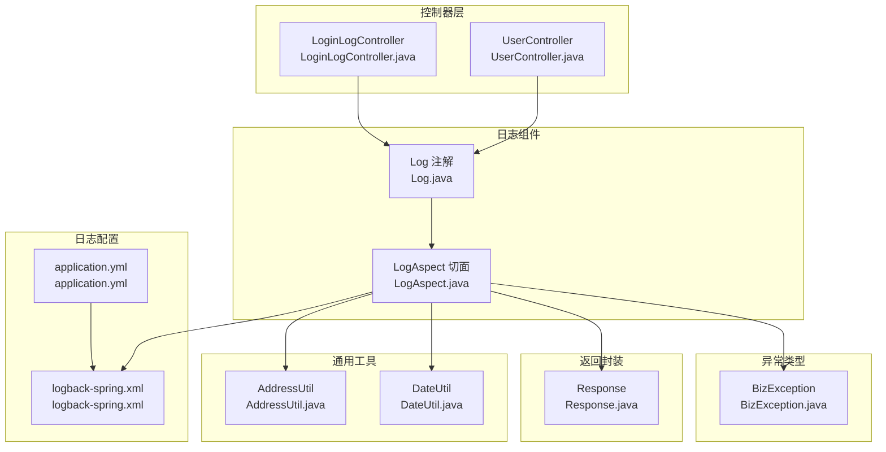
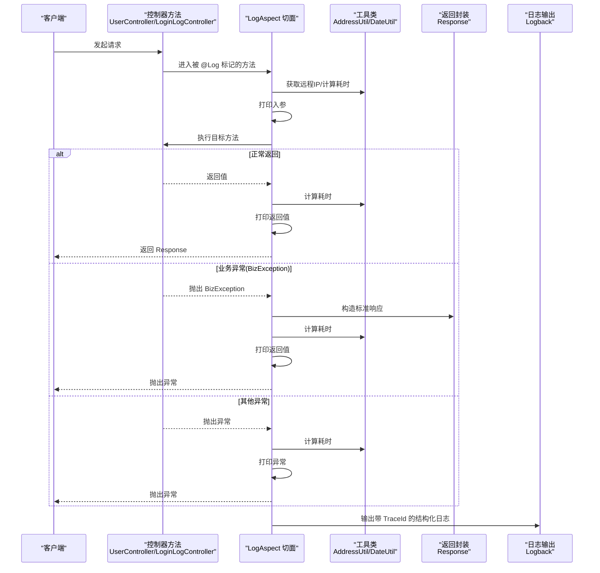
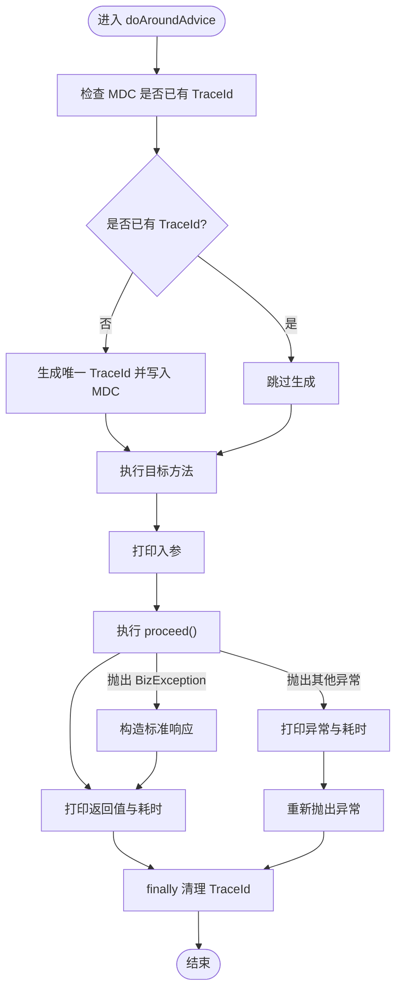
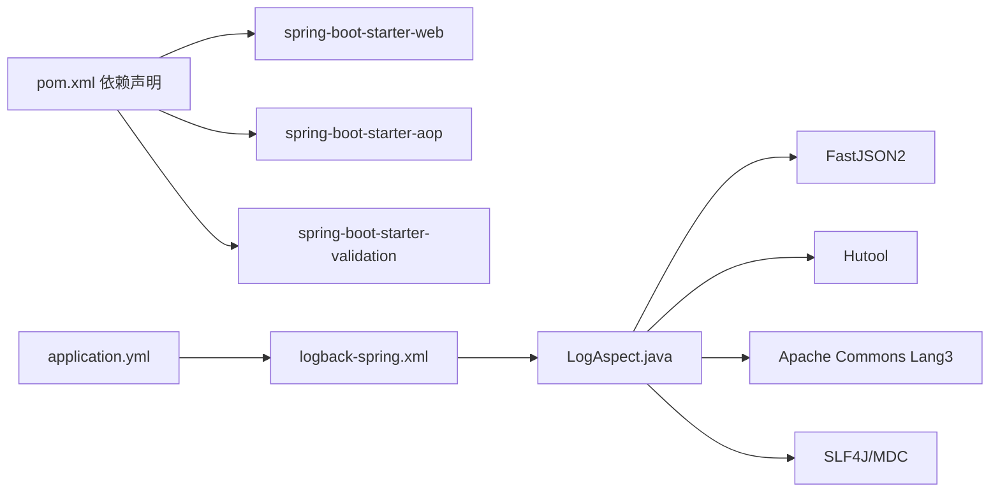

# 操作日志

<cite>
**本文引用的文件**
- [Log.java](file://src/main/java/com/dw/admin/components/log/Log.java)
- [LogAspect.java](file://src/main/java/com/dw/admin/components/log/LogAspect.java)
- [UserController.java](file://src/main/java/com/dw/admin/controller/UserController.java)
- [LoginLogController.java](file://src/main/java/com/dw/admin/controller/LoginLogController.java)
- [AddressUtil.java](file://src/main/java/com/dw/admin/common/utils/AddressUtil.java)
- [DateUtil.java](file://src/main/java/com/dw/admin/common/utils/DateUtil.java)
- [Response.java](file://src/main/java/com/dw/admin/common/entity/Response.java)
- [BizException.java](file://src/main/java/com/dw/admin/common/exception/BizException.java)
- [logback-spring.xml](file://src/main/resources/logback/logback-spring.xml)
- [application.yml](file://src/main/resources/application.yml)
- [pom.xml](file://pom.xml)
</cite>

## 目录
1. [简介](#简介)
2. [项目结构](#项目结构)
3. [核心组件](#核心组件)
4. [架构总览](#架构总览)
5. [详细组件分析](#详细组件分析)
6. [依赖关系分析](#依赖关系分析)
7. [性能考量](#性能考量)
8. [故障排查指南](#故障排查指南)
9. [结论](#结论)
10. [附录：最佳实践与使用指南](#附录最佳实践与使用指南)

## 简介
本技术文档围绕“操作日志”能力展开，系统性说明：
- Log 注解的设计与使用方式（注解目标、拦截规则）
- LogAspect 切面的实现机制（环绕通知、参数打印、返回值记录、异常处理）
- TraceId 分布式追踪与 MDC 上下文管理
- 日志格式标准化与结构化输出策略
- 日志级别配置与过滤规则
- 性能优化建议与最佳实践
- 面向开发者的使用指南与调试技巧

## 项目结构
操作日志功能位于模块化目录 components/log 下，配合控制器层注解使用，并由 Logback 输出到控制台与滚动文件。

图表来源
- [Log.java](file://src/main/java/com/dw/admin/components/log/Log.java#L1-L19)
- [LogAspect.java](file://src/main/java/com/dw/admin/components/log/LogAspect.java#L1-L143)
- [UserController.java](file://src/main/java/com/dw/admin/controller/UserController.java#L1-L138)
- [LoginLogController.java](file://src/main/java/com/dw/admin/controller/LoginLogController.java#L1-L51)
- [AddressUtil.java](file://src/main/java/com/dw/admin/common/utils/AddressUtil.java#L1-L101)
- [DateUtil.java](file://src/main/java/com/dw/admin/common/utils/DateUtil.java#L1-L31)
- [Response.java](file://src/main/java/com/dw/admin/common/entity/Response.java#L1-L132)
- [BizException.java](file://src/main/java/com/dw/admin/common/exception/BizException.java#L1-L54)
- [logback-spring.xml](file://src/main/resources/logback/logback-spring.xml#L1-L72)
- [application.yml](file://src/main/resources/application.yml#L1-L64)

章节来源
- [Log.java](file://src/main/java/com/dw/admin/components/log/Log.java#L1-L19)
- [LogAspect.java](file://src/main/java/com/dw/admin/components/log/LogAspect.java#L1-L143)
- [UserController.java](file://src/main/java/com/dw/admin/controller/UserController.java#L1-L138)
- [LoginLogController.java](file://src/main/java/com/dw/admin/controller/LoginLogController.java#L1-L51)
- [logback-spring.xml](file://src/main/resources/logback/logback-spring.xml#L1-L72)
- [application.yml](file://src/main/resources/application.yml#L1-L64)

## 核心组件
- Log 注解：用于标记需要记录操作日志的方法或类，采用运行时可见，作用于类型与方法级别。
- LogAspect 切面：基于 AspectJ 的环绕通知，负责在目标方法执行前后打印入参、返回值、耗时与异常信息；并维护 TraceId 的 MDC 上下文。
- 控制器层：在关键业务接口上添加 @Log 注解，形成统一的日志采集入口。
- 工具类：AddressUtil 提供客户端 IP 解析；DateUtil 提供耗时计算。
- 返回封装与异常：Response 统一返回结构；BizException 用于业务异常，切面会将其转换为标准响应结构进行记录。

章节来源
- [Log.java](file://src/main/java/com/dw/admin/components/log/Log.java#L13-L18)
- [LogAspect.java](file://src/main/java/com/dw/admin/components/log/LogAspect.java#L31-L87)
- [UserController.java](file://src/main/java/com/dw/admin/controller/UserController.java#L36-L135)
- [LoginLogController.java](file://src/main/java/com/dw/admin/controller/LoginLogController.java#L31-L48)
- [AddressUtil.java](file://src/main/java/com/dw/admin/common/utils/AddressUtil.java#L22-L68)
- [DateUtil.java](file://src/main/java/com/dw/admin/common/utils/DateUtil.java#L26-L28)
- [Response.java](file://src/main/java/com/dw/admin/common/entity/Response.java#L14-L47)
- [BizException.java](file://src/main/java/com/dw/admin/common/exception/BizException.java#L11-L49)

## 架构总览
Log 注解与 LogAspect 的交互流程如下：

图表来源
- [LogAspect.java](file://src/main/java/com/dw/admin/components/log/LogAspect.java#L50-L87)
- [AddressUtil.java](file://src/main/java/com/dw/admin/common/utils/AddressUtil.java#L22-L68)
- [DateUtil.java](file://src/main/java/com/dw/admin/common/utils/DateUtil.java#L26-L28)
- [Response.java](file://src/main/java/com/dw/admin/common/entity/Response.java#L57-L95)
- [BizException.java](file://src/main/java/com/dw/admin/common/exception/BizException.java#L11-L49)
- [logback-spring.xml](file://src/main/resources/logback/logback-spring.xml#L7-L18)

## 详细组件分析

### Log 注解设计与使用
- 设计原则
  - 无参数设计：注解本身不携带配置项，便于统一拦截与处理。
  - 作用范围：可标注在类或方法上，类级注解对所有方法生效；方法级注解覆盖类级。
- 使用方式
  - 在控制器方法上添加 @Log，即可触发 LogAspect 的环绕通知。
  - 示例：UserController 与 LoginLogController 多处方法均使用 @Log。

章节来源
- [Log.java](file://src/main/java/com/dw/admin/components/log/Log.java#L13-L18)
- [UserController.java](file://src/main/java/com/dw/admin/controller/UserController.java#L36-L135)
- [LoginLogController.java](file://src/main/java/com/dw/admin/controller/LoginLogController.java#L31-L48)

### LogAspect 切面实现机制
- 拦截规则
  - 基于注解的切入点：@annotation(com.dw.admin.components.log.Log)
  - 环绕通知：在目标方法前打印入参，在后打印返回值与耗时；异常时打印异常信息。
- 关键流程
  - 初始化与上下文
    - 若 MDC 中不存在 TraceId，则生成唯一 ID 并写入；finally 中在首次注入时移除，避免泄漏。
  - 入参打印
    - 通过 JSON 序列化参数数组，结合远程 IP 与方法签名输出。
  - 返回值记录
    - 对正常返回值直接序列化输出；对业务异常 BizException，构造标准响应结构再输出。
  - 异常处理
    - 对 BizException：构造标准响应，包含 code 与 message，随后按常规返回流程输出。
    - 对其他异常：仅输出异常信息，不改变异常传播。
  - 耗时统计
    - 使用 DateUtil 计算毫秒级耗时并转为秒字符串输出。
- 性能与健壮性
  - try-catch 包裹各打印逻辑，避免日志异常影响主流程。
  - finally 清理 MDC，确保线程安全。

图表来源
- [LogAspect.java](file://src/main/java/com/dw/admin/components/log/LogAspect.java#L50-L87)
- [DateUtil.java](file://src/main/java/com/dw/admin/common/utils/DateUtil.java#L26-L28)

章节来源
- [LogAspect.java](file://src/main/java/com/dw/admin/components/log/LogAspect.java#L31-L87)
- [DateUtil.java](file://src/main/java/com/dw/admin/common/utils/DateUtil.java#L26-L28)

### TraceId 分布式追踪与 MDC 上下文管理
- TraceId 生成
  - 使用雪花算法生成全局唯一 ID，作为一次请求链路的标识。
- MDC 管理
  - 首次注入 TraceId，finally 中在首次注入的情况下移除，避免线程复用导致的数据残留。
- 日志输出
  - Logback 模式串中包含 [%X{traceId}] 占位符，使每条日志自动携带 TraceId，便于跨服务串联。

章节来源
- [LogAspect.java](file://src/main/java/com/dw/admin/components/log/LogAspect.java#L54-L58)
- [LogAspect.java](file://src/main/java/com/dw/admin/components/log/LogAspect.java#L81-L86)
- [logback-spring.xml](file://src/main/resources/logback/logback-spring.xml#L7-L7)

### 日志格式标准化与结构化输出策略
- 格式规范
  - 时间戳、线程名、TraceId、日志级别、Logger 名称、行号、消息体。
- 输出介质
  - 控制台输出（阈值过滤）+ 滚动文件（INFO/ERROR 分离），INFO 按天与大小滚动，ERROR 仅保留 ERROR 级别。
- 结构化字段
  - 入参、返回值、异常堆栈、方法签名、耗时、远端 IP 等均以结构化字段形式输出，便于检索与分析。

章节来源
- [logback-spring.xml](file://src/main/resources/logback/logback-spring.xml#L7-L18)
- [logback-spring.xml](file://src/main/resources/logback/logback-spring.xml#L21-L38)
- [logback-spring.xml](file://src/main/resources/logback/logback-spring.xml#L41-L63)

### 日志级别配置与过滤规则
- 控制台阈值：最低输出级别为 TRACE。
- 文件输出：INFO 滚动文件记录所有 INFO+；ERROR 滚动文件仅接收 ERROR 级别。
- 应用内示例：DAO 层默认开启 DEBUG，便于定位 SQL 问题。

章节来源
- [logback-spring.xml](file://src/main/resources/logback/logback-spring.xml#L15-L17)
- [logback-spring.xml](file://src/main/resources/logback/logback-spring.xml#L58-L62)
- [application.yml](file://src/main/resources/application.yml#L30-L31)

### 与控制器的集成与典型场景
- 控制器层通过 @Log 注解标记关键接口，如用户注册、登录、保存、更新、删除、查询等。
- 切面在每个被标记的方法上统一输出入参、返回值、耗时与异常，形成一致的操作日志体验。

章节来源
- [UserController.java](file://src/main/java/com/dw/admin/controller/UserController.java#L36-L135)
- [LoginLogController.java](file://src/main/java/com/dw/admin/controller/LoginLogController.java#L31-L48)

## 依赖关系分析
- 依赖声明
  - Spring Boot Starter Web、Starter AOP、Starter Validation 等，保证切面与 Web 请求处理能力。
- 组件耦合
  - Log 注解与 LogAspect 通过注解扫描耦合；LogAspect 依赖工具类与返回封装；日志输出依赖 Logback 配置。
- 外部依赖
  - FastJSON2 用于参数与返回值序列化；Hutool 用于雪花 ID 生成；Apache Commons Lang3 用于字符串判断；SLF4J/MDC 用于上下文管理。

图表来源
- [pom.xml](file://pom.xml#L25-L63)
- [LogAspect.java](file://src/main/java/com/dw/admin/components/log/LogAspect.java#L3-L18)
- [logback-spring.xml](file://src/main/resources/logback/logback-spring.xml#L1-L72)
- [application.yml](file://src/main/resources/application.yml#L28-L29)

章节来源
- [pom.xml](file://pom.xml#L25-L63)
- [LogAspect.java](file://src/main/java/com/dw/admin/components/log/LogAspect.java#L3-L18)
- [logback-spring.xml](file://src/main/resources/logback/logback-spring.xml#L1-L72)
- [application.yml](file://src/main/resources/application.yml#L28-L29)

## 性能考量
- 序列化成本
  - 参数与返回值使用 JSON 序列化，建议避免在高频接口中传递超大对象；必要时对敏感字段脱敏。
- 日志级别与输出
  - 控制台与文件输出均为同步落盘，生产环境建议结合异步 Appender 或外部日志收集系统。
- TraceId 生成
  - 雪花 ID 生成开销极低，但需确保时钟回拨防护（框架默认具备一定容错）。
- 异常分支
  - BizException 转换为标准响应再输出，避免重复异常栈打印；其他异常直接输出异常信息，减少额外序列化。
- 建议
  - 对热点接口可考虑条件化启用 @Log，或通过开关动态控制日志粒度。
  - 对大对象参数建议在业务层做脱敏与裁剪，降低序列化与 IO 压力。

[本节为通用性能建议，无需特定文件引用]

## 故障排查指南
- 现象：日志未显示 TraceId
  - 检查 Logback 模式串是否包含 [%X{traceId}] 占位符。
  - 确认切面是否生效（@EnableAspectJAutoProxy 或 Spring 容器扫描）。
- 现象：入参/返回值为空或异常
  - 检查 JSON 序列化是否对目标对象有效；确认参数类型与返回类型可被 FastJSON2 正确序列化。
- 现象：业务异常未按预期输出
  - 确认异常是否为 BizException；非 BizException 将直接输出异常信息而非标准响应。
- 现象：日志级别不符合预期
  - 检查 ThresholdFilter 与 LevelFilter 设置；确认 application.yml 中 logging.level 配置。
- 现象：MDC 泄漏
  - 确认 finally 分支是否清理 TraceId；避免在异步线程池中误用 MDC。

章节来源
- [logback-spring.xml](file://src/main/resources/logback/logback-spring.xml#L7-L18)
- [logback-spring.xml](file://src/main/resources/logback/logback-spring.xml#L58-L62)
- [LogAspect.java](file://src/main/java/com/dw/admin/components/log/LogAspect.java#L81-L86)
- [application.yml](file://src/main/resources/application.yml#L28-L31)

## 结论
该操作日志体系以最小侵入的方式实现了统一的请求级日志采集：通过 @Log 注解与 LogAspect 切面，结合 TraceId 与 MDC，形成可追踪、可检索、可分级的日志输出。配合 Logback 的结构化模式与分级别输出策略，能够满足开发调试与生产监控的双重需求。建议在高并发场景下关注序列化成本与输出介质的吞吐能力，并通过参数脱敏与条件化启用提升整体性能与安全性。

[本节为总结性内容，无需特定文件引用]

## 附录：最佳实践与使用指南

- 使用指南
  - 在控制器方法上添加 @Log 注解，即可自动记录入参、返回值、耗时与异常。
  - 对需要严格控制日志量的接口，可在业务层对参数进行脱敏与裁剪。
  - 对异常处理，优先抛出 BizException，以便切面输出统一的响应结构。
- 调试技巧
  - 通过 TraceId 快速关联一次请求的完整链路日志。
  - 在 DAO 层开启 DEBUG 级别，便于定位 SQL 问题。
  - 使用控制台输出快速验证日志格式与字段完整性。
- 性能优化建议
  - 避免在高频接口中传递超大对象；对敏感字段进行脱敏。
  - 生产环境建议引入异步日志或集中式日志收集系统。
  - 对热点接口可考虑条件化启用 @Log，或通过开关动态控制日志粒度。

章节来源
- [Log.java](file://src/main/java/com/dw/admin/components/log/Log.java#L13-L18)
- [LogAspect.java](file://src/main/java/com/dw/admin/components/log/LogAspect.java#L50-L87)
- [UserController.java](file://src/main/java/com/dw/admin/controller/UserController.java#L36-L135)
- [LoginLogController.java](file://src/main/java/com/dw/admin/controller/LoginLogController.java#L31-L48)
- [application.yml](file://src/main/resources/application.yml#L30-L31)