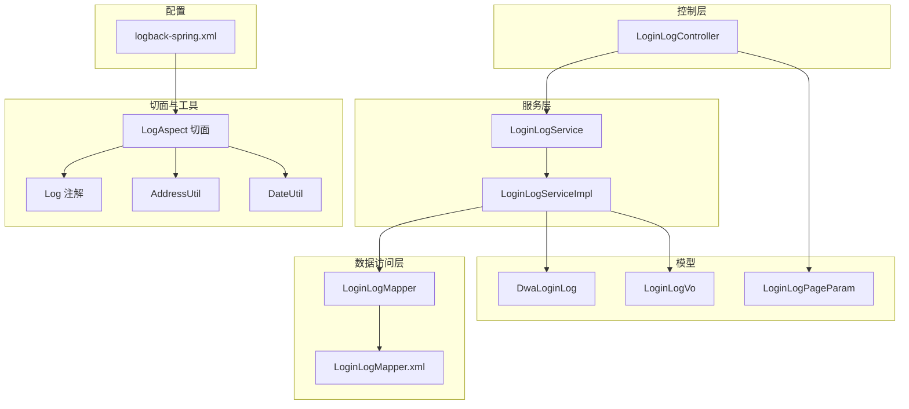
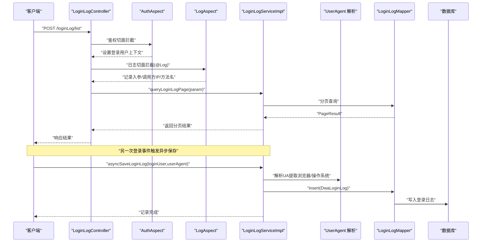
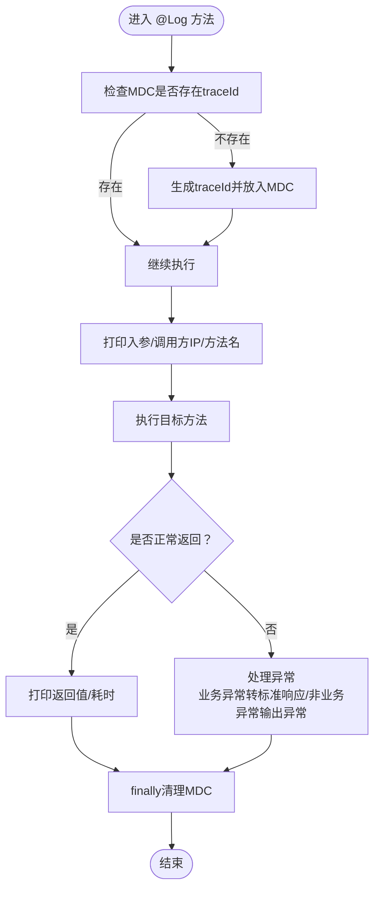
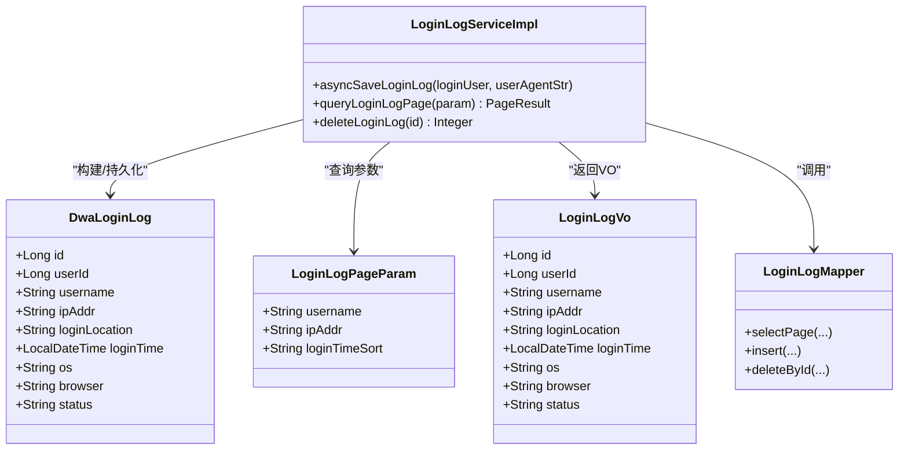
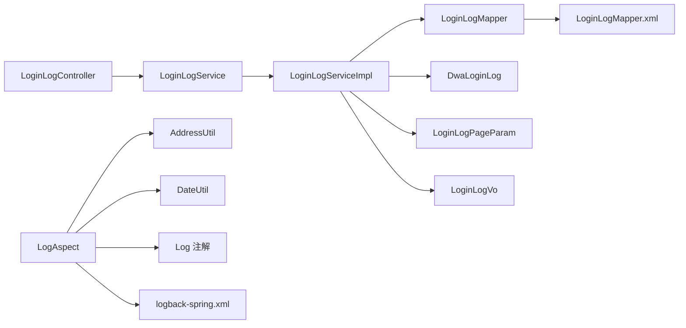

# 日志监控系统

<cite>
**本文引用的文件**
- [src/main/java/com/dw/admin/components/log/Log.java](file://src/main/java/com/dw/admin/components/log/Log.java)
- [src/main/java/com/dw/admin/components/log/LogAspect.java](file://src/main/java/com/dw/admin/components/log/LogAspect.java)
- [src/main/java/com/dw/admin/components/auth/Auth.java](file://src/main/java/com/dw/admin/components/auth/Auth.java)
- [src/main/java/com/dw/admin/components/auth/AuthAspect.java](file://src/main/java/com/dw/admin/components/auth/AuthAspect.java)
- [src/main/java/com/dw/admin/common/utils/AddressUtil.java](file://src/main/java/com/dw/admin/common/utils/AddressUtil.java)
- [src/main/java/com/dw/admin/common/utils/DateUtil.java](file://src/main/java/com/dw/admin/common/utils/DateUtil.java)
- [src/main/java/com/dw/admin/model/entity/DwaLoginLog.java](file://src/main/java/com/dw/admin/model/entity/DwaLoginLog.java)
- [src/main/java/com/dw/admin/model/param/LoginLogPageParam.java](file://src/main/java/com/dw/admin/model/param/LoginLogPageParam.java)
- [src/main/java/com/dw/admin/model/vo/LoginLogVo.java](file://src/main/java/com/dw/admin/model/vo/LoginLogVo.java)
- [src/main/java/com/dw/admin/service/LoginLogService.java](file://src/main/java/com/dw/admin/service/LoginLogService.java)
- [src/main/java/com/dw/admin/service/impl/LoginLogServiceImpl.java](file://src/main/java/com/dw/admin/service/impl/LoginLogServiceImpl.java)
- [src/main/java/com/dw/admin/controller/LoginLogController.java](file://src/main/java/com/dw/admin/controller/LoginLogController.java)
- [src/main/java/com/dw/admin/dao/LoginLogMapper.java](file://src/main/java/com/dw/admin/dao/LoginLogMapper.java)
- [src/main/resources/mapper/LoginLogMapper.xml](file://src/main/resources/mapper/LoginLogMapper.xml)
- [src/main/resources/logback/logback-spring.xml](file://src/main/resources/logback/logback-spring.xml)
- [src/main/java/com/dw/admin/common/entity/PageParam.java](file://src/main/java/com/dw/admin/common/entity/PageParam.java)
</cite>

## 目录
1. [引言](#引言)
2. [项目结构](#项目结构)
3. [核心组件](#核心组件)
4. [架构总览](#架构总览)
5. [详细组件分析](#详细组件分析)
6. [依赖关系分析](#依赖关系分析)
7. [性能考量](#性能考量)
8. [故障排查指南](#故障排查指南)
9. [结论](#结论)
10. [附录](#附录)

## 引言
本技术文档围绕日志监控系统展开，重点阐述日志注解与AOP切面的实现机制，深入分析操作日志与登录日志的采集策略与存储结构，说明日志切面如何拦截业务方法并记录执行信息，解释登录日志的详细字段与来源，描述日志查询与分页功能的实现，并提供日志分析与审计的最佳实践、性能优化与存储成本控制建议，以及日志监控在安全审计中的作用与运维指南。

## 项目结构
日志监控系统主要由以下层次构成：
- 控制层：对外暴露日志查询与删除接口
- 服务层：负责登录日志的异步持久化、查询与删除
- 数据访问层：MyBatis-Plus Mapper 与 XML 映射
- 实体与参数：登录日志实体、查询参数与返回VO
- 切面与工具：日志注解与AOP切面、IP与时间工具
- 配置：Logback 日志输出格式与滚动策略

图表来源
- [src/main/java/com/dw/admin/controller/LoginLogController.java](file://src/main/java/com/dw/admin/controller/LoginLogController.java#L1-L51)
- [src/main/java/com/dw/admin/service/LoginLogService.java](file://src/main/java/com/dw/admin/service/LoginLogService.java#L1-L33)
- [src/main/java/com/dw/admin/service/impl/LoginLogServiceImpl.java](file://src/main/java/com/dw/admin/service/impl/LoginLogServiceImpl.java#L1-L125)
- [src/main/java/com/dw/admin/dao/LoginLogMapper.java](file://src/main/java/com/dw/admin/dao/LoginLogMapper.java#L1-L18)
- [src/main/resources/mapper/LoginLogMapper.xml](file://src/main/resources/mapper/LoginLogMapper.xml#L1-L24)
- [src/main/java/com/dw/admin/model/entity/DwaLoginLog.java](file://src/main/java/com/dw/admin/model/entity/DwaLoginLog.java#L1-L80)
- [src/main/java/com/dw/admin/model/param/LoginLogPageParam.java](file://src/main/java/com/dw/admin/model/param/LoginLogPageParam.java#L1-L36)
- [src/main/java/com/dw/admin/model/vo/LoginLogVo.java](file://src/main/java/com/dw/admin/model/vo/LoginLogVo.java#L1-L72)
- [src/main/java/com/dw/admin/components/log/Log.java](file://src/main/java/com/dw/admin/components/log/Log.java#L1-L19)
- [src/main/java/com/dw/admin/components/log/LogAspect.java](file://src/main/java/com/dw/admin/components/log/LogAspect.java#L1-L143)
- [src/main/java/com/dw/admin/common/utils/AddressUtil.java](file://src/main/java/com/dw/admin/common/utils/AddressUtil.java#L1-L101)
- [src/main/java/com/dw/admin/common/utils/DateUtil.java](file://src/main/java/com/dw/admin/common/utils/DateUtil.java#L1-L31)
- [src/main/resources/logback/logback-spring.xml](file://src/main/resources/logback/logback-spring.xml#L1-L72)

章节来源
- [src/main/java/com/dw/admin/controller/LoginLogController.java](file://src/main/java/com/dw/admin/controller/LoginLogController.java#L1-L51)
- [src/main/java/com/dw/admin/service/impl/LoginLogServiceImpl.java](file://src/main/java/com/dw/admin/service/impl/LoginLogServiceImpl.java#L1-L125)
- [src/main/java/com/dw/admin/dao/LoginLogMapper.java](file://src/main/java/com/dw/admin/dao/LoginLogMapper.java#L1-L18)
- [src/main/resources/mapper/LoginLogMapper.xml](file://src/main/resources/mapper/LoginLogMapper.xml#L1-L24)
- [src/main/java/com/dw/admin/model/entity/DwaLoginLog.java](file://src/main/java/com/dw/admin/model/entity/DwaLoginLog.java#L1-L80)
- [src/main/java/com/dw/admin/model/param/LoginLogPageParam.java](file://src/main/java/com/dw/admin/model/param/LoginLogPageParam.java#L1-L36)
- [src/main/java/com/dw/admin/model/vo/LoginLogVo.java](file://src/main/java/com/dw/admin/model/vo/LoginLogVo.java#L1-L72)
- [src/main/java/com/dw/admin/components/log/Log.java](file://src/main/java/com/dw/admin/components/log/Log.java#L1-L19)
- [src/main/java/com/dw/admin/components/log/LogAspect.java](file://src/main/java/com/dw/admin/components/log/LogAspect.java#L1-L143)
- [src/main/java/com/dw/admin/common/utils/AddressUtil.java](file://src/main/java/com/dw/admin/common/utils/AddressUtil.java#L1-L101)
- [src/main/java/com/dw/admin/common/utils/DateUtil.java](file://src/main/java/com/dw/admin/common/utils/DateUtil.java#L1-L31)
- [src/main/resources/logback/logback-spring.xml](file://src/main/resources/logback/logback-spring.xml#L1-L72)

## 核心组件
- 日志注解与切面
  - 日志注解用于标记需要记录入参与返回值的方法或类
  - AOP切面在方法执行前后打印入参、返回值、耗时与异常，并通过MDC注入全局追踪ID
- 登录日志模块
  - 控制器提供登录日志查询与删除接口
  - 服务层异步保存登录日志，解析UA提取浏览器与操作系统信息
  - 数据访问层基于MyBatis-Plus进行分页查询与插入
- 工具与配置
  - IP解析工具支持多代理头兼容
  - 时间工具计算方法耗时
  - Logback配置输出包含追踪ID占位符

章节来源
- [src/main/java/com/dw/admin/components/log/Log.java](file://src/main/java/com/dw/admin/components/log/Log.java#L1-L19)
- [src/main/java/com/dw/admin/components/log/LogAspect.java](file://src/main/java/com/dw/admin/components/log/LogAspect.java#L1-L143)
- [src/main/java/com/dw/admin/common/utils/AddressUtil.java](file://src/main/java/com/dw/admin/common/utils/AddressUtil.java#L1-L101)
- [src/main/java/com/dw/admin/common/utils/DateUtil.java](file://src/main/java/com/dw/admin/common/utils/DateUtil.java#L1-L31)
- [src/main/java/com/dw/admin/controller/LoginLogController.java](file://src/main/java/com/dw/admin/controller/LoginLogController.java#L1-L51)
- [src/main/java/com/dw/admin/service/impl/LoginLogServiceImpl.java](file://src/main/java/com/dw/admin/service/impl/LoginLogServiceImpl.java#L1-L125)
- [src/main/resources/logback/logback-spring.xml](file://src/main/resources/logback/logback-spring.xml#L1-L72)

## 架构总览
下图展示从请求进入至日志落库的关键流程，包括鉴权切面、日志切面、服务层异步保存与数据库持久化。

图表来源
- [src/main/java/com/dw/admin/controller/LoginLogController.java](file://src/main/java/com/dw/admin/controller/LoginLogController.java#L1-L51)
- [src/main/java/com/dw/admin/components/auth/AuthAspect.java](file://src/main/java/com/dw/admin/components/auth/AuthAspect.java#L1-L62)
- [src/main/java/com/dw/admin/components/log/LogAspect.java](file://src/main/java/com/dw/admin/components/log/LogAspect.java#L1-L143)
- [src/main/java/com/dw/admin/service/impl/LoginLogServiceImpl.java](file://src/main/java/com/dw/admin/service/impl/LoginLogServiceImpl.java#L1-L125)
- [src/main/java/com/dw/admin/dao/LoginLogMapper.java](file://src/main/java/com/dw/admin/dao/LoginLogMapper.java#L1-L18)

## 详细组件分析

### 日志注解与AOP切面
- 注解定义
  - 作用域：类与方法级别
  - 目的：标记需要记录入参与返回值的方法
- 切面逻辑
  - 追踪ID：首次进入时生成全局追踪ID并放入MDC，确保同一流水线的日志可串联
  - 入参记录：解析调用方IP与方法签名，序列化参数后输出
  - 返回记录：序列化返回值与耗时，统一输出
  - 异常处理：对业务异常转换为标准响应格式输出；对非业务异常直接输出异常栈
  - 生命周期：finally阶段清理MDC，避免泄漏
- 关键工具
  - IP解析：兼容多代理头，回退至本机地址
  - 耗时计算：毫秒级起止时间差换算为秒级字符串

图表来源
- [src/main/java/com/dw/admin/components/log/LogAspect.java](file://src/main/java/com/dw/admin/components/log/LogAspect.java#L1-L143)
- [src/main/java/com/dw/admin/common/utils/AddressUtil.java](file://src/main/java/com/dw/admin/common/utils/AddressUtil.java#L1-L101)
- [src/main/java/com/dw/admin/common/utils/DateUtil.java](file://src/main/java/com/dw/admin/common/utils/DateUtil.java#L1-L31)

章节来源
- [src/main/java/com/dw/admin/components/log/Log.java](file://src/main/java/com/dw/admin/components/log/Log.java#L1-L19)
- [src/main/java/com/dw/admin/components/log/LogAspect.java](file://src/main/java/com/dw/admin/components/log/LogAspect.java#L1-L143)
- [src/main/java/com/dw/admin/common/utils/AddressUtil.java](file://src/main/java/com/dw/admin/common/utils/AddressUtil.java#L1-L101)
- [src/main/java/com/dw/admin/common/utils/DateUtil.java](file://src/main/java/com/dw/admin/common/utils/DateUtil.java#L1-L31)

### 登录日志采集与存储
- 存储结构
  - 表名：dwa_login_log
  - 字段：主键、用户ID、用户名、登录IP、登录地点、登录时间、操作系统、浏览器、状态
- 采集策略
  - 异步保存：使用@Async在独立线程中入库，降低接口延迟
  - UA解析：从User-Agent中提取浏览器与操作系统版本
  - 地点字段：当前为空，可扩展为地理位置库填充
- 查询与分页
  - 支持按用户名与登录IP模糊查询
  - 支持按登录时间升/降序排序
  - 基于MyBatis-Plus分页插件实现

图表来源
- [src/main/java/com/dw/admin/model/entity/DwaLoginLog.java](file://src/main/java/com/dw/admin/model/entity/DwaLoginLog.java#L1-L80)
- [src/main/java/com/dw/admin/model/param/LoginLogPageParam.java](file://src/main/java/com/dw/admin/model/param/LoginLogPageParam.java#L1-L36)
- [src/main/java/com/dw/admin/model/vo/LoginLogVo.java](file://src/main/java/com/dw/admin/model/vo/LoginLogVo.java#L1-L72)
- [src/main/java/com/dw/admin/service/impl/LoginLogServiceImpl.java](file://src/main/java/com/dw/admin/service/impl/LoginLogServiceImpl.java#L1-L125)
- [src/main/java/com/dw/admin/dao/LoginLogMapper.java](file://src/main/java/com/dw/admin/dao/LoginLogMapper.java#L1-L18)

章节来源
- [src/main/java/com/dw/admin/model/entity/DwaLoginLog.java](file://src/main/java/com/dw/admin/model/entity/DwaLoginLog.java#L1-L80)
- [src/main/java/com/dw/admin/service/impl/LoginLogServiceImpl.java](file://src/main/java/com/dw/admin/service/impl/LoginLogServiceImpl.java#L1-L125)
- [src/main/java/com/dw/admin/dao/LoginLogMapper.java](file://src/main/java/com/dw/admin/dao/LoginLogMapper.java#L1-L18)
- [src/main/resources/mapper/LoginLogMapper.xml](file://src/main/resources/mapper/LoginLogMapper.xml#L1-L24)

### 登录日志查询与分页
- 接口
  - 列表查询：POST /loginLog/list
  - 删除日志：DELETE /loginLog/delete/{id}
- 参数
  - 继承分页参数：pageNum/pageSize
  - 登录日志查询参数：username、ipAddr、loginTimeSort
- 实现要点
  - 模糊匹配用户名与IP
  - 根据loginTimeSort选择升/降序
  - 使用LambdaQueryWrapper与Page进行分页查询
  - 结果封装为PageResult并映射为LoginLogVo

章节来源
- [src/main/java/com/dw/admin/controller/LoginLogController.java](file://src/main/java/com/dw/admin/controller/LoginLogController.java#L1-L51)
- [src/main/java/com/dw/admin/service/LoginLogService.java](file://src/main/java/com/dw/admin/service/LoginLogService.java#L1-L33)
- [src/main/java/com/dw/admin/service/impl/LoginLogServiceImpl.java](file://src/main/java/com/dw/admin/service/impl/LoginLogServiceImpl.java#L1-L125)
- [src/main/java/com/dw/admin/model/param/LoginLogPageParam.java](file://src/main/java/com/dw/admin/model/param/LoginLogPageParam.java#L1-L36)
- [src/main/java/com/dw/admin/common/entity/PageParam.java](file://src/main/java/com/dw/admin/common/entity/PageParam.java#L1-L44)

### 鉴权与日志切面协同
- 鉴权切面
  - 提取请求头中的Token，校验并解析为登录用户信息
  - 将用户信息放入线程上下文，供后续流程使用
- 协同关系
  - 登录日志保存时会读取线程上下文中的登录用户信息
  - 日志切面先于鉴权切面执行，保证所有被@Log标注的方法均能记录调用轨迹

章节来源
- [src/main/java/com/dw/admin/components/auth/Auth.java](file://src/main/java/com/dw/admin/components/auth/Auth.java#L1-L17)
- [src/main/java/com/dw/admin/components/auth/AuthAspect.java](file://src/main/java/com/dw/admin/components/auth/AuthAspect.java#L1-L62)
- [src/main/java/com/dw/admin/components/log/LogAspect.java](file://src/main/java/com/dw/admin/components/log/LogAspect.java#L1-L143)

## 依赖关系分析
- 控制层依赖服务层接口
- 服务实现依赖Mapper与实体模型
- 切面依赖工具类与注解
- 日志输出依赖Logback配置

图表来源
- [src/main/java/com/dw/admin/controller/LoginLogController.java](file://src/main/java/com/dw/admin/controller/LoginLogController.java#L1-L51)
- [src/main/java/com/dw/admin/service/LoginLogService.java](file://src/main/java/com/dw/admin/service/LoginLogService.java#L1-L33)
- [src/main/java/com/dw/admin/service/impl/LoginLogServiceImpl.java](file://src/main/java/com/dw/admin/service/impl/LoginLogServiceImpl.java#L1-L125)
- [src/main/java/com/dw/admin/dao/LoginLogMapper.java](file://src/main/java/com/dw/admin/dao/LoginLogMapper.java#L1-L18)
- [src/main/resources/mapper/LoginLogMapper.xml](file://src/main/resources/mapper/LoginLogMapper.xml#L1-L24)
- [src/main/java/com/dw/admin/model/entity/DwaLoginLog.java](file://src/main/java/com/dw/admin/model/entity/DwaLoginLog.java#L1-L80)
- [src/main/java/com/dw/admin/model/param/LoginLogPageParam.java](file://src/main/java/com/dw/admin/model/param/LoginLogPageParam.java#L1-L36)
- [src/main/java/com/dw/admin/model/vo/LoginLogVo.java](file://src/main/java/com/dw/admin/model/vo/LoginLogVo.java#L1-L72)
- [src/main/java/com/dw/admin/components/log/LogAspect.java](file://src/main/java/com/dw/admin/components/log/LogAspect.java#L1-L143)
- [src/main/java/com/dw/admin/common/utils/AddressUtil.java](file://src/main/java/com/dw/admin/common/utils/AddressUtil.java#L1-L101)
- [src/main/java/com/dw/admin/common/utils/DateUtil.java](file://src/main/java/com/dw/admin/common/utils/DateUtil.java#L1-L31)
- [src/main/resources/logback/logback-spring.xml](file://src/main/resources/logback/logback-spring.xml#L1-L72)

章节来源
- [src/main/java/com/dw/admin/controller/LoginLogController.java](file://src/main/java/com/dw/admin/controller/LoginLogController.java#L1-L51)
- [src/main/java/com/dw/admin/service/impl/LoginLogServiceImpl.java](file://src/main/java/com/dw/admin/service/impl/LoginLogServiceImpl.java#L1-L125)
- [src/main/java/com/dw/admin/components/log/LogAspect.java](file://src/main/java/com/dw/admin/components/log/LogAspect.java#L1-L143)

## 性能考量
- 异步落库
  - 登录日志保存采用@Async，避免阻塞主线程，提升接口吞吐
- 日志输出
  - Logback配置启用按天与大小滚动，限制历史保留数量与总量，控制磁盘占用
- 查询优化
  - 建议在登录时间、用户名、IP等常用过滤字段建立索引
  - 对高频查询增加缓存（如最近N条登录记录）
- 耗时统计
  - 切面已内置耗时统计，便于定位慢查询与慢方法

章节来源
- [src/main/java/com/dw/admin/service/impl/LoginLogServiceImpl.java](file://src/main/java/com/dw/admin/service/impl/LoginLogServiceImpl.java#L1-L125)
- [src/main/resources/logback/logback-spring.xml](file://src/main/resources/logback/logback-spring.xml#L1-L72)

## 故障排查指南
- 日志未显示追踪ID
  - 检查Logback配置是否包含traceId占位符
  - 确认@Log注解是否正确应用到目标方法或类
- IP解析异常
  - 检查代理头是否正确传递，确认AddressUtil解析链路
- 登录日志未入库
  - 检查异步线程池配置与@Async生效情况
  - 查看服务层异常日志，确认UA解析与实体构建是否抛错
- 查询无结果或分页异常
  - 校验pageNum/pageSize边界与默认值
  - 确认数据库索引与查询条件

章节来源
- [src/main/resources/logback/logback-spring.xml](file://src/main/resources/logback/logback-spring.xml#L1-L72)
- [src/main/java/com/dw/admin/components/log/LogAspect.java](file://src/main/java/com/dw/admin/components/log/LogAspect.java#L1-L143)
- [src/main/java/com/dw/admin/common/utils/AddressUtil.java](file://src/main/java/com/dw/admin/common/utils/AddressUtil.java#L1-L101)
- [src/main/java/com/dw/admin/service/impl/LoginLogServiceImpl.java](file://src/main/java/com/dw/admin/service/impl/LoginLogServiceImpl.java#L1-L125)

## 结论
本系统通过轻量的注解与AOP切面实现了统一的操作日志采集，结合异步落库与完善的分页查询能力，满足了日常运维与审计需求。登录日志模块以实体为中心，配合UA解析与可扩展的地点字段，为安全审计提供了基础数据支撑。建议在生产环境中进一步完善索引、缓存与归档策略，持续优化日志性能与存储成本。

## 附录
- 安全审计建议
  - 对高风险操作（如权限变更、密码修改）强制添加@Log注解
  - 对登录日志开启合规保留周期与脱敏策略
  - 建立告警规则：异常IP频繁登录、失败次数阈值、异常UA
- 运维最佳实践
  - 定期轮转与压缩日志，控制磁盘空间
  - 对关键接口开启采样日志，平衡性能与可观测性
  - 使用集中式日志平台聚合与检索