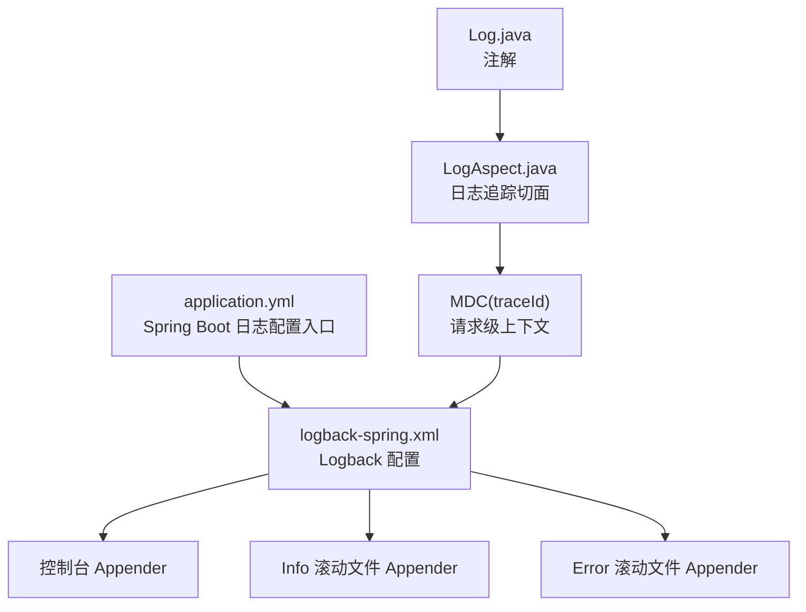
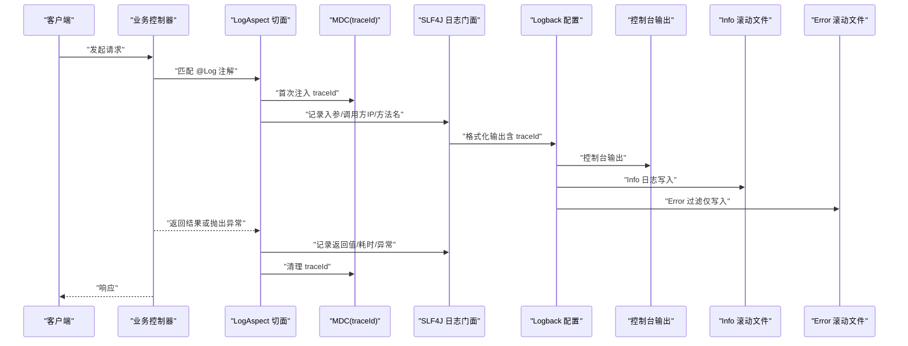
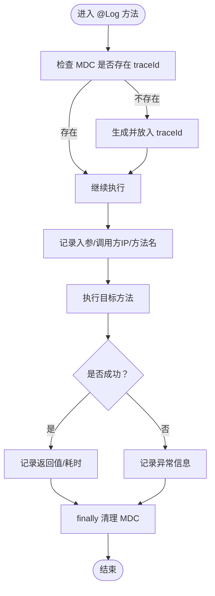
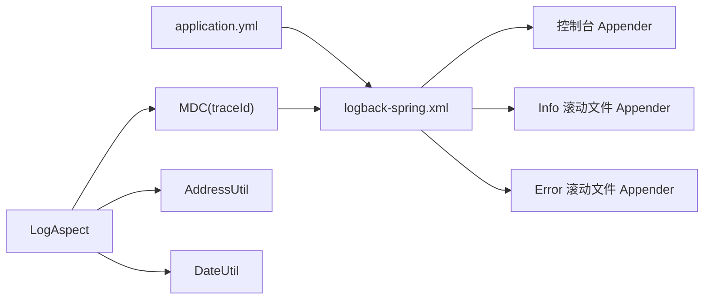

# 日志配置

<cite>
**本文引用的文件**
- [logback-spring.xml](file://src/main/resources/logback/logback-spring.xml)
- [application.yml](file://src/main/resources/application.yml)
- [LogAspect.java](file://src/main/java/com/dw/admin/components/log/LogAspect.java)
- [Log.java](file://src/main/java/com/dw/admin/components/log/Log.java)
- [DateUtil.java](file://src/main/java/com/dw/admin/common/utils/DateUtil.java)
- [AddressUtil.java](file://src/main/java/com/dw/admin/common/utils/AddressUtil.java)
- [pom.xml](file://pom.xml)
</cite>

## 目录
1. [简介](#简介)
2. [项目结构](#项目结构)
3. [核心组件](#核心组件)
4. [架构总览](#架构总览)
5. [详细组件分析](#详细组件分析)
6. [依赖关系分析](#依赖关系分析)
7. [性能考量](#性能考量)
8. [故障排查指南](#故障排查指南)
9. [结论](#结论)
10. [附录](#附录)

## 简介
本文件为日志配置系统的完整技术文档，聚焦于 Logback 配置文件的结构与参数、日志输出格式（时间戳、线程名、日志级别、TraceId 等）、滚动与归档策略（按大小与时间轮转）、不同环境下的配置差异与最佳实践、性能优化建议（异步日志、缓冲区设置等）、安全与敏感信息过滤策略，以及面向运维工程师的排障方法。文档基于仓库中实际实现进行说明，并提供可视化图示帮助理解。

## 项目结构
日志相关配置集中在以下位置：
- Logback 配置：src/main/resources/logback/logback-spring.xml
- Spring Boot 日志配置入口：src/main/resources/application.yml
- 日志追踪切面与注解：src/main/java/com/dw/admin/components/log/LogAspect.java、Log.java
- 工具类：DateUtil.java、AddressUtil.java
- 依赖声明：pom.xml

图表来源
- [application.yml](file://src/main/resources/application.yml#L27-L32)
- [logback-spring.xml](file://src/main/resources/logback/logback-spring.xml#L1-L72)
- [LogAspect.java](file://src/main/java/com/dw/admin/components/log/LogAspect.java#L34-L87)
- [Log.java](file://src/main/java/com/dw/admin/components/log/Log.java#L13-L18)

章节来源
- [application.yml](file://src/main/resources/application.yml#L27-L32)
- [logback-spring.xml](file://src/main/resources/logback/logback-spring.xml#L1-L72)

## 核心组件
- Logback 配置文件：定义日志根级别、输出目标（控制台、Info/错误文件）、编码器、滚动策略与归档上限。
- Spring Boot 日志配置入口：通过 application.yml 指定 Logback 配置文件路径，并设置特定包的日志级别。
- 日志追踪切面与注解：通过 AOP 在方法执行前后记录入参、返回值、耗时、异常；使用 MDC 注入 TraceId，使日志具备跨模块串联能力。
- 工具类：DateUtil 提供耗时计算；AddressUtil 提供客户端 IP 获取。

章节来源
- [logback-spring.xml](file://src/main/resources/logback/logback-spring.xml#L1-L72)
- [application.yml](file://src/main/resources/application.yml#L27-L32)
- [LogAspect.java](file://src/main/java/com/dw/admin/components/log/LogAspect.java#L34-L87)
- [Log.java](file://src/main/java/com/dw/admin/components/log/Log.java#L13-L18)
- [DateUtil.java](file://src/main/java/com/dw/admin/common/utils/DateUtil.java#L26-L28)
- [AddressUtil.java](file://src/main/java/com/dw/admin/common/utils/AddressUtil.java#L22-L68)

## 架构总览
下图展示了从请求进入应用到日志输出的关键流程，包括切面注入 TraceId、日志格式化、滚动与归档。

图表来源
- [LogAspect.java](file://src/main/java/com/dw/admin/components/log/LogAspect.java#L50-L87)
- [logback-spring.xml](file://src/main/resources/logback/logback-spring.xml#L7-L69)
- [application.yml](file://src/main/resources/application.yml#L27-L32)

## 详细组件分析

### 1) Logback 配置文件结构与参数
- 日志根级别：root 设置为 info，控制台输出 TRACE 及以上级别，Info 文件输出 info 及以上，Error 文件仅输出 ERROR。
- 输出格式：通过属性 LOG_PATTERN 定义，包含时间戳、线程名、TraceId、日志级别、Logger 名称与行号、消息内容。
- 控制台 Appender：控制台输出使用 PatternLayoutEncoder，字符集 UTF-8，阈值过滤 TRACE。
- Info 滚动文件 Appender：每日滚动，按大小与时间结合触发，最大单文件 1000MB，保留最近 10 天，总大小上限 3GB。
- Error 滚动文件 Appender：同 Info 的滚动策略，但通过 LevelFilter 仅接收 ERROR 级别。
- 归档命名：Info/ Error 按日期与序号编号，便于按天检索与压缩归档。

章节来源
- [logback-spring.xml](file://src/main/resources/logback/logback-spring.xml#L4-L7)
- [logback-spring.xml](file://src/main/resources/logback/logback-spring.xml#L10-L18)
- [logback-spring.xml](file://src/main/resources/logback/logback-spring.xml#L21-L38)
- [logback-spring.xml](file://src/main/resources/logback/logback-spring.xml#L41-L63)
- [logback-spring.xml](file://src/main/resources/logback/logback-spring.xml#L65-L69)

### 2) 日志输出格式字段解析
- 时间戳：使用 yyyy-MM-dd HH:mm:ss.SSS 格式，精确到毫秒。
- 线程名：使用 [%thread] 占位符，便于识别并发场景下的日志来源。
- TraceId：使用 [%X{traceId}] 占位符，与切面注入的 MDC 值一致，实现跨服务/模块链路追踪。
- 日志级别：%-5level，左对齐且固定宽度，便于快速识别严重程度。
- Logger 名称与行号：%logger{36}[%L]，限定长度并显示行号，便于定位源码位置。
- 消息内容：%msg%n，换行输出。

章节来源
- [logback-spring.xml](file://src/main/resources/logback/logback-spring.xml#L7)
- [LogAspect.java](file://src/main/java/com/dw/admin/components/log/LogAspect.java#L55-L58)

### 3) 滚动策略与归档机制
- 滚动类型：TimeBasedRollingPolicy，按自然日滚动。
- 触发策略：SizeAndTimeBasedFNATP，同时满足“按大小”和“按时间”条件触发。
- 文件命名：info.%d{yyyy-MM-dd}.%i.log、error.%d{yyyy-MM-dd}.%i.log，%i 表示同一日期内的序号。
- 保留策略：maxHistory=10，totalSizeCap=3GB，避免无限增长。
- 错误过滤：ERROR Appender 使用 LevelFilter，仅接受 ERROR 级别，减少磁盘占用。

章节来源
- [logback-spring.xml](file://src/main/resources/logback/logback-spring.xml#L27-L37)
- [logback-spring.xml](file://src/main/resources/logback/logback-spring.xml#L47-L63)

### 4) 日志追踪与切面集成
- 注解：@Log 标注在需要记录入参与返回值的方法或类上。
- 切面：LogAspect 在 Around 通知中：
  - 首次检测 MDC 中是否存在 traceId，不存在则生成并放入 MDC。
  - 记录入参、调用方 IP、方法名。
  - 执行目标方法后记录返回值与耗时；异常时记录异常信息。
  - 在 finally 中清理 MDC，确保线程复用时不泄漏。
- 调用耗时：使用 DateUtil.getUseTime(startTime) 计算耗时（秒）。
- 客户端 IP：AddressUtil.getRemoteIP() 支持 X-Forwarded-For、Proxy-Client-IP、WL-Proxy-Client-IP、HTTP_CLIENT_IP、HTTP_X_FORWARDED_FOR、REMOTE_ADDR 等头，必要时回退到本机 IP。

图表来源
- [LogAspect.java](file://src/main/java/com/dw/admin/components/log/LogAspect.java#L50-L87)
- [DateUtil.java](file://src/main/java/com/dw/admin/common/utils/DateUtil.java#L26-L28)
- [AddressUtil.java](file://src/main/java/com/dw/admin/common/utils/AddressUtil.java#L22-L68)

章节来源
- [Log.java](file://src/main/java/com/dw/admin/components/log/Log.java#L13-L18)
- [LogAspect.java](file://src/main/java/com/dw/admin/components/log/LogAspect.java#L34-L87)
- [DateUtil.java](file://src/main/java/com/dw/admin/common/utils/DateUtil.java#L26-L28)
- [AddressUtil.java](file://src/main/java/com/dw/admin/common/utils/AddressUtil.java#L22-L68)

### 5) Spring Boot 日志配置入口
- logging.config：指定 Logback 配置文件路径为 classpath:logback/logback-spring.xml。
- logging.level：为 com.dw.admin.dao 包设置 debug 级别，便于开发调试。

章节来源
- [application.yml](file://src/main/resources/application.yml#L27-L32)

### 6) 依赖与运行时环境
- Spring Boot 版本：3.5.6，Logback 作为默认日志实现。
- 依赖：spring-boot-starter-web、spring-boot-starter-aop、fastjson2、commons-lang3、hutool 等，支撑日志切面与工具类功能。

章节来源
- [pom.xml](file://pom.xml#L6-L11)
- [pom.xml](file://pom.xml#L25-L51)
- [pom.xml](file://pom.xml#L120-L143)

## 依赖关系分析
- LogAspect 依赖 MDC 注入 TraceId，与 Logback 的 [%X{traceId}] 占位符形成闭环。
- LogAspect 依赖 AddressUtil 获取调用方 IP，依赖 DateUtil 计算耗时。
- application.yml 将 Logback 配置文件路径注入 Spring Boot，决定最终生效的输出策略。
- Logback 配置文件定义了三个 Appender：控制台、Info 滚动文件、Error 滚动文件，分别对应不同的输出目标与过滤策略。

图表来源
- [application.yml](file://src/main/resources/application.yml#L27-L32)
- [logback-spring.xml](file://src/main/resources/logback/logback-spring.xml#L1-L72)
- [LogAspect.java](file://src/main/java/com/dw/admin/components/log/LogAspect.java#L34-L87)
- [AddressUtil.java](file://src/main/java/com/dw/admin/common/utils/AddressUtil.java#L22-L68)
- [DateUtil.java](file://src/main/java/com/dw/admin/common/utils/DateUtil.java#L26-L28)

章节来源
- [application.yml](file://src/main/resources/application.yml#L27-L32)
- [logback-spring.xml](file://src/main/resources/logback/logback-spring.xml#L1-L72)
- [LogAspect.java](file://src/main/java/com/dw/admin/components/log/LogAspect.java#L34-L87)

## 性能考量
- 当前配置已具备良好的滚动与归档限制（单文件最大 1000MB、保留 10 天、总大小 3GB），可有效控制磁盘占用。
- 若需进一步提升吞吐量，可在生产环境考虑引入异步日志 Appender（如 AsyncAppender），将日志事件投递至队列，降低阻塞风险。
- 编码器与字符集：当前使用 UTF-8，保证多语言输出一致性。
- 过滤策略：控制台使用 ThresholdFilter，Info 使用默认过滤，Error 使用 LevelFilter，减少不必要的 IO。
- 建议：
  - 对高频接口开启 @Log 注解，避免对所有接口都记录入参/返回值。
  - 在高并发场景下，优先使用 TraceId 串联日志，减少全量日志带来的开销。
  - 结合业务峰值，评估 maxFileSize、maxHistory、totalSizeCap 参数，必要时按环境调整。

[本节为通用性能建议，不直接分析具体文件]

## 故障排查指南
- 现象：日志未输出 TraceId
  - 排查：确认 Logback 配置中包含 [%X{traceId}] 占位符；确认 @Log 注解正确标注；确认 LogAspect 正常加载。
  - 参考：占位符定义、MDC 注入逻辑、注解使用。
- 现象：Info/ Error 文件未生成或数量异常
  - 排查：确认 rollingPolicy 的 fileNamePattern、maxFileSize、maxHistory、totalSizeCap 设置；检查目录权限与磁盘空间。
  - 参考：Info/ Error Appender 配置。
- 现象：控制台无输出或级别不符
  - 排查：确认 root 级别与 Console Appender 的 ThresholdFilter 级别；确认 application.yml 指向正确的 Logback 配置。
  - 参考：根级别与过滤器配置。
- 现象：耗时统计异常或 IP 显示为 unknown
  - 排查：确认 DateUtil.getUseTime(startTime) 的调用时机；确认 AddressUtil.getRemoteIP() 的请求头是否正确传递。
  - 参考：耗时计算与 IP 获取逻辑。
- 现象：日志级别不生效
  - 排查：确认 application.yml 中 logging.level 的包名与实际包一致；确认未被其他配置覆盖。
  - 参考：日志级别配置。

章节来源
- [logback-spring.xml](file://src/main/resources/logback/logback-spring.xml#L7)
- [logback-spring.xml](file://src/main/resources/logback/logback-spring.xml#L15-L17)
- [logback-spring.xml](file://src/main/resources/logback/logback-spring.xml#L27-L37)
- [logback-spring.xml](file://src/main/resources/logback/logback-spring.xml#L47-L63)
- [application.yml](file://src/main/resources/application.yml#L27-L32)
- [LogAspect.java](file://src/main/java/com/dw/admin/components/log/LogAspect.java#L50-L87)
- [AddressUtil.java](file://src/main/java/com/dw/admin/common/utils/AddressUtil.java#L22-L68)
- [DateUtil.java](file://src/main/java/com/dw/admin/common/utils/DateUtil.java#L26-L28)

## 结论
本项目的日志体系以 Logback 为核心，结合 Spring Boot 的配置入口与 AOP 切面，实现了统一的输出格式、完善的滚动与归档策略、以及基于 TraceId 的链路追踪能力。通过合理的过滤与归档参数，能够在保证可观测性的同时控制磁盘占用。建议在生产环境中根据业务流量与合规要求，进一步优化异步日志与敏感信息过滤策略，并持续监控日志健康度与磁盘使用情况。

[本节为总结性内容，不直接分析具体文件]

## 附录

### A. 不同环境下的配置差异与最佳实践
- 开发环境（dev）：logging.level 可设为 debug 或 trace，便于问题定位；Info/ Error 滚动参数可适当放宽，便于收集更多上下文。
- 测试环境（test）：与 dev 类似，但建议开启 @Log 注解的范围更小，避免日志风暴。
- 生产环境（prod）：root 级别建议保持 info；严格控制 Info/ Error 的滚动参数；谨慎开启 @Log 注解；必要时启用异步日志 Appender；定期巡检磁盘与日志体积。

[本节为通用实践建议，不直接分析具体文件]

### B. 日志安全与敏感信息过滤策略
- 敏感字段脱敏：在记录入参/返回值前，对密码、令牌、身份证号、手机号等进行脱敏处理后再输出。
- IP 与用户标识：仅记录必要的 IP 段或匿名化后的标识，避免泄露真实身份。
- 日志最小化原则：仅记录必要的上下文信息，避免将大体量数据写入日志。
- 审计与合规：对关键操作日志进行单独落盘与备份，满足审计要求。

[本节为通用安全建议，不直接分析具体文件]