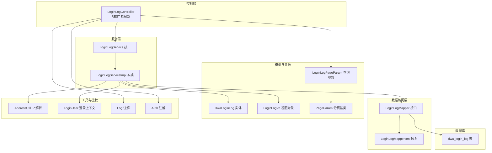
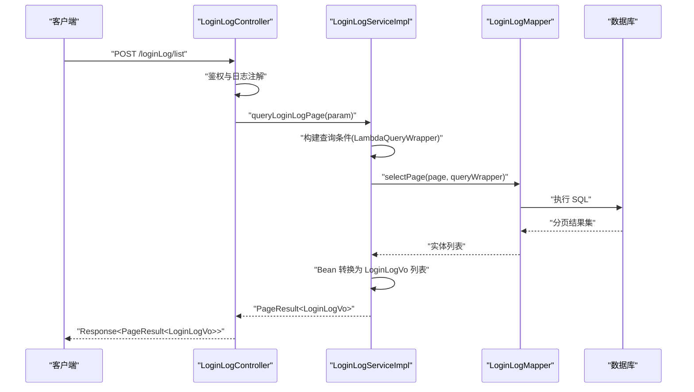
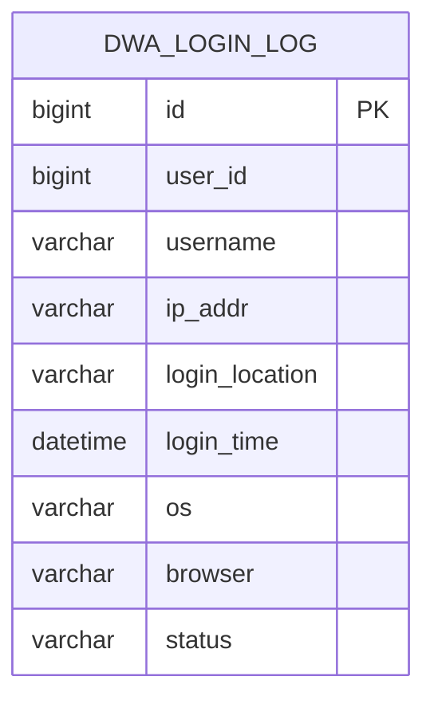
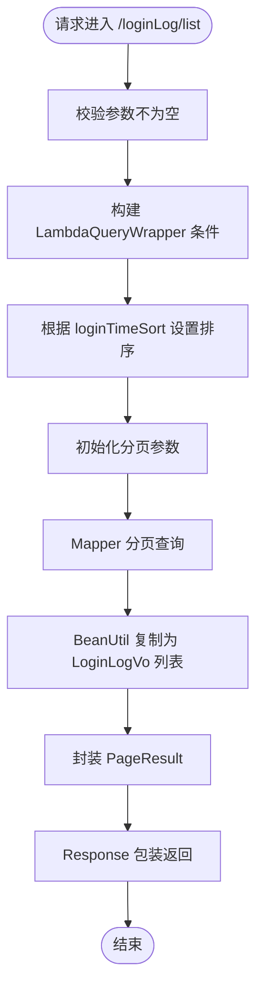
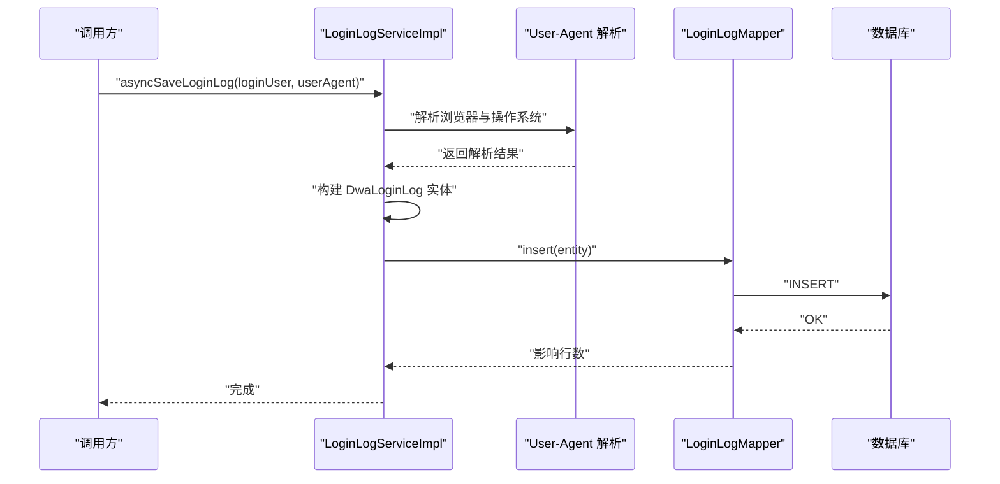
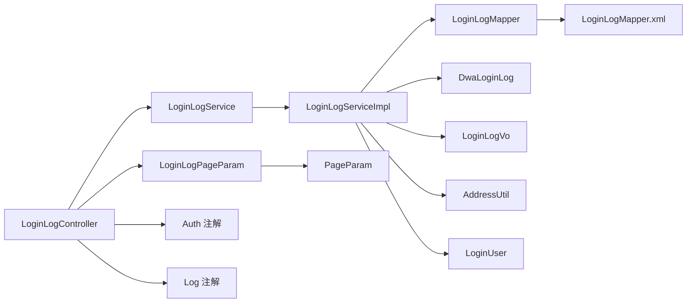
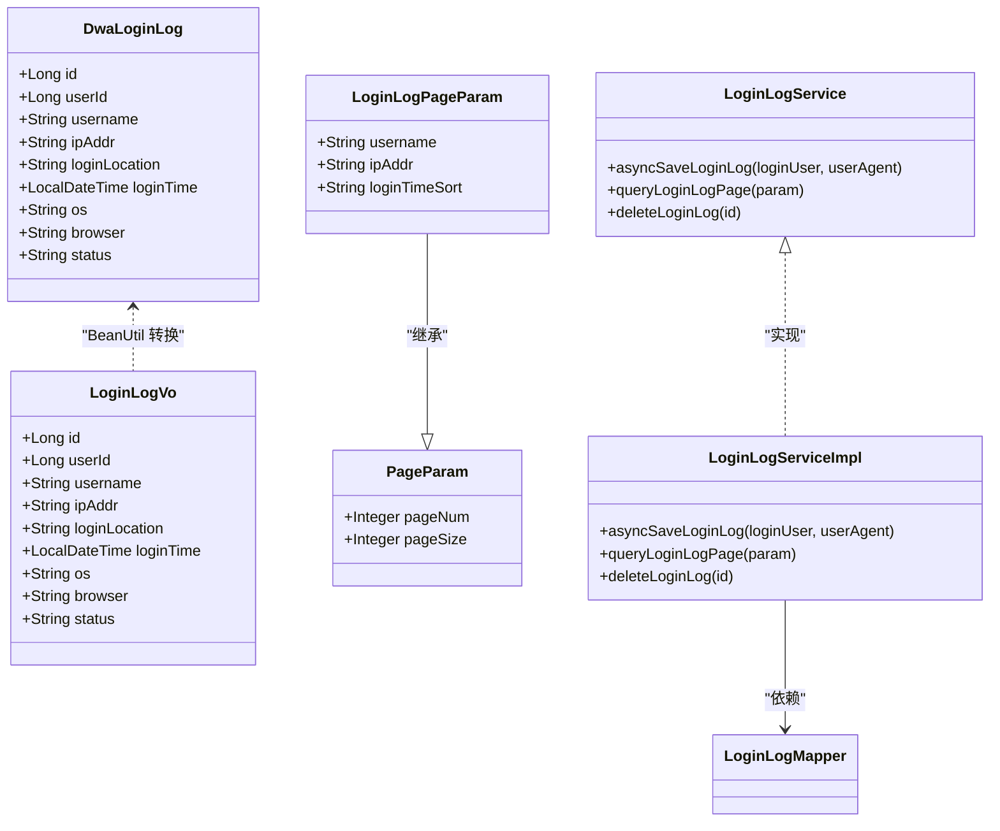

# 登录日志

<cite>
**本文引用的文件**
- [DwaLoginLog.java](file://src/main/java/com/dw/admin/model/entity/DwaLoginLog.java)
- [LoginLogController.java](file://src/main/java/com/dw/admin/controller/LoginLogController.java)
- [LoginLogServiceImpl.java](file://src/main/java/com/dw/admin/service/impl/LoginLogServiceImpl.java)
- [LoginLogService.java](file://src/main/java/com/dw/admin/service/LoginLogService.java)
- [LoginLogPageParam.java](file://src/main/java/com/dw/admin/model/param/LoginLogPageParam.java)
- [LoginLogVo.java](file://src/main/java/com/dw/admin/model/vo/LoginLogVo.java)
- [LoginLogMapper.java](file://src/main/java/com/dw/admin/dao/LoginLogMapper.java)
- [LoginLogMapper.xml](file://src/main/resources/mapper/LoginLogMapper.xml)
- [PageParam.java](file://src/main/java/com/dw/admin/common/entity/PageParam.java)
- [SortEnum.java](file://src/main/java/com/dw/admin/common/enums/SortEnum.java)
- [AddressUtil.java](file://src/main/java/com/dw/admin/common/utils/AddressUtil.java)
- [LoginUser.java](file://src/main/java/com/dw/admin/components/auth/LoginUser.java)
- [Log.java](file://src/main/java/com/dw/admin/components/log/Log.java)
- [Auth.java](file://src/main/java/com/dw/admin/components/auth/Auth.java)
- [init_ddl.sql](file://docs/sql/init_ddl.sql)
</cite>

## 目录
1. [简介](#简介)
2. [项目结构](#项目结构)
3. [核心组件](#核心组件)
4. [架构总览](#架构总览)
5. [详细组件分析](#详细组件分析)
6. [依赖关系分析](#依赖关系分析)
7. [性能考量](#性能考量)
8. [故障排查指南](#故障排查指南)
9. [结论](#结论)
10. [附录](#附录)

## 简介
本技术文档围绕登录日志功能进行系统性说明，涵盖数据模型设计、RESTful API 设计与实现、服务层逻辑、异步记录策略、分页查询与响应封装、以及在审计与安全分析中的应用场景。目标读者包括后端开发、运维与安全团队，帮助快速理解与使用登录日志能力。

## 项目结构
登录日志相关代码按“控制层-服务层-数据访问层-模型与参数-工具与配置”分层组织，采用 Spring Boot + MyBatis-Plus 架构，遵循清晰的职责划分与可扩展设计。

图表来源
- [LoginLogController.java](file://src/main/java/com/dw/admin/controller/LoginLogController.java#L20-L50)
- [LoginLogService.java](file://src/main/java/com/dw/admin/service/LoginLogService.java#L16-L32)
- [LoginLogServiceImpl.java](file://src/main/java/com/dw/admin/service/impl/LoginLogServiceImpl.java#L34-L124)
- [LoginLogMapper.java](file://src/main/java/com/dw/admin/dao/LoginLogMapper.java#L15-L17)
- [LoginLogMapper.xml](file://src/main/resources/mapper/LoginLogMapper.xml#L3-L23)
- [DwaLoginLog.java](file://src/main/java/com/dw/admin/model/entity/DwaLoginLog.java#L27-L79)
- [LoginLogVo.java](file://src/main/java/com/dw/admin/model/vo/LoginLogVo.java#L18-L71)
- [LoginLogPageParam.java](file://src/main/java/com/dw/admin/model/param/LoginLogPageParam.java#L17-L35)
- [PageParam.java](file://src/main/java/com/dw/admin/common/entity/PageParam.java#L18-L43)
- [AddressUtil.java](file://src/main/java/com/dw/admin/common/utils/AddressUtil.java#L22-L68)
- [LoginUser.java](file://src/main/java/com/dw/admin/components/auth/LoginUser.java#L21-L47)
- [Log.java](file://src/main/java/com/dw/admin/components/log/Log.java#L13-L18)
- [Auth.java](file://src/main/java/com/dw/admin/components/auth/Auth.java#L11-L16)
- [init_ddl.sql](file://docs/sql/init_ddl.sql#L75-L87)

章节来源
- [LoginLogController.java](file://src/main/java/com/dw/admin/controller/LoginLogController.java#L20-L50)
- [LoginLogService.java](file://src/main/java/com/dw/admin/service/LoginLogService.java#L16-L32)
- [LoginLogServiceImpl.java](file://src/main/java/com/dw/admin/service/impl/LoginLogServiceImpl.java#L34-L124)
- [LoginLogMapper.java](file://src/main/java/com/dw/admin/dao/LoginLogMapper.java#L15-L17)
- [LoginLogMapper.xml](file://src/main/resources/mapper/LoginLogMapper.xml#L3-L23)
- [DwaLoginLog.java](file://src/main/java/com/dw/admin/model/entity/DwaLoginLog.java#L27-L79)
- [LoginLogVo.java](file://src/main/java/com/dw/admin/model/vo/LoginLogVo.java#L18-L71)
- [LoginLogPageParam.java](file://src/main/java/com/dw/admin/model/param/LoginLogPageParam.java#L17-L35)
- [PageParam.java](file://src/main/java/com/dw/admin/common/entity/PageParam.java#L18-L43)
- [AddressUtil.java](file://src/main/java/com/dw/admin/common/utils/AddressUtil.java#L22-L68)
- [LoginUser.java](file://src/main/java/com/dw/admin/components/auth/LoginUser.java#L21-L47)
- [Log.java](file://src/main/java/com/dw/admin/components/log/Log.java#L13-L18)
- [Auth.java](file://src/main/java/com/dw/admin/components/auth/Auth.java#L11-L16)
- [init_ddl.sql](file://docs/sql/init_ddl.sql#L75-L87)

## 核心组件
- 数据模型与映射
  - DwaLoginLog：登录日志实体，包含主键、用户标识、用户名、登录 IP、归属地、登录时间、操作系统、浏览器、登录状态等字段。
  - LoginLogVo：前端返回视图对象，用于序列化输出，包含与实体一致的关键字段。
  - LoginLogMapper + LoginLogMapper.xml：MyBatis-Plus Mapper 接口与 XML 结果映射，负责通用查询列与实体映射。
- 查询参数与分页
  - LoginLogPageParam：继承 PageParam，新增 username、ipAddr、loginTimeSort 三个查询条件。
  - PageParam：统一分页参数基类，包含 pageNum、pageSize 与泛型 param。
  - SortEnum：排序枚举，支持 asc、desc。
- 控制层与服务层
  - LoginLogController：提供“登录日志列表查询”和“删除日志”两个接口，均标注鉴权与日志追踪注解。
  - LoginLogService：定义异步保存、分页查询、删除等服务契约。
  - LoginLogServiceImpl：实现异步保存登录日志、基于条件的分页查询、删除操作，内部解析 UA 提取浏览器与操作系统信息。
- 工具与上下文
  - AddressUtil：解析请求真实 IP，兼容多级代理头。
  - LoginUser：登录上下文对象，包含用户标识、用户名、登录 IP 等。
  - Log、Auth：横切注解，分别用于接口日志与鉴权校验。

章节来源
- [DwaLoginLog.java](file://src/main/java/com/dw/admin/model/entity/DwaLoginLog.java#L27-L79)
- [LoginLogVo.java](file://src/main/java/com/dw/admin/model/vo/LoginLogVo.java#L18-L71)
- [LoginLogMapper.java](file://src/main/java/com/dw/admin/dao/LoginLogMapper.java#L15-L17)
- [LoginLogMapper.xml](file://src/main/resources/mapper/LoginLogMapper.xml#L3-L23)
- [LoginLogPageParam.java](file://src/main/java/com/dw/admin/model/param/LoginLogPageParam.java#L17-L35)
- [PageParam.java](file://src/main/java/com/dw/admin/common/entity/PageParam.java#L18-L43)
- [SortEnum.java](file://src/main/java/com/dw/admin/common/enums/SortEnum.java#L8-L30)
- [LoginLogController.java](file://src/main/java/com/dw/admin/controller/LoginLogController.java#L20-L50)
- [LoginLogService.java](file://src/main/java/com/dw/admin/service/LoginLogService.java#L16-L32)
- [LoginLogServiceImpl.java](file://src/main/java/com/dw/admin/service/impl/LoginLogServiceImpl.java#L34-L124)
- [AddressUtil.java](file://src/main/java/com/dw/admin/common/utils/AddressUtil.java#L22-L68)
- [LoginUser.java](file://src/main/java/com/dw/admin/components/auth/LoginUser.java#L21-L47)
- [Log.java](file://src/main/java/com/dw/admin/components/log/Log.java#L13-L18)
- [Auth.java](file://src/main/java/com/dw/admin/components/auth/Auth.java#L11-L16)

## 架构总览
登录日志功能采用典型的 MVC + 分层架构，控制层负责接收请求与返回响应，服务层负责业务编排与持久化，数据访问层通过 MyBatis-Plus 完成数据库交互。异步记录策略避免阻塞登录主流程，提升用户体验与系统吞吐。

图表来源
- [LoginLogController.java](file://src/main/java/com/dw/admin/controller/LoginLogController.java#L31-L37)
- [LoginLogServiceImpl.java](file://src/main/java/com/dw/admin/service/impl/LoginLogServiceImpl.java#L89-L112)
- [LoginLogMapper.java](file://src/main/java/com/dw/admin/dao/LoginLogMapper.java#L15-L17)
- [LoginLogMapper.xml](file://src/main/resources/mapper/LoginLogMapper.xml#L3-L23)

## 详细组件分析

### 数据模型设计与业务含义
- 字段定义与业务含义
  - id：主键，自增或雪花 ID（由注解指定），用于唯一标识每条登录记录。
  - userId：登录用户标识，便于关联用户行为分析。
  - username：登录用户名，支持模糊查询。
  - ipAddr：登录 IP 地址，支持模糊查询。
  - loginLocation：登录 IP 归属地，当前实现为空字符串占位，后续可接入地理库完善。
  - loginTime：登录时间，支持按升序/降序排序。
  - os：操作系统信息，来源于 User-Agent 解析。
  - browser：浏览器信息，来源于 User-Agent 解析。
  - status：登录状态，当前实现固定为“success”，后续可扩展“fail”等状态。
- 映射与约束
  - 表结构定义位于初始化脚本中，包含主键、非空约束与注释说明，确保数据完整性与可读性。
  - MyBatis-Plus 的 resultMap 将数据库列与实体属性一一映射，保证查询一致性。

图表来源
- [DwaLoginLog.java](file://src/main/java/com/dw/admin/model/entity/DwaLoginLog.java#L27-L79)
- [init_ddl.sql](file://docs/sql/init_ddl.sql#L75-L87)

章节来源
- [DwaLoginLog.java](file://src/main/java/com/dw/admin/model/entity/DwaLoginLog.java#L27-L79)
- [init_ddl.sql](file://docs/sql/init_ddl.sql#L75-L87)

### RESTful API 接口设计
- 接口概览
  - 列表查询：POST /loginLog/list
    - 请求体：LoginLogPageParam（包含分页参数与查询条件）
    - 返回：Response<PageResult<LoginLogVo>>
  - 删除日志：DELETE /loginLog/delete/{id}
    - 路径参数：id（字符串类型）
    - 返回：Response<Void>
- 查询参数与分页
  - LoginLogPageParam 继承 PageParam，支持 pageNum、pageSize 与 param 组合。
  - 支持 username、ipAddr 的模糊匹配，loginTimeSort 支持 asc/desc 排序。
- 响应格式
  - 统一包装 Response<T>，PageResult 封装分页信息（当前页、每页条数、总数、数据列表）。
- 鉴权与日志
  - 控制器方法标注 @Auth 与 @Log，实现访问鉴权与接口日志追踪。

图表来源
- [LoginLogController.java](file://src/main/java/com/dw/admin/controller/LoginLogController.java#L31-L37)
- [LoginLogServiceImpl.java](file://src/main/java/com/dw/admin/service/impl/LoginLogServiceImpl.java#L89-L112)
- [LoginLogPageParam.java](file://src/main/java/com/dw/admin/model/param/LoginLogPageParam.java#L17-L35)
- [PageParam.java](file://src/main/java/com/dw/admin/common/entity/PageParam.java#L18-L43)

章节来源
- [LoginLogController.java](file://src/main/java/com/dw/admin/controller/LoginLogController.java#L20-L50)
- [LoginLogServiceImpl.java](file://src/main/java/com/dw/admin/service/impl/LoginLogServiceImpl.java#L89-L112)
- [LoginLogPageParam.java](file://src/main/java/com/dw/admin/model/param/LoginLogPageParam.java#L17-L35)
- [PageParam.java](file://src/main/java/com/dw/admin/common/entity/PageParam.java#L18-L43)

### 服务实现逻辑
- 异步保存登录日志
  - 入参：LoginUser、userAgent 字符串
  - 处理流程：解析 UA 提取浏览器与操作系统；构造 DwaLoginLog 实体；插入数据库；异常捕获与日志记录。
  - 关键点：使用 @Async 异步执行，避免阻塞登录主链路；status 固定为“success”。
- 分页查询
  - 构建条件：username、ipAddr 模糊匹配；按 loginTimeSort 设置升/降序。
  - 分页：基于 PageParam 初始化 Page 对象，调用 selectPage 执行分页查询。
  - 结果转换：将实体列表复制为 LoginLogVo 列表，封装 PageResult。
- 删除日志
  - 校验 id 非空；调用 Mapper 删除并返回影响行数。

图表来源
- [LoginLogServiceImpl.java](file://src/main/java/com/dw/admin/service/impl/LoginLogServiceImpl.java#L48-L84)
- [LoginLogMapper.java](file://src/main/java/com/dw/admin/dao/LoginLogMapper.java#L15-L17)

章节来源
- [LoginLogServiceImpl.java](file://src/main/java/com/dw/admin/service/impl/LoginLogServiceImpl.java#L34-L124)
- [LoginLogMapper.java](file://src/main/java/com/dw/admin/dao/LoginLogMapper.java#L15-L17)

### 登录日志记录内容与策略
- 记录内容
  - 用户标识与名称：来自 LoginUser
  - 登录 IP：来自 LoginUser 或 AddressUtil 解析
  - 归属地：当前为空字符串，建议接入地理库或 IP 库完善
  - 登录时间：当前时间
  - 操作系统与浏览器：来自 User-Agent 解析
  - 登录状态：当前固定为“success”
- 记录策略
  - 异步写入：避免阻塞登录主流程，提高响应速度
  - 异常兜底：捕获异常并记录错误日志，保障系统稳定性
  - 参数校验：对空参数进行校验，防止无效查询

章节来源
- [LoginLogServiceImpl.java](file://src/main/java/com/dw/admin/service/impl/LoginLogServiceImpl.java#L48-L84)
- [AddressUtil.java](file://src/main/java/com/dw/admin/common/utils/AddressUtil.java#L22-L68)
- [LoginUser.java](file://src/main/java/com/dw/admin/components/auth/LoginUser.java#L21-L47)

### 查询与分页实现细节
- 查询条件
  - username：模糊匹配
  - ipAddr：模糊匹配
  - loginTimeSort：支持 asc/desc
- 分页处理
  - PageParam 提供默认 pageNum=1、pageSize=10，并允许设置为 0 获取全部（需在服务层判断）
  - MyBatis-Plus Page 对象承载分页参数，Mapper 自动拼接分页 SQL
- 结果封装
  - BeanUtil.copyToList 将实体列表转换为 VO 列表
  - PageResult.build 封装分页元信息

章节来源
- [LoginLogServiceImpl.java](file://src/main/java/com/dw/admin/service/impl/LoginLogServiceImpl.java#L89-L112)
- [LoginLogPageParam.java](file://src/main/java/com/dw/admin/model/param/LoginLogPageParam.java#L17-L35)
- [PageParam.java](file://src/main/java/com/dw/admin/common/entity/PageParam.java#L18-L43)

### 登录审计与安全分析应用场景
- 登录审计
  - 用户行为轨迹：结合 userId、username、ipAddr、loginTime、os、browser 追踪用户登录路径
  - 异常登录检测：对短时间内多地点登录、异常浏览器/系统组合进行告警
- 安全分析
  - 黑名单联动：对高风险 IP 或地区进行限制
  - 登录趋势分析：统计每日登录次数、活跃用户分布
  - 合规留存：满足审计要求的日志保留周期与查询能力

[本节为概念性说明，无需列出具体文件来源]

## 依赖关系分析
- 控制层依赖服务层接口，服务层依赖 Mapper 与工具类
- 实体与 VO 保持字段一致性，便于转换
- 查询参数继承分页基类，复用分页能力
- 注解驱动的鉴权与日志增强横切关注点

图表来源
- [LoginLogController.java](file://src/main/java/com/dw/admin/controller/LoginLogController.java#L20-L50)
- [LoginLogService.java](file://src/main/java/com/dw/admin/service/LoginLogService.java#L16-L32)
- [LoginLogServiceImpl.java](file://src/main/java/com/dw/admin/service/impl/LoginLogServiceImpl.java#L34-L124)
- [LoginLogMapper.java](file://src/main/java/com/dw/admin/dao/LoginLogMapper.java#L15-L17)
- [LoginLogMapper.xml](file://src/main/resources/mapper/LoginLogMapper.xml#L3-L23)
- [DwaLoginLog.java](file://src/main/java/com/dw/admin/model/entity/DwaLoginLog.java#L27-L79)
- [LoginLogVo.java](file://src/main/java/com/dw/admin/model/vo/LoginLogVo.java#L18-L71)
- [LoginLogPageParam.java](file://src/main/java/com/dw/admin/model/param/LoginLogPageParam.java#L17-L35)
- [PageParam.java](file://src/main/java/com/dw/admin/common/entity/PageParam.java#L18-L43)
- [AddressUtil.java](file://src/main/java/com/dw/admin/common/utils/AddressUtil.java#L22-L68)
- [LoginUser.java](file://src/main/java/com/dw/admin/components/auth/LoginUser.java#L21-L47)
- [Log.java](file://src/main/java/com/dw/admin/components/log/Log.java#L13-L18)
- [Auth.java](file://src/main/java/com/dw/admin/components/auth/Auth.java#L11-L16)

章节来源
- [LoginLogController.java](file://src/main/java/com/dw/admin/controller/LoginLogController.java#L20-L50)
- [LoginLogService.java](file://src/main/java/com/dw/admin/service/LoginLogService.java#L16-L32)
- [LoginLogServiceImpl.java](file://src/main/java/com/dw/admin/service/impl/LoginLogServiceImpl.java#L34-L124)
- [LoginLogMapper.java](file://src/main/java/com/dw/admin/dao/LoginLogMapper.java#L15-L17)
- [LoginLogMapper.xml](file://src/main/resources/mapper/LoginLogMapper.xml#L3-L23)
- [DwaLoginLog.java](file://src/main/java/com/dw/admin/model/entity/DwaLoginLog.java#L27-L79)
- [LoginLogVo.java](file://src/main/java/com/dw/admin/model/vo/LoginLogVo.java#L18-L71)
- [LoginLogPageParam.java](file://src/main/java/com/dw/admin/model/param/LoginLogPageParam.java#L17-L35)
- [PageParam.java](file://src/main/java/com/dw/admin/common/entity/PageParam.java#L18-L43)
- [AddressUtil.java](file://src/main/java/com/dw/admin/common/utils/AddressUtil.java#L22-L68)
- [LoginUser.java](file://src/main/java/com/dw/admin/components/auth/LoginUser.java#L21-L47)
- [Log.java](file://src/main/java/com/dw/admin/components/log/Log.java#L13-L18)
- [Auth.java](file://src/main/java/com/dw/admin/components/auth/Auth.java#L11-L16)

## 性能考量
- 异步写入：登录日志异步保存，降低主流程延迟，提升并发能力
- 分页查询：合理设置 pageNum/pageSize，避免一次性加载过多数据
- 索引建议：针对 username、ipAddr、loginTime 建立合适索引，加速模糊查询与排序
- 缓存策略：对热点查询结果进行短期缓存，减少数据库压力
- 日志清理：制定日志保留策略与定期清理任务，控制表规模增长

[本节提供一般性指导，无需列出具体文件来源]

## 故障排查指南
- 接口无返回或报错
  - 检查是否正确传递 LoginLogPageParam，确认 pageNum/pageSize 合法
  - 查看服务层异常日志，定位数据库或解析 UA 失败问题
- IP 解析异常
  - 确认请求头是否包含正确的代理头，必要时检查网关/负载均衡配置
- 登录日志未入库
  - 检查异步线程池配置与权限，确认 @Async 生效
  - 核对实体字段与数据库列映射是否一致
- 删除失败
  - 确认传入 id 是否为空或格式错误

章节来源
- [LoginLogServiceImpl.java](file://src/main/java/com/dw/admin/service/impl/LoginLogServiceImpl.java#L89-L124)
- [AddressUtil.java](file://src/main/java/com/dw/admin/common/utils/AddressUtil.java#L22-L68)

## 结论
登录日志模块以清晰的分层设计与注解增强实现了完整的登录审计能力。通过异步记录、灵活分页与统一响应包装，既满足了日常运营审计需求，也为安全分析提供了可靠的数据基础。建议后续完善地理归属地解析、登录状态扩展与索引优化，持续提升可用性与性能。

[本节为总结性内容，无需列出具体文件来源]

## 附录
- 数据库初始化脚本位置：docs/sql/init_ddl.sql
- 关键类关系图

图表来源
- [DwaLoginLog.java](file://src/main/java/com/dw/admin/model/entity/DwaLoginLog.java#L27-L79)
- [LoginLogVo.java](file://src/main/java/com/dw/admin/model/vo/LoginLogVo.java#L18-L71)
- [LoginLogPageParam.java](file://src/main/java/com/dw/admin/model/param/LoginLogPageParam.java#L17-L35)
- [PageParam.java](file://src/main/java/com/dw/admin/common/entity/PageParam.java#L18-L43)
- [LoginLogMapper.java](file://src/main/java/com/dw/admin/dao/LoginLogMapper.java#L15-L17)
- [LoginLogService.java](file://src/main/java/com/dw/admin/service/LoginLogService.java#L16-L32)
- [LoginLogServiceImpl.java](file://src/main/java/com/dw/admin/service/impl/LoginLogServiceImpl.java#L34-L124)