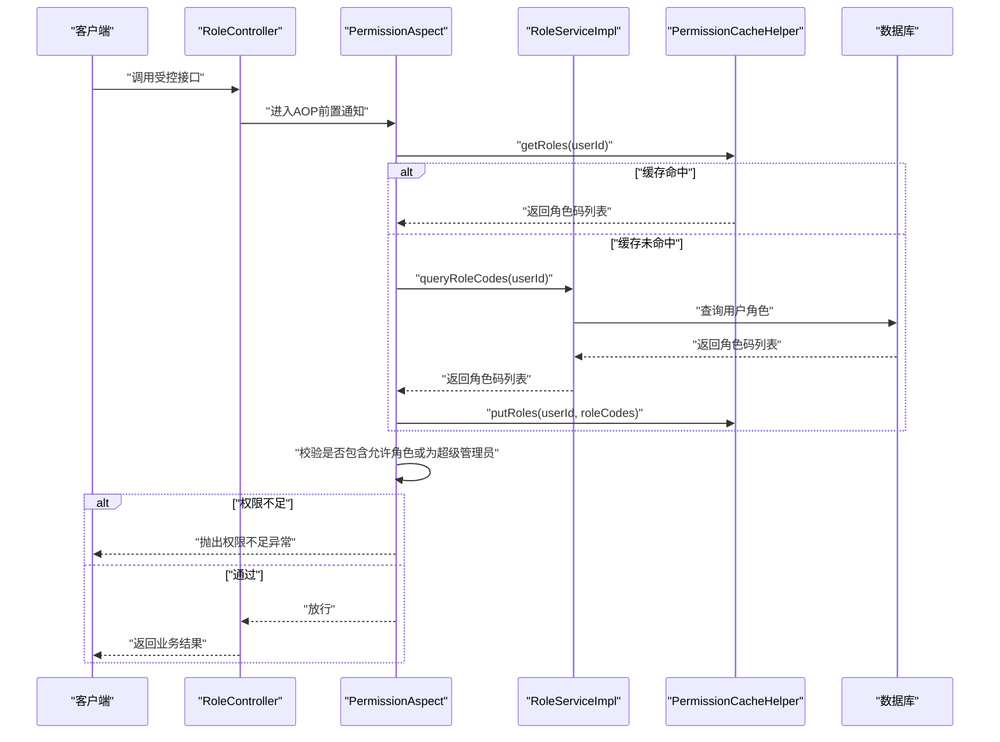
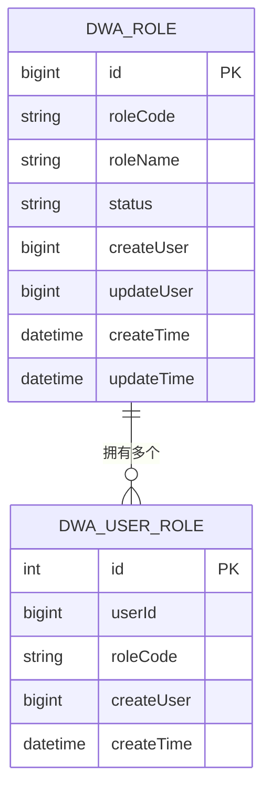
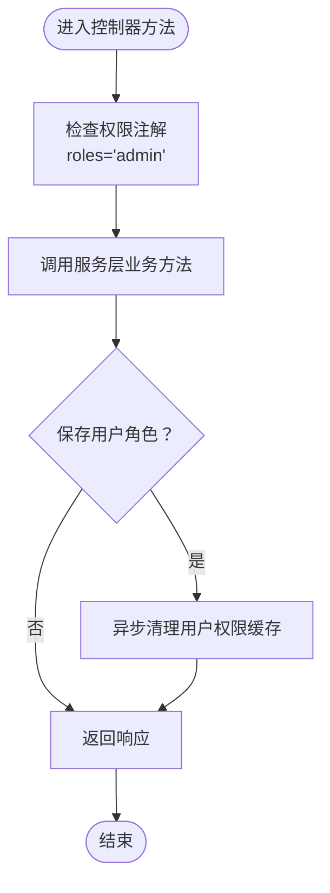
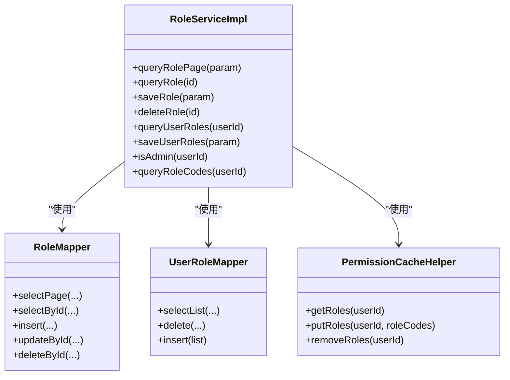
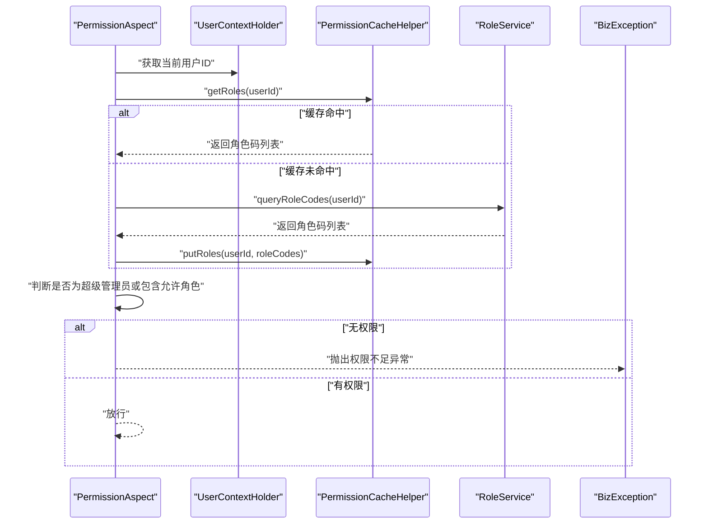
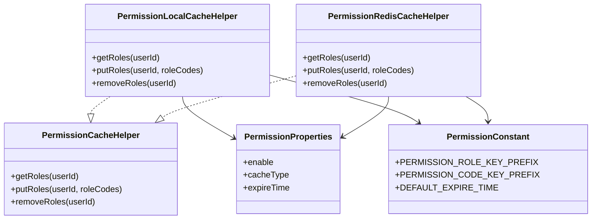
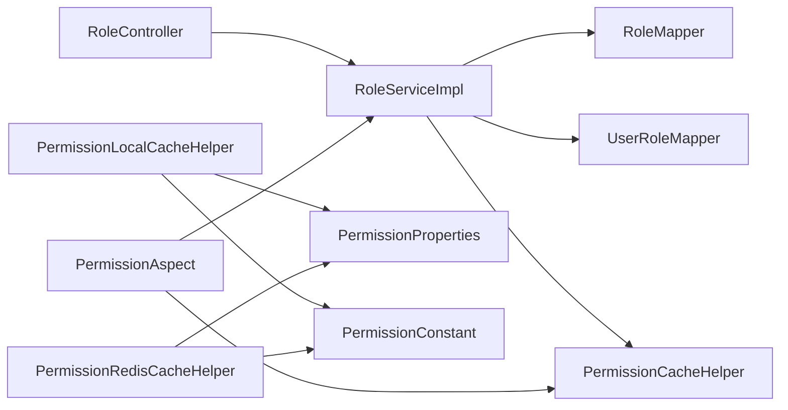

# 权限管理模块

<cite>
**本文引用的文件**
- [DwaRole.java](file://src/main/java/com/dw/admin/model/entity/DwaRole.java)
- [DwaUserRole.java](file://src/main/java/com/dw/admin/model/entity/DwaUserRole.java)
- [RoleController.java](file://src/main/java/com/dw/admin/controller/RoleController.java)
- [RoleServiceImpl.java](file://src/main/java/com/dw/admin/service/impl/RoleServiceImpl.java)
- [RoleMapper.java](file://src/main/java/com/dw/admin/dao/RoleMapper.java)
- [UserRoleMapper.java](file://src/main/java/com/dw/admin/dao/UserRoleMapper.java)
- [Permission.java](file://src/main/java/com/dw/admin/components/permission/Permission.java)
- [PermissionAspect.java](file://src/main/java/com/dw/admin/components/permission/PermissionAspect.java)
- [PermissionCacheHelper.java](file://src/main/java/com/dw/admin/components/permission/PermissionCacheHelper.java)
- [PermissionLocalCacheHelper.java](file://src/main/java/com/dw/admin/components/permission/PermissionLocalCacheHelper.java)
- [PermissionRedisCacheHelper.java](file://src/main/java/com/dw/admin/components/permission/PermissionRedisCacheHelper.java)
- [PermissionProperties.java](file://src/main/java/com/dw/admin/components/permission/PermissionProperties.java)
- [PermissionConstant.java](file://src/main/java/com/dw/admin/components/permission/PermissionConstant.java)
- [RolesEnum.java](file://src/main/java/com/dw/admin/common/enums/RolesEnum.java)
</cite>

## 目录
1. [简介](#简介)
2. [项目结构](#项目结构)
3. [核心组件](#核心组件)
4. [架构总览](#架构总览)
5. [详细组件分析](#详细组件分析)
6. [依赖关系分析](#依赖关系分析)
7. [性能考量](#性能考量)
8. [故障排查指南](#故障排查指南)
9. [结论](#结论)
10. [附录](#附录)

## 简介
本技术文档围绕权限管理模块展开，系统性阐述角色实体模型与权限体系设计、角色控制器的API实现（含角色CRUD与用户角色绑定）、权限服务层的业务逻辑（权限计算、缓存策略、权限验证机制）、权限注解与AOP切面工作原理、角色枚举与权限常量的使用方式，并提供权限配置最佳实践与安全注意事项。文档同时分析权限继承与权限组合的实现细节，以及权限缓存对性能的影响与优化策略，旨在为系统管理员与开发者提供一份完整的权限管理指南。

## 项目结构
权限管理模块主要由以下层次构成：
- 控制器层：对外暴露角色管理与用户角色绑定的REST接口
- 服务层：封装角色与用户角色的业务逻辑，负责权限缓存清理与角色码查询
- 数据访问层：MyBatis-Plus Mapper接口，映射角色与用户角色关联表
- 模型层：角色与用户角色关联的实体模型
- 权限组件：权限注解、AOP切面、缓存辅助与配置属性
- 枚举与常量：角色枚举与权限相关常量定义

```mermaid
graph TB
subgraph "控制器层"
RC["RoleController"]
end
subgraph "服务层"
RS["RoleServiceImpl"]
URSS["UserRoleServiceImpl"]
end
subgraph "数据访问层"
RM["RoleMapper"]
URM["UserRoleMapper"]
end
subgraph "模型层"
DR["DwaRole"]
DUR["DwaUserRole"]
end
subgraph "权限组件"
PA["PermissionAspect"]
PAnn["Permission 注解"]
PCH["PermissionCacheHelper"]
PLCH["PermissionLocalCacheHelper"]
PRCH["PermissionRedisCacheHelper"]
PPC["PermissionProperties"]
PC["PermissionConstant"]
end
subgraph "通用"
RE["RolesEnum"]
end
RC --> RS
RS --> RM
RS --> URM
RS --> PCH
RS --> URSS
RM --> DR
URM --> DUR
PA --> RS
PA --> PCH
PAnn -. 注解 .-> RC
PCH <-- PLCH
PCH <-- PRCH
PPC --> PLCH
PPC --> PRCH
PC --> PA
PC --> PLCH
PC --> PRCH
RE --> PA
```

图表来源
- [RoleController.java](file://src/main/java/com/dw/admin/controller/RoleController.java#L1-L108)
- [RoleServiceImpl.java](file://src/main/java/com/dw/admin/service/impl/RoleServiceImpl.java#L1-L245)
- [RoleMapper.java](file://src/main/java/com/dw/admin/dao/RoleMapper.java#L1-L17)
- [UserRoleMapper.java](file://src/main/java/com/dw/admin/dao/UserRoleMapper.java#L1-L16)
- [DwaRole.java](file://src/main/java/com/dw/admin/model/entity/DwaRole.java#L1-L71)
- [DwaUserRole.java](file://src/main/java/com/dw/admin/model/entity/DwaUserRole.java#L1-L55)
- [PermissionAspect.java](file://src/main/java/com/dw/admin/components/permission/PermissionAspect.java#L1-L91)
- [Permission.java](file://src/main/java/com/dw/admin/components/permission/Permission.java#L1-L23)
- [PermissionCacheHelper.java](file://src/main/java/com/dw/admin/components/permission/PermissionCacheHelper.java#L1-L28)
- [PermissionLocalCacheHelper.java](file://src/main/java/com/dw/admin/components/permission/PermissionLocalCacheHelper.java#L1-L71)
- [PermissionRedisCacheHelper.java](file://src/main/java/com/dw/admin/components/permission/PermissionRedisCacheHelper.java#L1-L86)
- [PermissionProperties.java](file://src/main/java/com/dw/admin/components/permission/PermissionProperties.java#L1-L31)
- [PermissionConstant.java](file://src/main/java/com/dw/admin/components/permission/PermissionConstant.java#L1-L42)
- [RolesEnum.java](file://src/main/java/com/dw/admin/common/enums/RolesEnum.java#L1-L31)

章节来源
- [RoleController.java](file://src/main/java/com/dw/admin/controller/RoleController.java#L1-L108)
- [RoleServiceImpl.java](file://src/main/java/com/dw/admin/service/impl/RoleServiceImpl.java#L1-L245)
- [PermissionAspect.java](file://src/main/java/com/dw/admin/components/permission/PermissionAspect.java#L1-L91)

## 核心组件
- 角色实体模型
  - 角色表实体：包含主键、角色码、角色名、状态、创建与更新用户、创建与更新时间等字段
  - 用户角色关联表实体：包含主键、用户ID、角色码、创建用户与创建时间等字段
- 角色控制器
  - 提供角色分页查询、详情查询、保存、删除
  - 提供用户角色查询与保存（批量替换用户角色）
- 权限注解与AOP切面
  - 自定义权限注解用于声明式权限控制
  - 基于AOP在方法执行前进行角色权限校验
- 权限缓存
  - 缓存接口与本地/Redis两种实现
  - 支持按用户维度缓存角色码，提升权限判断性能
- 配置与常量
  - 权限开关、缓存类型、过期时间等配置项
  - 权限相关键前缀与默认过期时间常量
- 角色枚举
  - 定义系统内可用角色码（如超级管理员、普通用户）

章节来源
- [DwaRole.java](file://src/main/java/com/dw/admin/model/entity/DwaRole.java#L1-L71)
- [DwaUserRole.java](file://src/main/java/com/dw/admin/model/entity/DwaUserRole.java#L1-L55)
- [RoleController.java](file://src/main/java/com/dw/admin/controller/RoleController.java#L1-L108)
- [Permission.java](file://src/main/java/com/dw/admin/components/permission/Permission.java#L1-L23)
- [PermissionAspect.java](file://src/main/java/com/dw/admin/components/permission/PermissionAspect.java#L1-L91)
- [PermissionCacheHelper.java](file://src/main/java/com/dw/admin/components/permission/PermissionCacheHelper.java#L1-L28)
- [PermissionLocalCacheHelper.java](file://src/main/java/com/dw/admin/components/permission/PermissionLocalCacheHelper.java#L1-L71)
- [PermissionRedisCacheHelper.java](file://src/main/java/com/dw/admin/components/permission/PermissionRedisCacheHelper.java#L1-L86)
- [PermissionProperties.java](file://src/main/java/com/dw/admin/components/permission/PermissionProperties.java#L1-L31)
- [PermissionConstant.java](file://src/main/java/com/dw/admin/components/permission/PermissionConstant.java#L1-L42)
- [RolesEnum.java](file://src/main/java/com/dw/admin/common/enums/RolesEnum.java#L1-L31)

## 架构总览
权限管理采用“注解+AOP+缓存”的架构模式：
- 控制器通过权限注解声明所需角色
- AOP切面拦截请求，在前置通知中读取当前用户的角色码集合
- 若缓存未命中，则从服务层查询数据库并写入缓存
- 若用户具备允许角色或为超级管理员，则放行；否则抛出权限不足异常



图表来源
- [RoleController.java](file://src/main/java/com/dw/admin/controller/RoleController.java#L36-L104)
- [PermissionAspect.java](file://src/main/java/com/dw/admin/components/permission/PermissionAspect.java#L52-L87)
- [RoleServiceImpl.java](file://src/main/java/com/dw/admin/service/impl/RoleServiceImpl.java#L233-L242)
- [PermissionCacheHelper.java](file://src/main/java/com/dw/admin/components/permission/PermissionCacheHelper.java#L10-L27)

## 详细组件分析

### 角色实体模型与权限体系设计
- 实体模型
  - 角色实体：包含角色码、角色名、状态、创建与更新信息
  - 用户角色关联实体：记录用户与角色的多对多关系（基于角色码）
- 权限体系
  - 角色码作为权限判定的基本单位
  - 超级管理员角色具有最高权限，可绕过其他角色限制
  - 用户的角色码集合通过缓存进行短期复用，降低数据库压力



图表来源
- [DwaRole.java](file://src/main/java/com/dw/admin/model/entity/DwaRole.java#L24-L70)
- [DwaUserRole.java](file://src/main/java/com/dw/admin/model/entity/DwaUserRole.java#L24-L54)

章节来源
- [DwaRole.java](file://src/main/java/com/dw/admin/model/entity/DwaRole.java#L1-L71)
- [DwaUserRole.java](file://src/main/java/com/dw/admin/model/entity/DwaUserRole.java#L1-L55)
- [RolesEnum.java](file://src/main/java/com/dw/admin/common/enums/RolesEnum.java#L8-L11)

### 角色控制器API实现
- 角色CRUD与用户角色绑定
  - 角色分页查询：支持角色码/名称模糊检索与状态过滤，支持多种排序
  - 角色详情查询：根据ID查询角色
  - 保存角色：新增时校验角色码/名称唯一性，更新时保留必要字段
  - 删除角色：根据ID删除角色
  - 查询用户角色：根据用户ID查询其有效角色列表（过滤禁用状态）
  - 保存用户角色：先删除旧关系，再批量插入新关系，并异步清理该用户的权限缓存
- 权限注解与日志注解
  - 所有受控接口均标注权限注解，限定角色为超级管理员
  - 同时标注日志注解，便于审计追踪



图表来源
- [RoleController.java](file://src/main/java/com/dw/admin/controller/RoleController.java#L36-L104)
- [RoleServiceImpl.java](file://src/main/java/com/dw/admin/service/impl/RoleServiceImpl.java#L187-L212)

章节来源
- [RoleController.java](file://src/main/java/com/dw/admin/controller/RoleController.java#L1-L108)
- [RoleServiceImpl.java](file://src/main/java/com/dw/admin/service/impl/RoleServiceImpl.java#L63-L212)

### 权限服务层业务逻辑
- 角色查询与分页
  - 支持多条件过滤与排序，默认按更新时间倒序
  - 结果集转换为视图对象并封装为分页结果
- 角色保存
  - 新增时校验角色码与角色名唯一性
  - 设置创建/更新用户为当前登录用户，默认启用状态
- 用户角色查询与保存
  - 查询用户角色：根据用户ID查询关联记录，提取角色码后查询角色实体并过滤禁用状态
  - 保存用户角色：删除旧关系，批量插入新关系，异步清理权限缓存
- 超级管理员判定与角色码查询
  - 通过角色码集合快速判断是否为超级管理员
  - 提供按用户ID查询角色码列表的便捷方法



图表来源
- [RoleServiceImpl.java](file://src/main/java/com/dw/admin/service/impl/RoleServiceImpl.java#L43-L244)
- [RoleMapper.java](file://src/main/java/com/dw/admin/dao/RoleMapper.java#L14-L16)
- [UserRoleMapper.java](file://src/main/java/com/dw/admin/dao/UserRoleMapper.java#L13-L15)
- [PermissionCacheHelper.java](file://src/main/java/com/dw/admin/components/permission/PermissionCacheHelper.java#L10-L27)

章节来源
- [RoleServiceImpl.java](file://src/main/java/com/dw/admin/service/impl/RoleServiceImpl.java#L63-L242)

### 权限注解与AOP切面工作原理
- 权限注解
  - 声明式权限控制，支持指定角色数组
- AOP切面
  - 在方法执行前进行拦截，读取当前用户ID
  - 先从缓存获取角色码列表，若未命中则查询服务层并回填缓存
  - 若用户为超级管理员或包含允许角色，则放行；否则抛出权限不足异常
  - 切面顺序与启用条件由配置控制



图表来源
- [PermissionAspect.java](file://src/main/java/com/dw/admin/components/permission/PermissionAspect.java#L52-L87)
- [Permission.java](file://src/main/java/com/dw/admin/components/permission/Permission.java#L14-L22)

章节来源
- [Permission.java](file://src/main/java/com/dw/admin/components/permission/Permission.java#L1-L23)
- [PermissionAspect.java](file://src/main/java/com/dw/admin/components/permission/PermissionAspect.java#L1-L91)

### 权限缓存策略与实现
- 缓存接口
  - 统一的缓存接口定义了角色码的获取、写入与删除能力
- 本地缓存实现
  - 使用本地内存缓存，支持最大容量、并发度与过期时间配置
- Redis缓存实现
  - 使用Redis存储，序列化角色码列表，设置统一过期时间
- 缓存键与配置
  - 缓存键前缀与默认过期时间集中定义
  - 通过配置属性控制启用与缓存类型



图表来源
- [PermissionCacheHelper.java](file://src/main/java/com/dw/admin/components/permission/PermissionCacheHelper.java#L10-L27)
- [PermissionLocalCacheHelper.java](file://src/main/java/com/dw/admin/components/permission/PermissionLocalCacheHelper.java#L28-L70)
- [PermissionRedisCacheHelper.java](file://src/main/java/com/dw/admin/components/permission/PermissionRedisCacheHelper.java#L25-L85)
- [PermissionProperties.java](file://src/main/java/com/dw/admin/components/permission/PermissionProperties.java#L17-L30)
- [PermissionConstant.java](file://src/main/java/com/dw/admin/components/permission/PermissionConstant.java#L8-L41)

章节来源
- [PermissionCacheHelper.java](file://src/main/java/com/dw/admin/components/permission/PermissionCacheHelper.java#L1-L28)
- [PermissionLocalCacheHelper.java](file://src/main/java/com/dw/admin/components/permission/PermissionLocalCacheHelper.java#L1-L71)
- [PermissionRedisCacheHelper.java](file://src/main/java/com/dw/admin/components/permission/PermissionRedisCacheHelper.java#L1-L86)
- [PermissionProperties.java](file://src/main/java/com/dw/admin/components/permission/PermissionProperties.java#L1-L31)
- [PermissionConstant.java](file://src/main/java/com/dw/admin/components/permission/PermissionConstant.java#L1-L42)

### 角色枚举与权限常量
- 角色枚举
  - 定义系统内可用角色码与消息，用于权限判断与展示
- 权限常量
  - 配置属性前缀、启用开关、缓存类型、默认过期时间、Redis键前缀等

章节来源
- [RolesEnum.java](file://src/main/java/com/dw/admin/common/enums/RolesEnum.java#L1-L31)
- [PermissionConstant.java](file://src/main/java/com/dw/admin/components/permission/PermissionConstant.java#L8-L41)

## 依赖关系分析
- 控制器依赖服务层，服务层依赖Mapper与缓存接口
- AOP切面依赖服务层与缓存接口，用于权限校验与缓存回填
- 缓存实现依赖配置属性与常量，决定行为与键空间



图表来源
- [RoleController.java](file://src/main/java/com/dw/admin/controller/RoleController.java#L30-L31)
- [RoleServiceImpl.java](file://src/main/java/com/dw/admin/service/impl/RoleServiceImpl.java#L47-L57)
- [PermissionAspect.java](file://src/main/java/com/dw/admin/components/permission/PermissionAspect.java#L41-L45)
- [PermissionLocalCacheHelper.java](file://src/main/java/com/dw/admin/components/permission/PermissionLocalCacheHelper.java#L30-L31)
- [PermissionRedisCacheHelper.java](file://src/main/java/com/dw/admin/components/permission/PermissionRedisCacheHelper.java#L27-L31)
- [PermissionProperties.java](file://src/main/java/com/dw/admin/components/permission/PermissionProperties.java#L17-L27)
- [PermissionConstant.java](file://src/main/java/com/dw/admin/components/permission/PermissionConstant.java#L10-L34)

章节来源
- [RoleController.java](file://src/main/java/com/dw/admin/controller/RoleController.java#L1-L108)
- [RoleServiceImpl.java](file://src/main/java/com/dw/admin/service/impl/RoleServiceImpl.java#L1-L245)
- [PermissionAspect.java](file://src/main/java/com/dw/admin/components/permission/PermissionAspect.java#L1-L91)

## 性能考量
- 缓存命中率
  - 通过缓存短期复用用户角色码，显著降低数据库查询次数
- 异步清理缓存
  - 在用户角色批量更新后异步清理缓存，避免阻塞主线程
- 本地缓存与Redis缓存
  - 本地缓存适合单机场景，Redis缓存适合分布式场景
  - 过期时间与容量需结合业务峰值与内存资源评估
- 查询优化
  - 角色分页查询支持多条件过滤与排序，建议在高频查询字段建立索引
- 并发与一致性
  - 缓存写入与清理需保证幂等，避免脏读
  - 分布式场景下建议使用Redis并配合合理的过期策略

[本节为通用性能指导，不直接分析具体文件]

## 故障排查指南
- 权限不足异常
  - 检查当前用户是否具备允许角色或是否为超级管理员
  - 确认缓存是否正确写入与过期
- 缓存异常
  - 本地缓存：确认容量与过期时间配置
  - Redis缓存：检查连接池、键空间与序列化问题
- 用户角色批量更新后权限未生效
  - 确认服务层异步清理缓存任务是否执行
  - 检查切面是否启用与顺序是否正确

章节来源
- [PermissionAspect.java](file://src/main/java/com/dw/admin/components/permission/PermissionAspect.java#L84-L87)
- [PermissionLocalCacheHelper.java](file://src/main/java/com/dw/admin/components/permission/PermissionLocalCacheHelper.java#L37-L46)
- [PermissionRedisCacheHelper.java](file://src/main/java/com/dw/admin/components/permission/PermissionRedisCacheHelper.java#L34-L61)
- [RoleServiceImpl.java](file://src/main/java/com/dw/admin/service/impl/RoleServiceImpl.java#L207-L212)

## 结论
权限管理模块通过清晰的职责分离与可插拔的缓存实现，提供了高效且易维护的角色权限控制方案。注解+AOP+缓存的组合既保证了业务代码的简洁，又提升了系统的整体性能与安全性。建议在生产环境中优先采用Redis缓存，并结合业务峰值合理配置过期时间与容量，确保权限判断的低延迟与高可用。

[本节为总结性内容，不直接分析具体文件]

## 附录
- 最佳实践
  - 明确角色边界与职责，避免权限过度集中
  - 对高频接口开启权限缓存，合理设置过期时间
  - 在用户角色变更后及时清理缓存，确保权限一致性
  - 对关键接口开启日志与审计，便于问题追溯
- 安全注意事项
  - 严格校验输入参数，防止注入与越权
  - 超级管理员权限应最小化授予，遵循最小权限原则
  - 缓存数据需定期轮换，避免长期缓存导致的权限滞后

[本节为通用指导，不直接分析具体文件]