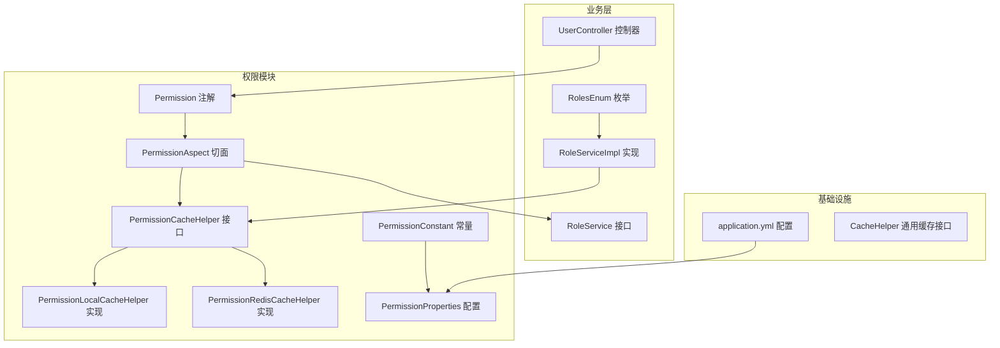
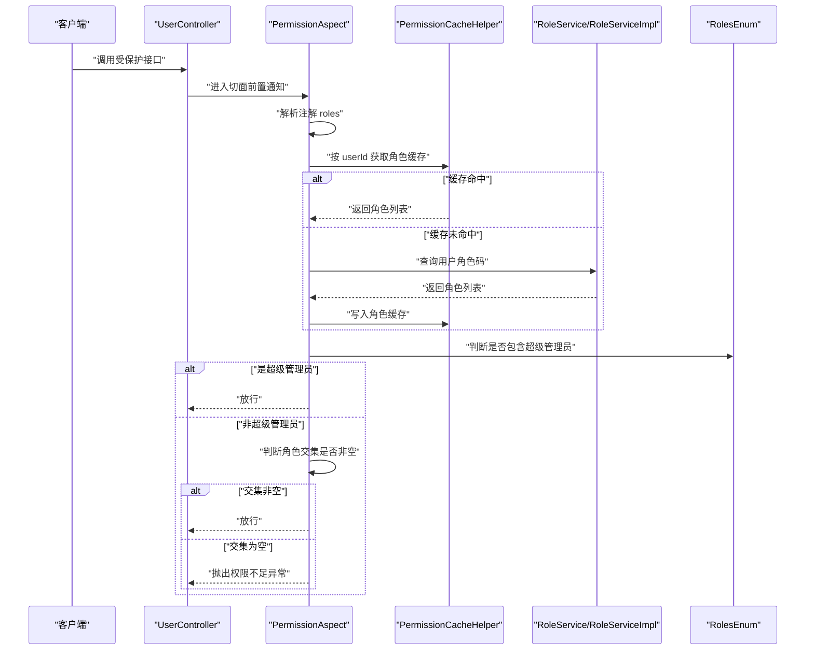
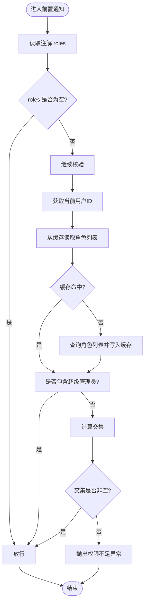
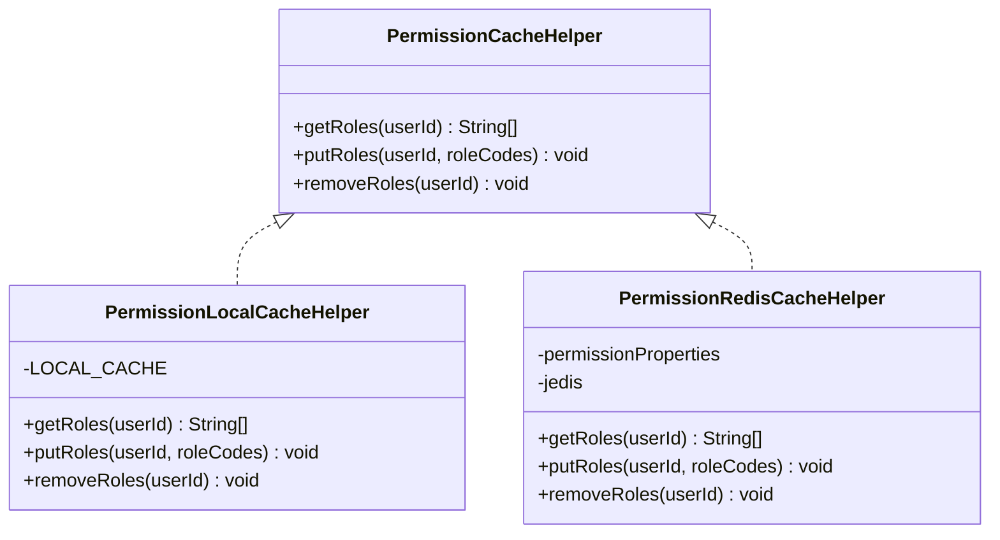
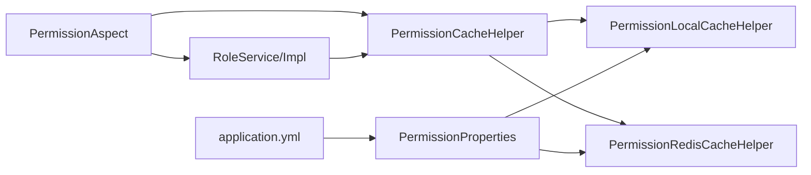

# 权限验证系统

<cite>
**本文引用的文件**
- [Permission.java](file://src/main/java/com/dw/admin/components/permission/Permission.java)
- [PermissionAspect.java](file://src/main/java/com/dw/admin/components/permission/PermissionAspect.java)
- [PermissionCacheHelper.java](file://src/main/java/com/dw/admin/components/permission/PermissionCacheHelper.java)
- [PermissionLocalCacheHelper.java](file://src/main/java/com/dw/admin/components/permission/PermissionLocalCacheHelper.java)
- [PermissionRedisCacheHelper.java](file://src/main/java/com/dw/admin/components/permission/PermissionRedisCacheHelper.java)
- [PermissionConstant.java](file://src/main/java/com/dw/admin/components/permission/PermissionConstant.java)
- [PermissionProperties.java](file://src/main/java/com/dw/admin/components/permission/PermissionProperties.java)
- [UserController.java](file://src/main/java/com/dw/admin/controller/UserController.java)
- [RoleService.java](file://src/main/java/com/dw/admin/service/RoleService.java)
- [RoleServiceImpl.java](file://src/main/java/com/dw/admin/service/impl/RoleServiceImpl.java)
- [RolesEnum.java](file://src/main/java/com/dw/admin/common/enums/RolesEnum.java)
- [application.yml](file://src/main/resources/application.yml)
- [CacheHelper.java](file://src/main/java/com/dw/admin/components/cache/CacheHelper.java)
</cite>

## 目录
1. [简介](#简介)
2. [项目结构](#项目结构)
3. [核心组件](#核心组件)
4. [架构总览](#架构总览)
5. [详细组件分析](#详细组件分析)
6. [依赖关系分析](#依赖关系分析)
7. [性能与并发](#性能与并发)
8. [权限注解使用与配置](#权限注解使用与配置)
9. [RBAC 模型实现](#rbac-模型实现)
10. [权限缓存与失效](#权限缓存与失效)
11. [调试与故障排除](#调试与故障排除)
12. [安全考虑与最佳实践](#安全考虑与最佳实践)
13. [结论](#结论)

## 简介
本技术文档围绕权限验证系统展开，重点解析 Permission 注解的设计与 PermissionAspect 切面的实现机制，梳理权限获取、匹配与判断的完整执行流程；阐述基于角色的权限控制（RBAC）模型在系统中的落地方式；说明权限缓存策略与缓存失效机制；给出性能优化与并发控制建议；并提供注解使用方法、配置项说明、调试排障指南以及安全最佳实践，帮助系统管理员与安全开发者快速掌握与运维该权限体系。

## 项目结构
权限系统位于模块 components/permission 下，采用注解 + AOP 的方式在方法级进行权限拦截，并通过可插拔的缓存实现（本地/Redis）提升性能。核心文件如下：
- 注解定义：Permission.java
- 切面实现：PermissionAspect.java
- 缓存接口与实现：PermissionCacheHelper.java、PermissionLocalCacheHelper.java、PermissionRedisCacheHelper.java
- 常量与配置：PermissionConstant.java、PermissionProperties.java
- 控制器示例：UserController.java
- 角色服务与实现：RoleService.java、RoleServiceImpl.java
- 角色枚举：RolesEnum.java
- 应用配置：application.yml
- 通用缓存接口：CacheHelper.java

图表来源
- [Permission.java](file://src/main/java/com/dw/admin/components/permission/Permission.java#L1-L23)
- [PermissionAspect.java](file://src/main/java/com/dw/admin/components/permission/PermissionAspect.java#L1-L91)
- [PermissionCacheHelper.java](file://src/main/java/com/dw/admin/components/permission/PermissionCacheHelper.java#L1-L28)
- [PermissionLocalCacheHelper.java](file://src/main/java/com/dw/admin/components/permission/PermissionLocalCacheHelper.java#L1-L71)
- [PermissionRedisCacheHelper.java](file://src/main/java/com/dw/admin/components/permission/PermissionRedisCacheHelper.java#L1-L86)
- [PermissionConstant.java](file://src/main/java/com/dw/admin/components/permission/PermissionConstant.java#L1-L42)
- [PermissionProperties.java](file://src/main/java/com/dw/admin/components/permission/PermissionProperties.java#L1-L31)
- [UserController.java](file://src/main/java/com/dw/admin/controller/UserController.java#L1-L138)
- [RoleService.java](file://src/main/java/com/dw/admin/service/RoleService.java#L1-L64)
- [RoleServiceImpl.java](file://src/main/java/com/dw/admin/service/impl/RoleServiceImpl.java#L1-L245)
- [RolesEnum.java](file://src/main/java/com/dw/admin/common/enums/RolesEnum.java#L1-L31)
- [application.yml](file://src/main/resources/application.yml#L1-L64)
- [CacheHelper.java](file://src/main/java/com/dw/admin/components/cache/CacheHelper.java#L1-L52)

章节来源
- [Permission.java](file://src/main/java/com/dw/admin/components/permission/Permission.java#L1-L23)
- [PermissionAspect.java](file://src/main/java/com/dw/admin/components/permission/PermissionAspect.java#L1-L91)
- [PermissionCacheHelper.java](file://src/main/java/com/dw/admin/components/permission/PermissionCacheHelper.java#L1-L28)
- [PermissionLocalCacheHelper.java](file://src/main/java/com/dw/admin/components/permission/PermissionLocalCacheHelper.java#L1-L71)
- [PermissionRedisCacheHelper.java](file://src/main/java/com/dw/admin/components/permission/PermissionRedisCacheHelper.java#L1-L86)
- [PermissionConstant.java](file://src/main/java/com/dw/admin/components/permission/PermissionConstant.java#L1-L42)
- [PermissionProperties.java](file://src/main/java/com/dw/admin/components/permission/PermissionProperties.java#L1-L31)
- [UserController.java](file://src/main/java/com/dw/admin/controller/UserController.java#L1-L138)
- [RoleService.java](file://src/main/java/com/dw/admin/service/RoleService.java#L1-L64)
- [RoleServiceImpl.java](file://src/main/java/com/dw/admin/service/impl/RoleServiceImpl.java#L1-L245)
- [RolesEnum.java](file://src/main/java/com/dw/admin/common/enums/RolesEnum.java#L1-L31)
- [application.yml](file://src/main/resources/application.yml#L1-L64)
- [CacheHelper.java](file://src/main/java/com/dw/admin/components/cache/CacheHelper.java#L1-L52)

## 核心组件
- Permission 注解：用于声明方法级权限要求，支持 roles 字段指定允许的角色码集合。
- PermissionAspect 切面：在目标方法执行前进行权限校验，优先检查角色权限，超管直接放行，否则要求交集非空。
- PermissionCacheHelper 接口及其实现：抽象出角色缓存读写与删除能力，支持本地缓存与 Redis 缓存两种实现。
- RoleService/RoleServiceImpl：提供角色查询与缓存清理能力，负责将用户角色码持久化到缓存中。
- RolesEnum：内置角色枚举，包含超级管理员与普通用户。
- PermissionConstant/PermissionProperties：集中管理权限相关常量与配置项。
- UserController 示例：展示如何在控制器方法上使用 Permission 注解。

章节来源
- [Permission.java](file://src/main/java/com/dw/admin/components/permission/Permission.java#L11-L22)
- [PermissionAspect.java](file://src/main/java/com/dw/admin/components/permission/PermissionAspect.java#L49-L87)
- [PermissionCacheHelper.java](file://src/main/java/com/dw/admin/components/permission/PermissionCacheHelper.java#L10-L27)
- [PermissionLocalCacheHelper.java](file://src/main/java/com/dw/admin/components/permission/PermissionLocalCacheHelper.java#L28-L70)
- [PermissionRedisCacheHelper.java](file://src/main/java/com/dw/admin/components/permission/PermissionRedisCacheHelper.java#L25-L85)
- [RoleService.java](file://src/main/java/com/dw/admin/service/RoleService.java#L60-L61)
- [RoleServiceImpl.java](file://src/main/java/com/dw/admin/service/impl/RoleServiceImpl.java#L207-L212)
- [RolesEnum.java](file://src/main/java/com/dw/admin/common/enums/RolesEnum.java#L8-L28)
- [PermissionConstant.java](file://src/main/java/com/dw/admin/components/permission/PermissionConstant.java#L8-L41)
- [PermissionProperties.java](file://src/main/java/com/dw/admin/components/permission/PermissionProperties.java#L15-L30)
- [UserController.java](file://src/main/java/com/dw/admin/controller/UserController.java#L72-L135)

## 架构总览
权限系统通过注解驱动与 AOP 切面实现方法级权限拦截，结合可插拔缓存策略降低数据库访问压力，整体流程如下：

图表来源
- [PermissionAspect.java](file://src/main/java/com/dw/admin/components/permission/PermissionAspect.java#L52-L87)
- [PermissionCacheHelper.java](file://src/main/java/com/dw/admin/components/permission/PermissionCacheHelper.java#L10-L27)
- [PermissionLocalCacheHelper.java](file://src/main/java/com/dw/admin/components/permission/PermissionLocalCacheHelper.java#L48-L70)
- [PermissionRedisCacheHelper.java](file://src/main/java/com/dw/admin/components/permission/PermissionRedisCacheHelper.java#L34-L73)
- [RoleService.java](file://src/main/java/com/dw/admin/service/RoleService.java#L60-L61)
- [RoleServiceImpl.java](file://src/main/java/com/dw/admin/service/impl/RoleServiceImpl.java#L233-L242)
- [RolesEnum.java](file://src/main/java/com/dw/admin/common/enums/RolesEnum.java#L10-L11)

## 详细组件分析

### Permission 注解设计
- 元注解：作用于方法级别，运行时可见，支持文档化。
- 属性：
  - value：预留的权限码数组（当前切面未使用）。
  - roles：必需的角色码数组，至少需满足其一。
- 设计意图：以最小语义表达“允许的角色集合”，便于统一拦截与判断。

章节来源
- [Permission.java](file://src/main/java/com/dw/admin/components/permission/Permission.java#L11-L22)

### PermissionAspect 切面实现
- 切点：匹配带有 Permission 注解的方法。
- 执行时机：前置通知，在方法执行前进行校验。
- 校验逻辑：
  - 从注解提取允许的角色集合。
  - 从上下文获取当前用户 ID。
  - 通过缓存获取用户角色列表；若未命中则查询服务层并回填缓存。
  - 若包含超级管理员角色则直接放行。
  - 否则要求用户角色与允许角色存在交集，否则抛出业务异常。
- 配置开关：通过属性控制切面启用状态。

图表来源
- [PermissionAspect.java](file://src/main/java/com/dw/admin/components/permission/PermissionAspect.java#L52-L87)
- [RolesEnum.java](file://src/main/java/com/dw/admin/common/enums/RolesEnum.java#L10-L11)

章节来源
- [PermissionAspect.java](file://src/main/java/com/dw/admin/components/permission/PermissionAspect.java#L31-L91)

### 缓存接口与实现
- 接口职责：提供角色列表的读取、写入与删除能力。
- 本地缓存实现：
  - 使用 Google Guava Cache，设置最大条目数、并发度与过期时间。
  - 适合单实例部署，延迟低、吞吐高。
- Redis 缓存实现：
  - 使用 Jedis 客户端，序列化后存储为字符串。
  - 支持分布式共享，适合多实例部署。
- 键空间：角色键前缀与码键前缀由常量统一管理。

图表来源
- [PermissionCacheHelper.java](file://src/main/java/com/dw/admin/components/permission/PermissionCacheHelper.java#L10-L27)
- [PermissionLocalCacheHelper.java](file://src/main/java/com/dw/admin/components/permission/PermissionLocalCacheHelper.java#L28-L70)
- [PermissionRedisCacheHelper.java](file://src/main/java/com/dw/admin/components/permission/PermissionRedisCacheHelper.java#L25-L85)

章节来源
- [PermissionCacheHelper.java](file://src/main/java/com/dw/admin/components/permission/PermissionCacheHelper.java#L10-L27)
- [PermissionLocalCacheHelper.java](file://src/main/java/com/dw/admin/components/permission/PermissionLocalCacheHelper.java#L28-L70)
- [PermissionRedisCacheHelper.java](file://src/main/java/com/dw/admin/components/permission/PermissionRedisCacheHelper.java#L25-L85)

### 角色服务与缓存清理
- RoleServiceImpl 在保存用户角色后，异步触发缓存清理，确保后续权限校验读取到最新角色。
- 提供查询用户角色码的能力，供切面与业务使用。

章节来源
- [RoleServiceImpl.java](file://src/main/java/com/dw/admin/service/impl/RoleServiceImpl.java#L187-L212)
- [RoleServiceImpl.java](file://src/main/java/com/dw/admin/service/impl/RoleServiceImpl.java#L233-L242)

### 控制器示例与注解使用
- UserController 中多处使用 Permission 注解，限定仅 admin 可访问的接口。
- 体现了注解在实际业务中的落地方式。

章节来源
- [UserController.java](file://src/main/java/com/dw/admin/controller/UserController.java#L72-L135)

## 依赖关系分析
- 组件耦合：
  - PermissionAspect 依赖 RoleService 与 PermissionCacheHelper。
  - 缓存实现依赖 PermissionProperties 与外部存储（本地/Redis）。
  - RoleServiceImpl 依赖 PermissionCacheHelper 以清理缓存。
- 配置依赖：
  - PermissionProperties 通过前缀绑定到 application.yml。
  - 缓存类型由属性决定加载哪个实现。

图表来源
- [PermissionAspect.java](file://src/main/java/com/dw/admin/components/permission/PermissionAspect.java#L41-L45)
- [RoleServiceImpl.java](file://src/main/java/com/dw/admin/service/impl/RoleServiceImpl.java#L57-L57)
- [PermissionLocalCacheHelper.java](file://src/main/java/com/dw/admin/components/permission/PermissionLocalCacheHelper.java#L31-L31)
- [PermissionRedisCacheHelper.java](file://src/main/java/com/dw/admin/components/permission/PermissionRedisCacheHelper.java#L28-L31)
- [PermissionProperties.java](file://src/main/java/com/dw/admin/components/permission/PermissionProperties.java#L17-L27)
- [application.yml](file://src/main/resources/application.yml#L33-L64)

章节来源
- [PermissionAspect.java](file://src/main/java/com/dw/admin/components/permission/PermissionAspect.java#L41-L45)
- [RoleServiceImpl.java](file://src/main/java/com/dw/admin/service/impl/RoleServiceImpl.java#L57-L57)
- [PermissionLocalCacheHelper.java](file://src/main/java/com/dw/admin/components/permission/PermissionLocalCacheHelper.java#L31-L31)
- [PermissionRedisCacheHelper.java](file://src/main/java/com/dw/admin/components/permission/PermissionRedisCacheHelper.java#L28-L31)
- [PermissionProperties.java](file://src/main/java/com/dw/admin/components/permission/PermissionProperties.java#L17-L27)
- [application.yml](file://src/main/resources/application.yml#L33-L64)

## 性能与并发
- 缓存策略：
  - 本地缓存：适合单实例，延迟低；通过最大条目数与过期时间控制内存占用。
  - Redis 缓存：适合多实例，具备分布式一致性；通过过期时间避免脏读。
- 并发控制：
  - 本地缓存默认并发度可控；Redis 通过单线程命令串行保证原子性。
- 异步失效：
  - 保存用户角色后异步清理缓存，避免阻塞主流程。
- 建议：
  - 多实例部署优先选择 Redis 缓存。
  - 合理设置过期时间，兼顾实时性与缓存命中率。
  - 对热点用户可考虑预热缓存。

章节来源
- [PermissionLocalCacheHelper.java](file://src/main/java/com/dw/admin/components/permission/PermissionLocalCacheHelper.java#L41-L46)
- [PermissionRedisCacheHelper.java](file://src/main/java/com/dw/admin/components/permission/PermissionRedisCacheHelper.java#L52-L57)
- [RoleServiceImpl.java](file://src/main/java/com/dw/admin/service/impl/RoleServiceImpl.java#L207-L212)

## 权限注解使用与配置
- 注解使用：
  - 在需要限制角色的方法上添加 Permission 注解，并设置 roles。
  - 示例：仅 admin 可访问的用户管理接口。
- 配置项：
  - enable：是否启用权限校验。
  - cache-type：缓存类型（local/redis）。
  - expire-time：缓存过期时间（秒）。
- 配置位置：
  - application.yml 中 dwa.permission.* 对应上述属性。

章节来源
- [Permission.java](file://src/main/java/com/dw/admin/components/permission/Permission.java#L16-L21)
- [PermissionProperties.java](file://src/main/java/com/dw/admin/components/permission/PermissionProperties.java#L20-L28)
- [application.yml](file://src/main/resources/application.yml#L33-L64)
- [UserController.java](file://src/main/java/com/dw/admin/controller/UserController.java#L72-L135)

## RBAC 模型实现
- 角色维度：
  - 用户与角色通过中间表关联，支持多对多。
  - 提供查询用户角色列表与角色码列表的服务。
- 权限判定：
  - 切面优先检查用户是否包含超级管理员角色，若是则直接放行。
  - 否则要求用户角色与注解允许角色存在交集。
- 超级管理员：
  - 通过 RolesEnum 定义，切面中以角色码匹配。

章节来源
- [RoleService.java](file://src/main/java/com/dw/admin/service/RoleService.java#L44-L61)
- [RoleServiceImpl.java](file://src/main/java/com/dw/admin/service/impl/RoleServiceImpl.java#L162-L181)
- [RoleServiceImpl.java](file://src/main/java/com/dw/admin/service/impl/RoleServiceImpl.java#L217-L228)
- [RolesEnum.java](file://src/main/java/com/dw/admin/common/enums/RolesEnum.java#L10-L11)
- [PermissionAspect.java](file://src/main/java/com/dw/admin/components/permission/PermissionAspect.java#L72-L81)

## 权限缓存与失效
- 缓存读写：
  - 读：先查缓存，未命中再查数据库并回填缓存。
  - 写：在查询后写入缓存，使用配置的过期时间。
- 失效策略：
  - 保存用户角色后异步删除对应缓存键，确保下次读取最新数据。
- 键空间：
  - 角色键前缀与码键前缀由常量统一管理，便于维护。

章节来源
- [PermissionAspect.java](file://src/main/java/com/dw/admin/components/permission/PermissionAspect.java#L64-L70)
- [PermissionLocalCacheHelper.java](file://src/main/java/com/dw/admin/components/permission/PermissionLocalCacheHelper.java#L48-L68)
- [PermissionRedisCacheHelper.java](file://src/main/java/com/dw/admin/components/permission/PermissionRedisCacheHelper.java#L34-L73)
- [RoleServiceImpl.java](file://src/main/java/com/dw/admin/service/impl/RoleServiceImpl.java#L207-L212)
- [PermissionConstant.java](file://src/main/java/com/dw/admin/components/permission/PermissionConstant.java#L30-L34)

## 调试与故障排除
- 常见问题与定位思路：
  - 权限不足异常：确认注解 roles 是否正确、用户是否拥有对应角色、缓存是否命中。
  - 缓存未生效：检查缓存类型配置、过期时间、Redis 连接状态。
  - 角色变更未生效：确认保存角色后是否触发了缓存清理任务。
- 日志与监控：
  - 缓存读写异常会记录错误日志，便于排查。
  - 建议在网关或切面增加审计日志，记录权限拒绝事件。
- 快速验证步骤：
  - 使用 admin 角色登录，尝试访问受保护接口，确认放行。
  - 更改用户角色后，等待缓存过期或触发清理，再次验证权限变化。

章节来源
- [PermissionAspect.java](file://src/main/java/com/dw/admin/components/permission/PermissionAspect.java#L84-L86)
- [PermissionRedisCacheHelper.java](file://src/main/java/com/dw/admin/components/permission/PermissionRedisCacheHelper.java#L43-L45)
- [RoleServiceImpl.java](file://src/main/java/com/dw/admin/service/impl/RoleServiceImpl.java#L207-L212)

## 安全考虑与最佳实践
- 最小权限原则：注解明确限定所需角色，避免过度授权。
- 超级管理员隔离：超级管理员不受注解限制，但应严格控制该角色数量与使用场景。
- 缓存安全：Redis 场景下注意网络与认证配置，避免未授权访问。
- 异步清理：避免在请求链路中同步清理缓存，影响响应时间。
- 配置治理：通过配置中心集中管理 dwa.permission.*，避免硬编码。
- 审计与告警：对权限拒绝事件进行记录与阈值告警，及时发现异常行为。

## 结论
该权限验证系统以注解 + AOP 为核心，结合可插拔缓存实现，提供了简洁高效的 RBAC 权限控制方案。通过合理的缓存策略与异步失效机制，系统在保证安全性的同时兼顾性能与可扩展性。建议在生产环境中采用 Redis 缓存与严格的配置治理，并配合完善的审计与告警机制，持续保障系统的安全稳定运行。