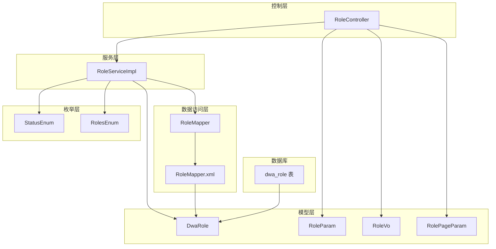
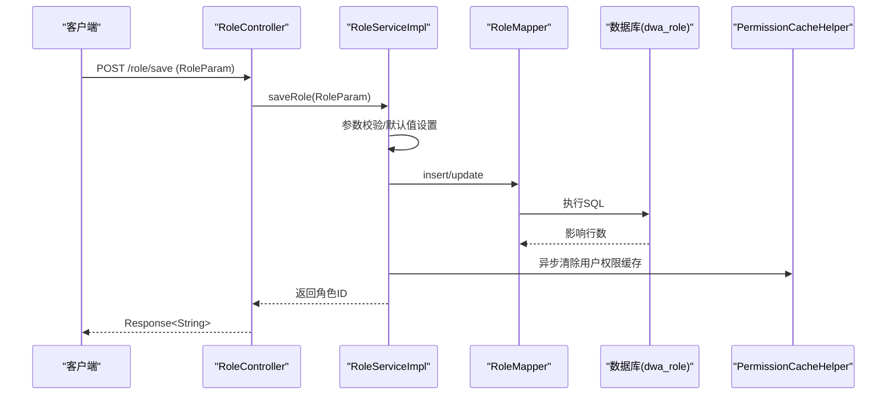
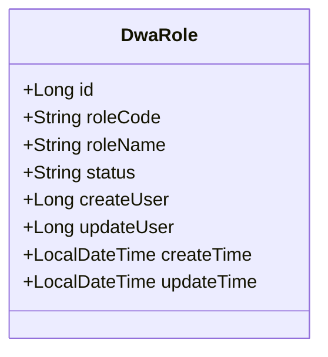
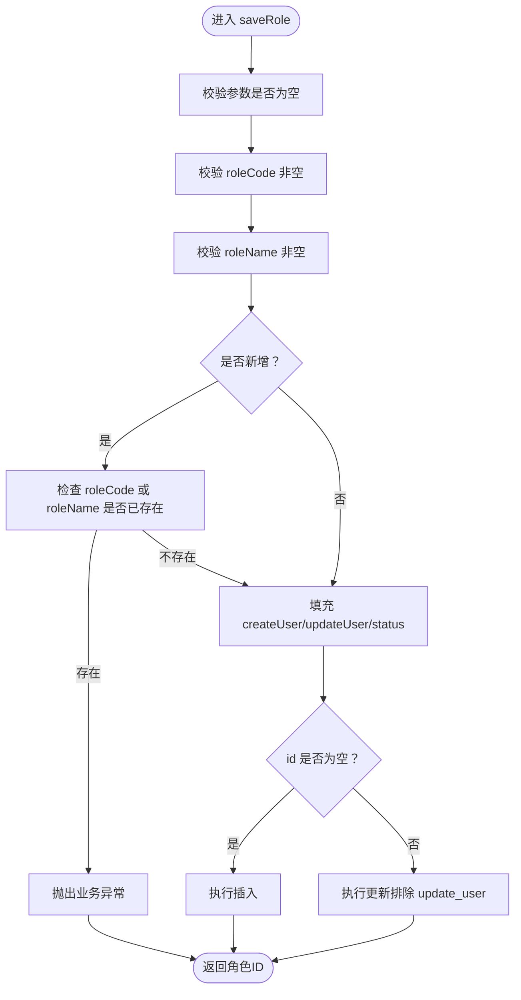
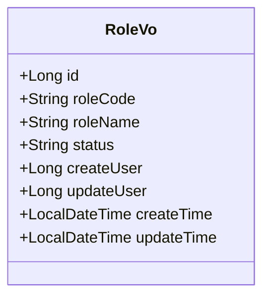
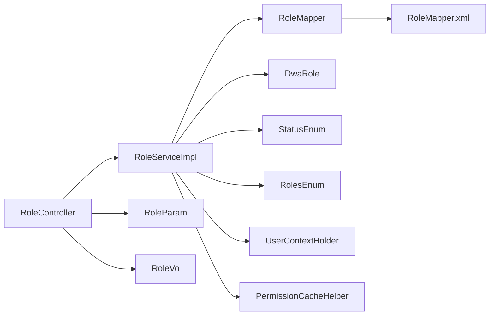

# 角色实体模型

<cite>
**本文引用的文件**
- [DwaRole.java](file://src/main/java/com/dw/admin/model/entity/DwaRole.java)
- [RoleParam.java](file://src/main/java/com/dw/admin/model/param/RoleParam.java)
- [RoleVo.java](file://src/main/java/com/dw/admin/model/vo/RoleVo.java)
- [RoleMapper.xml](file://src/main/resources/mapper/RoleMapper.xml)
- [RoleServiceImpl.java](file://src/main/java/com/dw/admin/service/impl/RoleServiceImpl.java)
- [RoleController.java](file://src/main/java/com/dw/admin/controller/RoleController.java)
- [init_ddl.sql](file://docs/sql/init_ddl.sql)
- [StatusEnum.java](file://src/main/java/com/dw/admin/common/enums/StatusEnum.java)
- [RolesEnum.java](file://src/main/java/com/dw/admin/common/enums/RolesEnum.java)
- [RolePageParam.java](file://src/main/java/com/dw/admin/model/param/RolePageParam.java)
- [DwaUserRole.java](file://src/main/java/com/dw/admin/model/entity/DwaUserRole.java)
- [RoleMapper.java](file://src/main/java/com/dw/admin/dao/RoleMapper.java)
</cite>

## 目录
1. [简介](#简介)
2. [项目结构](#项目结构)
3. [核心组件](#核心组件)
4. [架构总览](#架构总览)
5. [详细组件分析](#详细组件分析)
6. [依赖关系分析](#依赖关系分析)
7. [性能考量](#性能考量)
8. [故障排查指南](#故障排查指南)
9. [结论](#结论)
10. [附录](#附录)

## 简介
本文件围绕角色实体模型进行系统性技术文档整理，重点覆盖以下方面：
- DwaRole 实体类的设计与字段语义
- RoleParam 参数类的校验规则与数据校验机制
- RoleVo 视图对象的数据传输模式
- 角色实体与数据库表结构的映射关系
- 角色状态管理、创建/更新时间等元数据字段
- 使用示例与最佳实践
- 序列化与反序列化的注意事项
- 面向开发者的完整角色数据模型参考

## 项目结构
角色相关代码分布在以下层次：
- 控制层：RoleController 提供 REST 接口
- 服务层：RoleServiceImpl 实现业务逻辑
- 数据访问层：RoleMapper 接口及 RoleMapper.xml 映射
- 模型层：DwaRole 实体、RoleParam 参数、RoleVo 视图、RolePageParam 分页参数
- 枚举层：StatusEnum、RolesEnum 等状态与角色枚举
- 数据库：init_ddl.sql 定义 dwa_role 表结构

图表来源
- [RoleController.java](file://src/main/java/com/dw/admin/controller/RoleController.java#L1-L108)
- [RoleServiceImpl.java](file://src/main/java/com/dw/admin/service/impl/RoleServiceImpl.java#L1-L245)
- [RoleMapper.java](file://src/main/java/com/dw/admin/dao/RoleMapper.java#L1-L17)
- [RoleMapper.xml](file://src/main/resources/mapper/RoleMapper.xml#L1-L23)
- [DwaRole.java](file://src/main/java/com/dw/admin/model/entity/DwaRole.java#L1-L71)
- [RoleParam.java](file://src/main/java/com/dw/admin/model/param/RoleParam.java#L1-L43)
- [RoleVo.java](file://src/main/java/com/dw/admin/model/vo/RoleVo.java#L1-L62)
- [RolePageParam.java](file://src/main/java/com/dw/admin/model/param/RolePageParam.java#L1-L46)
- [StatusEnum.java](file://src/main/java/com/dw/admin/common/enums/StatusEnum.java#L1-L31)
- [RolesEnum.java](file://src/main/java/com/dw/admin/common/enums/RolesEnum.java#L1-L31)
- [init_ddl.sql](file://docs/sql/init_ddl.sql#L25-L38)

章节来源
- [RoleController.java](file://src/main/java/com/dw/admin/controller/RoleController.java#L1-L108)
- [RoleServiceImpl.java](file://src/main/java/com/dw/admin/service/impl/RoleServiceImpl.java#L1-L245)
- [RoleMapper.java](file://src/main/java/com/dw/admin/dao/RoleMapper.java#L1-L17)
- [RoleMapper.xml](file://src/main/resources/mapper/RoleMapper.xml#L1-L23)
- [DwaRole.java](file://src/main/java/com/dw/admin/model/entity/DwaRole.java#L1-L71)
- [RoleParam.java](file://src/main/java/com/dw/admin/model/param/RoleParam.java#L1-L43)
- [RoleVo.java](file://src/main/java/com/dw/admin/model/vo/RoleVo.java#L1-L62)
- [RolePageParam.java](file://src/main/java/com/dw/admin/model/param/RolePageParam.java#L1-L46)
- [StatusEnum.java](file://src/main/java/com/dw/admin/common/enums/StatusEnum.java#L1-L31)
- [RolesEnum.java](file://src/main/java/com/dw/admin/common/enums/RolesEnum.java#L1-L31)
- [init_ddl.sql](file://docs/sql/init_ddl.sql#L25-L38)

## 核心组件
- DwaRole：MyBatis-Plus 实体，映射 dwa_role 表，包含主键、角色码/名称、状态、创建/更新人、创建/更新时间等字段，并通过注解声明自动填充策略。
- RoleParam：保存/更新角色时的请求参数对象，包含 id、roleCode、roleName、status 等字段，其中 roleCode 和 roleName 使用非空校验。
- RoleVo：返回给前端的角色视图对象，包含与 DwaRole 对应的字段，同时对时间字段使用 JSON 时间格式化注解。
- RoleMapper：MyBatis Mapper 接口，继承基础接口以获得通用 CRUD 能力。
- RoleMapper.xml：定义通用结果映射与通用列清单，确保实体与表字段一一对应。
- RoleServiceImpl：实现分页查询、详情查询、保存、删除、用户角色查询与保存等功能，包含参数校验、默认值设置、状态处理、权限缓存清理等逻辑。
- RoleController：提供 REST 接口，负责鉴权、权限控制、日志记录与响应封装。
- StatusEnum：状态枚举，提供启用/禁用两种状态码。
- RolesEnum：角色枚举，提供 admin、user 等角色码。
- RolePageParam：分页查询参数，扩展 PageParam 并增加角色码/名称/状态、创建/更新时间排序字段。

章节来源
- [DwaRole.java](file://src/main/java/com/dw/admin/model/entity/DwaRole.java#L1-L71)
- [RoleParam.java](file://src/main/java/com/dw/admin/model/param/RoleParam.java#L1-L43)
- [RoleVo.java](file://src/main/java/com/dw/admin/model/vo/RoleVo.java#L1-L62)
- [RoleMapper.java](file://src/main/java/com/dw/admin/dao/RoleMapper.java#L1-L17)
- [RoleMapper.xml](file://src/main/resources/mapper/RoleMapper.xml#L1-L23)
- [RoleServiceImpl.java](file://src/main/java/com/dw/admin/service/impl/RoleServiceImpl.java#L1-L245)
- [RoleController.java](file://src/main/java/com/dw/admin/controller/RoleController.java#L1-L108)
- [StatusEnum.java](file://src/main/java/com/dw/admin/common/enums/StatusEnum.java#L1-L31)
- [RolesEnum.java](file://src/main/java/com/dw/admin/common/enums/RolesEnum.java#L1-L31)
- [RolePageParam.java](file://src/main/java/com/dw/admin/model/param/RolePageParam.java#L1-L46)

## 架构总览
角色模块采用典型的分层架构，职责清晰：
- 控制器层：接收请求、参数校验、鉴权与权限控制、日志记录、统一响应封装
- 服务层：业务编排、参数校验、默认值处理、调用持久层、缓存清理
- 数据访问层：基于 MyBatis-Plus 的通用 Mapper，XML 映射表字段
- 模型层：实体、参数、视图、分页参数、枚举

图表来源
- [RoleController.java](file://src/main/java/com/dw/admin/controller/RoleController.java#L57-L67)
- [RoleServiceImpl.java](file://src/main/java/com/dw/admin/service/impl/RoleServiceImpl.java#L117-L147)
- [RoleMapper.java](file://src/main/java/com/dw/admin/dao/RoleMapper.java#L1-L17)
- [RoleMapper.xml](file://src/main/resources/mapper/RoleMapper.xml#L1-L23)

## 详细组件分析

### DwaRole 实体类设计
- 表映射：通过 @TableName("dwa_role") 映射到数据库表 dwa_role
- 主键策略：@TableId(value = "id", type = IdType.ASSIGN_ID) 使用雪花算法生成主键
- 字段映射：通过 @TableField 或直接属性映射，与 RoleMapper.xml 中的 BaseResultMap 一致
- 自动填充：
  - @TableField(fill = FieldFill.INSERT) createTime 在插入时自动填充
  - @TableField(fill = FieldFill.INSERT_UPDATE) updateTime 在插入和更新时自动填充
- 元数据字段：
  - createUser/updateUser：记录操作人，通常来自上下文中的当前用户ID
  - createTime/updateTime：记录创建与更新时间，配合自动填充注解
- 业务字段：
  - roleCode：角色码，唯一性约束在业务层保证（新增时校验重复）
  - roleName：角色名称
  - status：状态，采用字符串枚举值（1 启用，0 禁用）

图表来源
- [DwaRole.java](file://src/main/java/com/dw/admin/model/entity/DwaRole.java#L23-L70)
- [RoleMapper.xml](file://src/main/resources/mapper/RoleMapper.xml#L6-L15)

章节来源
- [DwaRole.java](file://src/main/java/com/dw/admin/model/entity/DwaRole.java#L1-L71)
- [RoleMapper.xml](file://src/main/resources/mapper/RoleMapper.xml#L1-L23)
- [init_ddl.sql](file://docs/sql/init_ddl.sql#L27-L38)

### RoleParam 参数类验证规则
- 字段定义：id、roleCode、roleName、status
- 校验规则：
  - roleCode：@NotBlank 非空校验
  - roleName：@NotBlank 非空校验
- 业务语义：
  - id 为空表示新增；非空表示更新
  - status 为空时由服务层设置为启用状态
- 参数来源：控制器层通过 @Validated 对请求体进行 JSR-303 校验后进入服务层

图表来源
- [RoleParam.java](file://src/main/java/com/dw/admin/model/param/RoleParam.java#L17-L42)
- [RoleServiceImpl.java](file://src/main/java/com/dw/admin/service/impl/RoleServiceImpl.java#L117-L147)

章节来源
- [RoleParam.java](file://src/main/java/com/dw/admin/model/param/RoleParam.java#L1-L43)
- [RoleServiceImpl.java](file://src/main/java/com/dw/admin/service/impl/RoleServiceImpl.java#L117-L147)

### RoleVo 视图对象的数据传输模式
- 字段与 DwaRole 对应，用于对外输出
- 时间字段使用 @JsonFormat(pattern = "yyyy-MM-dd HH:mm:ss", timezone = "GMT+8") 统一序列化格式
- 作为分页查询与详情查询的返回载体，避免直接暴露实体类的内部细节

图表来源
- [RoleVo.java](file://src/main/java/com/dw/admin/model/vo/RoleVo.java#L16-L61)

章节来源
- [RoleVo.java](file://src/main/java/com/dw/admin/model/vo/RoleVo.java#L1-L62)

### 角色状态管理与默认值
- 状态枚举：StatusEnum 提供 ENABLE("1") 与 DISABLE("0")
- 保存流程中，若未显式传入 status，则设置为 ENABLE
- 用户角色查询时会过滤掉状态为 DISABLE 的角色

章节来源
- [StatusEnum.java](file://src/main/java/com/dw/admin/common/enums/StatusEnum.java#L1-L31)
- [RoleServiceImpl.java](file://src/main/java/com/dw/admin/service/impl/RoleServiceImpl.java#L134-L136)
- [RoleServiceImpl.java](file://src/main/java/com/dw/admin/service/impl/RoleServiceImpl.java#L179-L180)

### 创建时间、更新时间与元数据字段
- DwaRole 中 createTime、updateTime 通过注解自动填充
- 服务层在保存时设置 createUser/updateUser 为当前用户ID
- RoleVo 输出时对时间字段进行统一格式化

章节来源
- [DwaRole.java](file://src/main/java/com/dw/admin/model/entity/DwaRole.java#L62-L69)
- [RoleServiceImpl.java](file://src/main/java/com/dw/admin/service/impl/RoleServiceImpl.java#L137-L138)
- [RoleVo.java](file://src/main/java/com/dw/admin/model/vo/RoleVo.java#L53-L60)

### 角色实体与数据库表结构映射
- 表结构：dwa_role 包含 id、role_code、role_name、status、create_user、update_user、create_time、update_time
- 字段映射：RoleMapper.xml 的 BaseResultMap 将列与实体属性一一对应
- 通用列清单：Base_Column_List 提供常用查询列集合

章节来源
- [init_ddl.sql](file://docs/sql/init_ddl.sql#L27-L38)
- [RoleMapper.xml](file://src/main/resources/mapper/RoleMapper.xml#L6-L20)

### 使用示例与最佳实践
- 新增角色
  - 请求体：包含 roleCode、roleName，status 可省略（将被设置为启用）
  - 控制器：POST /role/save
  - 服务层：参数校验、去重检查、自动填充元数据、插入数据库
- 更新角色
  - 请求体：包含 id、roleCode、roleName、status
  - 控制器：POST /role/save
  - 服务层：参数校验、自动填充更新人、更新数据库（注意更新时排除 update_user）
- 分页查询
  - 请求体：RolePageParam，支持按角色码/名称模糊查询、按状态过滤、按创建/更新时间排序
  - 控制器：POST /role/list
  - 服务层：构建查询条件、分页、排序、封装为 RoleVo 列表
- 查询用户角色
  - 请求路径：GET /role/user/{userId}
  - 服务层：根据用户ID查询用户角色关联，再查询角色列表并过滤禁用状态
- 保存用户角色
  - 请求体：UserRoleParam，先删除旧关系，再批量插入新关系
  - 服务层：异步清理权限缓存

章节来源
- [RoleController.java](file://src/main/java/com/dw/admin/controller/RoleController.java#L36-L104)
- [RoleServiceImpl.java](file://src/main/java/com/dw/admin/service/impl/RoleServiceImpl.java#L64-L99)
- [RoleServiceImpl.java](file://src/main/java/com/dw/admin/service/impl/RoleServiceImpl.java#L104-L112)
- [RoleServiceImpl.java](file://src/main/java/com/dw/admin/service/impl/RoleServiceImpl.java#L162-L181)
- [RoleServiceImpl.java](file://src/main/java/com/dw/admin/service/impl/RoleServiceImpl.java#L187-L212)

### 序列化与反序列化注意事项
- RoleVo 中的时间字段使用 @JsonFormat 统一序列化格式与时区，避免跨时区显示问题
- 实体类 DwaRole 未直接标注时间格式，通常由全局 JSON 配置或框架默认处理
- 建议前后端约定统一的时间格式与时区，避免解析差异导致的错误

章节来源
- [RoleVo.java](file://src/main/java/com/dw/admin/model/vo/RoleVo.java#L53-L60)

## 依赖关系分析
- 控制器依赖服务层接口 RoleService，默认实现 RoleServiceImpl
- 服务层依赖 RoleMapper 接口与 RoleMapper.xml 映射
- 服务层依赖 UserContextHolder 获取当前用户ID，依赖 PermissionCacheHelper 清理权限缓存
- 服务层依赖 ValidateUtil 进行参数校验
- 实体类 DwaRole 依赖 MyBatis-Plus 注解进行表映射与自动填充
- RoleParam 依赖 JSR-303 注解进行参数校验
- RoleVo 依赖 Jackson 注解进行时间序列化格式化

图表来源
- [RoleController.java](file://src/main/java/com/dw/admin/controller/RoleController.java#L1-L108)
- [RoleServiceImpl.java](file://src/main/java/com/dw/admin/service/impl/RoleServiceImpl.java#L1-L245)
- [RoleMapper.java](file://src/main/java/com/dw/admin/dao/RoleMapper.java#L1-L17)
- [RoleMapper.xml](file://src/main/resources/mapper/RoleMapper.xml#L1-L23)
- [DwaRole.java](file://src/main/java/com/dw/admin/model/entity/DwaRole.java#L1-L71)
- [RoleParam.java](file://src/main/java/com/dw/admin/model/param/RoleParam.java#L1-L43)
- [RoleVo.java](file://src/main/java/com/dw/admin/model/vo/RoleVo.java#L1-L62)
- [StatusEnum.java](file://src/main/java/com/dw/admin/common/enums/StatusEnum.java#L1-L31)
- [RolesEnum.java](file://src/main/java/com/dw/admin/common/enums/RolesEnum.java#L1-L31)

章节来源
- [RoleController.java](file://src/main/java/com/dw/admin/controller/RoleController.java#L1-L108)
- [RoleServiceImpl.java](file://src/main/java/com/dw/admin/service/impl/RoleServiceImpl.java#L1-L245)
- [RoleMapper.java](file://src/main/java/com/dw/admin/dao/RoleMapper.java#L1-L17)
- [RoleMapper.xml](file://src/main/resources/mapper/RoleMapper.xml#L1-L23)
- [DwaRole.java](file://src/main/java/com/dw/admin/model/entity/DwaRole.java#L1-L71)
- [RoleParam.java](file://src/main/java/com/dw/admin/model/param/RoleParam.java#L1-L43)
- [RoleVo.java](file://src/main/java/com/dw/admin/model/vo/RoleVo.java#L1-L62)
- [StatusEnum.java](file://src/main/java/com/dw/admin/common/enums/StatusEnum.java#L1-L31)
- [RolesEnum.java](file://src/main/java/com/dw/admin/common/enums/RolesEnum.java#L1-L31)

## 性能考量
- 分页查询：使用 LambdaQueryWrapper 构建条件，避免全表扫描；默认按更新时间倒序，减少无索引排序成本
- 唯一性校验：新增时对 roleCode 与 roleName 进行联合去重检查，建议在数据库层面建立唯一索引以提升性能
- 缓存清理：保存用户角色后异步清理权限缓存，避免阻塞主线程
- 自动填充：利用 MyBatis-Plus 注解减少手动赋值，降低出错概率并提升一致性

[本节为通用性能建议，不直接分析具体文件]

## 故障排查指南
- 参数校验失败
  - 现象：请求被拒绝或返回参数校验错误
  - 排查：确认 RoleParam 的 roleCode 与 roleName 是否为空
- 角色重复
  - 现象：保存时报“角色码或角色名称已存在”
  - 排查：检查数据库中是否存在相同 roleCode 或 roleName
- 状态异常
  - 现象：用户角色列表中未显示某些角色
  - 排查：确认角色状态是否为启用；服务层在查询用户角色时会过滤禁用状态
- 时间格式问题
  - 现象：前端时间显示异常或跨时区显示不一致
  - 排查：确认 RoleVo 中时间格式化注解与前端约定一致

章节来源
- [RoleServiceImpl.java](file://src/main/java/com/dw/admin/service/impl/RoleServiceImpl.java#L123-L129)
- [RoleServiceImpl.java](file://src/main/java/com/dw/admin/service/impl/RoleServiceImpl.java#L179-L180)
- [RoleVo.java](file://src/main/java/com/dw/admin/model/vo/RoleVo.java#L53-L60)

## 结论
角色实体模型通过清晰的分层设计与严格的参数校验，实现了角色的增删改查、用户角色绑定与权限缓存管理。DwaRole 实体与数据库表结构保持一致，配合 MyBatis-Plus 的自动填充能力，简化了元数据维护。RoleParam 与 RoleVo 分别承担输入与输出职责，提升了系统的可维护性与安全性。建议在数据库层面补充唯一索引与必要的索引，进一步优化查询性能。

[本节为总结性内容，不直接分析具体文件]

## 附录
- 关联实体与表
  - DwaRole ↔ dwa_role
  - DwaUserRole ↔ dwa_user_role
- 相关接口
  - POST /role/save：保存角色
  - DELETE /role/delete/{id}：删除角色
  - POST /role/list：分页查询角色
  - GET /role/{id}：查询角色详情
  - GET /role/user/{userId}：查询用户角色列表
  - POST /role/user/save：保存用户角色

章节来源
- [RoleController.java](file://src/main/java/com/dw/admin/controller/RoleController.java#L36-L104)
- [DwaUserRole.java](file://src/main/java/com/dw/admin/model/entity/DwaUserRole.java#L1-L55)
- [init_ddl.sql](file://docs/sql/init_ddl.sql#L43-L51)