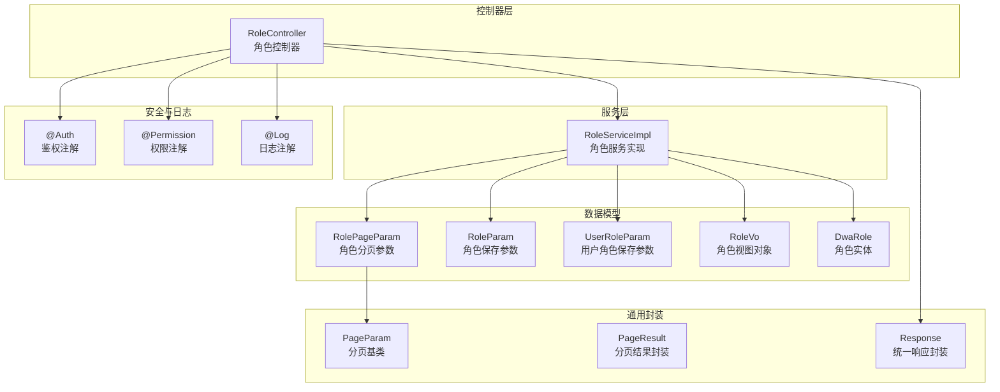
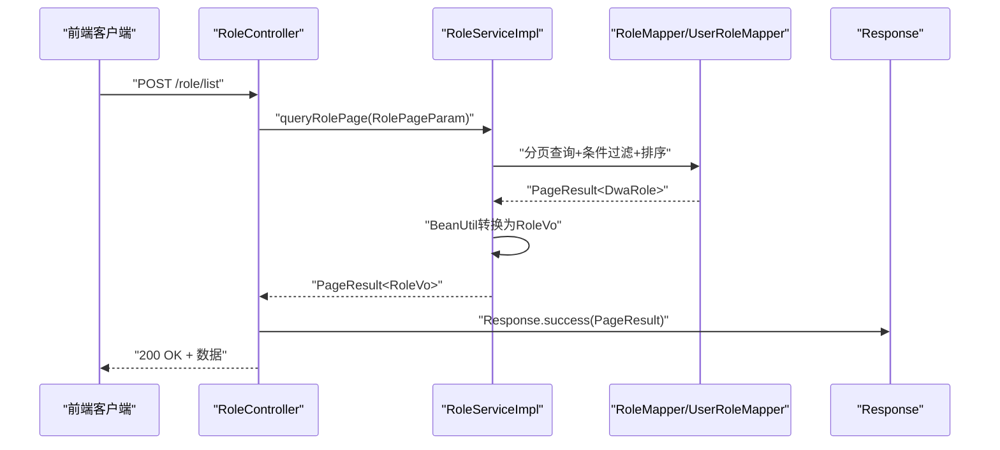
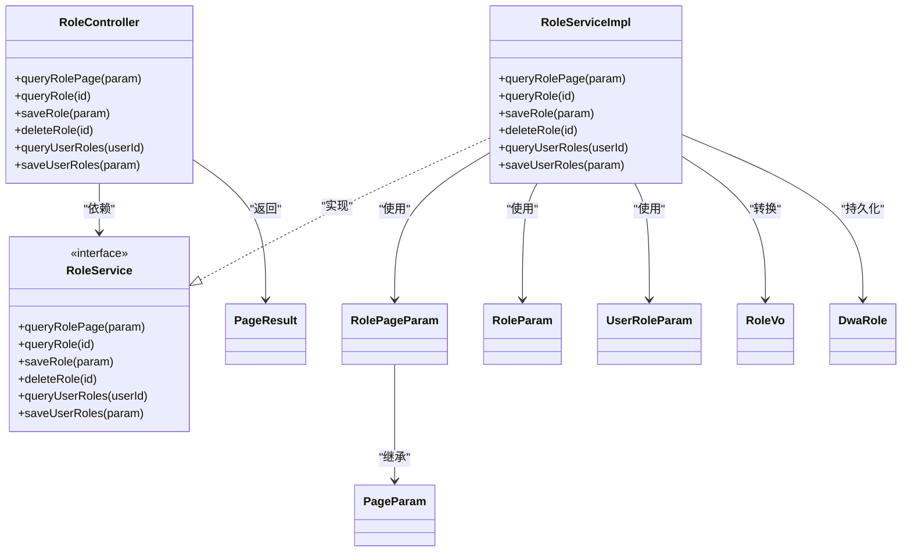

# 角色控制器API

<cite>
**本文引用的文件**
- [RoleController.java](file://src/main/java/com/dw/admin/controller/RoleController.java)
- [RoleServiceImpl.java](file://src/main/java/com/dw/admin/service/impl/RoleServiceImpl.java)
- [RolePageParam.java](file://src/main/java/com/dw/admin/model/param/RolePageParam.java)
- [RoleParam.java](file://src/main/java/com/dw/admin/model/param/RoleParam.java)
- [UserRoleParam.java](file://src/main/java/com/dw/admin/model/param/UserRoleParam.java)
- [RoleVo.java](file://src/main/java/com/dw/admin/model/vo/RoleVo.java)
- [DwaRole.java](file://src/main/java/com/dw/admin/model/entity/DwaRole.java)
- [PageParam.java](file://src/main/java/com/dw/admin/common/entity/PageParam.java)
- [PageResult.java](file://src/main/java/com/dw/admin/common/entity/PageResult.java)
- [Auth.java](file://src/main/java/com/dw/admin/components/auth/Auth.java)
- [Permission.java](file://src/main/java/com/dw/admin/components/permission/Permission.java)
- [Log.java](file://src/main/java/com/dw/admin/components/log/Log.java)
- [BizException.java](file://src/main/java/com/dw/admin/common/exception/BizException.java)
- [GlobalExceptionHandler.java](file://src/main/java/com/dw/admin/common/exception/GlobalExceptionHandler.java)
- [ResultMsg.java](file://src/main/java/com/dw/admin/common/constant/ResultMsg.java)
</cite>

## 目录
1. [简介](#简介)
2. [项目结构](#项目结构)
3. [核心组件](#核心组件)
4. [架构总览](#架构总览)
5. [详细组件分析](#详细组件分析)
6. [依赖关系分析](#依赖关系分析)
7. [性能考量](#性能考量)
8. [故障排查指南](#故障排查指南)
9. [结论](#结论)
10. [附录](#附录)

## 简介
本文件为角色控制器API的全面接口文档，覆盖角色列表查询、角色详情获取、角色保存、角色删除以及用户角色管理等核心能力。文档详细说明每个REST接口的HTTP方法、URL路径、请求参数与响应格式，并解释@Auth、@Permission、@Log等注解在API层面的应用方式。同时给出分页查询参数RolePageParam的使用方法、完整调用示例、错误处理机制、权限控制与安全验证实现，以及性能特征与最佳实践建议。

## 项目结构
角色控制器位于controller层，业务逻辑由service层实现，数据模型与分页封装位于model与common包中，统一通过Response包装返回。

图表来源
- [RoleController.java](file://src/main/java/com/dw/admin/controller/RoleController.java#L26-L107)
- [RoleServiceImpl.java](file://src/main/java/com/dw/admin/service/impl/RoleServiceImpl.java#L43-L244)
- [RolePageParam.java](file://src/main/java/com/dw/admin/model/param/RolePageParam.java#L16-L45)
- [RoleParam.java](file://src/main/java/com/dw/admin/model/param/RoleParam.java#L16-L42)
- [UserRoleParam.java](file://src/main/java/com/dw/admin/model/param/UserRoleParam.java#L16-L32)
- [RoleVo.java](file://src/main/java/com/dw/admin/model/vo/RoleVo.java#L15-L61)
- [DwaRole.java](file://src/main/java/com/dw/admin/model/entity/DwaRole.java#L19-L70)
- [PageParam.java](file://src/main/java/com/dw/admin/common/entity/PageParam.java#L17-L43)
- [PageResult.java](file://src/main/java/com/dw/admin/common/entity/PageResult.java#L15-L93)
- [Auth.java](file://src/main/java/com/dw/admin/components/auth/Auth.java#L11-L16)
- [Permission.java](file://src/main/java/com/dw/admin/components/permission/Permission.java#L11-L22)
- [Log.java](file://src/main/java/com/dw/admin/components/log/Log.java#L13-L18)

章节来源
- [RoleController.java](file://src/main/java/com/dw/admin/controller/RoleController.java#L26-L107)
- [RoleServiceImpl.java](file://src/main/java/com/dw/admin/service/impl/RoleServiceImpl.java#L43-L244)

## 核心组件
- 角色控制器 RoleController：暴露REST接口，标注@Auth、@Permission、@Log，负责接收请求、组装参数并返回统一响应。
- 角色服务 RoleServiceImpl：实现业务逻辑，包括分页查询、详情查询、保存、删除、用户角色查询与保存。
- 参数与模型：
  - RolePageParam：继承PageParam，扩展角色过滤字段与排序字段。
  - RoleParam：角色保存/更新参数。
  - UserRoleParam：用户角色批量保存参数。
  - RoleVo：角色返回视图对象。
  - DwaRole：角色实体。
- 统一封装：
  - PageParam：分页基础参数。
  - PageResult：分页结果封装。
  - Response：统一响应封装（成功/失败/校验失败/未知错误）。

章节来源
- [RoleController.java](file://src/main/java/com/dw/admin/controller/RoleController.java#L26-L107)
- [RoleServiceImpl.java](file://src/main/java/com/dw/admin/service/impl/RoleServiceImpl.java#L63-L212)
- [RolePageParam.java](file://src/main/java/com/dw/admin/model/param/RolePageParam.java#L16-L45)
- [RoleParam.java](file://src/main/java/com/dw/admin/model/param/RoleParam.java#L16-L42)
- [UserRoleParam.java](file://src/main/java/com/dw/admin/model/param/UserRoleParam.java#L16-L32)
- [RoleVo.java](file://src/main/java/com/dw/admin/model/vo/RoleVo.java#L15-L61)
- [DwaRole.java](file://src/main/java/com/dw/admin/model/entity/DwaRole.java#L19-L70)
- [PageParam.java](file://src/main/java/com/dw/admin/common/entity/PageParam.java#L17-L43)
- [PageResult.java](file://src/main/java/com/dw/admin/common/entity/PageResult.java#L15-L93)

## 架构总览
角色控制器API采用典型的三层架构：控制器负责协议与参数绑定，服务层承载业务规则，DAO层访问数据库。统一通过Response封装返回，配合全局异常处理保障错误一致性。

图表来源
- [RoleController.java](file://src/main/java/com/dw/admin/controller/RoleController.java#L36-L43)
- [RoleServiceImpl.java](file://src/main/java/com/dw/admin/service/impl/RoleServiceImpl.java#L63-L99)
- [PageResult.java](file://src/main/java/com/dw/admin/common/entity/PageResult.java#L72-L91)

## 详细组件分析

### 接口一览与规范
- 基础路径：/role
- 认证与权限：
  - 所有接口均标注@Auth进行登录态校验。
  - 仅管理员可访问，通过@Permission(roles="admin")限制。
  - 接口调用行为受@Log记录入参与返回、耗时等信息。
- 统一响应：
  - 成功：code=0，message=“成功”，data为具体结果。
  - 失败：code非0，message为错误描述。
  - 校验失败：统一返回VALIDATE_FAIL状态及提示。
  - 业务异常：BizException抛出，由全局异常处理器捕获并标准化返回。

章节来源
- [RoleController.java](file://src/main/java/com/dw/admin/controller/RoleController.java#L36-L104)
- [Auth.java](file://src/main/java/com/dw/admin/components/auth/Auth.java#L11-L16)
- [Permission.java](file://src/main/java/com/dw/admin/components/permission/Permission.java#L11-L22)
- [Log.java](file://src/main/java/com/dw/admin/components/log/Log.java#L13-L18)
- [GlobalExceptionHandler.java](file://src/main/java/com/dw/admin/common/exception/GlobalExceptionHandler.java#L30-L73)
- [ResultMsg.java](file://src/main/java/com/dw/admin/common/constant/ResultMsg.java#L8-L19)

#### 1) 角色列表查询
- 方法与路径：POST /role/list
- 功能：基于分页与多条件过滤的角色列表查询，支持按角色码、角色名、状态过滤，支持创建/更新时间排序。
- 请求体：RolePageParam
  - 继承自PageParam：pageNum、pageSize
  - 角色过滤：roleCode、roleName、status
  - 排序：createTimeSort、updateTimeSort（asc/desc）
- 响应体：Response<PageResult<RoleVo>>
  - PageResult包含pageNum、pageSize、pages、total、list
  - RoleVo包含id、roleCode、roleName、status、createUser、updateUser、createTime、updateTime
- 安全与日志：@Auth、@Permission(roles="admin")、@Log
- 错误处理：参数校验失败返回校验错误；业务异常由全局异常处理器捕获并返回标准格式

章节来源
- [RoleController.java](file://src/main/java/com/dw/admin/controller/RoleController.java#L36-L43)
- [RoleServiceImpl.java](file://src/main/java/com/dw/admin/service/impl/RoleServiceImpl.java#L63-L99)
- [RolePageParam.java](file://src/main/java/com/dw/admin/model/param/RolePageParam.java#L16-L45)
- [PageParam.java](file://src/main/java/com/dw/admin/common/entity/PageParam.java#L17-L43)
- [PageResult.java](file://src/main/java/com/dw/admin/common/entity/PageResult.java#L15-L93)
- [RoleVo.java](file://src/main/java/com/dw/admin/model/vo/RoleVo.java#L15-L61)

#### 2) 角色详情获取
- 方法与路径：GET /role/{id}
- 功能：根据主键获取角色详情
- 路径参数：id（字符串类型）
- 响应体：Response<RoleVo>
- 安全与日志：@Auth、@Permission(roles="admin")、@Log
- 错误处理：空ID校验失败返回校验错误；未找到返回null（由控制器返回空数据）

章节来源
- [RoleController.java](file://src/main/java/com/dw/admin/controller/RoleController.java#L48-L55)
- [RoleServiceImpl.java](file://src/main/java/com/dw/admin/service/impl/RoleServiceImpl.java#L104-L112)
- [RoleVo.java](file://src/main/java/com/dw/admin/model/vo/RoleVo.java#L15-L61)

#### 3) 保存角色
- 方法与路径：POST /role/save
- 功能：新增或更新角色
- 请求体：RoleParam
  - id：可选（为空则新增，否则更新）
  - roleCode、roleName：必填
  - status：可选（默认启用）
- 响应体：Response<String>（返回保存后的角色ID）
- 安全与日志：@Auth、@Permission(roles="admin")、@Log
- 业务规则：
  - 新增时校验roleCode或roleName唯一性
  - 自动填充创建人/修改人为当前登录用户
  - 未设置status时默认启用
- 错误处理：参数校验失败返回校验错误；唯一性冲突抛出BizException，由全局异常处理器捕获

章节来源
- [RoleController.java](file://src/main/java/com/dw/admin/controller/RoleController.java#L60-L67)
- [RoleServiceImpl.java](file://src/main/java/com/dw/admin/service/impl/RoleServiceImpl.java#L117-L147)
- [RoleParam.java](file://src/main/java/com/dw/admin/model/param/RoleParam.java#L16-L42)
- [BizException.java](file://src/main/java/com/dw/admin/common/exception/BizException.java#L11-L53)
- [GlobalExceptionHandler.java](file://src/main/java/com/dw/admin/common/exception/GlobalExceptionHandler.java#L42-L49)

#### 4) 删除角色
- 方法与路径：DELETE /role/delete/{id}
- 功能：根据主键删除角色
- 路径参数：id（字符串类型）
- 响应体：Response<Void>
- 安全与日志：@Auth、@Permission(roles="admin")、@Log
- 错误处理：空ID校验失败返回校验错误；删除成功返回成功响应

章节来源
- [RoleController.java](file://src/main/java/com/dw/admin/controller/RoleController.java#L73-L80)
- [RoleServiceImpl.java](file://src/main/java/com/dw/admin/service/impl/RoleServiceImpl.java#L152-L157)

#### 5) 查询用户配置角色列表
- 方法与路径：GET /role/user/{userId}
- 功能：查询指定用户的已配置角色列表（仅启用状态）
- 路径参数：userId（字符串类型）
- 响应体：Response<List<RoleVo>>
- 安全与日志：@Auth、@Permission(roles="admin")、@Log
- 业务规则：
  - 先查用户与角色的关联表，再根据角色码回查角色表
  - 过滤掉禁用状态的角色
  - 结果按角色码升序排列

章节来源
- [RoleController.java](file://src/main/java/com/dw/admin/controller/RoleController.java#L85-L92)
- [RoleServiceImpl.java](file://src/main/java/com/dw/admin/service/impl/RoleServiceImpl.java#L162-L181)
- [UserRoleParam.java](file://src/main/java/com/dw/admin/model/param/UserRoleParam.java#L16-L32)

#### 6) 保存用户配置角色
- 方法与路径：POST /role/user/save
- 功能：替换用户的角色配置
- 请求体：UserRoleParam
  - userId：必填
  - roles：角色列表（元素为RoleParam）
- 响应体：Response<Void>
- 安全与日志：@Auth、@Permission(roles="admin")、@Log
- 业务规则：
  - 先删除用户旧的角色配置
  - 再批量插入新的角色配置
  - 异步清理该用户的权限缓存
- 错误处理：参数校验失败返回校验错误；异常由全局异常处理器捕获

章节来源
- [RoleController.java](file://src/main/java/com/dw/admin/controller/RoleController.java#L97-L104)
- [RoleServiceImpl.java](file://src/main/java/com/dw/admin/service/impl/RoleServiceImpl.java#L187-L212)
- [UserRoleParam.java](file://src/main/java/com/dw/admin/model/param/UserRoleParam.java#L16-L32)

### 注解与横切能力
- @Auth：用于鉴权，确保接口调用者已登录并持有有效令牌。
- @Permission(roles="admin")：用于权限控制，仅允许管理员角色访问。
- @Log：用于接口日志记录，自动输出入参、调用IP、返回值与耗时。

章节来源
- [Auth.java](file://src/main/java/com/dw/admin/components/auth/Auth.java#L11-L16)
- [Permission.java](file://src/main/java/com/dw/admin/components/permission/Permission.java#L11-L22)
- [Log.java](file://src/main/java/com/dw/admin/components/log/Log.java#L13-L18)
- [RoleController.java](file://src/main/java/com/dw/admin/controller/RoleController.java#L36-L104)

### 分页查询参数 RolePageParam 使用说明
- 继承自PageParam，具备pageNum、pageSize等分页字段
- 角色过滤字段：
  - roleCode：角色码（模糊匹配）
  - roleName：角色名（模糊匹配）
  - status：状态（1启用/0禁用）
- 排序字段：
  - createTimeSort：创建时间排序（asc/desc）
  - updateTimeSort：更新时间排序（asc/desc）
- 默认排序：若未设置任一排序字段，默认按更新时间降序

章节来源
- [RolePageParam.java](file://src/main/java/com/dw/admin/model/param/RolePageParam.java#L16-L45)
- [PageParam.java](file://src/main/java/com/dw/admin/common/entity/PageParam.java#L17-L43)
- [RoleServiceImpl.java](file://src/main/java/com/dw/admin/service/impl/RoleServiceImpl.java#L63-L99)

### 数据模型与映射
- DwaRole：持久化实体，包含主键、角色码/名、状态、创建/更新人与时间戳。
- RoleVo：对外视图对象，包含与DwaRole一致的字段，时间字段格式化为“yyyy-MM-dd HH:mm:ss”。

章节来源
- [DwaRole.java](file://src/main/java/com/dw/admin/model/entity/DwaRole.java#L19-L70)
- [RoleVo.java](file://src/main/java/com/dw/admin/model/vo/RoleVo.java#L15-L61)

### API 调用示例（路径与要点）
- 列表查询（POST /role/list）
  - 请求体：包含pageNum、pageSize、roleCode、roleName、status、createTimeSort、updateTimeSort
  - 响应：包含分页信息与角色列表
- 详情查询（GET /role/{id}）
  - 路径参数：id
  - 响应：单个角色详情
- 保存角色（POST /role/save）
  - 请求体：RoleParam（含id可选、roleCode、roleName、status可选）
  - 响应：返回保存后的角色ID
- 删除角色（DELETE /role/delete/{id}）
  - 路径参数：id
  - 响应：无数据体的成功响应
- 查询用户角色（GET /role/user/{userId}）
  - 路径参数：userId
  - 响应：角色列表（仅启用）
- 保存用户角色（POST /role/user/save）
  - 请求体：UserRoleParam（userId、roles）
  - 响应：无数据体的成功响应

章节来源
- [RoleController.java](file://src/main/java/com/dw/admin/controller/RoleController.java#L36-L104)
- [RoleParam.java](file://src/main/java/com/dw/admin/model/param/RoleParam.java#L16-L42)
- [UserRoleParam.java](file://src/main/java/com/dw/admin/model/param/UserRoleParam.java#L16-L32)

## 依赖关系分析
控制器到服务、服务到DAO、模型之间的依赖清晰，职责单一，便于测试与维护。

图表来源
- [RoleController.java](file://src/main/java/com/dw/admin/controller/RoleController.java#L26-L107)
- [RoleServiceImpl.java](file://src/main/java/com/dw/admin/service/impl/RoleServiceImpl.java#L43-L244)
- [RolePageParam.java](file://src/main/java/com/dw/admin/model/param/RolePageParam.java#L16-L45)
- [RoleParam.java](file://src/main/java/com/dw/admin/model/param/RoleParam.java#L16-L42)
- [UserRoleParam.java](file://src/main/java/com/dw/admin/model/param/UserRoleParam.java#L16-L32)
- [RoleVo.java](file://src/main/java/com/dw/admin/model/vo/RoleVo.java#L15-L61)
- [DwaRole.java](file://src/main/java/com/dw/admin/model/entity/DwaRole.java#L19-L70)
- [PageParam.java](file://src/main/java/com/dw/admin/common/entity/PageParam.java#L17-L43)
- [PageResult.java](file://src/main/java/com/dw/admin/common/entity/PageResult.java#L15-L93)

## 性能考量
- 分页策略：默认按更新时间降序，避免全表扫描；可通过排序字段调整以满足不同场景。
- 查询优化：模糊匹配使用like，建议在角色码、角色名上建立索引以提升过滤效率。
- 缓存与异步：保存用户角色后异步清理权限缓存，降低同步阻塞。
- 并发与锁：涉及用户角色批量写入，注意并发场景下的幂等与一致性。

[本节为通用性能建议，不直接分析具体文件]

## 故障排查指南
- 参数校验失败
  - 现象：返回VALIDATE_FAIL状态与字段错误提示
  - 原因：@Validated触发校验，或@NotBlank/@NotNull等约束未满足
  - 处理：检查请求体字段是否符合要求
- 业务异常
  - 现象：BizException被抛出并被捕获
  - 原因：唯一性冲突、空ID、空参数等
  - 处理：根据message提示修正请求
- 全局异常
  - 现象：未知异常统一返回UNKNOWN状态
  - 处理：查看服务端日志定位问题

章节来源
- [GlobalExceptionHandler.java](file://src/main/java/com/dw/admin/common/exception/GlobalExceptionHandler.java#L30-L73)
- [BizException.java](file://src/main/java/com/dw/admin/common/exception/BizException.java#L11-L53)
- [RoleServiceImpl.java](file://src/main/java/com/dw/admin/service/impl/RoleServiceImpl.java#L117-L147)

## 结论
角色控制器API提供了完善的角色管理能力，结合统一的鉴权、权限与日志注解，确保了安全性与可观测性。通过分页参数与灵活的过滤/排序能力，满足多样化的查询需求。建议在生产环境中配合索引、缓存与异步处理进一步优化性能，并持续完善监控与告警体系。

[本节为总结性内容，不直接分析具体文件]

## 附录

### 统一响应结构
- 成功：code=0，message=“成功”，data为具体结果
- 失败：code非0，message为错误描述
- 校验失败：统一返回VALIDATE_FAIL状态
- 未知错误：统一返回UNKNOWN状态

章节来源
- [GlobalExceptionHandler.java](file://src/main/java/com/dw/admin/common/exception/GlobalExceptionHandler.java#L30-L73)
- [ResultMsg.java](file://src/main/java/com/dw/admin/common/constant/ResultMsg.java#L8-L19)

### 错误码与消息常量
- SUCCESS：成功
- FAIL：失败
- FAIL_VALIDATE：参数校验失败
- FAIL_CHECK_TOKEN：鉴权失败

章节来源
- [ResultMsg.java](file://src/main/java/com/dw/admin/common/constant/ResultMsg.java#L8-L19)