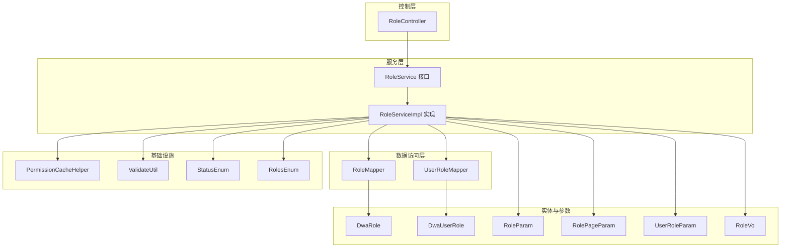
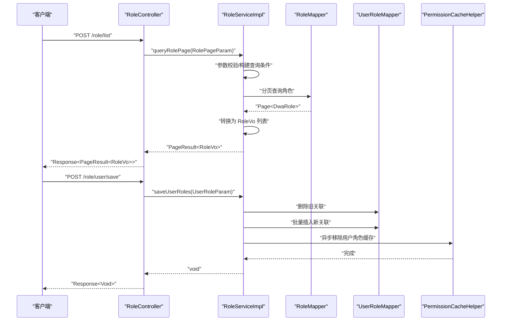
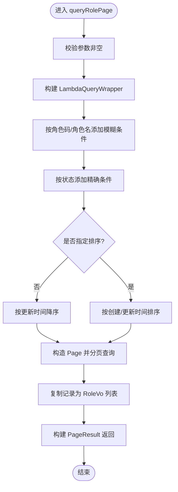
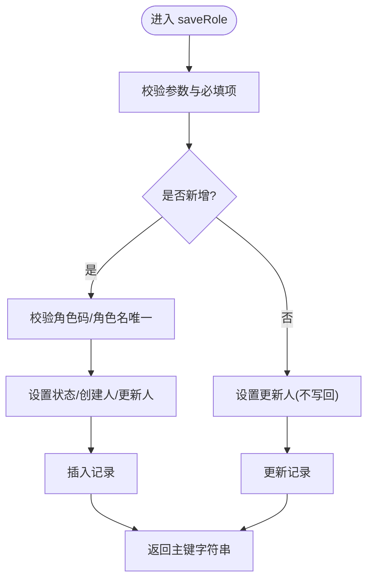
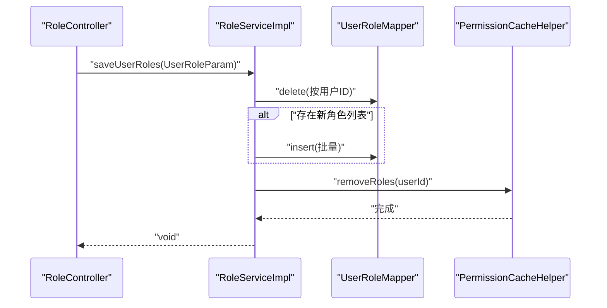
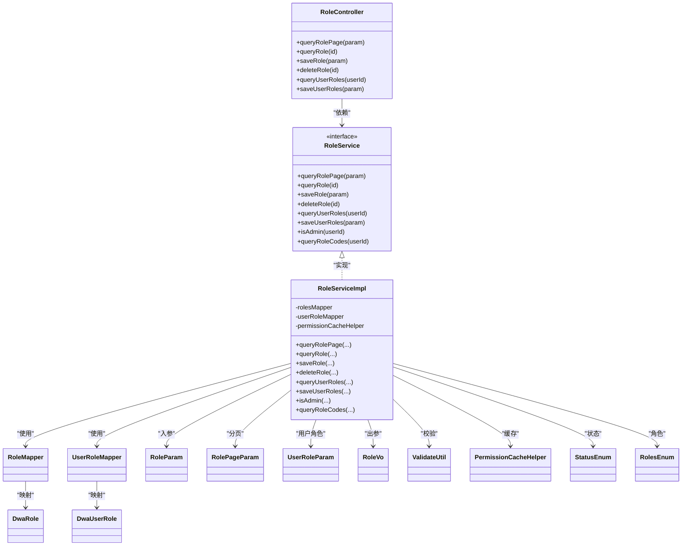

# 角色服务实现

<cite>
**本文引用的文件**
- [RoleService.java](file://src/main/java/com/dw/admin/service/RoleService.java)
- [RoleServiceImpl.java](file://src/main/java/com/dw/admin/service/impl/RoleServiceImpl.java)
- [RoleController.java](file://src/main/java/com/dw/admin/controller/RoleController.java)
- [RoleMapper.java](file://src/main/java/com/dw/admin/dao/RoleMapper.java)
- [UserRoleMapper.java](file://src/main/java/com/dw/admin/dao/UserRoleMapper.java)
- [DwaRole.java](file://src/main/java/com/dw/admin/model/entity/DwaRole.java)
- [DwaUserRole.java](file://src/main/java/com/dw/admin/model/entity/DwaUserRole.java)
- [RoleParam.java](file://src/main/java/com/dw/admin/model/param/RoleParam.java)
- [RolePageParam.java](file://src/main/java/com/dw/admin/model/param/RolePageParam.java)
- [UserRoleParam.java](file://src/main/java/com/dw/admin/model/param/UserRoleParam.java)
- [RoleVo.java](file://src/main/java/com/dw/admin/model/vo/RoleVo.java)
- [RolesEnum.java](file://src/main/java/com/dw/admin/common/enums/RolesEnum.java)
- [StatusEnum.java](file://src/main/java/com/dw/admin/common/enums/StatusEnum.java)
- [ValidateUtil.java](file://src/main/java/com/dw/admin/common/utils/ValidateUtil.java)
- [PermissionCacheHelper.java](file://src/main/java/com/dw/admin/components/permission/PermissionCacheHelper.java)
- [RoleMapper.xml](file://src/main/resources/mapper/RoleMapper.xml)
- [UserRoleMapper.xml](file://src/main/resources/mapper/UserRoleMapper.xml)
</cite>

## 目录
1. [简介](#简介)
2. [项目结构](#项目结构)
3. [核心组件](#核心组件)
4. [架构总览](#架构总览)
5. [详细组件分析](#详细组件分析)
6. [依赖关系分析](#依赖关系分析)
7. [性能考虑](#性能考虑)
8. [故障排查指南](#故障排查指南)
9. [结论](#结论)
10. [附录](#附录)

## 简介
本技术文档围绕角色服务实现展开，系统性解析 RoleService 接口设计与 RoleServiceImpl 具体实现，覆盖角色 CRUD 操作的业务逻辑、事务与一致性保障、分页查询机制与性能优化、用户角色绑定与解绑流程、角色权限计算与继承算法、服务层与数据访问层交互模式，并提供调用示例、异常处理机制、缓存策略与性能监控最佳实践，帮助后端开发者快速理解并高效扩展角色服务能力。

## 项目结构
角色服务位于服务层与控制层之间，采用 MyBatis-Plus 的 ServiceImpl 模式，结合自定义 Mapper 与 XML 映射，完成对角色与用户角色关联表的数据访问。控制层通过注解鉴权与日志切面，统一对外暴露 REST 接口。

图表来源
- [RoleController.java](file://src/main/java/com/dw/admin/controller/RoleController.java#L26-L107)
- [RoleService.java](file://src/main/java/com/dw/admin/service/RoleService.java#L20-L63)
- [RoleServiceImpl.java](file://src/main/java/com/dw/admin/service/impl/RoleServiceImpl.java#L45-L244)
- [RoleMapper.java](file://src/main/java/com/dw/admin/dao/RoleMapper.java#L14-L16)
- [UserRoleMapper.java](file://src/main/java/com/dw/admin/dao/UserRoleMapper.java#L13-L15)
- [DwaRole.java](file://src/main/java/com/dw/admin/model/entity/DwaRole.java#L24-L70)
- [DwaUserRole.java](file://src/main/java/com/dw/admin/model/entity/DwaUserRole.java#L24-L54)
- [RoleParam.java](file://src/main/java/com/dw/admin/model/param/RoleParam.java#L17-L42)
- [RolePageParam.java](file://src/main/java/com/dw/admin/model/param/RolePageParam.java#L17-L45)
- [UserRoleParam.java](file://src/main/java/com/dw/admin/model/param/UserRoleParam.java#L17-L32)
- [RoleVo.java](file://src/main/java/com/dw/admin/model/vo/RoleVo.java#L16-L61)
- [PermissionCacheHelper.java](file://src/main/java/com/dw/admin/components/permission/PermissionCacheHelper.java#L10-L27)
- [ValidateUtil.java](file://src/main/java/com/dw/admin/common/utils/ValidateUtil.java#L17-L82)
- [StatusEnum.java](file://src/main/java/com/dw/admin/common/enums/StatusEnum.java#L8-L30)
- [RolesEnum.java](file://src/main/java/com/dw/admin/common/enums/RolesEnum.java#L8-L30)

章节来源
- [RoleController.java](file://src/main/java/com/dw/admin/controller/RoleController.java#L26-L107)
- [RoleService.java](file://src/main/java/com/dw/admin/service/RoleService.java#L20-L63)
- [RoleServiceImpl.java](file://src/main/java/com/dw/admin/service/impl/RoleServiceImpl.java#L45-L244)

## 核心组件
- RoleService 接口：定义角色分页查询、详情查询、保存、删除、用户角色查询、用户角色保存、是否超级管理员、按用户查询角色码等能力。
- RoleServiceImpl 实现：基于 MyBatis-Plus 的 ServiceImpl，封装业务规则、参数校验、缓存清理与异步执行。
- 控制器 RoleController：提供 REST 接口，集成鉴权、日志与权限注解，统一返回响应包装。
- 数据访问层：RoleMapper、UserRoleMapper 提供基础 CRUD 能力；XML 映射定义通用列清单与结果映射。
- 实体与参数：DwaRole、DwaUserRole、RoleParam、RolePageParam、UserRoleParam、RoleVo 定义数据模型与输入输出。
- 枚举与工具：StatusEnum、RolesEnum、ValidateUtil 提供状态与角色常量及参数校验。

章节来源
- [RoleService.java](file://src/main/java/com/dw/admin/service/RoleService.java#L20-L63)
- [RoleServiceImpl.java](file://src/main/java/com/dw/admin/service/impl/RoleServiceImpl.java#L45-L244)
- [RoleController.java](file://src/main/java/com/dw/admin/controller/RoleController.java#L26-L107)
- [RoleMapper.java](file://src/main/java/com/dw/admin/dao/RoleMapper.java#L14-L16)
- [UserRoleMapper.java](file://src/main/java/com/dw/admin/dao/UserRoleMapper.java#L13-L15)
- [DwaRole.java](file://src/main/java/com/dw/admin/model/entity/DwaRole.java#L24-L70)
- [DwaUserRole.java](file://src/main/java/com/dw/admin/model/entity/DwaUserRole.java#L24-L54)
- [RoleParam.java](file://src/main/java/com/dw/admin/model/param/RoleParam.java#L17-L42)
- [RolePageParam.java](file://src/main/java/com/dw/admin/model/param/RolePageParam.java#L17-L45)
- [UserRoleParam.java](file://src/main/java/com/dw/admin/model/param/UserRoleParam.java#L17-L32)
- [RoleVo.java](file://src/main/java/com/dw/admin/model/vo/RoleVo.java#L16-L61)
- [StatusEnum.java](file://src/main/java/com/dw/admin/common/enums/StatusEnum.java#L8-L30)
- [RolesEnum.java](file://src/main/java/com/dw/admin/common/enums/RolesEnum.java#L8-L30)
- [ValidateUtil.java](file://src/main/java/com/dw/admin/common/utils/ValidateUtil.java#L17-L82)

## 架构总览
角色服务遵循典型的分层架构：控制层负责请求接入与安全控制，服务层承载业务逻辑与事务边界，数据访问层屏蔽数据库细节。权限缓存辅助在用户角色变更后进行异步清理，确保后续权限计算的准确性。

图表来源
- [RoleController.java](file://src/main/java/com/dw/admin/controller/RoleController.java#L36-L104)
- [RoleServiceImpl.java](file://src/main/java/com/dw/admin/service/impl/RoleServiceImpl.java#L64-L99)
- [RoleServiceImpl.java](file://src/main/java/com/dw/admin/service/impl/RoleServiceImpl.java#L188-L212)
- [RoleMapper.java](file://src/main/java/com/dw/admin/dao/RoleMapper.java#L14-L16)
- [UserRoleMapper.java](file://src/main/java/com/dw/admin/dao/UserRoleMapper.java#L13-L15)
- [PermissionCacheHelper.java](file://src/main/java/com/dw/admin/components/permission/PermissionCacheHelper.java#L25-L25)

## 详细组件分析

### 角色分页查询与排序
- 查询条件：支持角色码、角色名、状态的模糊/精确匹配；默认按更新时间倒序，可选按创建时间或更新时间升/降序。
- 分页实现：使用 MyBatis-Plus Page 对象与 LambdaQueryWrapper 组合查询，返回 PageResult 包装。
- 性能要点：条件拼接避免空值；排序字段仅在显式传入时生效，减少不必要的排序开销。

图表来源
- [RoleServiceImpl.java](file://src/main/java/com/dw/admin/service/impl/RoleServiceImpl.java#L64-L99)
- [RolePageParam.java](file://src/main/java/com/dw/admin/model/param/RolePageParam.java#L17-L45)
- [RoleMapper.xml](file://src/main/resources/mapper/RoleMapper.xml#L6-L20)

章节来源
- [RoleServiceImpl.java](file://src/main/java/com/dw/admin/service/impl/RoleServiceImpl.java#L64-L99)
- [RolePageParam.java](file://src/main/java/com/dw/admin/model/param/RolePageParam.java#L17-L45)
- [RoleMapper.xml](file://src/main/resources/mapper/RoleMapper.xml#L6-L20)

### 角色详情查询
- 输入校验：ID 非空检查。
- 查询逻辑：根据主键查询角色实体，存在则转换为 VO 返回，否则返回空。

章节来源
- [RoleServiceImpl.java](file://src/main/java/com/dw/admin/service/impl/RoleServiceImpl.java#L104-L112)
- [ValidateUtil.java](file://src/main/java/com/dw/admin/common/utils/ValidateUtil.java#L52-L60)

### 角色保存（新增/更新）
- 新增校验：当 ID 为空时，校验角色码或角色名唯一性。
- 字段处理：未设置状态则默认启用；记录创建人与更新人为当前登录用户；更新时自动清空更新人字段以避免误更新。
- 返回值：返回持久化后的主键字符串。

图表来源
- [RoleServiceImpl.java](file://src/main/java/com/dw/admin/service/impl/RoleServiceImpl.java#L118-L147)
- [RoleParam.java](file://src/main/java/com/dw/admin/model/param/RoleParam.java#L17-L42)
- [StatusEnum.java](file://src/main/java/com/dw/admin/common/enums/StatusEnum.java#L10-L11)
- [ValidateUtil.java](file://src/main/java/com/dw/admin/common/utils/ValidateUtil.java#L42-L50)

章节来源
- [RoleServiceImpl.java](file://src/main/java/com/dw/admin/service/impl/RoleServiceImpl.java#L118-L147)
- [RoleParam.java](file://src/main/java/com/dw/admin/model/param/RoleParam.java#L17-L42)
- [StatusEnum.java](file://src/main/java/com/dw/admin/common/enums/StatusEnum.java#L10-L11)

### 角色删除
- 输入校验：ID 非空检查。
- 删除逻辑：直接按主键删除，返回受影响行数。

章节来源
- [RoleServiceImpl.java](file://src/main/java/com/dw/admin/service/impl/RoleServiceImpl.java#L152-L157)
- [ValidateUtil.java](file://src/main/java/com/dw/admin/common/utils/ValidateUtil.java#L52-L60)

### 用户角色绑定与解绑
- 解绑旧关联：先按用户 ID 删除所有旧关联。
- 绑定新关联：遍历参数中的角色集合，批量插入新的用户角色关联。
- 缓存清理：异步执行权限缓存清理，确保后续权限计算准确。

图表来源
- [RoleController.java](file://src/main/java/com/dw/admin/controller/RoleController.java#L97-L104)
- [RoleServiceImpl.java](file://src/main/java/com/dw/admin/service/impl/RoleServiceImpl.java#L188-L212)
- [UserRoleParam.java](file://src/main/java/com/dw/admin/model/param/UserRoleParam.java#L17-L32)
- [UserRoleMapper.java](file://src/main/java/com/dw/admin/dao/UserRoleMapper.java#L13-L15)
- [PermissionCacheHelper.java](file://src/main/java/com/dw/admin/components/permission/PermissionCacheHelper.java#L25-L25)

章节来源
- [RoleServiceImpl.java](file://src/main/java/com/dw/admin/service/impl/RoleServiceImpl.java#L188-L212)
- [UserRoleParam.java](file://src/main/java/com/dw/admin/model/param/UserRoleParam.java#L17-L32)

### 用户角色查询与过滤
- 查询逻辑：先查用户的所有角色关联，提取角色码集合；再按角色码查询角色并按角色码升序排列；过滤掉禁用状态的角色。
- 输出：返回 RoleVo 列表。

章节来源
- [RoleServiceImpl.java](file://src/main/java/com/dw/admin/service/impl/RoleServiceImpl.java#L162-L181)
- [UserRoleMapper.java](file://src/main/java/com/dw/admin/dao/UserRoleMapper.java#L13-L15)
- [RoleMapper.java](file://src/main/java/com/dw/admin/dao/RoleMapper.java#L14-L16)
- [StatusEnum.java](file://src/main/java/com/dw/admin/common/enums/StatusEnum.java#L10-L11)

### 超级管理员判定与角色码查询
- 超级管理员判定：通过查询用户角色码，若包含“admin”角色码则返回真。
- 角色码查询：对用户角色去重后返回角色码列表。

章节来源
- [RoleServiceImpl.java](file://src/main/java/com/dw/admin/service/impl/RoleServiceImpl.java#L217-L242)
- [RolesEnum.java](file://src/main/java/com/dw/admin/common/enums/RolesEnum.java#L10-L11)

### 服务层与数据访问层交互模式
- 服务层通过 RoleMapper、UserRoleMapper 进行数据读写；使用 LambdaQueryWrapper 构建动态查询；使用 Page 对象实现分页。
- XML 映射定义了通用列清单与结果映射，确保实体属性与数据库列一一对应。

章节来源
- [RoleServiceImpl.java](file://src/main/java/com/dw/admin/service/impl/RoleServiceImpl.java#L47-L57)
- [RoleMapper.java](file://src/main/java/com/dw/admin/dao/RoleMapper.java#L14-L16)
- [UserRoleMapper.java](file://src/main/java/com/dw/admin/dao/UserRoleMapper.java#L13-L15)
- [RoleMapper.xml](file://src/main/resources/mapper/RoleMapper.xml#L6-L20)
- [UserRoleMapper.xml](file://src/main/resources/mapper/UserRoleMapper.xml#L6-L17)

### 异常处理与参数校验
- 参数校验：统一使用 ValidateUtil 工具类进行空值、空集合、空字符串校验，不符合抛出业务异常。
- 业务异常：角色重复、参数非法等场景抛出 BizException，由全局异常处理器统一处理。

章节来源
- [ValidateUtil.java](file://src/main/java/com/dw/admin/common/utils/ValidateUtil.java#L42-L82)
- [RoleServiceImpl.java](file://src/main/java/com/dw/admin/service/impl/RoleServiceImpl.java#L127-L129)

### 缓存策略与权限继承
- 缓存清理：用户角色变更后，通过 PermissionCacheHelper 异步移除该用户的权限缓存，确保下次权限计算基于最新角色。
- 权限继承：服务层未直接实现权限继承算法，但通过角色码集合与 RolesEnum 常量配合权限模块实现继承判断。

章节来源
- [RoleServiceImpl.java](file://src/main/java/com/dw/admin/service/impl/RoleServiceImpl.java#L208-L211)
- [PermissionCacheHelper.java](file://src/main/java/com/dw/admin/components/permission/PermissionCacheHelper.java#L10-L27)
- [RolesEnum.java](file://src/main/java/com/dw/admin/common/enums/RolesEnum.java#L10-L11)

## 依赖关系分析
- 控制层依赖服务接口，注入具体实现。
- 服务实现依赖 Mapper、工具类、枚举与缓存助手。
- 实体与参数类作为数据契约贯穿各层。
- XML 映射与实体注解共同保证 ORM 正确性。

图表来源
- [RoleController.java](file://src/main/java/com/dw/admin/controller/RoleController.java#L26-L107)
- [RoleService.java](file://src/main/java/com/dw/admin/service/RoleService.java#L20-L63)
- [RoleServiceImpl.java](file://src/main/java/com/dw/admin/service/impl/RoleServiceImpl.java#L45-L244)
- [RoleMapper.java](file://src/main/java/com/dw/admin/dao/RoleMapper.java#L14-L16)
- [UserRoleMapper.java](file://src/main/java/com/dw/admin/dao/UserRoleMapper.java#L13-L15)
- [DwaRole.java](file://src/main/java/com/dw/admin/model/entity/DwaRole.java#L24-L70)
- [DwaUserRole.java](file://src/main/java/com/dw/admin/model/entity/DwaUserRole.java#L24-L54)
- [RoleParam.java](file://src/main/java/com/dw/admin/model/param/RoleParam.java#L17-L42)
- [RolePageParam.java](file://src/main/java/com/dw/admin/model/param/RolePageParam.java#L17-L45)
- [UserRoleParam.java](file://src/main/java/com/dw/admin/model/param/UserRoleParam.java#L17-L32)
- [RoleVo.java](file://src/main/java/com/dw/admin/model/vo/RoleVo.java#L16-L61)
- [ValidateUtil.java](file://src/main/java/com/dw/admin/common/utils/ValidateUtil.java#L17-L82)
- [PermissionCacheHelper.java](file://src/main/java/com/dw/admin/components/permission/PermissionCacheHelper.java#L10-L27)
- [StatusEnum.java](file://src/main/java/com/dw/admin/common/enums/StatusEnum.java#L8-L30)
- [RolesEnum.java](file://src/main/java/com/dw/admin/common/enums/RolesEnum.java#L8-L30)

## 性能考虑
- 分页查询：使用 Page 对象与条件构造器，避免一次性加载全量数据；排序字段仅在必要时启用，减少索引扫描成本。
- 批量写入：用户角色保存采用批量插入，降低多次往返数据库的开销。
- 异步缓存清理：权限缓存移除通过线程池异步执行，避免阻塞主流程。
- 索引建议：角色码、角色名、状态、用户 ID 等高频查询字段建议建立合适索引以提升查询效率。
- DTO 转换：使用 BeanUtil 进行实体到 VO 的复制，注意字段映射一致性，避免多余转换开销。

[本节为通用性能指导，无需特定文件来源]

## 故障排查指南
- 参数校验失败：检查请求体中必填字段是否为空，确认校验注解与工具类使用是否正确。
- 角色重复：新增时若角色码或角色名重复会触发业务异常，需调整角色标识或检查唯一约束。
- 权限缓存未刷新：用户角色变更后需等待异步任务清理缓存，如出现权限未更新现象，可手动触发缓存清理或等待异步任务执行。
- 数据不一致：角色删除后未清理缓存可能导致权限判断异常，应确保缓存清理逻辑被调用。

章节来源
- [ValidateUtil.java](file://src/main/java/com/dw/admin/common/utils/ValidateUtil.java#L42-L82)
- [RoleServiceImpl.java](file://src/main/java/com/dw/admin/service/impl/RoleServiceImpl.java#L127-L129)
- [RoleServiceImpl.java](file://src/main/java/com/dw/admin/service/impl/RoleServiceImpl.java#L208-L211)

## 结论
角色服务实现以清晰的分层架构与规范的业务流程为核心，结合参数校验、缓存清理与异步处理，提供了稳定高效的 CRUD 能力与用户角色管理功能。通过合理的分页查询与批量写入策略，兼顾了易用性与性能。建议在生产环境中进一步完善索引策略与监控埋点，持续优化权限计算链路与缓存命中率。

[本节为总结性内容，无需特定文件来源]

## 附录

### 调用示例与接口说明
- 分页查询角色列表
  - 方法：POST /role/list
  - 入参：RolePageParam（支持角色码、角色名、状态、排序字段）
  - 出参：Response<PageResult<RoleVo>>
- 查询角色详情
  - 方法：GET /role/{id}
  - 入参：路径变量 id
  - 出参：Response<RoleVo>
- 保存角色
  - 方法：POST /role/save
  - 入参：RoleParam（角色码、角色名、状态等）
  - 出参：Response<String>（返回主键字符串）
- 删除角色
  - 方法：DELETE /role/delete/{id}
  - 入参：路径变量 id
  - 出参：Response<Void>
- 查询用户角色列表
  - 方法：GET /role/user/{userId}
  - 入参：路径变量 userId
  - 出参：Response<List<RoleVo>>
- 保存用户角色
  - 方法：POST /role/user/save
  - 入参：UserRoleParam（用户ID与角色列表）
  - 出参：Response<Void>

章节来源
- [RoleController.java](file://src/main/java/com/dw/admin/controller/RoleController.java#L36-L104)
- [RolePageParam.java](file://src/main/java/com/dw/admin/model/param/RolePageParam.java#L17-L45)
- [RoleParam.java](file://src/main/java/com/dw/admin/model/param/RoleParam.java#L17-L42)
- [UserRoleParam.java](file://src/main/java/com/dw/admin/model/param/UserRoleParam.java#L17-L32)