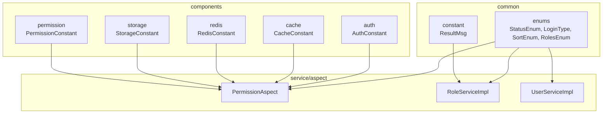
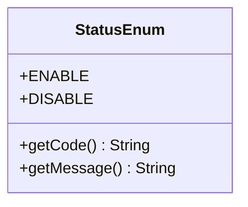
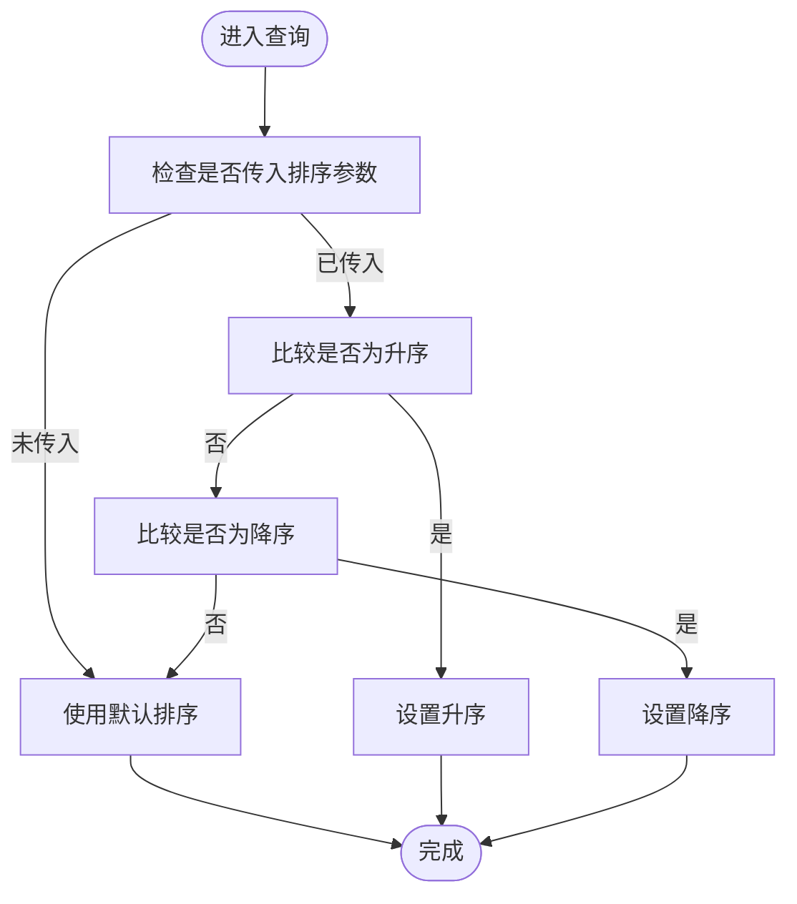
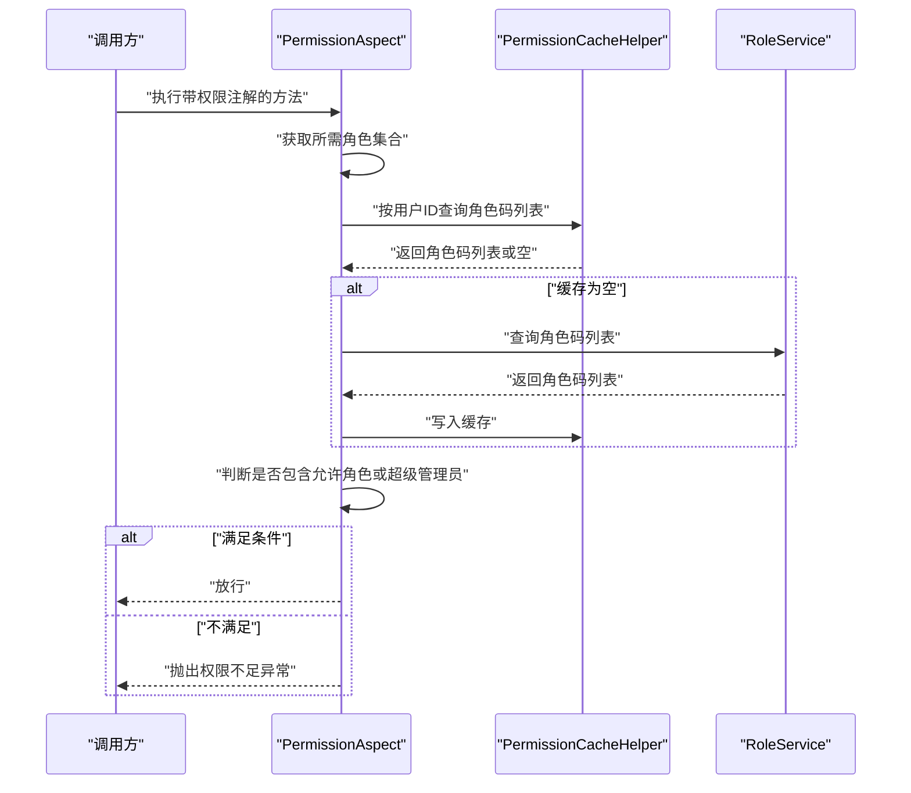
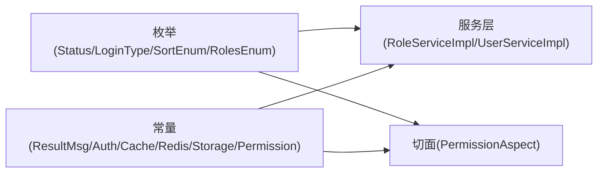

# 枚举与常量

<cite>
**本文引用的文件**
- [StatusEnum.java](file://src/main/java/com/dw/admin/common/enums/StatusEnum.java)
- [LoginType.java](file://src/main/java/com/dw/admin/common/enums/LoginType.java)
- [RolesEnum.java](file://src/main/java/com/dw/admin/common/enums/RolesEnum.java)
- [SortEnum.java](file://src/main/java/com/dw/admin/common/enums/SortEnum.java)
- [ResultMsg.java](file://src/main/java/com/dw/admin/common/constant/ResultMsg.java)
- [AuthConstant.java](file://src/main/java/com/dw/admin/components/auth/AuthConstant.java)
- [CacheConstant.java](file://src/main/java/com/dw/admin/components/cache/CacheConstant.java)
- [RedisConstant.java](file://src/main/java/com/dw/admin/components/redis/RedisConstant.java)
- [StorageConstant.java](file://src/main/java/com/dw/admin/components/storage/StorageConstant.java)
- [PermissionConstant.java](file://src/main/java/com/dw/admin/components/permission/PermissionConstant.java)
- [PermissionAspect.java](file://src/main/java/com/dw/admin/components/permission/PermissionAspect.java)
- [RoleServiceImpl.java](file://src/main/java/com/dw/admin/service/impl/RoleServiceImpl.java)
- [UserServiceImpl.java](file://src/main/java/com/dw/admin/service/impl/UserServiceImpl.java)
</cite>

## 目录
1. [简介](#简介)
2. [项目结构](#项目结构)
3. [核心组件](#核心组件)
4. [架构总览](#架构总览)
5. [详细组件分析](#详细组件分析)
6. [依赖关系分析](#依赖关系分析)
7. [性能考量](#性能考量)
8. [故障排查指南](#故障排查指南)
9. [结论](#结论)
10. [附录](#附录)

## 简介
本文件聚焦于系统的“枚举与常量”子系统，系统性梳理状态枚举、登录类型枚举、排序枚举、角色枚举等的设计理念与使用场景；阐述常量类的组织结构与命名规范；总结常量的分类管理（结果消息、鉴权/缓存/存储/权限常量等）；给出扩展与维护指南，并讨论国际化与本地化的落地建议。文档同时提供关键流程的时序图与类图，帮助开发者快速理解与正确使用。

## 项目结构
围绕“枚举与常量”的核心位置如下：
- 枚举集中于 common/enums：状态、登录类型、排序、角色
- 常量集中于 common/constant 与各组件包下：结果消息、鉴权、缓存、Redis、存储、权限
- 使用点主要分布在服务层与切面层：如角色查询、排序控制、权限校验等

图表来源
- [StatusEnum.java](file://src/main/java/com/dw/admin/common/enums/StatusEnum.java#L1-L31)
- [LoginType.java](file://src/main/java/com/dw/admin/common/enums/LoginType.java#L1-L23)
- [RolesEnum.java](file://src/main/java/com/dw/admin/common/enums/RolesEnum.java#L1-L31)
- [SortEnum.java](file://src/main/java/com/dw/admin/common/enums/SortEnum.java#L1-L31)
- [ResultMsg.java](file://src/main/java/com/dw/admin/common/constant/ResultMsg.java#L1-L20)
- [AuthConstant.java](file://src/main/java/com/dw/admin/components/auth/AuthConstant.java#L1-L51)
- [CacheConstant.java](file://src/main/java/com/dw/admin/components/cache/CacheConstant.java#L1-L26)
- [RedisConstant.java](file://src/main/java/com/dw/admin/components/redis/RedisConstant.java#L1-L21)
- [StorageConstant.java](file://src/main/java/com/dw/admin/components/storage/StorageConstant.java#L1-L27)
- [PermissionConstant.java](file://src/main/java/com/dw/admin/components/permission/PermissionConstant.java#L1-L42)
- [PermissionAspect.java](file://src/main/java/com/dw/admin/components/permission/PermissionAspect.java#L1-L91)
- [RoleServiceImpl.java](file://src/main/java/com/dw/admin/service/impl/RoleServiceImpl.java#L1-L245)
- [UserServiceImpl.java](file://src/main/java/com/dw/admin/service/impl/UserServiceImpl.java#L1-L270)

章节来源
- [StatusEnum.java](file://src/main/java/com/dw/admin/common/enums/StatusEnum.java#L1-L31)
- [LoginType.java](file://src/main/java/com/dw/admin/common/enums/LoginType.java#L1-L23)
- [RolesEnum.java](file://src/main/java/com/dw/admin/common/enums/RolesEnum.java#L1-L31)
- [SortEnum.java](file://src/main/java/com/dw/admin/common/enums/SortEnum.java#L1-L31)
- [ResultMsg.java](file://src/main/java/com/dw/admin/common/constant/ResultMsg.java#L1-L20)
- [AuthConstant.java](file://src/main/java/com/dw/admin/components/auth/AuthConstant.java#L1-L51)
- [CacheConstant.java](file://src/main/java/com/dw/admin/components/cache/CacheConstant.java#L1-L26)
- [RedisConstant.java](file://src/main/java/com/dw/admin/components/redis/RedisConstant.java#L1-L21)
- [StorageConstant.java](file://src/main/java/com/dw/admin/components/storage/StorageConstant.java#L1-L27)
- [PermissionConstant.java](file://src/main/java/com/dw/admin/components/permission/PermissionConstant.java#L1-L42)
- [PermissionAspect.java](file://src/main/java/com/dw/admin/components/permission/PermissionAspect.java#L1-L91)
- [RoleServiceImpl.java](file://src/main/java/com/dw/admin/service/impl/RoleServiceImpl.java#L1-L245)
- [UserServiceImpl.java](file://src/main/java/com/dw/admin/service/impl/UserServiceImpl.java#L1-L270)

## 核心组件
- 状态枚举：用于统一状态编码与展示文案，典型字段包含 code 与 message，便于数据库持久化与前端展示。
- 登录类型枚举：标识登录方式（如邮箱/用户名），便于登录策略选择与参数校验。
- 排序枚举：统一升序/降序标识，避免魔法字符串，提升可读性与一致性。
- 角色枚举：定义系统内角色标识与显示名，支撑权限校验与角色分配。
- 结果消息常量：封装通用的成功/失败/鉴权失败等提示文本，便于统一返回消息。
- 鉴权/缓存/存储/权限常量：集中配置属性前缀、缓存键前缀、过期时间、存储提供商等，确保跨组件一致的行为与配置。

章节来源
- [StatusEnum.java](file://src/main/java/com/dw/admin/common/enums/StatusEnum.java#L1-L31)
- [LoginType.java](file://src/main/java/com/dw/admin/common/enums/LoginType.java#L1-L23)
- [SortEnum.java](file://src/main/java/com/dw/admin/common/enums/SortEnum.java#L1-L31)
- [RolesEnum.java](file://src/main/java/com/dw/admin/common/enums/RolesEnum.java#L1-L31)
- [ResultMsg.java](file://src/main/java/com/dw/admin/common/constant/ResultMsg.java#L1-L20)
- [AuthConstant.java](file://src/main/java/com/dw/admin/components/auth/AuthConstant.java#L1-L51)
- [CacheConstant.java](file://src/main/java/com/dw/admin/components/cache/CacheConstant.java#L1-L26)
- [RedisConstant.java](file://src/main/java/com/dw/admin/components/redis/RedisConstant.java#L1-L21)
- [StorageConstant.java](file://src/main/java/com/dw/admin/components/storage/StorageConstant.java#L1-L27)
- [PermissionConstant.java](file://src/main/java/com/dw/admin/components/permission/PermissionConstant.java#L1-L42)

## 架构总览
枚举与常量在系统中的作用：
- 枚举作为“领域值对象”，在服务层与切面层被广泛引用，用于条件判断、排序控制、权限判定等。
- 常量作为“配置与约定”，贯穿鉴权、缓存、存储、权限等组件，保证行为一致性与可配置性。

```mermaid
classDiagram
class StatusEnum {
+getCode() String
+getMessage() String
}
class LoginType {
+getCode() String
}
class SortEnum {
+getCode() String
+getMessage() String
}
class RolesEnum {
+getCode() String
+getMessage() String
}
class ResultMsg {
+SUCCESS String
+FAIL String
+FAIL_CHECK_TOKEN String
}
class AuthConstant {
+AUTH_PROPERTIES_PREFIX String
+TOKEN_KEY String
+DEFAULT_EXPIRE_TIME long
}
class CacheConstant {
+CACHE_PROPERTIES_PREFIX String
+CACHE_TYPE_REDIS String
}
class RedisConstant {
+REDIS_PROPERTIES_PREFIX String
}
class StorageConstant {
+STORAGE_PROPERTIES_PREFIX String
+PROVIDER_ALIYUN_OSS String
}
class PermissionConstant {
+PERMISSION_PROPERTIES_PREFIX String
+PERMISSION_ROLE_KEY_PREFIX String
}
StatusEnum <.. RoleServiceImpl : "状态过滤"
SortEnum <.. RoleServiceImpl : "排序控制"
SortEnum <.. UserServiceImpl : "排序控制"
RolesEnum <.. PermissionAspect : "角色校验"
AuthConstant <.. PermissionAspect : "切面顺序/键前缀"
CacheConstant <.. PermissionAspect : "缓存类型"
RedisConstant <.. PermissionAspect : "Redis配置前缀"
StorageConstant <.. PermissionAspect : "存储提供商"
PermissionConstant <.. PermissionAspect : "权限配置/键前缀"
```

图表来源
- [StatusEnum.java](file://src/main/java/com/dw/admin/common/enums/StatusEnum.java#L1-L31)
- [LoginType.java](file://src/main/java/com/dw/admin/common/enums/LoginType.java#L1-L23)
- [SortEnum.java](file://src/main/java/com/dw/admin/common/enums/SortEnum.java#L1-L31)
- [RolesEnum.java](file://src/main/java/com/dw/admin/common/enums/RolesEnum.java#L1-L31)
- [ResultMsg.java](file://src/main/java/com/dw/admin/common/constant/ResultMsg.java#L1-L20)
- [AuthConstant.java](file://src/main/java/com/dw/admin/components/auth/AuthConstant.java#L1-L51)
- [CacheConstant.java](file://src/main/java/com/dw/admin/components/cache/CacheConstant.java#L1-L26)
- [RedisConstant.java](file://src/main/java/com/dw/admin/components/redis/RedisConstant.java#L1-L21)
- [StorageConstant.java](file://src/main/java/com/dw/admin/components/storage/StorageConstant.java#L1-L27)
- [PermissionConstant.java](file://src/main/java/com/dw/admin/components/permission/PermissionConstant.java#L1-L42)
- [PermissionAspect.java](file://src/main/java/com/dw/admin/components/permission/PermissionAspect.java#L1-L91)
- [RoleServiceImpl.java](file://src/main/java/com/dw/admin/service/impl/RoleServiceImpl.java#L1-L245)
- [UserServiceImpl.java](file://src/main/java/com/dw/admin/service/impl/UserServiceImpl.java#L1-L270)

## 详细组件分析

### 状态枚举（StatusEnum）
- 设计理念：以 code 表示持久化值，message 提供展示文案，兼顾数据库存储与界面显示。
- 取值范围：启用/禁用两类，便于状态筛选与过滤。
- 典型使用：服务层按状态过滤数据、默认状态赋值等。

图表来源
- [StatusEnum.java](file://src/main/java/com/dw/admin/common/enums/StatusEnum.java#L1-L31)

章节来源
- [StatusEnum.java](file://src/main/java/com/dw/admin/common/enums/StatusEnum.java#L1-L31)
- [RoleServiceImpl.java](file://src/main/java/com/dw/admin/service/impl/RoleServiceImpl.java#L134-L136)
- [RoleServiceImpl.java](file://src/main/java/com/dw/admin/service/impl/RoleServiceImpl.java#L179-L180)

### 登录类型枚举（LoginType）
- 设计理念：统一登录入口类型，便于根据类型选择不同的查询与校验策略。
- 取值范围：邮箱、用户名两类。
- 典型使用：登录参数解析与策略分支。

章节来源
- [LoginType.java](file://src/main/java/com/dw/admin/common/enums/LoginType.java#L1-L23)

### 排序枚举（SortEnum）
- 设计理念：统一排序方向标识，避免魔法字符串，提升可读性与一致性。
- 取值范围：升序/降序两类。
- 典型使用：分页查询时根据参数选择排序方向。

图表来源
- [SortEnum.java](file://src/main/java/com/dw/admin/common/enums/SortEnum.java#L1-L31)
- [RoleServiceImpl.java](file://src/main/java/com/dw/admin/service/impl/RoleServiceImpl.java#L77-L92)
- [UserServiceImpl.java](file://src/main/java/com/dw/admin/service/impl/UserServiceImpl.java#L244-L259)

章节来源
- [SortEnum.java](file://src/main/java/com/dw/admin/common/enums/SortEnum.java#L1-L31)
- [RoleServiceImpl.java](file://src/main/java/com/dw/admin/service/impl/RoleServiceImpl.java#L77-L92)
- [UserServiceImpl.java](file://src/main/java/com/dw/admin/service/impl/UserServiceImpl.java#L244-L259)

### 角色枚举（RolesEnum）
- 设计理念：定义系统内角色标识与显示名，支撑权限校验与角色分配。
- 取值范围：超级管理员、普通用户两类。
- 典型使用：权限切面中对角色集合进行包含性判断，超级管理员直接放行。

图表来源
- [RolesEnum.java](file://src/main/java/com/dw/admin/common/enums/RolesEnum.java#L1-L31)
- [PermissionAspect.java](file://src/main/java/com/dw/admin/components/permission/PermissionAspect.java#L52-L87)
- [RoleServiceImpl.java](file://src/main/java/com/dw/admin/service/impl/RoleServiceImpl.java#L218-L228)

章节来源
- [RolesEnum.java](file://src/main/java/com/dw/admin/common/enums/RolesEnum.java#L1-L31)
- [PermissionAspect.java](file://src/main/java/com/dw/admin/components/permission/PermissionAspect.java#L52-L87)
- [RoleServiceImpl.java](file://src/main/java/com/dw/admin/service/impl/RoleServiceImpl.java#L218-L228)

### 结果消息常量（ResultMsg）
- 设计理念：集中管理通用返回消息，便于统一提示与国际化扩展。
- 常见取值：成功、失败、参数校验失败、鉴权失败等。
- 典型使用：异常处理与业务返回消息构造。

章节来源
- [ResultMsg.java](file://src/main/java/com/dw/admin/common/constant/ResultMsg.java#L1-L20)

### 鉴权常量（AuthConstant）
- 设计理念：集中管理鉴权相关配置与键前缀，保证鉴权组件行为一致。
- 关键项：配置前缀、开关、缓存类型、过滤器顺序、令牌头、令牌前缀、默认密钥、过期时间、Redis键前缀等。
- 典型使用：鉴权切面顺序、令牌头解析、缓存类型判断、Redis键拼接等。

章节来源
- [AuthConstant.java](file://src/main/java/com/dw/admin/components/auth/AuthConstant.java#L1-L51)
- [PermissionAspect.java](file://src/main/java/com/dw/admin/components/permission/PermissionAspect.java#L34-L38)

### 缓存常量（CacheConstant）
- 设计理念：统一缓存配置前缀与缓存类型标识，便于切换缓存实现。
- 关键项：配置前缀、开关、缓存类型（Redis/本地）等。
- 典型使用：缓存组件的条件装配与类型判断。

章节来源
- [CacheConstant.java](file://src/main/java/com/dw/admin/components/cache/CacheConstant.java#L1-L26)

### Redis 常量（RedisConstant）
- 设计理念：统一 Redis 配置前缀与关键属性键，便于集中管理。
- 关键项：配置前缀、开关、URL 等。
- 典型使用：Redis 组件的配置绑定与连接建立。

章节来源
- [RedisConstant.java](file://src/main/java/com/dw/admin/components/redis/RedisConstant.java#L1-L21)

### 存储常量（StorageConstant）
- 设计理念：统一存储配置前缀与提供商标识，便于多云存储切换。
- 关键项：配置前缀、提供商键、阿里云 OSS、腾讯云 COS、本地存储等。
- 典型使用：存储工厂选择具体实现。

章节来源
- [StorageConstant.java](file://src/main/java/com/dw/admin/components/storage/StorageConstant.java#L1-L27)

### 权限常量（PermissionConstant）
- 设计理念：统一权限组件配置前缀、缓存类型、切面顺序、键前缀与过期时间。
- 关键项：配置前缀、开关、缓存类型（Redis/本地）、切面顺序、角色/权限键前缀、默认过期时间等。
- 典型使用：权限切面顺序、缓存类型判断、键前缀拼接等。

章节来源
- [PermissionConstant.java](file://src/main/java/com/dw/admin/components/permission/PermissionConstant.java#L1-L42)
- [PermissionAspect.java](file://src/main/java/com/dw/admin/components/permission/PermissionAspect.java#L34-L38)

## 依赖关系分析
- 枚举与常量之间的耦合度低，通过字符串 code/message 进行协作，降低紧耦合风险。
- 服务层与切面层对枚举/常量的依赖集中在“条件判断、排序控制、权限校验、配置读取”等场景。
- 建议：新增枚举/常量时，优先在统一包下维护，避免分散定义导致维护成本上升。

图表来源
- [StatusEnum.java](file://src/main/java/com/dw/admin/common/enums/StatusEnum.java#L1-L31)
- [LoginType.java](file://src/main/java/com/dw/admin/common/enums/LoginType.java#L1-L23)
- [SortEnum.java](file://src/main/java/com/dw/admin/common/enums/SortEnum.java#L1-L31)
- [RolesEnum.java](file://src/main/java/com/dw/admin/common/enums/RolesEnum.java#L1-L31)
- [ResultMsg.java](file://src/main/java/com/dw/admin/common/constant/ResultMsg.java#L1-L20)
- [AuthConstant.java](file://src/main/java/com/dw/admin/components/auth/AuthConstant.java#L1-L51)
- [CacheConstant.java](file://src/main/java/com/dw/admin/components/cache/CacheConstant.java#L1-L26)
- [RedisConstant.java](file://src/main/java/com/dw/admin/components/redis/RedisConstant.java#L1-L21)
- [StorageConstant.java](file://src/main/java/com/dw/admin/components/storage/StorageConstant.java#L1-L27)
- [PermissionConstant.java](file://src/main/java/com/dw/admin/components/permission/PermissionConstant.java#L1-L42)
- [PermissionAspect.java](file://src/main/java/com/dw/admin/components/permission/PermissionAspect.java#L1-L91)
- [RoleServiceImpl.java](file://src/main/java/com/dw/admin/service/impl/RoleServiceImpl.java#L1-L245)
- [UserServiceImpl.java](file://src/main/java/com/dw/admin/service/impl/UserServiceImpl.java#L1-L270)

## 性能考量
- 枚举与常量均为静态不可变定义，访问开销极低，适合高频使用场景。
- 在权限校验与排序控制中，应避免重复解析字符串，优先使用枚举 code 进行比较。
- 对于需要频繁读取的配置项（如过期时间、键前缀），建议在组件初始化时读取一次并缓存，减少重复 IO。
- 对于缓存键拼接，建议统一在常量中定义前缀，避免字符串拼接错误与重复计算。

## 故障排查指南
- 枚举/常量误用：若出现“未知状态/排序方向/角色码”等问题，检查调用处是否使用了正确的枚举值或常量字符串。
- 配置不生效：若鉴权/缓存/存储/权限行为异常，检查对应常量的配置前缀与属性键是否与 application.yml 中一致。
- 权限校验失败：确认 PermissionAspect 的切面顺序、缓存类型、角色键前缀与实际存储一致。
- 排序无效：确认 SortEnum 的 code 与请求参数一致，大小写敏感需注意。

章节来源
- [PermissionAspect.java](file://src/main/java/com/dw/admin/components/permission/PermissionAspect.java#L34-L38)
- [AuthConstant.java](file://src/main/java/com/dw/admin/components/auth/AuthConstant.java#L1-L51)
- [CacheConstant.java](file://src/main/java/com/dw/admin/components/cache/CacheConstant.java#L1-L26)
- [RedisConstant.java](file://src/main/java/com/dw/admin/components/redis/RedisConstant.java#L1-L21)
- [StorageConstant.java](file://src/main/java/com/dw/admin/components/storage/StorageConstant.java#L1-L27)
- [PermissionConstant.java](file://src/main/java/com/dw/admin/components/permission/PermissionConstant.java#L1-L42)

## 结论
本系统的“枚举与常量”子系统通过清晰的职责划分与统一的命名规范，有效提升了代码的一致性与可维护性。枚举用于表达领域内的离散取值，常量用于表达跨组件的配置与约定。结合权限切面与服务层的实际使用，形成了从配置到运行时行为的闭环。后续扩展应遵循现有命名与组织规范，确保变更可控、影响可预期。

## 附录

### 枚举与常量扩展与维护指南
- 新增枚举
  - 放置于 common/enums 下，保持 code/message 字段，提供 getter 方法。
  - 在使用处引入并替换魔法字符串，避免硬编码。
- 新增常量
  - 放置于对应组件包下的 constant 目录，统一前缀与命名风格。
  - 在组件配置类中通过前缀绑定，避免分散定义。
- 国际化与本地化
  - 枚举 message 建议改为“键名+占位符”的形式，由国际化框架统一解析。
  - 结果消息常量建议拆分为“键名”与“默认文案”，配合消息源实现多语言。
- 版本演进
  - 枚举/常量变更需评估兼容性，必要时提供迁移策略与过渡期处理。
  - 对外暴露的 code/message 应保持稳定性，避免破坏下游集成。

### 最佳实践清单
- 使用枚举替代字符串常量，提升类型安全与可读性。
- 将配置集中于常量类，通过前缀与键名统一管理。
- 在权限与排序等关键路径上，优先使用枚举 code 进行比较。
- 对高频访问的配置项进行缓存，减少重复读取。
- 为国际化预留空间，避免直接硬编码文案。