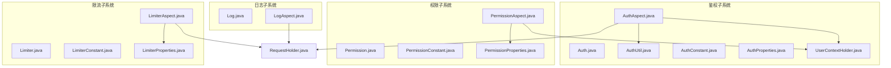
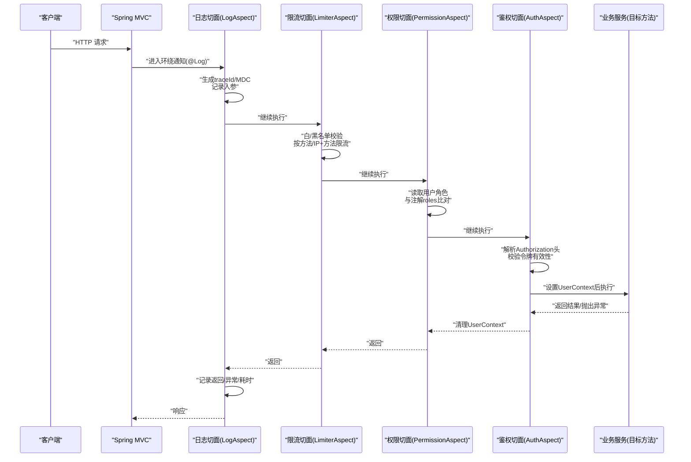
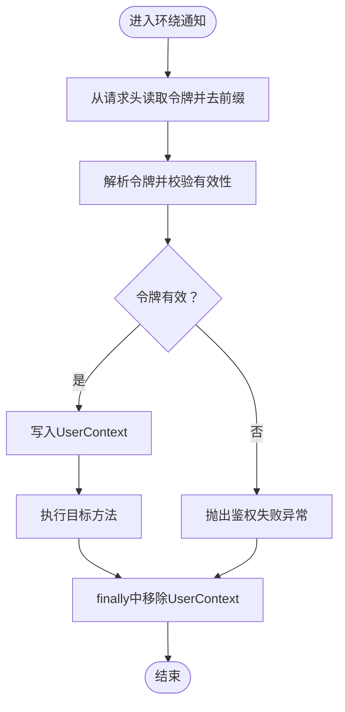
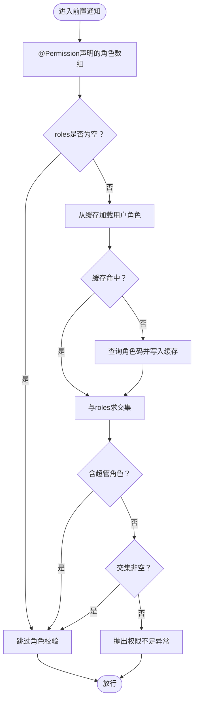
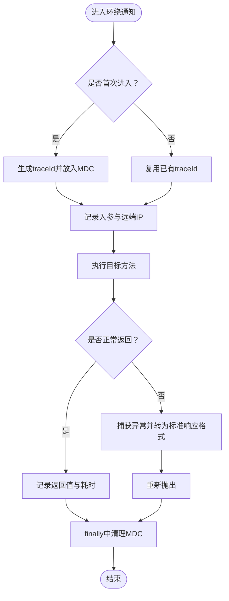
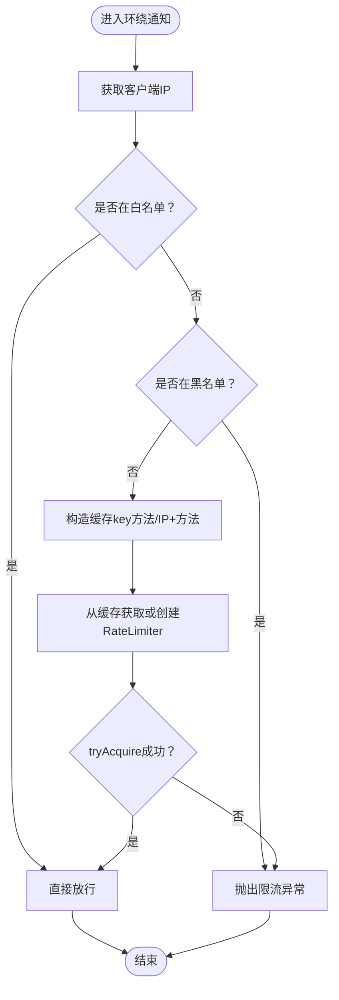
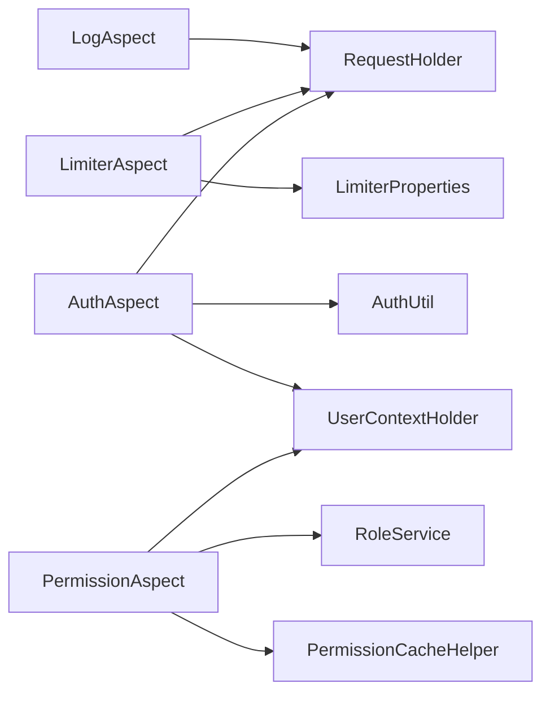

# AOP切面设计

<cite>
**本文引用的文件**
- [AuthAspect.java](file://src/main/java/com/dw/admin/components/auth/AuthAspect.java)
- [Auth.java](file://src/main/java/com/dw/admin/components/auth/Auth.java)
- [AuthConstant.java](file://src/main/java/com/dw/admin/components/auth/AuthConstant.java)
- [AuthProperties.java](file://src/main/java/com/dw/admin/components/auth/AuthProperties.java)
- [AuthUtil.java](file://src/main/java/com/dw/admin/components/auth/AuthUtil.java)
- [UserContextHolder.java](file://src/main/java/com/dw/admin/components/auth/UserContextHolder.java)
- [RequestHolder.java](file://src/main/java/com/dw/admin/common/utils/RequestHolder.java)
- [LimiterAspect.java](file://src/main/java/com/dw/admin/components/limiter/LimiterAspect.java)
- [Limiter.java](file://src/main/java/com/dw/admin/components/limiter/Limiter.java)
- [LimiterConstant.java](file://src/main/java/com/dw/admin/components/limiter/LimiterConstant.java)
- [LimiterProperties.java](file://src/main/java/com/dw/admin/components/limiter/LimiterProperties.java)
- [LogAspect.java](file://src/main/java/com/dw/admin/components/log/LogAspect.java)
- [Log.java](file://src/main/java/com/dw/admin/components/log/Log.java)
- [PermissionAspect.java](file://src/main/java/com/dw/admin/components/permission/PermissionAspect.java)
- [Permission.java](file://src/main/java/com/dw/admin/components/permission/Permission.java)
- [PermissionConstant.java](file://src/main/java/com/dw/admin/components/permission/PermissionConstant.java)
- [PermissionProperties.java](file://src/main/java/com/dw/admin/components/permission/PermissionProperties.java)
</cite>

## 目录
1. [引言](#引言)
2. [项目结构](#项目结构)
3. [核心组件](#核心组件)
4. [架构总览](#架构总览)
5. [详细组件分析](#详细组件分析)
6. [依赖关系分析](#依赖关系分析)
7. [性能考虑](#性能考虑)
8. [故障排查指南](#故障排查指南)
9. [结论](#结论)
10. [附录：自定义切面开发指南与最佳实践](#附录自定义切面开发指南与最佳实践)

## 引言
本设计文档围绕DW后台管理系统的AOP切面体系，系统阐述权限控制、日志追踪、限流与鉴权等横切关注点的实现原理、通知类型与切入点表达式，并给出配置方式、作用与优势、调试与性能优化建议，以及自定义切面的开发指南与最佳实践。通过注解驱动与切面织入，将安全、可观测性与稳定性能力以非侵入方式融入业务流程。

## 项目结构
系统采用按功能域分层的模块化组织，AOP相关代码集中在components目录下，分别对应鉴权、权限、日志与限流四个子系统，每个子系统包含：
- 注解：用于声明式启用切面能力
- 切面：基于AspectJ实现的通知逻辑
- 常量与配置：集中管理开关、顺序、键前缀与默认行为
- 工具与上下文：提供解析、缓存、线程上下文传递等支撑

图表来源
- [AuthAspect.java](file://src/main/java/com/dw/admin/components/auth/AuthAspect.java#L1-L62)
- [Auth.java](file://src/main/java/com/dw/admin/components/auth/Auth.java#L1-L17)
- [AuthUtil.java](file://src/main/java/com/dw/admin/components/auth/AuthUtil.java#L1-L101)
- [AuthConstant.java](file://src/main/java/com/dw/admin/components/auth/AuthConstant.java#L1-L51)
- [AuthProperties.java](file://src/main/java/com/dw/admin/components/auth/AuthProperties.java#L1-L36)
- [UserContextHolder.java](file://src/main/java/com/dw/admin/components/auth/UserContextHolder.java#L1-L46)
- [PermissionAspect.java](file://src/main/java/com/dw/admin/components/permission/PermissionAspect.java#L1-L91)
- [Permission.java](file://src/main/java/com/dw/admin/components/permission/Permission.java#L1-L23)
- [PermissionConstant.java](file://src/main/java/com/dw/admin/components/permission/PermissionConstant.java#L1-L42)
- [PermissionProperties.java](file://src/main/java/com/dw/admin/components/permission/PermissionProperties.java#L1-L31)
- [LogAspect.java](file://src/main/java/com/dw/admin/components/log/LogAspect.java#L1-L143)
- [Log.java](file://src/main/java/com/dw/admin/components/log/Log.java#L1-L19)
- [LimiterAspect.java](file://src/main/java/com/dw/admin/components/limiter/LimiterAspect.java#L1-L87)
- [Limiter.java](file://src/main/java/com/dw/admin/components/limiter/Limiter.java#L1-L33)
- [LimiterConstant.java](file://src/main/java/com/dw/admin/components/limiter/LimiterConstant.java#L1-L21)
- [LimiterProperties.java](file://src/main/java/com/dw/admin/components/limiter/LimiterProperties.java#L1-L27)
- [RequestHolder.java](file://src/main/java/com/dw/admin/common/utils/RequestHolder.java#L1-L135)

章节来源
- [AuthAspect.java](file://src/main/java/com/dw/admin/components/auth/AuthAspect.java#L1-L62)
- [PermissionAspect.java](file://src/main/java/com/dw/admin/components/permission/PermissionAspect.java#L1-L91)
- [LogAspect.java](file://src/main/java/com/dw/admin/components/log/LogAspect.java#L1-L143)
- [LimiterAspect.java](file://src/main/java/com/dw/admin/components/limiter/LimiterAspect.java#L1-L87)

## 核心组件
- 鉴权切面（AuthAspect）：基于注解进行环绕通知，解析请求头中的令牌，校验有效性并将用户上下文注入线程本地变量，贯穿整个目标方法执行周期。
- 权限切面（PermissionAspect）：基于注解进行前置通知，读取用户角色集合并与注解声明的角色白名单比对，支持超管放行与缓存加速。
- 日志切面（LogAspect）：基于注解进行环绕通知，统一采集入参、返回值、异常与耗时，结合MDC生成全局追踪ID，便于链路定位。
- 限流切面（LimiterAspect）：基于注解进行环绕通知，支持按方法或按IP+方法两种粒度的令牌桶限流，内置白/黑名单策略与动态RateLimiter缓存。

章节来源
- [AuthAspect.java](file://src/main/java/com/dw/admin/components/auth/AuthAspect.java#L28-L59)
- [PermissionAspect.java](file://src/main/java/com/dw/admin/components/permission/PermissionAspect.java#L49-L87)
- [LogAspect.java](file://src/main/java/com/dw/admin/components/log/LogAspect.java#L46-L87)
- [LimiterAspect.java](file://src/main/java/com/dw/admin/components/limiter/LimiterAspect.java#L50-L78)

## 架构总览
下图展示了AOP切面在请求生命周期中的织入位置与协作关系，包括通知类型、切入点表达式与关键依赖：

图表来源
- [LogAspect.java](file://src/main/java/com/dw/admin/components/log/LogAspect.java#L50-L87)
- [LimiterAspect.java](file://src/main/java/com/dw/admin/components/limiter/LimiterAspect.java#L55-L78)
- [PermissionAspect.java](file://src/main/java/com/dw/admin/components/permission/PermissionAspect.java#L52-L87)
- [AuthAspect.java](file://src/main/java/com/dw/admin/components/auth/AuthAspect.java#L32-L59)

## 详细组件分析

### 鉴权切面（AuthAspect）
- 实现原理
  - 环绕通知在目标方法前后执行，优先从请求头中提取令牌并去除前缀，随后调用工具类解析令牌，校验通过后将用户信息写入线程上下文；最后在finally中清理上下文，避免内存泄漏。
  - 令牌解析失败或无效时抛出业务异常，由全局异常处理器统一返回。
- 通知类型与切入点
  - 通知类型：环绕通知（@Around）
  - 切入点表达式：匹配带有@Auth注解的方法
- 关键依赖
  - 请求头工具：读取Authorization头
  - 用户上下文：TransmittableThreadLocal线程安全存储
  - 鉴权工具：JWT解析与令牌缓存校验
- 配置与开关
  - 通过@Enable注解控制是否启用（注解本身无@Enable，但可参考其他子系统使用条件注解的方式进行扩展）

图表来源
- [AuthAspect.java](file://src/main/java/com/dw/admin/components/auth/AuthAspect.java#L32-L59)
- [RequestHolder.java](file://src/main/java/com/dw/admin/common/utils/RequestHolder.java#L127-L133)
- [UserContextHolder.java](file://src/main/java/com/dw/admin/components/auth/UserContextHolder.java#L21-L33)
- [AuthUtil.java](file://src/main/java/com/dw/admin/components/auth/AuthUtil.java#L49-L71)

章节来源
- [AuthAspect.java](file://src/main/java/com/dw/admin/components/auth/AuthAspect.java#L1-L62)
- [Auth.java](file://src/main/java/com/dw/admin/components/auth/Auth.java#L1-L17)
- [AuthConstant.java](file://src/main/java/com/dw/admin/components/auth/AuthConstant.java#L1-L51)
- [AuthProperties.java](file://src/main/java/com/dw/admin/components/auth/AuthProperties.java#L1-L36)
- [AuthUtil.java](file://src/main/java/com/dw/admin/components/auth/AuthUtil.java#L1-L101)
- [UserContextHolder.java](file://src/main/java/com/dw/admin/components/auth/UserContextHolder.java#L1-L46)
- [RequestHolder.java](file://src/main/java/com/dw/admin/common/utils/RequestHolder.java#L1-L135)

### 权限切面（PermissionAspect）
- 实现原理
  - 前置通知在目标方法执行前进行角色权限校验，优先从缓存读取用户角色列表，若为空则查询持久化并回填缓存；超管角色直接放行，否则要求交集非空。
- 通知类型与切入点
  - 通知类型：前置通知（@Before）
  - 切入点表达式：匹配带有@Permission注解的方法
- 关键依赖
  - 用户上下文：获取当前用户ID
  - 角色服务：查询用户角色码
  - 权限缓存：支持本地或Redis缓存策略
- 配置与开关
  - 通过@Enable注解控制是否启用（注解本身无@Enable，但可参考其他子系统使用条件注解的方式进行扩展）

图表来源
- [PermissionAspect.java](file://src/main/java/com/dw/admin/components/permission/PermissionAspect.java#L52-L87)
- [Permission.java](file://src/main/java/com/dw/admin/components/permission/Permission.java#L1-L23)
- [PermissionConstant.java](file://src/main/java/com/dw/admin/components/permission/PermissionConstant.java#L1-L42)
- [PermissionProperties.java](file://src/main/java/com/dw/admin/components/permission/PermissionProperties.java#L1-L31)
- [UserContextHolder.java](file://src/main/java/com/dw/admin/components/auth/UserContextHolder.java#L35-L43)

章节来源
- [PermissionAspect.java](file://src/main/java/com/dw/admin/components/permission/PermissionAspect.java#L1-L91)
- [Permission.java](file://src/main/java/com/dw/admin/components/permission/Permission.java#L1-L23)
- [PermissionConstant.java](file://src/main/java/com/dw/admin/components/permission/PermissionConstant.java#L1-L42)
- [PermissionProperties.java](file://src/main/java/com/dw/admin/components/permission/PermissionProperties.java#L1-L31)

### 日志切面（LogAspect）
- 实现原理
  - 环绕通知在目标方法前后记录入参、返回值、异常与耗时；首次进入时生成全局traceId并写入MDC，确保一次请求全链路一致；异常时将业务异常转换为标准响应格式输出。
- 通知类型与切入点
  - 通知类型：环绕通知（@Around）
  - 切入点表达式：匹配带有@Log注解的方法或类
- 关键依赖
  - MDC：全局追踪ID
  - 地址工具：获取远端IP
  - 时间工具：计算耗时
- 配置与开关
  - 通过@Enable注解控制是否启用（注解本身无@Enable，但可参考其他子系统使用条件注解的方式进行扩展）

图表来源
- [LogAspect.java](file://src/main/java/com/dw/admin/components/log/LogAspect.java#L50-L87)
- [Log.java](file://src/main/java/com/dw/admin/components/log/Log.java#L1-L19)

章节来源
- [LogAspect.java](file://src/main/java/com/dw/admin/components/log/LogAspect.java#L1-L143)
- [Log.java](file://src/main/java/com/dw/admin/components/log/Log.java#L1-L19)

### 限流切面（LimiterAspect）
- 实现原理
  - 环绕通知在目标方法执行前根据注解参数选择限流粒度（方法级或IP+方法级），先进行白/黑名单快速通道判断，再从缓存获取或创建RateLimiter并尝试获取许可；失败则抛出业务异常。
  - 限流缓存采用带访问过期的本地缓存，降低RateLimiter对象创建成本。
- 通知类型与切入点
  - 通知类型：环绕通知（@Around）
  - 切入点表达式：匹配带有@Limiter注解的方法
- 关键依赖
  - 请求头工具：获取客户端IP
  - 限流配置：启用开关、黑白名单、默认速率
- 配置与开关
  - 通过@Enable注解控制是否启用（注解本身无@Enable，但可参考其他子系统使用条件注解的方式进行扩展）

图表来源
- [LimiterAspect.java](file://src/main/java/com/dw/admin/components/limiter/LimiterAspect.java#L55-L78)
- [Limiter.java](file://src/main/java/com/dw/admin/components/limiter/Limiter.java#L1-L33)
- [LimiterConstant.java](file://src/main/java/com/dw/admin/components/limiter/LimiterConstant.java#L1-L21)
- [LimiterProperties.java](file://src/main/java/com/dw/admin/components/limiter/LimiterProperties.java#L1-L27)
- [RequestHolder.java](file://src/main/java/com/dw/admin/common/utils/RequestHolder.java#L59-L79)

章节来源
- [LimiterAspect.java](file://src/main/java/com/dw/admin/components/limiter/LimiterAspect.java#L1-L87)
- [Limiter.java](file://src/main/java/com/dw/admin/components/limiter/Limiter.java#L1-L33)
- [LimiterConstant.java](file://src/main/java/com/dw/admin/components/limiter/LimiterConstant.java#L1-L21)
- [LimiterProperties.java](file://src/main/java/com/dw/admin/components/limiter/LimiterProperties.java#L1-L27)

## 依赖关系分析
- 组件耦合与内聚
  - 各切面均通过注解驱动，低耦合地织入业务方法；内部依赖工具类与上下文，保持高内聚。
- 外部依赖与集成点
  - 鉴权依赖JWT与令牌缓存实现；权限依赖角色服务与缓存；日志依赖MDC与SLF4J；限流依赖Guava RateLimiter与本地缓存。
- 通知顺序
  - 日志切面顺序靠前，限流次之，鉴权再次之，权限最后；顺序由常量定义，确保日志可覆盖所有路径，限流与鉴权在权限之前生效。

图表来源
- [LogAspect.java](file://src/main/java/com/dw/admin/components/log/LogAspect.java#L1-L143)
- [LimiterAspect.java](file://src/main/java/com/dw/admin/components/limiter/LimiterAspect.java#L1-L87)
- [LimiterProperties.java](file://src/main/java/com/dw/admin/components/limiter/LimiterProperties.java#L1-L27)
- [AuthAspect.java](file://src/main/java/com/dw/admin/components/auth/AuthAspect.java#L1-L62)
- [AuthUtil.java](file://src/main/java/com/dw/admin/components/auth/AuthUtil.java#L1-L101)
- [UserContextHolder.java](file://src/main/java/com/dw/admin/components/auth/UserContextHolder.java#L1-L46)
- [PermissionAspect.java](file://src/main/java/com/dw/admin/components/permission/PermissionAspect.java#L1-L91)

章节来源
- [AuthConstant.java](file://src/main/java/com/dw/admin/components/auth/AuthConstant.java#L1-L51)
- [LimiterConstant.java](file://src/main/java/com/dw/admin/components/limiter/LimiterConstant.java#L1-L21)
- [PermissionConstant.java](file://src/main/java/com/dw/admin/components/permission/PermissionConstant.java#L1-L42)

## 性能考虑
- 限流缓存
  - 使用带访问过期的本地缓存存放RateLimiter实例，减少对象创建与锁竞争；建议根据QPS与方法数量评估缓存容量与过期策略。
- 权限缓存
  - 先查缓存再查数据库，超管放行与角色集合求交集均为O(n)操作，建议缓存有效期与失效策略与业务峰值相匹配。
- 线程上下文
  - 使用TransmittableThreadLocal保证异步场景下的上下文传递，避免额外序列化开销；注意在finally中及时清理，防止线程池复用导致的数据残留。
- 日志与MDC
  - traceId仅在首次进入时生成，避免重复分配；日志序列化仅在必要时进行，避免大对象JSON化带来的GC压力。
- 令牌解析
  - 令牌解析与缓存校验在鉴权阶段完成，建议缓存命中率与令牌清理策略配合，降低鉴权延迟。

## 故障排查指南
- 鉴权失败
  - 检查请求头Authorization是否正确携带且去除前缀；确认令牌未过期且存在于缓存；查看UserContext是否正确设置与清理。
- 权限不足
  - 核对@Permission注解声明的角色数组与用户实际角色集合；检查缓存是否命中；确认超管角色是否被正确识别。
- 日志缺失
  - 确认@Log注解是否正确放置；检查MDC中traceId是否生成；核对日志配置是否包含traceId占位符。
- 限流误伤
  - 检查白/黑名单配置；确认限流粒度（方法级或IP+方法）与速率参数；观察RateLimiter缓存是否过期重建频繁。

章节来源
- [AuthAspect.java](file://src/main/java/com/dw/admin/components/auth/AuthAspect.java#L32-L59)
- [PermissionAspect.java](file://src/main/java/com/dw/admin/components/permission/PermissionAspect.java#L52-L87)
- [LogAspect.java](file://src/main/java/com/dw/admin/components/log/LogAspect.java#L50-L87)
- [LimiterAspect.java](file://src/main/java/com/dw/admin/components/limiter/LimiterAspect.java#L55-L78)

## 结论
通过AOP切面体系，系统在不侵入业务代码的前提下实现了统一的鉴权、权限、日志与限流能力。各切面职责清晰、顺序合理、配置灵活，既提升了系统的安全性与可观测性，也增强了稳定性与可维护性。建议在生产环境中结合监控指标持续优化缓存与限流策略，并完善切面的灰度发布与降级机制。

## 附录：自定义切面开发指南与最佳实践
- 设计原则
  - 单一职责：每个切面聚焦一个横切关注点
  - 低侵入：通过注解声明，避免修改业务代码
  - 可配置：提供开关、顺序、键前缀等配置项
- 通知类型选择
  - 环绕通知：需要在目标方法前后做统一处理（如日志、限流、鉴权）
  - 前置通知：仅需在方法前做校验（如权限）
  - 返回/异常/最终通知：用于收尾清理（如鉴权清理UserContext）
- 切入点表达式
  - 基于注解匹配：@annotation(自定义注解)
  - 基于包路径匹配：execution(* com.dw.admin.controller..*(..))
  - 组合匹配：&&、||、! 运算符组合复杂条件
- 顺序与隔离
  - 使用@Order控制切面执行顺序，确保日志最先、限流/鉴权在权限之前
  - 在环绕通知的finally中清理上下文，避免线程复用污染
- 配置与开关
  - 提供@Enable开关与@ConfigurationProperties绑定，支持动态调整
  - 对于可选能力（如限流、权限），建议默认开启并可按需关闭
- 调试与观测
  - 使用MDC生成traceId，串联全链路日志
  - 对关键路径增加埋点与指标上报，便于性能分析
- 安全与稳定性
  - 限流策略应区分白/黑名单，避免误伤
  - 权限校验应支持超管放行与缓存回退
  - 鉴权失败与权限不足应统一转化为标准错误响应