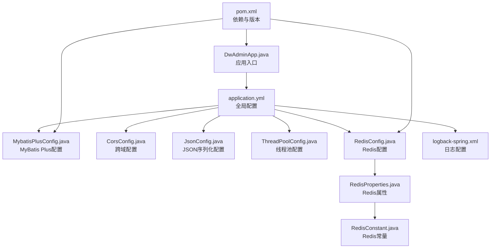
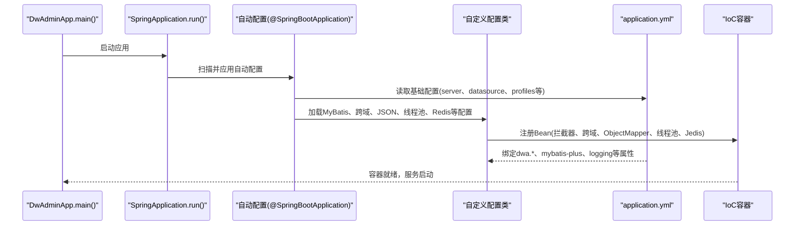
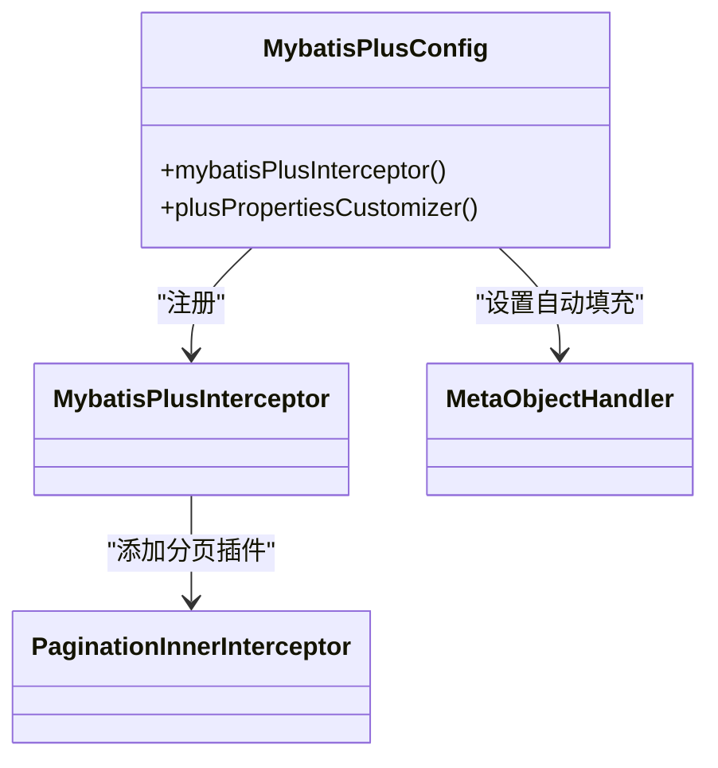
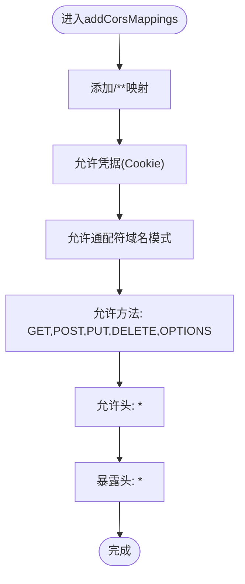
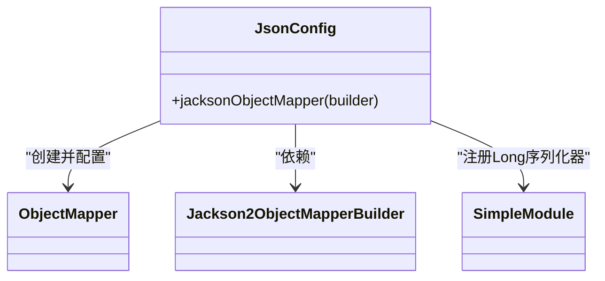
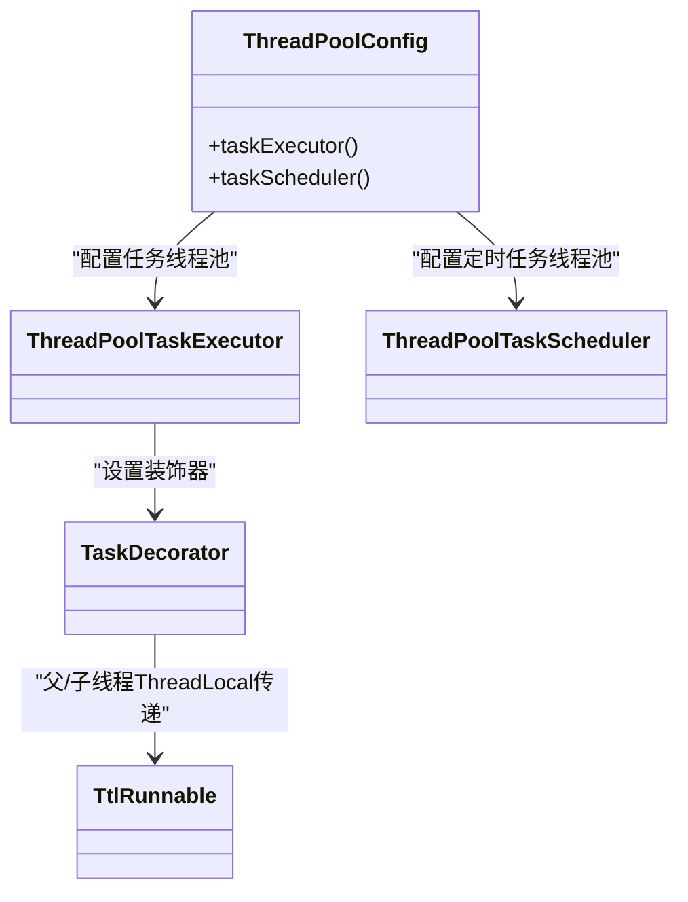
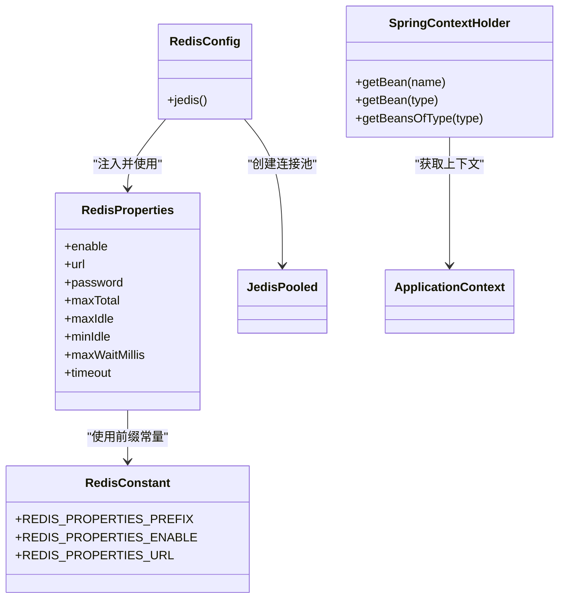
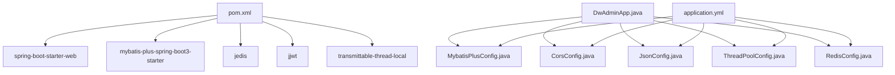

# Spring Boot配置管理

<cite>
**本文档引用的文件**
- [DwAdminApp.java](file://src/main/java/com/dw/admin/DwAdminApp.java)
- [application.yml](file://src/main/resources/application.yml)
- [MybatisPlusConfig.java](file://src/main/java/com/dw/admin/config/MybatisPlusConfig.java)
- [CorsConfig.java](file://src/main/java/com/dw/admin/config/CorsConfig.java)
- [JsonConfig.java](file://src/main/java/com/dw/admin/config/JsonConfig.java)
- [ThreadPoolConfig.java](file://src/main/java/com/dw/admin/config/ThreadPoolConfig.java)
- [RedisConfig.java](file://src/main/java/com/dw/admin/components/redis/RedisConfig.java)
- [RedisProperties.java](file://src/main/java/com/dw/admin/components/redis/RedisProperties.java)
- [RedisConstant.java](file://src/main/java/com/dw/admin/components/redis/RedisConstant.java)
- [SpringContextHolder.java](file://src/main/java/com/dw/admin/common/utils/SpringContextHolder.java)
- [logback-spring.xml](file://src/main/resources/logback/logback-spring.xml)
- [pom.xml](file://pom.xml)
</cite>

## 目录
1. [简介](#简介)
2. [项目结构](#项目结构)
3. [核心组件](#核心组件)
4. [架构总览](#架构总览)
5. [详细组件分析](#详细组件分析)
6. [依赖关系分析](#依赖关系分析)
7. [性能考虑](#性能考虑)
8. [故障排查指南](#故障排查指南)
9. [结论](#结论)
10. [附录](#附录)

## 简介
本文件面向DW后台管理系统的Spring Boot配置管理，系统性阐述自动配置与@EnableAutoConfiguration的工作原理，以及MyBatis Plus、跨域、JSON序列化、线程池等关键配置的实现细节。同时对application.yml中的各项参数进行逐项解析，并给出配置优先级与覆盖规则、最佳实践与性能优化建议，以及常见问题的排查与解决方案。

## 项目结构
系统采用标准Spring Boot目录结构，核心配置集中在以下位置：
- 应用入口与注解：DwAdminApp.java
- YAML配置：application.yml
- 自定义配置类：MybatisPlusConfig、CorsConfig、JsonConfig、ThreadPoolConfig
- Redis配置与属性：RedisConfig、RedisProperties、RedisConstant
- 日志配置：logback-spring.xml
- 依赖与版本：pom.xml

图表来源
- [DwAdminApp.java](file://src/main/java/com/dw/admin/DwAdminApp.java#L11-L24)
- [application.yml](file://src/main/resources/application.yml#L1-L64)
- [MybatisPlusConfig.java](file://src/main/java/com/dw/admin/config/MybatisPlusConfig.java#L20-L53)
- [CorsConfig.java](file://src/main/java/com/dw/admin/config/CorsConfig.java#L10-L26)
- [JsonConfig.java](file://src/main/java/com/dw/admin/config/JsonConfig.java#L13-L28)
- [ThreadPoolConfig.java](file://src/main/java/com/dw/admin/config/ThreadPoolConfig.java#L17-L61)
- [RedisConfig.java](file://src/main/java/com/dw/admin/components/redis/RedisConfig.java#L21-L63)
- [RedisProperties.java](file://src/main/java/com/dw/admin/components/redis/RedisProperties.java#L14-L40)
- [RedisConstant.java](file://src/main/java/com/dw/admin/components/redis/RedisConstant.java#L8-L21)
- [logback-spring.xml](file://src/main/resources/logback/logback-spring.xml#L1-L72)
- [pom.xml](file://pom.xml#L1-L205)

章节来源
- [DwAdminApp.java](file://src/main/java/com/dw/admin/DwAdminApp.java#L11-L24)
- [application.yml](file://src/main/resources/application.yml#L1-L64)
- [pom.xml](file://pom.xml#L1-L205)

## 核心组件
- 应用入口与自动装配
  - @SpringBootApplication启用自动配置、组件扫描与Web环境；@EnableAsync/@EnableScheduling启用异步与定时任务；@MapperScan指定Mapper扫描路径。
- MyBatis Plus配置
  - 注册分页插件与字段自动填充处理器，统一设置创建/更新时间字段。
- 跨域配置
  - 全局允许跨域访问，支持Cookie与通配符域名模式。
- JSON序列化配置
  - 使用Jackson将Long类型序列化为字符串，避免前端精度丢失。
- 线程池配置
  - 任务线程池使用虚拟线程与TTL装饰器，定时任务线程池设置优雅停机。
- Redis配置
  - 通过@EnableConfigurationProperties绑定dwa.redis前缀属性，按条件初始化Jedis连接池。

章节来源
- [DwAdminApp.java](file://src/main/java/com/dw/admin/DwAdminApp.java#L11-L24)
- [MybatisPlusConfig.java](file://src/main/java/com/dw/admin/config/MybatisPlusConfig.java#L20-L53)
- [CorsConfig.java](file://src/main/java/com/dw/admin/config/CorsConfig.java#L10-L26)
- [JsonConfig.java](file://src/main/java/com/dw/admin/config/JsonConfig.java#L13-L28)
- [ThreadPoolConfig.java](file://src/main/java/com/dw/admin/config/ThreadPoolConfig.java#L17-L61)
- [RedisConfig.java](file://src/main/java/com/dw/admin/components/redis/RedisConfig.java#L21-L63)

## 架构总览
下图展示Spring Boot启动后，配置加载与组件装配的关键流程。

图表来源
- [DwAdminApp.java](file://src/main/java/com/dw/admin/DwAdminApp.java#L19-L22)
- [application.yml](file://src/main/resources/application.yml#L1-L64)
- [MybatisPlusConfig.java](file://src/main/java/com/dw/admin/config/MybatisPlusConfig.java#L20-L53)
- [CorsConfig.java](file://src/main/java/com/dw/admin/config/CorsConfig.java#L10-L26)
- [JsonConfig.java](file://src/main/java/com/dw/admin/config/JsonConfig.java#L13-L28)
- [ThreadPoolConfig.java](file://src/main/java/com/dw/admin/config/ThreadPoolConfig.java#L17-L61)
- [RedisConfig.java](file://src/main/java/com/dw/admin/components/redis/RedisConfig.java#L21-L63)

## 详细组件分析

### Spring Boot自动配置与@EnableAutoConfiguration工作原理
- @SpringBootApplication组合注解
  - @SpringBootConfiguration：标记配置类
  - @EnableAutoConfiguration：启用Spring Boot自动配置
  - @ComponentScan：扫描组件
  - @Import(AutoConfigurationImportSelector)：导入候选自动配置
- 自动配置加载顺序
  - 从META-INF/spring/org.springframework.boot.autoconfigure.AutoConfiguration.imports读取候选配置
  - 条件注解生效(如@ConditionalOnClass、@ConditionalOnMissingBean等)
  - 与用户自定义配置合并，以用户配置为准
- 在本项目中的体现
  - 应用入口类DwAdminApp上使用@SpringBootApplication，确保自动配置生效
  - MyBatis Plus、Redis、Web MVC等均通过自动配置与手动配置结合完成

章节来源
- [DwAdminApp.java](file://src/main/java/com/dw/admin/DwAdminApp.java#L11-L14)

### MyBatis Plus配置
- 功能要点
  - 注册MybatisPlusInterceptor并添加PaginationInnerInterceptor，MySQL分页插件
  - 通过MybatisPlusPropertiesCustomizer设置MetaObjectHandler，自动填充创建/更新时间
- 关键Bean
  - mybatisPlusInterceptor：分页插件
  - plusPropertiesCustomizer：全局配置MetaObjectHandler
- 与application.yml的关系
  - mybatis-plus.mapperLocations由application.yml中mybatis-plus.mapperLocations指定

图表来源
- [MybatisPlusConfig.java](file://src/main/java/com/dw/admin/config/MybatisPlusConfig.java#L20-L53)

章节来源
- [MybatisPlusConfig.java](file://src/main/java/com/dw/admin/config/MybatisPlusConfig.java#L20-L53)
- [application.yml](file://src/main/resources/application.yml#L22-L25)

### 跨域配置
- 功能要点
  - 全局映射/**，允许凭据(Cookie)、通配符域名模式、全方法、全头、全暴露头
- 实现方式
  - WebMvcConfigurer.addCorsMappings，返回CorsRegistry
- 注意事项
  - 允许通配符域名与allowCredentials同时使用需使用patterns

图表来源
- [CorsConfig.java](file://src/main/java/com/dw/admin/config/CorsConfig.java#L10-L26)

章节来源
- [CorsConfig.java](file://src/main/java/com/dw/admin/config/CorsConfig.java#L10-L26)

### JSON序列化配置
- 功能要点
  - 使用@JsonComponent扩展Jackson，将Long与long序列化为字符串，避免前端精度丢失
- 实现方式
  - jacksonObjectMapper通过Jackson2ObjectMapperBuilder构建，注册SimpleModule

图表来源
- [JsonConfig.java](file://src/main/java/com/dw/admin/config/JsonConfig.java#L13-L28)

章节来源
- [JsonConfig.java](file://src/main/java/com/dw/admin/config/JsonConfig.java#L13-L28)

### 线程池配置
- 任务线程池(taskExecutor)
  - 核心/最大线程数、队列容量、存活时间、虚拟线程工厂、拒绝策略、TTL装饰器
- 定时任务线程池(taskScheduler)
  - 线程池大小、命名前缀、优雅停机等待时间、关闭时等待任务完成
- 关键点
  - 使用虚拟线程提升高并发下的吞吐
  - CallerRunsPolicy在饱和时由调用线程执行，避免丢弃任务

图表来源
- [ThreadPoolConfig.java](file://src/main/java/com/dw/admin/config/ThreadPoolConfig.java#L17-L61)

章节来源
- [ThreadPoolConfig.java](file://src/main/java/com/dw/admin/config/ThreadPoolConfig.java#L17-L61)

### Redis配置
- 属性绑定
  - @EnableConfigurationProperties(RedisProperties)绑定dwa.redis前缀
  - RedisConstant定义前缀与开关键名
- 条件装配
  - @ConditionalOnProperty(name = RedisConstant.REDIS_PROPERTIES_ENABLE, matchIfMissing = true)默认启用
- 连接池
  - JedisPooled基于ConnectionPoolConfig，支持密码与超时配置
- 上下文获取
  - SpringContextHolder提供静态方法获取ApplicationContext与Bean

图表来源
- [RedisConfig.java](file://src/main/java/com/dw/admin/components/redis/RedisConfig.java#L21-L63)
- [RedisProperties.java](file://src/main/java/com/dw/admin/components/redis/RedisProperties.java#L14-L40)
- [RedisConstant.java](file://src/main/java/com/dw/admin/components/redis/RedisConstant.java#L8-L21)
- [SpringContextHolder.java](file://src/main/java/com/dw/admin/common/utils/SpringContextHolder.java#L18-L75)

章节来源
- [RedisConfig.java](file://src/main/java/com/dw/admin/components/redis/RedisConfig.java#L21-L63)
- [RedisProperties.java](file://src/main/java/com/dw/admin/components/redis/RedisProperties.java#L14-L40)
- [RedisConstant.java](file://src/main/java/com/dw/admin/components/redis/RedisConstant.java#L8-L21)
- [SpringContextHolder.java](file://src/main/java/com/dw/admin/common/utils/SpringContextHolder.java#L18-L75)

### application.yml配置详解
- server.port：应用监听端口
- spring.profiles.default：默认激活的profile
- spring.application.name：应用名称
- spring.datasource：数据源配置
  - driver-class-name：驱动类
  - url：数据库连接串
  - username/password：账号密码
  - hikari.minimum-idle/maximum-pool-size：连接池最小/最大空闲
- spring.servlet.multipart：上传限制
  - max-request-size/max-file-size：请求与单文件大小上限
- mybatis-plus.mapperLocations：Mapper XML路径
- logging.config：Logback配置文件路径
- logging.level：DAO层日志级别
- dwa.auth：认证相关
  - cache-type：缓存类型
  - secret：密钥
- dwa.redis：Redis连接
  - url：主机与端口
  - password：密码
- dwa.storage：文件存储
  - provider：存储提供商
  - aliyun-oss/tencent-cos/local：各存储提供商配置与过期时间、域名、路径等

章节来源
- [application.yml](file://src/main/resources/application.yml#L1-L64)

## 依赖关系分析
- Maven依赖与版本
  - Spring Boot 3.5.6，Java 21
  - MyBatis Plus Starter、JSQLParser、代码生成器、Freemarker
  - Redis客户端Jedis、JWT、Transmittable Thread Local
- 与配置的耦合
  - application.yml中的dwa.*、mybatis-plus.*、spring.datasource.*直接影响运行时行为
  - 自定义配置类通过@Bean与@EnableConfigurationProperties与YAML属性绑定

图表来源
- [pom.xml](file://pom.xml#L25-L162)
- [DwAdminApp.java](file://src/main/java/com/dw/admin/DwAdminApp.java#L11-L24)
- [application.yml](file://src/main/resources/application.yml#L1-L64)

章节来源
- [pom.xml](file://pom.xml#L1-L205)
- [DwAdminApp.java](file://src/main/java/com/dw/admin/DwAdminApp.java#L11-L24)

## 性能考虑
- 数据库连接池
  - HikariCP已默认优化，建议根据QPS与事务复杂度调整minimum-idle与maximum-pool-size
- MyBatis Plus
  - 分页插件仅在需要时启用；字段自动填充减少重复代码，注意字段命名一致性
- JSON序列化
  - Long序列化为字符串避免精度问题，但会增大体积；可按需选择
- 线程池
  - 虚拟线程适合大量短任务；核心/最大线程与队列容量应结合CPU核数与IO特性调优
  - 拒绝策略选择CallerRunsPolicy可降低丢弃率，但会增加主线程压力
- Redis
  - 连接池参数(maxTotal/maxIdle/minIdle/maxWaitMillis)需与业务峰值QPS匹配
  - 密码为空时走无认证路径，生产环境务必配置密码
- 日志
  - Logback滚动策略合理设置大小与历史保留，避免磁盘占用过大

[本节为通用性能建议，不直接分析具体文件]

## 故障排查指南
- 启动失败或Redis连接异常
  - 检查dwa.redis.enable与dwa.redis.url是否正确；确认Redis服务可达
  - 若密码为空，确保配置中password留空或注释
- 数据库连接失败
  - 核对spring.datasource.url、username、password与driver-class-name
  - 检查Hikari连接池参数是否过小导致连接不足
- 跨域问题
  - 确认CorsConfig中allowCredentials与allowedOriginPatterns配置
  - 生产环境建议限定具体域名而非*
- JSON精度丢失
  - 确认JsonConfig已生效；若仍出现精度问题，检查是否被其他ObjectMapper覆盖
- 线程池饱和
  - 观察任务线程池队列长度与拒绝策略触发次数；适当提高核心/最大线程或队列容量
- 日志未输出或路径异常
  - 检查logging.config与日志目录权限；确认Logback配置文件路径正确

章节来源
- [RedisConfig.java](file://src/main/java/com/dw/admin/components/redis/RedisConfig.java#L48-L61)
- [application.yml](file://src/main/resources/application.yml#L9-L16)
- [CorsConfig.java](file://src/main/java/com/dw/admin/config/CorsConfig.java#L16-L23)
- [JsonConfig.java](file://src/main/java/com/dw/admin/config/JsonConfig.java#L19-L27)
- [ThreadPoolConfig.java](file://src/main/java/com/dw/admin/config/ThreadPoolConfig.java#L25-L44)
- [logback-spring.xml](file://src/main/resources/logback/logback-spring.xml#L1-L72)

## 结论
本项目通过@EnableAutoConfiguration与自定义配置类实现了清晰的配置体系：MyBatis Plus、跨域、JSON序列化、线程池与Redis均以Bean形式注入到IoC容器；application.yml集中管理关键参数。遵循本文档的配置优先级与覆盖规则、最佳实践与性能优化建议，可有效提升系统稳定性与运行效率。

[本节为总结性内容，不直接分析具体文件]

## 附录

### 配置优先级与覆盖规则
- 配置来源优先级（从高到低）
  1) 命令行参数
  2) SPRING_APPLICATION_JSON
  3) 系统环境变量
  4) application-{profile}.yml
  5) application.yml
  6) @PropertySource
  7) 默认属性
- 覆盖规则
  - 后加载的配置会覆盖先前的同名配置
  - profile特定配置会覆盖默认配置
  - 开发环境可通过spring.profiles.active切换不同配置文件

[本节为通用规则说明，不直接分析具体文件]

### 最佳实践清单
- 明确区分开发/测试/生产profile，使用不同的数据库与Redis配置
- 对外接口统一跨域策略，生产环境限制具体域名
- JSON序列化保持前后端一致的数字类型约定
- 线程池参数与业务特征匹配，定期监控队列长度与拒绝次数
- Redis连接池参数与业务峰值匹配，生产环境务必配置密码
- 日志滚动策略合理设置，避免磁盘空间耗尽

[本节为通用建议，不直接分析具体文件]