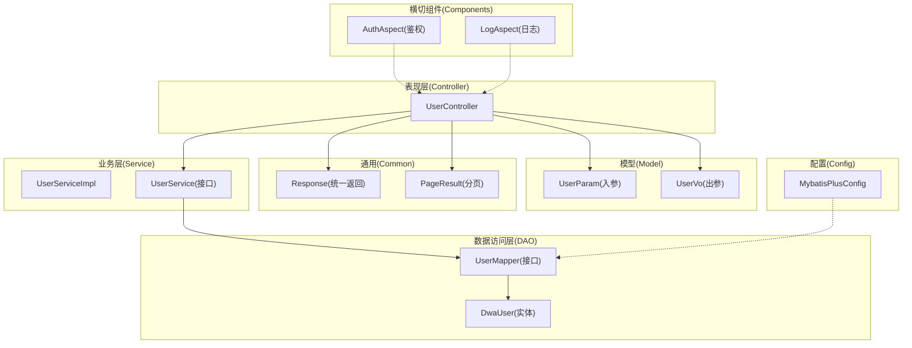
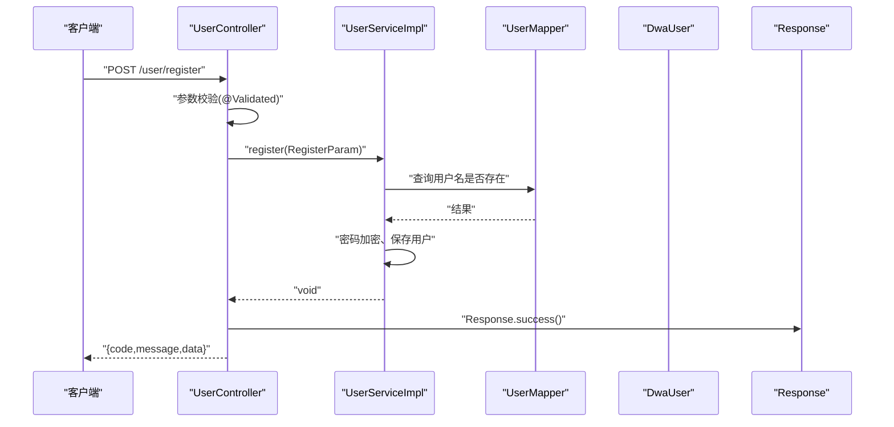
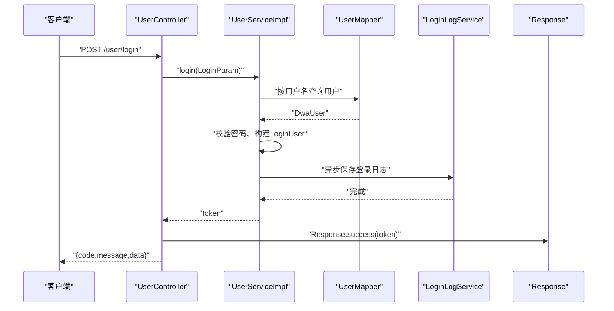
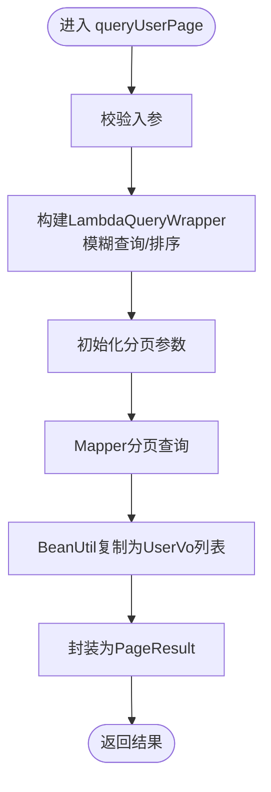
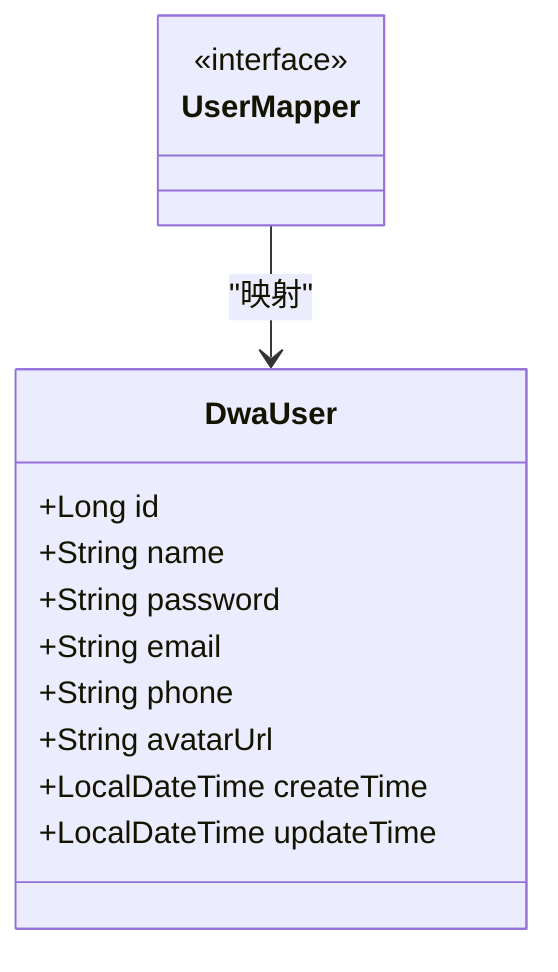
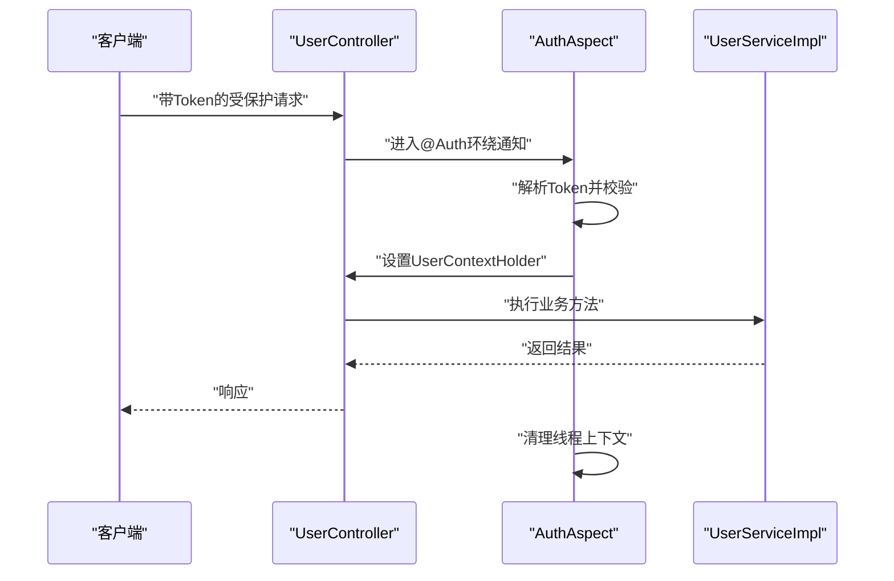
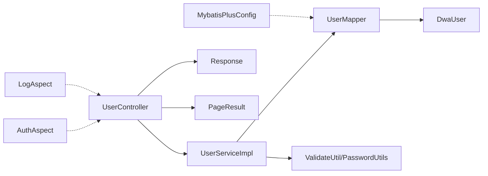

# 分层架构设计

<cite>
**本文引用的文件**
- [DwAdminApp.java](file://src/main/java/com/dw/admin/DwAdminApp.java)
- [UserController.java](file://src/main/java/com/dw/admin/controller/UserController.java)
- [UserService.java](file://src/main/java/com/dw/admin/service/UserService.java)
- [UserServiceImpl.java](file://src/main/java/com/dw/admin/service/impl/UserServiceImpl.java)
- [UserMapper.java](file://src/main/java/com/dw/admin/dao/UserMapper.java)
- [DwaUser.java](file://src/main/java/com/dw/admin/model/entity/DwaUser.java)
- [UserParam.java](file://src/main/java/com/dw/admin/model/param/UserParam.java)
- [UserVo.java](file://src/main/java/com/dw/admin/model/vo/UserVo.java)
- [Response.java](file://src/main/java/com/dw/admin/common/entity/Response.java)
- [PageResult.java](file://src/main/java/com/dw/admin/common/entity/PageResult.java)
- [MybatisPlusConfig.java](file://src/main/java/com/dw/admin/config/MybatisPlusConfig.java)
- [AuthAspect.java](file://src/main/java/com/dw/admin/components/auth/AuthAspect.java)
- [LogAspect.java](file://src/main/java/com/dw/admin/components/log/LogAspect.java)
- [application.yml](file://src/main/resources/application.yml)
- [pom.xml](file://pom.xml)
</cite>

## 目录
1. [引言](#引言)
2. [项目结构](#项目结构)
3. [核心组件](#核心组件)
4. [架构总览](#架构总览)
5. [详细组件分析](#详细组件分析)
6. [依赖分析](#依赖分析)
7. [性能考虑](#性能考虑)
8. [故障排查指南](#故障排查指南)
9. [结论](#结论)
10. [附录](#附录)

## 引言
本文件面向DW后台管理系统，系统性阐述其基于Spring Boot的分层架构设计与实现，重点覆盖表现层（Controller）、业务层（Service）、数据访问层（DAO）的职责划分、交互关系与数据传递模式，并结合项目实际代码示例，总结设计原则、最佳实践、优势与适用场景，同时给出架构演进与扩展建议。

## 项目结构
项目采用标准的MVC分层组织方式，配合通用实体、参数、返回体与分页模型，以及基于AOP的横切关注点（鉴权、日志、限流等）。核心模块如下：
- 表现层：controller 包，负责HTTP请求接入、参数绑定、返回统一包装
- 业务层：service 接口与实现，负责业务编排、事务边界、领域逻辑
- 数据访问层：dao 包 + MyBatis-Plus Mapper，负责数据库读写
- 模型层：model 包，包含实体、参数、视图对象
- 通用层：common 包，统一返回体、分页、枚举、工具与异常
- 配置层：config 包，MyBatis-Plus、跨域、线程池等配置
- 组件层：components 包，鉴权、日志、缓存、权限、限流、存储等横切能力

图表来源
- [UserController.java](file://src/main/java/com/dw/admin/controller/UserController.java#L1-L138)
- [UserService.java](file://src/main/java/com/dw/admin/service/UserService.java#L1-L59)
- [UserServiceImpl.java](file://src/main/java/com/dw/admin/service/impl/UserServiceImpl.java#L1-L270)
- [UserMapper.java](file://src/main/java/com/dw/admin/dao/UserMapper.java#L1-L16)
- [DwaUser.java](file://src/main/java/com/dw/admin/model/entity/DwaUser.java#L1-L73)
- [UserParam.java](file://src/main/java/com/dw/admin/model/param/UserParam.java#L1-L37)
- [UserVo.java](file://src/main/java/com/dw/admin/model/vo/UserVo.java#L1-L57)
- [Response.java](file://src/main/java/com/dw/admin/common/entity/Response.java#L1-L132)
- [PageResult.java](file://src/main/java/com/dw/admin/common/entity/PageResult.java#L1-L94)
- [MybatisPlusConfig.java](file://src/main/java/com/dw/admin/config/MybatisPlusConfig.java#L1-L53)
- [AuthAspect.java](file://src/main/java/com/dw/admin/components/auth/AuthAspect.java#L1-L62)
- [LogAspect.java](file://src/main/java/com/dw/admin/components/log/LogAspect.java#L1-L143)

章节来源
- [DwAdminApp.java](file://src/main/java/com/dw/admin/DwAdminApp.java#L1-L25)
- [application.yml](file://src/main/resources/application.yml#L1-L64)
- [pom.xml](file://pom.xml#L1-L205)

## 核心组件
- 表现层（Controller）
  - 职责：接收HTTP请求、参数校验、调用业务层、封装统一返回、集成横切注解（鉴权、日志、限流）
  - 示例：用户模块的注册、登录、保存、修改、删除、查询、分页等接口均在UserController中定义
- 业务层（Service）
  - 职责：声明业务契约、实现业务流程、参数校验、异常控制、与DAO交互、返回视图对象或分页结果
  - 示例：UserService接口与UserServiceImpl实现，涵盖用户全量业务逻辑
- 数据访问层（DAO）
  - 职责：基于MyBatis-Plus的Mapper接口，提供基础CRUD与分页查询能力
  - 示例：UserMapper继承BaseMapper，UserServiceImpl通过注入UserMapper完成数据库操作
- 模型层（Model）
  - 职责：实体（DwaUser）、入参（UserParam）、出参（UserVo）清晰分离，便于前后端对接与数据转换
- 通用层（Common）
  - 职责：统一返回体（Response）、分页结果（PageResult）、异常与工具类，保证接口一致性
- 配置层（Config）
  - 职责：MyBatis-Plus分页插件与字段自动填充配置，提升开发效率与一致性
- 横切组件（Components）
  - 职责：鉴权（AuthAspect）、日志（LogAspect）等横切能力，通过AOP解耦非功能需求

章节来源
- [UserController.java](file://src/main/java/com/dw/admin/controller/UserController.java#L1-L138)
- [UserService.java](file://src/main/java/com/dw/admin/service/UserService.java#L1-L59)
- [UserServiceImpl.java](file://src/main/java/com/dw/admin/service/impl/UserServiceImpl.java#L1-L270)
- [UserMapper.java](file://src/main/java/com/dw/admin/dao/UserMapper.java#L1-L16)
- [DwaUser.java](file://src/main/java/com/dw/admin/model/entity/DwaUser.java#L1-L73)
- [UserParam.java](file://src/main/java/com/dw/admin/model/param/UserParam.java#L1-L37)
- [UserVo.java](file://src/main/java/com/dw/admin/model/vo/UserVo.java#L1-L57)
- [Response.java](file://src/main/java/com/dw/admin/common/entity/Response.java#L1-L132)
- [PageResult.java](file://src/main/java/com/dw/admin/common/entity/PageResult.java#L1-L94)
- [MybatisPlusConfig.java](file://src/main/java/com/dw/admin/config/MybatisPlusConfig.java#L1-L53)
- [AuthAspect.java](file://src/main/java/com/dw/admin/components/auth/AuthAspect.java#L1-L62)
- [LogAspect.java](file://src/main/java/com/dw/admin/components/log/LogAspect.java#L1-L143)

## 架构总览
下图展示了典型用户管理接口的端到端调用链路，体现MVC分层与横切组件的协作：

图表来源
- [UserController.java](file://src/main/java/com/dw/admin/controller/UserController.java#L36-L42)
- [UserServiceImpl.java](file://src/main/java/com/dw/admin/service/impl/UserServiceImpl.java#L57-L72)
- [UserMapper.java](file://src/main/java/com/dw/admin/dao/UserMapper.java#L1-L16)
- [Response.java](file://src/main/java/com/dw/admin/common/entity/Response.java#L75-L95)

## 详细组件分析

### 表现层（Controller）分析
- 设计原则
  - 单一职责：每个Controller聚焦特定资源（如用户）
  - 统一返回：所有接口返回Response封装，便于前端统一处理
  - 注解驱动：通过@Auth、@Permission、@Log、@Limiter等注解实现横切能力
  - 参数校验：使用@Validated对入参进行校验，减少脏数据进入业务层
- 交互关系
  - Controller仅依赖Service接口，不直接依赖DAO
  - 通过UserParam、UserVo进行数据传输，避免暴露实体细节
- 典型流程
  - 登录流程：Controller接收LoginParam，调用Service.login，返回token；Service侧完成用户校验、密码匹配、Token生成与异步登录日志记录

图表来源
- [UserController.java](file://src/main/java/com/dw/admin/controller/UserController.java#L48-L54)
- [UserServiceImpl.java](file://src/main/java/com/dw/admin/service/impl/UserServiceImpl.java#L77-L108)
- [UserMapper.java](file://src/main/java/com/dw/admin/dao/UserMapper.java#L1-L16)

章节来源
- [UserController.java](file://src/main/java/com/dw/admin/controller/UserController.java#L1-L138)

### 业务层（Service）分析
- 设计原则
  - 接口与实现分离：Service接口定义契约，实现类承载具体逻辑
  - 参数校验前置：在Service层进行业务规则校验，抛出自定义异常
  - 事务边界明确：复杂流程在Service层控制，确保一致性
  - 结果转换：将实体转换为视图对象（VO），隐藏持久化细节
- 关键流程
  - 分页查询：根据条件动态拼接查询器，使用MyBatis-Plus分页插件，最终封装为PageResult
  - 用户保存：区分新增与更新，新增时校验唯一性并加密密码，更新时仅更新非空字段
- 错误处理
  - 使用BizException与统一状态码，结合Response.fail/validateFail进行标准化输出

图表来源
- [UserServiceImpl.java](file://src/main/java/com/dw/admin/service/impl/UserServiceImpl.java#L230-L267)
- [PageResult.java](file://src/main/java/com/dw/admin/common/entity/PageResult.java#L78-L91)

章节来源
- [UserService.java](file://src/main/java/com/dw/admin/service/UserService.java#L1-L59)
- [UserServiceImpl.java](file://src/main/java/com/dw/admin/service/impl/UserServiceImpl.java#L1-L270)
- [PageResult.java](file://src/main/java/com/dw/admin/common/entity/PageResult.java#L1-L94)

### 数据访问层（DAO）分析
- 设计原则
  - Mapper接口最小化：继承BaseMapper即可获得常用CRUD
  - SQL集中在XML或动态构造，保持接口纯粹
  - 配合MyBatis-Plus插件：分页、字段自动填充等
- 关键点
  - 自动填充：通过MetaObjectHandler在插入/更新时自动填充时间字段
  - 分页拦截：MybatisPlusInterceptor + PaginationInnerInterceptor实现分页

图表来源
- [UserMapper.java](file://src/main/java/com/dw/admin/dao/UserMapper.java#L1-L16)
- [DwaUser.java](file://src/main/java/com/dw/admin/model/entity/DwaUser.java#L1-L73)

章节来源
- [UserMapper.java](file://src/main/java/com/dw/admin/dao/UserMapper.java#L1-L16)
- [MybatisPlusConfig.java](file://src/main/java/com/dw/admin/config/MybatisPlusConfig.java#L1-L53)

### 横切组件（鉴权与日志）分析
- 鉴权（AuthAspect）
  - 通过AOP拦截带@Auth注解的方法，解析Token、校验有效性并将用户信息放入线程上下文
  - 在方法执行前后清理线程上下文，避免内存泄漏
- 日志（LogAspect）
  - 为带@Log注解的方法打印入参、返回值、耗时，并通过MDC注入traceId，便于全链路追踪
  - 对业务异常进行特殊处理，统一包装为Response格式返回

图表来源
- [AuthAspect.java](file://src/main/java/com/dw/admin/components/auth/AuthAspect.java#L32-L59)
- [UserController.java](file://src/main/java/com/dw/admin/controller/UserController.java#L60-L65)

章节来源
- [AuthAspect.java](file://src/main/java/com/dw/admin/components/auth/AuthAspect.java#L1-L62)
- [LogAspect.java](file://src/main/java/com/dw/admin/components/log/LogAspect.java#L1-L143)

## 依赖分析
- 层内依赖
  - Controller依赖Service接口，不直接依赖DAO
  - Service实现依赖Mapper接口与通用工具、异常、参数校验
  - Mapper依赖实体类与MyBatis-Plus配置
- 外部依赖
  - Spring Web/AOP、MyBatis-Plus、JWT、Redis、OSS/COS/本地存储等
- 依赖可视化

图表来源
- [UserController.java](file://src/main/java/com/dw/admin/controller/UserController.java#L1-L138)
- [UserServiceImpl.java](file://src/main/java/com/dw/admin/service/impl/UserServiceImpl.java#L1-L270)
- [UserMapper.java](file://src/main/java/com/dw/admin/dao/UserMapper.java#L1-L16)
- [MybatisPlusConfig.java](file://src/main/java/com/dw/admin/config/MybatisPlusConfig.java#L1-L53)
- [AuthAspect.java](file://src/main/java/com/dw/admin/components/auth/AuthAspect.java#L1-L62)
- [LogAspect.java](file://src/main/java/com/dw/admin/components/log/LogAspect.java#L1-L143)

章节来源
- [pom.xml](file://pom.xml#L25-L162)

## 性能考虑
- 分页与排序
  - 使用MyBatis-Plus分页插件，避免一次性加载大量数据
  - 动态排序与模糊查询需注意索引设计，避免全表扫描
- 缓存与异步
  - Token与权限可结合Redis缓存，降低鉴权成本
  - 登录日志等非关键路径可异步处理，减轻主流程压力
- 连接池与序列化
  - 合理配置Hikari连接池大小，避免高并发下的连接争用
  - 使用高性能序列化库（如Fastjson2）优化响应体序列化开销
- 线程与上下文
  - AOP中使用线程上下文传递用户信息，注意在异步场景下使用透传机制（TransmittableThreadLocal）

## 故障排查指南
- 统一异常与返回
  - 使用BizException与Response统一错误码与消息，便于定位问题
  - 日志切面会打印入参、返回与异常堆栈，结合traceId进行全链路追踪
- 常见问题
  - 鉴权失败：检查Token是否携带、签名是否正确、过期时间是否合理
  - 参数校验失败：确认@Validated与参数注解是否正确配置
  - 分页查询慢：检查SQL索引、排序字段是否命中索引
- 定位手段
  - 查看日志中的traceId，关联同一请求的完整调用链
  - 使用Response.validateFail/Response.fail快速识别参数与业务异常

章节来源
- [Response.java](file://src/main/java/com/dw/admin/common/entity/Response.java#L1-L132)
- [LogAspect.java](file://src/main/java/com/dw/admin/components/log/LogAspect.java#L1-L143)

## 结论
该系统通过清晰的MVC分层与横切组件，实现了高内聚、低耦合的架构设计。表现层专注接口与返回，业务层承载领域逻辑与规则，数据访问层提供稳定的数据能力，配合统一的返回体与分页模型，提升了系统的可维护性与扩展性。在后续演进中，建议进一步完善缓存策略、异步化非关键路径、引入分布式限流与熔断机制，并持续优化数据库索引与查询性能。

## 附录
- 架构演进与扩展建议
  - 微服务化：将用户、角色、权限等模块拆分为独立服务，通过API网关统一入口
  - 事件驱动：对登录日志、用户变更等事件采用消息队列异步处理
  - 配置中心：将鉴权密钥、存储配置、限流阈值等迁移到配置中心
  - 监控与可观测性：集成Prometheus/Grafana与链路追踪系统，完善告警机制
  - 测试体系：补充Service层单元测试与DAO层集成测试，保障分层质量