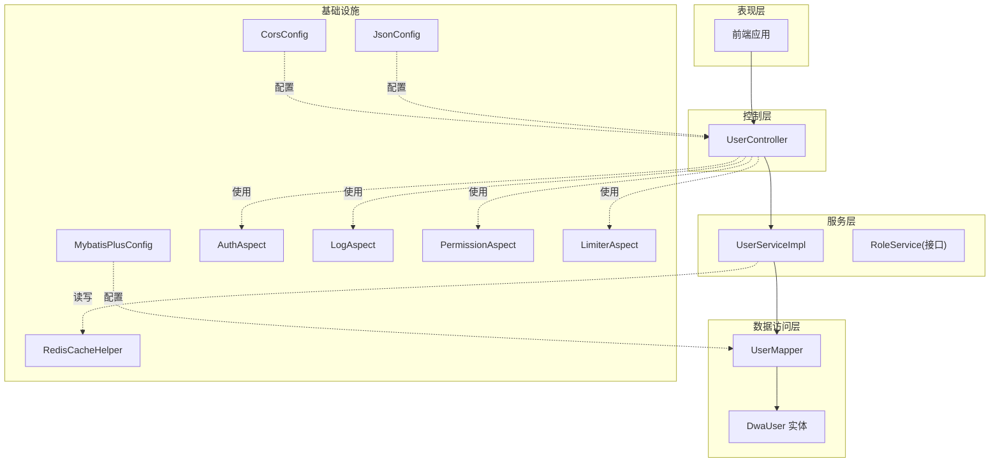
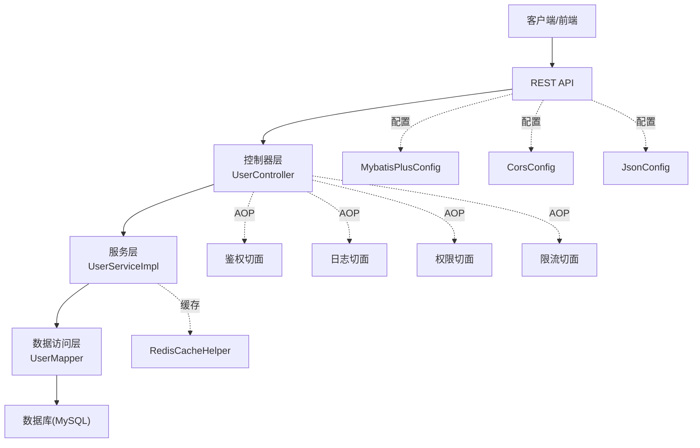
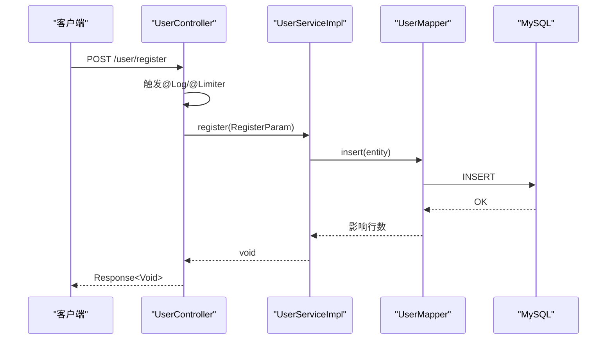
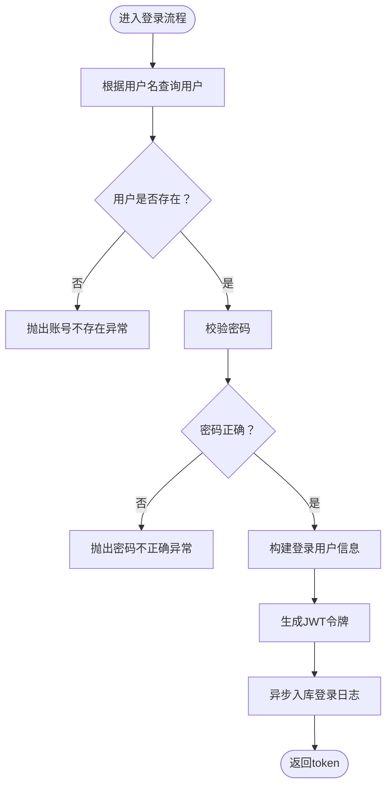
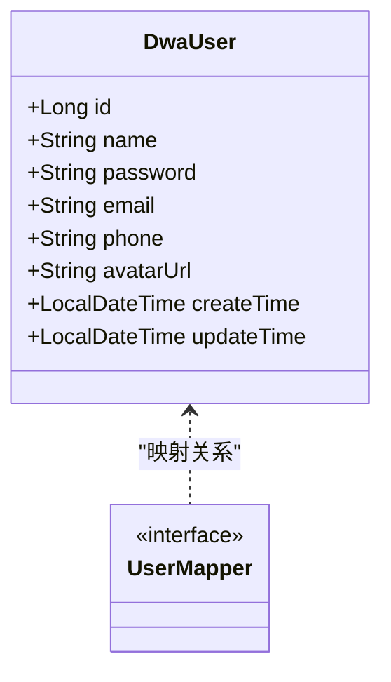
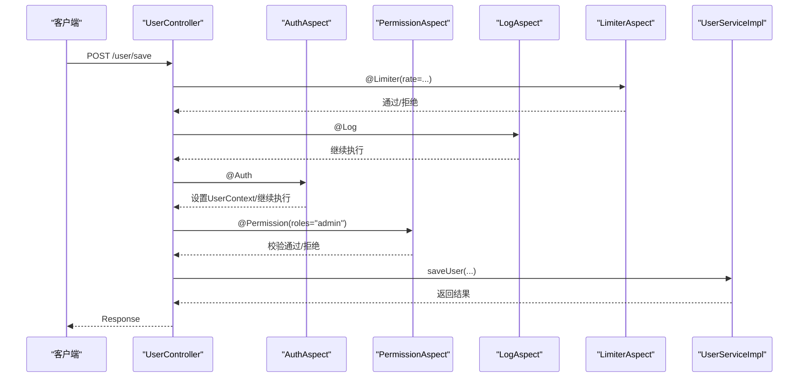
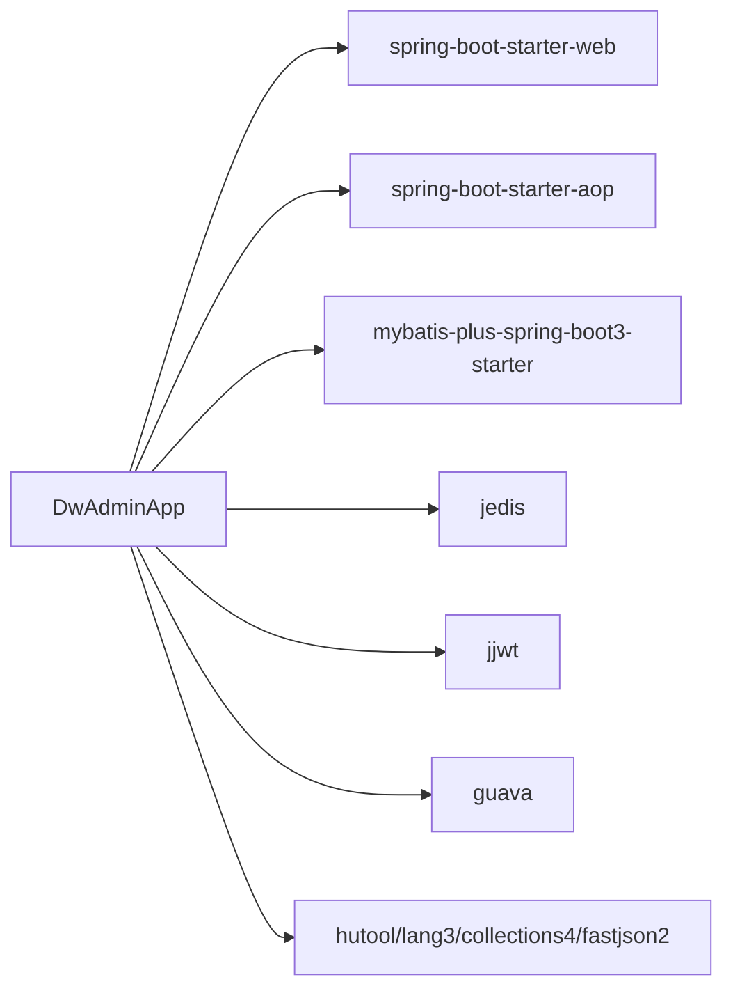

# 核心架构

<cite>
**本文引用的文件**
- [DwAdminApp.java](file://src/main/java/com/dw/admin/DwAdminApp.java)
- [MybatisPlusConfig.java](file://src/main/java/com/dw/admin/config/MybatisPlusConfig.java)
- [CorsConfig.java](file://src/main/java/com/dw/admin/config/CorsConfig.java)
- [JsonConfig.java](file://src/main/java/com/dw/admin/config/JsonConfig.java)
- [UserController.java](file://src/main/java/com/dw/admin/controller/UserController.java)
- [UserServiceImpl.java](file://src/main/java/com/dw/admin/service/impl/UserServiceImpl.java)
- [UserMapper.java](file://src/main/java/com/dw/admin/dao/UserMapper.java)
- [DwaUser.java](file://src/main/java/com/dw/admin/model/entity/DwaUser.java)
- [AuthAspect.java](file://src/main/java/com/dw/admin/components/auth/AuthAspect.java)
- [LogAspect.java](file://src/main/java/com/dw/admin/components/log/LogAspect.java)
- [PermissionAspect.java](file://src/main/java/com/dw/admin/components/permission/PermissionAspect.java)
- [LimiterAspect.java](file://src/main/java/com/dw/admin/components/limiter/LimiterAspect.java)
- [RedisCacheHelper.java](file://src/main/java/com/dw/admin/components/cache/RedisCacheHelper.java)
- [pom.xml](file://pom.xml)
</cite>

## 目录
1. [引言](#引言)
2. [项目结构](#项目结构)
3. [核心组件](#核心组件)
4. [架构总览](#架构总览)
5. [详细组件分析](#详细组件分析)
6. [依赖分析](#依赖分析)
7. [性能考虑](#性能考虑)
8. [故障排查指南](#故障排查指南)
9. [结论](#结论)
10. [附录](#附录)

## 引言
本文件面向架构师与高级开发者，系统化阐述DW后台管理系统的分层架构、Spring Boot自动装配与依赖注入机制、MyBatis Plus集成与ORM映射策略、AOP切面在权限控制、日志追踪与限流中的应用，并给出组件间依赖关系与数据流向的可视化说明。文档同时总结架构决策的技术考量与权衡，帮助读者快速理解系统设计并指导后续演进。

## 项目结构
系统采用基于功能域的分层组织方式，遵循“表现层-控制层-服务层-数据访问层”的职责分离，配合AOP横切关注点，形成清晰的层次化架构。

图表来源
- [DwAdminApp.java](file://src/main/java/com/dw/admin/DwAdminApp.java#L11-L14)
- [UserController.java](file://src/main/java/com/dw/admin/controller/UserController.java#L25-L137)
- [UserServiceImpl.java](file://src/main/java/com/dw/admin/service/impl/UserServiceImpl.java#L38-L269)
- [UserMapper.java](file://src/main/java/com/dw/admin/dao/UserMapper.java#L13-L15)
- [DwaUser.java](file://src/main/java/com/dw/admin/model/entity/DwaUser.java#L20-L72)
- [MybatisPlusConfig.java](file://src/main/java/com/dw/admin/config/MybatisPlusConfig.java#L20-L52)
- [CorsConfig.java](file://src/main/java/com/dw/admin/config/CorsConfig.java#L10-L25)
- [JsonConfig.java](file://src/main/java/com/dw/admin/config/JsonConfig.java#L13-L27)
- [AuthAspect.java](file://src/main/java/com/dw/admin/components/auth/AuthAspect.java#L22-L61)
- [LogAspect.java](file://src/main/java/com/dw/admin/components/log/LogAspect.java#L31-L87)
- [PermissionAspect.java](file://src/main/java/com/dw/admin/components/permission/PermissionAspect.java#L31-L90)
- [LimiterAspect.java](file://src/main/java/com/dw/admin/components/limiter/LimiterAspect.java#L28-L86)
- [RedisCacheHelper.java](file://src/main/java/com/dw/admin/components/cache/RedisCacheHelper.java#L16-L92)

章节来源
- [DwAdminApp.java](file://src/main/java/com/dw/admin/DwAdminApp.java#L11-L22)
- [pom.xml](file://pom.xml#L25-L162)

## 核心组件
- 应用入口与自动装配
  - 应用启动类启用Spring Boot自动装配、MyBatis Mapper扫描、异步调度能力，作为系统运行的唯一入口。
- 配置层
  - MyBatis Plus配置：分页插件与字段自动填充策略。
  - CORS全局跨域配置：统一放行策略，支持Cookie。
  - JSON序列化：Long类型ToString避免精度丢失。
- 控制层
  - 控制器通过注解驱动AOP切面，统一接入鉴权、日志、权限、限流等横切逻辑。
- 服务层
  - 业务实现类负责参数校验、领域逻辑编排、调用DAO与缓存。
- 数据访问层
  - Mapper接口继承MyBatis Plus基础能力，实体类使用注解完成表映射与字段填充。
- AOP切面
  - 鉴权切面：从请求头解析令牌，解析失败即拒绝。
  - 日志切面：统一入参与返回日志、耗时统计、TraceId链路追踪。
  - 权限切面：角色级权限校验，支持缓存与超管豁免。
  - 限流切面：基于Guava RateLimiter的本地缓存限流，支持白/黑名单。
- 缓存层
  - Redis缓存实现：键值存取、过期设置、删除与存在性检查。

章节来源
- [DwAdminApp.java](file://src/main/java/com/dw/admin/DwAdminApp.java#L11-L22)
- [MybatisPlusConfig.java](file://src/main/java/com/dw/admin/config/MybatisPlusConfig.java#L20-L52)
- [CorsConfig.java](file://src/main/java/com/dw/admin/config/CorsConfig.java#L10-L25)
- [JsonConfig.java](file://src/main/java/com/dw/admin/config/JsonConfig.java#L13-L27)
- [UserController.java](file://src/main/java/com/dw/admin/controller/UserController.java#L25-L137)
- [UserServiceImpl.java](file://src/main/java/com/dw/admin/service/impl/UserServiceImpl.java#L38-L269)
- [UserMapper.java](file://src/main/java/com/dw/admin/dao/UserMapper.java#L13-L15)
- [DwaUser.java](file://src/main/java/com/dw/admin/model/entity/DwaUser.java#L20-L72)
- [AuthAspect.java](file://src/main/java/com/dw/admin/components/auth/AuthAspect.java#L22-L61)
- [LogAspect.java](file://src/main/java/com/dw/admin/components/log/LogAspect.java#L31-L87)
- [PermissionAspect.java](file://src/main/java/com/dw/admin/components/permission/PermissionAspect.java#L31-L90)
- [LimiterAspect.java](file://src/main/java/com/dw/admin/components/limiter/LimiterAspect.java#L28-L86)
- [RedisCacheHelper.java](file://src/main/java/com/dw/admin/components/cache/RedisCacheHelper.java#L16-L92)

## 架构总览
系统采用经典的四层架构：
- 表现层：REST接口由控制器暴露，统一响应包装。
- 控制层：接收请求、参数校验、调用服务层、返回结果。
- 服务层：业务编排、领域模型转换、调用DAO与缓存。
- 数据访问层：基于MyBatis Plus的Mapper与实体映射，自动填充与分页插件生效。
- 基础设施：配置类集中管理框架行为；AOP切面统一治理横切关注点；缓存提供高性能读取。

图表来源
- [UserController.java](file://src/main/java/com/dw/admin/controller/UserController.java#L25-L137)
- [UserServiceImpl.java](file://src/main/java/com/dw/admin/service/impl/UserServiceImpl.java#L38-L269)
- [UserMapper.java](file://src/main/java/com/dw/admin/dao/UserMapper.java#L13-L15)
- [MybatisPlusConfig.java](file://src/main/java/com/dw/admin/config/MybatisPlusConfig.java#L20-L52)
- [CorsConfig.java](file://src/main/java/com/dw/admin/config/CorsConfig.java#L10-L25)
- [JsonConfig.java](file://src/main/java/com/dw/admin/config/JsonConfig.java#L13-L27)
- [AuthAspect.java](file://src/main/java/com/dw/admin/components/auth/AuthAspect.java#L22-L61)
- [LogAspect.java](file://src/main/java/com/dw/admin/components/log/LogAspect.java#L31-L87)
- [PermissionAspect.java](file://src/main/java/com/dw/admin/components/permission/PermissionAspect.java#L31-L90)
- [LimiterAspect.java](file://src/main/java/com/dw/admin/components/limiter/LimiterAspect.java#L28-L86)
- [RedisCacheHelper.java](file://src/main/java/com/dw/admin/components/cache/RedisCacheHelper.java#L16-L92)

## 详细组件分析

### 控制层：UserController
- 职责：对外暴露REST接口，统一参数校验与响应封装；通过注解触发AOP切面。
- 关键点：
  - 注册、登录、退出、保存、修改、删除、查询单个、查询当前登录用户、分页查询等接口。
  - 每个接口可叠加日志、鉴权、权限、限流等切面，形成一致的安全与可观测性体验。
- 依赖注入：通过@Resource注入UserService实现类。

图表来源
- [UserController.java](file://src/main/java/com/dw/admin/controller/UserController.java#L36-L42)
- [UserServiceImpl.java](file://src/main/java/com/dw/admin/service/impl/UserServiceImpl.java#L57-L72)
- [UserMapper.java](file://src/main/java/com/dw/admin/dao/UserMapper.java#L13-L15)

章节来源
- [UserController.java](file://src/main/java/com/dw/admin/controller/UserController.java#L25-L137)

### 服务层：UserServiceImpl
- 职责：业务编排、参数校验、密码加密、登录日志异步入库、分页查询与排序。
- 关键点：
  - 登录流程：查询用户、校验密码、构建登录用户信息、生成令牌、异步记录登录日志。
  - 保存/更新用户：新增时校验用户名唯一性，更新时按需覆盖字段。
  - 分页查询：支持多字段模糊匹配与排序，默认按更新时间倒序。
- 依赖：UserMapper、LoginLogService、AuthProperties、工具类。

图表来源
- [UserServiceImpl.java](file://src/main/java/com/dw/admin/service/impl/UserServiceImpl.java#L77-L108)

章节来源
- [UserServiceImpl.java](file://src/main/java/com/dw/admin/service/impl/UserServiceImpl.java#L38-L269)

### 数据访问层：UserMapper与DwaUser实体
- Mapper：继承MyBatis Plus基础接口，提供通用CRUD能力。
- 实体：使用注解完成表名映射、主键策略、字段自动填充（创建/更新时间）。

图表来源
- [DwaUser.java](file://src/main/java/com/dw/admin/model/entity/DwaUser.java#L20-L72)
- [UserMapper.java](file://src/main/java/com/dw/admin/dao/UserMapper.java#L13-L15)

章节来源
- [UserMapper.java](file://src/main/java/com/dw/admin/dao/UserMapper.java#L13-L15)
- [DwaUser.java](file://src/main/java/com/dw/admin/model/entity/DwaUser.java#L20-L72)

### 配置层：MyBatis Plus、CORS、JSON
- MyBatis Plus配置：注册分页插件与全局元对象处理器，实现插入/更新时自动填充时间字段。
- CORS配置：对所有路径开放跨域，允许凭证、方法与头部。
- JSON配置：Long序列化为字符串，避免前后端精度丢失。

章节来源
- [MybatisPlusConfig.java](file://src/main/java/com/dw/admin/config/MybatisPlusConfig.java#L20-L52)
- [CorsConfig.java](file://src/main/java/com/dw/admin/config/CorsConfig.java#L10-L25)
- [JsonConfig.java](file://src/main/java/com/dw/admin/config/JsonConfig.java#L13-L27)

### AOP切面：鉴权、日志、权限、限流
- 鉴权切面：从请求头提取令牌，解析失败直接拒绝；成功则将用户上下文放入线程本地变量，最后清理。
- 日志切面：统一打印入参、返回值、耗时与TraceId；异常时输出错误响应结构。
- 权限切面：基于角色码进行校验，支持缓存命中与超管豁免；未满足条件抛出权限不足异常。
- 限流切面：以方法+IP或方法为维度创建RateLimiter，支持白/黑名单与动态速率配置。

图表来源
- [UserController.java](file://src/main/java/com/dw/admin/controller/UserController.java#L68-L77)
- [AuthAspect.java](file://src/main/java/com/dw/admin/components/auth/AuthAspect.java#L32-L59)
- [PermissionAspect.java](file://src/main/java/com/dw/admin/components/permission/PermissionAspect.java#L52-L87)
- [LogAspect.java](file://src/main/java/com/dw/admin/components/log/LogAspect.java#L50-L87)
- [LimiterAspect.java](file://src/main/java/com/dw/admin/components/limiter/LimiterAspect.java#L55-L78)

章节来源
- [AuthAspect.java](file://src/main/java/com/dw/admin/components/auth/AuthAspect.java#L22-L61)
- [LogAspect.java](file://src/main/java/com/dw/admin/components/log/LogAspect.java#L31-L143)
- [PermissionAspect.java](file://src/main/java/com/dw/admin/components/permission/PermissionAspect.java#L31-L90)
- [LimiterAspect.java](file://src/main/java/com/dw/admin/components/limiter/LimiterAspect.java#L28-L86)

### 缓存层：RedisCacheHelper
- 功能：键值存取、带过期时间设置、删除与存在性检查；基于JedisPooled实现。
- 场景：权限角色码缓存、令牌缓存等可扩展场景。

章节来源
- [RedisCacheHelper.java](file://src/main/java/com/dw/admin/components/cache/RedisCacheHelper.java#L16-L92)

## 依赖分析
- 模块内聚与耦合
  - 控制器仅依赖服务接口，降低对实现细节的耦合。
  - 服务层依赖Mapper与缓存，保持业务逻辑与数据访问的清晰边界。
  - AOP切面通过注解与Order顺序实现横切治理，避免侵入式代码。
- 外部依赖
  - Spring Boot Starter：web、aop、validation、actuator等。
  - MyBatis Plus：分页、自动填充、代码生成。
  - Redis：Jedis客户端。
  - JWT：令牌生成与解析。
  - Guava：RateLimiter与本地缓存。
  - Fastjson2、Hutool、Lang3、Collections4等工具库。

图表来源
- [pom.xml](file://pom.xml#L25-L162)

章节来源
- [pom.xml](file://pom.xml#L25-L162)

## 性能考虑
- ORM与分页
  - MyBatis Plus分页插件与自动填充减少样板代码，提升开发效率与一致性。
- 缓存策略
  - 对热点数据（如角色码）进行缓存，降低数据库压力；结合过期策略保证一致性。
- 限流与安全
  - 基于方法+IP的限流策略，白/黑名单机制可快速阻断恶意请求。
- 日志与追踪
  - TraceId贯穿请求生命周期，便于定位性能瓶颈与异常根因。
- 并发与异步
  - 登录日志异步入库，避免阻塞主流程；开启@EnableAsync为后续异步任务预留空间。

## 故障排查指南
- 鉴权失败
  - 检查请求头是否携带令牌、令牌格式与前缀是否正确、令牌是否过期。
  - 查看鉴权切面对应日志与异常码。
- 权限不足
  - 确认用户角色码是否包含所需角色；检查缓存是否命中；核对超管豁免逻辑。
- 限流触发
  - 检查白/黑名单配置；确认限流维度（方法+IP或方法）与速率参数；查看限流异常提示。
- 登录异常
  - 核对用户名是否存在、密码是否匹配；检查异步入库日志是否正常。
- 数据库相关
  - 核对分页参数与排序字段；确认自动填充字段是否正确写入。

章节来源
- [AuthAspect.java](file://src/main/java/com/dw/admin/components/auth/AuthAspect.java#L32-L59)
- [PermissionAspect.java](file://src/main/java/com/dw/admin/components/permission/PermissionAspect.java#L52-L87)
- [LimiterAspect.java](file://src/main/java/com/dw/admin/components/limiter/LimiterAspect.java#L55-L78)
- [UserServiceImpl.java](file://src/main/java/com/dw/admin/service/impl/UserServiceImpl.java#L77-L108)
- [MybatisPlusConfig.java](file://src/main/java/com/dw/admin/config/MybatisPlusConfig.java#L27-L50)

## 结论
本系统通过清晰的分层架构与AOP横切治理，实现了高内聚、低耦合的模块化设计。Spring Boot自动装配与MyBatis Plus集成提升了开发效率与可维护性；鉴权、日志、权限、限流等切面保障了系统的安全性与可观测性；Redis缓存与本地限流为性能提供了有效支撑。整体架构在易用性、安全性与性能之间取得良好平衡，适合在生产环境中稳定运行并持续演进。

## 附录
- 系统边界
  - 外部边界：客户端/前端、数据库、Redis、第三方对象存储（OSS/COS）。
  - 内部边界：控制器、服务、数据访问、配置与切面。
- 运行与打包
  - 使用Spring Boot Maven插件进行打包，支持跳过Lombok等可选依赖。