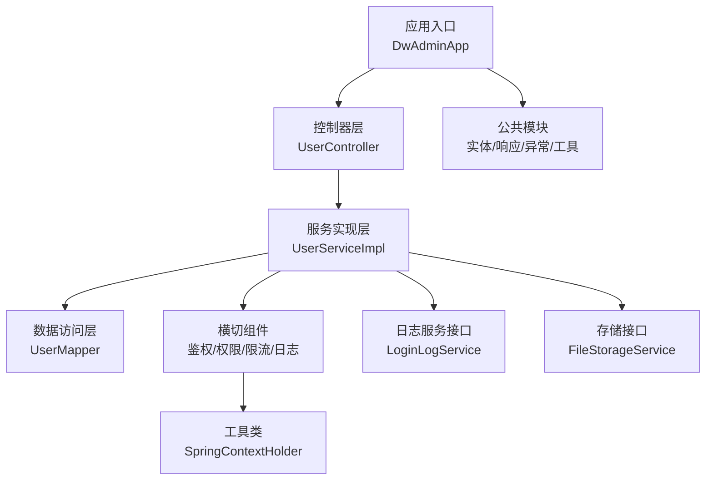
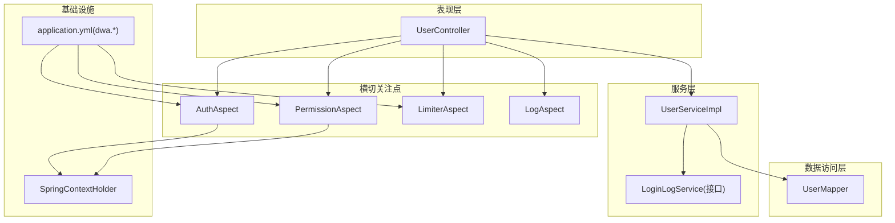
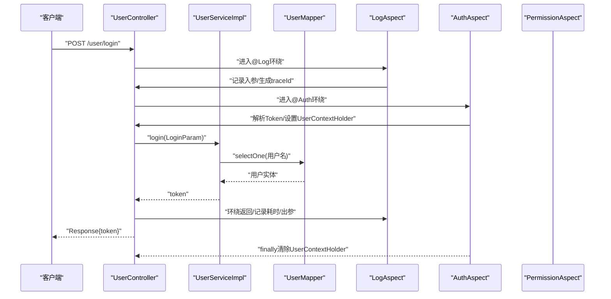
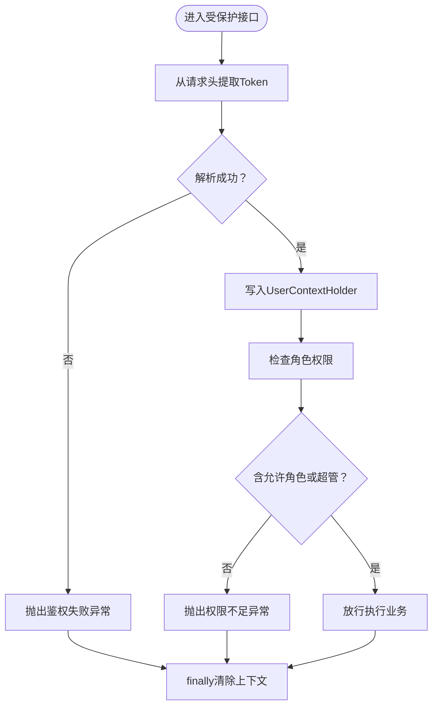
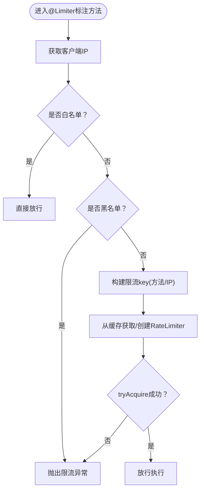
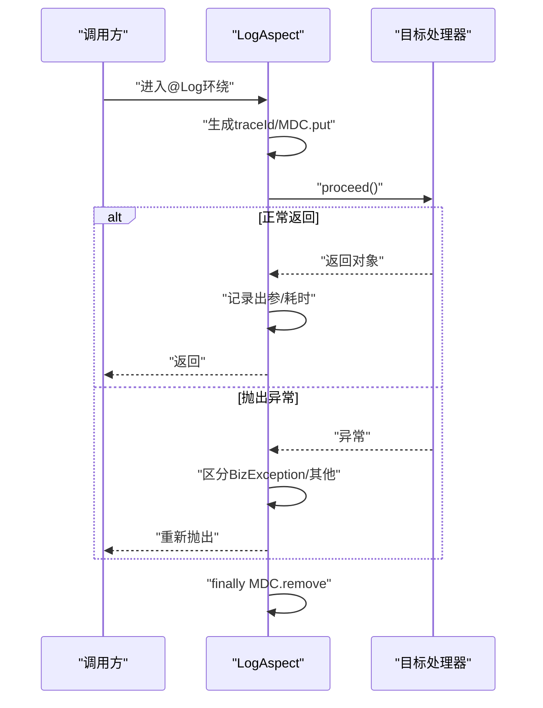
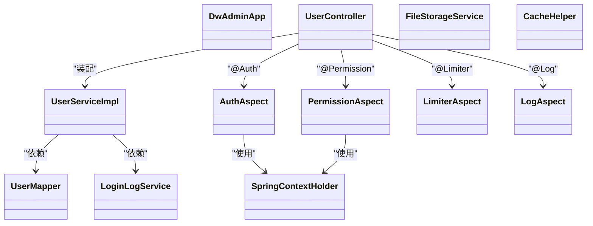
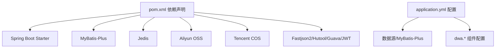

# 组件依赖关系

<cite>
**本文引用的文件**
- [pom.xml](file://pom.xml)
- [DwAdminApp.java](file://src/main/java/com/dw/admin/DwAdminApp.java)
- [application.yml](file://src/main/resources/application.yml)
- [UserController.java](file://src/main/java/com/dw/admin/controller/UserController.java)
- [UserServiceImpl.java](file://src/main/java/com/dw/admin/service/impl/UserServiceImpl.java)
- [UserMapper.java](file://src/main/java/com/dw/admin/dao/UserMapper.java)
- [AuthAspect.java](file://src/main/java/com/dw/admin/components/auth/AuthAspect.java)
- [PermissionAspect.java](file://src/main/java/com/dw/admin/components/permission/PermissionAspect.java)
- [LimiterAspect.java](file://src/main/java/com/dw/admin/components/limiter/LimiterAspect.java)
- [LogAspect.java](file://src/main/java/com/dw/admin/components/log/LogAspect.java)
- [FileStorageService.java](file://src/main/java/com/dw/admin/components/storage/FileStorageService.java)
- [CacheHelper.java](file://src/main/java/com/dw/admin/components/cache/CacheHelper.java)
- [SpringContextHolder.java](file://src/main/java/com/dw/admin/common/utils/SpringContextHolder.java)
- [LoginLogService.java](file://src/main/java/com/dw/admin/service/LoginLogService.java)
</cite>

## 目录
1. [引言](#引言)
2. [项目结构](#项目结构)
3. [核心组件](#核心组件)
4. [架构总览](#架构总览)
5. [详细组件分析](#详细组件分析)
6. [依赖分析](#依赖分析)
7. [性能考量](#性能考量)
8. [故障排查指南](#故障排查指南)
9. [结论](#结论)
10. [附录](#附录)

## 引言
本文件聚焦于DW后台管理系统的组件依赖关系与耦合度分析，覆盖控制器、服务、数据访问层、工具类以及横切关注点（鉴权、权限、限流、日志）的交互模式；解释组件生命周期与依赖注入机制；梳理第三方依赖库及其版本管理；并给出重构与扩展的指导原则与可视化图表。

## 项目结构
系统采用基于注解的Spring Boot标准分层组织：
- 应用入口与扫描配置：DwAdminApp负责启动、Mapper扫描、异步与定时任务启用
- 控制器层：面向HTTP接口，装配服务层
- 业务服务层：实现领域逻辑，装配DAO与横切能力
- 数据访问层：MyBatis-Plus Mapper接口
- 公共模块：实体、响应封装、枚举、异常、工具类
- 组件模块：认证鉴权、权限控制、限流、日志、缓存、存储、Redis分布式锁等
- 配置：application.yml集中配置数据源、MyBatis-Plus、日志、dwa命名空间下的各组件配置

**图表来源**
- [DwAdminApp.java](file://src/main/java/com/dw/admin/DwAdminApp.java#L11-L15)
- [UserController.java](file://src/main/java/com/dw/admin/controller/UserController.java#L25-L30)
- [UserServiceImpl.java](file://src/main/java/com/dw/admin/service/impl/UserServiceImpl.java#L38-L49)
- [UserMapper.java](file://src/main/java/com/dw/admin/dao/UserMapper.java#L13-L15)
- [AuthAspect.java](file://src/main/java/com/dw/admin/components/auth/AuthAspect.java#L22-L26)
- [PermissionAspect.java](file://src/main/java/com/dw/admin/components/permission/PermissionAspect.java#L31-L39)
- [LimiterAspect.java](file://src/main/java/com/dw/admin/components/limiter/LimiterAspect.java#L28-L36)
- [LogAspect.java](file://src/main/java/com/dw/admin/components/log/LogAspect.java#L31-L34)
- [SpringContextHolder.java](file://src/main/java/com/dw/admin/common/utils/SpringContextHolder.java#L18-L29)
- [LoginLogService.java](file://src/main/java/com/dw/admin/service/LoginLogService.java#L16-L21)
- [FileStorageService.java](file://src/main/java/com/dw/admin/components/storage/FileStorageService.java#L12-L20)

**章节来源**
- [DwAdminApp.java](file://src/main/java/com/dw/admin/DwAdminApp.java#L11-L15)
- [application.yml](file://src/main/resources/application.yml#L1-L64)

## 核心组件
- 应用入口与扫描
  - 启动类启用异步与定时任务，并通过MapperScan扫描DAO包
- 控制器层
  - UserController通过@Resource装配UserService，使用注解完成鉴权、权限、限流、日志横切
- 服务实现层
  - UserServiceImpl装配UserMapper、LoginLogService、AuthProperties，执行业务规则与数据持久化
- 数据访问层
  - UserMapper继承MyBatis-Plus基础Mapper，提供CRUD能力
- 横切组件
  - AuthAspect：解析Token、设置UserContextHolder、鉴权失败统一异常
  - PermissionAspect：角色权限校验，结合缓存与RoleService
  - LimiterAspect：基于Guava RateLimiter的IP/方法级限流
  - LogAspect：MDC链路追踪、入参/出参/耗时/异常统一记录
- 工具类
  - SpringContextHolder：静态持有ApplicationContext，提供按名/类型取Bean能力
- 存储与缓存
  - FileStorageService：统一文件存储接口，适配OSS/COS/Local
  - CacheHelper：抽象缓存能力接口，Redis/本地实现可替换

**章节来源**
- [DwAdminApp.java](file://src/main/java/com/dw/admin/DwAdminApp.java#L11-L15)
- [UserController.java](file://src/main/java/com/dw/admin/controller/UserController.java#L25-L137)
- [UserServiceImpl.java](file://src/main/java/com/dw/admin/service/impl/UserServiceImpl.java#L38-L269)
- [UserMapper.java](file://src/main/java/com/dw/admin/dao/UserMapper.java#L13-L15)
- [AuthAspect.java](file://src/main/java/com/dw/admin/components/auth/AuthAspect.java#L22-L61)
- [PermissionAspect.java](file://src/main/java/com/dw/admin/components/permission/PermissionAspect.java#L31-L90)
- [LimiterAspect.java](file://src/main/java/com/dw/admin/components/limiter/LimiterAspect.java#L28-L86)
- [LogAspect.java](file://src/main/java/com/dw/admin/components/log/LogAspect.java#L31-L142)
- [SpringContextHolder.java](file://src/main/java/com/dw/admin/common/utils/SpringContextHolder.java#L18-L74)
- [FileStorageService.java](file://src/main/java/com/dw/admin/components/storage/FileStorageService.java#L12-L51)
- [CacheHelper.java](file://src/main/java/com/dw/admin/components/cache/CacheHelper.java#L8-L51)

## 架构总览
系统遵循经典的分层架构与AOP横切模式：
- 控制器层仅负责参数接收、注解驱动的横切与返回封装
- 服务层承担业务编排、参数校验、异常转换与跨域组件协作
- DAO层专注数据持久化，配合MyBatis-Plus实现分页与条件构造
- 横切组件通过@Order定义执行顺序，形成鉴权→权限→限流→日志的有序链路
- 工具类与配置类提供运行时支撑（上下文、配置读取）

**图表来源**
- [UserController.java](file://src/main/java/com/dw/admin/controller/UserController.java#L25-L137)
- [UserServiceImpl.java](file://src/main/java/com/dw/admin/service/impl/UserServiceImpl.java#L38-L269)
- [UserMapper.java](file://src/main/java/com/dw/admin/dao/UserMapper.java#L13-L15)
- [AuthAspect.java](file://src/main/java/com/dw/admin/components/auth/AuthAspect.java#L22-L61)
- [PermissionAspect.java](file://src/main/java/com/dw/admin/components/permission/PermissionAspect.java#L31-L90)
- [LimiterAspect.java](file://src/main/java/com/dw/admin/components/limiter/LimiterAspect.java#L28-L86)
- [LogAspect.java](file://src/main/java/com/dw/admin/components/log/LogAspect.java#L31-L142)
- [SpringContextHolder.java](file://src/main/java/com/dw/admin/common/utils/SpringContextHolder.java#L18-L74)
- [application.yml](file://src/main/resources/application.yml#L33-L64)

## 详细组件分析

### 控制器与服务交互序列

**图表来源**
- [UserController.java](file://src/main/java/com/dw/admin/controller/UserController.java#L48-L54)
- [UserServiceImpl.java](file://src/main/java/com/dw/admin/service/impl/UserServiceImpl.java#L77-L108)
- [UserMapper.java](file://src/main/java/com/dw/admin/dao/UserMapper.java#L13-L15)
- [LogAspect.java](file://src/main/java/com/dw/admin/components/log/LogAspect.java#L50-L87)
- [AuthAspect.java](file://src/main/java/com/dw/admin/components/auth/AuthAspect.java#L32-L59)

**章节来源**
- [UserController.java](file://src/main/java/com/dw/admin/controller/UserController.java#L48-L54)
- [UserServiceImpl.java](file://src/main/java/com/dw/admin/service/impl/UserServiceImpl.java#L77-L108)

### 鉴权与权限流程

**图表来源**
- [AuthAspect.java](file://src/main/java/com/dw/admin/components/auth/AuthAspect.java#L32-L59)
- [PermissionAspect.java](file://src/main/java/com/dw/admin/components/permission/PermissionAspect.java#L52-L87)

**章节来源**
- [AuthAspect.java](file://src/main/java/com/dw/admin/components/auth/AuthAspect.java#L32-L59)
- [PermissionAspect.java](file://src/main/java/com/dw/admin/components/permission/PermissionAspect.java#L52-L87)

### 限流策略
- 基于Guava RateLimiter，按方法或按IP+方法维度计算速率
- 支持白名单与黑名单配置，命中黑名单直接拒绝
- 使用CacheBuilder维护IP->RateLimiter映射，具备访问过期回收能力

**图表来源**
- [LimiterAspect.java](file://src/main/java/com/dw/admin/components/limiter/LimiterAspect.java#L55-L78)

**章节来源**
- [LimiterAspect.java](file://src/main/java/com/dw/admin/components/limiter/LimiterAspect.java#L55-L78)

### 日志追踪与异常处理
- 使用MDC注入traceId，贯穿入参、出参、耗时与异常输出
- 对业务异常进行统一包装，非业务异常原样抛出

**图表来源**
- [LogAspect.java](file://src/main/java/com/dw/admin/components/log/LogAspect.java#L50-L87)

**章节来源**
- [LogAspect.java](file://src/main/java/com/dw/admin/components/log/LogAspect.java#L50-L87)

### 类关系图（核心）

**图表来源**
- [DwAdminApp.java](file://src/main/java/com/dw/admin/DwAdminApp.java#L11-L15)
- [UserController.java](file://src/main/java/com/dw/admin/controller/UserController.java#L25-L30)
- [UserServiceImpl.java](file://src/main/java/com/dw/admin/service/impl/UserServiceImpl.java#L38-L49)
- [UserMapper.java](file://src/main/java/com/dw/admin/dao/UserMapper.java#L13-L15)
- [AuthAspect.java](file://src/main/java/com/dw/admin/components/auth/AuthAspect.java#L22-L26)
- [PermissionAspect.java](file://src/main/java/com/dw/admin/components/permission/PermissionAspect.java#L31-L39)
- [LimiterAspect.java](file://src/main/java/com/dw/admin/components/limiter/LimiterAspect.java#L28-L36)
- [LogAspect.java](file://src/main/java/com/dw/admin/components/log/LogAspect.java#L31-L34)
- [SpringContextHolder.java](file://src/main/java/com/dw/admin/common/utils/SpringContextHolder.java#L18-L29)
- [LoginLogService.java](file://src/main/java/com/dw/admin/service/LoginLogService.java#L16-L21)
- [FileStorageService.java](file://src/main/java/com/dw/admin/components/storage/FileStorageService.java#L12-L20)
- [CacheHelper.java](file://src/main/java/com/dw/admin/components/cache/CacheHelper.java#L8-L16)

## 依赖分析
- 组件内聚与耦合
  - 控制器对服务的依赖清晰，无直接依赖DAO，降低耦合
  - 服务层对DAO与横切组件依赖明确，通过接口隔离外部系统（存储、缓存、日志服务）
  - 横切组件通过注解与Order串联，避免在业务代码中重复横切逻辑
- 生命周期与依赖注入
  - 控制器与服务通过Spring容器管理，默认单例；@Resource按类型注入
  - 切面组件由Spring AOP自动代理，无需手动装配
  - SpringContextHolder通过ApplicationContextAware持有上下文，便于静态场景取Bean
- 第三方依赖与版本管理
  - Spring Boot Starter：web、aop、validation、actuator、test
  - MyBatis-Plus：starter/jsqlparser/generator/freemarker
  - Redis：jedis
  - 对象存储：Aliyun OSS、Tencent COS
  - 工具库：Fastjson2、commons-lang3/collections4、hutool、guava、jjwt、transmittable-thread-local
  - 版本集中在pom.xml中声明，建议通过dependencyManagement统一收敛

**图表来源**
- [pom.xml](file://pom.xml#L25-L162)
- [application.yml](file://src/main/resources/application.yml#L4-L64)

**章节来源**
- [pom.xml](file://pom.xml#L25-L162)
- [application.yml](file://src/main/resources/application.yml#L4-L64)

## 性能考量
- 限流与熔断
  - 当前限流基于内存缓存与RateLimiter，适合单实例部署；生产建议结合Redis实现分布式限流
- 缓存策略
  - 权限角色缓存与本地缓存接口抽象，建议在高并发场景引入Redis缓存以降低数据库压力
- 日志与追踪
  - MDC链路追踪与统一异常包装，有助于问题定位；注意日志级别与采样率控制
- 数据库连接池
  - HikariCP参数需根据QPS与事务复杂度调优，避免连接池耗尽

## 故障排查指南
- 鉴权失败
  - 检查请求头Token是否携带与格式是否正确；确认AuthAspect解析逻辑与UserContextHolder设置
- 权限不足
  - 确认用户角色缓存是否命中；检查PermissionAspect角色白名单/黑名单配置
- 限流触发
  - 核对LimiterAspect白/黑名单配置与速率参数；观察缓存中RateLimiter状态
- 日志异常
  - 检查LogAspect环绕逻辑与BizException包装；确认MDC traceId是否正确传递
- 上下文取Bean失败
  - 确认SpringContextHolder是否初始化；避免在非Spring管理的静态方法中误用

**章节来源**
- [AuthAspect.java](file://src/main/java/com/dw/admin/components/auth/AuthAspect.java#L32-L59)
- [PermissionAspect.java](file://src/main/java/com/dw/admin/components/permission/PermissionAspect.java#L52-L87)
- [LimiterAspect.java](file://src/main/java/com/dw/admin/components/limiter/LimiterAspect.java#L55-L78)
- [LogAspect.java](file://src/main/java/com/dw/admin/components/log/LogAspect.java#L50-L87)
- [SpringContextHolder.java](file://src/main/java/com/dw/admin/common/utils/SpringContextHolder.java#L67-L71)

## 结论
系统通过清晰的分层与AOP横切实现了低耦合、高内聚的架构设计。控制器仅承担编排职责，服务层承载业务规则，DAO层专注数据访问，横切组件保证安全与可观测性。建议在生产环境中完善分布式限流与缓存策略，持续优化数据库连接池与日志采样，确保系统稳定性与可扩展性。

## 附录
- 重构与扩展指导原则
  - 优先使用接口隔离与依赖注入，避免硬编码与静态调用
  - 横切逻辑尽量通过注解与AOP实现，减少重复代码
  - 对外依赖（存储、缓存、消息）抽象为接口，便于替换与测试
  - 对关键路径增加监控与告警，结合日志追踪快速定位问题
  - 版本升级遵循“先测试、后灰度、再全量”的策略，确保兼容性