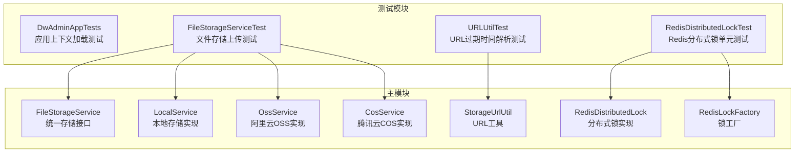
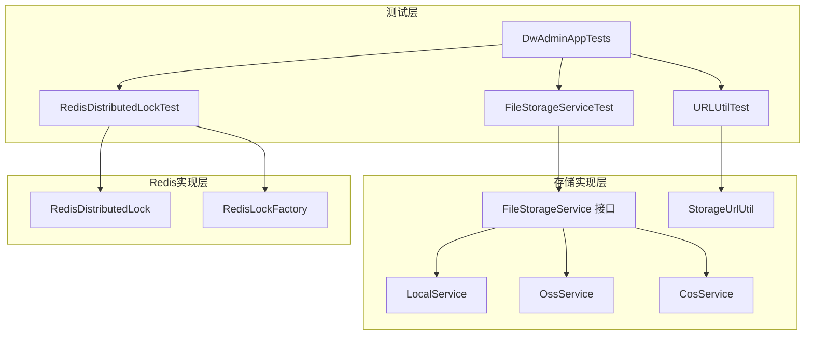
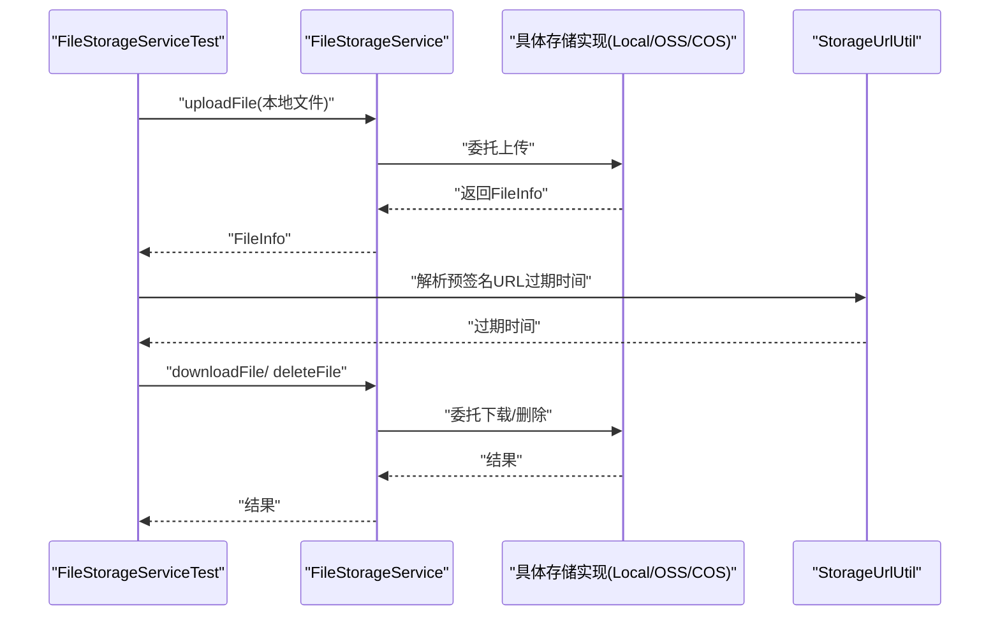
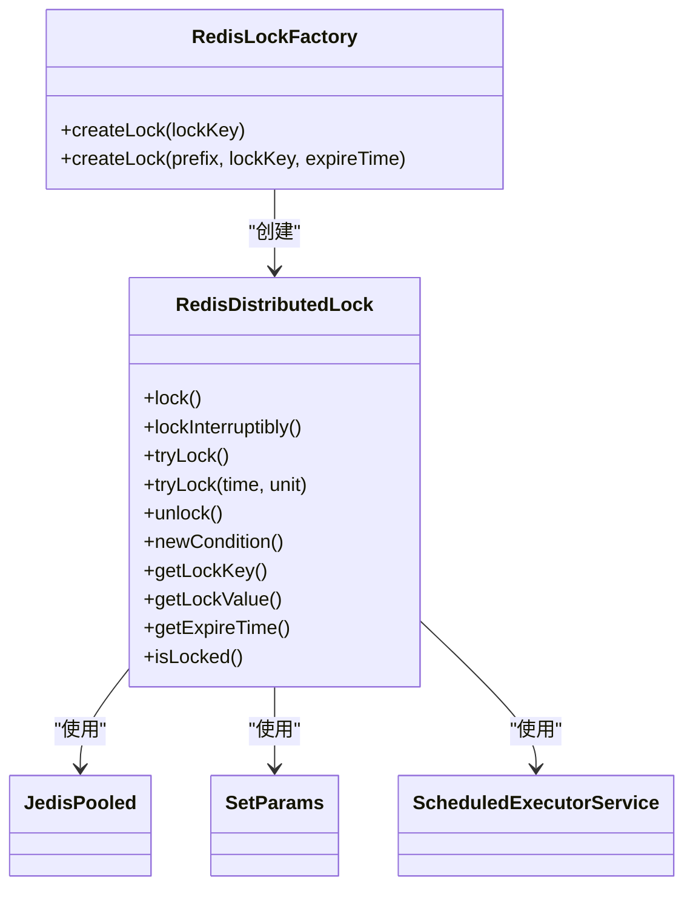
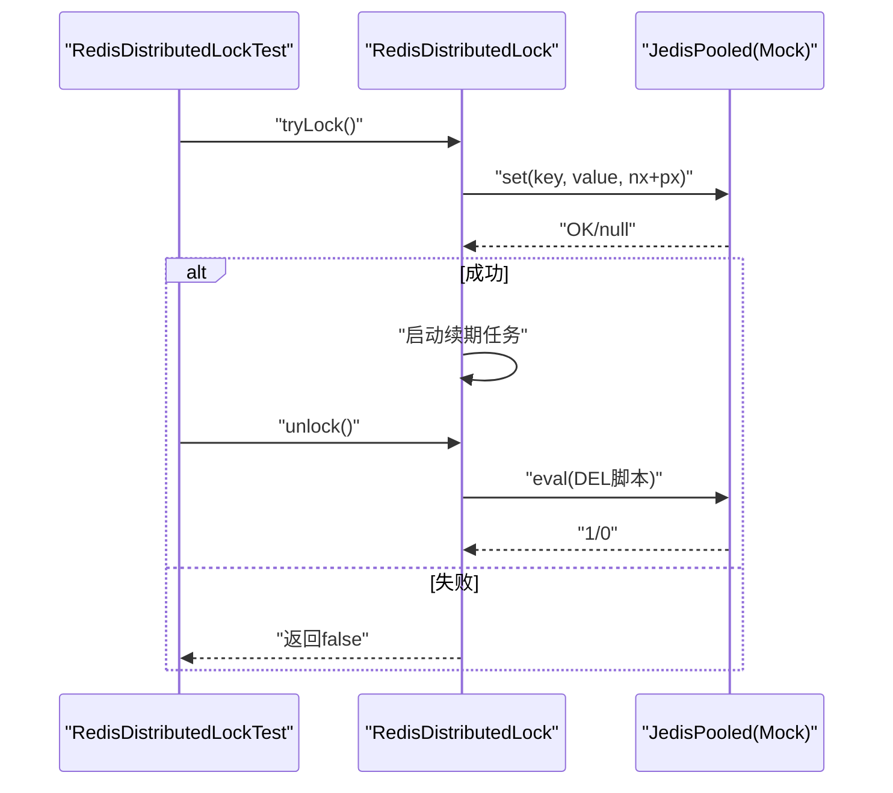
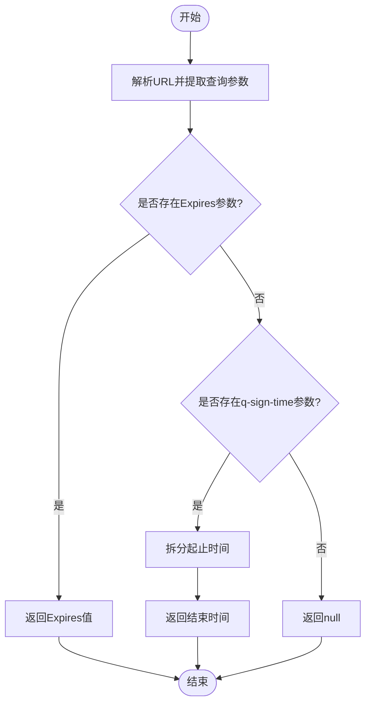
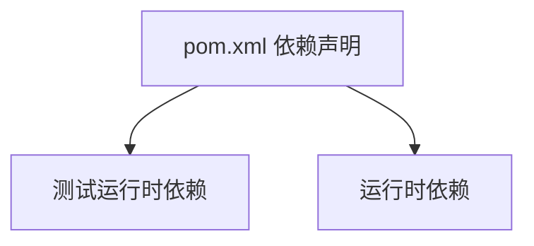

# 测试指南

<cite>
**本文引用的文件**
- [src/test/java/com/dw/admin/test/DwAdminAppTests.java](file://src/test/java/com/dw/admin/test/DwAdminAppTests.java)
- [src/test/java/com/dw/admin/test/storage/FileStorageServiceTest.java](file://src/test/java/com/dw/admin/test/storage/FileStorageServiceTest.java)
- [src/test/java/com/dw/admin/test/redis/RedisDistributedLockTest.java](file://src/test/java/com/dw/admin/test/redis/RedisDistributedLockTest.java)
- [src/test/java/com/dw/admin/test/storage/URLUtilTest.java](file://src/test/java/com/dw/admin/test/storage/URLUtilTest.java)
- [src/main/java/com/dw/admin/components/storage/FileStorageService.java](file://src/main/java/com/dw/admin/components/storage/FileStorageService.java)
- [src/main/java/com/dw/admin/components/storage/local/LocalService.java](file://src/main/java/com/dw/admin/components/storage/local/LocalService.java)
- [src/main/java/com/dw/admin/components/storage/oss/OssService.java](file://src/main/java/com/dw/admin/components/storage/oss/OssService.java)
- [src/main/java/com/dw/admin/components/storage/cos/CosService.java](file://src/main/java/com/dw/admin/components/storage/cos/CosService.java)
- [src/main/java/com/dw/admin/components/storage/StorageUrlUtil.java](file://src/main/java/com/dw/admin/components/storage/StorageUrlUtil.java)
- [src/main/java/com/dw/admin/components/redis/RedisDistributedLock.java](file://src/main/java/com/dw/admin/components/redis/RedisDistributedLock.java)
- [src/main/java/com/dw/admin/components/redis/RedisLockFactory.java](file://src/main/java/com/dw/admin/components/redis/RedisLockFactory.java)
- [src/main/resources/application.yml](file://src/main/resources/application.yml)
- [pom.xml](file://pom.xml)
- [docker-compose.yml](file://docker-compose.yml)
</cite>

## 目录
1. [引言](#引言)
2. [项目结构](#项目结构)
3. [核心组件](#核心组件)
4. [架构总览](#架构总览)
5. [详细组件分析](#详细组件分析)
6. [依赖关系分析](#依赖关系分析)
7. [性能与压力测试](#性能与压力测试)
8. [测试环境搭建与配置](#测试环境搭建与配置)
9. [测试覆盖率要求与评估](#测试覆盖率要求与评估)
10. [故障排查指南](#故障排查指南)
11. [结论](#结论)

## 引言
本测试指南面向测试工程师与开发者，系统化阐述本项目的单元测试与集成测试设计原则、实施策略与最佳实践。重点覆盖以下场景：
- 文件存储测试：统一接口下的多存储后端（本地、阿里云OSS、腾讯云COS）行为验证
- Redis分布式锁测试：基于Mockito的无外部依赖单元测试，覆盖加解锁、超时、续期、异常等边界
- URL工具测试：预签名URL过期时间解析的准确性验证
- 测试数据准备与清理：最小化依赖与可重复性保障
- 测试框架与工具：JUnit与Mockito的使用规范与建议
- 测试自动化与CI：结合Maven与Docker Compose的自动化流程建议
- 性能与压力测试：方法论与落地要点
- 测试覆盖率：目标与评估标准

## 项目结构
项目采用Spring Boot工程组织，测试代码位于src/test目录，按功能域分包：
- redis：分布式锁相关测试
- storage：文件存储相关测试（含URL工具测试）
- 核心应用上下文测试：DwAdminAppTests

**图表来源**
- [src/test/java/com/dw/admin/test/DwAdminAppTests.java](file://src/test/java/com/dw/admin/test/DwAdminAppTests.java#L1-L15)
- [src/test/java/com/dw/admin/test/storage/FileStorageServiceTest.java](file://src/test/java/com/dw/admin/test/storage/FileStorageServiceTest.java#L1-L42)
- [src/test/java/com/dw/admin/test/redis/RedisDistributedLockTest.java](file://src/test/java/com/dw/admin/test/redis/RedisDistributedLockTest.java#L1-L312)
- [src/test/java/com/dw/admin/test/storage/URLUtilTest.java](file://src/test/java/com/dw/admin/test/storage/URLUtilTest.java#L1-L32)
- [src/main/java/com/dw/admin/components/storage/FileStorageService.java](file://src/main/java/com/dw/admin/components/storage/FileStorageService.java#L1-L52)
- [src/main/java/com/dw/admin/components/storage/local/LocalService.java](file://src/main/java/com/dw/admin/components/storage/local/LocalService.java#L1-L283)
- [src/main/java/com/dw/admin/components/storage/oss/OssService.java](file://src/main/java/com/dw/admin/components/storage/oss/OssService.java#L1-L298)
- [src/main/java/com/dw/admin/components/storage/cos/CosService.java](file://src/main/java/com/dw/admin/components/storage/cos/CosService.java#L1-L322)
- [src/main/java/com/dw/admin/components/storage/StorageUrlUtil.java](file://src/main/java/com/dw/admin/components/storage/StorageUrlUtil.java#L1-L112)
- [src/main/java/com/dw/admin/components/redis/RedisDistributedLock.java](file://src/main/java/com/dw/admin/components/redis/RedisDistributedLock.java#L1-L291)
- [src/main/java/com/dw/admin/components/redis/RedisLockFactory.java](file://src/main/java/com/dw/admin/components/redis/RedisLockFactory.java#L1-L61)

**章节来源**
- [pom.xml](file://pom.xml#L1-L205)
- [src/main/resources/application.yml](file://src/main/resources/application.yml#L1-L64)

## 核心组件
- 统一文件存储接口：定义上传、下载、预签名URL、删除等能力，便于替换不同存储后端
- 本地存储实现：基于文件系统，提供上传、下载、预览、删除
- 阿里云OSS实现：基于SDK上传、下载、生成预签名URL、删除
- 腾讯云COS实现：基于SDK上传、下载、生成预签名URL、删除
- URL工具：解析OSS与COS预签名URL中的过期时间
- Redis分布式锁：实现Lock接口，支持自动续期、多种获取方式与异常处理
- Redis锁工厂：便捷创建带前缀与过期时间的锁实例

**章节来源**
- [src/main/java/com/dw/admin/components/storage/FileStorageService.java](file://src/main/java/com/dw/admin/components/storage/FileStorageService.java#L1-L52)
- [src/main/java/com/dw/admin/components/storage/local/LocalService.java](file://src/main/java/com/dw/admin/components/storage/local/LocalService.java#L1-L283)
- [src/main/java/com/dw/admin/components/storage/oss/OssService.java](file://src/main/java/com/dw/admin/components/storage/oss/OssService.java#L1-L298)
- [src/main/java/com/dw/admin/components/storage/cos/CosService.java](file://src/main/java/com/dw/admin/components/storage/cos/CosService.java#L1-L322)
- [src/main/java/com/dw/admin/components/storage/StorageUrlUtil.java](file://src/main/java/com/dw/admin/components/storage/StorageUrlUtil.java#L1-L112)
- [src/main/java/com/dw/admin/components/redis/RedisDistributedLock.java](file://src/main/java/com/dw/admin/components/redis/RedisDistributedLock.java#L1-L291)
- [src/main/java/com/dw/admin/components/redis/RedisLockFactory.java](file://src/main/java/com/dw/admin/components/redis/RedisLockFactory.java#L1-L61)

## 架构总览
下图展示测试与被测组件之间的交互关系，突出测试对核心组件的覆盖范围。

**图表来源**
- [src/test/java/com/dw/admin/test/storage/FileStorageServiceTest.java](file://src/test/java/com/dw/admin/test/storage/FileStorageServiceTest.java#L1-L42)
- [src/test/java/com/dw/admin/test/redis/RedisDistributedLockTest.java](file://src/test/java/com/dw/admin/test/redis/RedisDistributedLockTest.java#L1-L312)
- [src/test/java/com/dw/admin/test/storage/URLUtilTest.java](file://src/test/java/com/dw/admin/test/storage/URLUtilTest.java#L1-L32)
- [src/test/java/com/dw/admin/test/DwAdminAppTests.java](file://src/test/java/com/dw/admin/test/DwAdminAppTests.java#L1-L15)
- [src/main/java/com/dw/admin/components/storage/FileStorageService.java](file://src/main/java/com/dw/admin/components/storage/FileStorageService.java#L1-L52)
- [src/main/java/com/dw/admin/components/storage/local/LocalService.java](file://src/main/java/com/dw/admin/components/storage/local/LocalService.java#L1-L283)
- [src/main/java/com/dw/admin/components/storage/oss/OssService.java](file://src/main/java/com/dw/admin/components/storage/oss/OssService.java#L1-L298)
- [src/main/java/com/dw/admin/components/storage/cos/CosService.java](file://src/main/java/com/dw/admin/components/storage/cos/CosService.java#L1-L322)
- [src/main/java/com/dw/admin/components/storage/StorageUrlUtil.java](file://src/main/java/com/dw/admin/components/storage/StorageUrlUtil.java#L1-L112)
- [src/main/java/com/dw/admin/components/redis/RedisDistributedLock.java](file://src/main/java/com/dw/admin/components/redis/RedisDistributedLock.java#L1-L291)
- [src/main/java/com/dw/admin/components/redis/RedisLockFactory.java](file://src/main/java/com/dw/admin/components/redis/RedisLockFactory.java#L1-L61)

## 详细组件分析

### 文件存储测试（统一接口与多实现）
- 设计原则
  - 通过统一接口抽象，隔离具体实现差异，便于替换与扩展
  - 单元测试覆盖上传、下载、预签名URL、删除等关键路径
  - 集成测试在开发环境验证真实存储后端行为（如本地文件系统）
- 实施策略
  - 单元测试：针对接口与工具类进行行为验证，关注异常与边界条件
  - 集成测试：切换至开发配置，使用本地存储实现验证端到端流程
- 关键测试点
  - 上传文件：校验返回的文件信息字段完整性与URL生成
  - 下载文件：校验响应头与内容流
  - 预签名URL：校验URL有效性与过期时间
  - 删除文件：校验删除结果与异常处理
- 测试数据准备与清理
  - 上传测试使用resources中的样例文件；下载与预览通过生成的文件路径进行
  - 清理：删除测试产生的临时文件，避免污染后续测试

**图表来源**
- [src/test/java/com/dw/admin/test/storage/FileStorageServiceTest.java](file://src/test/java/com/dw/admin/test/storage/FileStorageServiceTest.java#L1-L42)
- [src/main/java/com/dw/admin/components/storage/FileStorageService.java](file://src/main/java/com/dw/admin/components/storage/FileStorageService.java#L1-L52)
- [src/main/java/com/dw/admin/components/storage/local/LocalService.java](file://src/main/java/com/dw/admin/components/storage/local/LocalService.java#L1-L283)
- [src/main/java/com/dw/admin/components/storage/oss/OssService.java](file://src/main/java/com/dw/admin/components/storage/oss/OssService.java#L1-L298)
- [src/main/java/com/dw/admin/components/storage/cos/CosService.java](file://src/main/java/com/dw/admin/components/storage/cos/CosService.java#L1-L322)
- [src/main/java/com/dw/admin/components/storage/StorageUrlUtil.java](file://src/main/java/com/dw/admin/components/storage/StorageUrlUtil.java#L1-L112)

**章节来源**
- [src/test/java/com/dw/admin/test/storage/FileStorageServiceTest.java](file://src/test/java/com/dw/admin/test/storage/FileStorageServiceTest.java#L1-L42)
- [src/main/resources/application.yml](file://src/main/resources/application.yml#L1-L64)

### Redis分布式锁测试（Mockito驱动的无外部依赖单元测试）
- 设计原则
  - 使用Mockito模拟Jedis，避免真实Redis环境依赖
  - 覆盖所有公开API：tryLock、lock、lockInterruptibly、unlock、newCondition
  - 覆盖异常与边界：加锁失败、超时、续期失败、Redis异常、不可中断等
- 实施策略
  - 基础加解锁：验证set nx px与Lua脚本原子删除/续期
  - 超时与阻塞：验证tryLock带超时与lock阻塞逻辑
  - 续期机制：验证自动续期线程池与Lua续期脚本
  - 异常处理：Redis异常、锁过期/被他人持有时的解锁行为
- 测试数据准备与清理
  - 使用Mock对象与SetParams、Lua脚本字符串作为输入
  - 无需清理，单测之间相互隔离

**图表来源**
- [src/main/java/com/dw/admin/components/redis/RedisDistributedLock.java](file://src/main/java/com/dw/admin/components/redis/RedisDistributedLock.java#L1-L291)
- [src/main/java/com/dw/admin/components/redis/RedisLockFactory.java](file://src/main/java/com/dw/admin/components/redis/RedisLockFactory.java#L1-L61)

**图表来源**
- [src/test/java/com/dw/admin/test/redis/RedisDistributedLockTest.java](file://src/test/java/com/dw/admin/test/redis/RedisDistributedLockTest.java#L1-L312)
- [src/main/java/com/dw/admin/components/redis/RedisDistributedLock.java](file://src/main/java/com/dw/admin/components/redis/RedisDistributedLock.java#L1-L291)

**章节来源**
- [src/test/java/com/dw/admin/test/redis/RedisDistributedLockTest.java](file://src/test/java/com/dw/admin/test/redis/RedisDistributedLockTest.java#L1-L312)
- [src/main/java/com/dw/admin/components/redis/RedisDistributedLock.java](file://src/main/java/com/dw/admin/components/redis/RedisDistributedLock.java#L1-L291)
- [src/main/java/com/dw/admin/components/redis/RedisLockFactory.java](file://src/main/java/com/dw/admin/components/redis/RedisLockFactory.java#L1-L61)

### URL工具测试（预签名URL过期时间解析）
- 设计原则
  - 针对OSS与COS两种预签名URL格式，分别解析Expires与q-sign-time参数
  - 覆盖解码、参数提取、数值校验与异常处理
- 实施策略
  - 使用独立的URLUtilTest进行离线验证，确保解析逻辑正确
  - 结合单元测试与集成测试，验证生成与解析的一致性

**图表来源**
- [src/test/java/com/dw/admin/test/storage/URLUtilTest.java](file://src/test/java/com/dw/admin/test/storage/URLUtilTest.java#L1-L32)
- [src/main/java/com/dw/admin/components/storage/StorageUrlUtil.java](file://src/main/java/com/dw/admin/components/storage/StorageUrlUtil.java#L1-L112)

**章节来源**
- [src/test/java/com/dw/admin/test/storage/URLUtilTest.java](file://src/test/java/com/dw/admin/test/storage/URLUtilTest.java#L1-L32)
- [src/main/java/com/dw/admin/components/storage/StorageUrlUtil.java](file://src/main/java/com/dw/admin/components/storage/StorageUrlUtil.java#L1-L112)

## 依赖关系分析
- 测试依赖
  - JUnit：测试框架
  - Spring Boot Test：应用上下文加载与集成测试
  - Mockito：Mock Jedis与外部依赖
  - FastJSON2：序列化测试输出
- 运行时依赖
  - MySQL、MyBatis-Plus：持久层
  - Redis/Jedis：分布式锁
  - 阿里云OSS/COS SDK：对象存储
  - 日志与Web组件：日志与HTTP处理

**图表来源**
- [pom.xml](file://pom.xml#L1-L205)

**章节来源**
- [pom.xml](file://pom.xml#L1-L205)

## 性能与压力测试
- 方法论
  - 明确指标：吞吐量、延迟（P50/P95/P99）、错误率、资源占用
  - 场景设计：峰值QPS、长时间稳定负载、突发流量、资源瓶颈压测
  - 数据与环境：使用真实或近似真实的测试数据集，隔离数据库与缓存
- 文件存储场景
  - 并发上传/下载：控制并发数与文件大小，观察延迟与错误率
  - 预签名URL生成：批量生成与解析，评估CPU与内存
- Redis分布式锁场景
  - 高并发竞争：大量线程争抢同一把锁，观察平均等待时间与失败率
  - 续期稳定性：长任务场景验证自动续期与锁丢失风险
- 工具建议
  - JMeter/Gatling：接口与场景压测
  - Prometheus+Grafana：监控与可视化
  - 本地Docker Compose：快速搭建与回收压测环境

[本节为通用指导，不直接分析具体文件，故无“章节来源”]

## 测试环境搭建与配置
- 开发环境
  - 启动MySQL与Redis（或使用Docker Compose）
  - application.yml中配置数据源、Redis连接与存储提供商
- 测试配置
  - 使用@ActiveProfiles激活开发配置，确保本地存储生效
  - 使用@TestPropertySource注入测试专用属性（如需要）
- Docker Compose
  - 可参考现有服务编排，挂载日志与配置文件，设置时区与profile

**章节来源**
- [src/main/resources/application.yml](file://src/main/resources/application.yml#L1-L64)
- [src/test/java/com/dw/admin/test/storage/FileStorageServiceTest.java](file://src/test/java/com/dw/admin/test/storage/FileStorageServiceTest.java#L1-L42)
- [docker-compose.yml](file://docker-compose.yml#L1-L27)

## 测试覆盖率要求与评估
- 目标
  - 单元测试：核心业务逻辑行覆盖率≥80%，分支覆盖率≥60%
  - 集成测试：关键路径与异常路径全覆盖
- 评估方法
  - 使用JaCoCo或IDE内置覆盖率工具统计
  - 关注热点路径（文件上传/下载、URL生成、Redis锁操作）
- 持续改进
  - 新增功能同步补充测试用例
  - 回归测试中逐步提升覆盖率

[本节为通用指导，不直接分析具体文件，故无“章节来源”]

## 故障排查指南
- 文件存储
  - 上传失败：检查文件大小限制、存储路径权限、SDK配置
  - 下载异常：确认文件存在性、响应头设置、流读取
  - 预签名URL无效：核对过期时间、签名算法、域名与桶配置
- Redis分布式锁
  - 加锁失败：确认SET NX PX返回值、Jedis连接状态
  - 续期失败：检查Lua脚本返回值、锁持有者一致性
  - 解锁异常：捕获并记录异常，避免影响业务
- URL工具
  - 参数解析失败：检查URL编码、参数名大小写、数值合法性

**章节来源**
- [src/main/java/com/dw/admin/components/storage/local/LocalService.java](file://src/main/java/com/dw/admin/components/storage/local/LocalService.java#L1-L283)
- [src/main/java/com/dw/admin/components/storage/oss/OssService.java](file://src/main/java/com/dw/admin/components/storage/oss/OssService.java#L1-L298)
- [src/main/java/com/dw/admin/components/storage/cos/CosService.java](file://src/main/java/com/dw/admin/components/storage/cos/CosService.java#L1-L322)
- [src/main/java/com/dw/admin/components/storage/StorageUrlUtil.java](file://src/main/java/com/dw/admin/components/storage/StorageUrlUtil.java#L1-L112)
- [src/main/java/com/dw/admin/components/redis/RedisDistributedLock.java](file://src/main/java/com/dw/admin/components/redis/RedisDistributedLock.java#L1-L291)

## 结论
本测试指南提供了从设计原则、实施策略到工具与流程的完整落地方案。通过统一接口抽象、Mockito驱动的Redis锁测试、多存储后端的集成验证与URL工具解析测试，能够有效保障核心功能的稳定性与可维护性。建议在CI流水线中引入覆盖率统计与自动化压测，持续提升质量与性能表现。