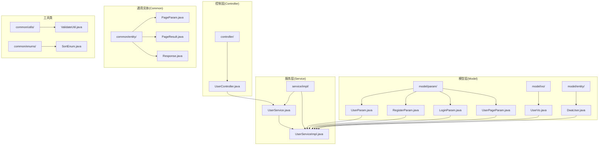
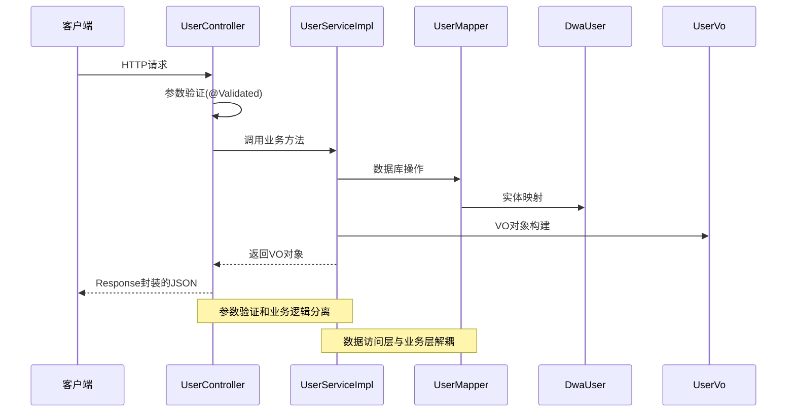
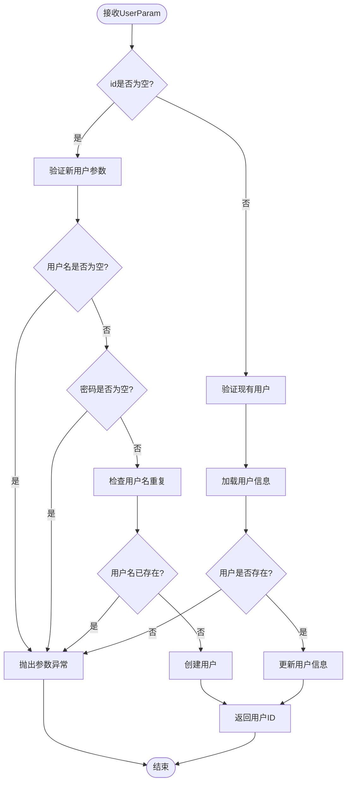
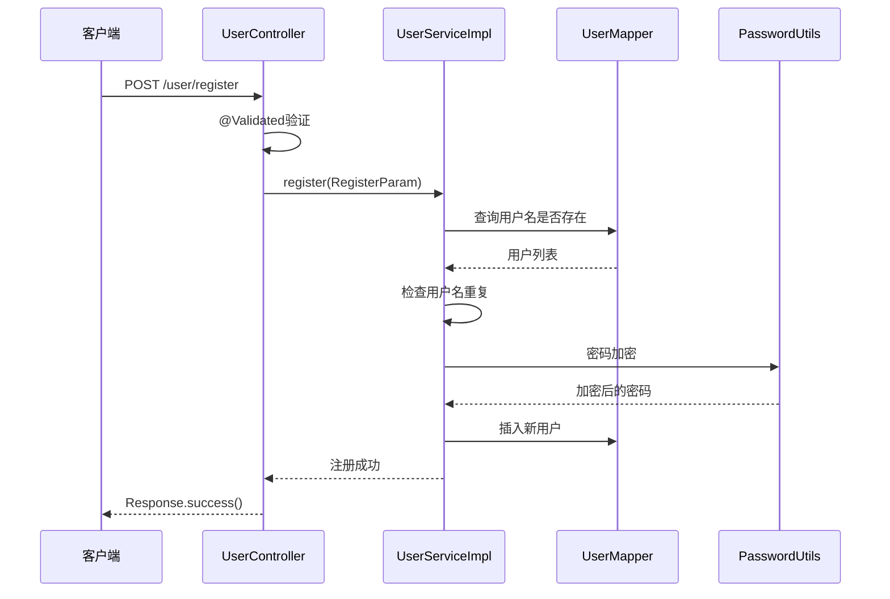
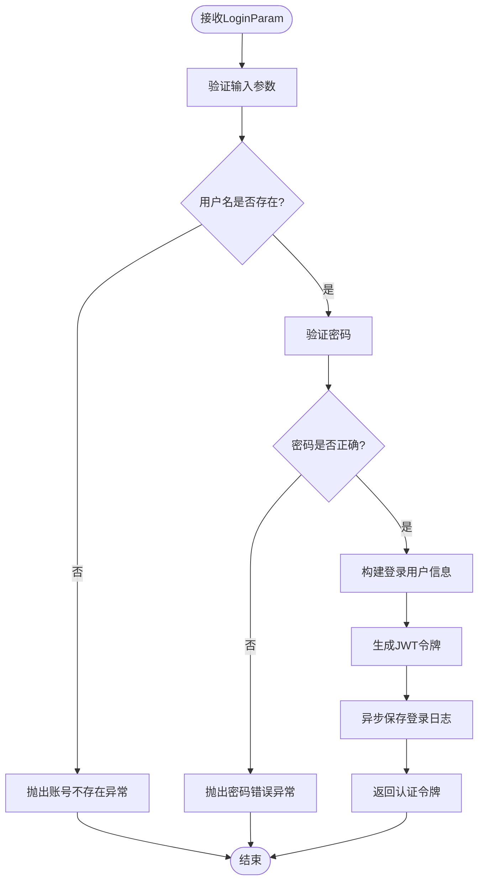
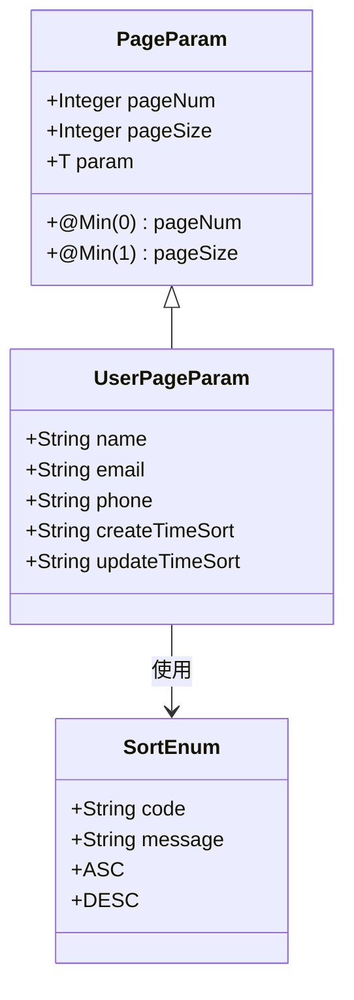
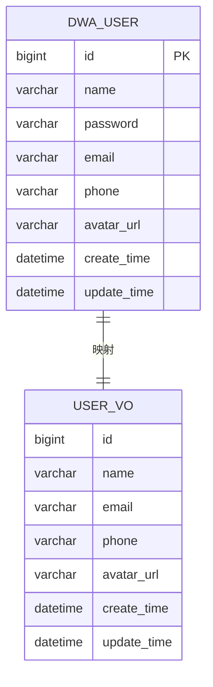
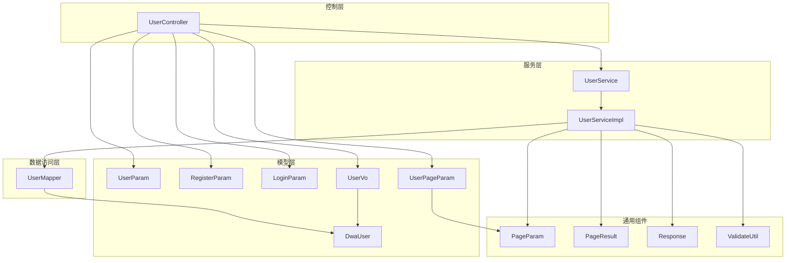
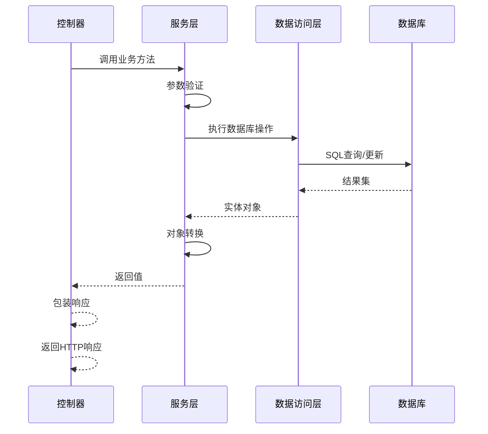
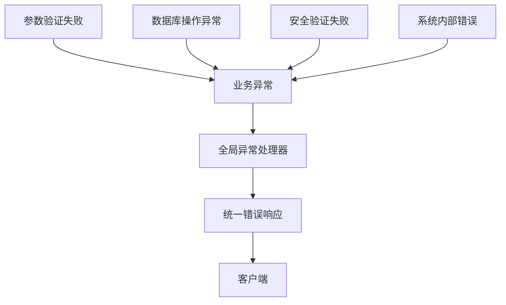

# 用户参数与返回值

<cite>
**本文档引用的文件**
- [UserParam.java](file://src/main/java/com/dw/admin/model/param/UserParam.java)
- [RegisterParam.java](file://src/main/java/com/dw/admin/model/param/RegisterParam.java)
- [LoginParam.java](file://src/main/java/com/dw/admin/model/param/LoginParam.java)
- [UserPageParam.java](file://src/main/java/com/dw/admin/model/param/UserPageParam.java)
- [UserVo.java](file://src/main/java/com/dw/admin/model/vo/UserVo.java)
- [PageParam.java](file://src/main/java/com/dw/admin/common/entity/PageParam.java)
- [PageResult.java](file://src/main/java/com/dw/admin/common/entity/PageResult.java)
- [Response.java](file://src/main/java/com/dw/admin/common/entity/Response.java)
- [UserController.java](file://src/main/java/com/dw/admin/controller/UserController.java)
- [UserService.java](file://src/main/java/com/dw/admin/service/UserService.java)
- [UserServiceImpl.java](file://src/main/java/com/dw/admin/service/impl/UserServiceImpl.java)
- [DwaUser.java](file://src/main/java/com/dw/admin/model/entity/DwaUser.java)
- [ValidateUtil.java](file://src/main/java/com/dw/admin/common/utils/ValidateUtil.java)
- [SortEnum.java](file://src/main/java/com/dw/admin/common/enums/SortEnum.java)
</cite>

## 目录
1. [简介](#简介)
2. [项目结构](#项目结构)
3. [核心组件](#核心组件)
4. [架构概览](#架构概览)
5. [详细组件分析](#详细组件分析)
6. [依赖关系分析](#依赖关系分析)
7. [性能考虑](#性能考虑)
8. [故障排除指南](#故障排除指南)
9. [结论](#结论)
10. [附录](#附录)

## 简介

本文档详细阐述了dw-admin项目中用户相关的参数类和返回值类的设计与实现。重点分析了以下核心组件：
- 用户参数类：UserParam、RegisterParam、LoginParam、UserPageParam
- 用户返回值类：UserVo
- 数据传输对象的设计原则和最佳实践
- 参数验证机制和错误处理策略
- 完整的参数示例和返回值示例

这些组件构成了用户管理模块的完整数据流，从请求参数接收、验证、业务处理到响应数据封装的全链路设计。

## 项目结构

用户参数与返回值相关的核心文件组织如下：



**图表来源**
- [UserParam.java](file://src/main/java/com/dw/admin/model/param/UserParam.java#L1-L37)
- [RegisterParam.java](file://src/main/java/com/dw/admin/model/param/RegisterParam.java#L1-L36)
- [LoginParam.java](file://src/main/java/com/dw/admin/model/param/LoginParam.java#L1-L31)
- [UserPageParam.java](file://src/main/java/com/dw/admin/model/param/UserPageParam.java#L1-L39)
- [UserVo.java](file://src/main/java/com/dw/admin/model/vo/UserVo.java#L1-L57)
- [DwaUser.java](file://src/main/java/com/dw/admin/model/entity/DwaUser.java#L1-L73)
- [UserController.java](file://src/main/java/com/dw/admin/controller/UserController.java#L1-L138)
- [UserService.java](file://src/main/java/com/dw/admin/service/UserService.java#L1-L59)
- [UserServiceImpl.java](file://src/main/java/com/dw/admin/service/impl/UserServiceImpl.java#L1-L270)

## 核心组件

### 参数类概述

系统中的用户相关参数类采用DTO（数据传输对象）模式，每个类都有明确的职责分工：

| 组件 | 类型 | 主要用途 | 验证规则 |
|------|------|----------|----------|
| UserParam | 用户信息入参 | 用户信息的增删改查操作 | 基础字段验证 |
| RegisterParam | 注册用户入参 | 用户注册流程 | 必填字段、长度限制 |
| LoginParam | 用户登录入参 | 用户身份认证 | 必填字段、长度限制 |
| UserPageParam | 用户分页查询入参 | 用户列表分页查询 | 分页参数验证 |

### 返回值类概述

UserVo作为用户信息的统一返回格式，采用VO（视图对象）模式：

| 字段 | 类型 | 描述 | 序列化策略 |
|------|------|------|------------|
| id | Long | 用户唯一标识 | 原始类型 |
| name | String | 用户名 | 原始类型 |
| email | String | 邮箱地址 | 原始类型 |
| phone | String | 手机号码 | 原始类型 |
| avatarUrl | String | 头像URL | 原始类型 |
| createTime | LocalDateTime | 创建时间 | JSON格式化 |
| updateTime | LocalDateTime | 更新时间 | JSON格式化 |

**章节来源**
- [UserParam.java](file://src/main/java/com/dw/admin/model/param/UserParam.java#L1-L37)
- [RegisterParam.java](file://src/main/java/com/dw/admin/model/param/RegisterParam.java#L1-L36)
- [LoginParam.java](file://src/main/java/com/dw/admin/model/param/LoginParam.java#L1-L31)
- [UserPageParam.java](file://src/main/java/com/dw/admin/model/param/UserPageParam.java#L1-L39)
- [UserVo.java](file://src/main/java/com/dw/admin/model/vo/UserVo.java#L1-L57)

## 架构概览

用户参数与返回值在整个系统架构中的位置如下：



**图表来源**
- [UserController.java](file://src/main/java/com/dw/admin/controller/UserController.java#L36-L54)
- [UserServiceImpl.java](file://src/main/java/com/dw/admin/service/impl/UserServiceImpl.java#L58-L72)
- [DwaUser.java](file://src/main/java/com/dw/admin/model/entity/DwaUser.java#L25-L73)
- [UserVo.java](file://src/main/java/com/dw/admin/model/vo/UserVo.java#L16-L57)

## 详细组件分析

### UserParam 参数类

UserParam是用户信息的基础参数类，用于用户信息的增删改查操作。

#### 字段定义与验证

| 字段名 | 类型 | 是否必填 | 验证规则 | 用途说明 |
|--------|------|----------|----------|----------|
| id | Long | 否 | 无 | 用户唯一标识符 |
| name | String | 是 | 无 | 用户真实姓名 |
| password | String | 是 | 无 | 登录密码 |
| email | String | 否 | 无 | 邮箱地址 |
| phone | String | 否 | 无 | 手机号码 |
| avatarUrl | String | 否 | 无 | 头像图片URL |

#### 使用场景

1. **新增用户**：当id为null时，执行用户创建操作
2. **修改用户**：当id存在时，执行用户更新操作
3. **管理员操作**：需要管理员权限才能进行用户信息修改

#### 处理流程



**图表来源**
- [UserServiceImpl.java](file://src/main/java/com/dw/admin/service/impl/UserServiceImpl.java#L129-L170)
- [ValidateUtil.java](file://src/main/java/com/dw/admin/common/utils/ValidateUtil.java#L42-L60)

**章节来源**
- [UserParam.java](file://src/main/java/com/dw/admin/model/param/UserParam.java#L13-L37)
- [UserServiceImpl.java](file://src/main/java/com/dw/admin/service/impl/UserServiceImpl.java#L129-L170)

### RegisterParam 参数类

RegisterParam专门用于用户注册场景，包含严格的参数验证规则。

#### 字段定义与验证规则

| 字段名 | 类型 | 验证注解 | 验证规则 | 错误消息 |
|--------|------|----------|----------|----------|
| username | String | @NotBlank | 必填字段 | 不能为空 |
| password | String | @NotBlank, @Size | 必填且6-15字符 | 密码长度在6-15之间 |
| code | String | 无 | 可选验证码 | 无 |

#### 注册流程



**图表来源**
- [UserController.java](file://src/main/java/com/dw/admin/controller/UserController.java#L36-L42)
- [UserServiceImpl.java](file://src/main/java/com/dw/admin/service/impl/UserServiceImpl.java#L58-L72)

**章节来源**
- [RegisterParam.java](file://src/main/java/com/dw/admin/model/param/RegisterParam.java#L18-L36)
- [UserServiceImpl.java](file://src/main/java/com/dw/admin/service/impl/UserServiceImpl.java#L58-L72)

### LoginParam 参数类

LoginParam用于用户登录认证，包含登录凭证的验证规则。

#### 字段定义与验证规则

| 字段名 | 类型 | 验证注解 | 验证规则 | 错误消息 |
|--------|------|----------|----------|----------|
| username | String | @NotBlank | 必填字段 | 不能为空 |
| password | String | @NotBlank, @Size | 必填且6-15字符 | 密码长度在6-15之间 |

#### 登录认证流程



**图表来源**
- [UserServiceImpl.java](file://src/main/java/com/dw/admin/service/impl/UserServiceImpl.java#L78-L108)

**章节来源**
- [LoginParam.java](file://src/main/java/com/dw/admin/model/param/LoginParam.java#L17-L31)
- [UserServiceImpl.java](file://src/main/java/com/dw/admin/service/impl/UserServiceImpl.java#L78-L108)

### UserPageParam 参数类

UserPageParam继承自PageParam，用于用户列表的分页查询。

#### 继承关系



**图表来源**
- [PageParam.java](file://src/main/java/com/dw/admin/common/entity/PageParam.java#L18-L43)
- [UserPageParam.java](file://src/main/java/com/dw/admin/model/param/UserPageParam.java#L14-L39)
- [SortEnum.java](file://src/main/java/com/dw/admin/common/enums/SortEnum.java#L8-L31)

#### 查询条件构建

UserPageParam支持多字段模糊查询和排序功能：

| 查询字段 | 查询方式 | 排序选项 |
|----------|----------|----------|
| name | 模糊匹配 | 支持升序/降序 |
| email | 模糊匹配 | 支持升序/降序 |
| phone | 模糊匹配 | 支持升序/降序 |
| createTime | 精确匹配 | 默认按更新时间降序 |

**章节来源**
- [UserPageParam.java](file://src/main/java/com/dw/admin/model/param/UserPageParam.java#L14-L39)
- [UserServiceImpl.java](file://src/main/java/com/dw/admin/service/impl/UserServiceImpl.java#L231-L267)

### UserVo 返回值类

UserVo是用户信息的统一返回格式，采用标准的JavaBean设计。

#### 字段映射策略

UserVo与DwaUser实体之间的字段映射遵循以下原则：



**图表来源**
- [DwaUser.java](file://src/main/java/com/dw/admin/model/entity/DwaUser.java#L25-L73)
- [UserVo.java](file://src/main/java/com/dw/admin/model/vo/UserVo.java#L16-L57)

#### 序列化策略

UserVo的时间字段采用特定的JSON序列化格式：

| 字段 | 序列化注解 | 格式模式 | 时区设置 |
|------|------------|----------|----------|
| createTime | @JsonFormat | yyyy-MM-dd HH:mm:ss | GMT+8 |
| updateTime | @JsonFormat | yyyy-MM-dd HH:mm:ss | GMT+8 |

**章节来源**
- [UserVo.java](file://src/main/java/com/dw/admin/model/vo/UserVo.java#L16-L57)

## 依赖关系分析

### 组件依赖图



**图表来源**
- [UserController.java](file://src/main/java/com/dw/admin/controller/UserController.java#L25-L138)
- [UserService.java](file://src/main/java/com/dw/admin/service/UserService.java#L16-L59)
- [UserServiceImpl.java](file://src/main/java/com/dw/admin/service/impl/UserServiceImpl.java#L40-L270)
- [UserParam.java](file://src/main/java/com/dw/admin/model/param/UserParam.java#L13-L37)

### 数据流依赖



**图表来源**
- [UserController.java](file://src/main/java/com/dw/admin/controller/UserController.java#L36-L135)
- [UserServiceImpl.java](file://src/main/java/com/dw/admin/service/impl/UserServiceImpl.java#L58-L267)

**章节来源**
- [UserController.java](file://src/main/java/com/dw/admin/controller/UserController.java#L25-L138)
- [UserService.java](file://src/main/java/com/dw/admin/service/UserService.java#L16-L59)
- [UserServiceImpl.java](file://src/main/java/com/dw/admin/service/impl/UserServiceImpl.java#L40-L270)

## 性能考虑

### 查询优化策略

1. **索引设计建议**
   - 在用户名字段上建立唯一索引以支持快速查找
   - 在邮箱和手机号字段上建立普通索引以支持模糊查询
   - 在创建时间和更新时间字段上建立索引以支持排序查询

2. **分页查询优化**
   - 使用LIMIT和OFFSET进行分页，避免一次性加载大量数据
   - 对于大数据量场景，考虑使用基于游标的分页方案

3. **缓存策略**
   - 对热点用户信息进行缓存，减少数据库查询压力
   - 使用Redis等内存数据库存储用户会话信息

### 内存使用优化

1. **对象池化**
   - 对频繁创建的对象使用对象池技术
   - 减少垃圾回收压力

2. **流式处理**
   - 对大数据量的导出操作采用流式处理
   - 避免一次性加载到内存

## 故障排除指南

### 常见参数验证错误

| 错误类型 | 触发条件 | 解决方案 |
|----------|----------|----------|
| 参数为空 | @NotBlank注解验证失败 | 检查客户端传参是否正确 |
| 密码长度不符 | @Size注解验证失败 | 确保密码长度在6-15字符之间 |
| 用户名重复 | 数据库唯一约束冲突 | 修改用户名或检查数据库状态 |
| 用户不存在 | 查询结果为空 | 检查用户ID是否正确 |

### 异常处理机制

系统采用统一的异常处理机制：



**图表来源**
- [ValidateUtil.java](file://src/main/java/com/dw/admin/common/utils/ValidateUtil.java#L24-L40)
- [Response.java](file://src/main/java/com/dw/admin/common/entity/Response.java#L100-L130)

**章节来源**
- [ValidateUtil.java](file://src/main/java/com/dw/admin/common/utils/ValidateUtil.java#L17-L83)
- [Response.java](file://src/main/java/com/dw/admin/common/entity/Response.java#L15-L132)

## 结论

用户参数与返回值模块展现了良好的软件工程实践：

1. **清晰的职责分离**：参数类、返回值类、实体类各司其职，职责边界明确
2. **完善的验证机制**：结合注解验证和业务验证，确保数据完整性
3. **标准化的响应格式**：统一的Response包装，便于前端处理
4. **可扩展的设计**：基于接口的架构设计，便于功能扩展和维护

该模块为整个用户管理功能提供了坚实的数据基础，遵循了RESTful API设计原则和最佳实践。

## 附录

### 参数示例

#### 注册请求示例
```json
{
  "username": "john_doe",
  "password": "password123",
  "code": "ABC123"
}
```

#### 登录请求示例
```json
{
  "username": "john_doe",
  "password": "password123"
}
```

#### 用户信息更新请求示例
```json
{
  "id": 1,
  "name": "John Doe",
  "email": "john@example.com",
  "phone": "13800000000",
  "avatarUrl": "https://example.com/avatar.jpg"
}
```

#### 分页查询请求示例
```json
{
  "pageNum": 1,
  "pageSize": 10,
  "name": "john",
  "email": "@example.com",
  "phone": "138",
  "createTimeSort": "desc",
  "updateTimeSort": "desc"
}
```

### 返回值示例

#### 用户信息响应示例
```json
{
  "id": 1,
  "name": "John Doe",
  "email": "john@example.com",
  "phone": "13800000000",
  "avatarUrl": "https://example.com/avatar.jpg",
  "createTime": "2023-01-01 12:00:00",
  "updateTime": "2023-01-01 12:00:00"
}
```

#### 分页查询响应示例
```json
{
  "pageNum": 1,
  "pageSize": 10,
  "pages": 5,
  "total": 50,
  "list": [
    {
      "id": 1,
      "name": "User1",
      "email": "user1@example.com",
      "phone": "13800000001",
      "avatarUrl": "",
      "createTime": "2023-01-01 12:00:00",
      "updateTime": "2023-01-01 12:00:00"
    }
  ]
}
```

### 设计原则总结

1. **单一职责原则**：每个类只负责特定的功能领域
2. **开闭原则**：对扩展开放，对修改封闭
3. **里氏替换原则**：子类可以替换父类而不影响程序正确性
4. **接口隔离原则**：客户端不应该依赖它不需要的接口
5. **依赖倒置原则**：高层模块不应该依赖低层模块

这些原则确保了系统的可维护性和可扩展性，为后续功能开发奠定了良好基础。