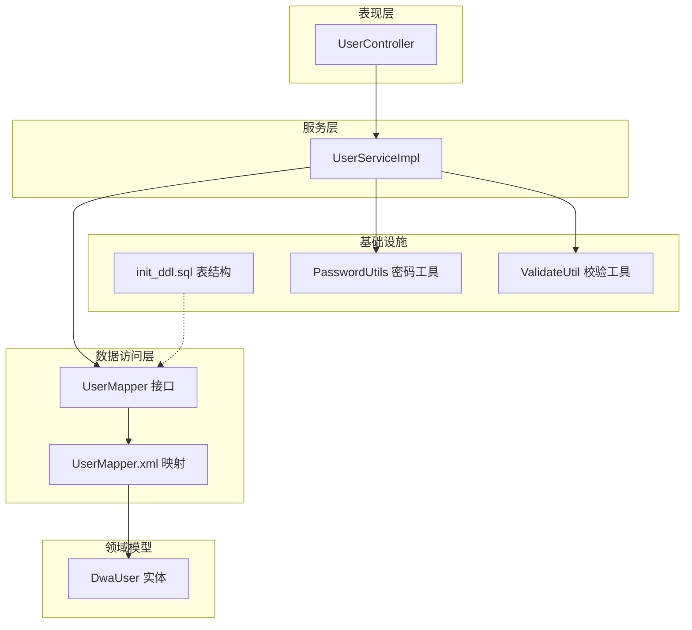
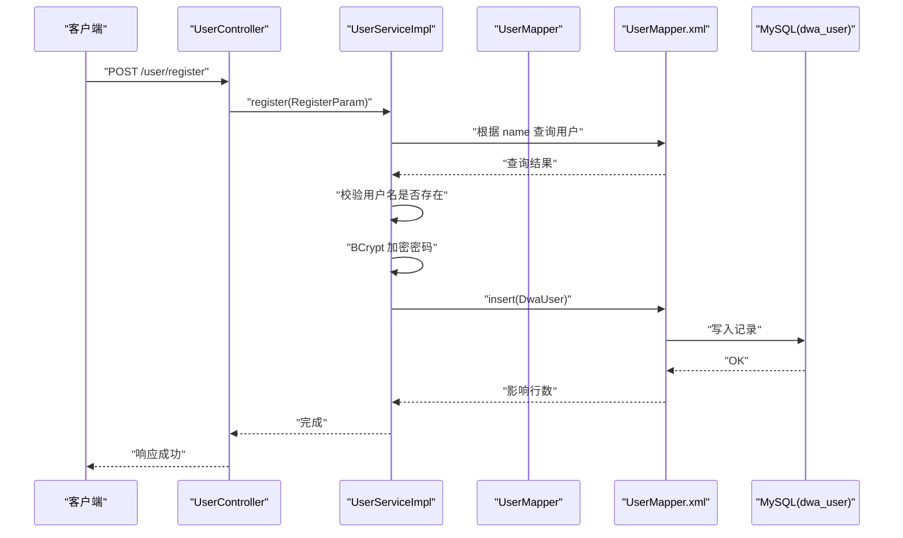
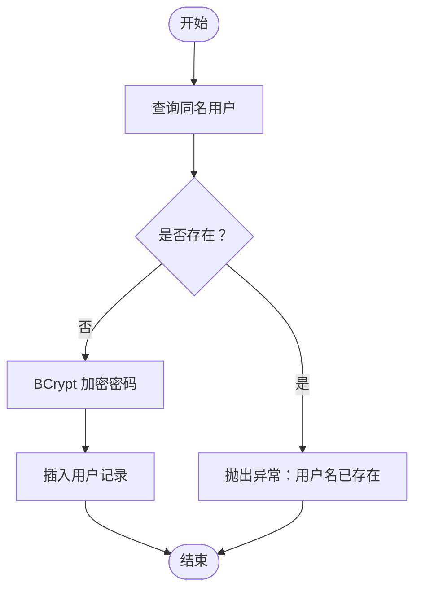
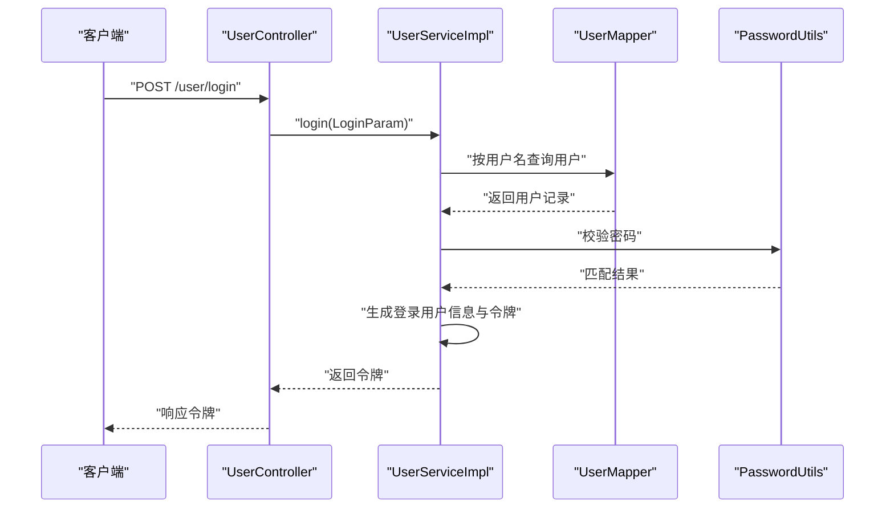
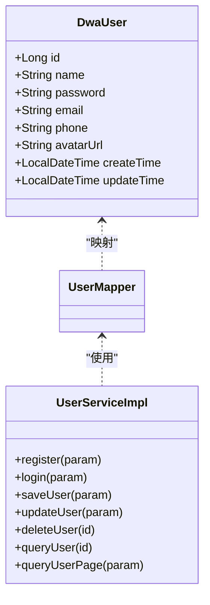

# 用户实体模型

<cite>
**本文引用的文件**
- [DwaUser.java](file://src/main/java/com/dw/admin/model/entity/DwaUser.java)
- [UserMapper.xml](file://src/main/resources/mapper/UserMapper.xml)
- [init_ddl.sql](file://docs/sql/init_ddl.sql)
- [UserMapper.java](file://src/main/java/com/dw/admin/dao/UserMapper.java)
- [UserServiceImpl.java](file://src/main/java/com/dw/admin/service/impl/UserServiceImpl.java)
- [UserController.java](file://src/main/java/com/dw/admin/controller/UserController.java)
- [UserParam.java](file://src/main/java/com/dw/admin/model/param/UserParam.java)
- [RegisterParam.java](file://src/main/java/com/dw/admin/model/param/RegisterParam.java)
- [LoginParam.java](file://src/main/java/com/dw/admin/model/param/LoginParam.java)
- [UserVo.java](file://src/main/java/com/dw/admin/model/vo/UserVo.java)
- [UserPageParam.java](file://src/main/java/com/dw/admin/model/param/UserPageParam.java)
- [PasswordUtils.java](file://src/main/java/com/dw/admin/common/utils/PasswordUtils.java)
- [ValidateUtil.java](file://src/main/java/com/dw/admin/common/utils/ValidateUtil.java)
</cite>

## 目录
1. [简介](#简介)
2. [项目结构](#项目结构)
3. [核心组件](#核心组件)
4. [架构总览](#架构总览)
5. [详细组件分析](#详细组件分析)
6. [依赖分析](#依赖分析)
7. [性能考虑](#性能考虑)
8. [故障排查指南](#故障排查指南)
9. [结论](#结论)
10. [附录](#附录)

## 简介
本文件围绕用户实体模型 DwaUser 的设计与使用进行系统化说明，覆盖实体类字段定义、数据库映射关系、字段约束与验证规则、业务流程与最佳实践等内容。目标是帮助开发者快速理解并正确使用该实体模型。

## 项目结构
用户相关模块采用典型的分层架构：
- 控制器层：接收请求并调用服务层
- 服务层：处理业务逻辑，封装数据访问
- 数据访问层：基于 MyBatis-Plus 的 Mapper 接口与 XML 映射
- 模型层：实体类、参数类、返回值类
- 工具与配置：密码加密、参数校验、SQL 初始化脚本

图表来源
- [UserController.java](file://src/main/java/com/dw/admin/controller/UserController.java#L1-L138)
- [UserServiceImpl.java](file://src/main/java/com/dw/admin/service/impl/UserServiceImpl.java#L1-L270)
- [UserMapper.java](file://src/main/java/com/dw/admin/dao/UserMapper.java#L1-L16)
- [UserMapper.xml](file://src/main/resources/mapper/UserMapper.xml#L1-L23)
- [DwaUser.java](file://src/main/java/com/dw/admin/model/entity/DwaUser.java#L1-L73)
- [init_ddl.sql](file://docs/sql/init_ddl.sql#L1-L93)
- [PasswordUtils.java](file://src/main/java/com/dw/admin/common/utils/PasswordUtils.java#L1-L28)
- [ValidateUtil.java](file://src/main/java/com/dw/admin/common/utils/ValidateUtil.java#L1-L83)

章节来源
- [UserController.java](file://src/main/java/com/dw/admin/controller/UserController.java#L1-L138)
- [UserServiceImpl.java](file://src/main/java/com/dw/admin/service/impl/UserServiceImpl.java#L1-L270)
- [UserMapper.java](file://src/main/java/com/dw/admin/dao/UserMapper.java#L1-L16)
- [UserMapper.xml](file://src/main/resources/mapper/UserMapper.xml#L1-L23)
- [DwaUser.java](file://src/main/java/com/dw/admin/model/entity/DwaUser.java#L1-L73)
- [init_ddl.sql](file://docs/sql/init_ddl.sql#L1-L93)
- [PasswordUtils.java](file://src/main/java/com/dw/admin/common/utils/PasswordUtils.java#L1-L28)
- [ValidateUtil.java](file://src/main/java/com/dw/admin/common/utils/ValidateUtil.java#L1-L83)

## 核心组件
- 实体类 DwaUser：承载用户表的字段与元数据注解，用于 MyBatis-Plus ORM 映射
- Mapper 接口与 XML：定义通用映射关系与列清单
- 服务实现 UserServiceImpl：封装注册、登录、保存、更新、删除、查询等业务逻辑
- 控制器 UserController：对外暴露 REST 接口，绑定参数与权限控制
- 参数与返回值：RegisterParam、LoginParam、UserParam、UserVo、UserPageParam
- 工具类：PasswordUtils（BCrypt 密码加解密）、ValidateUtil（统一参数校验）

章节来源
- [DwaUser.java](file://src/main/java/com/dw/admin/model/entity/DwaUser.java#L1-L73)
- [UserMapper.java](file://src/main/java/com/dw/admin/dao/UserMapper.java#L1-L16)
- [UserMapper.xml](file://src/main/resources/mapper/UserMapper.xml#L1-L23)
- [UserServiceImpl.java](file://src/main/java/com/dw/admin/service/impl/UserServiceImpl.java#L1-L270)
- [UserController.java](file://src/main/java/com/dw/admin/controller/UserController.java#L1-L138)
- [RegisterParam.java](file://src/main/java/com/dw/admin/model/param/RegisterParam.java#L1-L36)
- [LoginParam.java](file://src/main/java/com/dw/admin/model/param/LoginParam.java#L1-L31)
- [UserParam.java](file://src/main/java/com/dw/admin/model/param/UserParam.java#L1-L37)
- [UserVo.java](file://src/main/java/com/dw/admin/model/vo/UserVo.java#L1-L57)
- [UserPageParam.java](file://src/main/java/com/dw/admin/model/param/UserPageParam.java#L1-L39)
- [PasswordUtils.java](file://src/main/java/com/dw/admin/common/utils/PasswordUtils.java#L1-L28)
- [ValidateUtil.java](file://src/main/java/com/dw/admin/common/utils/ValidateUtil.java#L1-L83)

## 架构总览
下图展示从接口到数据库的完整调用链路与实体映射关系：

图表来源
- [UserController.java](file://src/main/java/com/dw/admin/controller/UserController.java#L36-L42)
- [UserServiceImpl.java](file://src/main/java/com/dw/admin/service/impl/UserServiceImpl.java#L58-L72)
- [UserMapper.xml](file://src/main/resources/mapper/UserMapper.xml#L6-L15)
- [DwaUser.java](file://src/main/java/com/dw/admin/model/entity/DwaUser.java#L24-L72)
- [init_ddl.sql](file://docs/sql/init_ddl.sql#L12-L22)

## 详细组件分析

### 实体类 DwaUser 设计与字段说明
- 类注解与映射
  - 使用表名注解映射到数据库表 dwa_user
  - 主键字段 id 使用分布式 ID 策略
  - 时间字段通过自动填充策略设置创建与更新时间
- 字段定义与约束
  - 用户ID：主键，长整型
  - 用户名：字符串，非空
  - 密码：字符串，可空（注册时由服务层加密后入库）
  - 邮箱：字符串，可空
  - 手机：字符串，可空
  - 头像URL：字符串，可空
  - 创建时间：自动插入
  - 更新时间：插入与更新均自动维护
- 字段命名规则
  - Java 驼峰命名：avatarUrl
  - 数据库下划线命名：avatar_url
  - 映射通过 MyBatis-Plus 自动转换或显式 column 属性指定

章节来源
- [DwaUser.java](file://src/main/java/com/dw/admin/model/entity/DwaUser.java#L13-L72)
- [UserMapper.xml](file://src/main/resources/mapper/UserMapper.xml#L6-L15)
- [init_ddl.sql](file://docs/sql/init_ddl.sql#L12-L22)

### 数据库表结构与实体映射
- 表结构要点
  - 主键：id（bigint）
  - 字段长度与可空性：参考初始化脚本
  - 注释明确字段含义
- 映射关系
  - 实体类与表字段一一对应，驼峰与下划线自动映射
  - XML 中显式声明了所有字段的 column 与 property 对应关系
- 主键策略
  - 实体类注解使用分布式 ID 策略，确保唯一性
  - 数据库表主键为自增或由应用生成（取决于具体实现）

章节来源
- [init_ddl.sql](file://docs/sql/init_ddl.sql#L12-L22)
- [UserMapper.xml](file://src/main/resources/mapper/UserMapper.xml#L6-L15)
- [DwaUser.java](file://src/main/java/com/dw/admin/model/entity/DwaUser.java#L33-L72)

### 参数与验证规则
- 注册参数 RegisterParam
  - 用户名：必填
  - 密码：必填，长度 6-15
  - 验证码：可选
- 登录参数 LoginParam
  - 账号：必填
  - 密码：必填，长度 6-15
- 保存/更新参数 UserParam
  - 用户ID：新增时可空；更新时必填
  - 其余字段均为可空，按需更新
- 服务层校验
  - 新增时对用户名重复进行检查
  - 统一使用 ValidateUtil 进行参数校验
- 最佳实践
  - 前端提交前先做基础校验
  - 服务层二次校验，避免绕过
  - 密码必须经 PasswordUtils 加密后再入库

章节来源
- [RegisterParam.java](file://src/main/java/com/dw/admin/model/param/RegisterParam.java#L18-L36)
- [LoginParam.java](file://src/main/java/com/dw/admin/model/param/LoginParam.java#L17-L31)
- [UserParam.java](file://src/main/java/com/dw/admin/model/param/UserParam.java#L13-L37)
- [UserServiceImpl.java](file://src/main/java/com/dw/admin/service/impl/UserServiceImpl.java#L129-L170)
- [ValidateUtil.java](file://src/main/java/com/dw/admin/common/utils/ValidateUtil.java#L17-L83)
- [PasswordUtils.java](file://src/main/java/com/dw/admin/common/utils/PasswordUtils.java#L8-L28)

### 业务流程与使用示例

#### 注册流程
- 输入：RegisterParam（用户名、密码、验证码）
- 流程：
  - 校验用户名是否已存在
  - 使用 BCrypt 加密密码
  - 写入数据库
- 输出：无返回内容（成功即完成）

图表来源
- [UserServiceImpl.java](file://src/main/java/com/dw/admin/service/impl/UserServiceImpl.java#L58-L72)
- [PasswordUtils.java](file://src/main/java/com/dw/admin/common/utils/PasswordUtils.java#L15-L17)

章节来源
- [UserServiceImpl.java](file://src/main/java/com/dw/admin/service/impl/UserServiceImpl.java#L58-L72)
- [PasswordUtils.java](file://src/main/java/com/dw/admin/common/utils/PasswordUtils.java#L15-L17)

#### 登录流程
- 输入：LoginParam（账号、密码）
- 流程：
  - 根据用户名查询用户
  - 校验用户是否存在
  - 校验密码（BCrypt 匹配）
  - 生成登录用户信息与令牌
  - 异步记录登录日志
- 输出：返回令牌字符串

图表来源
- [UserController.java](file://src/main/java/com/dw/admin/controller/UserController.java#L50-L54)
- [UserServiceImpl.java](file://src/main/java/com/dw/admin/service/impl/UserServiceImpl.java#L78-L108)
- [PasswordUtils.java](file://src/main/java/com/dw/admin/common/utils/PasswordUtils.java#L25-L27)

章节来源
- [UserController.java](file://src/main/java/com/dw/admin/controller/UserController.java#L50-L54)
- [UserServiceImpl.java](file://src/main/java/com/dw/admin/service/impl/UserServiceImpl.java#L78-L108)
- [PasswordUtils.java](file://src/main/java/com/dw/admin/common/utils/PasswordUtils.java#L25-L27)

#### 保存/更新用户
- 新增场景：
  - 校验用户名唯一
  - 加密密码后写入
- 更新场景：
  - 仅更新传入的非空字段
  - 自动更新更新时间为当前时间

章节来源
- [UserServiceImpl.java](file://src/main/java/com/dw/admin/service/impl/UserServiceImpl.java#L129-L170)

### 返回值与分页查询
- 返回值 UserVo：包含用户基本信息与时间格式化输出
- 分页参数 UserPageParam：支持按用户名、邮箱、手机模糊查询与时间排序
- 服务层分页查询：默认按更新时间降序，支持自定义排序

章节来源
- [UserVo.java](file://src/main/java/com/dw/admin/model/vo/UserVo.java#L16-L57)
- [UserPageParam.java](file://src/main/java/com/dw/admin/model/param/UserPageParam.java#L14-L39)
- [UserServiceImpl.java](file://src/main/java/com/dw/admin/service/impl/UserServiceImpl.java#L230-L267)

## 依赖分析
- 实体与映射
  - DwaUser 通过注解与 UserMapper.xml 映射到 dwa_user 表
  - UserMapper 继承 MyBatis-Plus 基类，复用通用 CRUD
- 服务层依赖
  - UserServiceImpl 依赖 UserMapper、PasswordUtils、ValidateUtil
  - 控制器依赖 UserService 接口
- 数据一致性
  - 插入时自动填充创建时间
  - 更新时自动填充更新时间
  - 密码统一加密存储

图表来源
- [DwaUser.java](file://src/main/java/com/dw/admin/model/entity/DwaUser.java#L25-L72)
- [UserMapper.java](file://src/main/java/com/dw/admin/dao/UserMapper.java#L13-L15)
- [UserServiceImpl.java](file://src/main/java/com/dw/admin/service/impl/UserServiceImpl.java#L40-L270)

章节来源
- [DwaUser.java](file://src/main/java/com/dw/admin/model/entity/DwaUser.java#L25-L72)
- [UserMapper.java](file://src/main/java/com/dw/admin/dao/UserMapper.java#L13-L15)
- [UserServiceImpl.java](file://src/main/java/com/dw/admin/service/impl/UserServiceImpl.java#L40-L270)

## 性能考虑
- 数据库层面
  - 为主键 id 建立索引（默认主键即索引）
  - 在高频查询字段（如 name、email、phone）上建立合适索引以优化模糊查询
- 应用层面
  - 使用分页查询避免一次性加载大量数据
  - 合理使用自动填充字段，减少手动赋值
  - 密码加密采用 BCrypt，兼顾安全性与性能
- 缓存与限流
  - 控制器层对注册与登录接口设置了限流，防止恶意刷单

章节来源
- [init_ddl.sql](file://docs/sql/init_ddl.sql#L12-L22)
- [UserServiceImpl.java](file://src/main/java/com/dw/admin/service/impl/UserServiceImpl.java#L230-L267)
- [PasswordUtils.java](file://src/main/java/com/dw/admin/common/utils/PasswordUtils.java#L15-L17)
- [UserController.java](file://src/main/java/com/dw/admin/controller/UserController.java#L37-L50)

## 故障排查指南
- 常见错误与定位
  - 用户名已存在：注册或保存用户时触发
  - 账号不存在或密码不正确：登录阶段触发
  - 参数为空：服务层统一校验抛出
- 定位步骤
  - 查看控制器层请求路径与参数绑定
  - 定位服务层方法，确认业务分支
  - 检查数据库中对应记录是否存在
- 建议
  - 前端先行校验，减少无效请求
  - 服务层统一异常处理，返回明确错误信息
  - 关注密码加密与匹配逻辑

章节来源
- [UserServiceImpl.java](file://src/main/java/com/dw/admin/service/impl/UserServiceImpl.java#L63-L65)
- [UserServiceImpl.java](file://src/main/java/com/dw/admin/service/impl/UserServiceImpl.java#L83-L88)
- [ValidateUtil.java](file://src/main/java/com/dw/admin/common/utils/ValidateUtil.java#L42-L50)

## 结论
DwaUser 实体模型遵循清晰的命名规范与映射约定，结合 MyBatis-Plus 的自动填充与通用 Mapper，实现了简洁高效的用户数据持久化能力。配合参数校验、密码加密与统一异常处理，整体具备良好的可维护性与扩展性。建议在后续迭代中进一步完善索引策略与日志审计，持续提升系统稳定性与性能。

## 附录

### 字段对照表（实体与数据库）
- 用户ID：id（Long，主键）
- 用户名：name（String）
- 密码：password（String）
- 邮箱：email（String）
- 手机：phone（String）
- 头像URL：avatar_url（String）
- 创建时间：create_time（LocalDateTime）
- 更新时间：update_time（LocalDateTime）

章节来源
- [DwaUser.java](file://src/main/java/com/dw/admin/model/entity/DwaUser.java#L33-L72)
- [UserMapper.xml](file://src/main/resources/mapper/UserMapper.xml#L6-L15)
- [init_ddl.sql](file://docs/sql/init_ddl.sql#L12-L22)