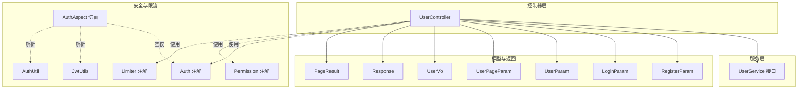
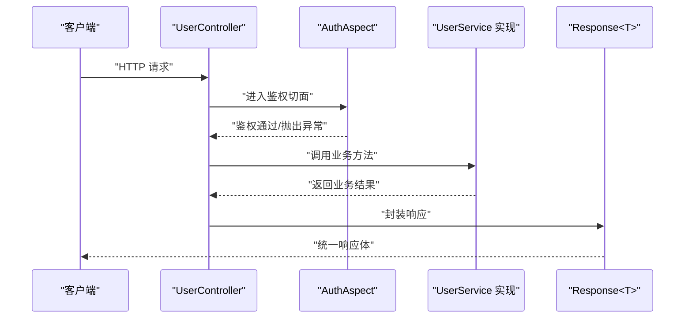
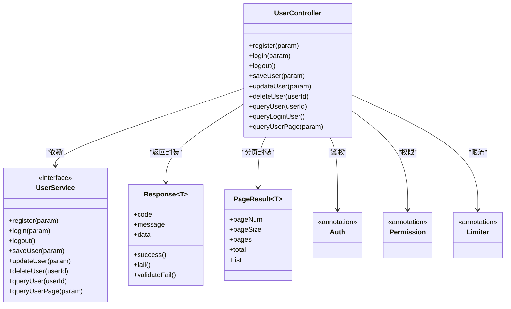

# 用户控制器API

<cite>
**本文引用的文件**
- [src/main/java/com/dw/admin/controller/UserController.java](file://src/main/java/com/dw/admin/controller/UserController.java)
- [src/main/java/com/dw/admin/service/UserService.java](file://src/main/java/com/dw/admin/service/UserService.java)
- [src/main/java/com/dw/admin/model/param/RegisterParam.java](file://src/main/java/com/dw/admin/model/param/RegisterParam.java)
- [src/main/java/com/dw/admin/model/param/LoginParam.java](file://src/main/java/com/dw/admin/model/param/LoginParam.java)
- [src/main/java/com/dw/admin/model/param/UserParam.java](file://src/main/java/com/dw/admin/model/param/UserParam.java)
- [src/main/java/com/dw/admin/model/param/UserPageParam.java](file://src/main/java/com/dw/admin/model/param/UserPageParam.java)
- [src/main/java/com/dw/admin/model/vo/UserVo.java](file://src/main/java/com/dw/admin/model/vo/UserVo.java)
- [src/main/java/com/dw/admin/common/entity/Response.java](file://src/main/java/com/dw/admin/common/entity/Response.java)
- [src/main/java/com/dw/admin/common/entity/PageResult.java](file://src/main/java/com/dw/admin/common/entity/PageResult.java)
- [src/main/java/com/dw/admin/components/auth/Auth.java](file://src/main/java/com/dw/admin/components/auth/Auth.java)
- [src/main/java/com/dw/admin/components/auth/AuthAspect.java](file://src/main/java/com/dw/admin/components/auth/AuthAspect.java)
- [src/main/java/com/dw/admin/components/auth/AuthUtil.java](file://src/main/java/com/dw/admin/components/auth/AuthUtil.java)
- [src/main/java/com/dw/admin/components/auth/JwtUtils.java](file://src/main/java/com/dw/admin/components/auth/JwtUtils.java)
- [src/main/java/com/dw/admin/components/permission/Permission.java](file://src/main/java/com/dw/admin/components/permission/Permission.java)
- [src/main/java/com/dw/admin/components/limiter/Limiter.java](file://src/main/java/com/dw/admin/components/limiter/Limiter.java)
- [src/main/resources/application.yml](file://src/main/resources/application.yml)
</cite>

## 目录
1. [简介](#简介)
2. [项目结构](#项目结构)
3. [核心组件](#核心组件)
4. [架构总览](#架构总览)
5. [详细接口文档](#详细接口文档)
6. [依赖关系分析](#依赖关系分析)
7. [性能与限流](#性能与限流)
8. [故障排查指南](#故障排查指南)
9. [结论](#结论)
10. [附录](#附录)

## 简介
本文件为用户控制器（UserController）提供的RESTful接口文档，覆盖以下接口：
- POST /user/register（用户注册）
- POST /user/login（用户登录）
- DELETE /user/logout（退出登录）
- POST /user/save（保存用户）
- POST /user/update（修改当前登录用户）
- DELETE /user/delete/{userId}（删除用户）
- GET /user/{userId}（查询用户）
- GET /user/query（查询当前登录用户）
- POST /user/list（查询用户列表）

文档内容包括：接口方法、URL模式、请求参数、响应格式、权限要求、限流策略、安全机制、错误处理策略、最佳实践与注意事项，并提供调用示例与序列图。

## 项目结构
用户控制器位于controller包下，配合service层、参数模型、返回封装、鉴权与权限控制、限流等组件协同工作。

图表来源
- [src/main/java/com/dw/admin/controller/UserController.java](file://src/main/java/com/dw/admin/controller/UserController.java#L25-L138)
- [src/main/java/com/dw/admin/service/UserService.java](file://src/main/java/com/dw/admin/service/UserService.java#L16-L58)
- [src/main/java/com/dw/admin/model/param/RegisterParam.java](file://src/main/java/com/dw/admin/model/param/RegisterParam.java#L18-L36)
- [src/main/java/com/dw/admin/model/param/LoginParam.java](file://src/main/java/com/dw/admin/model/param/LoginParam.java#L17-L31)
- [src/main/java/com/dw/admin/model/param/UserParam.java](file://src/main/java/com/dw/admin/model/param/UserParam.java#L13-L37)
- [src/main/java/com/dw/admin/model/param/UserPageParam.java](file://src/main/java/com/dw/admin/model/param/UserPageParam.java#L14-L39)
- [src/main/java/com/dw/admin/model/vo/UserVo.java](file://src/main/java/com/dw/admin/model/vo/UserVo.java#L16-L57)
- [src/main/java/com/dw/admin/common/entity/Response.java](file://src/main/java/com/dw/admin/common/entity/Response.java#L15-L132)
- [src/main/java/com/dw/admin/common/entity/PageResult.java](file://src/main/java/com/dw/admin/common/entity/PageResult.java#L16-L94)
- [src/main/java/com/dw/admin/components/auth/Auth.java](file://src/main/java/com/dw/admin/components/auth/Auth.java#L11-L16)
- [src/main/java/com/dw/admin/components/auth/AuthAspect.java](file://src/main/java/com/dw/admin/components/auth/AuthAspect.java#L22-L61)
- [src/main/java/com/dw/admin/components/auth/JwtUtils.java](file://src/main/java/com/dw/admin/components/auth/JwtUtils.java#L18-L55)
- [src/main/java/com/dw/admin/components/auth/AuthUtil.java](file://src/main/java/com/dw/admin/components/auth/AuthUtil.java#L17-L101)
- [src/main/java/com/dw/admin/components/permission/Permission.java](file://src/main/java/com/dw/admin/components/permission/Permission.java#L11-L22)
- [src/main/java/com/dw/admin/components/limiter/Limiter.java](file://src/main/java/com/dw/admin/components/limiter/Limiter.java#L12-L32)

章节来源
- [src/main/java/com/dw/admin/controller/UserController.java](file://src/main/java/com/dw/admin/controller/UserController.java#L25-L138)

## 核心组件
- 控制器：UserController 提供所有用户相关REST接口，统一返回Response封装。
- 服务接口：UserService 定义业务契约，具体实现由实现类提供。
- 参数模型：RegisterParam、LoginParam、UserParam、UserPageParam 封装请求体字段及校验规则。
- 返回模型：Response<T> 统一响应码与消息；PageResult<T> 用于分页列表。
- 安全与权限：Auth 注解与 AuthAspect 切面负责鉴权；Permission 注解限制角色；JwtUtils 与 AuthUtil 负责JWT签发与解析。
- 限流：Limiter 注解用于接口级限流，按IP或方法维度控制速率。

章节来源
- [src/main/java/com/dw/admin/service/UserService.java](file://src/main/java/com/dw/admin/service/UserService.java#L16-L58)
- [src/main/java/com/dw/admin/common/entity/Response.java](file://src/main/java/com/dw/admin/common/entity/Response.java#L15-L132)
- [src/main/java/com/dw/admin/common/entity/PageResult.java](file://src/main/java/com/dw/admin/common/entity/PageResult.java#L16-L94)
- [src/main/java/com/dw/admin/components/auth/Auth.java](file://src/main/java/com/dw/admin/components/auth/Auth.java#L11-L16)
- [src/main/java/com/dw/admin/components/auth/AuthAspect.java](file://src/main/java/com/dw/admin/components/auth/AuthAspect.java#L22-L61)
- [src/main/java/com/dw/admin/components/auth/JwtUtils.java](file://src/main/java/com/dw/admin/components/auth/JwtUtils.java#L18-L55)
- [src/main/java/com/dw/admin/components/auth/AuthUtil.java](file://src/main/java/com/dw/admin/components/auth/AuthUtil.java#L17-L101)
- [src/main/java/com/dw/admin/components/permission/Permission.java](file://src/main/java/com/dw/admin/components/permission/Permission.java#L11-L22)
- [src/main/java/com/dw/admin/components/limiter/Limiter.java](file://src/main/java/com/dw/admin/components/limiter/Limiter.java#L12-L32)

## 架构总览
用户控制器通过注解驱动完成鉴权、权限与限流，随后调用UserService执行业务逻辑，最终统一返回Response封装。

图表来源
- [src/main/java/com/dw/admin/controller/UserController.java](file://src/main/java/com/dw/admin/controller/UserController.java#L25-L138)
- [src/main/java/com/dw/admin/components/auth/AuthAspect.java](file://src/main/java/com/dw/admin/components/auth/AuthAspect.java#L32-L59)
- [src/main/java/com/dw/admin/common/entity/Response.java](file://src/main/java/com/dw/admin/common/entity/Response.java#L75-L95)

## 详细接口文档

### 通用约定
- 统一响应结构：参考 [Response<T>](file://src/main/java/com/dw/admin/common/entity/Response.java#L15-L132)，包含 code、message、data 字段。
- 分页返回：列表查询返回 [PageResult<UserVo>](file://src/main/java/com/dw/admin/common/entity/PageResult.java#L16-L94)，包含 pageNum、pageSize、pages、total、list。
- 认证头：鉴权接口需携带认证令牌，键值来自 [application.yml](file://src/main/resources/application.yml#L34-L36) 中的密钥配置。
- 时间格式：返回的日期时间字段采用指定时区格式，见 [UserVo](file://src/main/java/com/dw/admin/model/vo/UserVo.java#L48-L55)。

章节来源
- [src/main/java/com/dw/admin/common/entity/Response.java](file://src/main/java/com/dw/admin/common/entity/Response.java#L15-L132)
- [src/main/java/com/dw/admin/common/entity/PageResult.java](file://src/main/java/com/dw/admin/common/entity/PageResult.java#L16-L94)
- [src/main/java/com/dw/admin/model/vo/UserVo.java](file://src/main/java/com/dw/admin/model/vo/UserVo.java#L48-L55)
- [src/main/resources/application.yml](file://src/main/resources/application.yml#L34-L36)

---

### POST /user/register（用户注册）
- 方法与路径：POST /user/register
- 功能：注册新用户
- 请求体参数：RegisterParam
  - username：必填
  - password：必填，长度6-15
  - code：可选（验证码）
- 响应：Response<Void>
- 权限要求：无需登录
- 限流策略：按IP限流，速率约每10秒1次
- 安全机制：请求体参数校验；注册流程由服务层实现
- 错误处理：参数校验失败返回统一响应码；业务异常由全局异常处理捕获
- 示例
  - 请求示例（JSON）：见 [RegisterParam](file://src/main/java/com/dw/admin/model/param/RegisterParam.java#L18-L36)
  - 成功响应示例：code=200，message="成功"，data=null
  - 失败响应示例：code=400/500，message="参数校验不通过"/"失败"

章节来源
- [src/main/java/com/dw/admin/controller/UserController.java](file://src/main/java/com/dw/admin/controller/UserController.java#L36-L42)
- [src/main/java/com/dw/admin/model/param/RegisterParam.java](file://src/main/java/com/dw/admin/model/param/RegisterParam.java#L18-L36)
- [src/main/java/com/dw/admin/components/limiter/Limiter.java](file://src/main/java/com/dw/admin/components/limiter/Limiter.java#L15-L32)

---

### POST /user/login（用户登录）
- 方法与路径：POST /user/login
- 功能：用户登录并返回令牌
- 请求体参数：LoginParam
  - username：必填
  - password：必填，长度6-15
- 响应：Response<String>（令牌字符串）
- 权限要求：无需登录
- 限流策略：按IP限流，速率约每2秒1次
- 安全机制：JWT签发与校验；令牌缓存与黑名单校验
- 错误处理：参数校验失败返回统一响应码；鉴权失败返回401
- 示例
  - 请求示例（JSON）：见 [LoginParam](file://src/main/java/com/dw/admin/model/param/LoginParam.java#L17-L31)
  - 成功响应示例：code=200，message="成功"，data=令牌字符串
  - 失败响应示例：code=400/401/500

章节来源
- [src/main/java/com/dw/admin/controller/UserController.java](file://src/main/java/com/dw/admin/controller/UserController.java#L48-L54)
- [src/main/java/com/dw/admin/model/param/LoginParam.java](file://src/main/java/com/dw/admin/model/param/LoginParam.java#L17-L31)
- [src/main/java/com/dw/admin/components/limiter/Limiter.java](file://src/main/java/com/dw/admin/components/limiter/Limiter.java#L15-L32)
- [src/main/java/com/dw/admin/components/auth/JwtUtils.java](file://src/main/java/com/dw/admin/components/auth/JwtUtils.java#L38-L51)
- [src/main/java/com/dw/admin/components/auth/AuthUtil.java](file://src/main/java/com/dw/admin/components/auth/AuthUtil.java#L32-L55)

---

### DELETE /user/logout（退出登录）
- 方法与路径：DELETE /user/logout
- 功能：退出登录，使令牌失效
- 请求体参数：无
- 响应：Response<Void>
- 权限要求：需携带有效令牌
- 限流策略：无
- 安全机制：鉴权切面解析令牌并设置上下文；服务层执行登出逻辑
- 错误处理：令牌无效返回401；业务异常返回500
- 示例
  - 请求示例：携带令牌头（见鉴权说明）
  - 成功响应示例：code=200，message="成功"
  - 失败响应示例：code=401/500

章节来源
- [src/main/java/com/dw/admin/controller/UserController.java](file://src/main/java/com/dw/admin/controller/UserController.java#L59-L65)
- [src/main/java/com/dw/admin/components/auth/AuthAspect.java](file://src/main/java/com/dw/admin/components/auth/AuthAspect.java#L32-L59)

---

### POST /user/save（保存用户）
- 方法与路径：POST /user/save
- 功能：新增用户（管理员）
- 请求体参数：UserParam
  - id：可选
  - name/email/phone/avatarUrl：可选
  - password：可选
- 响应：Response<Long>（返回新增用户ID）
- 权限要求：需登录且具备管理员角色
- 限流策略：无
- 安全机制：鉴权+角色校验（admin）
- 错误处理：参数校验失败返回400；权限不足返回403；业务异常返回500
- 示例
  - 请求示例（JSON）：见 [UserParam](file://src/main/java/com/dw/admin/model/param/UserParam.java#L13-L37)
  - 成功响应示例：code=200，message="成功"，data=userId
  - 失败响应示例：code=401/403/500

章节来源
- [src/main/java/com/dw/admin/controller/UserController.java](file://src/main/java/com/dw/admin/controller/UserController.java#L70-L77)
- [src/main/java/com/dw/admin/components/permission/Permission.java](file://src/main/java/com/dw/admin/components/permission/Permission.java#L11-L22)

---

### POST /user/update（修改当前登录用户）
- 方法与路径：POST /user/update
- 功能：修改当前登录用户的资料
- 请求体参数：UserParam
  - id/name/email/phone/avatarUrl/password：可选
- 响应：Response<Long>（返回更新用户ID）
- 权限要求：需登录
- 限流策略：无
- 安全机制：鉴权切面解析令牌；服务层根据当前用户上下文更新
- 错误处理：参数校验失败返回400；鉴权失败返回401；业务异常返回500
- 示例
  - 请求示例（JSON）：见 [UserParam](file://src/main/java/com/dw/admin/model/param/UserParam.java#L13-L37)
  - 成功响应示例：code=200，message="成功"，data=userId
  - 失败响应示例：code=400/401/500

章节来源
- [src/main/java/com/dw/admin/controller/UserController.java](file://src/main/java/com/dw/admin/controller/UserController.java#L82-L88)

---

### DELETE /user/delete/{userId}（删除用户）
- 方法与路径：DELETE /user/delete/{userId}
- 功能：删除指定用户（管理员）
- 路径参数：userId（字符串，将转换为Long）
- 响应：Response<Boolean>（删除成功与否）
- 权限要求：需登录且具备管理员角色
- 限流策略：无
- 安全机制：鉴权+角色校验（admin）
- 错误处理：鉴权失败返回401；权限不足返回403；业务异常返回500
- 示例
  - 请求示例：DELETE /user/delete/123（携带令牌头）
  - 成功响应示例：code=200，message="成功"，data=true/false
  - 失败响应示例：code=401/403/500

章节来源
- [src/main/java/com/dw/admin/controller/UserController.java](file://src/main/java/com/dw/admin/controller/UserController.java#L94-L100)
- [src/main/java/com/dw/admin/components/permission/Permission.java](file://src/main/java/com/dw/admin/components/permission/Permission.java#L11-L22)

---

### GET /user/{userId}（查询用户）
- 方法与路径：GET /user/{userId}
- 功能：按用户ID查询用户详情
- 路径参数：userId（字符串，将转换为Long）
- 响应：Response<UserVo>
- 权限要求：需登录
- 限流策略：无
- 安全机制：鉴权切面解析令牌
- 错误处理：鉴权失败返回401；业务异常返回500
- 示例
  - 请求示例：GET /user/123（携带令牌头）
  - 成功响应示例：code=200，message="成功"，data=UserVo
  - 失败响应示例：code=401/500

章节来源
- [src/main/java/com/dw/admin/controller/UserController.java](file://src/main/java/com/dw/admin/controller/UserController.java#L106-L111)
- [src/main/java/com/dw/admin/model/vo/UserVo.java](file://src/main/java/com/dw/admin/model/vo/UserVo.java#L16-L57)

---

### GET /user/query（查询当前登录用户）
- 方法与路径：GET /user/query
- 功能：查询当前登录用户信息
- 请求体参数：无
- 响应：Response<UserVo>
- 权限要求：需登录
- 限流策略：无
- 安全机制：鉴权切面解析令牌并设置用户上下文
- 错误处理：鉴权失败返回401；业务异常返回500
- 示例
  - 请求示例：GET /user/query（携带令牌头）
  - 成功响应示例：code=200，message="成功"，data=UserVo
  - 失败响应示例：code=401/500

章节来源
- [src/main/java/com/dw/admin/controller/UserController.java](file://src/main/java/com/dw/admin/controller/UserController.java#L116-L123)

---

### POST /user/list（查询用户列表）
- 方法与路径：POST /user/list
- 功能：分页查询用户列表（管理员）
- 请求体参数：UserPageParam
  - name/email/phone：可选筛选条件
  - createTimeSort/updateTimeSort：可选排序（asc/desc）
  - 继承自 PageParam（分页参数）
- 响应：Response<PageResult<UserVo>>
- 权限要求：需登录且具备管理员角色
- 限流策略：无
- 安全机制：鉴权+角色校验（admin）
- 错误处理：鉴权失败返回401；权限不足返回403；业务异常返回500
- 示例
  - 请求示例（JSON）：见 [UserPageParam](file://src/main/java/com/dw/admin/model/param/UserPageParam.java#L14-L39)
  - 成功响应示例：code=200，message="成功"，data=PageResult<UserVo>
  - 失败响应示例：code=401/403/500

章节来源
- [src/main/java/com/dw/admin/controller/UserController.java](file://src/main/java/com/dw/admin/controller/UserController.java#L129-L135)
- [src/main/java/com/dw/admin/common/entity/PageResult.java](file://src/main/java/com/dw/admin/common/entity/PageResult.java#L16-L94)
- [src/main/java/com/dw/admin/components/permission/Permission.java](file://src/main/java/com/dw/admin/components/permission/Permission.java#L11-L22)

## 依赖关系分析

图表来源
- [src/main/java/com/dw/admin/controller/UserController.java](file://src/main/java/com/dw/admin/controller/UserController.java#L25-L138)
- [src/main/java/com/dw/admin/service/UserService.java](file://src/main/java/com/dw/admin/service/UserService.java#L16-L58)
- [src/main/java/com/dw/admin/common/entity/Response.java](file://src/main/java/com/dw/admin/common/entity/Response.java#L15-L132)
- [src/main/java/com/dw/admin/common/entity/PageResult.java](file://src/main/java/com/dw/admin/common/entity/PageResult.java#L16-L94)
- [src/main/java/com/dw/admin/components/auth/Auth.java](file://src/main/java/com/dw/admin/components/auth/Auth.java#L11-L16)
- [src/main/java/com/dw/admin/components/permission/Permission.java](file://src/main/java/com/dw/admin/components/permission/Permission.java#L11-L22)
- [src/main/java/com/dw/admin/components/limiter/Limiter.java](file://src/main/java/com/dw/admin/components/limiter/Limiter.java#L12-L32)

章节来源
- [src/main/java/com/dw/admin/controller/UserController.java](file://src/main/java/com/dw/admin/controller/UserController.java#L25-L138)
- [src/main/java/com/dw/admin/service/UserService.java](file://src/main/java/com/dw/admin/service/UserService.java#L16-L58)

## 性能与限流
- 注册接口：按IP限流，速率约每10秒1次，防止暴力注册
- 登录接口：按IP限流，速率约每2秒1次，降低撞库风险
- 其他接口：未标注限流注解，默认不限流
- 建议
  - 客户端侧进行指数退避重试
  - 对高频操作增加本地缓存与去抖
  - 结合网关或反向代理做全局限流

章节来源
- [src/main/java/com/dw/admin/controller/UserController.java](file://src/main/java/com/dw/admin/controller/UserController.java#L37-L49)
- [src/main/java/com/dw/admin/components/limiter/Limiter.java](file://src/main/java/com/dw/admin/components/limiter/Limiter.java#L15-L32)

## 故障排查指南
- 鉴权失败（401）
  - 现象：返回401“鉴权失败”
  - 原因：缺少令牌、令牌为空、令牌格式不正确、令牌解析异常、令牌不在缓存中
  - 处理：检查请求头是否携带令牌、确认令牌未过期、核对密钥配置
- 权限不足（403）
  - 现象：返回403“权限不足”
  - 原因：非管理员访问管理接口
  - 处理：确保当前用户具备管理员角色
- 参数校验失败（400）
  - 现象：返回400“参数校验不通过”
  - 原因：用户名/密码长度不符合、必填字段缺失
  - 处理：对照参数模型修正请求体
- 业务异常（500）
  - 现象：返回500“失败”
  - 原因：数据库异常、业务逻辑异常
  - 处理：查看服务端日志定位异常堆栈

章节来源
- [src/main/java/com/dw/admin/components/auth/AuthAspect.java](file://src/main/java/com/dw/admin/components/auth/AuthAspect.java#L32-L59)
- [src/main/java/com/dw/admin/common/entity/Response.java](file://src/main/java/com/dw/admin/common/entity/Response.java#L37-L47)
- [src/main/resources/application.yml](file://src/main/resources/application.yml#L34-L36)

## 结论
用户控制器通过统一的鉴权、权限与限流机制，结合规范化的请求参数与响应封装，提供了完整、安全、易用的用户管理REST API。建议在生产环境中配合网关限流、分布式缓存与完善的监控告警体系，进一步提升稳定性与安全性。

## 附录

### 请求与响应示例模板
- 通用响应结构
  - 成功：{"code":200,"message":"成功","data":...}
  - 失败：{"code":400/401/403/500,"message":"...","data":null}
- 登录后请求头示例
  - Authorization: Bearer <令牌>

章节来源
- [src/main/java/com/dw/admin/common/entity/Response.java](file://src/main/java/com/dw/admin/common/entity/Response.java#L75-L130)
- [src/main/resources/application.yml](file://src/main/resources/application.yml#L34-L36)