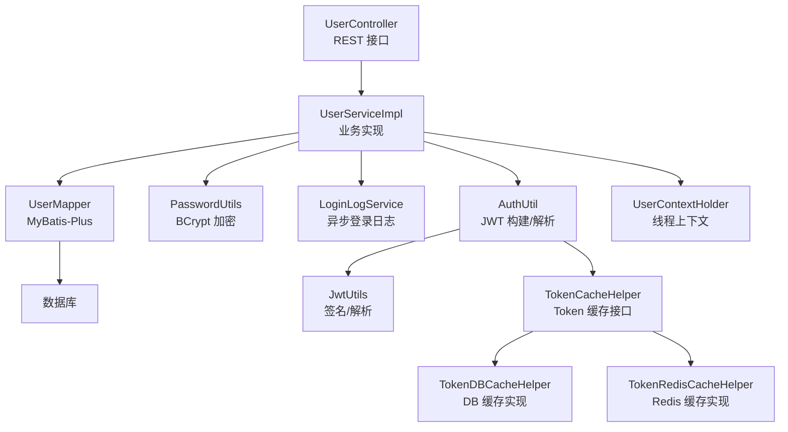
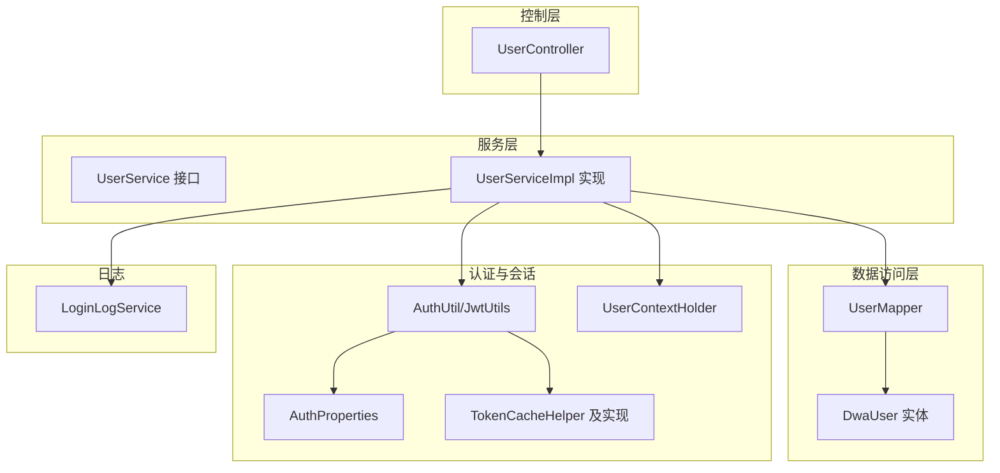
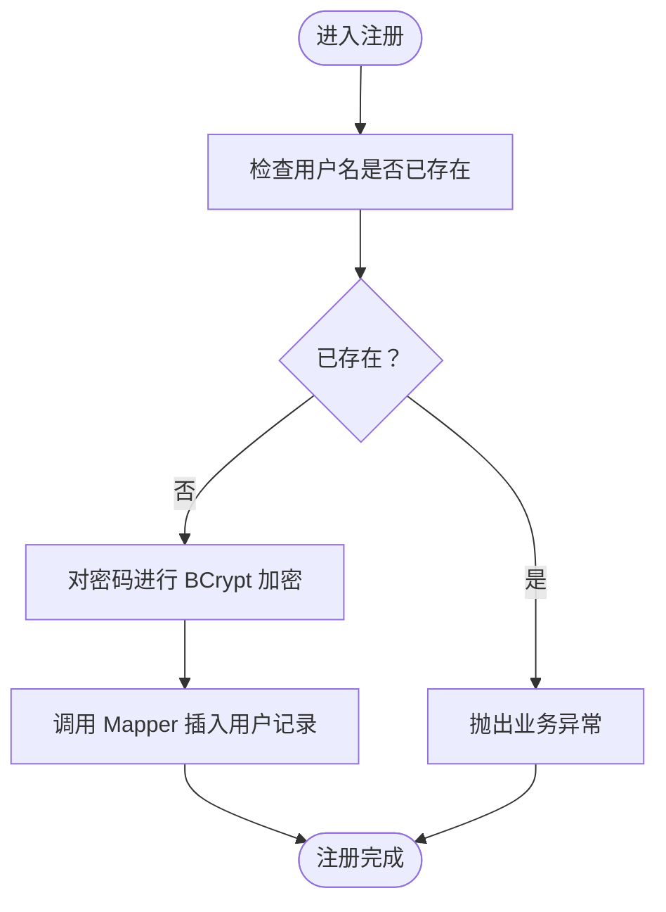
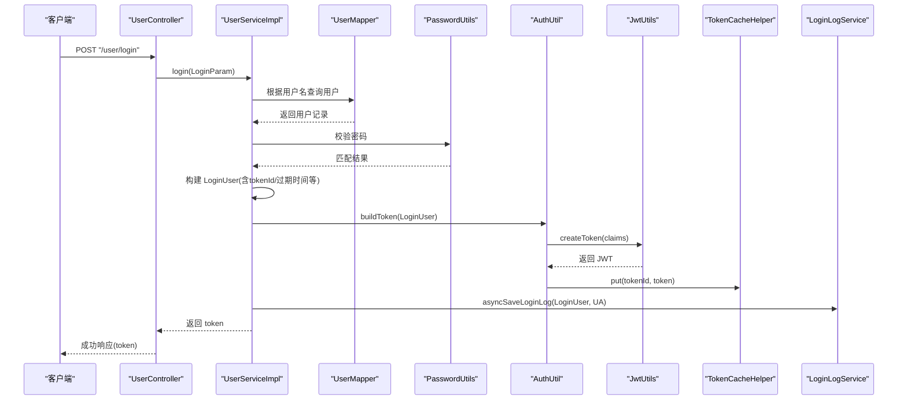
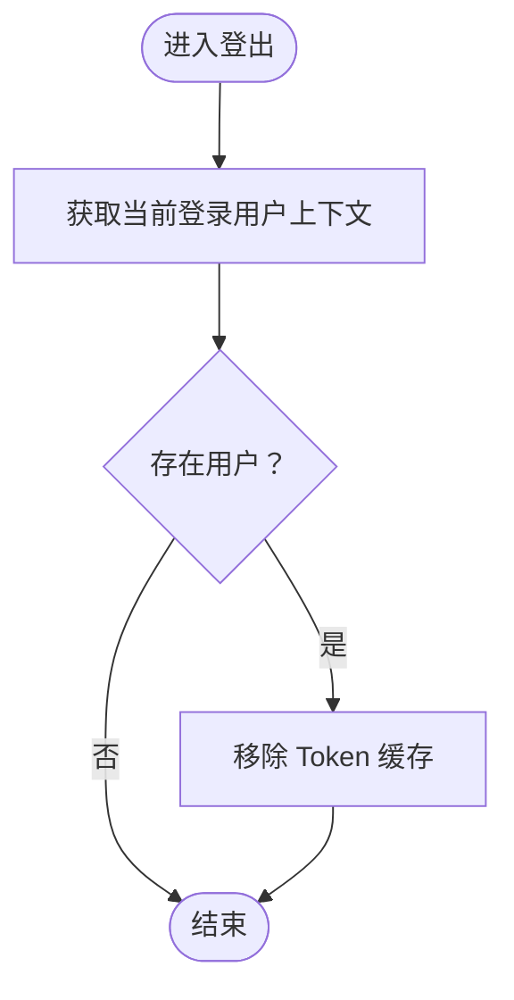
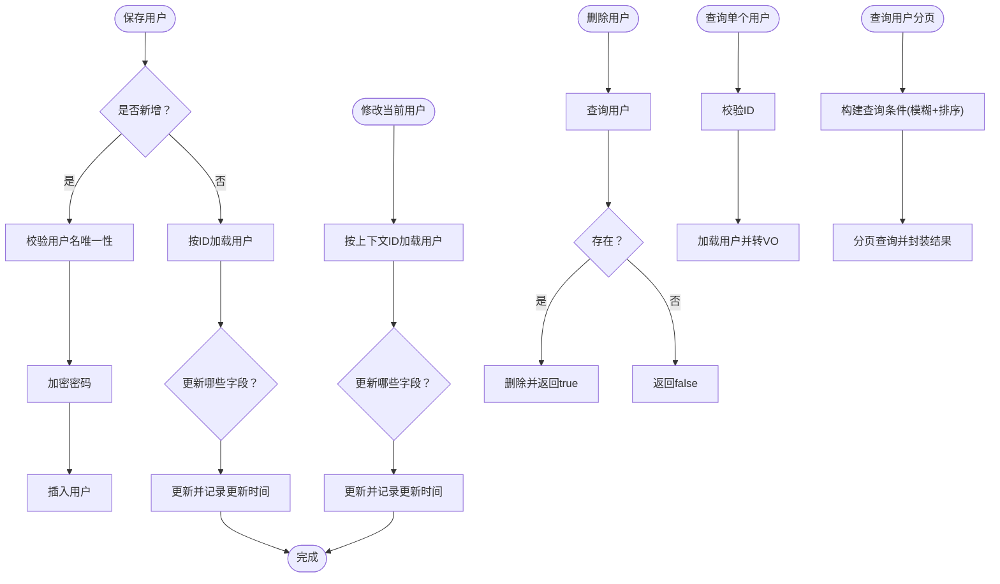
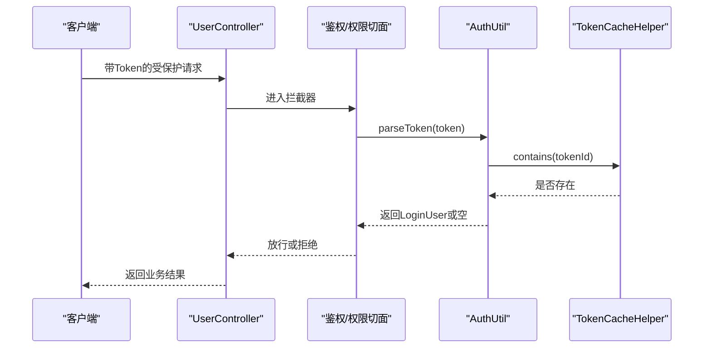
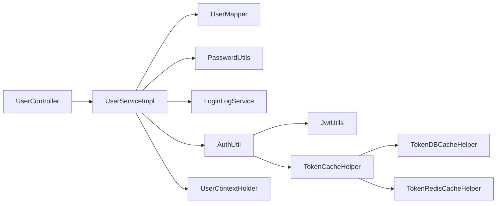

# 用户服务实现

<cite>
**本文引用的文件**
- [src/main/java/com/dw/admin/service/UserService.java](file://src/main/java/com/dw/admin/service/UserService.java)
- [src/main/java/com/dw/admin/service/impl/UserServiceImpl.java](file://src/main/java/com/dw/admin/service/impl/UserServiceImpl.java)
- [src/main/java/com/dw/admin/controller/UserController.java](file://src/main/java/com/dw/admin/controller/UserController.java)
- [src/main/java/com/dw/admin/dao/UserMapper.java](file://src/main/java/com/dw/admin/dao/UserMapper.java)
- [src/main/java/com/dw/admin/model/entity/DwaUser.java](file://src/main/java/com/dw/admin/model/entity/DwaUser.java)
- [src/main/java/com/dw/admin/common/utils/PasswordUtils.java](file://src/main/java/com/dw/admin/common/utils/PasswordUtils.java)
- [src/main/java/com/dw/admin/components/auth/AuthUtil.java](file://src/main/java/com/dw/admin/components/auth/AuthUtil.java)
- [src/main/java/com/dw/admin/components/auth/JwtUtils.java](file://src/main/java/com/dw/admin/components/auth/JwtUtils.java)
- [src/main/java/com/dw/admin/components/auth/AuthProperties.java](file://src/main/java/com/dw/admin/components/auth/AuthProperties.java)
- [src/main/java/com/dw/admin/components/auth/LoginUser.java](file://src/main/java/com/dw/admin/components/auth/LoginUser.java)
- [src/main/java/com/dw/admin/components/auth/TokenCacheHelper.java](file://src/main/java/com/dw/admin/components/auth/TokenCacheHelper.java)
- [src/main/java/com/dw/admin/components/auth/TokenDBCacheHelper.java](file://src/main/java/com/dw/admin/components/auth/TokenDBCacheHelper.java)
- [src/main/java/com/dw/admin/components/auth/TokenRedisCacheHelper.java](file://src/main/java/com/dw/admin/components/auth/TokenRedisCacheHelper.java)
- [src/main/java/com/dw/admin/components/auth/UserContextHolder.java](file://src/main/java/com/dw/admin/components/auth/UserContextHolder.java)
- [src/main/java/com/dw/admin/service/LoginLogService.java](file://src/main/java/com/dw/admin/service/LoginLogService.java)
</cite>

## 目录
1. [简介](#简介)
2. [项目结构](#项目结构)
3. [核心组件](#核心组件)
4. [架构总览](#架构总览)
5. [详细组件分析](#详细组件分析)
6. [依赖关系分析](#依赖关系分析)
7. [性能考虑](#性能考虑)
8. [故障排查指南](#故障排查指南)
9. [结论](#结论)
10. [附录](#附录)

## 简介
本文档围绕用户服务实现进行系统化技术说明，重点解析 UserServiceImpl 的业务逻辑与技术细节，覆盖用户注册（密码加密、重复性校验、持久化）、登录验证（凭据校验、JWT 令牌生成、Token 缓存管理）、用户信息更新/删除/查询等 CRUD 操作，以及权限校验与会话管理机制。同时给出关键流程图、异常与事务处理策略、性能优化建议与安全最佳实践，帮助开发者快速理解与落地实现。

## 项目结构
用户服务相关模块采用分层架构组织，主要涉及控制层、服务层、数据访问层与认证/缓存组件：
- 控制层：UserController 提供 REST 接口，标注鉴权与权限注解，调用 UserService。
- 服务层：UserService 接口与 UserServiceImpl 实现具体业务逻辑。
- 数据访问层：UserMapper 继承 MyBatis-Plus 基类，映射 DwaUser 实体。
- 认证与会话：AuthUtil/JwtUtils 负责 JWT 生成与解析；TokenCacheHelper 及其实现负责 Token 缓存（DB/Redis）；UserContextHolder 管理线程上下文中的登录用户信息。
- 日志：LoginLogService 异步记录登录日志。

图表来源
- [src/main/java/com/dw/admin/controller/UserController.java](file://src/main/java/com/dw/admin/controller/UserController.java#L1-L138)
- [src/main/java/com/dw/admin/service/impl/UserServiceImpl.java](file://src/main/java/com/dw/admin/service/impl/UserServiceImpl.java#L1-L270)
- [src/main/java/com/dw/admin/dao/UserMapper.java](file://src/main/java/com/dw/admin/dao/UserMapper.java#L1-L16)
- [src/main/java/com/dw/admin/common/utils/PasswordUtils.java](file://src/main/java/com/dw/admin/common/utils/PasswordUtils.java#L1-L28)
- [src/main/java/com/dw/admin/service/LoginLogService.java](file://src/main/java/com/dw/admin/service/LoginLogService.java#L1-L33)
- [src/main/java/com/dw/admin/components/auth/AuthUtil.java](file://src/main/java/com/dw/admin/components/auth/AuthUtil.java#L1-L101)
- [src/main/java/com/dw/admin/components/auth/JwtUtils.java](file://src/main/java/com/dw/admin/components/auth/JwtUtils.java#L1-L55)
- [src/main/java/com/dw/admin/components/auth/TokenCacheHelper.java](file://src/main/java/com/dw/admin/components/auth/TokenCacheHelper.java#L1-L26)
- [src/main/java/com/dw/admin/components/auth/TokenDBCacheHelper.java](file://src/main/java/com/dw/admin/components/auth/TokenDBCacheHelper.java#L1-L259)
- [src/main/java/com/dw/admin/components/auth/TokenRedisCacheHelper.java](file://src/main/java/com/dw/admin/components/auth/TokenRedisCacheHelper.java#L1-L155)
- [src/main/java/com/dw/admin/components/auth/UserContextHolder.java](file://src/main/java/com/dw/admin/components/auth/UserContextHolder.java#L1-L46)

章节来源
- [src/main/java/com/dw/admin/controller/UserController.java](file://src/main/java/com/dw/admin/controller/UserController.java#L1-L138)
- [src/main/java/com/dw/admin/service/impl/UserServiceImpl.java](file://src/main/java/com/dw/admin/service/impl/UserServiceImpl.java#L1-L270)
- [src/main/java/com/dw/admin/dao/UserMapper.java](file://src/main/java/com/dw/admin/dao/UserMapper.java#L1-L16)

## 核心组件
- UserService 接口：定义注册、登录、登出、保存/修改/删除用户、查询单个/分页查询等方法契约。
- UserServiceImpl：实现上述业务逻辑，贯穿密码加密、数据校验、持久化、JWT 令牌生成与缓存、登录日志异步记录、线程上下文维护等。
- UserMapper：基于 MyBatis-Plus 的基础 Mapper，提供用户表的增删改查能力。
- DwaUser：用户实体，包含基础字段及自动填充的创建/更新时间。
- PasswordUtils：使用 BCrypt 对密码进行哈希与校验。
- AuthUtil/JwtUtils/AuthProperties：JWT 签名密钥加载、令牌构建与解析、令牌缓存策略配置。
- TokenCacheHelper 及其实现：DB/Redis 两种 Token 缓存策略，含本地缓存与定时清理。
- UserContextHolder：TransmittableThreadLocal 线程上下文，便于在多线程场景下传递登录用户信息。
- LoginLogService：异步记录登录日志，便于审计与追踪。

章节来源
- [src/main/java/com/dw/admin/service/UserService.java](file://src/main/java/com/dw/admin/service/UserService.java#L1-L59)
- [src/main/java/com/dw/admin/service/impl/UserServiceImpl.java](file://src/main/java/com/dw/admin/service/impl/UserServiceImpl.java#L1-L270)
- [src/main/java/com/dw/admin/dao/UserMapper.java](file://src/main/java/com/dw/admin/dao/UserMapper.java#L1-L16)
- [src/main/java/com/dw/admin/model/entity/DwaUser.java](file://src/main/java/com/dw/admin/model/entity/DwaUser.java#L1-L73)
- [src/main/java/com/dw/admin/common/utils/PasswordUtils.java](file://src/main/java/com/dw/admin/common/utils/PasswordUtils.java#L1-L28)
- [src/main/java/com/dw/admin/components/auth/AuthUtil.java](file://src/main/java/com/dw/admin/components/auth/AuthUtil.java#L1-L101)
- [src/main/java/com/dw/admin/components/auth/JwtUtils.java](file://src/main/java/com/dw/admin/components/auth/JwtUtils.java#L1-L55)
- [src/main/java/com/dw/admin/components/auth/AuthProperties.java](file://src/main/java/com/dw/admin/components/auth/AuthProperties.java#L1-L36)
- [src/main/java/com/dw/admin/components/auth/TokenCacheHelper.java](file://src/main/java/com/dw/admin/components/auth/TokenCacheHelper.java#L1-L26)
- [src/main/java/com/dw/admin/components/auth/TokenDBCacheHelper.java](file://src/main/java/com/dw/admin/components/auth/TokenDBCacheHelper.java#L1-L259)
- [src/main/java/com/dw/admin/components/auth/TokenRedisCacheHelper.java](file://src/main/java/com/dw/admin/components/auth/TokenRedisCacheHelper.java#L1-L155)
- [src/main/java/com/dw/admin/components/auth/UserContextHolder.java](file://src/main/java/com/dw/admin/components/auth/UserContextHolder.java#L1-L46)
- [src/main/java/com/dw/admin/service/LoginLogService.java](file://src/main/java/com/dw/admin/service/LoginLogService.java#L1-L33)

## 架构总览
用户服务采用“控制层-服务层-数据访问层-认证/缓存组件”的分层设计，结合注解驱动的鉴权与权限控制，形成清晰的职责边界与扩展点。

图表来源
- [src/main/java/com/dw/admin/controller/UserController.java](file://src/main/java/com/dw/admin/controller/UserController.java#L1-L138)
- [src/main/java/com/dw/admin/service/UserService.java](file://src/main/java/com/dw/admin/service/UserService.java#L1-L59)
- [src/main/java/com/dw/admin/service/impl/UserServiceImpl.java](file://src/main/java/com/dw/admin/service/impl/UserServiceImpl.java#L1-L270)
- [src/main/java/com/dw/admin/dao/UserMapper.java](file://src/main/java/com/dw/admin/dao/UserMapper.java#L1-L16)
- [src/main/java/com/dw/admin/model/entity/DwaUser.java](file://src/main/java/com/dw/admin/model/entity/DwaUser.java#L1-L73)
- [src/main/java/com/dw/admin/components/auth/AuthUtil.java](file://src/main/java/com/dw/admin/components/auth/AuthUtil.java#L1-L101)
- [src/main/java/com/dw/admin/components/auth/JwtUtils.java](file://src/main/java/com/dw/admin/components/auth/JwtUtils.java#L1-L55)
- [src/main/java/com/dw/admin/components/auth/AuthProperties.java](file://src/main/java/com/dw/admin/components/auth/AuthProperties.java#L1-L36)
- [src/main/java/com/dw/admin/components/auth/TokenCacheHelper.java](file://src/main/java/com/dw/admin/components/auth/TokenCacheHelper.java#L1-L26)
- [src/main/java/com/dw/admin/components/auth/TokenDBCacheHelper.java](file://src/main/java/com/dw/admin/components/auth/TokenDBCacheHelper.java#L1-L259)
- [src/main/java/com/dw/admin/components/auth/TokenRedisCacheHelper.java](file://src/main/java/com/dw/admin/components/auth/TokenRedisCacheHelper.java#L1-L155)
- [src/main/java/com/dw/admin/components/auth/UserContextHolder.java](file://src/main/java/com/dw/admin/components/auth/UserContextHolder.java#L1-L46)
- [src/main/java/com/dw/admin/service/LoginLogService.java](file://src/main/java/com/dw/admin/service/LoginLogService.java#L1-L33)

## 详细组件分析

### 用户注册流程（密码加密、用户验证、数据持久化）
- 输入参数校验：用户名重复性检查，避免重复注册。
- 密码加密：使用 BCrypt 对原始密码进行哈希处理后入库。
- 数据持久化：通过 UserMapper 插入新用户记录。

图表来源
- [src/main/java/com/dw/admin/service/impl/UserServiceImpl.java](file://src/main/java/com/dw/admin/service/impl/UserServiceImpl.java#L58-L72)
- [src/main/java/com/dw/admin/common/utils/PasswordUtils.java](file://src/main/java/com/dw/admin/common/utils/PasswordUtils.java#L15-L17)
- [src/main/java/com/dw/admin/dao/UserMapper.java](file://src/main/java/com/dw/admin/dao/UserMapper.java#L1-L16)

章节来源
- [src/main/java/com/dw/admin/service/impl/UserServiceImpl.java](file://src/main/java/com/dw/admin/service/impl/UserServiceImpl.java#L58-L72)
- [src/main/java/com/dw/admin/common/utils/PasswordUtils.java](file://src/main/java/com/dw/admin/common/utils/PasswordUtils.java#L1-L28)
- [src/main/java/com/dw/admin/dao/UserMapper.java](file://src/main/java/com/dw/admin/dao/UserMapper.java#L1-L16)

### 用户登录验证机制（凭据校验、JWT 令牌生成、Token 缓存管理）
- 凭据校验：根据用户名查询用户，校验密码有效性。
- 登录用户信息构建：生成 LoginUser（包含 tokenId、userId、username、登录 IP、时间戳、过期时间等）。
- JWT 令牌生成：基于配置密钥与 LoginUser 序列化内容生成签名令牌。
- Token 缓存：将 token 与 tokenId 关联缓存至 DB 或 Redis，并设置过期时间。
- 登录日志异步记录：异步写入登录日志，包含 UA 与登录信息。

图表来源
- [src/main/java/com/dw/admin/controller/UserController.java](file://src/main/java/com/dw/admin/controller/UserController.java#L48-L54)
- [src/main/java/com/dw/admin/service/impl/UserServiceImpl.java](file://src/main/java/com/dw/admin/service/impl/UserServiceImpl.java#L78-L108)
- [src/main/java/com/dw/admin/dao/UserMapper.java](file://src/main/java/com/dw/admin/dao/UserMapper.java#L1-L16)
- [src/main/java/com/dw/admin/common/utils/PasswordUtils.java](file://src/main/java/com/dw/admin/common/utils/PasswordUtils.java#L25-L27)
- [src/main/java/com/dw/admin/components/auth/AuthUtil.java](file://src/main/java/com/dw/admin/components/auth/AuthUtil.java#L32-L41)
- [src/main/java/com/dw/admin/components/auth/JwtUtils.java](file://src/main/java/com/dw/admin/components/auth/JwtUtils.java#L38-L41)
- [src/main/java/com/dw/admin/components/auth/TokenCacheHelper.java](file://src/main/java/com/dw/admin/components/auth/TokenCacheHelper.java#L1-L26)
- [src/main/java/com/dw/admin/service/LoginLogService.java](file://src/main/java/com/dw/admin/service/LoginLogService.java#L21)

章节来源
- [src/main/java/com/dw/admin/service/impl/UserServiceImpl.java](file://src/main/java/com/dw/admin/service/impl/UserServiceImpl.java#L78-L108)
- [src/main/java/com/dw/admin/components/auth/AuthUtil.java](file://src/main/java/com/dw/admin/components/auth/AuthUtil.java#L1-L101)
- [src/main/java/com/dw/admin/components/auth/JwtUtils.java](file://src/main/java/com/dw/admin/components/auth/JwtUtils.java#L1-L55)
- [src/main/java/com/dw/admin/components/auth/TokenCacheHelper.java](file://src/main/java/com/dw/admin/components/auth/TokenCacheHelper.java#L1-L26)
- [src/main/java/com/dw/admin/service/LoginLogService.java](file://src/main/java/com/dw/admin/service/LoginLogService.java#L1-L33)

### 退出登录与会话管理
- 读取当前登录用户上下文，获取 tokenId。
- 调用 AuthUtil 移除对应 token 缓存。
- 登出完成后清理线程上下文（如需），并异步记录登出行为（可选）。

图表来源
- [src/main/java/com/dw/admin/service/impl/UserServiceImpl.java](file://src/main/java/com/dw/admin/service/impl/UserServiceImpl.java#L115-L123)
- [src/main/java/com/dw/admin/components/auth/AuthUtil.java](file://src/main/java/com/dw/admin/components/auth/AuthUtil.java#L96-L98)
- [src/main/java/com/dw/admin/components/auth/UserContextHolder.java](file://src/main/java/com/dw/admin/components/auth/UserContextHolder.java#L1-L46)

章节来源
- [src/main/java/com/dw/admin/service/impl/UserServiceImpl.java](file://src/main/java/com/dw/admin/service/impl/UserServiceImpl.java#L115-L123)
- [src/main/java/com/dw/admin/components/auth/AuthUtil.java](file://src/main/java/com/dw/admin/components/auth/AuthUtil.java#L1-L101)
- [src/main/java/com/dw/admin/components/auth/UserContextHolder.java](file://src/main/java/com/dw/admin/components/auth/UserContextHolder.java#L1-L46)

### 用户信息更新、删除、查询（CRUD）
- 保存用户（新增/编辑）：新增时校验用户名唯一性并加密密码；编辑时按字段更新并记录更新时间。
- 修改当前登录用户信息：基于线程上下文获取 userId，仅允许更新邮箱、手机、头像等字段。
- 删除用户：先查询再删除，返回布尔结果。
- 查询单个用户：校验 userId 后查询并转换为 VO。
- 查询用户分页：支持名称/邮箱/手机模糊查询与多字段排序，默认按更新时间倒序。

图表来源
- [src/main/java/com/dw/admin/service/impl/UserServiceImpl.java](file://src/main/java/com/dw/admin/service/impl/UserServiceImpl.java#L129-L170)
- [src/main/java/com/dw/admin/service/impl/UserServiceImpl.java](file://src/main/java/com/dw/admin/service/impl/UserServiceImpl.java#L176-L197)
- [src/main/java/com/dw/admin/service/impl/UserServiceImpl.java](file://src/main/java/com/dw/admin/service/impl/UserServiceImpl.java#L202-L211)
- [src/main/java/com/dw/admin/service/impl/UserServiceImpl.java](file://src/main/java/com/dw/admin/service/impl/UserServiceImpl.java#L217-L224)
- [src/main/java/com/dw/admin/service/impl/UserServiceImpl.java](file://src/main/java/com/dw/admin/service/impl/UserServiceImpl.java#L231-L267)

章节来源
- [src/main/java/com/dw/admin/service/impl/UserServiceImpl.java](file://src/main/java/com/dw/admin/service/impl/UserServiceImpl.java#L129-L170)
- [src/main/java/com/dw/admin/service/impl/UserServiceImpl.java](file://src/main/java/com/dw/admin/service/impl/UserServiceImpl.java#L176-L197)
- [src/main/java/com/dw/admin/service/impl/UserServiceImpl.java](file://src/main/java/com/dw/admin/service/impl/UserServiceImpl.java#L202-L211)
- [src/main/java/com/dw/admin/service/impl/UserServiceImpl.java](file://src/main/java/com/dw/admin/service/impl/UserServiceImpl.java#L217-L224)
- [src/main/java/com/dw/admin/service/impl/UserServiceImpl.java](file://src/main/java/com/dw/admin/service/impl/UserServiceImpl.java#L231-L267)

### 权限验证与会话管理机制
- 权限注解：控制器层使用 @Permission 指定角色（如 admin）限制访问。
- 鉴权注解：@Auth 标注需要登录态的接口。
- 令牌校验：AuthUtil.parseToken 解析 JWT 并结合 TokenCacheHelper 校验 token 是否仍有效。
- 线程上下文：UserContextHolder 在请求链路中传递 LoginUser，支持子线程透传。

图表来源
- [src/main/java/com/dw/admin/controller/UserController.java](file://src/main/java/com/dw/admin/controller/UserController.java#L60-L130)
- [src/main/java/com/dw/admin/components/auth/AuthUtil.java](file://src/main/java/com/dw/admin/components/auth/AuthUtil.java#L49-L55)
- [src/main/java/com/dw/admin/components/auth/TokenCacheHelper.java](file://src/main/java/com/dw/admin/components/auth/TokenCacheHelper.java#L1-L26)
- [src/main/java/com/dw/admin/components/auth/UserContextHolder.java](file://src/main/java/com/dw/admin/components/auth/UserContextHolder.java#L1-L46)

章节来源
- [src/main/java/com/dw/admin/controller/UserController.java](file://src/main/java/com/dw/admin/controller/UserController.java#L1-L138)
- [src/main/java/com/dw/admin/components/auth/AuthUtil.java](file://src/main/java/com/dw/admin/components/auth/AuthUtil.java#L1-L101)
- [src/main/java/com/dw/admin/components/auth/TokenCacheHelper.java](file://src/main/java/com/dw/admin/components/auth/TokenCacheHelper.java#L1-L26)
- [src/main/java/com/dw/admin/components/auth/UserContextHolder.java](file://src/main/java/com/dw/admin/components/auth/UserContextHolder.java#L1-L46)

### 异常处理与事务管理策略
- 异常处理：服务层统一抛出业务异常（如用户名已存在、账号不存在、密码不正确、用户不存在等），由全局异常处理器捕获并返回标准响应。
- 事务管理：当前实现未显式声明事务注解，遵循 MyBatis-Plus 默认行为；若后续引入跨表事务或复杂一致性需求，可在服务层添加事务注解以确保原子性。

章节来源
- [src/main/java/com/dw/admin/service/impl/UserServiceImpl.java](file://src/main/java/com/dw/admin/service/impl/UserServiceImpl.java#L64-L65)
- [src/main/java/com/dw/admin/service/impl/UserServiceImpl.java](file://src/main/java/com/dw/admin/service/impl/UserServiceImpl.java#L84-L88)
- [src/main/java/com/dw/admin/service/impl/UserServiceImpl.java](file://src/main/java/com/dw/admin/service/impl/UserServiceImpl.java#L155-L156)
- [src/main/java/com/dw/admin/service/impl/UserServiceImpl.java](file://src/main/java/com/dw/admin/service/impl/UserServiceImpl.java#L221-L222)

## 依赖关系分析
- 控制层依赖服务层接口，服务层依赖数据访问层与认证/缓存组件。
- 认证组件之间存在依赖：AuthUtil 依赖 JwtUtils 与 TokenCacheHelper；JwtUtils 依赖 AuthProperties；TokenDBCacheHelper/TokenRedisCacheHelper 实现 TokenCacheHelper。
- 线程上下文 UserContextHolder 与鉴权流程配合，保证多线程场景下的用户信息一致。

图表来源
- [src/main/java/com/dw/admin/controller/UserController.java](file://src/main/java/com/dw/admin/controller/UserController.java#L1-L138)
- [src/main/java/com/dw/admin/service/impl/UserServiceImpl.java](file://src/main/java/com/dw/admin/service/impl/UserServiceImpl.java#L1-L270)
- [src/main/java/com/dw/admin/dao/UserMapper.java](file://src/main/java/com/dw/admin/dao/UserMapper.java#L1-L16)
- [src/main/java/com/dw/admin/common/utils/PasswordUtils.java](file://src/main/java/com/dw/admin/common/utils/PasswordUtils.java#L1-L28)
- [src/main/java/com/dw/admin/service/LoginLogService.java](file://src/main/java/com/dw/admin/service/LoginLogService.java#L1-L33)
- [src/main/java/com/dw/admin/components/auth/AuthUtil.java](file://src/main/java/com/dw/admin/components/auth/AuthUtil.java#L1-L101)
- [src/main/java/com/dw/admin/components/auth/JwtUtils.java](file://src/main/java/com/dw/admin/components/auth/JwtUtils.java#L1-L55)
- [src/main/java/com/dw/admin/components/auth/TokenCacheHelper.java](file://src/main/java/com/dw/admin/components/auth/TokenCacheHelper.java#L1-L26)
- [src/main/java/com/dw/admin/components/auth/TokenDBCacheHelper.java](file://src/main/java/com/dw/admin/components/auth/TokenDBCacheHelper.java#L1-L259)
- [src/main/java/com/dw/admin/components/auth/TokenRedisCacheHelper.java](file://src/main/java/com/dw/admin/components/auth/TokenRedisCacheHelper.java#L1-L155)
- [src/main/java/com/dw/admin/components/auth/UserContextHolder.java](file://src/main/java/com/dw/admin/components/auth/UserContextHolder.java#L1-L46)

章节来源
- [src/main/java/com/dw/admin/controller/UserController.java](file://src/main/java/com/dw/admin/controller/UserController.java#L1-L138)
- [src/main/java/com/dw/admin/service/impl/UserServiceImpl.java](file://src/main/java/com/dw/admin/service/impl/UserServiceImpl.java#L1-L270)
- [src/main/java/com/dw/admin/components/auth/AuthUtil.java](file://src/main/java/com/dw/admin/components/auth/AuthUtil.java#L1-L101)

## 性能考虑
- 密码加密：使用 BCrypt，成本较高但安全性高；建议在批量导入场景中采用异步或批处理策略。
- Token 缓存：DB/Redis 双实现均内置本地缓存（Guava Cache），减少频繁 IO；DB 实现带定时清理任务，避免脏数据堆积。
- 登录日志：异步记录，避免阻塞主流程。
- 分页查询：合理使用模糊查询与排序字段，必要时建立索引提升查询效率。
- 并发与线程：使用 TransmittableThreadLocal 保障多线程场景下的上下文传递，避免数据错乱。

## 故障排查指南
- 登录失败
  - 检查用户名是否存在与密码是否匹配。
  - 核对 JWT 密钥配置与 Token 缓存状态。
- Token 失效
  - 确认 Token 是否仍在缓存中；DB/Redis 缓存是否被清理。
  - 检查过期时间配置与定时清理任务。
- 用户查询异常
  - 校验 userId 参数与用户是否存在。
- 登出无效
  - 确认上下文中的 tokenId 与缓存中的键一致。

章节来源
- [src/main/java/com/dw/admin/service/impl/UserServiceImpl.java](file://src/main/java/com/dw/admin/service/impl/UserServiceImpl.java#L84-L88)
- [src/main/java/com/dw/admin/components/auth/AuthUtil.java](file://src/main/java/com/dw/admin/components/auth/AuthUtil.java#L77-L79)
- [src/main/java/com/dw/admin/components/auth/TokenDBCacheHelper.java](file://src/main/java/com/dw/admin/components/auth/TokenDBCacheHelper.java#L220-L241)
- [src/main/java/com/dw/admin/components/auth/TokenRedisCacheHelper.java](file://src/main/java/com/dw/admin/components/auth/TokenRedisCacheHelper.java#L107-L116)

## 结论
该用户服务实现以清晰的分层架构与完善的认证/缓存机制为基础，覆盖了从注册到登录、从信息维护到权限控制的完整业务闭环。通过 BCrypt 加密、JWT 令牌与多级缓存策略，兼顾了安全性与性能。建议在后续迭代中补充事务管理与更细粒度的监控埋点，以进一步增强可靠性与可观测性。

## 附录
- 代码示例路径（不含具体代码内容）
  - 用户注册：[注册实现](file://src/main/java/com/dw/admin/service/impl/UserServiceImpl.java#L58-L72)
  - 用户登录：[登录实现](file://src/main/java/com/dw/admin/service/impl/UserServiceImpl.java#L78-L108)
  - 令牌生成与缓存：[AuthUtil](file://src/main/java/com/dw/admin/components/auth/AuthUtil.java#L32-L41)、[JwtUtils](file://src/main/java/com/dw/admin/components/auth/JwtUtils.java#L38-L41)、[TokenDBCacheHelper](file://src/main/java/com/dw/admin/components/auth/TokenDBCacheHelper.java#L140-L147)、[TokenRedisCacheHelper](file://src/main/java/com/dw/admin/components/auth/TokenRedisCacheHelper.java#L92-L99)
  - 用户信息维护：[保存用户](file://src/main/java/com/dw/admin/service/impl/UserServiceImpl.java#L129-L170)、[修改当前用户](file://src/main/java/com/dw/admin/service/impl/UserServiceImpl.java#L176-L197)、[删除用户](file://src/main/java/com/dw/admin/service/impl/UserServiceImpl.java#L202-L211)、[查询单个用户](file://src/main/java/com/dw/admin/service/impl/UserServiceImpl.java#L217-L224)、[查询分页](file://src/main/java/com/dw/admin/service/impl/UserServiceImpl.java#L231-L267)
  - 权限与鉴权：[控制器注解](file://src/main/java/com/dw/admin/controller/UserController.java#L60-L130)、[线程上下文](file://src/main/java/com/dw/admin/components/auth/UserContextHolder.java#L1-L46)