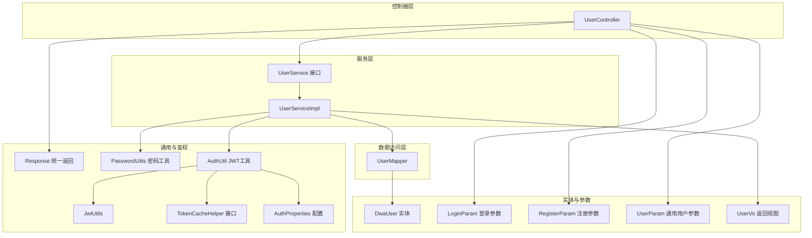
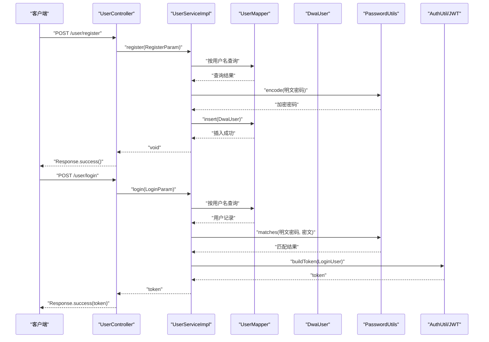
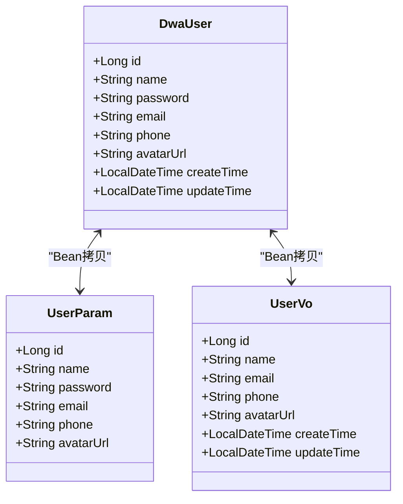
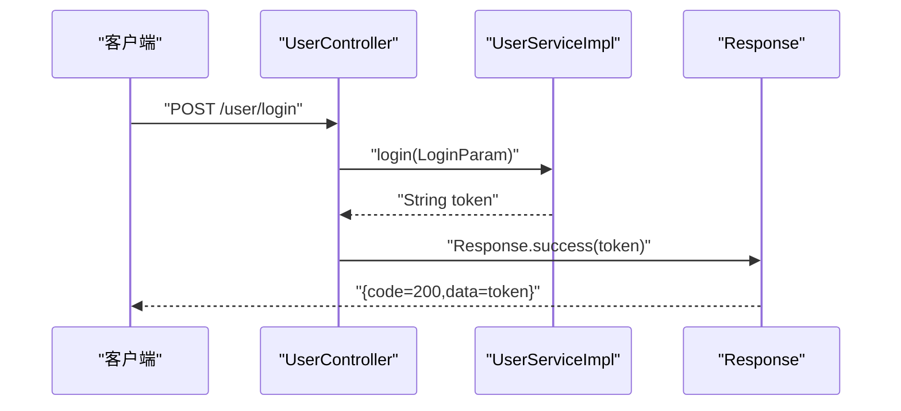
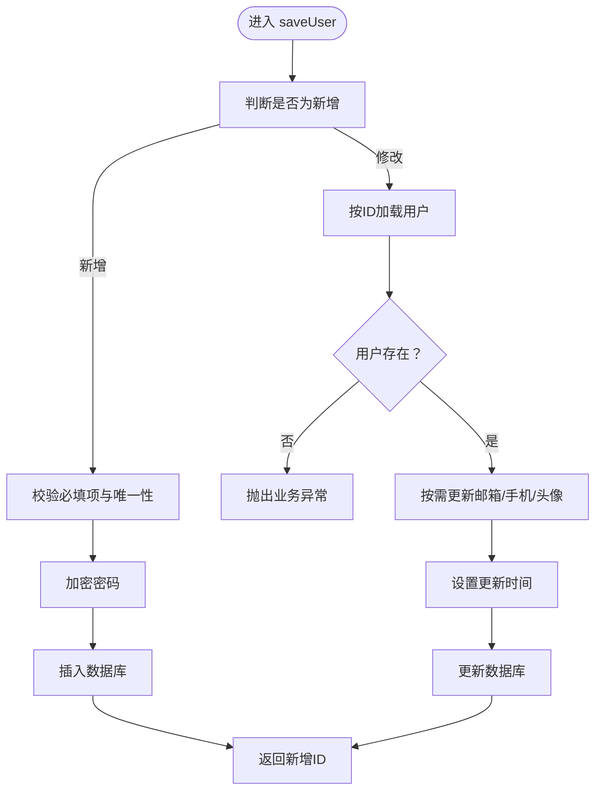
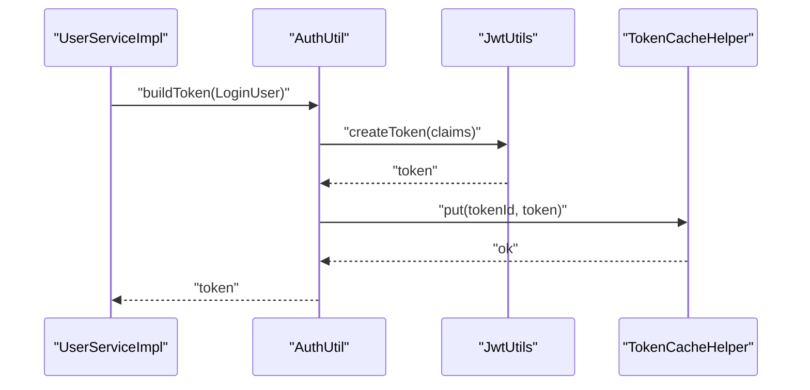
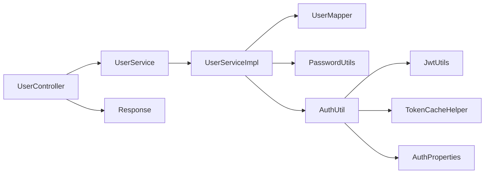

# 用户管理模块

<cite>
**本文引用的文件**
- [src/main/java/com/dw/admin/model/entity/DwaUser.java](file://src/main/java/com/dw/admin/model/entity/DwaUser.java)
- [src/main/java/com/dw/admin/model/param/LoginParam.java](file://src/main/java/com/dw/admin/model/param/LoginParam.java)
- [src/main/java/com/dw/admin/model/param/RegisterParam.java](file://src/main/java/com/dw/admin/model/param/RegisterParam.java)
- [src/main/java/com/dw/admin/model/param/UserParam.java](file://src/main/java/com/dw/admin/model/param/UserParam.java)
- [src/main/java/com/dw/admin/model/vo/UserVo.java](file://src/main/java/com/dw/admin/model/vo/UserVo.java)
- [src/main/java/com/dw/admin/controller/UserController.java](file://src/main/java/com/dw/admin/controller/UserController.java)
- [src/main/java/com/dw/admin/service/UserService.java](file://src/main/java/com/dw/admin/service/UserService.java)
- [src/main/java/com/dw/admin/service/impl/UserServiceImpl.java](file://src/main/java/com/dw/admin/service/impl/UserServiceImpl.java)
- [src/main/java/com/dw/admin/common/utils/PasswordUtils.java](file://src/main/java/com/dw/admin/common/utils/PasswordUtils.java)
- [src/main/java/com/dw/admin/common/entity/Response.java](file://src/main/java/com/dw/admin/common/entity/Response.java)
- [src/main/java/com/dw/admin/common/exception/BizException.java](file://src/main/java/com/dw/admin/common/exception/BizException.java)
- [src/main/java/com/dw/admin/components/auth/AuthUtil.java](file://src/main/java/com/dw/admin/components/auth/AuthUtil.java)
- [src/main/java/com/dw/admin/components/auth/JwtUtils.java](file://src/main/java/com/dw/admin/components/auth/JwtUtils.java)
- [src/main/java/com/dw/admin/components/auth/TokenCacheHelper.java](file://src/main/java/com/dw/admin/components/auth/TokenCacheHelper.java)
- [src/main/java/com/dw/admin/components/auth/AuthProperties.java](file://src/main/java/com/dw/admin/components/auth/AuthProperties.java)
</cite>

## 目录
1. [简介](#简介)
2. [项目结构](#项目结构)
3. [核心组件](#核心组件)
4. [架构总览](#架构总览)
5. [详细组件分析](#详细组件分析)
6. [依赖关系分析](#依赖关系分析)
7. [性能与安全](#性能与安全)
8. [故障排查指南](#故障排查指南)
9. [结论](#结论)
10. [附录：API 使用示例与最佳实践](#附录api-使用示例与最佳实践)

## 简介
本技术文档聚焦于用户管理模块，系统性阐述用户实体模型设计、控制器RESTful接口、服务层业务逻辑（含密码加密、用户验证、权限控制）、参数校验与统一返回封装机制，并给出完整的API使用示例、错误处理策略、会话与状态管理说明、性能优化建议与安全最佳实践。目标是帮助开发者快速理解并高效集成与扩展用户管理能力。

## 项目结构
用户管理模块遵循典型的分层架构：控制器层负责HTTP请求接入与参数校验；服务层承载业务规则；数据访问层负责持久化；通用工具与鉴权组件提供密码加密、JWT签发与校验、Token缓存等支撑能力。

图表来源
- [src/main/java/com/dw/admin/controller/UserController.java](file://src/main/java/com/dw/admin/controller/UserController.java#L1-L138)
- [src/main/java/com/dw/admin/service/UserService.java](file://src/main/java/com/dw/admin/service/UserService.java#L1-L59)
- [src/main/java/com/dw/admin/service/impl/UserServiceImpl.java](file://src/main/java/com/dw/admin/service/impl/UserServiceImpl.java#L1-L270)
- [src/main/java/com/dw/admin/model/entity/DwaUser.java](file://src/main/java/com/dw/admin/model/entity/DwaUser.java#L1-L73)
- [src/main/java/com/dw/admin/model/param/LoginParam.java](file://src/main/java/com/dw/admin/model/param/LoginParam.java#L1-L31)
- [src/main/java/com/dw/admin/model/param/RegisterParam.java](file://src/main/java/com/dw/admin/model/param/RegisterParam.java#L1-L36)
- [src/main/java/com/dw/admin/model/param/UserParam.java](file://src/main/java/com/dw/admin/model/param/UserParam.java#L1-L37)
- [src/main/java/com/dw/admin/model/vo/UserVo.java](file://src/main/java/com/dw/admin/model/vo/UserVo.java#L1-L57)
- [src/main/java/com/dw/admin/common/entity/Response.java](file://src/main/java/com/dw/admin/common/entity/Response.java#L1-L132)
- [src/main/java/com/dw/admin/common/utils/PasswordUtils.java](file://src/main/java/com/dw/admin/common/utils/PasswordUtils.java#L1-L28)
- [src/main/java/com/dw/admin/components/auth/AuthUtil.java](file://src/main/java/com/dw/admin/components/auth/AuthUtil.java#L1-L101)
- [src/main/java/com/dw/admin/components/auth/JwtUtils.java](file://src/main/java/com/dw/admin/components/auth/JwtUtils.java#L1-L55)
- [src/main/java/com/dw/admin/components/auth/TokenCacheHelper.java](file://src/main/java/com/dw/admin/components/auth/TokenCacheHelper.java#L1-L26)
- [src/main/java/com/dw/admin/components/auth/AuthProperties.java](file://src/main/java/com/dw/admin/components/auth/AuthProperties.java#L1-L36)

章节来源
- [src/main/java/com/dw/admin/controller/UserController.java](file://src/main/java/com/dw/admin/controller/UserController.java#L1-L138)
- [src/main/java/com/dw/admin/service/impl/UserServiceImpl.java](file://src/main/java/com/dw/admin/service/impl/UserServiceImpl.java#L1-L270)

## 核心组件
- 用户实体模型：DwaUser 定义了用户核心字段及自动填充策略，涵盖主键、名称、密码、邮箱、手机、头像URL以及创建/更新时间。
- 控制器：UserController 提供注册、登录、登出、保存/更新用户、删除、查询单个/当前登录用户、分页查询等REST接口，并结合日志、限流、鉴权与权限注解。
- 服务层：UserService 定义标准用户操作契约；UserServiceImpl 实现注册、登录、登出、保存/更新/删除、查询单个/分页查询等业务逻辑，内置参数校验与密码加密。
- 统一返回：Response 封装统一的响应结构与状态码常量，便于前后端约定。
- 密码工具：PasswordUtils 基于BCrypt进行密码加密与匹配。
- 鉴权工具链：AuthUtil/JwtUtils/TokenCacheHelper/AuthProperties 提供JWT签发、解析、Token缓存与配置管理。

章节来源
- [src/main/java/com/dw/admin/model/entity/DwaUser.java](file://src/main/java/com/dw/admin/model/entity/DwaUser.java#L1-L73)
- [src/main/java/com/dw/admin/controller/UserController.java](file://src/main/java/com/dw/admin/controller/UserController.java#L1-L138)
- [src/main/java/com/dw/admin/service/UserService.java](file://src/main/java/com/dw/admin/service/UserService.java#L1-L59)
- [src/main/java/com/dw/admin/service/impl/UserServiceImpl.java](file://src/main/java/com/dw/admin/service/impl/UserServiceImpl.java#L1-L270)
- [src/main/java/com/dw/admin/common/entity/Response.java](file://src/main/java/com/dw/admin/common/entity/Response.java#L1-L132)
- [src/main/java/com/dw/admin/common/utils/PasswordUtils.java](file://src/main/java/com/dw/admin/common/utils/PasswordUtils.java#L1-L28)
- [src/main/java/com/dw/admin/components/auth/AuthUtil.java](file://src/main/java/com/dw/admin/components/auth/AuthUtil.java#L1-L101)
- [src/main/java/com/dw/admin/components/auth/JwtUtils.java](file://src/main/java/com/dw/admin/components/auth/JwtUtils.java#L1-L55)
- [src/main/java/com/dw/admin/components/auth/TokenCacheHelper.java](file://src/main/java/com/dw/admin/components/auth/TokenCacheHelper.java#L1-L26)
- [src/main/java/com/dw/admin/components/auth/AuthProperties.java](file://src/main/java/com/dw/admin/components/auth/AuthProperties.java#L1-L36)

## 架构总览
用户管理模块采用“控制器-服务-数据访问-实体/参数/VO”的清晰分层，配合鉴权与日志、限流等横切能力，形成高内聚、低耦合的体系。

图表来源
- [src/main/java/com/dw/admin/controller/UserController.java](file://src/main/java/com/dw/admin/controller/UserController.java#L36-L54)
- [src/main/java/com/dw/admin/service/impl/UserServiceImpl.java](file://src/main/java/com/dw/admin/service/impl/UserServiceImpl.java#L58-L108)
- [src/main/java/com/dw/admin/common/utils/PasswordUtils.java](file://src/main/java/com/dw/admin/common/utils/PasswordUtils.java#L15-L27)
- [src/main/java/com/dw/admin/components/auth/AuthUtil.java](file://src/main/java/com/dw/admin/components/auth/AuthUtil.java#L32-L41)

## 详细组件分析

### 用户实体模型 DwaUser
- 设计理念
  - 使用MyBatis-Plus注解标识主键与字段自动填充，减少样板代码。
  - 字段覆盖用户基本信息与审计字段，便于追踪与合规。
- 关键字段说明
  - id：主键，雪花ID策略。
  - name/password/email/phone/avatarUrl：用户基本信息。
  - createTime/updateTime：基于插入/插入更新自动填充。
- 复杂度与性能
  - 字段数量少、结构简单，查询与更新均为O(1)写入；分页查询依赖索引与条件构造器。
- 依赖关系
  - 与UserParam/UserVo存在Bean拷贝关系，注意字段映射一致性。

图表来源
- [src/main/java/com/dw/admin/model/entity/DwaUser.java](file://src/main/java/com/dw/admin/model/entity/DwaUser.java#L24-L72)
- [src/main/java/com/dw/admin/model/param/UserParam.java](file://src/main/java/com/dw/admin/model/param/UserParam.java#L18-L34)
- [src/main/java/com/dw/admin/model/vo/UserVo.java](file://src/main/java/com/dw/admin/model/vo/UserVo.java#L24-L55)

章节来源
- [src/main/java/com/dw/admin/model/entity/DwaUser.java](file://src/main/java/com/dw/admin/model/entity/DwaUser.java#L1-L73)
- [src/main/java/com/dw/admin/model/param/UserParam.java](file://src/main/java/com/dw/admin/model/param/UserParam.java#L1-L37)
- [src/main/java/com/dw/admin/model/vo/UserVo.java](file://src/main/java/com/dw/admin/model/vo/UserVo.java#L1-L57)

### 控制器 UserController（RESTful 接口）
- 接口清单与行为
  - POST /user/register：注册新用户，参数校验后调用服务层注册。
  - POST /user/login：用户登录，返回JWT Token。
  - DELETE /user/logout：登出，移除Token缓存。
  - POST /user/save：保存用户（管理员），返回新增用户ID。
  - POST /user/update：更新当前登录用户信息。
  - DELETE /user/delete/{userId}：删除用户（管理员）。
  - GET /user/{userId}：查询指定用户。
  - GET /user/query：查询当前登录用户。
  - POST /user/list：分页查询用户（管理员）。
- 横切能力
  - 日志注解：记录请求与关键操作。
  - 限流注解：限制IP速率，保护接口。
  - 鉴权注解：要求有效Token。
  - 权限注解：限定管理员角色。
- 统一返回
  - 所有接口均以Response封装，包含code/message/data三要素。

图表来源
- [src/main/java/com/dw/admin/controller/UserController.java](file://src/main/java/com/dw/admin/controller/UserController.java#L48-L54)
- [src/main/java/com/dw/admin/common/entity/Response.java](file://src/main/java/com/dw/admin/common/entity/Response.java#L75-L95)

章节来源
- [src/main/java/com/dw/admin/controller/UserController.java](file://src/main/java/com/dw/admin/controller/UserController.java#L1-L138)
- [src/main/java/com/dw/admin/common/entity/Response.java](file://src/main/java/com/dw/admin/common/entity/Response.java#L1-L132)

### 服务层 UserServiceImpl（业务逻辑）
- 注册 register
  - 校验用户名是否已存在，不存在则加密密码并入库。
- 登录 login
  - 根据用户名查询用户，校验密码；构建LoginUser并生成Token；异步记录登录日志。
- 登出 logout
  - 从上下文中获取当前用户TokenId，调用AuthUtil移除Token缓存。
- 保存/更新 saveUser/updateUser
  - 新增：校验必填项与唯一性，加密密码后入库；修改：按ID查询存在性，非空字段更新并设置更新时间。
- 删除 delete
  - 先查询再删除，返回布尔结果。
- 查询 queryUser/queryUserPage
  - 单个查询：校验ID，抛异常或返回VO。
  - 分页查询：支持多字段模糊匹配与排序，默认按更新时间降序，支持自定义排序。
- 参数校验与异常
  - 使用ValidateUtil与BizException统一处理非法参数与业务异常。
- 密码处理
  - PasswordUtils.encode加密，matches校验。

图表来源
- [src/main/java/com/dw/admin/service/impl/UserServiceImpl.java](file://src/main/java/com/dw/admin/service/impl/UserServiceImpl.java#L129-L170)

章节来源
- [src/main/java/com/dw/admin/service/impl/UserServiceImpl.java](file://src/main/java/com/dw/admin/service/impl/UserServiceImpl.java#L1-L270)
- [src/main/java/com/dw/admin/common/utils/PasswordUtils.java](file://src/main/java/com/dw/admin/common/utils/PasswordUtils.java#L1-L28)
- [src/main/java/com/dw/admin/common/exception/BizException.java](file://src/main/java/com/dw/admin/common/exception/BizException.java#L1-L54)

### 参数与返回封装
- 参数对象
  - LoginParam/RegisterParam：基于Jakarta Validation约束用户名与密码长度。
  - UserParam：用于保存/更新用户的基础入参。
- 返回对象
  - Response：统一封装code/message/data，提供success/fail/validateFail等静态方法。
- 参数校验
  - 服务层广泛使用ValidateUtil进行空值与业务校验，避免脏数据进入数据库。

章节来源
- [src/main/java/com/dw/admin/model/param/LoginParam.java](file://src/main/java/com/dw/admin/model/param/LoginParam.java#L1-L31)
- [src/main/java/com/dw/admin/model/param/RegisterParam.java](file://src/main/java/com/dw/admin/model/param/RegisterParam.java#L1-L36)
- [src/main/java/com/dw/admin/model/param/UserParam.java](file://src/main/java/com/dw/admin/model/param/UserParam.java#L1-L37)
- [src/main/java/com/dw/admin/common/entity/Response.java](file://src/main/java/com/dw/admin/common/entity/Response.java#L1-L132)

### 鉴权与会话生命周期
- Token生成与解析
  - AuthUtil.buildToken：将LoginUser序列化为Claims，使用JwtUtils签名生成JWT，并缓存到TokenCacheHelper。
  - AuthUtil.parseToken：解析JWT并校验Token是否仍在缓存中。
- 配置与缓存
  - AuthProperties：提供开关、密钥、过期时间、缓存类型与清理策略。
  - TokenCacheHelper：抽象缓存接口，支持Redis或DB实现（具体实现由Spring上下文注入）。
- 会话管理
  - 登录：生成Token并缓存；登出：移除Token缓存；后续请求通过拦截器/切面解析并校验Token。

图表来源
- [src/main/java/com/dw/admin/components/auth/AuthUtil.java](file://src/main/java/com/dw/admin/components/auth/AuthUtil.java#L32-L41)
- [src/main/java/com/dw/admin/components/auth/JwtUtils.java](file://src/main/java/com/dw/admin/components/auth/JwtUtils.java#L38-L40)
- [src/main/java/com/dw/admin/components/auth/TokenCacheHelper.java](file://src/main/java/com/dw/admin/components/auth/TokenCacheHelper.java#L8-L25)
- [src/main/java/com/dw/admin/components/auth/AuthProperties.java](file://src/main/java/com/dw/admin/components/auth/AuthProperties.java#L18-L35)

章节来源
- [src/main/java/com/dw/admin/components/auth/AuthUtil.java](file://src/main/java/com/dw/admin/components/auth/AuthUtil.java#L1-L101)
- [src/main/java/com/dw/admin/components/auth/JwtUtils.java](file://src/main/java/com/dw/admin/components/auth/JwtUtils.java#L1-L55)
- [src/main/java/com/dw/admin/components/auth/TokenCacheHelper.java](file://src/main/java/com/dw/admin/components/auth/TokenCacheHelper.java#L1-L26)
- [src/main/java/com/dw/admin/components/auth/AuthProperties.java](file://src/main/java/com/dw/admin/components/auth/AuthProperties.java#L1-L36)

## 依赖关系分析
- 控制器依赖服务接口，服务实现依赖数据访问层与工具组件。
- 鉴权链路贯穿服务层与控制器，形成统一的认证与授权入口。
- 参数与返回对象在各层间传递，保持一致的数据契约。

图表来源
- [src/main/java/com/dw/admin/controller/UserController.java](file://src/main/java/com/dw/admin/controller/UserController.java#L29-L30)
- [src/main/java/com/dw/admin/service/UserService.java](file://src/main/java/com/dw/admin/service/UserService.java#L16-L58)
- [src/main/java/com/dw/admin/service/impl/UserServiceImpl.java](file://src/main/java/com/dw/admin/service/impl/UserServiceImpl.java#L42-L49)
- [src/main/java/com/dw/admin/common/entity/Response.java](file://src/main/java/com/dw/admin/common/entity/Response.java#L15-L27)

章节来源
- [src/main/java/com/dw/admin/controller/UserController.java](file://src/main/java/com/dw/admin/controller/UserController.java#L1-L138)
- [src/main/java/com/dw/admin/service/UserService.java](file://src/main/java/com/dw/admin/service/UserService.java#L1-L59)
- [src/main/java/com/dw/admin/service/impl/UserServiceImpl.java](file://src/main/java/com/dw/admin/service/impl/UserServiceImpl.java#L1-L270)

## 性能与安全
- 性能优化建议
  - 在用户表建立常用查询索引（如name、email、phone）以提升模糊查询效率。
  - 分页查询默认按更新时间排序，建议在高频场景下对热点字段增加复合索引。
  - 登录日志异步落库，避免阻塞主流程。
  - Token缓存优先选择Redis，降低DB压力；合理设置过期时间与清理策略。
- 安全最佳实践
  - 强制使用BCrypt进行密码加密，禁止明文存储。
  - JWT密钥应来自安全配置中心，定期轮换。
  - 登录/注册接口启用限流，防止暴力破解与刷接口。
  - 对管理员敏感操作启用权限校验，最小权限原则。
  - 严格区分用户输入参数，避免SQL注入与XSS风险。

[本节为通用指导，无需列出章节来源]

## 故障排查指南
- 常见异常与定位
  - 参数校验失败：检查LoginParam/RegisterParam注解与前端传参格式。
  - 用户名重复/不存在：关注注册时的唯一性校验与查询逻辑。
  - 密码不正确：确认PasswordUtils.matches流程与数据库存储的密文。
  - Token无效：检查AuthUtil.parseToken与TokenCacheHelper缓存状态。
- 错误码参考
  - 成功：200；参数校验失败：400；鉴权失败：401；权限不足：403；业务失败：500；未知错误：999。
- 建议排查步骤
  - 打开控制器与服务层日志，确认请求路径与参数。
  - 核对鉴权中间件是否生效，Token是否在缓存中。
  - 检查数据库索引与慢查询，定位分页与模糊查询瓶颈。

章节来源
- [src/main/java/com/dw/admin/common/entity/Response.java](file://src/main/java/com/dw/admin/common/entity/Response.java#L31-L47)
- [src/main/java/com/dw/admin/common/exception/BizException.java](file://src/main/java/com/dw/admin/common/exception/BizException.java#L1-L54)
- [src/main/java/com/dw/admin/service/impl/UserServiceImpl.java](file://src/main/java/com/dw/admin/service/impl/UserServiceImpl.java#L83-L88)
- [src/main/java/com/dw/admin/components/auth/AuthUtil.java](file://src/main/java/com/dw/admin/components/auth/AuthUtil.java#L49-L55)

## 结论
用户管理模块以清晰的分层设计、完善的参数校验与统一返回机制为基础，结合鉴权与日志、限流等横切能力，提供了稳定可靠的用户生命周期管理能力。通过合理的索引与缓存策略、严格的密码与权限治理，可在保证安全性的同时获得良好的性能表现。

[本节为总结性内容，无需列出章节来源]

## 附录：API 使用示例与最佳实践
- 登录
  - 请求：POST /user/login
  - 入参：username、password（长度6-15）
  - 返回：token字符串
  - 示例路径：[登录接口定义](file://src/main/java/com/dw/admin/controller/UserController.java#L48-L54)，[登录业务实现](file://src/main/java/com/dw/admin/service/impl/UserServiceImpl.java#L77-L108)
- 注册
  - 请求：POST /user/register
  - 入参：username、password、code（可选）
  - 返回：无数据
  - 示例路径：[注册接口定义](file://src/main/java/com/dw/admin/controller/UserController.java#L36-L42)，[注册业务实现](file://src/main/java/com/dw/admin/service/impl/UserServiceImpl.java#L58-L72)
- 登出
  - 请求：DELETE /user/logout
  - 返回：无数据
  - 示例路径：[登出接口定义](file://src/main/java/com/dw/admin/controller/UserController.java#L59-L65)，[登出业务实现](file://src/main/java/com/dw/admin/service/impl/UserServiceImpl.java#L114-L123)
- 保存用户（管理员）
  - 请求：POST /user/save
  - 入参：id（可空）、name、password、email、phone、avatarUrl
  - 返回：新增用户ID
  - 示例路径：[保存接口定义](file://src/main/java/com/dw/admin/controller/UserController.java#L73-L77)，[保存业务实现](file://src/main/java/com/dw/admin/service/impl/UserServiceImpl.java#L129-L170)
- 更新当前用户
  - 请求：POST /user/update
  - 入参：email、phone、avatarUrl（任选其一或多个）
  - 返回：用户ID
  - 示例路径：[更新接口定义](file://src/main/java/com/dw/admin/controller/UserController.java#L83-L88)，[更新业务实现](file://src/main/java/com/dw/admin/service/impl/UserServiceImpl.java#L175-L197)
- 删除用户（管理员）
  - 请求：DELETE /user/delete/{userId}
  - 返回：布尔结果
  - 示例路径：[删除接口定义](file://src/main/java/com/dw/admin/controller/UserController.java#L95-L100)，[删除业务实现](file://src/main/java/com/dw/admin/service/impl/UserServiceImpl.java#L202-L211)
- 查询单个用户
  - 请求：GET /user/{userId}
  - 返回：用户VO
  - 示例路径：[查询接口定义](file://src/main/java/com/dw/admin/controller/UserController.java#L107-L111)，[查询业务实现](file://src/main/java/com/dw/admin/service/impl/UserServiceImpl.java#L216-L224)
- 查询当前登录用户
  - 请求：GET /user/query
  - 返回：用户VO
  - 示例路径：[查询接口定义](file://src/main/java/com/dw/admin/controller/UserController.java#L117-L123)，[查询业务实现](file://src/main/java/com/dw/admin/service/impl/UserServiceImpl.java#L216-L224)
- 分页查询用户（管理员）
  - 请求：POST /user/list
  - 入参：pageNum、pageSize、name、email、phone、createTimeSort、updateTimeSort
  - 返回：分页结果VO
  - 示例路径：[列表接口定义](file://src/main/java/com/dw/admin/controller/UserController.java#L130-L135)，[分页业务实现](file://src/main/java/com/dw/admin/service/impl/UserServiceImpl.java#L231-L267)

- 最佳实践
  - 前端统一处理Response.code与message，友好提示错误原因。
  - 登录成功后将token持久化至本地存储，并在每次请求头携带Authorization。
  - 后端对所有受保护接口启用鉴权与权限校验，避免越权访问。
  - 对高频接口开启限流，结合熔断与降级策略保障系统稳定性。

[本节为示例与最佳实践汇总，无需列出章节来源]