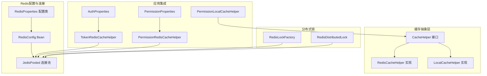
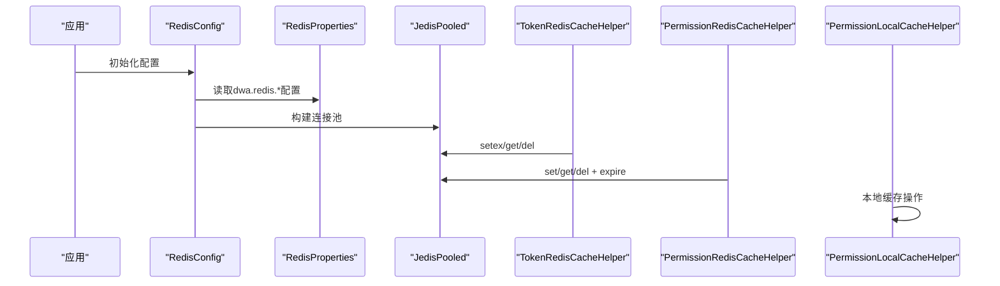
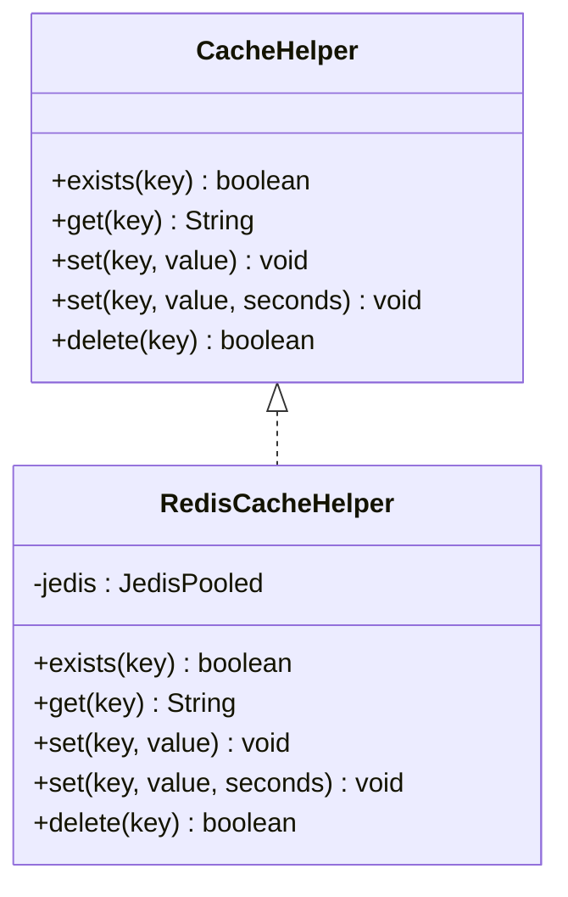
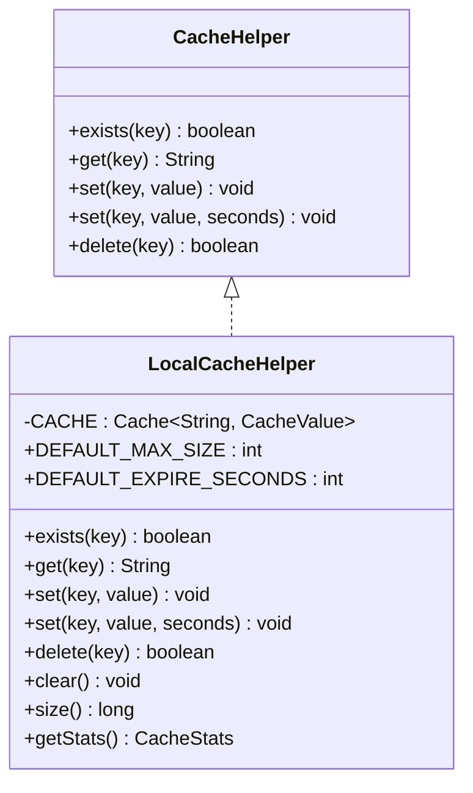
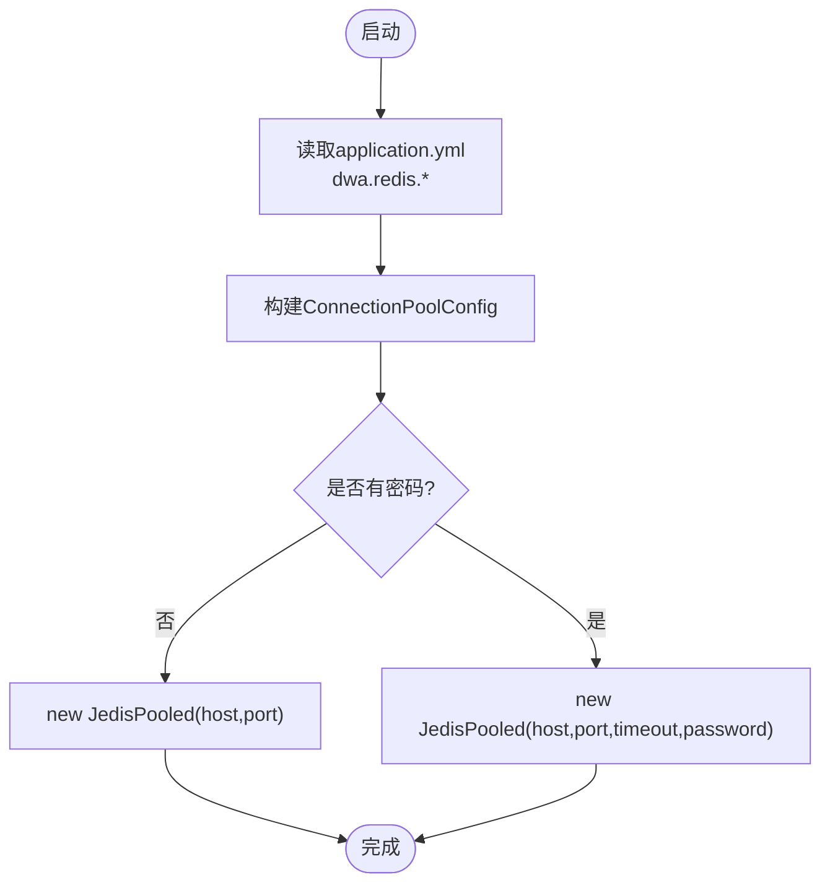
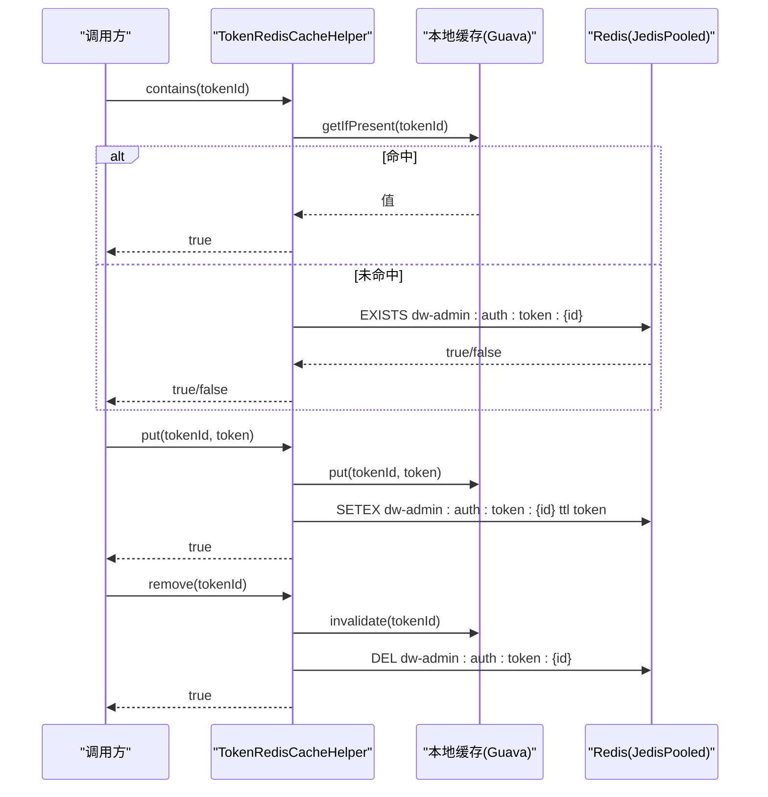
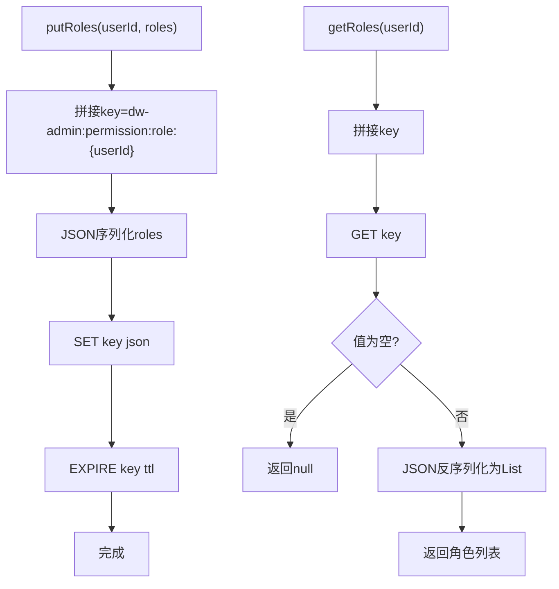
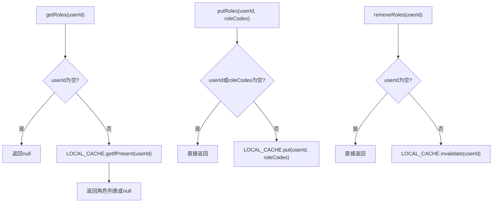
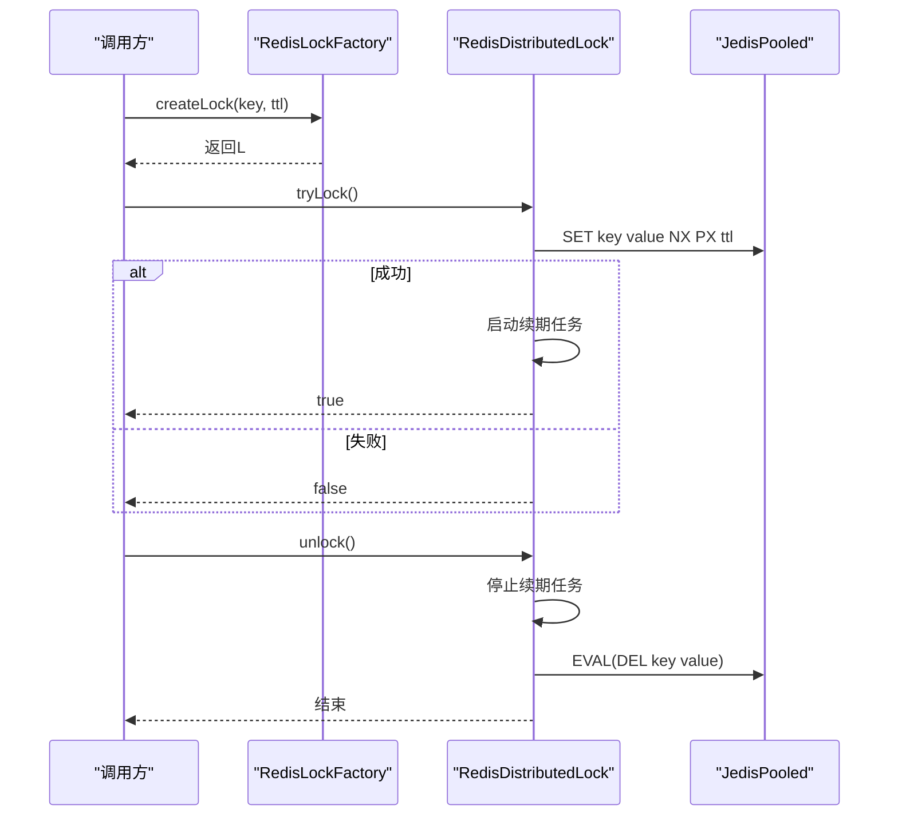
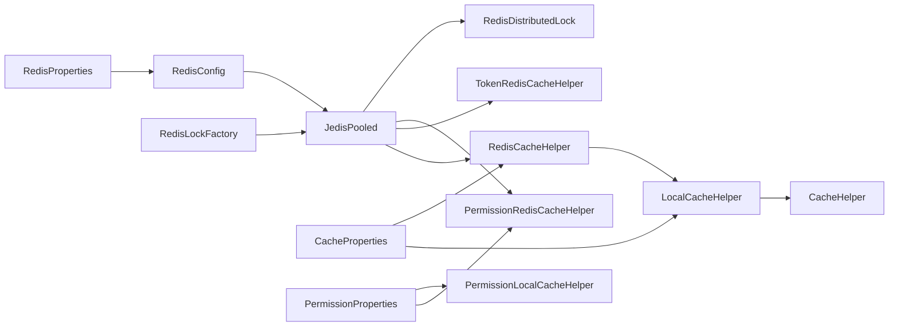

# Redis缓存实现

<cite>
**本文引用的文件**
- [RedisCacheHelper.java](file://src/main/java/com/dw/admin/components/cache/RedisCacheHelper.java)
- [LocalCacheHelper.java](file://src/main/java/com/dw/admin/components/cache/LocalCacheHelper.java)
- [CacheHelper.java](file://src/main/java/com/dw/admin/components/cache/CacheHelper.java)
- [CacheConstant.java](file://src/main/java/com/dw/admin/components/cache/CacheConstant.java)
- [CacheProperties.java](file://src/main/java/com/dw/admin/components/cache/CacheProperties.java)
- [RedisConfig.java](file://src/main/java/com/dw/admin/components/redis/RedisConfig.java)
- [RedisProperties.java](file://src/main/java/com/dw/admin/components/redis/RedisProperties.java)
- [RedisConstant.java](file://src/main/java/com/dw/admin/components/redis/RedisConstant.java)
- [application.yml](file://src/main/resources/application.yml)
- [TokenRedisCacheHelper.java](file://src/main/java/com/dw/admin/components/auth/TokenRedisCacheHelper.java)
- [AuthProperties.java](file://src/main/java/com/dw/admin/components/auth/AuthProperties.java)
- [AuthConstant.java](file://src/main/java/com/dw/admin/components/auth/AuthConstant.java)
- [PermissionRedisCacheHelper.java](file://src/main/java/com/dw/admin/components/permission/PermissionRedisCacheHelper.java)
- [PermissionProperties.java](file://src/main/java/com/dw/admin/components/permission/PermissionProperties.java)
- [PermissionConstant.java](file://src/main/java/com/dw/admin/components/permission/PermissionConstant.java)
- [PermissionLocalCacheHelper.java](file://src/main/java/com/dw/admin/components/permission/PermissionLocalCacheHelper.java)
- [RedisDistributedLock.java](file://src/main/java/com/dw/admin/components/redis/RedisDistributedLock.java)
- [RedisLockFactory.java](file://src/main/java/com/dw/admin/components/redis/RedisLockFactory.java)
- [RedisDistributedLockTest.java](file://src/test/java/com/dw/admin/test/redis/RedisDistributedLockTest.java)
- [LocalCacheHelperTest.java](file://src/test/java/com/dw/admin/test/LocalCacheHelperTest.java)
</cite>

## 目录
1. [简介](#简介)
2. [项目结构](#项目结构)
3. [核心组件](#核心组件)
4. [架构总览](#架构总览)
5. [组件详解](#组件详解)
6. [本地缓存与Redis缓存对比分析](#本地缓存与redis缓存对比分析)
7. [依赖关系分析](#依赖关系分析)
8. [性能与优化](#性能与优化)
9. [故障排查指南](#故障排查指南)
10. [结论](#结论)
11. [附录](#附录)

## 简介
本技术文档围绕项目中的Redis缓存实现展开，重点覆盖以下方面：
- RedisCacheHelper的具体实现与使用方式
- LocalCacheHelper本地缓存实现与Redis实现的对比分析
- 缓存配置参数、连接池设置与初始化流程
- 键空间命名规范与序列化策略现状
- 过期策略与内存淘汰机制的应用实践
- 常用Redis命令使用与性能优化建议
- 监控指标与故障排查方法
- 集群与高可用部署思路
- 持久化策略、备份与恢复建议
- 面向运维的性能调优与容量规划

## 项目结构
项目采用按功能域分层的组织方式，Redis相关能力集中在components/redis与components/cache目录，并在components/auth与components/permission中以"Redis作为缓存"的方式被使用。同时提供了本地缓存实现作为替代方案。



**图表来源**
- [RedisConfig.java](file://src/main/java/com/dw/admin/components/redis/RedisConfig.java#L31-L61)
- [RedisProperties.java](file://src/main/java/com/dw/admin/components/redis/RedisProperties.java#L17-L39)
- [RedisCacheHelper.java](file://src/main/java/com/dw/admin/components/cache/RedisCacheHelper.java#L22-L120)
- [LocalCacheHelper.java](file://src/main/java/com/dw/admin/components/cache/LocalCacheHelper.java#L79-L285)
- [TokenRedisCacheHelper.java](file://src/main/java/com/dw/admin/components/auth/TokenRedisCacheHelper.java#L28-L154)
- [PermissionRedisCacheHelper.java](file://src/main/java/com/dw/admin/components/permission/PermissionRedisCacheHelper.java#L25-L85)
- [PermissionLocalCacheHelper.java](file://src/main/java/com/dw/admin/components/permission/PermissionLocalCacheHelper.java#L28-L70)
- [RedisDistributedLock.java](file://src/main/java/com/dw/admin/components/redis/RedisDistributedLock.java#L26-L290)
- [RedisLockFactory.java](file://src/main/java/com/dw/admin/components/redis/RedisLockFactory.java#L16-L60)

**章节来源**
- [RedisConfig.java](file://src/main/java/com/dw/admin/components/redis/RedisConfig.java#L24-L61)
- [RedisProperties.java](file://src/main/java/com/dw/admin/components/redis/RedisProperties.java#L17-L39)
- [application.yml](file://src/main/resources/application.yml#L37-L39)

## 核心组件
- 缓存接口与实现
  - CacheHelper：定义通用缓存操作（存在、读取、写入、带过期写入、删除）
  - RedisCacheHelper：基于JedisPooled的Redis实现，提供字符串键值缓存
  - LocalCacheHelper：基于Guava Cache的本地实现，提供高性能本地缓存
- Redis配置与连接
  - RedisConfig：根据RedisProperties构建JedisPooled连接池
  - RedisProperties：集中管理Redis连接与池化参数
- 应用级缓存使用
  - TokenRedisCacheHelper：鉴权Token的Redis缓存，结合本地Guava缓存
  - PermissionRedisCacheHelper：权限角色列表的Redis缓存
  - PermissionLocalCacheHelper：权限角色列表的本地缓存实现
- 分布式锁
  - RedisDistributedLock：基于SET NX PX与Lua脚本的分布式锁，支持自动续期
  - RedisLockFactory：统一创建分布式锁入口

**章节来源**
- [CacheHelper.java](file://src/main/java/com/dw/admin/components/cache/CacheHelper.java#L8-L51)
- [RedisCacheHelper.java](file://src/main/java/com/dw/admin/components/cache/RedisCacheHelper.java#L22-L120)
- [LocalCacheHelper.java](file://src/main/java/com/dw/admin/components/cache/LocalCacheHelper.java#L79-L285)
- [RedisConfig.java](file://src/main/java/com/dw/admin/components/redis/RedisConfig.java#L31-L61)
- [RedisProperties.java](file://src/main/java/com/dw/admin/components/redis/RedisProperties.java#L17-L39)
- [TokenRedisCacheHelper.java](file://src/main/java/com/dw/admin/components/auth/TokenRedisCacheHelper.java#L28-L154)
- [PermissionRedisCacheHelper.java](file://src/main/java/com/dw/admin/components/permission/PermissionRedisCacheHelper.java#L25-L85)
- [PermissionLocalCacheHelper.java](file://src/main/java/com/dw/admin/components/permission/PermissionLocalCacheHelper.java#L28-L70)
- [RedisDistributedLock.java](file://src/main/java/com/dw/admin/components/redis/RedisDistributedLock.java#L26-L290)
- [RedisLockFactory.java](file://src/main/java/com/dw/admin/components/redis/RedisLockFactory.java#L16-L60)

## 架构总览
下图展示了Redis缓存与各业务模块的交互关系，以及配置加载路径。



**图表来源**
- [RedisConfig.java](file://src/main/java/com/dw/admin/components/redis/RedisConfig.java#L31-L61)
- [RedisProperties.java](file://src/main/java/com/dw/admin/components/redis/RedisProperties.java#L17-L39)
- [TokenRedisCacheHelper.java](file://src/main/java/com/dw/admin/components/auth/TokenRedisCacheHelper.java#L107-L116)
- [PermissionRedisCacheHelper.java](file://src/main/java/com/dw/admin/components/permission/PermissionRedisCacheHelper.java#L54-L56)
- [PermissionLocalCacheHelper.java](file://src/main/java/com/dw/admin/components/permission/PermissionLocalCacheHelper.java#L48-L68)

## 组件详解

### RedisCacheHelper：基础缓存实现
- 功能要点
  - 提供exists、get、set、setex、delete等基础操作
  - 对空键进行防御性校验；异常时记录日志并返回安全值
  - 使用JedisPooled执行命令，保证线程安全与连接复用
- 关键行为
  - set(key,value)：无过期，依赖Redis默认TTL策略
  - set(key,value,seconds)：使用setex原子设置值与过期时间
  - delete：返回布尔表示删除成功与否
- 适用场景
  - 简单字符串键值缓存，如配置项、临时标识等



**图表来源**
- [CacheHelper.java](file://src/main/java/com/dw/admin/components/cache/CacheHelper.java#L8-L51)
- [RedisCacheHelper.java](file://src/main/java/com/dw/admin/components/cache/RedisCacheHelper.java#L22-L120)

**章节来源**
- [RedisCacheHelper.java](file://src/main/java/com/dw/admin/components/cache/RedisCacheHelper.java#L35-L119)

### LocalCacheHelper：本地缓存实现
- 功能要点
  - 基于Guava Cache实现的高性能本地缓存
  - 支持自定义最大容量、默认过期时间和过期策略
  - 提供缓存统计功能，包括命中率、加载时间等
  - 自动清理过期数据，线程安全
- 关键行为
  - set(key,value)：使用默认过期时间（3600秒）
  - set(key,value,seconds)：使用自定义过期时间
  - delete：立即删除并返回布尔结果
  - exists：检查键是否存在且未过期
  - get：获取值并自动处理过期
- 适用场景
  - 高频访问的小型数据缓存
  - 本地进程内的临时数据存储
  - 对延迟敏感的场景



**图表来源**
- [CacheHelper.java](file://src/main/java/com/dw/admin/components/cache/CacheHelper.java#L8-L51)
- [LocalCacheHelper.java](file://src/main/java/com/dw/admin/components/cache/LocalCacheHelper.java#L79-L285)

**章节来源**
- [LocalCacheHelper.java](file://src/main/java/com/dw/admin/components/cache/LocalCacheHelper.java#L138-L283)

### Redis配置与连接池：RedisConfig与RedisProperties
- 配置加载
  - application.yml中dwa.redis.url与dwa.redis.password用于初始化连接
  - RedisProperties映射dwa.redis.*前缀的配置项
- 连接池参数
  - 最大连接数、最大空闲、最小空闲、最大等待时间、超时时间
  - 通过ConnectionPoolConfig统一配置
- 初始化流程
  - 解析url首节点host:port，按需传入密码与超时
  - 成功后输出初始化完成日志；异常时记录错误但不抛出



**图表来源**
- [RedisConfig.java](file://src/main/java/com/dw/admin/components/redis/RedisConfig.java#L31-L61)
- [RedisProperties.java](file://src/main/java/com/dw/admin/components/redis/RedisProperties.java#L17-L39)
- [application.yml](file://src/main/resources/application.yml#L37-L39)

**章节来源**
- [RedisConfig.java](file://src/main/java/com/dw/admin/components/redis/RedisConfig.java#L31-L61)
- [RedisProperties.java](file://src/main/java/com/dw/admin/components/redis/RedisProperties.java#L17-L39)
- [application.yml](file://src/main/resources/application.yml#L37-L39)

### TokenRedisCacheHelper：鉴权Token缓存
- 设计思想
  - 本地+远程双层缓存：先查本地Guava缓存，再查Redis，写入时双向同步
  - 过期时间由AuthProperties控制，使用setex设置TTL
- 关键流程
  - contains：优先本地命中，其次Redis命中
  - put：同时写入本地与Redis
  - remove：同时删除本地与Redis
- 键空间
  - 使用AuthConstant.AUTH_TOKEN_KEY_PREFIX作为前缀



**图表来源**
- [TokenRedisCacheHelper.java](file://src/main/java/com/dw/admin/components/auth/TokenRedisCacheHelper.java#L56-L148)
- [AuthConstant.java](file://src/main/java/com/dw/admin/components/auth/AuthConstant.java#L44-L44)
- [AuthProperties.java](file://src/main/java/com/dw/admin/components/auth/AuthProperties.java#L29-L30)

**章节来源**
- [TokenRedisCacheHelper.java](file://src/main/java/com/dw/admin/components/auth/TokenRedisCacheHelper.java#L56-L148)
- [AuthConstant.java](file://src/main/java/com/dw/admin/components/auth/AuthConstant.java#L44-L44)
- [AuthProperties.java](file://src/main/java/com/dw/admin/components/auth/AuthProperties.java#L29-L30)

### PermissionRedisCacheHelper：权限角色缓存
- 数据模型
  - 角色列表以JSON数组形式存储，键使用PermissionConstant.PERMISSION_ROLE_KEY_PREFIX前缀
  - 过期时间由PermissionProperties控制
- 关键流程
  - getRoles：从Redis读取并解析为List<String>
  - putRoles：序列化为JSON后写入Redis并设置TTL
  - removeRoles：删除对应键



**图表来源**
- [PermissionRedisCacheHelper.java](file://src/main/java/com/dw/admin/components/permission/PermissionRedisCacheHelper.java#L34-L61)
- [PermissionConstant.java](file://src/main/java/com/dw/admin/components/permission/PermissionConstant.java#L31-L31)
- [PermissionProperties.java](file://src/main/java/com/dw/admin/components/permission/PermissionProperties.java#L27-L27)

**章节来源**
- [PermissionRedisCacheHelper.java](file://src/main/java/com/dw/admin/components/permission/PermissionRedisCacheHelper.java#L34-L73)
- [PermissionConstant.java](file://src/main/java/com/dw/admin/components/permission/PermissionConstant.java#L31-L31)
- [PermissionProperties.java](file://src/main/java/com/dw/admin/components/permission/PermissionProperties.java#L27-L27)

### PermissionLocalCacheHelper：权限角色本地缓存
- 设计思想
  - 基于Guava Cache的本地权限缓存实现
  - 针对权限角色列表的专用缓存，支持自定义过期时间
  - 最大容量100，适合用户权限缓存场景
- 关键流程
  - getRoles：从本地缓存获取角色列表
  - putRoles：将角色列表放入本地缓存
  - removeRoles：删除指定用户的本地缓存



**图表来源**
- [PermissionLocalCacheHelper.java](file://src/main/java/com/dw/admin/components/permission/PermissionLocalCacheHelper.java#L48-L68)

**章节来源**
- [PermissionLocalCacheHelper.java](file://src/main/java/com/dw/admin/components/permission/PermissionLocalCacheHelper.java#L48-L68)

### 分布式锁：RedisDistributedLock与RedisLockFactory
- 锁协议
  - 加锁：SET key value NX PX expire
  - 解锁：Lua脚本判断value后DEL
  - 续期：Lua脚本判断value后PEXPIRE
- 自动续期
  - 续期间隔为锁过期时间的1/3，使用固定大小的守护线程池调度
- 工厂创建
  - RedisLockFactory提供三种创建方式：默认过期时间、指定过期时间、带业务前缀



**图表来源**
- [RedisLockFactory.java](file://src/main/java/com/dw/admin/components/redis/RedisLockFactory.java#L33-L59)
- [RedisDistributedLock.java](file://src/main/java/com/dw/admin/components/redis/RedisDistributedLock.java#L118-L250)

**章节来源**
- [RedisDistributedLock.java](file://src/main/java/com/dw/admin/components/redis/RedisDistributedLock.java#L67-L290)
- [RedisLockFactory.java](file://src/main/java/com/dw/admin/components/redis/RedisLockFactory.java#L33-L59)

## 本地缓存与Redis缓存对比分析

### 实现原理对比
- **LocalCacheHelper（本地缓存）**
  - 基于Google Guava Cache实现，数据存储在JVM内存中
  - 使用LRU淘汰策略，支持自定义最大容量
  - 线程安全，支持高并发访问
  - 自动清理过期数据，无需外部依赖
  
- **RedisCacheHelper（Redis缓存）**
  - 基于Jedis客户端，数据存储在Redis服务器中
  - 支持多种Redis数据结构和命令
  - 需要网络通信，存在网络延迟
  - 支持持久化、集群、高可用等高级特性

### 性能特征对比

| 特性 | LocalCacheHelper | RedisCacheHelper |
|------|------------------|------------------|
| 访问延迟 | 极低（内存访问） | 低（本地网络） |
| 并发性能 | 高（本地锁） | 高（Redis集群） |
| 数据持久性 | 无（进程重启丢失） | 有（Redis持久化） |
| 扩展性 | 有限（单机内存） | 无限（水平扩展） |
| 数据共享 | 仅本地进程 | 多进程/多实例共享 |
| 配置复杂度 | 低 | 中等 |

### 适用场景建议

#### 选择LocalCacheHelper的场景：
- **高频小数据缓存**：如用户会话信息、临时令牌
- **低延迟要求**：对响应时间极其敏感的场景
- **单机部署**：不需要跨进程共享缓存
- **简单数据结构**：字符串键值对缓存
- **成本敏感**：不需要额外的Redis服务器资源

#### 选择RedisCacheHelper的场景：
- **分布式系统**：多实例部署需要共享缓存
- **大数据量**：超出单机内存限制的数据
- **数据持久化需求**：需要缓存数据持久化
- **高可用要求**：需要Redis集群和故障转移
- **复杂数据结构**：需要使用Redis的高级数据结构

### 配置方式对比

#### LocalCacheHelper配置：
```yaml
dwa:
  cache:
    enable: true
    type: local
    local:
      max-size: 10000           # 最大缓存数量
      default-expire-seconds: 3600  # 默认过期时间(秒)
```

#### RedisCacheHelper配置：
```yaml
dwa:
  cache:
    enable: true
    type: redis
  redis:
    url: localhost:6379
    password:
    timeout: 2000
    maxTotal: 20
    maxIdle: 10
    minIdle: 2
    maxWaitMillis: 1000
```

### 缓存策略对比

#### LocalCacheHelper优势：
- **零网络开销**：完全基于内存访问
- **精确控制**：可完全控制缓存生命周期
- **简单易用**：无需Redis服务器配置
- **成本效益**：节省Redis服务器资源

#### RedisCacheHelper优势：
- **横向扩展**：可轻松扩展到多台Redis服务器
- **数据持久化**：支持RDB/AOF持久化
- **集群支持**：支持Redis Cluster和Sentinel
- **监控丰富**：Redis提供丰富的监控指标
- **数据共享**：天然支持多实例共享

### 使用建议

#### 开发环境建议：
- 使用LocalCacheHelper，简化开发和调试
- 便于单元测试和本地开发

#### 生产环境建议：
- 使用RedisCacheHelper，支持高可用和扩展
- 配置适当的过期策略和内存淘汰机制
- 监控Redis性能指标和内存使用情况

#### 混合使用策略：
- 对于高频访问的小型数据使用LocalCacheHelper
- 对于需要共享的大数据使用RedisCacheHelper
- 在分布式系统中，Redis作为主要缓存，LocalCache作为本地加速

**章节来源**
- [LocalCacheHelper.java](file://src/main/java/com/dw/admin/components/cache/LocalCacheHelper.java#L59-L67)
- [RedisCacheHelper.java](file://src/main/java/com/dw/admin/components/cache/RedisCacheHelper.java#L11-L15)
- [CacheProperties.java](file://src/main/java/com/dw/admin/components/cache/CacheProperties.java#L24-L25)
- [application.yml](file://src/main/resources/application.yml#L33-L40)

## 依赖关系分析
- 组件耦合
  - RedisCacheHelper直接依赖JedisPooled，职责单一，内聚度高
  - LocalCacheHelper直接依赖Guava Cache，职责单一，内聚度高
  - TokenRedisCacheHelper与PermissionRedisCacheHelper均依赖JedisPooled与各自配置类
  - PermissionLocalCacheHelper依赖PermissionProperties和Guava Cache
  - RedisConfig对RedisProperties强依赖，负责连接池装配
- 外部依赖
  - Jedis客户端（JedisPooled）提供连接池与命令执行
  - Guava Cache用于本地缓存加速
- 循环依赖
  - 未发现循环依赖，模块边界清晰



**图表来源**
- [RedisConfig.java](file://src/main/java/com/dw/admin/components/redis/RedisConfig.java#L27-L61)
- [RedisProperties.java](file://src/main/java/com/dw/admin/components/redis/RedisProperties.java#L17-L39)
- [RedisCacheHelper.java](file://src/main/java/com/dw/admin/components/cache/RedisCacheHelper.java#L25-L26)
- [LocalCacheHelper.java](file://src/main/java/com/dw/admin/components/cache/LocalCacheHelper.java#L84-L84)
- [TokenRedisCacheHelper.java](file://src/main/java/com/dw/admin/components/auth/TokenRedisCacheHelper.java#L34-L34)
- [PermissionRedisCacheHelper.java](file://src/main/java/com/dw/admin/components/permission/PermissionRedisCacheHelper.java#L31-L31)
- [PermissionLocalCacheHelper.java](file://src/main/java/com/dw/admin/components/permission/PermissionLocalCacheHelper.java#L35-L35)
- [RedisDistributedLock.java](file://src/main/java/com/dw/admin/components/redis/RedisDistributedLock.java#L28-L28)
- [RedisLockFactory.java](file://src/main/java/com/dw/admin/components/redis/RedisLockFactory.java#L19-L20)
- [CacheProperties.java](file://src/main/java/com/dw/admin/components/cache/CacheProperties.java#L21-L25)

**章节来源**
- [RedisConfig.java](file://src/main/java/com/dw/admin/components/redis/RedisConfig.java#L27-L61)
- [RedisProperties.java](file://src/main/java/com/dw/admin/components/redis/RedisProperties.java#L17-L39)
- [RedisCacheHelper.java](file://src/main/java/com/dw/admin/components/cache/RedisCacheHelper.java#L25-L26)
- [LocalCacheHelper.java](file://src/main/java/com/dw/admin/components/cache/LocalCacheHelper.java#L84-L84)
- [TokenRedisCacheHelper.java](file://src/main/java/com/dw/admin/components/auth/TokenRedisCacheHelper.java#L34-L34)
- [PermissionRedisCacheHelper.java](file://src/main/java/com/dw/admin/components/permission/PermissionRedisCacheHelper.java#L31-L31)
- [PermissionLocalCacheHelper.java](file://src/main/java/com/dw/admin/components/permission/PermissionLocalCacheHelper.java#L35-L35)
- [RedisDistributedLock.java](file://src/main/java/com/dw/admin/components/redis/RedisDistributedLock.java#L28-L28)
- [RedisLockFactory.java](file://src/main/java/com/dw/admin/components/redis/RedisLockFactory.java#L19-L20)
- [CacheProperties.java](file://src/main/java/com/dw/admin/components/cache/CacheProperties.java#L21-L25)

## 性能与优化
- 连接池与网络
  - 合理设置maxTotal、maxIdle、minIdle与maxWaitMillis，避免连接争用与超时
  - 控制timeout，避免长阻塞导致线程池压力
- 命令选择
  - setex：一次性设置值与过期时间，减少往返
  - EXISTS/GET/DEL：原子性操作，避免竞态
- 键空间设计
  - 使用统一前缀（如dw-admin:...）便于批量管理与清理
- 内存与过期
  - 明确TTL策略，避免热点键过期风暴
  - 对频繁访问的小对象可考虑本地缓存（如TokenRedisCacheHelper的本地Guava缓存）
- 分布式锁
  - 续期间隔建议为过期时间的1/3，避免续期过于频繁或过少
  - 使用Lua脚本保证解锁/续期原子性
- 本地缓存优化
  - 合理设置maxSize和expireAfterWrite参数
  - 使用CacheStats监控缓存命中率，及时调整配置
  - 对于热点数据，可考虑使用更短的过期时间
- 监控与告警
  - 关注连接池指标（活跃连接、等待队列长度、超时次数）
  - 关注命令耗时分布与错误率
  - 监控本地缓存命中率和内存使用情况

**章节来源**
- [LocalCacheHelper.java](file://src/main/java/com/dw/admin/components/cache/LocalCacheHelper.java#L122-L126)
- [LocalCacheHelper.java](file://src/main/java/com/dw/admin/components/cache/LocalCacheHelper.java#L281-L283)

## 故障排查指南
- 连接失败
  - 检查application.yml中的dwa.redis.url与dwa.redis.password
  - 查看RedisConfig初始化日志，确认JedisPooled创建成功
- 命令异常
  - RedisCacheHelper/TokenRedisCacheHelper/PermissionRedisCacheHelper均对异常进行捕获并记录日志，优先查看对应错误日志
- 分布式锁问题
  - tryLock/lock/lockInterruptibly：关注是否被中断、是否超时
  - unlock：确认是否为同一持有者，Lua脚本返回0表示非持有者或已过期
  - 自动续期：若续期失败，锁会被标记为未持有，检查脚本执行与线程池状态
- 本地缓存问题
  - 检查maxSize配置是否过小导致频繁淘汰
  - 查看CacheStats统计信息，分析命中率和淘汰率
  - 确认过期时间设置是否合理
- 单元测试参考
  - RedisDistributedLockTest覆盖了基本加解锁、超时、阻塞、可中断、自动续期、解锁失败等多种场景，可对照定位问题
  - LocalCacheHelperTest覆盖了基本操作、过期、统计、并发等完整测试场景

**章节来源**
- [RedisConfig.java](file://src/main/java/com/dw/admin/components/redis/RedisConfig.java#L48-L59)
- [RedisCacheHelper.java](file://src/main/java/com/dw/admin/components/cache/RedisCacheHelper.java#L38-L42)
- [TokenRedisCacheHelper.java](file://src/main/java/com/dw/admin/components/auth/TokenRedisCacheHelper.java#L78-L83)
- [PermissionRedisCacheHelper.java](file://src/main/java/com/dw/admin/components/permission/PermissionRedisCacheHelper.java#L54-L59)
- [RedisDistributedLock.java](file://src/main/java/com/dw/admin/components/redis/RedisDistributedLock.java#L136-L139)
- [RedisDistributedLockTest.java](file://src/test/java/com/dw/admin/test/redis/RedisDistributedLockTest.java#L44-L84)
- [LocalCacheHelperTest.java](file://src/test/java/com/dw/admin/test/LocalCacheHelperTest.java#L19-L256)

## 结论
本项目通过简洁的接口抽象与明确的配置装配，实现了稳定可靠的缓存能力。RedisCacheHelper提供基础KV缓存，LocalCacheHelper提供高性能本地缓存，两者在不同场景下各有优势。RedisCacheHelper适合分布式系统和需要持久化的场景，LocalCacheHelper适合单机部署和对延迟敏感的场景。Token与权限模块分别在不同粒度上利用Redis进行缓存，配合本地缓存进一步提升性能。分布式锁通过原子Lua脚本保障一致性，并内置自动续期机制降低误释放风险。建议在生产环境中结合监控指标持续优化连接池参数与TTL策略，确保系统稳定性与性能。

## 附录

### 配置参数一览（Redis）
- dwa.redis.enable：是否启用Redis配置
- dwa.redis.url：Redis地址，格式为host:port（支持逗号分隔多节点，代码取首个节点用于初始化）
- dwa.redis.password：Redis密码
- dwa.redis.timeout：超时时间（毫秒）
- dwa.redis.maxTotal：连接池最大连接数
- dwa.redis.maxIdle：最大空闲连接数
- dwa.redis.minIdle：最小空闲连接数
- dwa.redis.maxWaitMillis：最大等待时间（毫秒）

**章节来源**
- [RedisProperties.java](file://src/main/java/com/dw/admin/components/redis/RedisProperties.java#L19-L36)
- [application.yml](file://src/main/resources/application.yml#L37-L39)

### 配置参数一览（缓存与鉴权/权限）
- dwa.cache.enable：是否启用缓存
- dwa.cache.type：缓存类型（local/redis）
- dwa.auth.cache-type：鉴权缓存类型（DB/redis）
- dwa.auth.expire-time：Token过期时间（秒）
- dwa.permission.cache-type：权限缓存类型（local/redis）
- dwa.permission.expire-time：权限缓存过期时间（秒）

**章节来源**
- [CacheProperties.java](file://src/main/java/com/dw/admin/components/cache/CacheProperties.java#L21-L26)
- [AuthProperties.java](file://src/main/java/com/dw/admin/components/auth/AuthProperties.java#L26-L30)
- [PermissionProperties.java](file://src/main/java/com/dw/admin/components/permission/PermissionProperties.java#L23-L27)

### 键空间命名规范
- 鉴权Token：dw-admin:auth:token:{tokenId}
- 权限角色：dw-admin:permission:role:{userId}
- 权限码：dw-admin:permission:code:{userId}

**章节来源**
- [AuthConstant.java](file://src/main/java/com/dw/admin/components/auth/AuthConstant.java#L44-L44)
- [PermissionConstant.java](file://src/main/java/com/dw/admin/components/permission/PermissionConstant.java#L31-L34)

### 常用Redis命令与使用建议
- SET/SETEX：设置键值与过期时间，推荐使用SETEX一次性设置
- GET：读取键值
- EXISTS：判断键是否存在
- DEL：删除键
- PEXPIRE：设置毫秒级过期时间（分布式锁续期使用）
- Lua脚本：解锁与续期使用原子脚本，避免竞态

**章节来源**
- [RedisCacheHelper.java](file://src/main/java/com/dw/admin/components/cache/RedisCacheHelper.java#L96-L96)
- [RedisDistributedLock.java](file://src/main/java/com/dw/admin/components/redis/RedisDistributedLock.java#L45-L58)
- [RedisDistributedLock.java](file://src/main/java/com/dw/admin/components/redis/RedisDistributedLock.java#L166-L170)

### 集群与高可用部署建议
- 集群模式
  - 使用Redis Cluster或Sentinel实现高可用与自动故障转移
  - 客户端需支持多节点与重定向
- 连接池
  - 在集群环境下，建议使用支持集群的客户端库或通过代理层屏蔽细节
- 配置热更新
  - 通过外部配置中心动态调整连接参数与TTL策略

### 持久化策略与备份恢复
- RDB快照
  - 适合周期性备份与快速恢复，注意快照窗口对性能的影响
- AOF日志
  - 更高的数据安全性，建议开启并合理配置重写策略
- 备份与演练
  - 定期导出RDB/AOF并进行恢复演练，验证备份有效性

### 运维性能调优与容量规划
- 连接池容量
  - 根据QPS与RT目标，逐步调优maxTotal与maxWaitMillis
- 键空间治理
  - 统一前缀与命名规范，定期清理过期键
- TTL策略
  - 热点键设置差异化TTL，避免同时过期
- 监控指标
  - 连接池：活跃连接、等待队列、超时次数
  - 命令：耗时P99、错误率、慢查询
  - 内存：used_memory、mem_fragmentation_ratio
- 本地缓存监控
  - 命中率：关注CacheStats.hitRate()
  - 淘汰率：监控过期和淘汰事件
  - 内存使用：监控缓存大小和内存占用

**章节来源**
- [LocalCacheHelper.java](file://src/main/java/com/dw/admin/components/cache/LocalCacheHelper.java#L281-L283)