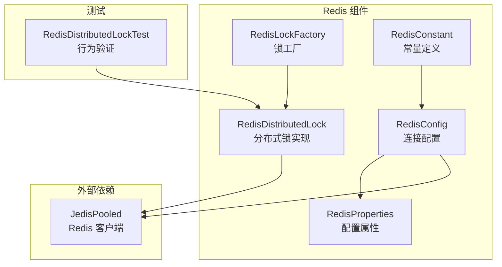
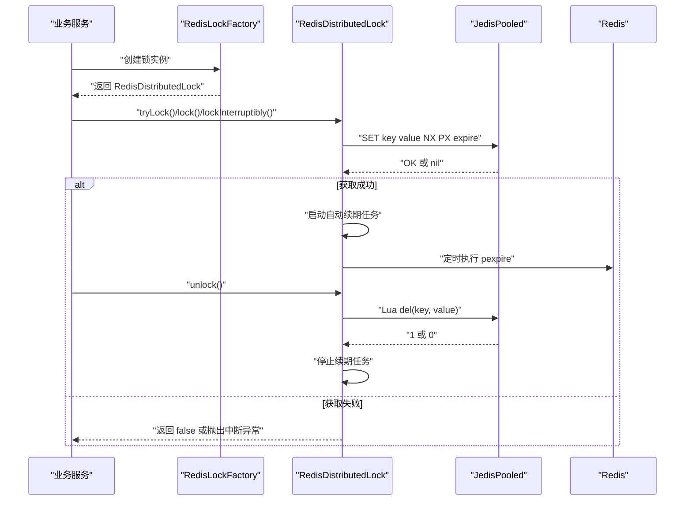
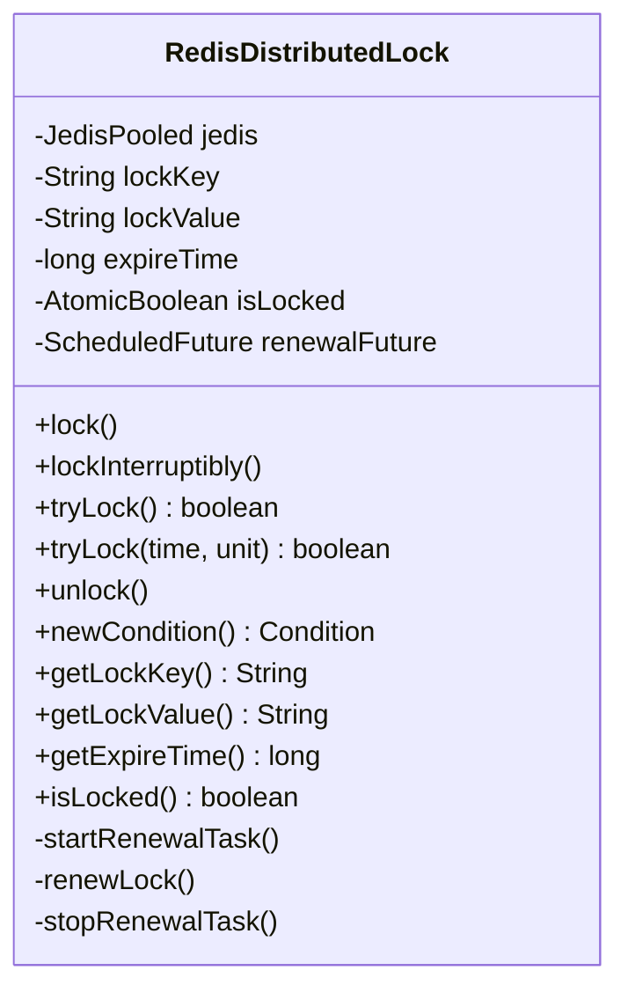
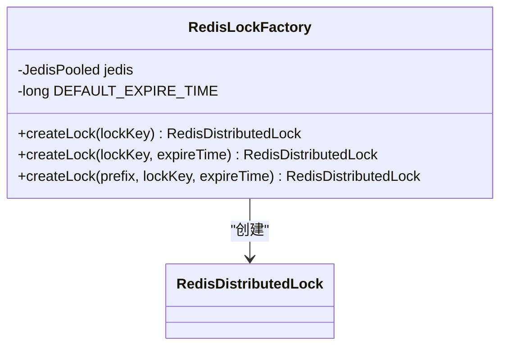
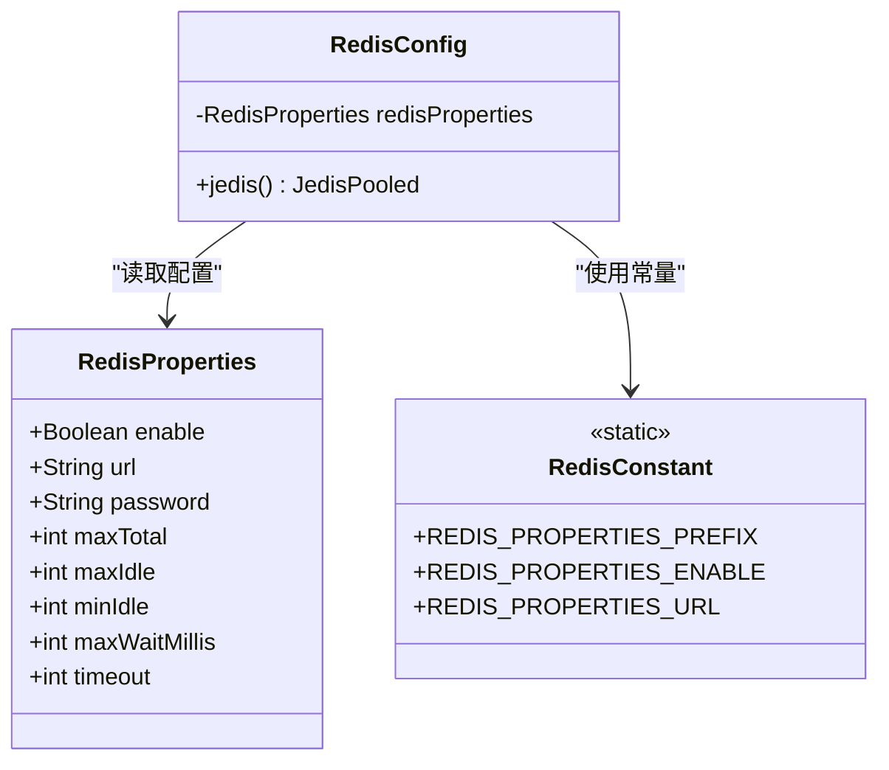
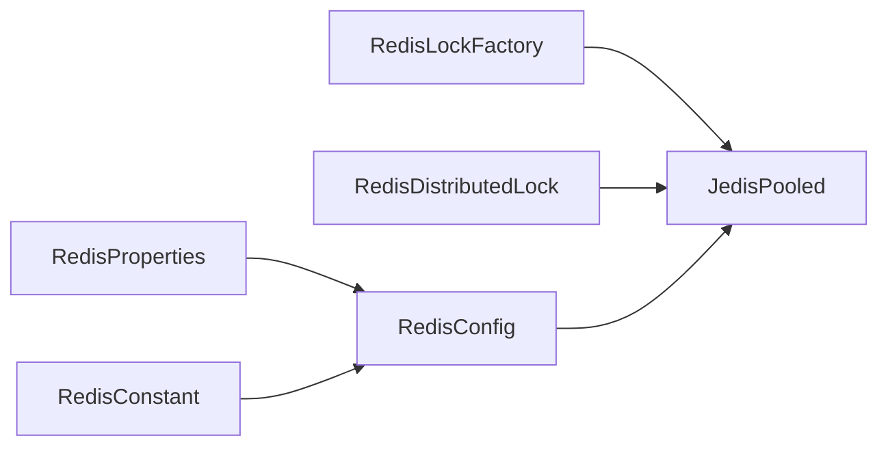
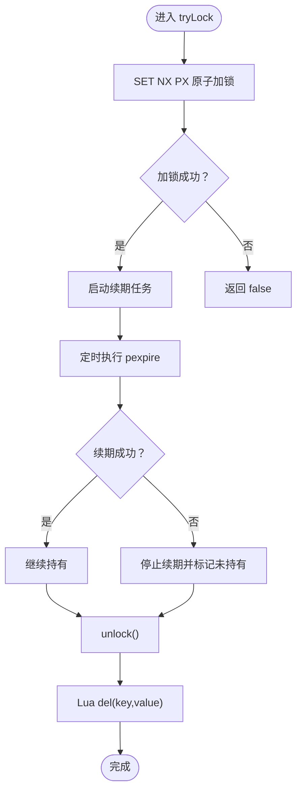

# 分布式锁机制

<cite>
**本文引用的文件列表**
- [RedisDistributedLock.java](file://src/main/java/com/dw/admin/components/redis/RedisDistributedLock.java)
- [RedisLockFactory.java](file://src/main/java/com/dw/admin/components/redis/RedisLockFactory.java)
- [RedisConfig.java](file://src/main/java/com/dw/admin/components/redis/RedisConfig.java)
- [RedisProperties.java](file://src/main/java/com/dw/admin/components/redis/RedisProperties.java)
- [RedisConstant.java](file://src/main/java/com/dw/admin/components/redis/RedisConstant.java)
- [RedisDistributedLockTest.java](file://src/test/java/com/dw/admin/test/redis/RedisDistributedLockTest.java)
- [application.yml](file://src/main/resources/application.yml)
</cite>

## 目录
1. [引言](#引言)
2. [项目结构](#项目结构)
3. [核心组件](#核心组件)
4. [架构总览](#架构总览)
5. [组件详解](#组件详解)
6. [依赖关系分析](#依赖关系分析)
7. [性能与并发控制](#性能与并发控制)
8. [故障排查与异常处理](#故障排查与异常处理)
9. [监控告警与故障恢复](#监控告警与故障恢复)
10. [业务场景应用模式](#业务场景应用模式)
11. [设计原则与最佳实践](#设计原则与最佳实践)
12. [结论](#结论)

## 引言
本文件围绕基于 Redis 的分布式锁实现进行系统化技术说明，重点覆盖以下方面：
- Redis 分布式锁的实现原理与 Redlock 算法的关系
- RedisDistributedLock 的使用方式与锁超时机制
- RedisLockFactory 的工厂设计与锁实例管理
- 分布式锁的获取、释放与自动续期机制
- 死锁预防与异常处理策略
- 性能优化与并发控制建议
- 监控告警与故障恢复方案
- 在不同业务场景下的应用模式与最佳实践

## 项目结构
本项目的分布式锁能力位于组件层 redis 包下，核心文件包括：
- RedisDistributedLock：分布式锁实现，基于 Redis 原子命令与 Lua 脚本保证安全性
- RedisLockFactory：分布式锁工厂，负责创建锁实例并统一管理默认过期时间
- RedisConfig/RedisProperties/RedisConstant：Redis 连接配置与属性绑定
- RedisDistributedLockTest：对锁行为的单元测试，覆盖获取、释放、续期、异常等场景

图表来源
- [RedisDistributedLock.java](file://src/main/java/com/dw/admin/components/redis/RedisDistributedLock.java#L25-L290)
- [RedisLockFactory.java](file://src/main/java/com/dw/admin/components/redis/RedisLockFactory.java#L15-L60)
- [RedisConfig.java](file://src/main/java/com/dw/admin/components/redis/RedisConfig.java#L21-L61)
- [RedisProperties.java](file://src/main/java/com/dw/admin/components/redis/RedisProperties.java#L14-L39)
- [RedisConstant.java](file://src/main/java/com/dw/admin/components/redis/RedisConstant.java#L8-L20)
- [RedisDistributedLockTest.java](file://src/test/java/com/dw/admin/test/redis/RedisDistributedLockTest.java#L30-L311)

章节来源
- [RedisDistributedLock.java](file://src/main/java/com/dw/admin/components/redis/RedisDistributedLock.java#L1-L291)
- [RedisLockFactory.java](file://src/main/java/com/dw/admin/components/redis/RedisLockFactory.java#L1-L61)
- [RedisConfig.java](file://src/main/java/com/dw/admin/components/redis/RedisConfig.java#L1-L63)
- [RedisProperties.java](file://src/main/java/com/dw/admin/components/redis/RedisProperties.java#L1-L40)
- [RedisConstant.java](file://src/main/java/com/dw/admin/components/redis/RedisConstant.java#L1-L21)
- [RedisDistributedLockTest.java](file://src/test/java/com/dw/admin/test/redis/RedisDistributedLockTest.java#L1-L312)
- [application.yml](file://src/main/resources/application.yml#L33-L39)

## 核心组件
- RedisDistributedLock：实现 java.util.concurrent.locks.Lock 接口，提供阻塞/可中断/带超时的获取锁，以及原子性释放与自动续期（看门狗）机制
- RedisLockFactory：通过 JedisPooled 提供锁实例创建，支持默认过期时间与带业务前缀的键拼接
- RedisConfig/RedisProperties/RedisConstant：负责 Redis 连接参数与属性绑定，支持密码、超时、连接池配置等

章节来源
- [RedisDistributedLock.java](file://src/main/java/com/dw/admin/components/redis/RedisDistributedLock.java#L25-L290)
- [RedisLockFactory.java](file://src/main/java/com/dw/admin/components/redis/RedisLockFactory.java#L15-L60)
- [RedisConfig.java](file://src/main/java/com/dw/admin/components/redis/RedisConfig.java#L21-L61)
- [RedisProperties.java](file://src/main/java/com/dw/admin/components/redis/RedisProperties.java#L14-L39)
- [RedisConstant.java](file://src/main/java/com/dw/admin/components/redis/RedisConstant.java#L8-L20)

## 架构总览
分布式锁的运行时架构如下：
- 应用通过 RedisLockFactory 创建 RedisDistributedLock 实例
- RedisDistributedLock 使用 JedisPooled 执行 Redis 原子命令与 Lua 脚本
- 采用自动续期线程池定时续期，防止锁因业务处理时间长而过期
- 释放锁时使用 Lua 脚本确保“仅持有者可释放”，避免误删他人锁

图表来源
- [RedisLockFactory.java](file://src/main/java/com/dw/admin/components/redis/RedisLockFactory.java#L33-L59)
- [RedisDistributedLock.java](file://src/main/java/com/dw/admin/components/redis/RedisDistributedLock.java#L117-L250)
- [RedisConfig.java](file://src/main/java/com/dw/admin/components/redis/RedisConfig.java#L31-L61)

## 组件详解

### RedisDistributedLock：分布式锁实现
- 锁键与锁值：每个锁实例生成唯一锁值，释放/续期均以“键+锁值”作为原子判断条件
- 获取锁：使用 SET 命令的 NX+PX 参数实现原子加锁；成功后启动自动续期任务
- 自动续期（看门狗）：固定周期（过期时间的 1/3）执行 Lua pexpire，若续期失败则停止续期并标记未持有
- 释放锁：使用 Lua del(key, value) 原子删除，避免误删他人锁；先停止续期再执行释放
- 超时与中断：支持带超时的 tryLock 与可中断的 lockInterruptibly
- 不支持 Condition：分布式锁不提供条件等待机制

图表来源
- [RedisDistributedLock.java](file://src/main/java/com/dw/admin/components/redis/RedisDistributedLock.java#L25-L290)

章节来源
- [RedisDistributedLock.java](file://src/main/java/com/dw/admin/components/redis/RedisDistributedLock.java#L74-L250)

### RedisLockFactory：锁工厂与实例管理
- 默认过期时间：提供默认 30 秒过期时间，便于快速创建锁实例
- 多种创建方式：
  - createLock(lockKey)
  - createLock(lockKey, expireTime)
  - createLock(prefix, lockKey, expireTime)：自动拼接“前缀:键”
- 依赖注入：从 Spring 容器获取 JedisPooled，确保连接复用与线程安全

图表来源
- [RedisLockFactory.java](file://src/main/java/com/dw/admin/components/redis/RedisLockFactory.java#L15-L60)

章节来源
- [RedisLockFactory.java](file://src/main/java/com/dw/admin/components/redis/RedisLockFactory.java#L15-L60)

### RedisConfig/RedisProperties/RedisConstant：Redis 连接与配置
- RedisProperties：绑定 dwa.redis.* 前缀的配置项，包括 enable、url、password、连接池大小与超时
- RedisConfig：根据配置创建 JedisPooled，支持无密码与带密码两种初始化路径
- RedisConstant：集中管理配置属性前缀与开关键

图表来源
- [RedisProperties.java](file://src/main/java/com/dw/admin/components/redis/RedisProperties.java#L14-L39)
- [RedisConfig.java](file://src/main/java/com/dw/admin/components/redis/RedisConfig.java#L21-L61)
- [RedisConstant.java](file://src/main/java/com/dw/admin/components/redis/RedisConstant.java#L8-L20)

章节来源
- [RedisProperties.java](file://src/main/java/com/dw/admin/components/redis/RedisProperties.java#L14-L39)
- [RedisConfig.java](file://src/main/java/com/dw/admin/components/redis/RedisConfig.java#L21-L61)
- [RedisConstant.java](file://src/main/java/com/dw/admin/components/redis/RedisConstant.java#L8-L20)
- [application.yml](file://src/main/resources/application.yml#L33-L39)

### 使用流程与关键路径
- 获取锁：tryLock/lock/lockInterruptibly
- 释放锁：unlock
- 续期：内部定时任务自动续期，失败时自动停止
- 属性查询：getLockKey/getLockValue/getExpireTime/isLocked

章节来源
- [RedisDistributedLock.java](file://src/main/java/com/dw/admin/components/redis/RedisDistributedLock.java#L117-L250)

## 依赖关系分析
- 组件耦合
  - RedisDistributedLock 依赖 JedisPooled 与 Lua 脚本，内部维护续期线程池
  - RedisLockFactory 依赖 JedisPooled，负责锁实例创建与命名空间管理
  - RedisConfig 依赖 RedisProperties，负责连接池与客户端初始化
- 外部依赖
  - JedisPooled：Redis 客户端，提供原子命令与 Lua 支持
- 潜在风险
  - 续期线程池为守护线程，进程退出时会随 JVM 退出
  - 未实现 Redlock 算法，不适用于多 Redis 实例的高可用场景

图表来源
- [RedisLockFactory.java](file://src/main/java/com/dw/admin/components/redis/RedisLockFactory.java#L15-L60)
- [RedisDistributedLock.java](file://src/main/java/com/dw/admin/components/redis/RedisDistributedLock.java#L25-L72)
- [RedisConfig.java](file://src/main/java/com/dw/admin/components/redis/RedisConfig.java#L21-L61)
- [RedisProperties.java](file://src/main/java/com/dw/admin/components/redis/RedisProperties.java#L14-L39)
- [RedisConstant.java](file://src/main/java/com/dw/admin/components/redis/RedisConstant.java#L8-L20)

## 性能与并发控制
- 续期频率：过期时间的 1/3，兼顾减少网络往返与避免过早过期
- 线程模型：使用固定大小的守护线程池执行续期，避免频繁创建销毁线程
- 自旋等待：获取锁时采用短间隔自旋，降低 CPU 占用
- 连接池：通过 RedisProperties 配置连接池上限、空闲数与等待时间，提升吞吐
- 并发建议
  - 为不同业务场景设置合理的过期时间，避免过短导致频繁续期，过长导致资源占用
  - 对热点资源使用细粒度锁键，降低竞争
  - 控制业务临界区长度，尽量缩短持有锁的时间

章节来源
- [RedisDistributedLock.java](file://src/main/java/com/dw/admin/components/redis/RedisDistributedLock.java#L146-L158)
- [RedisProperties.java](file://src/main/java/com/dw/admin/components/redis/RedisProperties.java#L28-L36)

## 故障排查与异常处理
- 获取锁失败
  - 返回 false 或抛出中断异常（可中断模式）
  - 日志记录错误原因，便于定位
- 续期失败
  - 当续期脚本返回非预期值时，停止续期并标记未持有
  - 避免继续续期无效锁，防止资源泄漏
- 释放锁失败
  - Lua 脚本返回 0 表示锁已过期或被他人持有，记录警告日志
- Redis 异常
  - tryLock 内捕获异常并返回 false，避免异常传播影响业务
- 单元测试覆盖
  - 基本加锁/解锁、超时获取、阻塞获取、可中断获取、自动续期、续期失败、解锁失败、属性查询、Redis 异常等

图表来源
- [RedisDistributedLock.java](file://src/main/java/com/dw/admin/components/redis/RedisDistributedLock.java#L117-L250)

章节来源
- [RedisDistributedLockTest.java](file://src/test/java/com/dw/admin/test/redis/RedisDistributedLockTest.java#L43-L311)

## 监控告警与故障恢复
- 建议指标
  - 加锁成功率、平均获取耗时、续期失败率、锁持有时长分布
  - Redis 命令耗时与错误率、连接池使用率
- 告警阈值
  - 获取锁超时比例过高、续期失败持续出现、Redis 错误率上升
- 故障恢复
  - 发生续期失败时，应尽快释放锁并重试；必要时增加过期时间
  - Redis 连接异常时，优先降级或熔断，避免雪崩
  - 对关键业务采用更严格的锁策略（如更短的过期时间与更频繁的续期）

[本节为通用建议，无需特定文件引用]

## 业务场景应用模式
- 幂等写入：对同一资源的写操作加锁，避免并发写冲突
- 批量处理：在批处理任务中对批次标识加锁，保证单实例处理
- 定时任务：对定时任务的执行状态加锁，避免重复执行
- 数据迁移：对源数据加锁，迁移完成后释放
- 注意事项
  - 锁键命名需具备业务语义且唯一
  - 严格控制临界区大小，避免长事务
  - 对失败场景做好补偿与回滚

[本节为通用建议，无需特定文件引用]

## 设计原则与最佳实践
- 原子性与一致性
  - 使用 SET NX PX 与 Lua 脚本保证加锁与释放的原子性
- 超时与续期
  - 合理设置过期时间与续期间隔，平衡安全与性能
- 可观测性
  - 记录关键事件（加锁/释放/续期），便于问题定位
- 容错与降级
  - Redis 异常时返回失败而非抛出异常，保障业务可用
- 可扩展性
  - 工厂模式统一管理锁实例与默认配置，便于扩展

章节来源
- [RedisDistributedLock.java](file://src/main/java/com/dw/admin/components/redis/RedisDistributedLock.java#L117-L250)
- [RedisLockFactory.java](file://src/main/java/com/dw/admin/components/redis/RedisLockFactory.java#L22-L59)

## 结论
本实现基于 Redis 原子命令与 Lua 脚本，提供了可靠的分布式锁能力，具备自动续期、超时与中断等特性，并通过工厂模式简化了锁实例的创建与管理。需要注意的是，该实现未采用 Redlock 算法，不适用于多 Redis 实例的高可用场景。在生产环境中，建议结合监控告警、容量规划与容错策略，确保分布式锁的稳定与高效。