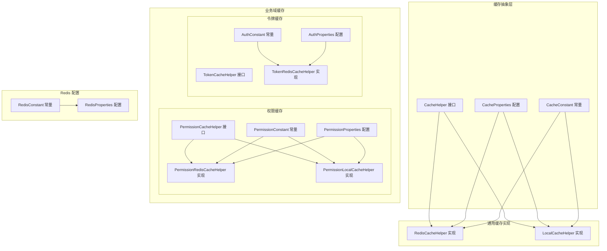
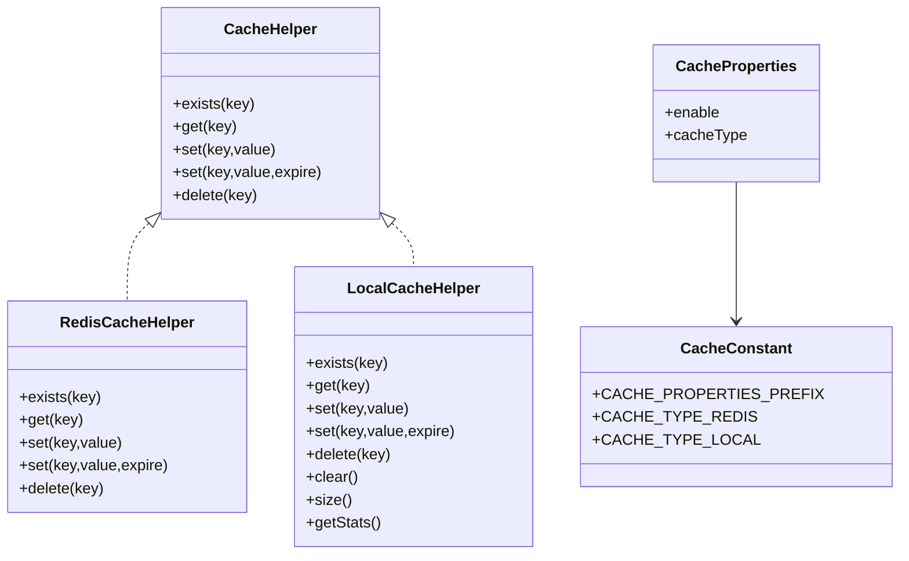
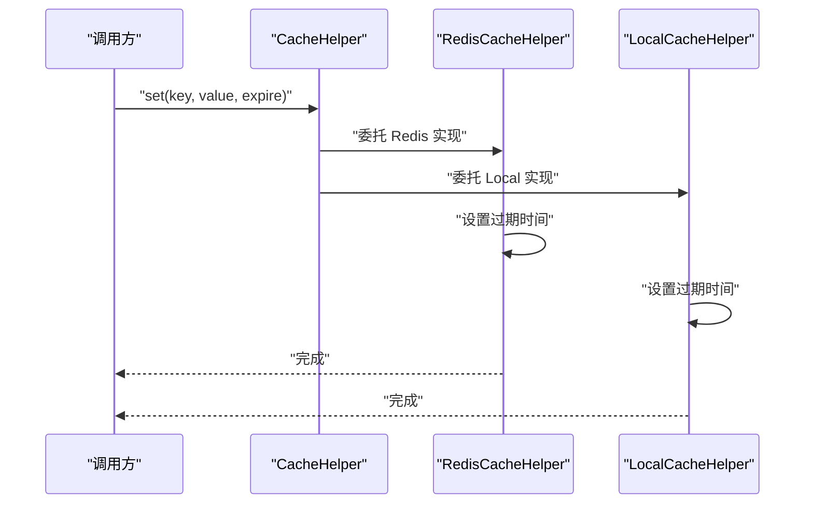
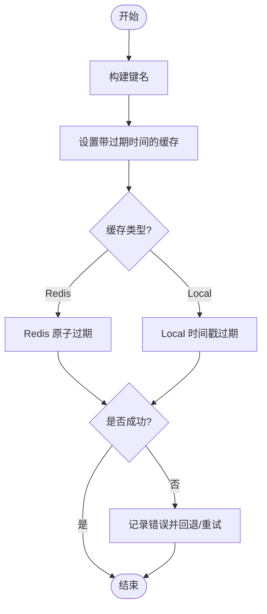
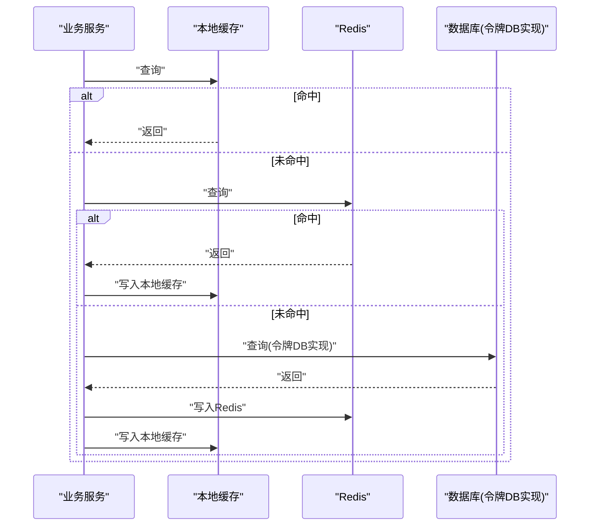
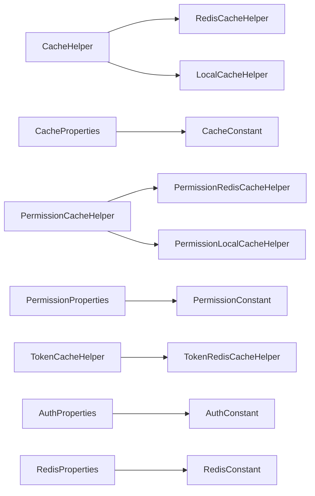

# 缓存策略与抽象层

<cite>
**本文引用的文件**
- [src/main/java/com/dw/admin/components/cache/CacheHelper.java](file://src/main/java/com/dw/admin/components/cache/CacheHelper.java)
- [src/main/java/com/dw/admin/components/cache/RedisCacheHelper.java](file://src/main/java/com/dw/admin/components/cache/RedisCacheHelper.java)
- [src/main/java/com/dw/admin/components/cache/LocalCacheHelper.java](file://src/main/java/com/dw/admin/components/cache/LocalCacheHelper.java)
- [src/main/java/com/dw/admin/components/cache/CacheConstant.java](file://src/main/java/com/dw/admin/components/cache/CacheConstant.java)
- [src/main/java/com/dw/admin/components/cache/CacheProperties.java](file://src/main/java/com/dw/admin/components/cache/CacheProperties.java)
- [src/main/java/com/dw/admin/components/permission/PermissionCacheHelper.java](file://src/main/java/com/dw/admin/components/permission/PermissionCacheHelper.java)
- [src/main/java/com/dw/admin/components/permission/PermissionRedisCacheHelper.java](file://src/main/java/com/dw/admin/components/permission/PermissionRedisCacheHelper.java)
- [src/main/java/com/dw/admin/components/permission/PermissionLocalCacheHelper.java](file://src/main/java/com/dw/admin/components/permission/PermissionLocalCacheHelper.java)
- [src/main/java/com/dw/admin/components/permission/PermissionConstant.java](file://src/main/java/com/dw/admin/components/permission/PermissionConstant.java)
- [src/main/java/com/dw/admin/components/permission/PermissionProperties.java](file://src/main/java/com/dw/admin/components/permission/PermissionProperties.java)
- [src/main/java/com/dw/admin/components/auth/TokenCacheHelper.java](file://src/main/java/com/dw/admin/components/auth/TokenCacheHelper.java)
- [src/main/java/com/dw/admin/components/auth/TokenRedisCacheHelper.java](file://src/main/java/com/dw/admin/components/auth/TokenRedisCacheHelper.java)
- [src/main/java/com/dw/admin/components/auth/AuthConstant.java](file://src/main/java/com/dw/admin/components/auth/AuthConstant.java)
- [src/main/java/com/dw/admin/components/auth/AuthProperties.java](file://src/main/java/com/dw/admin/components/auth/AuthProperties.java)
- [src/main/java/com/dw/admin/components/redis/RedisConstant.java](file://src/main/java/com/dw/admin/components/redis/RedisConstant.java)
- [src/main/java/com/dw/admin/components/redis/RedisProperties.java](file://src/main/java/com/dw/admin/components/redis/RedisProperties.java)
- [src/test/java/com/dw/admin/test/LocalCacheHelperTest.java](file://src/test/java/com/dw/admin/test/LocalCacheHelperTest.java)
- [src/main/resources/application-dev.yml](file://src/main/resources/application-dev.yml)
- [src/main/resources/application.yml](file://src/main/resources/application.yml)
</cite>

## 更新摘要
**所做更改**
- 新增 LocalCacheHelper 本地缓存实现的详细分析
- 更新缓存实现对比表格，包含本地缓存与 Redis 缓存的特性对比
- 新增本地缓存配置说明与最佳实践
- 更新架构图以反映本地缓存的加入
- 新增本地缓存的性能特征与适用场景分析
- 更新扩展指南，包含本地缓存实现的开发要点

## 目录
1. [引言](#引言)
2. [项目结构](#项目结构)
3. [核心组件](#核心组件)
4. [架构总览](#架构总览)
5. [详细组件分析](#详细组件分析)
6. [依赖关系分析](#依赖关系分析)
7. [性能考量](#性能考量)
8. [故障排查指南](#故障排查指南)
9. [结论](#结论)
10. [附录](#附录)

## 引言
本文件围绕缓存策略与抽象层展开，系统性阐述 CacheHelper 接口的设计理念、策略模式的应用方式，以及如何通过抽象屏蔽具体缓存实现差异。文档覆盖缓存键命名规范、缓存常量定义、核心方法语义与使用场景、带过期时间的缓存设置策略、扩展指南与自定义实现思路，并给出缓存一致性与失效机制的设计建议，帮助开发者在不同业务场景下做出合理的缓存策略选择与最佳实践。

**更新** 本版本新增了 LocalCacheHelper 本地缓存实现的详细分析，该实现基于 Guava Cache，提供了高性能、线程安全、智能过期管理等特性，与现有的 Redis 实现共同构成完整的缓存策略体系。

## 项目结构
本项目的缓存抽象层位于 components/cache 包中，配合 components/permission 与 components/auth 下的专用缓存实现，形成"通用缓存抽象 + 业务域缓存实现"的分层设计。Redis 配置与常量分别位于 components/redis 下，用于统一管理连接与属性。**新增** LocalCacheHelper 作为本地缓存实现，提供基于 Guava Cache 的高性能本地缓存解决方案。



**图表来源**
- [src/main/java/com/dw/admin/components/cache/CacheHelper.java](file://src/main/java/com/dw/admin/components/cache/CacheHelper.java#L1-L52)
- [src/main/java/com/dw/admin/components/cache/RedisCacheHelper.java](file://src/main/java/com/dw/admin/components/cache/RedisCacheHelper.java#L1-L121)
- [src/main/java/com/dw/admin/components/cache/LocalCacheHelper.java](file://src/main/java/com/dw/admin/components/cache/LocalCacheHelper.java#L1-L286)
- [src/main/java/com/dw/admin/components/cache/CacheConstant.java](file://src/main/java/com/dw/admin/components/cache/CacheConstant.java#L1-L26)
- [src/main/java/com/dw/admin/components/cache/CacheProperties.java](file://src/main/java/com/dw/admin/components/cache/CacheProperties.java#L1-L29)

**章节来源**
- [src/main/java/com/dw/admin/components/cache/CacheHelper.java](file://src/main/java/com/dw/admin/components/cache/CacheHelper.java#L1-L52)
- [src/main/java/com/dw/admin/components/cache/RedisCacheHelper.java](file://src/main/java/com/dw/admin/components/cache/RedisCacheHelper.java#L1-L121)
- [src/main/java/com/dw/admin/components/cache/LocalCacheHelper.java](file://src/main/java/com/dw/admin/components/cache/LocalCacheHelper.java#L1-L286)
- [src/main/java/com/dw/admin/components/cache/CacheConstant.java](file://src/main/java/com/dw/admin/components/cache/CacheConstant.java#L1-L26)
- [src/main/java/com/dw/admin/components/cache/CacheProperties.java](file://src/main/java/com/dw/admin/components/cache/CacheProperties.java#L1-L29)

## 核心组件
- CacheHelper 接口：定义通用缓存能力，包括存在性检查、读取、写入（含过期）、删除等方法，作为所有缓存实现的契约。
- **RedisCacheHelper 实现**：基于 Jedis 的 Redis 缓存实现，遵循 CacheHelper 约定，提供条件化装配以适配配置开关。
- **LocalCacheHelper 实现**：基于 Guava Cache 的本地缓存实现，提供高性能、线程安全、智能过期管理等特性，支持最大容量限制、默认过期时间配置、缓存统计等功能。
- CacheProperties 与 CacheConstant：集中管理缓存启用与类型配置，以及配置前缀与类型枚举。
- 业务域缓存：
  - 权限缓存：PermissionCacheHelper 与 PermissionRedisCacheHelper、PermissionLocalCacheHelper，结合 PermissionConstant 与 PermissionProperties 定义键前缀与过期时间。
  - 令牌缓存：TokenCacheHelper 与 TokenRedisCacheHelper，结合 AuthConstant 与 AuthProperties 定义键前缀与过期时间。
- Redis 配置：RedisConstant 与 RedisProperties 提供统一的 Redis 连接与池化参数配置。

**章节来源**
- [src/main/java/com/dw/admin/components/cache/CacheHelper.java](file://src/main/java/com/dw/admin/components/cache/CacheHelper.java#L8-L51)
- [src/main/java/com/dw/admin/components/cache/RedisCacheHelper.java](file://src/main/java/com/dw/admin/components/cache/RedisCacheHelper.java#L22-L120)
- [src/main/java/com/dw/admin/components/cache/LocalCacheHelper.java](file://src/main/java/com/dw/admin/components/cache/LocalCacheHelper.java#L79-L283)
- [src/main/java/com/dw/admin/components/cache/CacheProperties.java](file://src/main/java/com/dw/admin/components/cache/CacheProperties.java#L18-L28)
- [src/main/java/com/dw/admin/components/cache/CacheConstant.java](file://src/main/java/com/dw/admin/components/cache/CacheConstant.java#L8-L25)

## 架构总览
缓存抽象层采用"接口 + 具体实现 + 配置 + 常量"的分层设计，通过条件化装配与配置前缀实现运行时可插拔的缓存后端。业务域缓存（权限、令牌）在各自常量与配置下，复用通用缓存能力或直接基于 Redis 实现，确保键空间隔离与生命周期一致。**新增** LocalCacheHelper 作为本地缓存实现，提供高性能的本地缓存解决方案。



**图表来源**
- [src/main/java/com/dw/admin/components/cache/CacheHelper.java](file://src/main/java/com/dw/admin/components/cache/CacheHelper.java#L8-L51)
- [src/main/java/com/dw/admin/components/cache/RedisCacheHelper.java](file://src/main/java/com/dw/admin/components/cache/RedisCacheHelper.java#L22-L120)
- [src/main/java/com/dw/admin/components/cache/LocalCacheHelper.java](file://src/main/java/com/dw/admin/components/cache/LocalCacheHelper.java#L79-L283)
- [src/main/java/com/dw/admin/components/cache/CacheProperties.java](file://src/main/java/com/dw/admin/components/cache/CacheProperties.java#L18-L28)
- [src/main/java/com/dw/admin/components/cache/CacheConstant.java](file://src/main/java/com/dw/admin/components/cache/CacheConstant.java#L10-L25)

## 详细组件分析

### CacheHelper 接口与策略模式
- 设计理念：以最小可用集定义缓存操作，屏蔽底层实现差异；通过条件化装配与配置前缀实现"策略可替换"。
- 方法语义：
  - exists：判断键是否存在，用于快速短路与一致性校验。
  - get：读取缓存值，返回字符串形式，便于通用序列化/反序列化策略。
  - set：无过期设置的写入，适用于无需自动过期的场景。
  - set(key, value, expire)：带过期时间的写入，统一由实现负责过期策略。
  - delete：删除键，返回布尔结果，便于上层进行一致性处理。
- 使用场景：
  - 通用数据缓存：如字典、配置片段、统计快照等。
  - 业务域缓存：权限角色列表、用户令牌等，结合各自常量与配置。



**图表来源**
- [src/main/java/com/dw/admin/components/cache/CacheHelper.java](file://src/main/java/com/dw/admin/components/cache/CacheHelper.java#L35-L42)
- [src/main/java/com/dw/admin/components/cache/RedisCacheHelper.java](file://src/main/java/com/dw/admin/components/cache/RedisCacheHelper.java#L90-L100)
- [src/main/java/com/dw/admin/components/cache/LocalCacheHelper.java](file://src/main/java/com/dw/admin/components/cache/LocalCacheHelper.java#L210-L222)

**章节来源**
- [src/main/java/com/dw/admin/components/cache/CacheHelper.java](file://src/main/java/com/dw/admin/components/cache/CacheHelper.java#L8-L51)
- [src/main/java/com/dw/admin/components/cache/RedisCacheHelper.java](file://src/main/java/com/dw/admin/components/cache/RedisCacheHelper.java#L29-L120)
- [src/main/java/com/dw/admin/components/cache/LocalCacheHelper.java](file://src/main/java/com/dw/admin/components/cache/LocalCacheHelper.java#L138-L248)

### LocalCacheHelper 本地缓存实现
**新增** LocalCacheHelper 基于 Google Guava Cache 提供高性能的本地缓存实现，具有以下特性：

- **性能优势**：完全在 JVM 内存中运行，无网络延迟，支持高并发访问。
- **智能过期管理**：支持自定义过期时间，自动清理过期数据，提供缓存统计信息。
- **容量控制**：支持最大缓存数量限制，采用 LRU 淘汰策略。
- **线程安全**：Guava Cache 内置线程安全机制，支持多线程并发访问。
- **统计功能**：提供命中率、加载时间等详细的缓存统计信息。

#### 核心功能实现
- **缓存值包装**：使用内部类 CacheValue 包装缓存值和过期时间戳，支持自定义过期时间检查。
- **默认配置**：默认最大容量 10,000，默认过期时间为 3600 秒。
- **扩展方法**：提供 clear()、size()、getStats() 等额外功能，便于缓存管理和监控。

#### 配置与使用
- **默认启用**：当缓存类型配置为 local 时，默认使用 LocalCacheHelper。
- **配置参数**：支持通过 application.yml 配置最大容量和默认过期时间。
- **条件装配**：通过 @ConditionalOnProperty 注解实现条件化装配。

**章节来源**
- [src/main/java/com/dw/admin/components/cache/LocalCacheHelper.java](file://src/main/java/com/dw/admin/components/cache/LocalCacheHelper.java#L14-L78)
- [src/main/java/com/dw/admin/components/cache/LocalCacheHelper.java](file://src/main/java/com/dw/admin/components/cache/LocalCacheHelper.java#L79-L130)
- [src/main/java/com/dw/admin/components/cache/LocalCacheHelper.java](file://src/main/java/com/dw/admin/components/cache/LocalCacheHelper.java#L138-L283)

### 缓存键命名规范与常量定义
- 通用缓存键：通过 CacheConstant 定义配置前缀与类型枚举，避免魔法字符串。
- 业务域键前缀：
  - 权限：PermissionConstant 定义角色键前缀与权限码键前缀，确保键空间隔离。
  - 令牌：AuthConstant 定义令牌键前缀，避免与其他业务键冲突。
- 键构建策略：各业务实现通过私有方法拼接前缀与标识符，形成稳定且可读的键名。

**章节来源**
- [src/main/java/com/dw/admin/components/cache/CacheConstant.java](file://src/main/java/com/dw/admin/components/cache/CacheConstant.java#L10-L25)
- [src/main/java/com/dw/admin/components/permission/PermissionConstant.java](file://src/main/java/com/dw/admin/components/permission/PermissionConstant.java#L30-L34)
- [src/main/java/com/dw/admin/components/auth/AuthConstant.java](file://src/main/java/com/dw/admin/components/auth/AuthConstant.java#L43-L44)

### 缓存常量与配置
- CacheProperties：集中管理缓存启用与类型，默认本地缓存，可通过配置切换至 Redis。
- CacheConstant：提供配置前缀与类型枚举，支撑条件化装配。
- Redis 配置：RedisProperties 与 RedisConstant 统一 Redis 连接参数，确保实现层仅关注业务键与过期策略。

**章节来源**
- [src/main/java/com/dw/admin/components/cache/CacheProperties.java](file://src/main/java/com/dw/admin/components/cache/CacheProperties.java#L18-L28)
- [src/main/java/com/dw/admin/components/cache/CacheConstant.java](file://src/main/java/com/dw/admin/components/cache/CacheConstant.java#L10-L25)
- [src/main/java/com/dw/admin/components/redis/RedisProperties.java](file://src/main/java/com/dw/admin/components/redis/RedisProperties.java#L16-L39)

### 带过期时间的缓存设置策略
- 通用层：CacheHelper 的 set(key, value, expire) 明确要求实现负责过期设置。
- Redis 实现：RedisCacheHelper 使用原子过期命令，保证写入与过期的一致性。
- **Local 实现**：LocalCacheHelper 使用时间戳过期检查，支持自定义过期时间。
- 业务域实现：
  - 权限缓存：PermissionRedisCacheHelper 在写入后显式设置过期时间，确保角色信息及时失效。
  - 令牌缓存：TokenRedisCacheHelper 同步写入 Redis 与本地缓存，并按配置过期时间设置过期。
- 最佳实践：
  - 对于热点但易变的数据（如权限、令牌），优先使用带过期时间的写入。
  - 对于长尾或静态数据，可考虑不设置过期或使用较长过期时间。



**图表来源**
- [src/main/java/com/dw/admin/components/cache/RedisCacheHelper.java](file://src/main/java/com/dw/admin/components/cache/RedisCacheHelper.java#L90-L100)
- [src/main/java/com/dw/admin/components/cache/LocalCacheHelper.java](file://src/main/java/com/dw/admin/components/cache/LocalCacheHelper.java#L210-L222)

**章节来源**
- [src/main/java/com/dw/admin/components/cache/RedisCacheHelper.java](file://src/main/java/com/dw/admin/components/cache/RedisCacheHelper.java#L90-L100)
- [src/main/java/com/dw/admin/components/cache/LocalCacheHelper.java](file://src/main/java/com/dw/admin/components/cache/LocalCacheHelper.java#L210-L222)
- [src/main/java/com/dw/admin/components/permission/PermissionRedisCacheHelper.java](file://src/main/java/com/dw/admin/components/permission/PermissionRedisCacheHelper.java#L50-L61)
- [src/main/java/com/dw/admin/components/auth/TokenRedisCacheHelper.java](file://src/main/java/com/dw/admin/components/auth/TokenRedisCacheHelper.java#L107-L116)

### 一致性保证与失效机制
- 多级缓存：令牌与权限实现均采用"本地缓存 + Redis"双层结构，提升命中率与容错能力。
- 一致性策略：
  - 写入：先写 Redis，再写本地缓存，确保外部可见与本地加速。
  - 删除：先删 Redis，再删本地缓存，避免脏读。
  - 查询：优先本地缓存，未命中再查 Redis，减少跨网络访问。
- 失效机制：
  - 显式过期：通过 setex/expire 等命令设置 TTL。
  - 主动清理：令牌 DB 实现中提供定时任务清理过期记录（令牌 Redis 实现依赖过期自动清理）。
  - 业务触发：权限变更或令牌撤销时主动删除对应键。



**图表来源**
- [src/main/java/com/dw/admin/components/auth/TokenRedisCacheHelper.java](file://src/main/java/com/dw/admin/components/auth/TokenRedisCacheHelper.java#L56-L99)
- [src/main/java/com/dw/admin/components/permission/PermissionRedisCacheHelper.java](file://src/main/java/com/dw/admin/components/permission/PermissionRedisCacheHelper.java#L34-L48)

**章节来源**
- [src/main/java/com/dw/admin/components/auth/TokenRedisCacheHelper.java](file://src/main/java/com/dw/admin/components/auth/TokenRedisCacheHelper.java#L56-L99)
- [src/main/java/com/dw/admin/components/permission/PermissionRedisCacheHelper.java](file://src/main/java/com/dw/admin/components/permission/PermissionRedisCacheHelper.java#L34-L48)

### 扩展指南与自定义实现
- 新增缓存实现步骤：
  - 实现 CacheHelper 接口，提供 exists/get/set/delete 的具体逻辑。
  - 通过条件注解与配置前缀实现条件化装配，确保与 CacheProperties 协同工作。
  - 在常量类中定义配置前缀与类型枚举，保持命名与配置风格一致。
- 自定义键命名：
  - 在实现类中定义私有键构建方法，统一拼接前缀与标识符，避免散落的字符串拼接。
- 过期策略：
  - 优先使用原子过期命令，保证写入与过期的一致性。
  - 对于多值结构，考虑序列化后整体设置过期，避免部分更新导致的不一致。
- 一致性与容错：
  - 采用"先写后读"或"先读后写"的明确顺序，必要时引入幂等与补偿机制。
  - 记录失败日志并提供降级策略（如回退到数据库或禁用缓存）。

**章节来源**
- [src/main/java/com/dw/admin/components/cache/CacheHelper.java](file://src/main/java/com/dw/admin/components/cache/CacheHelper.java#L8-L51)
- [src/main/java/com/dw/admin/components/cache/CacheConstant.java](file://src/main/java/com/dw/admin/components/cache/CacheConstant.java#L10-L25)
- [src/main/java/com/dw/admin/components/cache/CacheProperties.java](file://src/main/java/com/dw/admin/components/cache/CacheProperties.java#L18-L28)

## 依赖关系分析
- 抽象与实现：
  - CacheHelper 是所有缓存实现的父接口，RedisCacheHelper 和 LocalCacheHelper 实现该接口。
  - 业务域缓存接口（PermissionCacheHelper、TokenCacheHelper）与各自实现类形成类似关系。
- 配置与常量：
  - CacheProperties 与 CacheConstant 联动，决定缓存类型与启用状态。
  - 业务域常量与配置类分别定义键前缀与过期时间，确保键空间与生命周期一致。
- 外部依赖：
  - Redis 实现依赖 Jedis 连接池，配置由 RedisProperties 提供。
  - 令牌 DB 实现依赖 JDBC 模板与调度器，实现定时清理。



**图表来源**
- [src/main/java/com/dw/admin/components/cache/CacheHelper.java](file://src/main/java/com/dw/admin/components/cache/CacheHelper.java#L8-L51)
- [src/main/java/com/dw/admin/components/cache/RedisCacheHelper.java](file://src/main/java/com/dw/admin/components/cache/RedisCacheHelper.java#L22-L120)
- [src/main/java/com/dw/admin/components/cache/LocalCacheHelper.java](file://src/main/java/com/dw/admin/components/cache/LocalCacheHelper.java#L79-L283)
- [src/main/java/com/dw/admin/components/cache/CacheProperties.java](file://src/main/java/com/dw/admin/components/cache/CacheProperties.java#L18-L28)
- [src/main/java/com/dw/admin/components/cache/CacheConstant.java](file://src/main/java/com/dw/admin/components/cache/CacheConstant.java#L10-L25)

**章节来源**
- [src/main/java/com/dw/admin/components/cache/CacheHelper.java](file://src/main/java/com/dw/admin/components/cache/CacheHelper.java#L8-L51)
- [src/main/java/com/dw/admin/components/cache/RedisCacheHelper.java](file://src/main/java/com/dw/admin/components/cache/RedisCacheHelper.java#L22-L120)
- [src/main/java/com/dw/admin/components/cache/LocalCacheHelper.java](file://src/main/java/com/dw/admin/components/cache/LocalCacheHelper.java#L79-L283)
- [src/main/java/com/dw/admin/components/cache/CacheProperties.java](file://src/main/java/com/dw/admin/components/cache/CacheProperties.java#L18-L28)
- [src/main/java/com/dw/admin/components/cache/CacheConstant.java](file://src/main/java/com/dw/admin/components/cache/CacheConstant.java#L10-L25)

## 性能考量
- 命中率优化：
  - 采用本地缓存（如 Guava Cache）作为 L1，降低对 Redis 的访问压力。
  - 对高并发场景，合理设置最大容量与并发级别，避免内存膨胀。
- 过期策略：
  - 热点数据使用较短过期时间，确保数据新鲜度；冷数据使用较长过期时间，减少写入频率。
  - 对于批量更新，优先采用原子操作或事务，避免部分过期导致的不一致。
- 网络与序列化：
  - 尽量使用字符串或二进制格式，减少序列化开销。
  - 对大对象采用压缩或分片策略，平衡 CPU 与带宽。
- 一致性与延迟：
  - 写路径采用"先写后读"，读路径采用"先本地后 Redis"，在一致性与性能间取得平衡。
  - 对于强一致需求，可在关键路径引入同步锁或分布式锁，但需谨慎评估性能影响。

**新增** LocalCacheHelper 性能特征：
- **零网络延迟**：完全在 JVM 内存中运行，无网络通信开销。
- **高并发支持**：Guava Cache 内置线程安全机制，支持高并发访问。
- **智能淘汰**：采用 LRU 策略，自动淘汰最少使用的缓存项。
- **统计监控**：提供详细的缓存统计信息，便于性能调优。

## 故障排查指南
- 常见问题定位：
  - Redis 连接异常：检查 RedisProperties 中的连接参数与网络连通性。
  - 键空间冲突：核对各业务域键前缀是否唯一，避免误删或误读。
  - 过期不生效：确认 setex/expire 命令是否正确执行，以及过期时间单位是否一致。
  - 本地缓存未命中：检查本地缓存初始化与过期策略，确认写入顺序是否正确。
- 日志与监控：
  - 实现层已记录关键错误日志，建议结合业务埋点与指标监控，定位性能瓶颈与异常路径。
  - 对于令牌 DB 实现，关注定时清理任务的执行情况与数据库负载。

**章节来源**
- [src/main/java/com/dw/admin/components/cache/RedisCacheHelper.java](file://src/main/java/com/dw/admin/components/cache/RedisCacheHelper.java#L35-L45)
- [src/main/java/com/dw/admin/components/cache/RedisCacheHelper.java](file://src/main/java/com/dw/admin/components/cache/RedisCacheHelper.java#L108-L119)
- [src/main/java/com/dw/admin/components/cache/LocalCacheHelper.java](file://src/main/java/com/dw/admin/components/cache/LocalCacheHelper.java#L138-L151)
- [src/main/java/com/dw/admin/components/redis/RedisProperties.java](file://src/main/java/com/dw/admin/components/redis/RedisProperties.java#L19-L39)

## 结论
本项目的缓存抽象层通过清晰的接口契约、统一的配置与常量体系，以及多级缓存与显式过期策略，有效屏蔽了具体实现差异并提升了系统的可维护性与可扩展性。**新增** LocalCacheHelper 本地缓存实现进一步增强了缓存策略的灵活性，为不同场景提供了更优的选择。结合业务域缓存的键空间隔离与生命周期管理，能够在保证一致性的同时兼顾性能与可靠性。建议在新业务接入时遵循现有命名规范与配置约定，并根据数据特性选择合适的过期策略与一致性模型。

## 附录
- 配置项速览（示例）
  - dwa.cache.enable：是否启用缓存
  - dwa.cache.type：缓存类型（local/redis）
  - dwa.permission.cache-type：权限缓存类型（local/redis）
  - dwa.permission.expire-time：权限缓存过期时间（秒）
  - dwa.auth.cache-type：令牌缓存类型（redis/DB）
  - dwa.auth.expire-time：令牌过期时间（秒）
  - dwa.redis.url/password/maxTotal/maxIdle/minIdle/maxWaitMillis/timeout：Redis 连接参数

**章节来源**
- [src/main/java/com/dw/admin/components/cache/CacheProperties.java](file://src/main/java/com/dw/admin/components/cache/CacheProperties.java#L21-L25)
- [src/main/java/com/dw/admin/components/permission/PermissionProperties.java](file://src/main/java/com/dw/admin/components/permission/PermissionProperties.java#L23-L27)
- [src/main/java/com/dw/admin/components/auth/AuthProperties.java](file://src/main/java/com/dw/admin/components/auth/AuthProperties.java#L26-L30)
- [src/main/java/com/dw/admin/components/redis/RedisProperties.java](file://src/main/java/com/dw/admin/components/redis/RedisProperties.java#L22-L36)

### LocalCacheHelper 配置示例
**新增** LocalCacheHelper 的完整配置示例：

```yaml
dwa:
  cache:
    enable: true      # 是否启用缓存
    type: local       # 缓存类型：local(本地缓存) 或 redis
    local:
      max-size: 10000           # 最大缓存数量
      default-expire-seconds: 3600  # 默认过期时间(秒)
```

**章节来源**
- [src/main/java/com/dw/admin/components/cache/LocalCacheHelper.java](file://src/main/java/com/dw/admin/components/cache/LocalCacheHelper.java#L47-L57)
- [src/main/resources/application-dev.yml](file://src/main/resources/application-dev.yml#L58-L60)