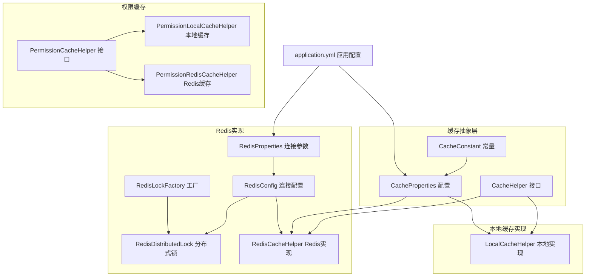
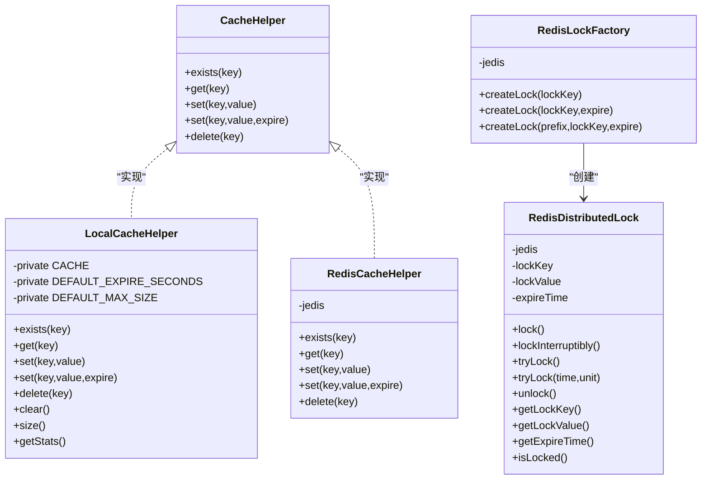
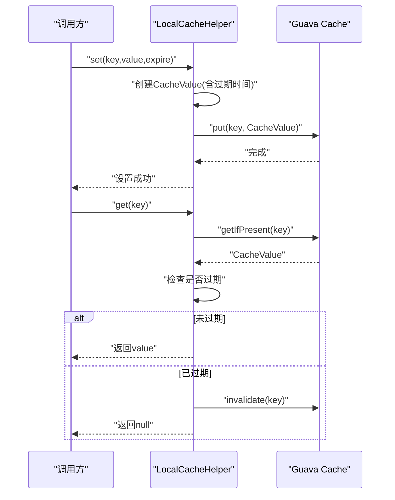
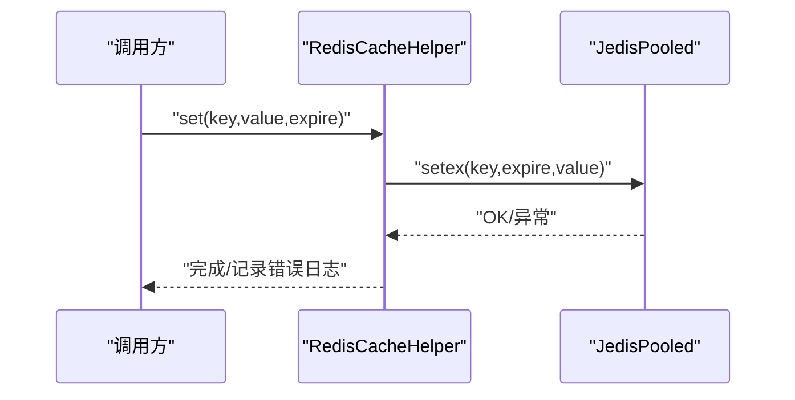
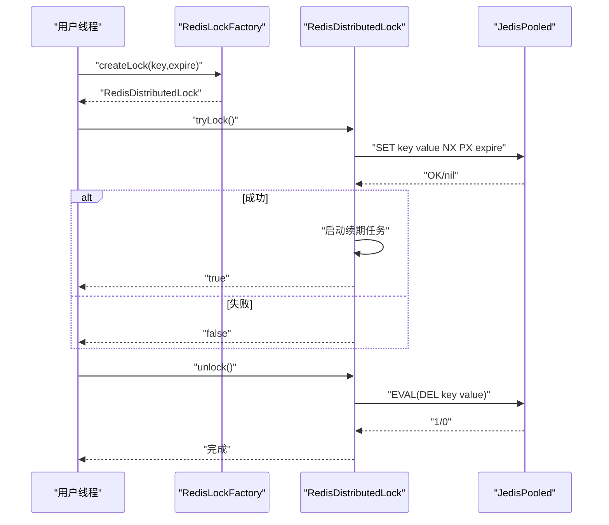
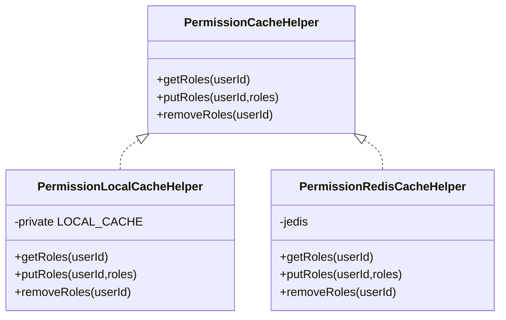
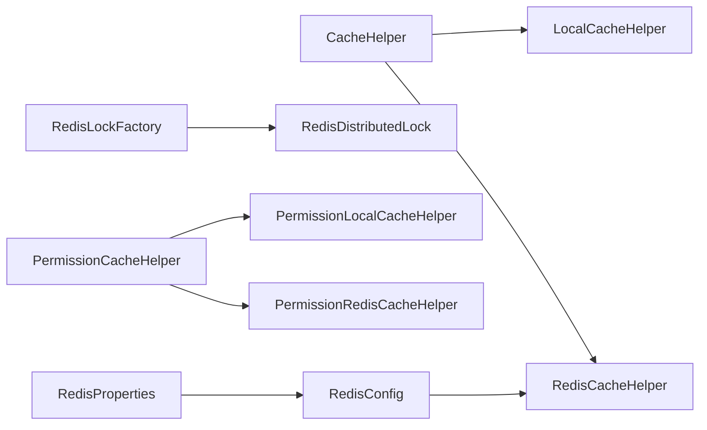

# 缓存管理系统

<cite>
**本文引用的文件**
- [src/main/java/com/dw/admin/components/cache/CacheHelper.java](file://src/main/java/com/dw/admin/components/cache/CacheHelper.java)
- [src/main/java/com/dw/admin/components/cache/LocalCacheHelper.java](file://src/main/java/com/dw/admin/components/cache/LocalCacheHelper.java)
- [src/main/java/com/dw/admin/components/cache/RedisCacheHelper.java](file://src/main/java/com/dw/admin/components/cache/RedisCacheHelper.java)
- [src/main/java/com/dw/admin/components/cache/CacheProperties.java](file://src/main/java/com/dw/admin/components/cache/CacheProperties.java)
- [src/main/java/com/dw/admin/components/cache/CacheConstant.java](file://src/main/java/com/dw/admin/components/cache/CacheConstant.java)
- [src/main/java/com/dw/admin/components/redis/RedisConfig.java](file://src/main/java/com/dw/admin/components/redis/RedisConfig.java)
- [src/main/java/com/dw/admin/components/redis/RedisProperties.java](file://src/main/java/com/dw/admin/components/redis/RedisProperties.java)
- [src/main/java/com/dw/admin/components/redis/RedisConstant.java](file://src/main/java/com/dw/admin/components/redis/RedisConstant.java)
- [src/main/java/com/dw/admin/components/redis/RedisDistributedLock.java](file://src/main/java/com/dw/admin/components/redis/RedisDistributedLock.java)
- [src/main/java/com/dw/admin/components/redis/RedisLockFactory.java](file://src/main/java/com/dw/admin/components/redis/RedisLockFactory.java)
- [src/main/java/com/dw/admin/components/permission/PermissionCacheHelper.java](file://src/main/java/com/dw/admin/components/permission/PermissionCacheHelper.java)
- [src/main/java/com/dw/admin/components/permission/PermissionRedisCacheHelper.java](file://src/main/java/com/dw/admin/components/permission/PermissionRedisCacheHelper.java)
- [src/main/java/com/dw/admin/components/permission/PermissionLocalCacheHelper.java](file://src/main/java/com/dw/admin/components/permission/PermissionLocalCacheHelper.java)
- [src/main/resources/application.yml](file://src/main/resources/application.yml)
- [src/test/java/com/dw/admin/test/redis/RedisDistributedLockTest.java](file://src/test/java/com/dw/admin/test/redis/RedisDistributedLockTest.java)
- [src/test/java/com/dw/admin/test/LocalCacheHelperTest.java](file://src/test/java/com/dw/admin/test/LocalCacheHelperTest.java)
</cite>

## 目录
1. [简介](#简介)
2. [项目结构](#项目结构)
3. [核心组件](#核心组件)
4. [架构总览](#架构总览)
5. [详细组件分析](#详细组件分析)
6. [依赖关系分析](#依赖关系分析)
7. [性能考量与调优](#性能考量与调优)
8. [故障排查指南](#故障排查指南)
9. [结论](#结论)
10. [附录](#附录)

## 简介
本技术文档围绕缓存抽象层与Redis、本地缓存实现展开，系统性阐述策略模式在缓存层的应用、分布式锁的实现原理与使用场景、缓存一致性与失效策略、配置参数与性能调优、命中率优化与内存管理建议，并提供针对缓存穿透、缓存雪崩等常见问题的解决方案与监控排障方法。文档同时给出不同缓存策略的适用场景与性能对比，面向系统架构师与运维人员提供完整的缓存管理指南。

## 项目结构
缓存相关代码主要分布在以下模块：
- 缓存抽象层：定义统一的缓存接口与通用配置常量
- 本地缓存实现：基于Google Guava Cache的高性能本地缓存
- Redis实现：基于Jedis的缓存实现与连接池配置
- 分布式锁：基于Redis的分布式锁实现与工厂
- 权限缓存：权限信息的本地与Redis缓存实现，展示策略模式在具体业务中的应用

**图表来源**
- [src/main/java/com/dw/admin/components/cache/CacheHelper.java](file://src/main/java/com/dw/admin/components/cache/CacheHelper.java#L1-L52)
- [src/main/java/com/dw/admin/components/cache/LocalCacheHelper.java](file://src/main/java/com/dw/admin/components/cache/LocalCacheHelper.java#L1-L286)
- [src/main/java/com/dw/admin/components/cache/CacheConstant.java](file://src/main/java/com/dw/admin/components/cache/CacheConstant.java#L1-L26)
- [src/main/java/com/dw/admin/components/cache/CacheProperties.java](file://src/main/java/com/dw/admin/components/cache/CacheProperties.java#L1-L29)
- [src/main/java/com/dw/admin/components/redis/RedisConfig.java](file://src/main/java/com/dw/admin/components/redis/RedisConfig.java#L1-L63)
- [src/main/java/com/dw/admin/components/redis/RedisProperties.java](file://src/main/java/com/dw/admin/components/redis/RedisProperties.java#L1-L40)
- [src/main/java/com/dw/admin/components/redis/RedisDistributedLock.java](file://src/main/java/com/dw/admin/components/redis/RedisDistributedLock.java#L1-L291)
- [src/main/java/com/dw/admin/components/redis/RedisLockFactory.java](file://src/main/java/com/dw/admin/components/redis/RedisLockFactory.java#L1-L61)
- [src/main/java/com/dw/admin/components/permission/PermissionCacheHelper.java](file://src/main/java/com/dw/admin/components/permission/PermissionCacheHelper.java#L1-L28)
- [src/main/java/com/dw/admin/components/permission/PermissionLocalCacheHelper.java](file://src/main/java/com/dw/admin/components/permission/PermissionLocalCacheHelper.java#L1-L71)
- [src/main/java/com/dw/admin/components/permission/PermissionRedisCacheHelper.java](file://src/main/java/com/dw/admin/components/permission/PermissionRedisCacheHelper.java#L1-L86)
- [src/main/resources/application.yml](file://src/main/resources/application.yml#L1-L64)

**章节来源**
- [src/main/java/com/dw/admin/components/cache/CacheHelper.java](file://src/main/java/com/dw/admin/components/cache/CacheHelper.java#L1-L52)
- [src/main/java/com/dw/admin/components/cache/LocalCacheHelper.java](file://src/main/java/com/dw/admin/components/cache/LocalCacheHelper.java#L1-L286)
- [src/main/java/com/dw/admin/components/cache/CacheProperties.java](file://src/main/java/com/dw/admin/components/cache/CacheProperties.java#L1-L29)
- [src/main/java/com/dw/admin/components/cache/CacheConstant.java](file://src/main/java/com/dw/admin/components/cache/CacheConstant.java#L1-L26)
- [src/main/java/com/dw/admin/components/redis/RedisConfig.java](file://src/main/java/com/dw/admin/components/redis/RedisConfig.java#L1-L63)
- [src/main/java/com/dw/admin/components/redis/RedisProperties.java](file://src/main/java/com/dw/admin/components/redis/RedisProperties.java#L1-L40)
- [src/main/java/com/dw/admin/components/redis/RedisDistributedLock.java](file://src/main/java/com/dw/admin/components/redis/RedisDistributedLock.java#L1-L291)
- [src/main/java/com/dw/admin/components/redis/RedisLockFactory.java](file://src/main/java/com/dw/admin/components/redis/RedisLockFactory.java#L1-L61)
- [src/main/java/com/dw/admin/components/permission/PermissionCacheHelper.java](file://src/main/java/com/dw/admin/components/permission/PermissionCacheHelper.java#L1-L28)
- [src/main/java/com/dw/admin/components/permission/PermissionLocalCacheHelper.java](file://src/main/java/com/dw/admin/components/permission/PermissionLocalCacheHelper.java#L1-L71)
- [src/main/java/com/dw/admin/components/permission/PermissionRedisCacheHelper.java](file://src/main/java/com/dw/admin/components/permission/PermissionRedisCacheHelper.java#L1-L86)
- [src/main/resources/application.yml](file://src/main/resources/application.yml#L1-L64)

## 核心组件
- 缓存抽象层
  - CacheHelper：定义统一的缓存能力（存在性检查、读取、写入、带过期写入、删除），便于替换实现
  - CacheProperties/CacheConstant：集中管理缓存开关与类型选择（local/redis）
- 本地缓存实现
  - LocalCacheHelper：基于Google Guava Cache的高性能本地缓存实现，支持线程安全并发访问、智能过期管理、缓存统计
- Redis实现
  - RedisCacheHelper：基于Jedis的Redis缓存实现，封装常用命令并进行异常日志记录
  - RedisConfig/RedisProperties：连接池与连接参数配置，支持密码、超时、最大连接数等
- 分布式锁
  - RedisDistributedLock：实现java.util.concurrent.locks.Lock接口，支持自动续期（看门狗）、Lua原子解锁/续期
  - RedisLockFactory：提供便捷的锁实例创建，支持默认过期时间与带业务前缀的key
- 权限缓存
  - PermissionCacheHelper：权限缓存接口
  - PermissionLocalCacheHelper：基于Guava Cache的本地缓存实现
  - PermissionRedisCacheHelper：基于Redis的权限缓存实现

**章节来源**
- [src/main/java/com/dw/admin/components/cache/CacheHelper.java](file://src/main/java/com/dw/admin/components/cache/CacheHelper.java#L1-L52)
- [src/main/java/com/dw/admin/components/cache/LocalCacheHelper.java](file://src/main/java/com/dw/admin/components/cache/LocalCacheHelper.java#L1-L286)
- [src/main/java/com/dw/admin/components/cache/CacheProperties.java](file://src/main/java/com/dw/admin/components/cache/CacheProperties.java#L1-L29)
- [src/main/java/com/dw/admin/components/cache/CacheConstant.java](file://src/main/java/com/dw/admin/components/cache/CacheConstant.java#L1-L26)
- [src/main/java/com/dw/admin/components/cache/RedisCacheHelper.java](file://src/main/java/com/dw/admin/components/cache/RedisCacheHelper.java#L1-L90)
- [src/main/java/com/dw/admin/components/redis/RedisConfig.java](file://src/main/java/com/dw/admin/components/redis/RedisConfig.java#L1-L63)
- [src/main/java/com/dw/admin/components/redis/RedisProperties.java](file://src/main/java/com/dw/admin/components/redis/RedisProperties.java#L1-L40)
- [src/main/java/com/dw/admin/components/redis/RedisDistributedLock.java](file://src/main/java/com/dw/admin/components/redis/RedisDistributedLock.java#L1-L291)
- [src/main/java/com/dw/admin/components/redis/RedisLockFactory.java](file://src/main/java/com/dw/admin/components/redis/RedisLockFactory.java#L1-L61)
- [src/main/java/com/dw/admin/components/permission/PermissionCacheHelper.java](file://src/main/java/com/dw/admin/components/permission/PermissionCacheHelper.java#L1-L28)
- [src/main/java/com/dw/admin/components/permission/PermissionLocalCacheHelper.java](file://src/main/java/com/dw/admin/components/permission/PermissionLocalCacheHelper.java#L1-L71)
- [src/main/java/com/dw/admin/components/permission/PermissionRedisCacheHelper.java](file://src/main/java/com/dw/admin/components/permission/PermissionRedisCacheHelper.java#L1-L86)

## 架构总览
下图展示了缓存抽象层与本地缓存、Redis实现之间的策略模式关系，以及分布式锁与工厂的关系：

**图表来源**
- [src/main/java/com/dw/admin/components/cache/CacheHelper.java](file://src/main/java/com/dw/admin/components/cache/CacheHelper.java#L1-L52)
- [src/main/java/com/dw/admin/components/cache/LocalCacheHelper.java](file://src/main/java/com/dw/admin/components/cache/LocalCacheHelper.java#L79-L286)
- [src/main/java/com/dw/admin/components/cache/RedisCacheHelper.java](file://src/main/java/com/dw/admin/components/cache/RedisCacheHelper.java#L1-L90)
- [src/main/java/com/dw/admin/components/redis/RedisDistributedLock.java](file://src/main/java/com/dw/admin/components/redis/RedisDistributedLock.java#L1-L291)
- [src/main/java/com/dw/admin/components/redis/RedisLockFactory.java](file://src/main/java/com/dw/admin/components/redis/RedisLockFactory.java#L1-L61)

## 详细组件分析

### 缓存抽象层与策略模式
- 设计理念
  - 通过接口隔离具体实现细节，允许在运行时根据配置切换缓存实现（本地/Redis）
  - 降低上层对底层存储的耦合度，便于扩展其他实现（如本地Map、数据库、文件系统等）
- 关键点
  - CacheHelper提供统一的API，包括存在性检查、读取、写入、带过期写入、删除
  - CacheProperties与CacheConstant集中管理开关与类型，结合Spring条件化注解按需装配
- 适用场景
  - 开发阶段优先使用本地缓存提升开发效率；生产环境切换为Redis以获得共享与持久化能力

**章节来源**
- [src/main/java/com/dw/admin/components/cache/CacheHelper.java](file://src/main/java/com/dw/admin/components/cache/CacheHelper.java#L1-L52)
- [src/main/java/com/dw/admin/components/cache/CacheProperties.java](file://src/main/java/com/dw/admin/components/cache/CacheProperties.java#L1-L29)
- [src/main/java/com/dw/admin/components/cache/CacheConstant.java](file://src/main/java/com/dw/admin/components/cache/CacheConstant.java#L1-L26)

### 本地缓存实现（LocalCacheHelper）
- 实现原理
  - 基于Google Guava Cache实现，提供高性能的本地缓存功能
  - 支持线程安全并发访问，内部使用原子操作保证数据一致性
  - 实现自定义过期管理，通过CacheValue包装类存储值和过期时间戳
  - 内置缓存统计功能，支持命中率、加载时间等统计信息
- 核心特性
  - 默认最大容量10000条目，支持LRU淘汰策略
  - 默认过期时间为3600秒（1小时），支持自定义过期时间
  - 提供exists/get/set/delete/clear/size/getStats等完整API
  - 自动清理过期数据，无需手动维护
- 使用场景
  - 单机应用的高性能缓存需求
  - 开发和测试环境的快速缓存方案
  - 低延迟要求的本地数据缓存

**图表来源**
- [src/main/java/com/dw/admin/components/cache/LocalCacheHelper.java](file://src/main/java/com/dw/admin/components/cache/LocalCacheHelper.java#L138-L180)
- [src/main/java/com/dw/admin/components/cache/LocalCacheHelper.java](file://src/main/java/com/dw/admin/components/cache/LocalCacheHelper.java#L210-L222)

**章节来源**
- [src/main/java/com/dw/admin/components/cache/LocalCacheHelper.java](file://src/main/java/com/dw/admin/components/cache/LocalCacheHelper.java#L1-L286)
- [src/test/java/com/dw/admin/test/LocalCacheHelperTest.java](file://src/test/java/com/dw/admin/test/LocalCacheHelperTest.java#L1-L256)

### Redis缓存实现
- 配置与连接
  - RedisConfig基于RedisProperties构建JedisPooled，支持密码认证、超时、连接池参数
  - application.yml中提供基础Redis连接参数示例
- 缓存操作
  - RedisCacheHelper封装了exists/get/set/setex/del等常用命令，并对异常进行日志记录
  - 支持带过期时间的写入，便于控制缓存生命周期
- 使用建议
  - 在高并发场景下，优先使用带过期时间的写入，避免缓存无限增长
  - 对热点数据设置合理的TTL，结合业务峰值流量评估过期时间

**图表来源**
- [src/main/java/com/dw/admin/components/cache/RedisCacheHelper.java](file://src/main/java/com/dw/admin/components/cache/RedisCacheHelper.java#L65-L75)
- [src/main/java/com/dw/admin/components/redis/RedisConfig.java](file://src/main/java/com/dw/admin/components/redis/RedisConfig.java#L31-L61)

**章节来源**
- [src/main/java/com/dw/admin/components/cache/RedisCacheHelper.java](file://src/main/java/com/dw/admin/components/cache/RedisCacheHelper.java#L1-L90)
- [src/main/java/com/dw/admin/components/redis/RedisConfig.java](file://src/main/java/com/dw/admin/components/redis/RedisConfig.java#L1-L63)
- [src/main/java/com/dw/admin/components/redis/RedisProperties.java](file://src/main/java/com/dw/admin/components/redis/RedisProperties.java#L1-L40)
- [src/main/resources/application.yml](file://src/main/resources/application.yml#L37-L39)

### 分布式锁实现与工厂
- 实现原理
  - 基于SET命令的NX+PX参数实现原子加锁
  - 使用Lua脚本原子性续期与解锁，避免竞态条件
  - 提供自动续期（看门狗）线程池，按过期时间的1/3周期续期
  - 不支持Condition机制，简化分布式场景下的复杂性
- 工厂与使用
  - RedisLockFactory提供三种创建方式：默认过期时间、指定过期时间、带业务前缀
  - 支持阻塞/可中断/带超时的获取锁方式，满足不同业务需求
- 应用场景
  - 并发写入同一资源的互斥控制（如库存扣减、订单幂等）
  - 分布式定时任务的互斥执行
  - 读多写少场景下的热点数据更新串行化

**图表来源**
- [src/main/java/com/dw/admin/components/redis/RedisLockFactory.java](file://src/main/java/com/dw/admin/components/redis/RedisLockFactory.java#L33-L59)
- [src/main/java/com/dw/admin/components/redis/RedisDistributedLock.java](file://src/main/java/com/dw/admin/components/redis/RedisDistributedLock.java#L118-L140)
- [src/main/java/com/dw/admin/components/redis/RedisDistributedLock.java](file://src/main/java/com/dw/admin/components/redis/RedisDistributedLock.java#L228-L250)

**章节来源**
- [src/main/java/com/dw/admin/components/redis/RedisDistributedLock.java](file://src/main/java/com/dw/admin/components/redis/RedisDistributedLock.java#L1-L291)
- [src/main/java/com/dw/admin/components/redis/RedisLockFactory.java](file://src/main/java/com/dw/admin/components/redis/RedisLockFactory.java#L1-L61)
- [src/test/java/com/dw/admin/test/redis/RedisDistributedLockTest.java](file://src/test/java/com/dw/admin/test/redis/RedisDistributedLockTest.java#L1-L312)

### 权限缓存策略（本地与Redis）
- 设计要点
  - 通过PermissionCacheHelper接口抽象，分别提供本地与Redis两种实现
  - 本地实现基于Guava Cache，具备容量限制与过期策略
  - Redis实现序列化列表并设置TTL，适合跨节点共享
- 一致性与失效
  - 写入/删除时同步更新本地与Redis缓存，保证一致性
  - TTL到期后自动失效，避免脏读

**图表来源**
- [src/main/java/com/dw/admin/components/permission/PermissionCacheHelper.java](file://src/main/java/com/dw/admin/components/permission/PermissionCacheHelper.java#L1-L28)
- [src/main/java/com/dw/admin/components/permission/PermissionLocalCacheHelper.java](file://src/main/java/com/dw/admin/components/permission/PermissionLocalCacheHelper.java#L1-L71)
- [src/main/java/com/dw/admin/components/permission/PermissionRedisCacheHelper.java](file://src/main/java/com/dw/admin/components/permission/PermissionRedisCacheHelper.java#L1-L86)

**章节来源**
- [src/main/java/com/dw/admin/components/permission/PermissionCacheHelper.java](file://src/main/java/com/dw/admin/components/permission/PermissionCacheHelper.java#L1-L28)
- [src/main/java/com/dw/admin/components/permission/PermissionLocalCacheHelper.java](file://src/main/java/com/dw/admin/components/permission/PermissionLocalCacheHelper.java#L1-L71)
- [src/main/java/com/dw/admin/components/permission/PermissionRedisCacheHelper.java](file://src/main/java/com/dw/admin/components/permission/PermissionRedisCacheHelper.java#L1-L86)

### 缓存一致性策略与失效机制
- 一致性策略
  - 写路径：先写数据库，再写缓存；或先写缓存，再异步更新数据库（需幂等）
  - 读路径：优先读缓存，未命中则回源数据库并回填缓存
- 失效机制
  - 显式删除：在写操作后主动删除对应key
  - 过期时间：通过TTL控制缓存生命周期
  - 本地缓存：利用Guava Cache的容量与过期策略自动淘汰
- 与分布式锁配合
  - 对热点key的更新使用分布式锁串行化，避免"惊群效应"与脏写

**章节来源**
- [src/main/java/com/dw/admin/components/permission/PermissionRedisCacheHelper.java](file://src/main/java/com/dw/admin/components/permission/PermissionRedisCacheHelper.java#L50-L73)
- [src/main/java/com/dw/admin/components/permission/PermissionLocalCacheHelper.java](file://src/main/java/com/dw/admin/components/permission/PermissionLocalCacheHelper.java#L48-L68)
- [src/main/java/com/dw/admin/components/redis/RedisDistributedLock.java](file://src/main/java/com/dw/admin/components/redis/RedisDistributedLock.java#L118-L140)

### 缓存配置参数与性能调优
- 缓存层配置
  - dwa.cache.enable：是否启用缓存
  - dwa.cache.type：缓存类型（local/redis）
- 本地缓存配置
  - dwa.cache.local.max-size：本地缓存最大容量，默认10000
  - dwa.cache.local.default-expire-seconds：默认过期时间（秒），默认3600
- Redis连接配置
  - dwa.redis.url/password：连接地址与密码
  - 连接池参数：maxTotal/maxIdle/minIdle/maxWaitMillis/timeout
- 性能调优建议
  - 连接池：根据QPS与RT调整maxTotal与maxWaitMillis，避免排队与连接不足
  - 超时：合理设置timeout，避免长阻塞导致线程池耗尽
  - 过期时间：热点数据短TTL+预热，非热点长TTL+随机抖动
  - 批量操作：批量读写减少网络往返

**章节来源**
- [src/main/java/com/dw/admin/components/cache/CacheProperties.java](file://src/main/java/com/dw/admin/components/cache/CacheProperties.java#L1-L29)
- [src/main/java/com/dw/admin/components/cache/CacheConstant.java](file://src/main/java/com/dw/admin/components/cache/CacheConstant.java#L1-L26)
- [src/main/java/com/dw/admin/components/redis/RedisProperties.java](file://src/main/java/com/dw/admin/components/redis/RedisProperties.java#L1-L40)
- [src/main/resources/application.yml](file://src/main/resources/application.yml#L37-L39)

### 缓存命中率优化与内存管理
- 命中率优化
  - 热点识别与预加载：对高频访问key提前写入缓存
  - 多级缓存：本地+Redis双缓存，减少跨进程/跨机房访问
  - 数据分片与命名规范：避免key碰撞与热点集中
- 内存管理
  - 本地缓存：设置合理容量与过期策略，结合并发级别
  - Redis：合理设置maxmemory与淘汰策略，避免内存溢出
  - 定期巡检：监控key数量、内存使用、过期key比例
- 缓存统计
  - 本地缓存支持CacheStats统计，可获取命中率、加载时间等指标
  - Redis支持INFO命令获取内存和连接统计信息

**章节来源**
- [src/main/java/com/dw/admin/components/cache/LocalCacheHelper.java](file://src/main/java/com/dw/admin/components/cache/LocalCacheHelper.java#L281-L283)
- [src/main/java/com/dw/admin/components/permission/PermissionLocalCacheHelper.java](file://src/main/java/com/dw/admin/components/permission/PermissionLocalCacheHelper.java#L41-L46)
- [src/main/java/com/dw/admin/components/redis/RedisProperties.java](file://src/main/java/com/dw/admin/components/redis/RedisProperties.java#L28-L36)

### 常见问题与解决方案
- 缓存穿透
  - 现象：查询不存在的数据，缓存未命中且直接打到DB
  - 方案：缓存空对象并设置短TTL；布隆过滤器提前拦截
- 缓存击穿
  - 现象：热点key过期瞬间大量请求打到DB
  - 方案：热点key永不过期或单flight保护；分布式锁串行化更新
- 缓存雪崩
  - 现象：大量key同时过期，瞬时DB压力过大
  - 方案：TTL增加随机抖动；多级缓存；限流与熔断
- 本地缓存内存溢出
  - 现象：本地缓存达到最大容量限制
  - 方案：调整max-size配置，监控缓存使用情况，定期清理无效数据

**章节来源**
- [src/main/java/com/dw/admin/components/redis/RedisDistributedLock.java](file://src/main/java/com/dw/admin/components/redis/RedisDistributedLock.java#L118-L140)
- [src/main/java/com/dw/admin/components/permission/PermissionRedisCacheHelper.java](file://src/main/java/com/dw/admin/components/permission/PermissionRedisCacheHelper.java#L50-L73)
- [src/main/java/com/dw/admin/components/cache/LocalCacheHelper.java](file://src/main/java/com/dw/admin/components/cache/LocalCacheHelper.java#L122-L126)

### 监控与故障排查
- 监控指标
  - 缓存命中率、请求延迟、连接池使用率、过期key比例
  - 本地缓存统计：命中率、加载时间、淘汰次数
- 故障排查
  - Redis连接异常：检查url/password/超时与连接池配置
  - 分布式锁异常：确认Lua脚本可用、续期线程池健康、锁key格式一致
  - 本地缓存异常：检查max-size配置、过期时间设置、缓存统计信息
  - 单元测试参考：通过LocalCacheHelperTest和RedisDistributedLockTest验证功能

**章节来源**
- [src/test/java/com/dw/admin/test/LocalCacheHelperTest.java](file://src/test/java/com/dw/admin/test/LocalCacheHelperTest.java#L1-L256)
- [src/test/java/com/dw/admin/test/redis/RedisDistributedLockTest.java](file://src/test/java/com/dw/admin/test/redis/RedisDistributedLockTest.java#L1-L312)
- [src/main/java/com/dw/admin/components/redis/RedisConfig.java](file://src/main/java/com/dw/admin/components/redis/RedisConfig.java#L48-L61)

## 依赖关系分析
- 组件耦合
  - CacheHelper与LocalCacheHelper、RedisCacheHelper体现策略模式，上层仅依赖接口
  - RedisDistributedLock与RedisLockFactory通过工厂解耦创建逻辑
  - 权限缓存通过接口抽象，本地与Redis实现可独立演进
- 外部依赖
  - Jedis客户端、Google Guava Cache、Spring Boot条件化装配
- 循环依赖
  - 当前结构无循环依赖，职责清晰

**图表来源**
- [src/main/java/com/dw/admin/components/cache/CacheHelper.java](file://src/main/java/com/dw/admin/components/cache/CacheHelper.java#L1-L52)
- [src/main/java/com/dw/admin/components/cache/LocalCacheHelper.java](file://src/main/java/com/dw/admin/components/cache/LocalCacheHelper.java#L79-L286)
- [src/main/java/com/dw/admin/components/cache/RedisCacheHelper.java](file://src/main/java/com/dw/admin/components/cache/RedisCacheHelper.java#L1-L90)
- [src/main/java/com/dw/admin/components/redis/RedisLockFactory.java](file://src/main/java/com/dw/admin/components/redis/RedisLockFactory.java#L1-L61)
- [src/main/java/com/dw/admin/components/redis/RedisDistributedLock.java](file://src/main/java/com/dw/admin/components/redis/RedisDistributedLock.java#L1-L291)
- [src/main/java/com/dw/admin/components/permission/PermissionCacheHelper.java](file://src/main/java/com/dw/admin/components/permission/PermissionCacheHelper.java#L1-L28)
- [src/main/java/com/dw/admin/components/permission/PermissionLocalCacheHelper.java](file://src/main/java/com/dw/admin/components/permission/PermissionLocalCacheHelper.java#L1-L71)
- [src/main/java/com/dw/admin/components/permission/PermissionRedisCacheHelper.java](file://src/main/java/com/dw/admin/components/permission/PermissionRedisCacheHelper.java#L1-L86)
- [src/main/java/com/dw/admin/components/redis/RedisConfig.java](file://src/main/java/com/dw/admin/components/redis/RedisConfig.java#L1-L63)
- [src/main/java/com/dw/admin/components/redis/RedisProperties.java](file://src/main/java/com/dw/admin/components/redis/RedisProperties.java#L1-L40)

## 性能考量与调优
- 连接池与超时
  - 根据峰值QPS与RT调整maxTotal与maxWaitMillis，避免排队
  - 设置合理timeout，防止阻塞线程过多
- 缓存策略
  - 热点key短TTL+预热；非热点长TTL+随机抖动
  - 本地+Redis双缓存，减少跨机房访问
  - 本地缓存合理设置max-size，避免内存溢出
- 分布式锁
  - 续期周期为过期时间的1/3，避免频繁续期与锁丢失
  - 使用Lua脚本保证原子性，降低竞争成本
- 缓存统计
  - 利用LocalCacheHelper.getStats()获取命中率等关键指标
  - 定期监控缓存性能，及时调整配置参数

**章节来源**
- [src/main/java/com/dw/admin/components/redis/RedisProperties.java](file://src/main/java/com/dw/admin/components/redis/RedisProperties.java#L28-L36)
- [src/main/java/com/dw/admin/components/redis/RedisDistributedLock.java](file://src/main/java/com/dw/admin/components/redis/RedisDistributedLock.java#L146-L158)
- [src/main/java/com/dw/admin/components/cache/LocalCacheHelper.java](file://src/main/java/com/dw/admin/components/cache/LocalCacheHelper.java#L281-L283)

## 故障排查指南
- Redis连接失败
  - 检查dwa.redis.url与密码配置
  - 查看连接池参数与超时设置
- 分布式锁无法释放
  - 确认解锁使用相同value，Lua脚本返回值
  - 观察续期任务是否仍在运行
- 本地缓存异常
  - 检查dwa.cache.local.max-size与dwa.cache.local.default-expire-seconds配置
  - 查看缓存统计信息，确认命中率是否正常
  - 监控内存使用情况，避免缓存溢出
- 单元测试验证
  - 参考LocalCacheHelperTest和RedisDistributedLockTest覆盖加锁/解锁/续期/超时/中断等场景

**章节来源**
- [src/test/java/com/dw/admin/test/LocalCacheHelperTest.java](file://src/test/java/com/dw/admin/test/LocalCacheHelperTest.java#L1-L256)
- [src/test/java/com/dw/admin/test/redis/RedisDistributedLockTest.java](file://src/test/java/com/dw/admin/test/redis/RedisDistributedLockTest.java#L43-L107)
- [src/test/java/com/dw/admin/test/redis/RedisDistributedLockTest.java](file://src/test/java/com/dw/admin/test/redis/RedisDistributedLockTest.java#L182-L216)

## 结论
本缓存系统通过策略模式实现了缓存抽象层与本地缓存、Redis实现的解耦，结合本地缓存与Redis缓存满足不同场景需求。新增的LocalCacheHelper基于Google Guava Cache提供高性能的本地缓存功能，支持线程安全并发访问、智能过期管理、缓存统计等功能，与Redis实现形成互补。分布式锁提供可靠的互斥控制能力，配合Lua脚本与自动续期机制保障高并发下的稳定性。通过合理的配置参数与性能调优策略，可在命中率、延迟与资源利用率之间取得平衡。针对缓存穿透、击穿与雪崩等常见问题，提供了系统性的解决方案与监控排障方法，适用于生产环境的长期稳定运行。

## 附录
- 配置项速查
  - dwa.cache.enable：缓存开关
  - dwa.cache.type：缓存类型（local/redis）
  - dwa.cache.local.max-size：本地缓存最大容量（默认10000）
  - dwa.cache.local.default-expire-seconds：本地缓存默认过期时间（默认3600秒）
  - dwa.redis.url/password：Redis连接信息
  - dwa.redis.maxTotal/maxIdle/minIdle/maxWaitMillis/timeout：连接池参数

**章节来源**
- [src/main/java/com/dw/admin/components/cache/CacheProperties.java](file://src/main/java/com/dw/admin/components/cache/CacheProperties.java#L21-L25)
- [src/main/java/com/dw/admin/components/cache/CacheConstant.java](file://src/main/java/com/dw/admin/components/cache/CacheConstant.java#L13-L15)
- [src/main/java/com/dw/admin/components/cache/LocalCacheHelper.java](file://src/main/java/com/dw/admin/components/cache/LocalCacheHelper.java#L54-L57)
- [src/main/java/com/dw/admin/components/redis/RedisConstant.java](file://src/main/java/com/dw/admin/components/redis/RedisConstant.java#L13-L18)
- [src/main/java/com/dw/admin/components/redis/RedisProperties.java](file://src/main/java/com/dw/admin/components/redis/RedisProperties.java#L19-L36)
- [src/main/resources/application.yml](file://src/main/resources/application.yml#L37-L39)