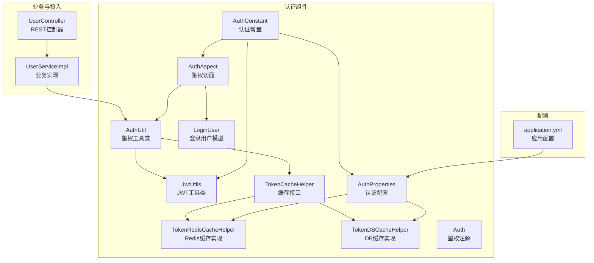
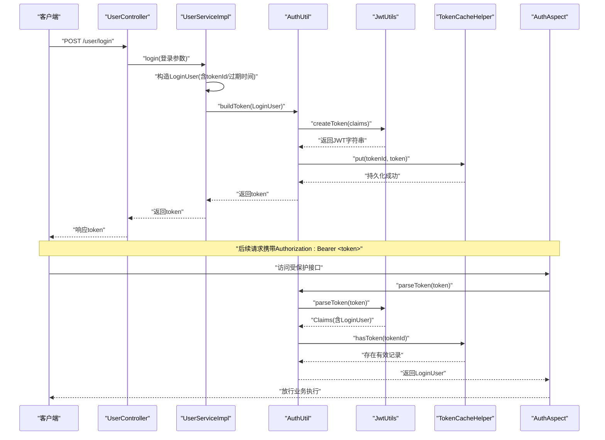
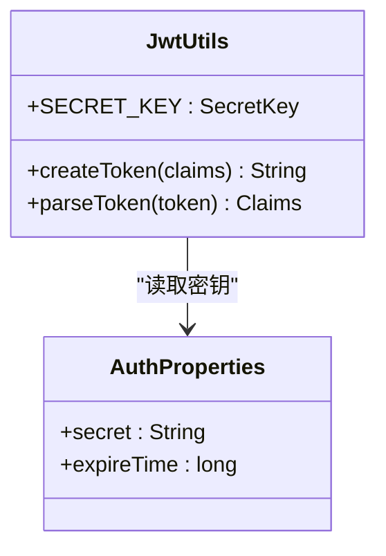
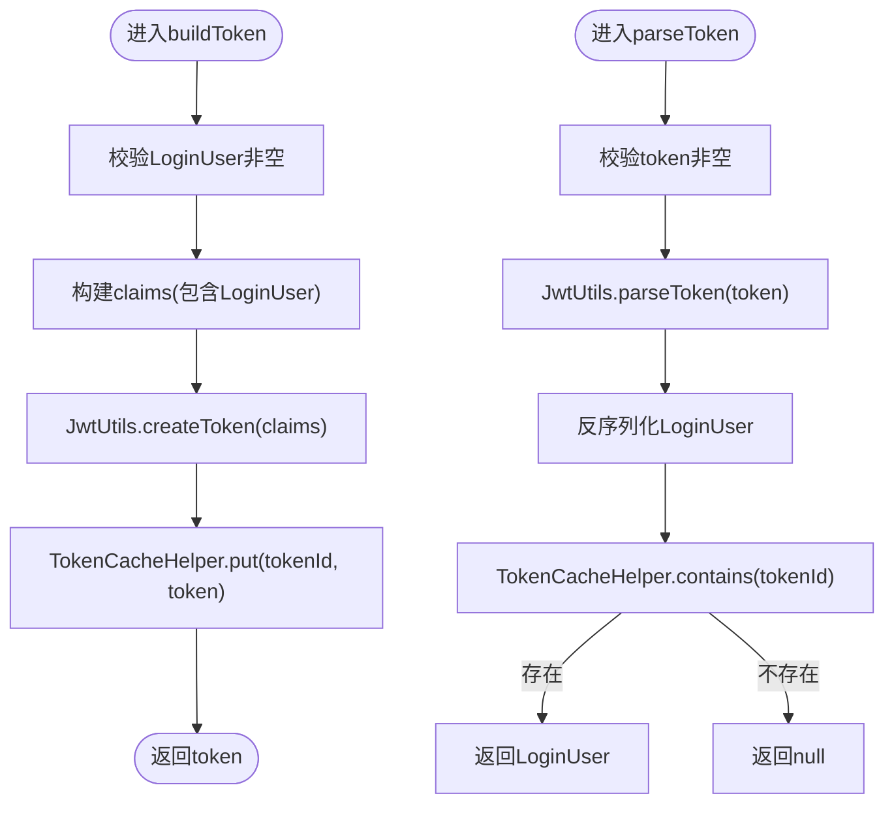
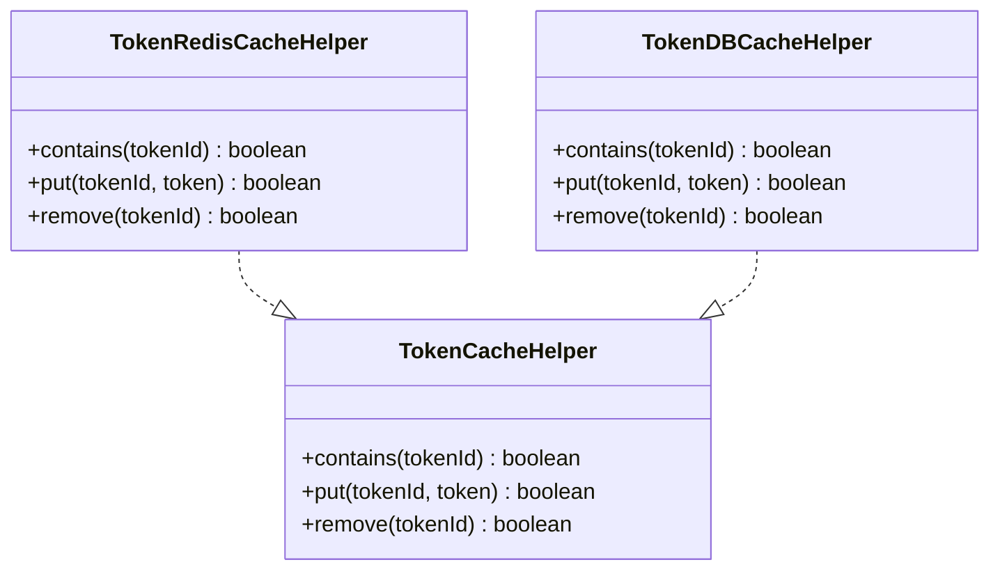
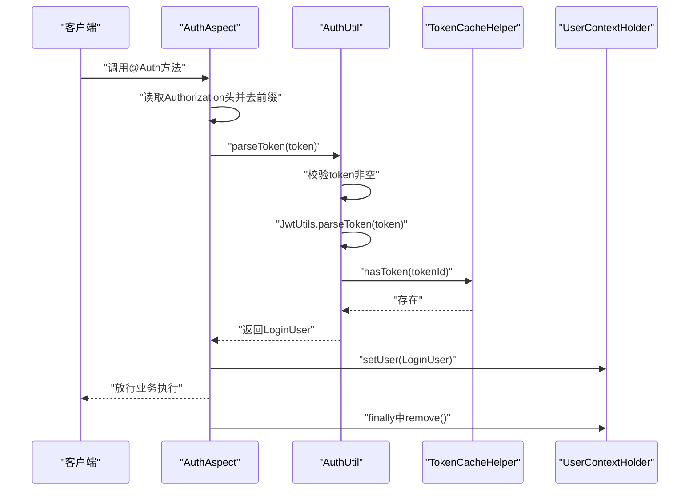
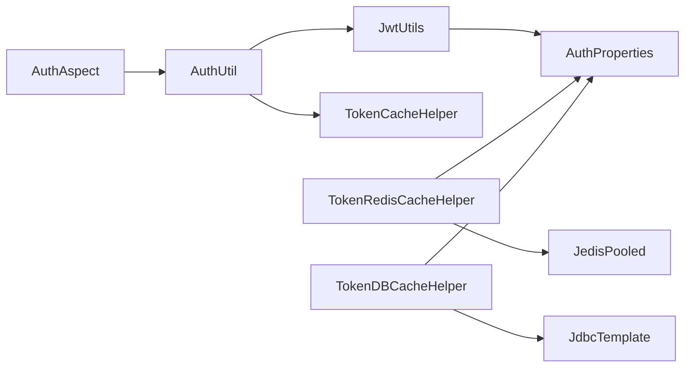

# JWT认证机制

<cite>
**本文引用的文件**
- [JwtUtils.java](file://src/main/java/com/dw/admin/components/auth/JwtUtils.java)
- [AuthUtil.java](file://src/main/java/com/dw/admin/components/auth/AuthUtil.java)
- [LoginUser.java](file://src/main/java/com/dw/admin/components/auth/LoginUser.java)
- [AuthConstant.java](file://src/main/java/com/dw/admin/components/auth/AuthConstant.java)
- [AuthProperties.java](file://src/main/java/com/dw/admin/components/auth/AuthProperties.java)
- [TokenCacheHelper.java](file://src/main/java/com/dw/admin/components/auth/TokenCacheHelper.java)
- [TokenRedisCacheHelper.java](file://src/main/java/com/dw/admin/components/auth/TokenRedisCacheHelper.java)
- [TokenDBCacheHelper.java](file://src/main/java/com/dw/admin/components/auth/TokenDBCacheHelper.java)
- [AuthAspect.java](file://src/main/java/com/dw/admin/components/auth/AuthAspect.java)
- [application.yml](file://src/main/resources/application.yml)
- [UserServiceImpl.java](file://src/main/java/com/dw/admin/service/impl/UserServiceImpl.java)
- [UserController.java](file://src/main/java/com/dw/admin/controller/UserController.java)
- [Auth.java](file://src/main/java/com/dw/admin/components/auth/Auth.java)
</cite>

## 目录
1. [引言](#引言)
2. [项目结构](#项目结构)
3. [核心组件](#核心组件)
4. [架构总览](#架构总览)
5. [组件详解](#组件详解)
6. [依赖关系分析](#依赖关系分析)
7. [性能考量](#性能考量)
8. [故障排除指南](#故障排除指南)
9. [结论](#结论)
10. [附录](#附录)

## 引言
本文件围绕项目中的JWT认证机制进行系统化技术说明，涵盖JWT工作原理与安全特性、工具类实现细节、Token生命周期管理、与传统会话认证的差异、安全最佳实践以及调试与排障建议。读者可据此理解并安全地扩展或维护该认证体系。

## 项目结构
本项目的认证模块位于组件层，采用“工具类 + 切面 + 缓存策略”的分层设计：
- 工具层：负责JWT生成与解析（JwtUtils）、业务封装（AuthUtil）
- 模型层：登录用户上下文载体（LoginUser）
- 配置层：认证常量与属性（AuthConstant、AuthProperties）
- 缓存层：Token持久化与校验（TokenCacheHelper接口及Redis/DB两种实现）
- 接入层：基于注解的鉴权切面（AuthAspect），拦截受保护接口
- 配置文件：应用启动时加载认证相关配置（application.yml）

图表来源
- [JwtUtils.java](file://src/main/java/com/dw/admin/components/auth/JwtUtils.java#L1-L55)
- [AuthUtil.java](file://src/main/java/com/dw/admin/components/auth/AuthUtil.java#L1-L101)
- [LoginUser.java](file://src/main/java/com/dw/admin/components/auth/LoginUser.java#L1-L48)
- [AuthConstant.java](file://src/main/java/com/dw/admin/components/auth/AuthConstant.java#L1-L51)
- [AuthProperties.java](file://src/main/java/com/dw/admin/components/auth/AuthProperties.java#L1-L36)
- [TokenCacheHelper.java](file://src/main/java/com/dw/admin/components/auth/TokenCacheHelper.java#L1-L26)
- [TokenRedisCacheHelper.java](file://src/main/java/com/dw/admin/components/auth/TokenRedisCacheHelper.java#L1-L155)
- [TokenDBCacheHelper.java](file://src/main/java/com/dw/admin/components/auth/TokenDBCacheHelper.java#L1-L259)
- [AuthAspect.java](file://src/main/java/com/dw/admin/components/auth/AuthAspect.java#L1-L62)
- [application.yml](file://src/main/resources/application.yml#L33-L37)

章节来源
- [JwtUtils.java](file://src/main/java/com/dw/admin/components/auth/JwtUtils.java#L1-L55)
- [AuthUtil.java](file://src/main/java/com/dw/admin/components/auth/AuthUtil.java#L1-L101)
- [LoginUser.java](file://src/main/java/com/dw/admin/components/auth/LoginUser.java#L1-L48)
- [AuthConstant.java](file://src/main/java/com/dw/admin/components/auth/AuthConstant.java#L1-L51)
- [AuthProperties.java](file://src/main/java/com/dw/admin/components/auth/AuthProperties.java#L1-L36)
- [TokenCacheHelper.java](file://src/main/java/com/dw/admin/components/auth/TokenCacheHelper.java#L1-L26)
- [TokenRedisCacheHelper.java](file://src/main/java/com/dw/admin/components/auth/TokenRedisCacheHelper.java#L1-L155)
- [TokenDBCacheHelper.java](file://src/main/java/com/dw/admin/components/auth/TokenDBCacheHelper.java#L1-L259)
- [AuthAspect.java](file://src/main/java/com/dw/admin/components/auth/AuthAspect.java#L1-L62)
- [application.yml](file://src/main/resources/application.yml#L33-L37)

## 核心组件
- JWT工具类（JwtUtils）：封装密钥初始化、Token生成、Token解析（签名验证与载荷提取）
- 鉴权工具类（AuthUtil）：将LoginUser序列化为Claims，调用JwtUtils生成Token，并通过TokenCacheHelper进行持久化与校验
- 登录用户模型（LoginUser）：承载tokenId、userId、username、email、loginTime、expireTime、ipAddr等上下文信息
- 认证常量与配置（AuthConstant、AuthProperties）：定义默认密钥、默认过期时间、缓存类型、Redis键前缀、配置前缀等；通过Spring Boot配置注入
- 缓存策略（TokenCacheHelper及其Redis/DB实现）：提供contains/put/remove能力，支持本地Guava缓存+远程Redis或DB双写双查
- 鉴权切面（AuthAspect）：从请求头读取Token，去除前缀后交由AuthUtil解析，成功则将LoginUser放入线程上下文，失败抛出业务异常
- 控制器与注解（UserController、Auth）：受保护接口标注@Auth，配合切面完成统一鉴权

章节来源
- [JwtUtils.java](file://src/main/java/com/dw/admin/components/auth/JwtUtils.java#L18-L55)
- [AuthUtil.java](file://src/main/java/com/dw/admin/components/auth/AuthUtil.java#L17-L101)
- [LoginUser.java](file://src/main/java/com/dw/admin/components/auth/LoginUser.java#L21-L48)
- [AuthConstant.java](file://src/main/java/com/dw/admin/components/auth/AuthConstant.java#L8-L51)
- [AuthProperties.java](file://src/main/java/com/dw/admin/components/auth/AuthProperties.java#L15-L36)
- [TokenCacheHelper.java](file://src/main/java/com/dw/admin/components/auth/TokenCacheHelper.java#L8-L26)
- [TokenRedisCacheHelper.java](file://src/main/java/com/dw/admin/components/auth/TokenRedisCacheHelper.java#L28-L155)
- [TokenDBCacheHelper.java](file://src/main/java/com/dw/admin/components/auth/TokenDBCacheHelper.java#L36-L259)
- [AuthAspect.java](file://src/main/java/com/dw/admin/components/auth/AuthAspect.java#L26-L62)
- [Auth.java](file://src/main/java/com/dw/admin/components/auth/Auth.java#L11-L16)

## 架构总览
下图展示一次登录流程与后续请求的鉴权路径，体现JWT生成、持久化与校验的关键步骤。

图表来源
- [UserController.java](file://src/main/java/com/dw/admin/controller/UserController.java#L50-L54)
- [UserServiceImpl.java](file://src/main/java/com/dw/admin/service/impl/UserServiceImpl.java#L77-L108)
- [AuthUtil.java](file://src/main/java/com/dw/admin/components/auth/AuthUtil.java#L32-L55)
- [JwtUtils.java](file://src/main/java/com/dw/admin/components/auth/JwtUtils.java#L38-L51)
- [TokenCacheHelper.java](file://src/main/java/com/dw/admin/components/auth/TokenCacheHelper.java#L8-L26)
- [AuthAspect.java](file://src/main/java/com/dw/admin/components/auth/AuthAspect.java#L32-L59)

## 组件详解

### JWT工具类（JwtUtils）
- 密钥初始化：从Spring上下文获取AuthProperties，读取secret并转换为对称密钥；若未配置则抛出运行时异常
- Token生成：以Map形式的claims作为载荷，使用对称密钥进行签名并紧凑编码
- Token解析：对签名进行验证，解析出Claims载荷

图表来源
- [JwtUtils.java](file://src/main/java/com/dw/admin/components/auth/JwtUtils.java#L18-L55)
- [AuthProperties.java](file://src/main/java/com/dw/admin/components/auth/AuthProperties.java#L18-L36)

章节来源
- [JwtUtils.java](file://src/main/java/com/dw/admin/components/auth/JwtUtils.java#L18-L55)

### 鉴权工具类（AuthUtil）
- 生成Token：将LoginUser序列化为JSON字符串放入claims，调用JwtUtils生成JWT，随后通过TokenCacheHelper持久化
- 解析Token：先校验空值，再调用JwtUtils解析得到Claims，反序列化为LoginUser；同时检查缓存中是否存在对应tokenId，确保Token未被撤销
- 缓存操作：封装contains/put/remove，屏蔽具体实现差异

图表来源
- [AuthUtil.java](file://src/main/java/com/dw/admin/components/auth/AuthUtil.java#L32-L98)
- [JwtUtils.java](file://src/main/java/com/dw/admin/components/auth/JwtUtils.java#L38-L51)
- [TokenCacheHelper.java](file://src/main/java/com/dw/admin/components/auth/TokenCacheHelper.java#L8-L26)

章节来源
- [AuthUtil.java](file://src/main/java/com/dw/admin/components/auth/AuthUtil.java#L17-L101)

### 登录用户模型（LoginUser）
- 字段覆盖：tokenId（会话唯一标识）、userId、username、email、loginTime、expireTime、ipAddr
- 用途：作为JWT载荷的一部分，用于跨请求传递用户上下文

章节来源
- [LoginUser.java](file://src/main/java/com/dw/admin/components/auth/LoginUser.java#L21-L48)

### 认证常量与配置（AuthConstant、AuthProperties）
- 常量：配置前缀、启用开关、缓存类型枚举、默认密钥、默认过期时间、请求头键名与前缀、Redis键前缀、定时清理表达式
- 配置：enable、secret、cacheType、expireTime、cleanDBCacheCron
- 配置来源：application.yml中dwa.auth.*项

章节来源
- [AuthConstant.java](file://src/main/java/com/dw/admin/components/auth/AuthConstant.java#L8-L51)
- [AuthProperties.java](file://src/main/java/com/dw/admin/components/auth/AuthProperties.java#L15-L36)
- [application.yml](file://src/main/resources/application.yml#L33-L37)

### 缓存策略（TokenCacheHelper接口与实现）
- 接口职责：contains/put/remove三元组，屏蔽底层存储差异
- Redis实现（TokenRedisCacheHelper）：
  - 本地缓存：Guava Cache，最大容量与过期策略与全局过期时间保持一致
  - 远程缓存：Redis，键格式为常量前缀+tokenId，过期时间与全局配置一致
  - 双写双查：put时同时写入本地与Redis；contains时优先本地命中，否则查询Redis
- DB实现（TokenDBCacheHelper）：
  - 表结构：包含token_id、token、create_time、expire_time
  - 初始化：启动时自动建表
  - 写入：insert记录，过期时间=当前时间+过期秒数
  - 查询：按token_id计数判断是否存在
  - 清理：基于cron表达式定时删除过期记录

图表来源
- [TokenCacheHelper.java](file://src/main/java/com/dw/admin/components/auth/TokenCacheHelper.java#L8-L26)
- [TokenRedisCacheHelper.java](file://src/main/java/com/dw/admin/components/auth/TokenRedisCacheHelper.java#L28-L155)
- [TokenDBCacheHelper.java](file://src/main/java/com/dw/admin/components/auth/TokenDBCacheHelper.java#L36-L259)

章节来源
- [TokenRedisCacheHelper.java](file://src/main/java/com/dw/admin/components/auth/TokenRedisCacheHelper.java#L28-L155)
- [TokenDBCacheHelper.java](file://src/main/java/com/dw/admin/components/auth/TokenDBCacheHelper.java#L36-L259)

### 鉴权切面（AuthAspect）与注解（Auth）
- 注解：@Auth标注于需要鉴权的方法上
- 切面逻辑：从请求头读取Authorization，去除Bearer前缀后交给AuthUtil.parseToken；解析成功则将LoginUser放入线程上下文，最终在finally中清理

图表来源
- [AuthAspect.java](file://src/main/java/com/dw/admin/components/auth/AuthAspect.java#L32-L59)
- [AuthUtil.java](file://src/main/java/com/dw/admin/components/auth/AuthUtil.java#L49-L71)
- [TokenCacheHelper.java](file://src/main/java/com/dw/admin/components/auth/TokenCacheHelper.java#L8-L26)

章节来源
- [AuthAspect.java](file://src/main/java/com/dw/admin/components/auth/AuthAspect.java#L26-L62)
- [Auth.java](file://src/main/java/com/dw/admin/components/auth/Auth.java#L11-L16)

### 控制器与业务实现
- 登录：UserServiceImpl根据用户名密码校验后，构造LoginUser（含tokenId、过期时间），调用AuthUtil生成Token并异步记录登录日志
- 退出：UserServiceImpl从线程上下文中取出当前用户tokenId，调用AuthUtil.removeToken撤销缓存中的Token
- 受保护接口：UserController中多处方法标注@Auth，结合AuthAspect统一鉴权

章节来源
- [UserServiceImpl.java](file://src/main/java/com/dw/admin/service/impl/UserServiceImpl.java#L77-L123)
- [UserController.java](file://src/main/java/com/dw/admin/controller/UserController.java#L50-L65)

## 依赖关系分析
- 组件内聚与耦合
  - JwtUtils与AuthProperties强耦合（密钥来源），但仅暴露静态方法，便于无状态使用
  - AuthUtil对JwtUtils与TokenCacheHelper形成双向依赖：生成时写缓存，解析时读缓存
  - AuthAspect仅依赖AuthUtil与线程上下文，职责单一，耦合度低
- 外部依赖
  - JWT库：io.jsonwebtoken（签名、解析）
  - Redis：Jedis（Redis实现）
  - JDBC：JdbcTemplate（DB实现）
  - Spring调度：ThreadPoolTaskScheduler（DB实现定时清理）

图表来源
- [JwtUtils.java](file://src/main/java/com/dw/admin/components/auth/JwtUtils.java#L20-L29)
- [AuthUtil.java](file://src/main/java/com/dw/admin/components/auth/AuthUtil.java#L19-L23)
- [AuthAspect.java](file://src/main/java/com/dw/admin/components/auth/AuthAspect.java#L32-L59)
- [TokenRedisCacheHelper.java](file://src/main/java/com/dw/admin/components/auth/TokenRedisCacheHelper.java#L30-L34)
- [TokenDBCacheHelper.java](file://src/main/java/com/dw/admin/components/auth/TokenDBCacheHelper.java#L67-L71)

章节来源
- [JwtUtils.java](file://src/main/java/com/dw/admin/components/auth/JwtUtils.java#L1-L55)
- [AuthUtil.java](file://src/main/java/com/dw/admin/components/auth/AuthUtil.java#L1-L101)
- [AuthAspect.java](file://src/main/java/com/dw/admin/components/auth/AuthAspect.java#L1-L62)
- [TokenRedisCacheHelper.java](file://src/main/java/com/dw/admin/components/auth/TokenRedisCacheHelper.java#L1-L155)
- [TokenDBCacheHelper.java](file://src/main/java/com/dw/admin/components/auth/TokenDBCacheHelper.java#L1-L259)

## 性能考量
- 本地缓存优先：Redis与DB实现均引入本地Guava缓存，减少远程访问延迟
- 双写双查：写入时同时落盘，读取时优先本地，提升命中率
- 过期时间一致性：本地缓存过期时间与全局过期时间保持同步，避免脏读
- 定时清理：DB实现内置定时任务清理过期记录，降低查询压力
- 签名开销：HMAC-SHA对称密钥签名成本较低，适合高并发场景

## 故障排除指南
- 密钥未配置导致初始化失败
  - 现象：应用启动时报错提示密钥为空
  - 排查：确认application.yml中dwa.auth.secret已配置且非空
  - 参考
    - [JwtUtils.java](file://src/main/java/com/dw/admin/components/auth/JwtUtils.java#L22-L29)
    - [application.yml](file://src/main/resources/application.yml#L33-L37)
- 请求头缺失或格式错误
  - 现象：鉴权失败，返回认证失败
  - 排查：确认请求头Authorization为Bearer <token>格式，且未被代理/网关篡改
  - 参考
    - [AuthAspect.java](file://src/main/java/com/dw/admin/components/auth/AuthAspect.java#L32-L59)
    - [AuthConstant.java](file://src/main/java/com/dw/admin/components/auth/AuthConstant.java#L20-L22)
- Token已被撤销或过期
  - 现象：parseToken返回null或业务异常
  - 排查：检查缓存中是否仍存在该tokenId；确认过期时间配置；DB实现检查定时清理任务是否正常
  - 参考
    - [AuthUtil.java](file://src/main/java/com/dw/admin/components/auth/AuthUtil.java#L49-L71)
    - [TokenCacheHelper.java](file://src/main/java/com/dw/admin/components/auth/TokenCacheHelper.java#L8-L26)
    - [TokenDBCacheHelper.java](file://src/main/java/com/dw/admin/components/auth/TokenDBCacheHelper.java#L220-L241)
- Redis连接异常
  - 现象：contains/put/remove失败，日志报错
  - 排查：确认Redis连接配置、网络连通性、密码正确性
  - 参考
    - [TokenRedisCacheHelper.java](file://src/main/java/com/dw/admin/components/auth/TokenRedisCacheHelper.java#L76-L86)
    - [application.yml](file://src/main/resources/application.yml#L37-L39)
- DB建表失败或定时任务未执行
  - 现象：DB缓存不可用或过期记录未清理
  - 排查：检查数据库权限、SQL执行日志、调度器配置
  - 参考
    - [TokenDBCacheHelper.java](file://src/main/java/com/dw/admin/components/auth/TokenDBCacheHelper.java#L89-L94)
    - [TokenDBCacheHelper.java](file://src/main/java/com/dw/admin/components/auth/TokenDBCacheHelper.java#L220-L241)

## 结论
本项目采用JWT无状态认证，结合本地+远程缓存策略实现高效、可扩展的Token管理。通过统一的鉴权切面与工具类，实现了登录、鉴权、注销的闭环。建议在生产环境强化密钥轮换、传输加密与审计日志，以进一步提升安全性与可观测性。

## 附录

### JWT工作原理与安全特性
- 结构组成
  - 头部（Header）：描述签名算法与Token类型
  - 载荷（Payload）：声明（Claims），如用户标识、签发时间、过期时间等
  - 签名（Signature）：基于头部与载荷，使用对称密钥（HMAC）进行签名，保证完整性与真实性
- 安全要点
  - 对称密钥需妥善保管，定期轮换
  - 使用HTTPS传输，防止中间人攻击
  - 合理设置过期时间，避免长期有效的Token
  - 载荷仅存放必要信息，避免敏感数据明文存储

### 生命周期管理
- 过期时间设置：通过AuthProperties.expireTime控制，默认一天
- 刷新机制：当前实现未提供自动刷新，建议在前端检测到即将过期时重新登录换取新Token
- 失效处理：退出登录时调用AuthUtil.removeToken撤销缓存中的Token，确保无法继续使用

章节来源
- [AuthProperties.java](file://src/main/java/com/dw/admin/components/auth/AuthProperties.java#L29-L30)
- [UserServiceImpl.java](file://src/main/java/com/dw/admin/service/impl/UserServiceImpl.java#L114-L123)
- [AuthUtil.java](file://src/main/java/com/dw/admin/components/auth/AuthUtil.java#L96-L98)

### 与传统会话认证的对比
- 优势
  - 无状态：服务端无需存储会话，易于水平扩展
  - 跨域友好：Token可在不同服务间共享
- 局限
  - Token一旦签发难以撤销（除非引入黑名单/缓存校验）
  - 载荷大小受限，不适合存放大量数据

### 安全最佳实践
- 密钥管理
  - 使用足够强度的随机密钥，定期轮换
  - 不在客户端存储密钥
- 算法选择
  - 优先使用HMAC-SHA系列对称算法
- 传输安全
  - 必须启用HTTPS，禁止明文传输
- 其他
  - 最小权限原则，载荷仅包含必要字段
  - 实施速率限制与防爆破策略
  - 记录鉴权日志，便于审计与追踪