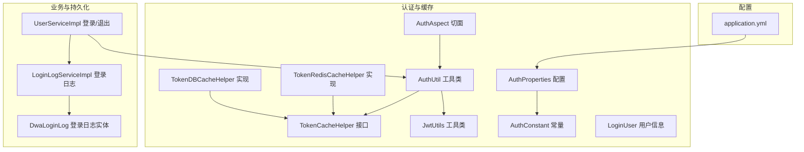
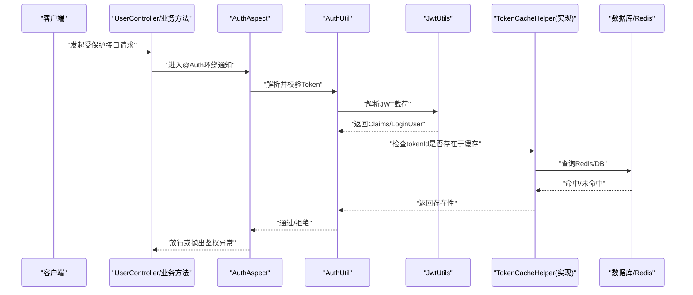
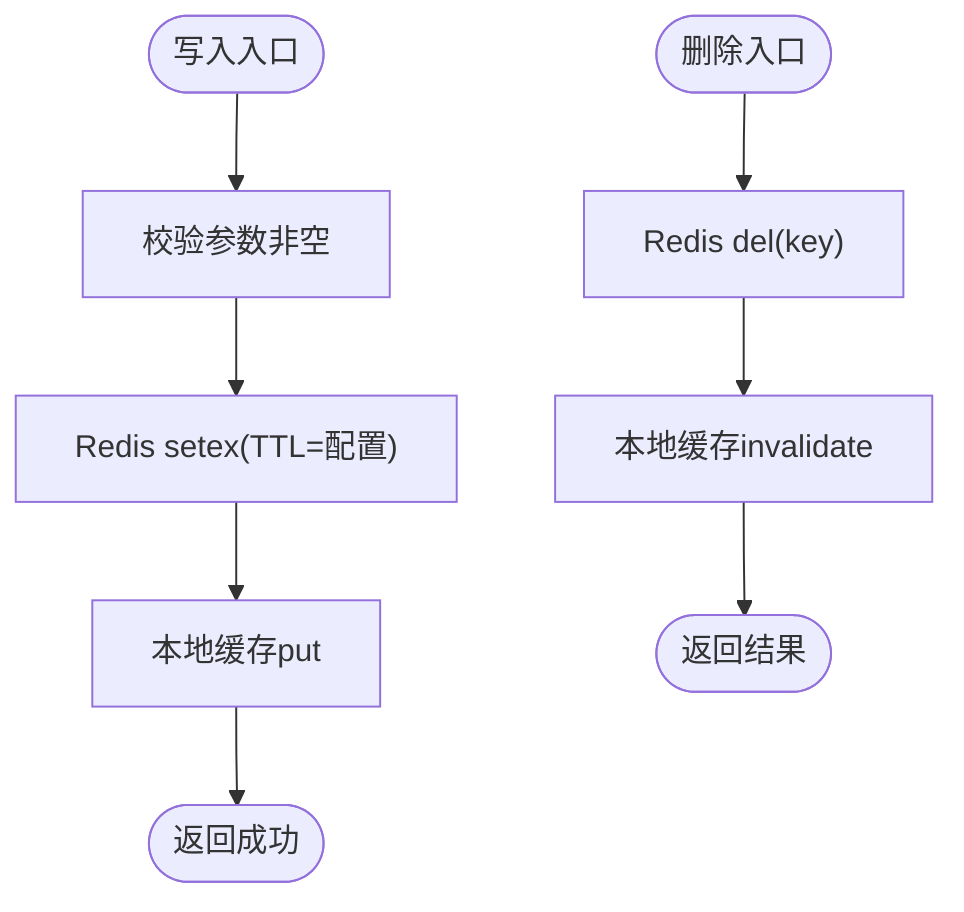
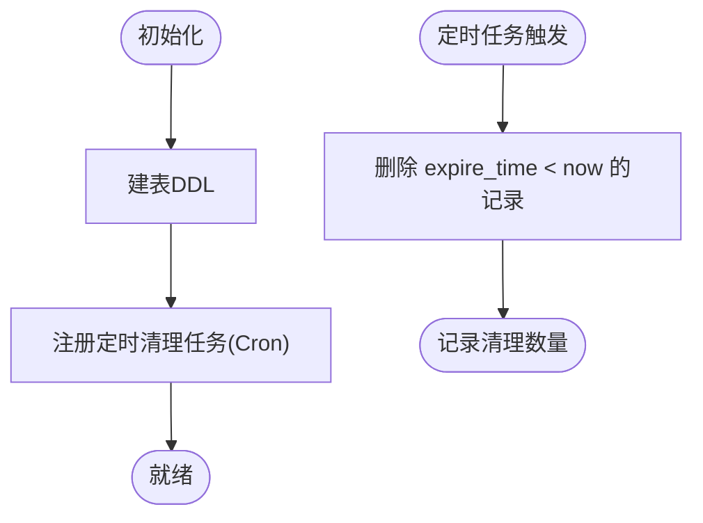
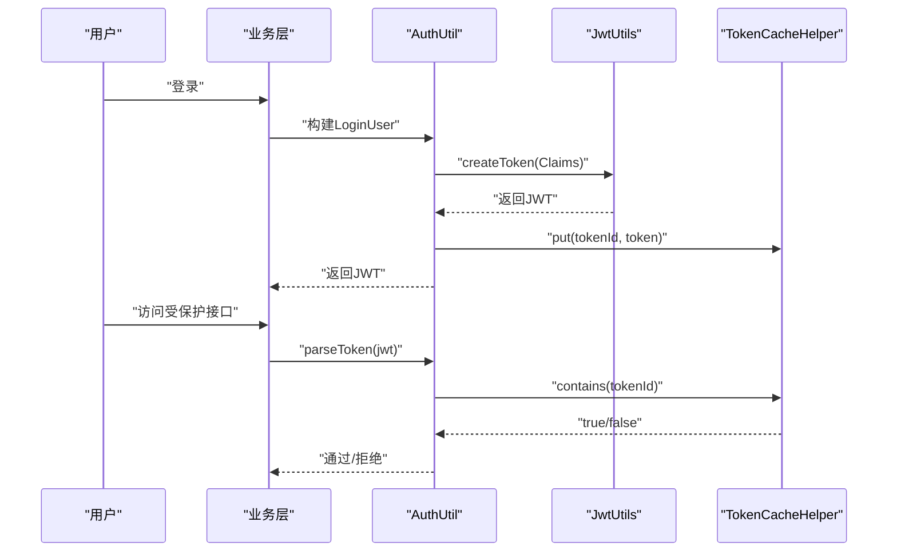
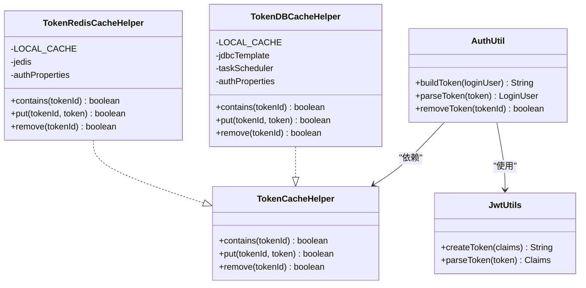

# Token管理策略

<cite>
**本文引用的文件**
- [src/main/java/com/dw/admin/components/auth/TokenCacheHelper.java](file://src/main/java/com/dw/admin/components/auth/TokenCacheHelper.java)
- [src/main/java/com/dw/admin/components/auth/TokenRedisCacheHelper.java](file://src/main/java/com/dw/admin/components/auth/TokenRedisCacheHelper.java)
- [src/main/java/com/dw/admin/components/auth/TokenDBCacheHelper.java](file://src/main/java/com/dw/admin/components/auth/TokenDBCacheHelper.java)
- [src/main/java/com/dw/admin/components/auth/AuthUtil.java](file://src/main/java/com/dw/admin/components/auth/AuthUtil.java)
- [src/main/java/com/dw/admin/components/auth/JwtUtils.java](file://src/main/java/com/dw/admin/components/auth/JwtUtils.java)
- [src/main/java/com/dw/admin/components/auth/AuthConstant.java](file://src/main/java/com/dw/admin/components/auth/AuthConstant.java)
- [src/main/java/com/dw/admin/components/auth/AuthProperties.java](file://src/main/java/com/dw/admin/components/auth/AuthProperties.java)
- [src/main/java/com/dw/admin/components/auth/AuthAspect.java](file://src/main/java/com/dw/admin/components/auth/AuthAspect.java)
- [src/main/java/com/dw/admin/components/auth/LoginUser.java](file://src/main/java/com/dw/admin/components/auth/LoginUser.java)
- [src/main/java/com/dw/admin/service/impl/UserServiceImpl.java](file://src/main/java/com/dw/admin/service/impl/UserServiceImpl.java)
- [src/main/java/com/dw/admin/service/impl/LoginLogServiceImpl.java](file://src/main/java/com/dw/admin/service/impl/LoginLogServiceImpl.java)
- [src/main/java/com/dw/admin/model/entity/DwaLoginLog.java](file://src/main/java/com/dw/admin/model/entity/DwaLoginLog.java)
- [src/main/resources/application.yml](file://src/main/resources/application.yml)
</cite>

## 目录
1. [引言](#引言)
2. [项目结构](#项目结构)
3. [核心组件](#核心组件)
4. [架构总览](#架构总览)
5. [组件详解](#组件详解)
6. [依赖关系分析](#依赖关系分析)
7. [性能与扩展性](#性能与扩展性)
8. [故障排查指南](#故障排查指南)
9. [结论](#结论)
10. [附录](#附录)

## 引言
本文件围绕Token管理策略进行系统化技术说明，重点覆盖以下方面：
- Token缓存策略设计：内存缓存、Redis缓存、数据库缓存的实现差异与适用场景
- TokenCacheHelper接口设计与多实现策略
- Redis缓存实现细节：Key设计、过期策略、一致性保障
- Token失效与刷新机制：黑名单管理、并发控制
- Token存储安全性：敏感信息保护、加密存储
- 性能优化方案与监控指标
- 泄漏防护与审计日志

## 项目结构
与Token管理直接相关的模块集中在auth包与service层，配合配置与切面完成鉴权流程；日志与审计通过独立的日志切面与登录日志实体实现。

图表来源
- [src/main/java/com/dw/admin/components/auth/TokenCacheHelper.java](file://src/main/java/com/dw/admin/components/auth/TokenCacheHelper.java#L1-L26)
- [src/main/java/com/dw/admin/components/auth/TokenRedisCacheHelper.java](file://src/main/java/com/dw/admin/components/auth/TokenRedisCacheHelper.java#L1-L155)
- [src/main/java/com/dw/admin/components/auth/TokenDBCacheHelper.java](file://src/main/java/com/dw/admin/components/auth/TokenDBCacheHelper.java#L1-L259)
- [src/main/java/com/dw/admin/components/auth/AuthUtil.java](file://src/main/java/com/dw/admin/components/auth/AuthUtil.java#L1-L101)
- [src/main/java/com/dw/admin/components/auth/JwtUtils.java](file://src/main/java/com/dw/admin/components/auth/JwtUtils.java#L1-L55)
- [src/main/java/com/dw/admin/components/auth/AuthConstant.java](file://src/main/java/com/dw/admin/components/auth/AuthConstant.java#L1-L51)
- [src/main/java/com/dw/admin/components/auth/AuthProperties.java](file://src/main/java/com/dw/admin/components/auth/AuthProperties.java#L1-L36)
- [src/main/java/com/dw/admin/components/auth/AuthAspect.java](file://src/main/java/com/dw/admin/components/auth/AuthAspect.java#L1-L62)
- [src/main/java/com/dw/admin/components/auth/LoginUser.java](file://src/main/java/com/dw/admin/components/auth/LoginUser.java#L1-L48)
- [src/main/java/com/dw/admin/service/impl/UserServiceImpl.java](file://src/main/java/com/dw/admin/service/impl/UserServiceImpl.java#L90-L123)
- [src/main/java/com/dw/admin/service/impl/LoginLogServiceImpl.java](file://src/main/java/com/dw/admin/service/impl/LoginLogServiceImpl.java#L1-L125)
- [src/main/java/com/dw/admin/model/entity/DwaLoginLog.java](file://src/main/java/com/dw/admin/model/entity/DwaLoginLog.java#L1-L80)
- [src/main/resources/application.yml](file://src/main/resources/application.yml#L1-L64)

章节来源
- [src/main/java/com/dw/admin/components/auth/TokenCacheHelper.java](file://src/main/java/com/dw/admin/components/auth/TokenCacheHelper.java#L1-L26)
- [src/main/java/com/dw/admin/components/auth/TokenRedisCacheHelper.java](file://src/main/java/com/dw/admin/components/auth/TokenRedisCacheHelper.java#L1-L155)
- [src/main/java/com/dw/admin/components/auth/TokenDBCacheHelper.java](file://src/main/java/com/dw/admin/components/auth/TokenDBCacheHelper.java#L1-L259)
- [src/main/java/com/dw/admin/components/auth/AuthUtil.java](file://src/main/java/com/dw/admin/components/auth/AuthUtil.java#L1-L101)
- [src/main/java/com/dw/admin/components/auth/JwtUtils.java](file://src/main/java/com/dw/admin/components/auth/JwtUtils.java#L1-L55)
- [src/main/java/com/dw/admin/components/auth/AuthConstant.java](file://src/main/java/com/dw/admin/components/auth/AuthConstant.java#L1-L51)
- [src/main/java/com/dw/admin/components/auth/AuthProperties.java](file://src/main/java/com/dw/admin/components/auth/AuthProperties.java#L1-L36)
- [src/main/java/com/dw/admin/components/auth/AuthAspect.java](file://src/main/java/com/dw/admin/components/auth/AuthAspect.java#L1-L62)
- [src/main/java/com/dw/admin/components/auth/LoginUser.java](file://src/main/java/com/dw/admin/components/auth/LoginUser.java#L1-L48)
- [src/main/java/com/dw/admin/service/impl/UserServiceImpl.java](file://src/main/java/com/dw/admin/service/impl/UserServiceImpl.java#L90-L123)
- [src/main/java/com/dw/admin/service/impl/LoginLogServiceImpl.java](file://src/main/java/com/dw/admin/service/impl/LoginLogServiceImpl.java#L1-L125)
- [src/main/java/com/dw/admin/model/entity/DwaLoginLog.java](file://src/main/java/com/dw/admin/model/entity/DwaLoginLog.java#L1-L80)
- [src/main/resources/application.yml](file://src/main/resources/application.yml#L1-L64)

## 核心组件
- TokenCacheHelper：定义Token存在性检查、写入、删除三类操作，作为缓存抽象层。
- TokenRedisCacheHelper：基于Redis的实现，包含本地本地缓存（Guava）与Redis双层缓存，统一Key前缀与过期时间。
- TokenDBCacheHelper：基于数据库的实现，包含本地缓存与定时清理过期Token的任务。
- AuthUtil：对外暴露构建Token、解析Token、删除Token等静态方法，内部委托TokenCacheHelper。
- JwtUtils：基于对称密钥的JWT签名与解析工具。
- AuthConstant/AuthProperties：集中管理鉴权相关常量与配置项。
- AuthAspect：拦截带@Auth注解的方法，从请求头读取Token并校验有效性。
- LoginUser：登录用户上下文载体，包含tokenId等关键字段。
- UserServiceImpl：登录流程中生成LoginUser并调用AuthUtil生成Token，同时异步记录登录日志。
- LoginLogServiceImpl/DwaLoginLog：登录审计落地到数据库。

章节来源
- [src/main/java/com/dw/admin/components/auth/TokenCacheHelper.java](file://src/main/java/com/dw/admin/components/auth/TokenCacheHelper.java#L1-L26)
- [src/main/java/com/dw/admin/components/auth/TokenRedisCacheHelper.java](file://src/main/java/com/dw/admin/components/auth/TokenRedisCacheHelper.java#L1-L155)
- [src/main/java/com/dw/admin/components/auth/TokenDBCacheHelper.java](file://src/main/java/com/dw/admin/components/auth/TokenDBCacheHelper.java#L1-L259)
- [src/main/java/com/dw/admin/components/auth/AuthUtil.java](file://src/main/java/com/dw/admin/components/auth/AuthUtil.java#L1-L101)
- [src/main/java/com/dw/admin/components/auth/JwtUtils.java](file://src/main/java/com/dw/admin/components/auth/JwtUtils.java#L1-L55)
- [src/main/java/com/dw/admin/components/auth/AuthConstant.java](file://src/main/java/com/dw/admin/components/auth/AuthConstant.java#L1-L51)
- [src/main/java/com/dw/admin/components/auth/AuthProperties.java](file://src/main/java/com/dw/admin/components/auth/AuthProperties.java#L1-L36)
- [src/main/java/com/dw/admin/components/auth/AuthAspect.java](file://src/main/java/com/dw/admin/components/auth/AuthAspect.java#L1-L62)
- [src/main/java/com/dw/admin/components/auth/LoginUser.java](file://src/main/java/com/dw/admin/components/auth/LoginUser.java#L1-L48)
- [src/main/java/com/dw/admin/service/impl/UserServiceImpl.java](file://src/main/java/com/dw/admin/service/impl/UserServiceImpl.java#L90-L123)
- [src/main/java/com/dw/admin/service/impl/LoginLogServiceImpl.java](file://src/main/java/com/dw/admin/service/impl/LoginLogServiceImpl.java#L1-L125)
- [src/main/java/com/dw/admin/model/entity/DwaLoginLog.java](file://src/main/java/com/dw/admin/model/entity/DwaLoginLog.java#L1-L80)

## 架构总览
下图展示从登录到鉴权的关键流程与组件交互：

图表来源
- [src/main/java/com/dw/admin/components/auth/AuthAspect.java](file://src/main/java/com/dw/admin/components/auth/AuthAspect.java#L1-L62)
- [src/main/java/com/dw/admin/components/auth/AuthUtil.java](file://src/main/java/com/dw/admin/components/auth/AuthUtil.java#L1-L101)
- [src/main/java/com/dw/admin/components/auth/JwtUtils.java](file://src/main/java/com/dw/admin/components/auth/JwtUtils.java#L1-L55)
- [src/main/java/com/dw/admin/components/auth/TokenRedisCacheHelper.java](file://src/main/java/com/dw/admin/components/auth/TokenRedisCacheHelper.java#L1-L155)
- [src/main/java/com/dw/admin/components/auth/TokenDBCacheHelper.java](file://src/main/java/com/dw/admin/components/auth/TokenDBCacheHelper.java#L1-L259)

## 组件详解

### TokenCacheHelper接口与多实现策略
- 设计目标：以统一接口屏蔽不同后端（Redis/DB），并引入本地缓存提升热点命中。
- 多实现策略：
  - Redis实现：本地缓存+Redis，写入时双向同步，删除时双向删除，Key带统一前缀，过期时间由配置决定。
  - DB实现：本地缓存+数据库，写入时插入记录，删除时按tokenId删除，定时任务清理过期记录。
- 选择依据：
  - Redis适合高并发、低延迟、可容忍少量数据丢失的场景。
  - DB适合强一致、审计完整、运维简单但吞吐略低的场景。

章节来源
- [src/main/java/com/dw/admin/components/auth/TokenCacheHelper.java](file://src/main/java/com/dw/admin/components/auth/TokenCacheHelper.java#L1-L26)
- [src/main/java/com/dw/admin/components/auth/TokenRedisCacheHelper.java](file://src/main/java/com/dw/admin/components/auth/TokenRedisCacheHelper.java#L1-L155)
- [src/main/java/com/dw/admin/components/auth/TokenDBCacheHelper.java](file://src/main/java/com/dw/admin/components/auth/TokenDBCacheHelper.java#L1-L259)

### Redis缓存实现细节
- Key设计：统一前缀+tokenId，便于命名空间隔离与批量运维。
- 过期策略：使用setex设置TTL，TTL来自配置项，确保自动过期。
- 一致性与并发：
  - 写入：先写Redis，再写本地缓存，保证读路径快速命中。
  - 删除：先删Redis，再删本地缓存，避免脏读。
  - 读取：优先本地缓存，其次Redis，最后才回源。
- 错误处理：对Redis异常进行日志记录，不影响整体流程。

图表来源
- [src/main/java/com/dw/admin/components/auth/TokenRedisCacheHelper.java](file://src/main/java/com/dw/admin/components/auth/TokenRedisCacheHelper.java#L107-L152)

章节来源
- [src/main/java/com/dw/admin/components/auth/TokenRedisCacheHelper.java](file://src/main/java/com/dw/admin/components/auth/TokenRedisCacheHelper.java#L1-L155)
- [src/main/java/com/dw/admin/components/auth/AuthConstant.java](file://src/main/java/com/dw/admin/components/auth/AuthConstant.java#L44-L44)
- [src/main/java/com/dw/admin/components/auth/AuthProperties.java](file://src/main/java/com/dw/admin/components/auth/AuthProperties.java#L29-L30)

### 数据库缓存实现细节
- 表结构：包含token_id、token、create_time、expire_time等字段，用于持久化与审计。
- 写入：插入记录，expire_time为当前时间+TTL。
- 查询：按token_id计数查询是否存在。
- 删除：按token_id删除。
- 定时清理：基于Cron表达式定期删除过期记录，默认每日固定时间执行。

图表来源
- [src/main/java/com/dw/admin/components/auth/TokenDBCacheHelper.java](file://src/main/java/com/dw/admin/components/auth/TokenDBCacheHelper.java#L38-L65)
- [src/main/java/com/dw/admin/components/auth/TokenDBCacheHelper.java](file://src/main/java/com/dw/admin/components/auth/TokenDBCacheHelper.java#L220-L256)

章节来源
- [src/main/java/com/dw/admin/components/auth/TokenDBCacheHelper.java](file://src/main/java/com/dw/admin/components/auth/TokenDBCacheHelper.java#L1-L259)
- [src/main/java/com/dw/admin/components/auth/AuthProperties.java](file://src/main/java/com/dw/admin/components/auth/AuthProperties.java#L32-L33)

### JWT与Token生命周期
- JWT签名：使用对称密钥（secret）签名，Claims中包含LoginUser序列化后的字符串。
- Token生成：AuthUtil根据LoginUser构建Claims并调用JwtUtils签名，随后写入缓存。
- Token解析：从请求头读取Token，去除前缀后解析，再通过TokenCacheHelper确认tokenId存在性。
- 退出登录：调用AuthUtil.removeToken删除缓存中的tokenId记录。

图表来源
- [src/main/java/com/dw/admin/components/auth/AuthUtil.java](file://src/main/java/com/dw/admin/components/auth/AuthUtil.java#L26-L98)
- [src/main/java/com/dw/admin/components/auth/JwtUtils.java](file://src/main/java/com/dw/admin/components/auth/JwtUtils.java#L38-L51)
- [src/main/java/com/dw/admin/components/auth/LoginUser.java](file://src/main/java/com/dw/admin/components/auth/LoginUser.java#L28-L43)

章节来源
- [src/main/java/com/dw/admin/components/auth/AuthUtil.java](file://src/main/java/com/dw/admin/components/auth/AuthUtil.java#L1-L101)
- [src/main/java/com/dw/admin/components/auth/JwtUtils.java](file://src/main/java/com/dw/admin/components/auth/JwtUtils.java#L1-L55)
- [src/main/java/com/dw/admin/components/auth/LoginUser.java](file://src/main/java/com/dw/admin/components/auth/LoginUser.java#L1-L48)

### Token失效与刷新机制
- 失效机制：退出登录时调用removeToken删除缓存中的tokenId，后续解析时因contains返回false而判定失败。
- 刷新机制：当前实现未提供“刷新Token”逻辑，建议在需要时引入“刷新令牌”或“滑动过期”策略，并结合黑名单管理防止旧Token被复用。
- 黑名单管理：可在缓存层增加“已吊销tokenId集合”，解析时先查黑名单，再查正常缓存，实现即时失效。
- 并发控制：Redis实现采用单Key原子操作；DB实现依赖数据库事务与索引，建议在高并发场景优先Redis实现。

章节来源
- [src/main/java/com/dw/admin/service/impl/UserServiceImpl.java](file://src/main/java/com/dw/admin/service/impl/UserServiceImpl.java#L114-L123)
- [src/main/java/com/dw/admin/components/auth/AuthUtil.java](file://src/main/java/com/dw/admin/components/auth/AuthUtil.java#L96-L98)
- [src/main/java/com/dw/admin/components/auth/TokenRedisCacheHelper.java](file://src/main/java/com/dw/admin/components/auth/TokenRedisCacheHelper.java#L122-L148)
- [src/main/java/com/dw/admin/components/auth/TokenDBCacheHelper.java](file://src/main/java/com/dw/admin/components/auth/TokenDBCacheHelper.java#L176-L202)

### 安全性与加密存储
- 对称密钥：JWT使用对称密钥签名，密钥来源于配置，需妥善保管。
- 敏感信息保护：LoginUser中包含tokenId、userId、用户名、邮箱、登录时间、过期时间、IP等，建议在传输层启用TLS，在日志中避免输出完整JWT。
- 加密存储：当前Token明文存储于Redis/DB；如需更强保护，可考虑在入库前对token内容进行加密，并在读取时解密。
- 配置安全：应用配置中包含密钥与Redis连接信息，应通过环境变量或密钥管理服务注入。

章节来源
- [src/main/java/com/dw/admin/components/auth/JwtUtils.java](file://src/main/java/com/dw/admin/components/auth/JwtUtils.java#L20-L29)
- [src/main/java/com/dw/admin/components/auth/AuthProperties.java](file://src/main/java/com/dw/admin/components/auth/AuthProperties.java#L23-L24)
- [src/main/resources/application.yml](file://src/main/resources/application.yml#L34-L39)

### 审计与日志
- 登录审计：登录成功后异步记录登录日志，包含用户ID、用户名、IP、浏览器、操作系统、登录时间等。
- 日志追踪：通过LogAspect为每个接口调用生成traceId，便于问题定位与链路追踪。
- 建议：在鉴权失败、Token过期、黑名单命中等关键事件增加审计日志。

章节来源
- [src/main/java/com/dw/admin/service/impl/UserServiceImpl.java](file://src/main/java/com/dw/admin/service/impl/UserServiceImpl.java#L104-L105)
- [src/main/java/com/dw/admin/service/impl/LoginLogServiceImpl.java](file://src/main/java/com/dw/admin/service/impl/LoginLogServiceImpl.java#L48-L84)
- [src/main/java/com/dw/admin/model/entity/DwaLoginLog.java](file://src/main/java/com/dw/admin/model/entity/DwaLoginLog.java#L1-L80)
- [src/main/java/com/dw/admin/components/log/LogAspect.java](file://src/main/java/com/dw/admin/components/log/LogAspect.java#L1-L143)

## 依赖关系分析
- 松耦合：AuthUtil不直接依赖具体缓存实现，而是通过TokenCacheHelper接口，便于切换Redis/DB实现。
- 配置驱动：cache-type、secret、expire-time、cleanDBCacheCron等均来自配置，通过条件注解按需装配实现。
- 切面驱动：AuthAspect负责拦截与鉴权，与业务方法解耦。
- 数据一致性：Redis实现通过本地缓存降低延迟；DB实现通过定时任务清理过期数据。

图表来源
- [src/main/java/com/dw/admin/components/auth/TokenCacheHelper.java](file://src/main/java/com/dw/admin/components/auth/TokenCacheHelper.java#L1-L26)
- [src/main/java/com/dw/admin/components/auth/TokenRedisCacheHelper.java](file://src/main/java/com/dw/admin/components/auth/TokenRedisCacheHelper.java#L1-L155)
- [src/main/java/com/dw/admin/components/auth/TokenDBCacheHelper.java](file://src/main/java/com/dw/admin/components/auth/TokenDBCacheHelper.java#L1-L259)
- [src/main/java/com/dw/admin/components/auth/AuthUtil.java](file://src/main/java/com/dw/admin/components/auth/AuthUtil.java#L1-L101)
- [src/main/java/com/dw/admin/components/auth/JwtUtils.java](file://src/main/java/com/dw/admin/components/auth/JwtUtils.java#L1-L55)

章节来源
- [src/main/java/com/dw/admin/components/auth/TokenCacheHelper.java](file://src/main/java/com/dw/admin/components/auth/TokenCacheHelper.java#L1-L26)
- [src/main/java/com/dw/admin/components/auth/TokenRedisCacheHelper.java](file://src/main/java/com/dw/admin/components/auth/TokenRedisCacheHelper.java#L1-L155)
- [src/main/java/com/dw/admin/components/auth/TokenDBCacheHelper.java](file://src/main/java/com/dw/admin/components/auth/TokenDBCacheHelper.java#L1-L259)
- [src/main/java/com/dw/admin/components/auth/AuthUtil.java](file://src/main/java/com/dw/admin/components/auth/AuthUtil.java#L1-L101)
- [src/main/java/com/dw/admin/components/auth/JwtUtils.java](file://src/main/java/com/dw/admin/components/auth/JwtUtils.java#L1-L55)

## 性能与扩展性
- 缓存分层：本地缓存+远端缓存，减少远端压力，提高命中率。
- Redis优势：低延迟、TTL自动过期、原子操作；适合高并发场景。
- DB优势：强一致、审计完整、运维简单；适合对一致性要求高的场景。
- 监控指标建议：
  - 缓存命中率（本地+Redis）
  - Redis命令耗时分布
  - DB查询QPS与慢查询
  - 定时清理任务执行耗时与清理条数
- 优化建议：
  - Redis：合理设置TTL与本地缓存大小；对热点tokenId增加预热。
  - DB：为token_id建立索引；拆分读写分离；限制清理任务频率。
  - 公共：开启请求链路追踪；对异常进行埋点统计。

[本节为通用性能指导，无需列出章节来源]

## 故障排查指南
- 鉴权失败：
  - 检查请求头是否包含正确的Token前缀与格式。
  - 查看AuthAspect日志，确认解析与校验过程。
- Token不存在：
  - 确认TokenCacheHelper实现是否正确写入与删除。
  - Redis模式下检查Key前缀与TTL是否生效。
- DB模式异常：
  - 检查建表DDL是否执行成功。
  - 查看定时清理任务是否按Cron执行。
- 性能问题：
  - 观察Redis命中率与慢查询；评估本地缓存容量与TTL。
  - DB模式关注token_id索引与清理任务负载。

章节来源
- [src/main/java/com/dw/admin/components/auth/AuthAspect.java](file://src/main/java/com/dw/admin/components/auth/AuthAspect.java#L32-L59)
- [src/main/java/com/dw/admin/components/auth/TokenRedisCacheHelper.java](file://src/main/java/com/dw/admin/components/auth/TokenRedisCacheHelper.java#L56-L86)
- [src/main/java/com/dw/admin/components/auth/TokenDBCacheHelper.java](file://src/main/java/com/dw/admin/components/auth/TokenDBCacheHelper.java#L220-L256)
- [src/main/resources/application.yml](file://src/main/resources/application.yml#L34-L39)

## 结论
该Token管理策略通过接口抽象与多实现，实现了灵活的缓存后端选择；结合JWT与本地缓存，兼顾了性能与一致性。Redis实现适合高并发场景，DB实现适合强审计需求。建议在生产环境中进一步完善黑名单与刷新机制、加强加密存储与安全配置，并持续监控关键指标以保障稳定性与可观测性。

[本节为总结性内容，无需列出章节来源]

## 附录
- 关键配置项参考：
  - dwa.auth.cache-type：选择redis或DB
  - dwa.auth.secret：JWT对称密钥
  - dwa.auth.expire-time：Token过期时间（秒）
  - dwa.auth.cleanDBCacheCron：DB模式定时清理Cron
  - dwa.redis.url/password：Redis连接信息

章节来源
- [src/main/java/com/dw/admin/components/auth/AuthProperties.java](file://src/main/java/com/dw/admin/components/auth/AuthProperties.java#L1-L36)
- [src/main/resources/application.yml](file://src/main/resources/application.yml#L34-L39)