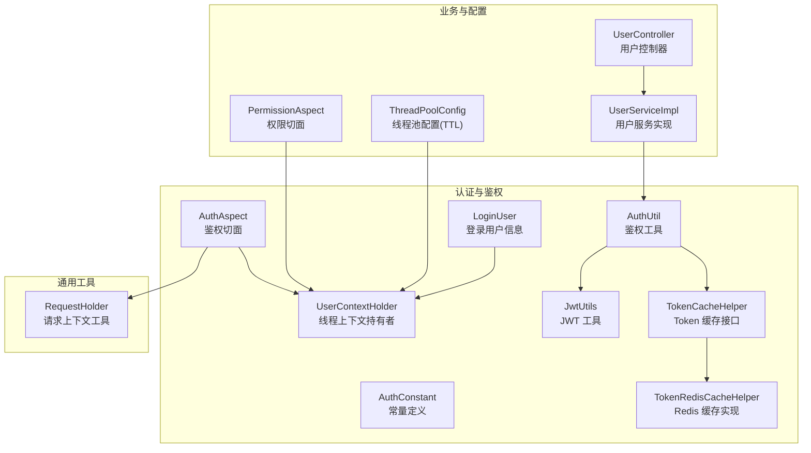
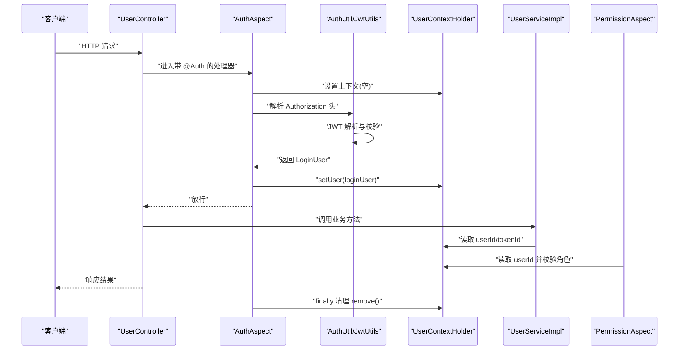
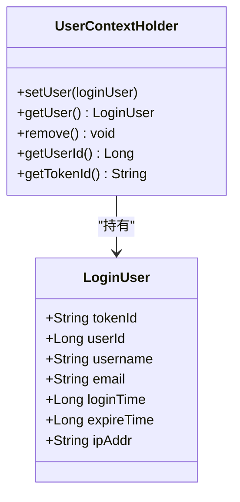
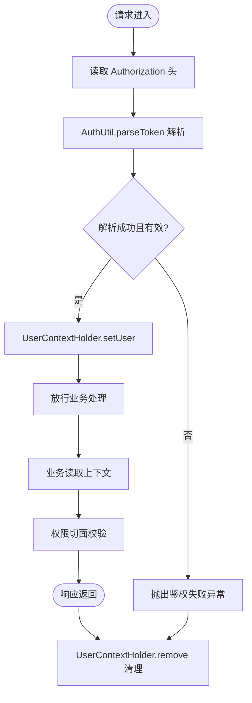
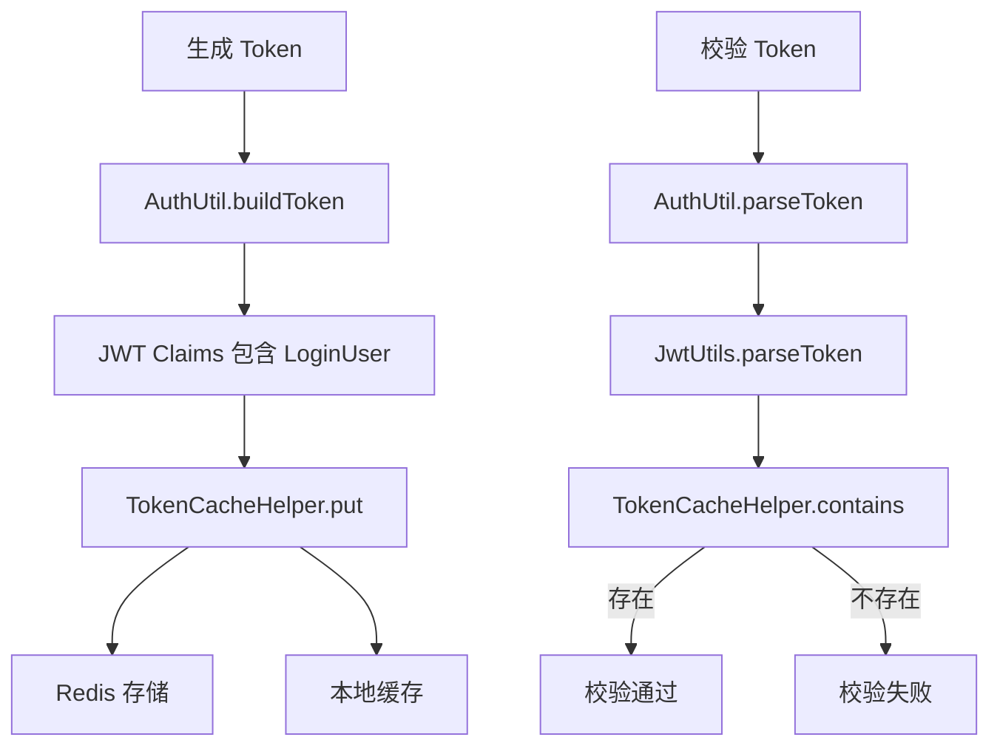
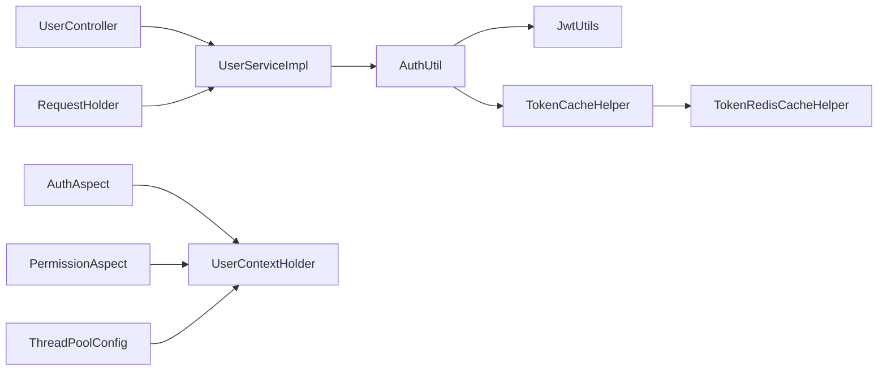

# 用户上下文管理

<cite>
**本文引用的文件**
- [src/main/java/com/dw/admin/components/auth/LoginUser.java](file://src/main/java/com/dw/admin/components/auth/LoginUser.java)
- [src/main/java/com/dw/admin/components/auth/UserContextHolder.java](file://src/main/java/com/dw/admin/components/auth/UserContextHolder.java)
- [src/main/java/com/dw/admin/components/auth/AuthUtil.java](file://src/main/java/com/dw/admin/components/auth/AuthUtil.java)
- [src/main/java/com/dw/admin/components/auth/JwtUtils.java](file://src/main/java/com/dw/admin/components/auth/JwtUtils.java)
- [src/main/java/com/dw/admin/components/auth/AuthAspect.java](file://src/main/java/com/dw/admin/components/auth/AuthAspect.java)
- [src/main/java/com/dw/admin/components/auth/AuthConstant.java](file://src/main/java/com/dw/admin/components/auth/AuthConstant.java)
- [src/main/java/com/dw/admin/common/utils/RequestHolder.java](file://src/main/java/com/dw/admin/common/utils/RequestHolder.java)
- [src/main/java/com/dw/admin/components/auth/TokenCacheHelper.java](file://src/main/java/com/dw/admin/components/auth/TokenCacheHelper.java)
- [src/main/java/com/dw/admin/components/auth/TokenRedisCacheHelper.java](file://src/main/java/com/dw/admin/components/auth/TokenRedisCacheHelper.java)
- [src/main/java/com/dw/admin/service/impl/UserServiceImpl.java](file://src/main/java/com/dw/admin/service/impl/UserServiceImpl.java)
- [src/main/java/com/dw/admin/controller/UserController.java](file://src/main/java/com/dw/admin/controller/UserController.java)
- [src/main/java/com/dw/admin/components/permission/PermissionAspect.java](file://src/main/java/com/dw/admin/components/permission/PermissionAspect.java)
- [src/main/java/com/dw/admin/config/ThreadPoolConfig.java](file://src/main/java/com/dw/admin/config/ThreadPoolConfig.java)
</cite>

## 目录
1. [简介](#简介)
2. [项目结构](#项目结构)
3. [核心组件](#核心组件)
4. [架构总览](#架构总览)
5. [组件详解](#组件详解)
6. [依赖关系分析](#依赖关系分析)
7. [性能与内存管理](#性能与内存管理)
8. [故障排查指南](#故障排查指南)
9. [结论](#结论)

## 简介
本技术文档围绕用户上下文管理系统进行系统化梳理，重点覆盖以下方面：
- LoginUser 数据结构设计：字段含义、序列化要求与业务用途
- UserContextHolder 实现原理：基于 TransmittableThreadLocal 的线程上下文管理、父子线程传递、线程安全与内存泄漏防护
- 请求生命周期内的上下文管理：从 Token 解析、鉴权切面设置、业务执行到上下文清理的全流程
- 多线程环境下的上下文传递与隔离：结合线程池配置与 TTL 工具
- 最佳实践与注意事项：如何正确使用与避免常见陷阱
- 上下文清理的重要性与常见遗漏场景
- 性能优化与内存管理策略：Token 缓存、本地缓存与过期控制

## 项目结构
用户上下文管理相关代码主要集中在认证与鉴权模块，配合通用工具类与线程池配置，形成“请求级上下文 + 多线程传递”的整体方案。

图表来源
- [src/main/java/com/dw/admin/components/auth/LoginUser.java](file://src/main/java/com/dw/admin/components/auth/LoginUser.java#L1-L48)
- [src/main/java/com/dw/admin/components/auth/UserContextHolder.java](file://src/main/java/com/dw/admin/components/auth/UserContextHolder.java#L1-L46)
- [src/main/java/com/dw/admin/components/auth/AuthUtil.java](file://src/main/java/com/dw/admin/components/auth/AuthUtil.java#L1-L101)
- [src/main/java/com/dw/admin/components/auth/JwtUtils.java](file://src/main/java/com/dw/admin/components/auth/JwtUtils.java#L1-L55)
- [src/main/java/com/dw/admin/components/auth/AuthAspect.java](file://src/main/java/com/dw/admin/components/auth/AuthAspect.java#L1-L62)
- [src/main/java/com/dw/admin/components/auth/AuthConstant.java](file://src/main/java/com/dw/admin/components/auth/AuthConstant.java#L1-L51)
- [src/main/java/com/dw/admin/common/utils/RequestHolder.java](file://src/main/java/com/dw/admin/common/utils/RequestHolder.java#L1-L135)
- [src/main/java/com/dw/admin/components/auth/TokenCacheHelper.java](file://src/main/java/com/dw/admin/components/auth/TokenCacheHelper.java#L1-L26)
- [src/main/java/com/dw/admin/components/auth/TokenRedisCacheHelper.java](file://src/main/java/com/dw/admin/components/auth/TokenRedisCacheHelper.java#L1-L155)
- [src/main/java/com/dw/admin/controller/UserController.java](file://src/main/java/com/dw/admin/controller/UserController.java#L1-L138)
- [src/main/java/com/dw/admin/service/impl/UserServiceImpl.java](file://src/main/java/com/dw/admin/service/impl/UserServiceImpl.java#L1-L200)
- [src/main/java/com/dw/admin/components/permission/PermissionAspect.java](file://src/main/java/com/dw/admin/components/permission/PermissionAspect.java#L1-L91)
- [src/main/java/com/dw/admin/config/ThreadPoolConfig.java](file://src/main/java/com/dw/admin/config/ThreadPoolConfig.java#L1-L44)

章节来源
- [src/main/java/com/dw/admin/components/auth/LoginUser.java](file://src/main/java/com/dw/admin/components/auth/LoginUser.java#L1-L48)
- [src/main/java/com/dw/admin/components/auth/UserContextHolder.java](file://src/main/java/com/dw/admin/components/auth/UserContextHolder.java#L1-L46)
- [src/main/java/com/dw/admin/components/auth/AuthAspect.java](file://src/main/java/com/dw/admin/components/auth/AuthAspect.java#L1-L62)

## 核心组件
- LoginUser：承载登录用户的关键信息，用于 JWT 载荷与线程上下文传递
- UserContextHolder：基于 TransmittableThreadLocal 的线程上下文容器，提供设置、获取、移除与便捷访问方法
- AuthUtil：封装 Token 生成、解析、缓存与删除逻辑，并与 TokenCacheHelper 协作
- JwtUtils：提供对称密钥加载与 JWT 的签名、解析能力
- AuthAspect：在请求进入时解析 Authorization 头部，验证并设置用户上下文，在请求结束时清理
- TokenCacheHelper/TokenRedisCacheHelper：Token 存储抽象与 Redis 实现，含本地缓存与过期控制
- RequestHolder：从 Spring RequestContextHolder 中获取 HttpServletRequest/响应头/IP 等
- PermissionAspect：基于用户上下文进行角色权限校验
- ThreadPoolConfig：通过 TtlRunnable 使线程池具备父子线程上下文传递能力

章节来源
- [src/main/java/com/dw/admin/components/auth/LoginUser.java](file://src/main/java/com/dw/admin/components/auth/LoginUser.java#L21-L48)
- [src/main/java/com/dw/admin/components/auth/UserContextHolder.java](file://src/main/java/com/dw/admin/components/auth/UserContextHolder.java#L12-L46)
- [src/main/java/com/dw/admin/components/auth/AuthUtil.java](file://src/main/java/com/dw/admin/components/auth/AuthUtil.java#L17-L101)
- [src/main/java/com/dw/admin/components/auth/JwtUtils.java](file://src/main/java/com/dw/admin/components/auth/JwtUtils.java#L18-L55)
- [src/main/java/com/dw/admin/components/auth/AuthAspect.java](file://src/main/java/com/dw/admin/components/auth/AuthAspect.java#L26-L62)
- [src/main/java/com/dw/admin/components/auth/TokenCacheHelper.java](file://src/main/java/com/dw/admin/components/auth/TokenCacheHelper.java#L8-L26)
- [src/main/java/com/dw/admin/components/auth/TokenRedisCacheHelper.java](file://src/main/java/com/dw/admin/components/auth/TokenRedisCacheHelper.java#L28-L155)
- [src/main/java/com/dw/admin/common/utils/RequestHolder.java](file://src/main/java/com/dw/admin/common/utils/RequestHolder.java#L23-L135)
- [src/main/java/com/dw/admin/components/permission/PermissionAspect.java](file://src/main/java/com/dw/admin/components/permission/PermissionAspect.java#L39-L91)
- [src/main/java/com/dw/admin/config/ThreadPoolConfig.java](file://src/main/java/com/dw/admin/config/ThreadPoolConfig.java#L18-L44)

## 架构总览
下图展示了从请求进入、鉴权、业务处理到上下文清理的全链路：

图表来源
- [src/main/java/com/dw/admin/components/auth/AuthAspect.java](file://src/main/java/com/dw/admin/components/auth/AuthAspect.java#L32-L59)
- [src/main/java/com/dw/admin/components/auth/AuthUtil.java](file://src/main/java/com/dw/admin/components/auth/AuthUtil.java#L49-L71)
- [src/main/java/com/dw/admin/components/auth/JwtUtils.java](file://src/main/java/com/dw/admin/components/auth/JwtUtils.java#L48-L51)
- [src/main/java/com/dw/admin/components/auth/UserContextHolder.java](file://src/main/java/com/dw/admin/components/auth/UserContextHolder.java#L21-L33)
- [src/main/java/com/dw/admin/service/impl/UserServiceImpl.java](file://src/main/java/com/dw/admin/service/impl/UserServiceImpl.java#L176-L197)
- [src/main/java/com/dw/admin/components/permission/PermissionAspect.java](file://src/main/java/com/dw/admin/components/permission/PermissionAspect.java#L60-L82)
- [src/main/java/com/dw/admin/controller/UserController.java](file://src/main/java/com/dw/admin/controller/UserController.java#L117-L123)

## 组件详解

### LoginUser 数据结构设计
- 字段说明
  - tokenId：令牌唯一标识，用于 Token 缓存与注销
  - userId：用户主键，贯穿业务层读取与权限校验
  - username：用户名，便于日志与审计
  - email：邮箱，可用于扩展功能
  - loginTime/expireTime：登录时间与过期时间，用于审计与过期判断
  - ipAddr：登录 IP，用于安全审计
- 序列化要求：实现可序列化接口，确保在分布式与跨线程场景中传输与持久化可行
- 用途：作为 JWT 载荷的一部分，同时作为线程上下文的载体

章节来源
- [src/main/java/com/dw/admin/components/auth/LoginUser.java](file://src/main/java/com/dw/admin/components/auth/LoginUser.java#L21-L48)

### UserContextHolder 实现原理
- 基于 TransmittableThreadLocal 的线程上下文容器，支持父子线程数据传递
- 提供静态方法：
  - setUser：设置当前线程的 LoginUser
  - getUser：获取当前线程的 LoginUser
  - remove：清理当前线程上下文，防止内存泄漏
  - getUserId/getTokenId：便捷访问常用字段
- 线程安全：TransmittableThreadLocal 在单线程内天然线程安全；配合线程池的 TTL 包装实现跨线程传递
- 内存泄漏防护：在请求结束时必须调用 remove 清理，避免线程复用导致的脏数据残留

图表来源
- [src/main/java/com/dw/admin/components/auth/LoginUser.java](file://src/main/java/com/dw/admin/components/auth/LoginUser.java#L21-L48)
- [src/main/java/com/dw/admin/components/auth/UserContextHolder.java](file://src/main/java/com/dw/admin/components/auth/UserContextHolder.java#L12-L46)

章节来源
- [src/main/java/com/dw/admin/components/auth/UserContextHolder.java](file://src/main/java/com/dw/admin/components/auth/UserContextHolder.java#L12-L46)
- [src/main/java/com/dw/admin/config/ThreadPoolConfig.java](file://src/main/java/com/dw/admin/config/ThreadPoolConfig.java#L36-L42)

### 请求生命周期中的上下文管理
- Token 解析：从请求头 Authorization 中提取 Bearer Token，调用 AuthUtil.parseToken 完成解析与校验
- 上下文设置：将解析出的 LoginUser 通过 UserContextHolder.setUser 设置到当前线程
- 业务执行：控制器与服务层通过 UserContextHolder 获取 userId 等信息
- 权限校验：PermissionAspect 读取上下文并进行角色校验
- 上下文清理：无论成功与否，最终在 AuthAspect 的 finally 中调用 remove 清理

图表来源
- [src/main/java/com/dw/admin/components/auth/AuthAspect.java](file://src/main/java/com/dw/admin/components/auth/AuthAspect.java#L32-L59)
- [src/main/java/com/dw/admin/common/utils/RequestHolder.java](file://src/main/java/com/dw/admin/common/utils/RequestHolder.java#L127-L133)
- [src/main/java/com/dw/admin/components/auth/AuthUtil.java](file://src/main/java/com/dw/admin/components/auth/AuthUtil.java#L49-L71)
- [src/main/java/com/dw/admin/components/auth/UserContextHolder.java](file://src/main/java/com/dw/admin/components/auth/UserContextHolder.java#L21-L33)

章节来源
- [src/main/java/com/dw/admin/components/auth/AuthAspect.java](file://src/main/java/com/dw/admin/components/auth/AuthAspect.java#L32-L59)
- [src/main/java/com/dw/admin/common/utils/RequestHolder.java](file://src/main/java/com/dw/admin/common/utils/RequestHolder.java#L127-L133)
- [src/main/java/com/dw/admin/components/auth/AuthUtil.java](file://src/main/java/com/dw/admin/components/auth/AuthUtil.java#L49-L71)

### 多线程环境下的上下文传递与隔离
- 线程池配置：通过 TaskDecorator 将普通 Runnable 包装为 TtlRunnable，实现父子线程上下文传递
- 适用场景：异步任务、定时任务、线程池执行器等
- 隔离机制：每个线程拥有独立的上下文副本，避免交叉污染

章节来源
- [src/main/java/com/dw/admin/config/ThreadPoolConfig.java](file://src/main/java/com/dw/admin/config/ThreadPoolConfig.java#L36-L42)
- [src/main/java/com/dw/admin/components/auth/UserContextHolder.java](file://src/main/java/com/dw/admin/components/auth/UserContextHolder.java#L14-L18)

### Token 与缓存策略
- Token 生成：AuthUtil.buildToken 将 LoginUser 序列化为 JSON 放入 JWT Claims，随后写入 TokenCacheHelper
- Token 校验：AuthUtil.parseToken 先解析 JWT，再通过 TokenCacheHelper.contains 校验 Token 是否仍有效
- Token 存储：TokenRedisCacheHelper 结合本地 Guava 缓存与 Redis，提升命中率并降低延迟
- 过期控制：Redis 过期时间由 AuthProperties 控制；本地缓存采用写入过期时间，缩短热点失效等待

图表来源
- [src/main/java/com/dw/admin/components/auth/AuthUtil.java](file://src/main/java/com/dw/admin/components/auth/AuthUtil.java#L32-L98)
- [src/main/java/com/dw/admin/components/auth/JwtUtils.java](file://src/main/java/com/dw/admin/components/auth/JwtUtils.java#L38-L51)
- [src/main/java/com/dw/admin/components/auth/TokenCacheHelper.java](file://src/main/java/com/dw/admin/components/auth/TokenCacheHelper.java#L8-L26)
- [src/main/java/com/dw/admin/components/auth/TokenRedisCacheHelper.java](file://src/main/java/com/dw/admin/components/auth/TokenRedisCacheHelper.java#L57-L116)

章节来源
- [src/main/java/com/dw/admin/components/auth/AuthUtil.java](file://src/main/java/com/dw/admin/components/auth/AuthUtil.java#L32-L98)
- [src/main/java/com/dw/admin/components/auth/TokenRedisCacheHelper.java](file://src/main/java/com/dw/admin/components/auth/TokenRedisCacheHelper.java#L28-L155)

### 登录与退出流程
- 登录：UserServiceImpl.login 构造 LoginUser，调用 AuthUtil.buildToken 返回 Token，并异步记录登录日志
- 退出：UserServiceImpl.logout 读取上下文中的 tokenId，调用 AuthUtil.removeToken 清理缓存

章节来源
- [src/main/java/com/dw/admin/service/impl/UserServiceImpl.java](file://src/main/java/com/dw/admin/service/impl/UserServiceImpl.java#L77-L123)
- [src/main/java/com/dw/admin/components/auth/AuthUtil.java](file://src/main/java/com/dw/admin/components/auth/AuthUtil.java#L96-L98)

## 依赖关系分析
- 控制器与服务：UserController 依赖 UserServiceImpl；后者依赖 AuthUtil、UserContextHolder、RequestHolder 等
- 切面协作：AuthAspect 在业务执行前后设置与清理上下文；PermissionAspect 依赖 UserContextHolder 进行角色校验
- 工具链：AuthUtil 依赖 JwtUtils 与 TokenCacheHelper；TokenCacheHelper 由 TokenRedisCacheHelper 实现
- 线程池：ThreadPoolConfig 通过 TtlRunnable 保障上下文在异步任务中的传递

图表来源
- [src/main/java/com/dw/admin/controller/UserController.java](file://src/main/java/com/dw/admin/controller/UserController.java#L25-L138)
- [src/main/java/com/dw/admin/service/impl/UserServiceImpl.java](file://src/main/java/com/dw/admin/service/impl/UserServiceImpl.java#L40-L200)
- [src/main/java/com/dw/admin/components/auth/AuthUtil.java](file://src/main/java/com/dw/admin/components/auth/AuthUtil.java#L17-L101)
- [src/main/java/com/dw/admin/components/auth/JwtUtils.java](file://src/main/java/com/dw/admin/components/auth/JwtUtils.java#L18-L55)
- [src/main/java/com/dw/admin/components/auth/TokenCacheHelper.java](file://src/main/java/com/dw/admin/components/auth/TokenCacheHelper.java#L8-L26)
- [src/main/java/com/dw/admin/components/auth/TokenRedisCacheHelper.java](file://src/main/java/com/dw/admin/components/auth/TokenRedisCacheHelper.java#L28-L155)
- [src/main/java/com/dw/admin/components/auth/AuthAspect.java](file://src/main/java/com/dw/admin/components/auth/AuthAspect.java#L26-L62)
- [src/main/java/com/dw/admin/components/permission/PermissionAspect.java](file://src/main/java/com/dw/admin/components/permission/PermissionAspect.java#L39-L91)
- [src/main/java/com/dw/admin/config/ThreadPoolConfig.java](file://src/main/java/com/dw/admin/config/ThreadPoolConfig.java#L18-L44)
- [src/main/java/com/dw/admin/common/utils/RequestHolder.java](file://src/main/java/com/dw/admin/common/utils/RequestHolder.java#L23-L135)

## 性能与内存管理
- Token 缓存分层
  - 本地缓存：Guava Cache，命中热点 Token，减少 Redis 访问
  - Redis 缓存：集中存储，支持水平扩展与跨节点共享
  - 过期策略：本地缓存写入过期时间，Redis 采用 TTL，避免陈旧数据占用
- 线程池与上下文传递
  - 使用 TtlRunnable 包装任务，避免手动传播上下文带来的遗漏
  - 虚拟线程工厂与合理的拒绝策略，平衡吞吐与稳定性
- 内存泄漏防护
  - 必须在请求结束时调用 UserContextHolder.remove
  - 对异步任务同样需要在任务结束时清理
- 建议
  - 为高频接口开启本地缓存预热
  - 监控 Redis 命中率与过期清理任务执行情况
  - 对长耗时任务拆分并及时清理上下文

章节来源
- [src/main/java/com/dw/admin/components/auth/TokenRedisCacheHelper.java](file://src/main/java/com/dw/admin/components/auth/TokenRedisCacheHelper.java#L41-L48)
- [src/main/java/com/dw/admin/config/ThreadPoolConfig.java](file://src/main/java/com/dw/admin/config/ThreadPoolConfig.java#L36-L42)
- [src/main/java/com/dw/admin/components/auth/AuthAspect.java](file://src/main/java/com/dw/admin/components/auth/AuthAspect.java#L55-L58)

## 故障排查指南
- 鉴权失败
  - 检查请求头 Authorization 是否携带 Bearer Token
  - 确认 Token 未过期且存在于 TokenCacheHelper 中
  - 核对 JwtUtils 秘钥配置与 AuthProperties
- 上下文为空
  - 确认 @Auth 注解生效且未被绕过
  - 检查线程池是否正确包装任务
  - 排查 finally 中 remove 是否被提前中断
- 权限不足
  - 检查用户角色缓存是否正确加载
  - 确认角色枚举与权限注解配置一致
- 性能问题
  - 观察 Redis 命中率与延迟
  - 检查本地缓存大小与过期时间配置

章节来源
- [src/main/java/com/dw/admin/components/auth/AuthAspect.java](file://src/main/java/com/dw/admin/components/auth/AuthAspect.java#L32-L59)
- [src/main/java/com/dw/admin/components/auth/AuthUtil.java](file://src/main/java/com/dw/admin/components/auth/AuthUtil.java#L49-L71)
- [src/main/java/com/dw/admin/components/auth/JwtUtils.java](file://src/main/java/com/dw/admin/components/auth/JwtUtils.java#L20-L29)
- [src/main/java/com/dw/admin/components/permission/PermissionAspect.java](file://src/main/java/com/dw/admin/components/permission/PermissionAspect.java#L52-L87)

## 结论
该用户上下文管理方案以 LoginUser 为核心载体，结合 TransmittableThreadLocal 与线程池 TTL 包装，实现了请求级上下文的可靠传递与隔离。通过鉴权切面与权限切面的协同，确保了从 Token 解析到业务执行再到上下文清理的完整闭环。配合分层缓存与过期策略，系统在性能与可靠性之间取得了良好平衡。建议在生产环境中严格遵循上下文清理的最佳实践，并持续监控缓存命中与过期清理任务的健康状态。