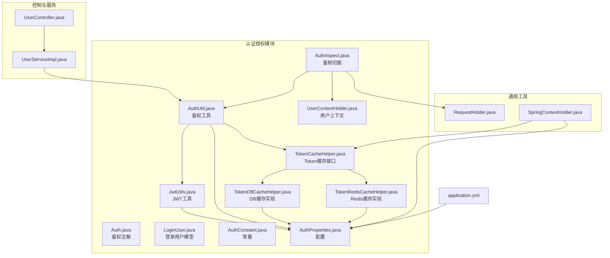
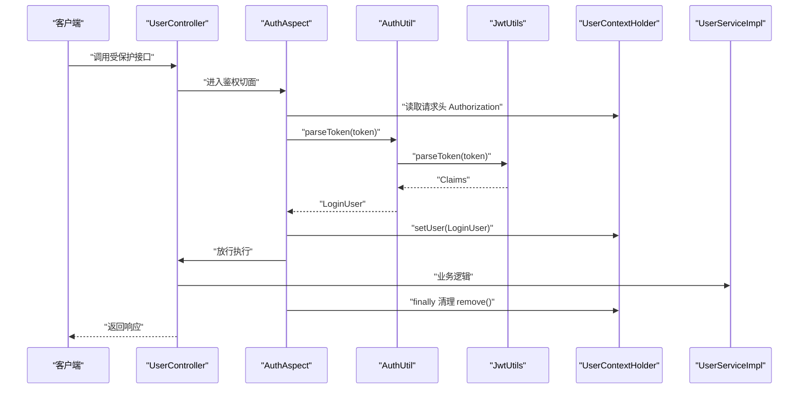
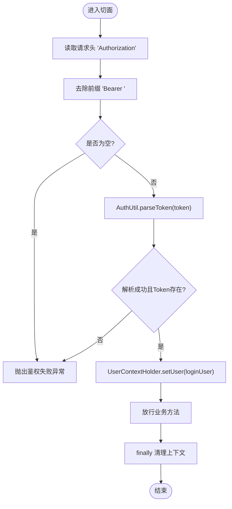
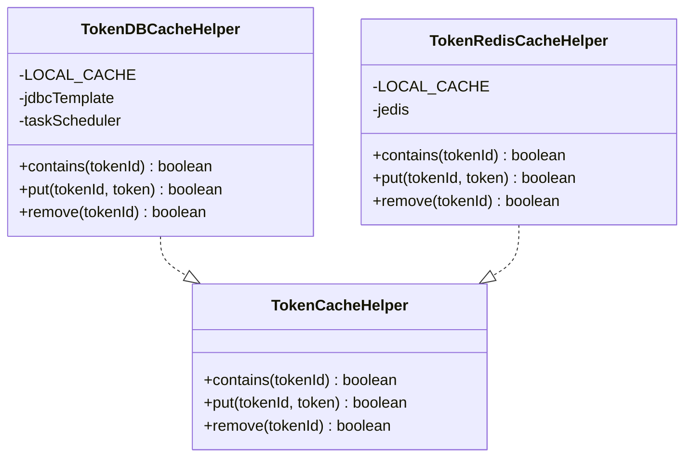
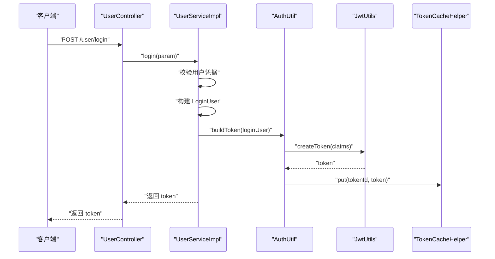
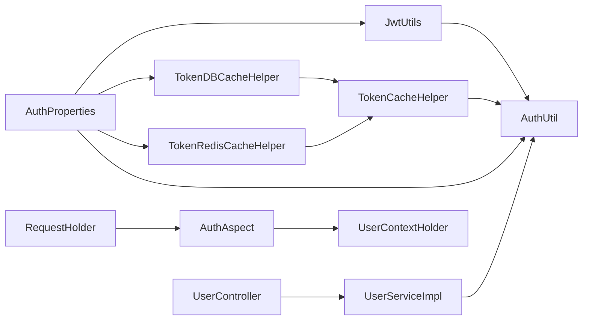

# 认证授权系统

<cite>
**本文引用的文件**
- [Auth.java](file://src/main/java/com/dw/admin/components/auth/Auth.java)
- [AuthAspect.java](file://src/main/java/com/dw/admin/components/auth/AuthAspect.java)
- [AuthUtil.java](file://src/main/java/com/dw/admin/components/auth/AuthUtil.java)
- [JwtUtils.java](file://src/main/java/com/dw/admin/components/auth/JwtUtils.java)
- [LoginUser.java](file://src/main/java/com/dw/admin/components/auth/LoginUser.java)
- [UserContextHolder.java](file://src/main/java/com/dw/admin/components/auth/UserContextHolder.java)
- [AuthConstant.java](file://src/main/java/com/dw/admin/components/auth/AuthConstant.java)
- [AuthProperties.java](file://src/main/java/com/dw/admin/components/auth/AuthProperties.java)
- [TokenCacheHelper.java](file://src/main/java/com/dw/admin/components/auth/TokenCacheHelper.java)
- [TokenDBCacheHelper.java](file://src/main/java/com/dw/admin/components/auth/TokenDBCacheHelper.java)
- [TokenRedisCacheHelper.java](file://src/main/java/com/dw/admin/components/auth/TokenRedisCacheHelper.java)
- [UserController.java](file://src/main/java/com/dw/admin/controller/UserController.java)
- [UserServiceImpl.java](file://src/main/java/com/dw/admin/service/impl/UserServiceImpl.java)
- [RequestHolder.java](file://src/main/java/com/dw/admin/common/utils/RequestHolder.java)
- [SpringContextHolder.java](file://src/main/java/com/dw/admin/common/utils/SpringContextHolder.java)
- [application.yml](file://src/main/resources/application.yml)
</cite>

## 目录
1. [简介](#简介)
2. [项目结构](#项目结构)
3. [核心组件](#核心组件)
4. [架构总览](#架构总览)
5. [组件详解](#组件详解)
6. [依赖关系分析](#依赖关系分析)
7. [性能与安全优化](#性能与安全优化)
8. [故障排查指南](#故障排查指南)
9. [结论](#结论)
10. [附录](#附录)

## 简介
本技术文档围绕认证授权系统进行深入剖析，重点覆盖以下方面：
- JWT 无状态认证机制的实现原理与安全考量
- 鉴权切面的工作流程（Token 提取、用户信息解析、权限校验）
- Token 缓存策略（内存缓存与 Redis/数据库缓存）的实现差异
- 用户上下文管理与线程安全机制
- 登录用户信息的数据结构与生命周期
- Token 刷新与失效处理最佳实践
- 性能优化与安全加固建议
- 常见认证问题排查与解决方案

## 项目结构
认证授权模块位于 components/auth 下，围绕注解驱动的切面拦截、JWT 工具、Token 缓存、用户上下文等核心能力组织代码；控制器与服务层通过注解与工具类完成登录、登出、用户信息查询等业务。

图表来源
- [Auth.java](file://src/main/java/com/dw/admin/components/auth/Auth.java#L1-L17)
- [AuthAspect.java](file://src/main/java/com/dw/admin/components/auth/AuthAspect.java#L1-L62)
- [AuthUtil.java](file://src/main/java/com/dw/admin/components/auth/AuthUtil.java#L1-L101)
- [JwtUtils.java](file://src/main/java/com/dw/admin/components/auth/JwtUtils.java#L1-L55)
- [LoginUser.java](file://src/main/java/com/dw/admin/components/auth/LoginUser.java#L1-L48)
- [UserContextHolder.java](file://src/main/java/com/dw/admin/components/auth/UserContextHolder.java#L1-L46)
- [AuthConstant.java](file://src/main/java/com/dw/admin/components/auth/AuthConstant.java#L1-L51)
- [AuthProperties.java](file://src/main/java/com/dw/admin/components/auth/AuthProperties.java#L1-L36)
- [TokenCacheHelper.java](file://src/main/java/com/dw/admin/components/auth/TokenCacheHelper.java#L1-L26)
- [TokenDBCacheHelper.java](file://src/main/java/com/dw/admin/components/auth/TokenDBCacheHelper.java#L1-L259)
- [TokenRedisCacheHelper.java](file://src/main/java/com/dw/admin/components/auth/TokenRedisCacheHelper.java#L1-L155)
- [UserController.java](file://src/main/java/com/dw/admin/controller/UserController.java#L1-L138)
- [UserServiceImpl.java](file://src/main/java/com/dw/admin/service/impl/UserServiceImpl.java#L1-L270)
- [RequestHolder.java](file://src/main/java/com/dw/admin/common/utils/RequestHolder.java#L1-L135)
- [SpringContextHolder.java](file://src/main/java/com/dw/admin/common/utils/SpringContextHolder.java#L1-L75)
- [application.yml](file://src/main/resources/application.yml#L1-L64)

章节来源
- [Auth.java](file://src/main/java/com/dw/admin/components/auth/Auth.java#L1-L17)
- [AuthAspect.java](file://src/main/java/com/dw/admin/components/auth/AuthAspect.java#L1-L62)
- [application.yml](file://src/main/resources/application.yml#L33-L37)

## 核心组件
- 鉴权注解与切面：通过注解标记受保护方法，切面在执行前后完成 Token 校验、用户上下文设置与清理。
- JWT 工具：负责密钥加载、Token 构造与解析。
- 鉴权工具：封装 Token 生成、解析、缓存存取与删除。
- Token 缓存：抽象接口与两种实现（DB/Redis），均带本地本地缓存提升命中率。
- 用户上下文：基于 TransmittableThreadLocal 的线程安全容器，便于全链路获取当前登录用户。
- 配置与常量：集中管理密钥、过期时间、缓存类型、Redis Key 前缀等。

章节来源
- [Auth.java](file://src/main/java/com/dw/admin/components/auth/Auth.java#L1-L17)
- [AuthAspect.java](file://src/main/java/com/dw/admin/components/auth/AuthAspect.java#L1-L62)
- [JwtUtils.java](file://src/main/java/com/dw/admin/components/auth/JwtUtils.java#L1-L55)
- [AuthUtil.java](file://src/main/java/com/dw/admin/components/auth/AuthUtil.java#L1-L101)
- [TokenCacheHelper.java](file://src/main/java/com/dw/admin/components/auth/TokenCacheHelper.java#L1-L26)
- [TokenDBCacheHelper.java](file://src/main/java/com/dw/admin/components/auth/TokenDBCacheHelper.java#L1-L259)
- [TokenRedisCacheHelper.java](file://src/main/java/com/dw/admin/components/auth/TokenRedisCacheHelper.java#L1-L155)
- [UserContextHolder.java](file://src/main/java/com/dw/admin/components/auth/UserContextHolder.java#L1-L46)
- [AuthConstant.java](file://src/main/java/com/dw/admin/components/auth/AuthConstant.java#L1-L51)
- [AuthProperties.java](file://src/main/java/com/dw/admin/components/auth/AuthProperties.java#L1-L36)

## 架构总览
系统采用“注解 + 切面 + JWT + 多级缓存”的无状态认证架构。请求进入控制器后，由鉴权切面拦截，从请求头提取 Token，解析用户信息并写入线程上下文，随后放行至目标方法；方法结束后清理上下文，确保线程安全。

图表来源
- [AuthAspect.java](file://src/main/java/com/dw/admin/components/auth/AuthAspect.java#L32-L59)
- [AuthUtil.java](file://src/main/java/com/dw/admin/components/auth/AuthUtil.java#L49-L71)
- [JwtUtils.java](file://src/main/java/com/dw/admin/components/auth/JwtUtils.java#L48-L51)
- [UserContextHolder.java](file://src/main/java/com/dw/admin/components/auth/UserContextHolder.java#L21-L33)
- [UserController.java](file://src/main/java/com/dw/admin/controller/UserController.java#L58-L65)
- [UserServiceImpl.java](file://src/main/java/com/dw/admin/service/impl/UserServiceImpl.java#L114-L123)

## 组件详解

### 鉴权注解与切面
- 注解：用于标记需要鉴权的方法。
- 切面：
  - 提取请求头中的 Token，并去除前缀。
  - 调用鉴权工具解析 Token，得到 LoginUser。
  - 将 LoginUser 写入线程上下文，供后续业务使用。
  - finally 中清理上下文，避免线程复用导致的数据残留。

图表来源
- [AuthAspect.java](file://src/main/java/com/dw/admin/components/auth/AuthAspect.java#L32-L59)
- [AuthUtil.java](file://src/main/java/com/dw/admin/components/auth/AuthUtil.java#L49-L55)
- [UserContextHolder.java](file://src/main/java/com/dw/admin/components/auth/UserContextHolder.java#L31-L33)

章节来源
- [Auth.java](file://src/main/java/com/dw/admin/components/auth/Auth.java#L11-L16)
- [AuthAspect.java](file://src/main/java/com/dw/admin/components/auth/AuthAspect.java#L28-L59)

### JWT 无状态认证机制
- 密钥加载：从配置中读取密钥，构造对称密钥用于签名与验签。
- Token 构造：将 LoginUser 序列化为字符串放入 Claims，使用密钥签名生成 Token。
- Token 解析：使用同一密钥验证签名并解析 Claims，反序列化为 LoginUser。
- 安全性考虑：
  - 使用强密钥，避免硬编码默认值。
  - 严格校验 Token 是否存在于缓存中，防止伪造或离线泄露。
  - 控制 Token 过期时间，结合刷新策略降低风险。

章节来源
- [JwtUtils.java](file://src/main/java/com/dw/admin/components/auth/JwtUtils.java#L20-L51)
- [AuthUtil.java](file://src/main/java/com/dw/admin/components/auth/AuthUtil.java#L32-L71)
- [AuthConstant.java](file://src/main/java/com/dw/admin/components/auth/AuthConstant.java#L28-L32)
- [AuthProperties.java](file://src/main/java/com/dw/admin/components/auth/AuthProperties.java#L23-L30)

### 登录用户信息与生命周期
- LoginUser 字段：包含 tokenId、userId、username、email、loginTime、expireTime、ipAddr 等。
- 生命周期：
  - 登录：生成随机 tokenId，填充用户信息与过期时间，调用 AuthUtil 生成 Token 并持久化。
  - 使用：每次请求由切面解析并写入上下文，业务可直接读取。
  - 退出：调用 AuthUtil.removeToken 移除缓存，使旧 Token 失效。
  - 清理：DB 实现内置定时清理过期记录；Redis 实现由 TTL 自动过期。

章节来源
- [LoginUser.java](file://src/main/java/com/dw/admin/components/auth/LoginUser.java#L27-L47)
- [UserServiceImpl.java](file://src/main/java/com/dw/admin/service/impl/UserServiceImpl.java#L90-L107)
- [AuthUtil.java](file://src/main/java/com/dw/admin/components/auth/AuthUtil.java#L96-L98)
- [TokenDBCacheHelper.java](file://src/main/java/com/dw/admin/components/auth/TokenDBCacheHelper.java#L246-L256)

### 用户上下文与线程安全
- 使用 TransmittableThreadLocal 作为全局上下文容器，支持父子线程数据传递。
- 在切面开始时写入，在 finally 中清理，避免线程池复用导致的数据泄漏。
- 提供便捷方法获取 userId、tokenId 等，便于业务侧读取。

章节来源
- [UserContextHolder.java](file://src/main/java/com/dw/admin/components/auth/UserContextHolder.java#L12-L43)

### Token 缓存策略对比
- 接口：TokenCacheHelper 定义 contains/put/remove 三个操作。
- DB 缓存：
  - 本地缓存：Guava Cache，最大容量与过期时间由配置决定。
  - 持久化：MySQL 表 dwa_token，包含 token_id、token、create_time、expire_time。
  - 定时清理：按 cron 配置定期删除过期记录。
- Redis 缓存：
  - 本地缓存：Guava Cache，作用同上。
  - 持久化：Redis，key 为统一前缀拼接 tokenId，value 为 token，TTL 由配置决定。
- 选择建议：
  - 单实例或低并发：DB 缓存更简单，无需额外依赖。
  - 高并发或分布式：Redis 缓存吞吐更高，但需维护 Redis。

图表来源
- [TokenCacheHelper.java](file://src/main/java/com/dw/admin/components/auth/TokenCacheHelper.java#L8-L25)
- [TokenDBCacheHelper.java](file://src/main/java/com/dw/admin/components/auth/TokenDBCacheHelper.java#L36-L103)
- [TokenRedisCacheHelper.java](file://src/main/java/com/dw/admin/components/auth/TokenRedisCacheHelper.java#L28-L67)

章节来源
- [TokenCacheHelper.java](file://src/main/java/com/dw/admin/components/auth/TokenCacheHelper.java#L1-L26)
- [TokenDBCacheHelper.java](file://src/main/java/com/dw/admin/components/auth/TokenDBCacheHelper.java#L76-L103)
- [TokenRedisCacheHelper.java](file://src/main/java/com/dw/admin/components/auth/TokenRedisCacheHelper.java#L36-L67)

### 登录与登出流程
- 登录：
  - 校验用户凭据，构建 LoginUser（含 tokenId、过期时间、IP 等）。
  - 调用 AuthUtil.buildToken 生成 Token 并缓存。
  - 异步记录登录日志。
- 登出：
  - 从上下文获取当前用户 tokenId。
  - 调用 AuthUtil.removeToken 使 Token 失效。

图表来源
- [UserController.java](file://src/main/java/com/dw/admin/controller/UserController.java#L48-L54)
- [UserServiceImpl.java](file://src/main/java/com/dw/admin/service/impl/UserServiceImpl.java#L77-L108)
- [AuthUtil.java](file://src/main/java/com/dw/admin/components/auth/AuthUtil.java#L32-L41)
- [JwtUtils.java](file://src/main/java/com/dw/admin/components/auth/JwtUtils.java#L38-L40)
- [TokenCacheHelper.java](file://src/main/java/com/dw/admin/components/auth/TokenCacheHelper.java#L10-L23)

章节来源
- [UserServiceImpl.java](file://src/main/java/com/dw/admin/service/impl/UserServiceImpl.java#L77-L123)
- [UserController.java](file://src/main/java/com/dw/admin/controller/UserController.java#L48-L65)

## 依赖关系分析
- 切面依赖：AuthAspect 依赖 RequestHolder 获取请求头、AuthUtil 解析 Token、UserContextHolder 写入上下文。
- 工具依赖：AuthUtil 依赖 JwtUtils 进行签名与解析，依赖 TokenCacheHelper 进行缓存存取。
- 缓存实现：TokenDBCacheHelper 与 TokenRedisCacheHelper 均实现 TokenCacheHelper，分别对接 DB 与 Redis。
- 配置依赖：JwtUtils、AuthUtil、TokenCacheHelper 实现均通过 SpringContextHolder 获取 AuthProperties，从而读取密钥、过期时间、缓存类型等配置。
- 控制器与服务：UserController 通过 @Auth 注解启用切面，UserServiceImpl 完成登录、登出与用户信息查询。

图表来源
- [AuthAspect.java](file://src/main/java/com/dw/admin/components/auth/AuthAspect.java#L32-L59)
- [AuthUtil.java](file://src/main/java/com/dw/admin/components/auth/AuthUtil.java#L19-L23)
- [JwtUtils.java](file://src/main/java/com/dw/admin/components/auth/JwtUtils.java#L20-L29)
- [TokenDBCacheHelper.java](file://src/main/java/com/dw/admin/components/auth/TokenDBCacheHelper.java#L67-L74)
- [TokenRedisCacheHelper.java](file://src/main/java/com/dw/admin/components/auth/TokenRedisCacheHelper.java#L30-L34)
- [UserController.java](file://src/main/java/com/dw/admin/controller/UserController.java#L58-L65)
- [UserServiceImpl.java](file://src/main/java/com/dw/admin/service/impl/UserServiceImpl.java#L114-L123)

章节来源
- [SpringContextHolder.java](file://src/main/java/com/dw/admin/common/utils/SpringContextHolder.java#L37-L55)
- [AuthProperties.java](file://src/main/java/com/dw/admin/components/auth/AuthProperties.java#L17-L35)

## 性能与安全优化
- 性能优化
  - 本地缓存：DB/Redis 实现均内置 Guava Cache，减少重复访问后端存储。
  - 过期时间：合理设置过期时间，平衡安全与性能；Redis 使用 TTL 自动过期，DB 使用定时任务清理。
  - 并发与容量：根据业务峰值调整本地缓存容量与并发级别。
- 安全加固
  - 密钥管理：禁止使用默认密钥，生产环境必须配置强密钥。
  - 请求头规范：严格匹配前缀，避免误识别；对空 Token 明确拒绝。
  - Token 失效：登出即刻移除缓存；DB 定时清理过期记录；Redis 自动过期。
  - 日志与监控：记录鉴权失败与异常，结合限流与风控策略。

[本节为通用建议，不直接分析具体文件，故无章节来源]

## 故障排查指南
- 鉴权失败
  - 现象：返回鉴权失败。
  - 排查：确认请求头 Authorization 是否携带、是否去除前缀、Token 是否为空。
  - 关联文件：[AuthAspect.java](file://src/main/java/com/dw/admin/components/auth/AuthAspect.java#L38-L47)
- Token 解析异常
  - 现象：解析 Token 抛异常或返回空。
  - 排查：确认密钥配置一致、Token 未被篡改、Token 是否存在于缓存。
  - 关联文件：[JwtUtils.java](file://src/main/java/com/dw/admin/components/auth/JwtUtils.java#L48-L51)、[AuthUtil.java](file://src/main/java/com/dw/admin/components/auth/AuthUtil.java#L49-L71)
- Token 未生效
  - 现象：登录成功但后续请求仍提示未授权。
  - 排查：确认 Token 是否写入缓存、是否被提前删除、是否使用了错误的缓存类型。
  - 关联文件：[TokenDBCacheHelper.java](file://src/main/java/com/dw/admin/components/auth/TokenDBCacheHelper.java#L139-L147)、[TokenRedisCacheHelper.java](file://src/main/java/com/dw/admin/components/auth/TokenRedisCacheHelper.java#L91-L99)
- 登出无效
  - 现象：调用登出接口后 Token 仍然可用。
  - 排查：确认上下文是否正确获取 tokenId、removeToken 是否执行成功。
  - 关联文件：[UserServiceImpl.java](file://src/main/java/com/dw/admin/service/impl/UserServiceImpl.java#L114-L123)、[AuthUtil.java](file://src/main/java/com/dw/admin/components/auth/AuthUtil.java#L96-L98)
- 配置问题
  - 现象：密钥为空、缓存类型不生效。
  - 排查：检查 application.yml 中 dwa.auth.* 配置项。
  - 关联文件：[application.yml](file://src/main/resources/application.yml#L33-L37)、[AuthProperties.java](file://src/main/java/com/dw/admin/components/auth/AuthProperties.java#L18-L35)

章节来源
- [AuthAspect.java](file://src/main/java/com/dw/admin/components/auth/AuthAspect.java#L38-L59)
- [JwtUtils.java](file://src/main/java/com/dw/admin/components/auth/JwtUtils.java#L20-L29)
- [AuthUtil.java](file://src/main/java/com/dw/admin/components/auth/AuthUtil.java#L49-L98)
- [TokenDBCacheHelper.java](file://src/main/java/com/dw/admin/components/auth/TokenDBCacheHelper.java#L139-L147)
- [TokenRedisCacheHelper.java](file://src/main/java/com/dw/admin/components/auth/TokenRedisCacheHelper.java#L91-L99)
- [UserServiceImpl.java](file://src/main/java/com/dw/admin/service/impl/UserServiceImpl.java#L114-L123)
- [application.yml](file://src/main/resources/application.yml#L33-L37)

## 结论
该认证授权系统通过注解与切面实现了统一的无状态鉴权，结合 JWT 与多级缓存策略，兼顾了易用性与性能。DB/Redis 两种缓存实现满足不同部署场景的需求。建议在生产环境中强化密钥管理、完善 Token 失效与清理策略，并持续监控与优化缓存命中与过期策略，以获得更高的安全性与稳定性。

[本节为总结性内容，不直接分析具体文件，故无章节来源]

## 附录
- Token 刷新与失效处理最佳实践
  - 刷新：可在登录时同时下发短期访问 Token 与长期 Refresh Token，短期 Token 过期后使用 Refresh Token 申请新访问 Token；本仓库未实现 Refresh Token 流程，建议参考此模式扩展。
  - 失效：登出立即删除缓存；DB 定时清理过期记录；Redis 依靠 TTL 自动过期；对异常 Token 直接拒绝。
- 常见问题速查
  - 请求头格式不正确：确保使用 "Bearer ..." 前缀。
  - 密钥不一致：确保所有节点使用相同密钥。
  - 缓存类型不一致：确认 application.yml 中 cache-type 与实际实现一致。

[本节为通用建议，不直接分析具体文件，故无章节来源]