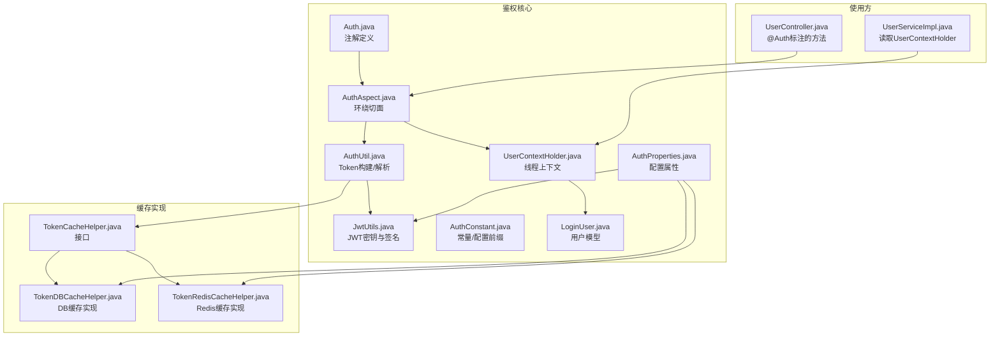
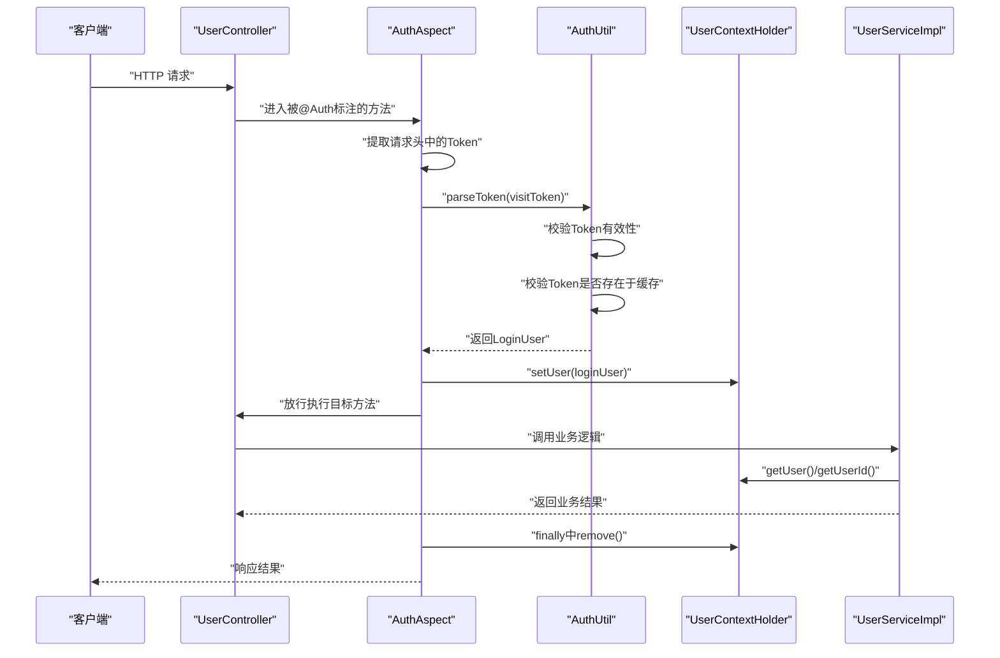
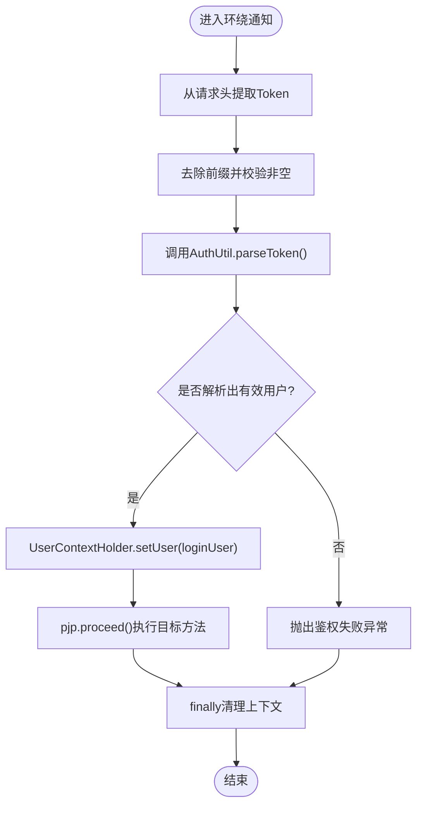
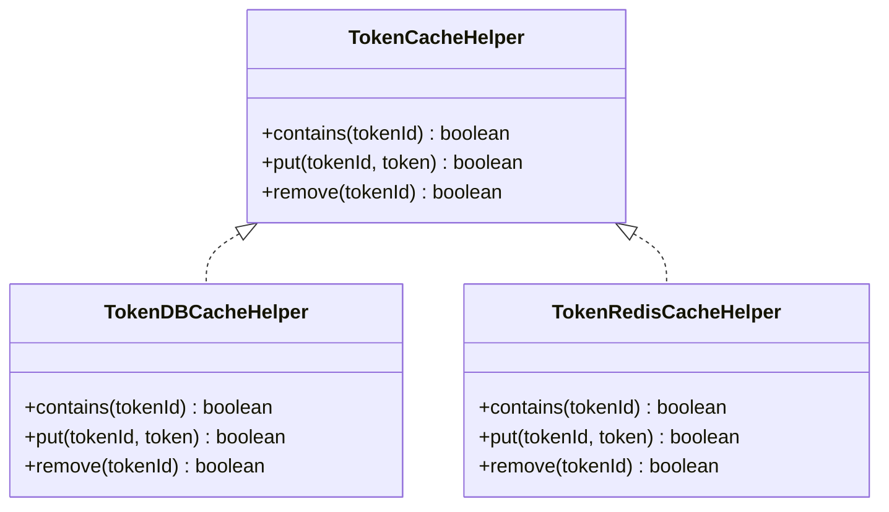
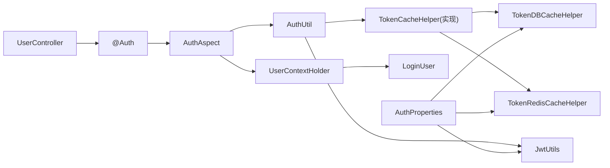

# 鉴权注解系统

<cite>
**本文引用的文件**
- [Auth.java](file://src/main/java/com/dw/admin/components/auth/Auth.java)
- [AuthAspect.java](file://src/main/java/com/dw/admin/components/auth/AuthAspect.java)
- [AuthConstant.java](file://src/main/java/com/dw/admin/components/auth/AuthConstant.java)
- [AuthProperties.java](file://src/main/java/com/dw/admin/components/auth/AuthProperties.java)
- [AuthUtil.java](file://src/main/java/com/dw/admin/components/auth/AuthUtil.java)
- [JwtUtils.java](file://src/main/java/com/dw/admin/components/auth/JwtUtils.java)
- [LoginUser.java](file://src/main/java/com/dw/admin/components/auth/LoginUser.java)
- [UserContextHolder.java](file://src/main/java/com/dw/admin/components/auth/UserContextHolder.java)
- [TokenCacheHelper.java](file://src/main/java/com/dw/admin/components/auth/TokenCacheHelper.java)
- [TokenRedisCacheHelper.java](file://src/main/java/com/dw/admin/components/auth/TokenRedisCacheHelper.java)
- [TokenDBCacheHelper.java](file://src/main/java/com/dw/admin/components/auth/TokenDBCacheHelper.java)
- [application.yml](file://src/main/resources/application.yml)
- [UserController.java](file://src/main/java/com/dw/admin/controller/UserController.java)
- [UserServiceImpl.java](file://src/main/java/com/dw/admin/service/impl/UserServiceImpl.java)
</cite>

## 目录
1. [简介](#简介)
2. [项目结构](#项目结构)
3. [核心组件](#核心组件)
4. [架构总览](#架构总览)
5. [详细组件分析](#详细组件分析)
6. [依赖关系分析](#依赖关系分析)
7. [性能考量](#性能考量)
8. [故障排查指南](#故障排查指南)
9. [结论](#结论)
10. [附录](#附录)

## 简介
本技术文档围绕“鉴权注解系统”展开，目标是帮助开发者快速理解与正确使用基于注解的鉴权机制，掌握切面实现原理、工作流程、执行顺序与优先级管理，并提供性能优化建议与常见问题诊断方案。系统通过在方法上添加鉴权注解，结合环绕切面完成 Token 提取、校验、用户信息注入与线程上下文清理，确保后续业务逻辑可安全地获取当前登录用户。

## 项目结构
鉴权相关代码集中在 components/auth 包内，配合控制器层的注解使用与服务层的上下文读取形成闭环；配置项通过 Spring Boot 的配置属性集中管理。

图表来源
- [Auth.java](file://src/main/java/com/dw/admin/components/auth/Auth.java#L1-L17)
- [AuthAspect.java](file://src/main/java/com/dw/admin/components/auth/AuthAspect.java#L1-L62)
- [AuthUtil.java](file://src/main/java/com/dw/admin/components/auth/AuthUtil.java#L1-L101)
- [JwtUtils.java](file://src/main/java/com/dw/admin/components/auth/JwtUtils.java#L1-L55)
- [AuthConstant.java](file://src/main/java/com/dw/admin/components/auth/AuthConstant.java#L1-L51)
- [AuthProperties.java](file://src/main/java/com/dw/admin/components/auth/AuthProperties.java#L1-L36)
- [UserContextHolder.java](file://src/main/java/com/dw/admin/components/auth/UserContextHolder.java#L1-L46)
- [LoginUser.java](file://src/main/java/com/dw/admin/components/auth/LoginUser.java#L1-L48)
- [TokenCacheHelper.java](file://src/main/java/com/dw/admin/components/auth/TokenCacheHelper.java#L1-L26)
- [TokenDBCacheHelper.java](file://src/main/java/com/dw/admin/components/auth/TokenDBCacheHelper.java#L1-L259)
- [TokenRedisCacheHelper.java](file://src/main/java/com/dw/admin/components/auth/TokenRedisCacheHelper.java#L1-L155)
- [UserController.java](file://src/main/java/com/dw/admin/controller/UserController.java#L90-L138)
- [UserServiceImpl.java](file://src/main/java/com/dw/admin/service/impl/UserServiceImpl.java#L175-L197)

章节来源
- [Auth.java](file://src/main/java/com/dw/admin/components/auth/Auth.java#L1-L17)
- [AuthAspect.java](file://src/main/java/com/dw/admin/components/auth/AuthAspect.java#L1-L62)
- [application.yml](file://src/main/resources/application.yml#L33-L36)

## 核心组件
- 注解定义：用于标记需要鉴权的方法，仅作用于方法级别。
- 切面实现：定义切入点与环绕通知，负责 Token 提取、校验、用户信息注入与线程上下文清理。
- 工具类：封装 JWT 构建与解析、Token 缓存交互。
- 上下文持有：提供线程本地存储，便于业务层读取当前登录用户。
- 缓存实现：支持 Redis 与 DB 两种存储后端，具备本地缓存与远程缓存双写/双查能力。
- 配置属性：集中管理开关、密钥、过期时间、缓存类型与定时清理策略。

章节来源
- [Auth.java](file://src/main/java/com/dw/admin/components/auth/Auth.java#L11-L16)
- [AuthAspect.java](file://src/main/java/com/dw/admin/components/auth/AuthAspect.java#L28-L59)
- [AuthUtil.java](file://src/main/java/com/dw/admin/components/auth/AuthUtil.java#L32-L98)
- [UserContextHolder.java](file://src/main/java/com/dw/admin/components/auth/UserContextHolder.java#L21-L43)
- [TokenCacheHelper.java](file://src/main/java/com/dw/admin/components/auth/TokenCacheHelper.java#L8-L25)
- [TokenDBCacheHelper.java](file://src/main/java/com/dw/admin/components/auth/TokenDBCacheHelper.java#L36-L133)
- [TokenRedisCacheHelper.java](file://src/main/java/com/dw/admin/components/auth/TokenRedisCacheHelper.java#L28-L86)
- [AuthProperties.java](file://src/main/java/com/dw/admin/components/auth/AuthProperties.java#L17-L34)

## 架构总览
鉴权系统采用“注解 + 切面 + 工具 + 缓存”的分层设计。请求进入控制器方法后，若该方法标注了鉴权注解，则由切面拦截并执行鉴权流程；成功后将用户信息写入线程上下文，供后续业务逻辑使用；最后在 finally 中清理上下文，避免内存泄漏。

图表来源
- [AuthAspect.java](file://src/main/java/com/dw/admin/components/auth/AuthAspect.java#L32-L59)
- [AuthUtil.java](file://src/main/java/com/dw/admin/components/auth/AuthUtil.java#L49-L71)
- [UserContextHolder.java](file://src/main/java/com/dw/admin/components/auth/UserContextHolder.java#L21-L33)
- [UserController.java](file://src/main/java/com/dw/admin/controller/UserController.java#L94-L123)
- [UserServiceImpl.java](file://src/main/java/com/dw/admin/service/impl/UserServiceImpl.java#L176-L196)

## 详细组件分析

### 注解 Auth 设计与使用
- 设计理念：零侵入式鉴权，通过注解标记方法，切面自动完成鉴权与上下文注入。
- 参数说明：当前注解无参数，未来可扩展如角色白名单、权限表达式等。
- 典型场景：登录后才能访问的接口（如退出登录、修改当前用户资料、管理员操作等）。

章节来源
- [Auth.java](file://src/main/java/com/dw/admin/components/auth/Auth.java#L11-L16)
- [UserController.java](file://src/main/java/com/dw/admin/controller/UserController.java#L60-L65)
- [UserController.java](file://src/main/java/com/dw/admin/controller/UserController.java#L83-L87)
- [UserController.java](file://src/main/java/com/dw/admin/controller/UserController.java#L94-L100)
- [UserController.java](file://src/main/java/com/dw/admin/controller/UserController.java#L117-L123)
- [UserController.java](file://src/main/java/com/dw/admin/controller/UserController.java#L129-L135)

### 切面 AuthAspect 实现原理
- 切入点定义：匹配带有 Auth 注解的方法。
- 环绕通知：在目标方法前后执行统一逻辑，保证异常时也能清理上下文。
- 异常处理：统一抛出业务异常，错误消息固定为鉴权失败。
- 执行顺序：通过 Order 指定优先级，确保在更早阶段完成鉴权。

图表来源
- [AuthAspect.java](file://src/main/java/com/dw/admin/components/auth/AuthAspect.java#L32-L59)

章节来源
- [AuthAspect.java](file://src/main/java/com/dw/admin/components/auth/AuthAspect.java#L28-L59)
- [AuthConstant.java](file://src/main/java/com/dw/admin/components/auth/AuthConstant.java#L17-L22)
- [AuthConstant.java](file://src/main/java/com/dw/admin/components/auth/AuthConstant.java#L18)

### Token 提取与校验流程
- 请求头键名与前缀：Authorization 与 Bearer 前缀。
- 解析步骤：去前缀、判空、JWT 解析、用户信息反序列化、缓存存在性校验。
- 失败处理：任何环节异常均视为鉴权失败。

章节来源
- [AuthAspect.java](file://src/main/java/com/dw/admin/components/auth/AuthAspect.java#L38-L49)
- [AuthConstant.java](file://src/main/java/com/dw/admin/components/auth/AuthConstant.java#L20-L22)
- [AuthUtil.java](file://src/main/java/com/dw/admin/components/auth/AuthUtil.java#L49-L71)

### 用户信息注入与线程上下文
- 注入时机：鉴权成功后设置到线程本地变量。
- 读取方式：业务层直接从 UserContextHolder 获取当前用户或用户ID。
- 清理策略：finally 中移除，避免线程复用导致的数据泄露。

章节来源
- [AuthAspect.java](file://src/main/java/com/dw/admin/components/auth/AuthAspect.java#L52-L58)
- [UserContextHolder.java](file://src/main/java/com/dw/admin/components/auth/UserContextHolder.java#L21-L43)
- [UserServiceImpl.java](file://src/main/java/com/dw/admin/service/impl/UserServiceImpl.java#L176-L196)

### Token 缓存与存储后端
- 接口抽象：TokenCacheHelper 统一 contains/put/remove。
- DB 实现：本地缓存 + MySQL 表，启动初始化表结构，按配置的 Cron 定时清理过期记录。
- Redis 实现：本地缓存 + Redis，双写双查，提升命中率与可用性。
- 选择依据：通过配置项切换缓存类型，默认 DB。

图表来源
- [TokenCacheHelper.java](file://src/main/java/com/dw/admin/components/auth/TokenCacheHelper.java#L8-L25)
- [TokenDBCacheHelper.java](file://src/main/java/com/dw/admin/components/auth/TokenDBCacheHelper.java#L36-L133)
- [TokenRedisCacheHelper.java](file://src/main/java/com/dw/admin/components/auth/TokenRedisCacheHelper.java#L28-L86)

章节来源
- [TokenCacheHelper.java](file://src/main/java/com/dw/admin/components/auth/TokenCacheHelper.java#L8-L25)
- [TokenDBCacheHelper.java](file://src/main/java/com/dw/admin/components/auth/TokenDBCacheHelper.java#L36-L133)
- [TokenRedisCacheHelper.java](file://src/main/java/com/dw/admin/components/auth/TokenRedisCacheHelper.java#L28-L86)

### JWT 密钥与签名
- 密钥来源：从配置属性读取，为空则抛出运行时异常。
- 构建与解析：基于 HMAC-SHA 签名，Claims 中携带 LoginUser 序列化后的字符串。

章节来源
- [JwtUtils.java](file://src/main/java/com/dw/admin/components/auth/JwtUtils.java#L20-L29)
- [JwtUtils.java](file://src/main/java/com/dw/admin/components/auth/JwtUtils.java#L38-L51)
- [AuthUtil.java](file://src/main/java/com/dw/admin/components/auth/AuthUtil.java#L32-L41)

### 配置项与默认值
- 开关：enable，默认开启。
- 密钥：secret，默认值见常量。
- 过期时间：expireTime，默认 24 小时。
- 缓存类型：cache-type，默认 DB。
- 定时清理：cleanDBCacheCron，默认每日凌晨清理。

章节来源
- [AuthProperties.java](file://src/main/java/com/dw/admin/components/auth/AuthProperties.java#L20-L34)
- [AuthConstant.java](file://src/main/java/com/dw/admin/components/auth/AuthConstant.java#L28-L32)
- [AuthConstant.java](file://src/main/java/com/dw/admin/components/auth/AuthConstant.java#L40-L41)
- [application.yml](file://src/main/resources/application.yml#L34-L36)

## 依赖关系分析
- 控制器层对切面的依赖：通过注解触发。
- 切面对工具与上下文的依赖：鉴权流程的核心依赖。
- 工具对缓存实现的依赖：通过 Spring 上下文获取具体实现。
- 配置对工具与缓存的影响：决定密钥、过期时间与缓存类型。

图表来源
- [UserController.java](file://src/main/java/com/dw/admin/controller/UserController.java#L94-L123)
- [AuthAspect.java](file://src/main/java/com/dw/admin/components/auth/AuthAspect.java#L32-L59)
- [AuthUtil.java](file://src/main/java/com/dw/admin/components/auth/AuthUtil.java#L19-L23)
- [TokenCacheHelper.java](file://src/main/java/com/dw/admin/components/auth/TokenCacheHelper.java#L8-L25)
- [TokenDBCacheHelper.java](file://src/main/java/com/dw/admin/components/auth/TokenDBCacheHelper.java#L36-L133)
- [TokenRedisCacheHelper.java](file://src/main/java/com/dw/admin/components/auth/TokenRedisCacheHelper.java#L28-L86)
- [JwtUtils.java](file://src/main/java/com/dw/admin/components/auth/JwtUtils.java#L20-L29)
- [AuthProperties.java](file://src/main/java/com/dw/admin/components/auth/AuthProperties.java#L17-L34)

章节来源
- [AuthAspect.java](file://src/main/java/com/dw/admin/components/auth/AuthAspect.java#L25-L25)
- [AuthConstant.java](file://src/main/java/com/dw/admin/components/auth/AuthConstant.java#L18)

## 性能考量
- 缓存命中路径：本地缓存优先，其次远程缓存，减少数据库/Redis访问延迟。
- 本地缓存参数：最大容量、并发度、过期时间与远端过期时间一致，降低重复校验成本。
- 线程安全：使用可在线程间传递的上下文容器，避免跨线程数据污染。
- 定时清理：DB 后端按 Cron 定时清理过期记录，降低查询压力。
- 建议优化：
  - 在高并发场景启用 Redis 后端以降低数据库压力。
  - 合理设置过期时间与本地缓存大小，平衡内存占用与命中率。
  - 对热点接口进行压测，观察切面耗时占比，必要时引入异步清理或批量校验。

章节来源
- [TokenDBCacheHelper.java](file://src/main/java/com/dw/admin/components/auth/TokenDBCacheHelper.java#L83-L87)
- [TokenDBCacheHelper.java](file://src/main/java/com/dw/admin/components/auth/TokenDBCacheHelper.java#L220-L241)
- [TokenRedisCacheHelper.java](file://src/main/java/com/dw/admin/components/auth/TokenRedisCacheHelper.java#L41-L47)
- [AuthProperties.java](file://src/main/java/com/dw/admin/components/auth/AuthProperties.java#L29-L30)

## 故障排查指南
- 现象：鉴权失败
  - 可能原因：请求头未携带 Authorization 或格式不正确（缺少 Bearer 前缀）。
  - 处理建议：确认前端按规范拼接请求头；检查切面是否正确去除前缀。
  - 参考路径：[AuthAspect.java](file://src/main/java/com/dw/admin/components/auth/AuthAspect.java#L38-L49)
- 现象：Token 解析异常
  - 可能原因：密钥不一致、Token 被篡改或过期。
  - 处理建议：核对配置密钥；检查过期时间；确认签名算法一致。
  - 参考路径：[JwtUtils.java](file://src/main/java/com/dw/admin/components/auth/JwtUtils.java#L20-L29), [AuthUtil.java](file://src/main/java/com/dw/admin/components/auth/AuthUtil.java#L49-L71)
- 现象：Token 校验失败
  - 可能原因：Token 不存在于缓存（DB/Redis）。
  - 处理建议：检查缓存后端连通性与数据；确认清理任务正常执行。
  - 参考路径：[AuthUtil.java](file://src/main/java/com/dw/admin/components/auth/AuthUtil.java#L49-L55), [TokenDBCacheHelper.java](file://src/main/java/com/dw/admin/components/auth/TokenDBCacheHelper.java#L102-L133), [TokenRedisCacheHelper.java](file://src/main/java/com/dw/admin/components/auth/TokenRedisCacheHelper.java#L56-L86)
- 现象：上下文未清理
  - 可能原因：异常中断导致 finally 未执行。
  - 处理建议：确保切面 finally 逻辑未被覆盖；排查全局异常处理器是否吞掉异常。
  - 参考路径：[AuthAspect.java](file://src/main/java/com/dw/admin/components/auth/AuthAspect.java#L55-L58)
- 现象：DB 缓存未清理
  - 可能原因：Cron 表达式为空或调度器未初始化。
  - 处理建议：检查配置项；查看日志初始化信息。
  - 参考路径：[AuthProperties.java](file://src/main/java/com/dw/admin/components/auth/AuthProperties.java#L33), [TokenDBCacheHelper.java](file://src/main/java/com/dw/admin/components/auth/TokenDBCacheHelper.java#L220-L241)

章节来源
- [AuthAspect.java](file://src/main/java/com/dw/admin/components/auth/AuthAspect.java#L38-L59)
- [JwtUtils.java](file://src/main/java/com/dw/admin/components/auth/JwtUtils.java#L20-L29)
- [AuthUtil.java](file://src/main/java/com/dw/admin/components/auth/AuthUtil.java#L49-L71)
- [TokenDBCacheHelper.java](file://src/main/java/com/dw/admin/components/auth/TokenDBCacheHelper.java#L102-L133)
- [TokenRedisCacheHelper.java](file://src/main/java/com/dw/admin/components/auth/TokenRedisCacheHelper.java#L56-L86)
- [AuthProperties.java](file://src/main/java/com/dw/admin/components/auth/AuthProperties.java#L33)

## 结论
该鉴权注解系统通过简洁的注解与环绕切面实现了统一的鉴权入口，结合本地+远程缓存提升了性能与可靠性。通过合理的配置与缓存策略，可在保证安全性的同时满足高并发场景下的性能需求。建议在生产环境中优先启用 Redis 后端，并持续监控切面耗时与缓存命中情况，以获得最佳效果。

## 附录
- 最佳实践
  - 前端统一使用 Bearer 前缀拼接 Token。
  - 为不同环境配置独立密钥，避免跨环境混淆。
  - 对管理员敏感接口同时使用鉴权与权限注解。
  - 定期评估过期时间与缓存大小，结合业务峰值调整。
- 常用配置参考
  - 缓存类型：DB 或 Redis
  - 密钥：自定义强口令
  - 过期时间：根据业务设定
  - 定时清理：按需调整 Cron

章节来源
- [application.yml](file://src/main/resources/application.yml#L34-L36)
- [AuthProperties.java](file://src/main/java/com/dw/admin/components/auth/AuthProperties.java#L20-L34)
- [AuthConstant.java](file://src/main/java/com/dw/admin/components/auth/AuthConstant.java#L40-L41)