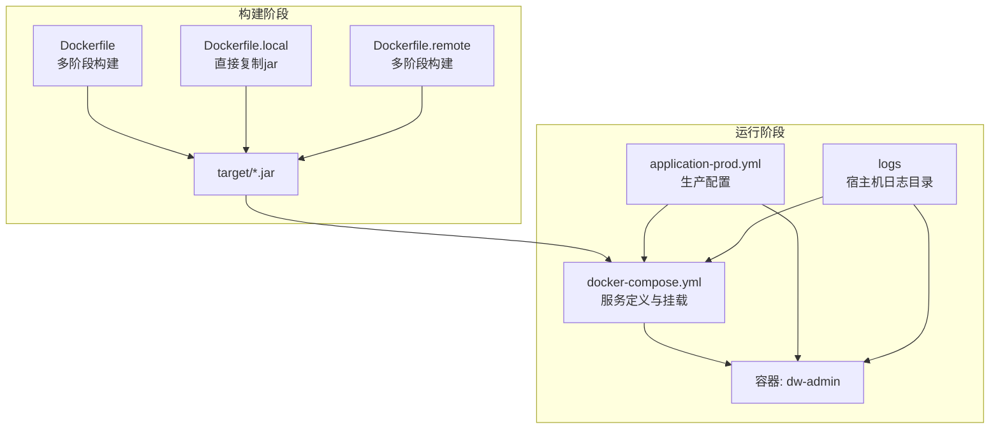
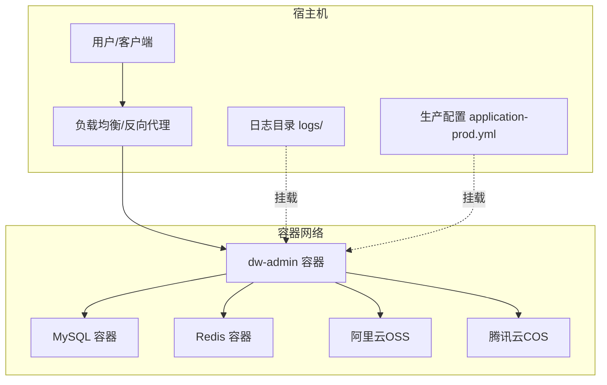
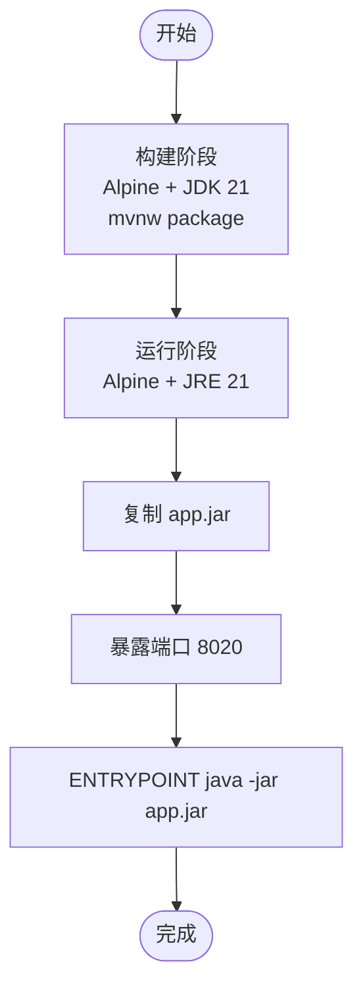
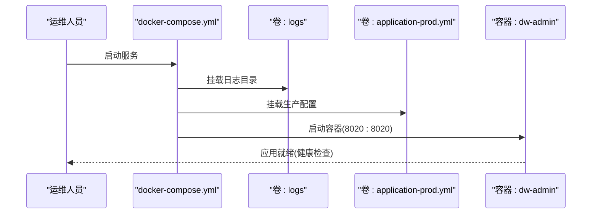
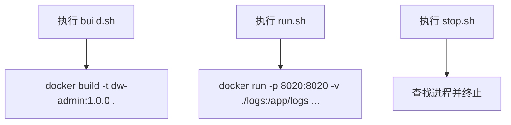
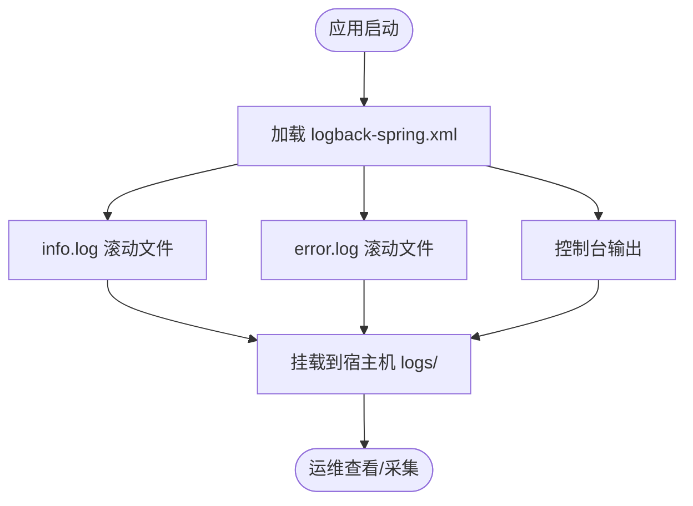
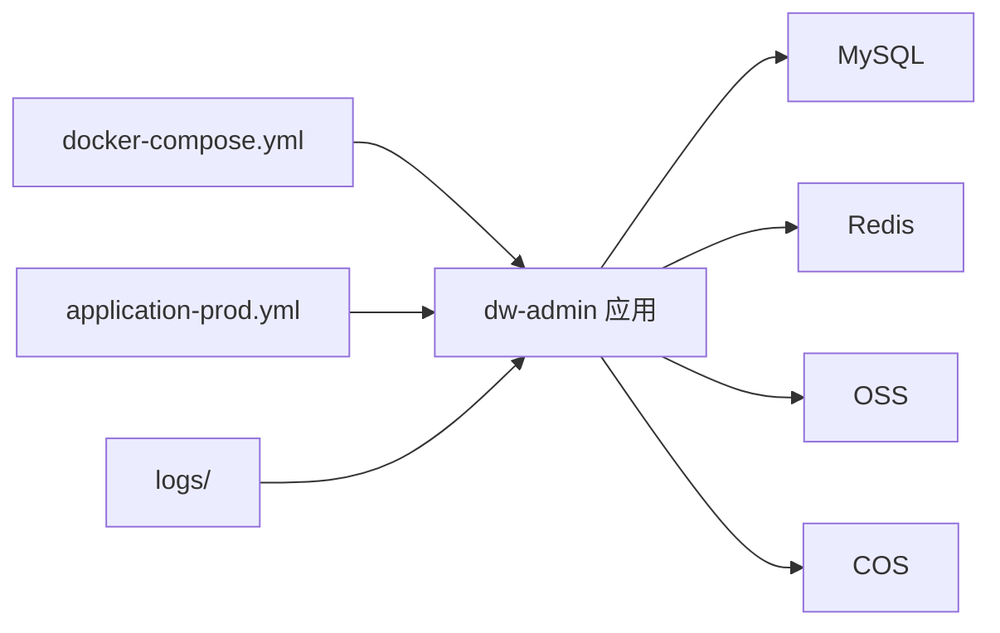

# 部署运维

<cite>
**本文引用的文件**
- [Dockerfile](file://Dockerfile)
- [Dockerfile.local](file://Dockerfile.local)
- [Dockerfile.remote](file://Dockerfile.remote)
- [docker-compose.yml](file://docker-compose.yml)
- [build.sh](file://build.sh)
- [run.sh](file://run.sh)
- [stop.sh](file://stop.sh)
- [.dockerignore](file://.dockerignore)
- [application.yml](file://src/main/resources/application.yml)
- [application-dev.yml](file://src/main/resources/application-dev.yml)
- [application-prod.yml](file://src/main/resources/application-prod.yml)
- [logback-spring.xml](file://src/main/resources/logback/logback-spring.xml)
- [AuthProperties.java](file://src/main/java/com/dw/admin/components/auth/AuthProperties.java)
- [JwtUtils.java](file://src/main/java/com/dw/admin/components/auth/JwtUtils.java)
- [AuthConstant.java](file://src/main/java/com/dw/admin/components/auth/AuthConstant.java)
- [AGENTS.md](file://AGENTS.md)
- [技术架构图.md](file://docs/技术架构图.md)
- [双重云存储支持设计方案.md](file://docs/双重云存储支持设计方案.md)
- [init_ddl.sql](file://docs/sql/init_ddl.sql)
</cite>

## 目录
1. [简介](#简介)
2. [项目结构](#项目结构)
3. [核心组件](#核心组件)
4. [架构总览](#架构总览)
5. [详细组件分析](#详细组件分析)
6. [依赖分析](#依赖分析)
7. [性能考量](#性能考量)
8. [故障排查指南](#故障排查指南)
9. [结论](#结论)
10. [附录](#附录)

## 简介
本文件面向运维工程师，提供一套完整的容器化部署与运维指南。内容覆盖Docker镜像构建与优化、docker-compose编排与依赖、构建与运行脚本、环境变量与敏感信息管理、日志与监控指标、生产最佳实践与安全考虑、高可用与负载均衡方案、容器资源限制与性能调优等。所有说明均基于仓库现有文件进行分析与提炼，确保可落地执行。

## 项目结构
该工程采用Spring Boot + Maven的标准Java项目结构，并配套Docker容器化与编排能力。关键部署相关文件分布如下：
- Docker镜像构建：Dockerfile、Dockerfile.local、Dockerfile.remote
- 编排与运行：docker-compose.yml、build.sh、run.sh、stop.sh
- 配置与环境：application.yml、application-dev.yml、application-prod.yml
- 日志：logback-spring.xml
- 敏感配置与组件：AuthProperties、JwtUtils、AuthConstant
- 文档与脚本：AGENTS.md、技术架构图.md、双重云存储支持设计方案.md、init_ddl.sql

图表来源
- [Dockerfile](file://Dockerfile#L1-L19)
- [Dockerfile.local](file://Dockerfile.local#L1-L16)
- [Dockerfile.remote](file://Dockerfile.remote#L1-L19)
- [docker-compose.yml](file://docker-compose.yml#L1-L27)
- [application-prod.yml](file://src/main/resources/application-prod.yml#L1-L71)

章节来源
- [Dockerfile](file://Dockerfile#L1-L19)
- [Dockerfile.local](file://Dockerfile.local#L1-L16)
- [Dockerfile.remote](file://Dockerfile.remote#L1-L19)
- [docker-compose.yml](file://docker-compose.yml#L1-L27)
- [application.yml](file://src/main/resources/application.yml#L1-L64)
- [application-dev.yml](file://src/main/resources/application-dev.yml#L1-L88)
- [application-prod.yml](file://src/main/resources/application-prod.yml#L1-L71)

## 核心组件
- 镜像构建组件
  - 多阶段构建：在builder阶段使用Alpine JDK 21编译打包，在runtime阶段仅保留JRE，减小镜像体积并提升安全性。
  - 本地构建：直接复制target目录下的jar到镜像，适合已有制品场景。
  - 远程构建：与多阶段构建一致，便于CI集成。
- 编排组件
  - docker-compose定义服务、端口映射、卷挂载、环境变量、重启策略等。
  - 支持挂载生产配置文件与日志目录，便于生产运维。
- 配置组件
  - application.yml为主配置，application-dev.yml与application-prod.yml分别用于开发与生产环境。
  - 日志配置由logback-spring.xml集中管理，支持滚动策略与多文件输出。
- 安全与认证组件
  - JWT密钥与缓存类型通过AuthProperties与JwtUtils注入，支持DB/Redis两种Token缓存策略。
- 运维脚本
  - build.sh：构建镜像。
  - run.sh：快速运行容器（本地开发）。
  - stop.sh：优雅停止Spring Boot进程（本地开发）。
- 排障与忽略
  - .dockerignore排除IDE、日志、数据目录等，避免污染镜像。

章节来源
- [Dockerfile](file://Dockerfile#L1-L19)
- [Dockerfile.local](file://Dockerfile.local#L1-L16)
- [Dockerfile.remote](file://Dockerfile.remote#L1-L19)
- [docker-compose.yml](file://docker-compose.yml#L1-L27)
- [application.yml](file://src/main/resources/application.yml#L1-L64)
- [application-dev.yml](file://src/main/resources/application-dev.yml#L1-L88)
- [application-prod.yml](file://src/main/resources/application-prod.yml#L1-L71)
- [logback-spring.xml](file://src/main/resources/logback/logback-spring.xml#L1-L72)
- [AuthProperties.java](file://src/main/java/com/dw/admin/components/auth/AuthProperties.java#L1-L35)
- [JwtUtils.java](file://src/main/java/com/dw/admin/components/auth/JwtUtils.java#L1-L54)
- [AuthConstant.java](file://src/main/java/com/dw/admin/components/auth/AuthConstant.java#L1-L50)
- [build.sh](file://build.sh#L1-L5)
- [run.sh](file://run.sh#L1-L5)
- [stop.sh](file://stop.sh#L1-L34)
- [.dockerignore](file://.dockerignore#L1-L8)

## 架构总览
下图展示容器化部署的整体架构：Spring Boot应用容器、MySQL数据库、Redis缓存、对象存储（OSS/COS），以及日志与配置的挂载关系。

图表来源
- [docker-compose.yml](file://docker-compose.yml#L1-L27)
- [application-prod.yml](file://src/main/resources/application-prod.yml#L1-L71)
- [技术架构图.md](file://docs/技术架构图.md#L5-L110)

## 详细组件分析

### Dockerfile 多阶段构建分析
- 构建阶段
  - 基础镜像：Alpine + JDK 21，WORKDIR=/build。
  - 拷贝源码，使用Maven Wrapper执行打包，跳过测试以加速构建。
- 运行阶段
  - 基础镜像：Alpine + JRE 21，WORKDIR=/app。
  - 从builder阶段复制jar至app.jar，暴露端口8020，入口命令为java -jar app.jar。
- 优点
  - 减少镜像层数与体积；仅运行时包含JRE，降低攻击面。
- 建议
  - 在CI中缓存依赖层，进一步缩短构建时间。
  - 使用只读根文件系统与非root用户运行（需配合Dockerfile与安全策略）。

图表来源
- [Dockerfile](file://Dockerfile#L1-L19)

章节来源
- [Dockerfile](file://Dockerfile#L1-L19)

### docker-compose 编排与依赖关系
- 服务定义
  - 容器名：dw-admin；镜像：ghcr.io/dawei1898/dw-admin:latest。
  - 端口映射：8020:8020。
  - 卷挂载：./logs -> /app/logs；./application-prod.yml -> /app/application-prod.yml。
  - 环境变量：TZ=Asia/Shanghai；SPRING_PROFILES_ACTIVE=prod。
  - 重启策略：on-failure:5。
  - 工作目录：/app。
- 依赖关系
  - 应用启动依赖MySQL与Redis（由外部服务提供）。
  - 日志与配置通过卷挂载持久化与动态生效。
- 建议
  - 将MySQL与Redis纳入同一compose文件，形成完整栈。
  - 使用healthcheck检测应用健康状态，结合重启策略实现自愈。

图表来源
- [docker-compose.yml](file://docker-compose.yml#L1-L27)

章节来源
- [docker-compose.yml](file://docker-compose.yml#L1-L27)

### 构建与运行脚本
- build.sh
  - 功能：构建镜像，标签为dw-admin:1.0.0。
  - 使用：在项目根目录执行，确保Docker守护进程运行。
- run.sh
  - 功能：本地快速运行容器，端口映射8020:8020，挂载日志目录，设置时区，设置Spring Profile为dev。
  - 使用：适用于本地开发调试。
- stop.sh
  - 功能：查找并优雅终止Spring Boot进程，若无法正常终止则强制终止。
  - 使用：本地开发环境停止应用。

图表来源
- [build.sh](file://build.sh#L1-L5)
- [run.sh](file://run.sh#L1-L5)
- [stop.sh](file://stop.sh#L1-L34)

章节来源
- [build.sh](file://build.sh#L1-L5)
- [run.sh](file://run.sh#L1-L5)
- [stop.sh](file://stop.sh#L1-L34)

### 环境变量与敏感信息管理
- 环境变量
  - 时区：TZ=Asia/Shanghai。
  - Spring Profile：SPRING_PROFILES_ACTIVE=prod（在compose中设置）。
- 敏感信息
  - 数据库连接：用户名、密码（生产环境建议通过环境变量或配置中心注入）。
  - Redis连接：地址、密码（建议通过环境变量或密钥管理服务）。
  - JWT密钥：dwa.auth.secret（建议使用强随机值并通过环境变量注入）。
  - 云存储密钥：阿里云OSS与腾讯云COS的secret等。
- 最佳实践
  - 生产环境不将敏感信息硬编码在镜像或配置文件中。
  - 使用环境变量或Kubernetes Secret/外部配置中心（如Vault）注入。
  - 定期轮换密钥与密码，最小权限原则。

章节来源
- [docker-compose.yml](file://docker-compose.yml#L24-L27)
- [application-prod.yml](file://src/main/resources/application-prod.yml#L7-L14)
- [application-dev.yml](file://src/main/resources/application-dev.yml#L7-L17)
- [AuthProperties.java](file://src/main/java/com/dw/admin/components/auth/AuthProperties.java#L1-L35)
- [JwtUtils.java](file://src/main/java/com/dw/admin/components/auth/JwtUtils.java#L1-L54)
- [AuthConstant.java](file://src/main/java/com/dw/admin/components/auth/AuthConstant.java#L1-L50)
- [AGENTS.md](file://AGENTS.md#L161-L168)

### 日志管理与监控指标
- 日志配置
  - 输出到/app/logs目录，支持控制台、info与error滚动文件输出。
  - 滚动策略：按日期与大小滚动，保留历史与总容量上限。
- 监控指标
  - Spring Boot Actuator：在生产配置中暴露health端点，便于健康检查。
  - 建议：结合Prometheus/Grafana采集JVM与应用指标，接入日志收集系统（如ELK/Fluentd）。

图表来源
- [logback-spring.xml](file://src/main/resources/logback/logback-spring.xml#L1-L72)
- [docker-compose.yml](file://docker-compose.yml#L19-L21)

章节来源
- [logback-spring.xml](file://src/main/resources/logback/logback-spring.xml#L1-L72)
- [application-prod.yml](file://src/main/resources/application-prod.yml#L31-L41)
- [docker-compose.yml](file://docker-compose.yml#L19-L21)

### 高可用与负载均衡
- 负载均衡
  - 建议在容器前部署Nginx或HAProxy，实现请求分发与会话保持。
  - 结合健康检查，自动摘除不健康实例。
- 高可用
  - 多实例部署：通过副本数与滚动升级实现零停机。
  - 数据与缓存：MySQL主从/集群、Redis哨兵/集群，确保高可用。
  - 配置与日志：通过共享存储或集中式配置中心与日志系统，保证一致性。

章节来源
- [docker-compose.yml](file://docker-compose.yml#L1-L27)
- [application-prod.yml](file://src/main/resources/application-prod.yml#L7-L14)
- [技术架构图.md](file://docs/技术架构图.md#L5-L110)

### 容器资源限制与性能调优
- 资源限制
  - CPU/内存配额：在docker-compose中设置deploy.resources.limits。
  - JVM参数：通过JAVA_TOOL_OPTIONS或spring-boot插件传递JVM参数，控制堆大小与GC策略。
- 性能调优
  - 连接池：合理设置HikariCP的最大连接数与空闲数。
  - 缓存：Redis作为Token与权限缓存，减少数据库压力。
  - IO：日志与数据目录挂载到高性能磁盘，避免容器内文件系统瓶颈。

章节来源
- [application.yml](file://src/main/resources/application.yml#L14-L16)
- [application-dev.yml](file://src/main/resources/application-dev.yml#L15-L17)
- [application-prod.yml](file://src/main/resources/application-prod.yml#L12-L14)
- [docker-compose.yml](file://docker-compose.yml#L1-L27)

## 依赖分析
- 组件耦合
  - 应用对MySQL与Redis存在强依赖；对云存储（OSS/COS）为弱依赖，可通过配置切换。
  - 配置通过Spring Profile与卷挂载实现动态切换。
- 外部依赖
  - 基础镜像：eclipse-temurin:21-jre-alpine-3.23。
  - 数据库与缓存：外部服务（由运维提供）。
- 循环依赖
  - 当前无明显循环依赖；认证组件通过配置类注入密钥，避免循环引用。

图表来源
- [docker-compose.yml](file://docker-compose.yml#L1-L27)
- [application-prod.yml](file://src/main/resources/application-prod.yml#L1-L71)

章节来源
- [docker-compose.yml](file://docker-compose.yml#L1-L27)
- [application-prod.yml](file://src/main/resources/application-prod.yml#L1-L71)

## 性能考量
- 镜像体积与启动速度
  - 多阶段构建减少镜像体积，缩短拉取与启动时间。
  - CI缓存Maven依赖，提升重复构建效率。
- 应用性能
  - 合理设置数据库连接池大小与超时。
  - 使用Redis缓存热点数据，降低DB压力。
  - 启用压缩与合理的multipart大小限制，避免内存溢出。
- 日志与IO
  - 滚动策略避免单文件过大；将日志目录挂载到高性能存储。
- 网络与安全
  - 仅暴露必要端口；通过反向代理与防火墙限制访问。
  - 使用HTTPS与强密钥，定期轮换。

章节来源
- [Dockerfile](file://Dockerfile#L1-L19)
- [application.yml](file://src/main/resources/application.yml#L14-L20)
- [application-dev.yml](file://src/main/resources/application-dev.yml#L15-L23)
- [application-prod.yml](file://src/main/resources/application-prod.yml#L12-L18)
- [logback-spring.xml](file://src/main/resources/logback/logback-spring.xml#L27-L37)

## 故障排查指南
- 应用无法启动
  - 检查端口占用与防火墙；确认8020端口映射正确。
  - 查看容器日志：docker-compose logs dw-admin。
  - 确认application-prod.yml挂载与Spring Profile设置。
- 数据库连接失败
  - 核对数据库URL、用户名、密码；确保网络可达。
  - 参考初始化脚本初始化数据库结构。
- Redis连接失败
  - 核对Redis地址与密码；确认网络连通性。
- 日志为空或过大
  - 检查日志目录挂载；确认滚动策略与磁盘空间。
- 停止应用
  - 使用stop.sh停止本地进程；如需强制终止，检查进程ID并手动kill。

章节来源
- [docker-compose.yml](file://docker-compose.yml#L1-L27)
- [application-prod.yml](file://src/main/resources/application-prod.yml#L7-L14)
- [logback-spring.xml](file://src/main/resources/logback/logback-spring.xml#L27-L37)
- [stop.sh](file://stop.sh#L1-L34)
- [init_ddl.sql](file://docs/sql/init_ddl.sql#L1-L200)

## 结论
本指南基于仓库现有文件，提供了从镜像构建、编排部署、配置与安全、日志与监控、高可用与负载均衡到性能调优的完整运维路径。建议在生产环境中结合外部数据库与缓存服务，通过环境变量与配置中心管理敏感信息，配合健康检查与滚动升级实现稳定可靠的线上运行。

## 附录
- 初始化数据库
  - 使用提供的SQL脚本初始化数据库结构。
- 云存储配置
  - 可通过配置切换阿里云OSS或腾讯云COS，或使用本地存储。
- 认证与权限
  - JWT密钥与Token缓存策略可按需调整，建议生产使用Redis缓存并定期轮换密钥。

章节来源
- [init_ddl.sql](file://docs/sql/init_ddl.sql#L1-L200)
- [application-prod.yml](file://src/main/resources/application-prod.yml#L52-L71)
- [AuthProperties.java](file://src/main/java/com/dw/admin/components/auth/AuthProperties.java#L1-L35)
- [JwtUtils.java](file://src/main/java/com/dw/admin/components/auth/JwtUtils.java#L1-L54)
- [AGENTS.md](file://AGENTS.md#L161-L168)