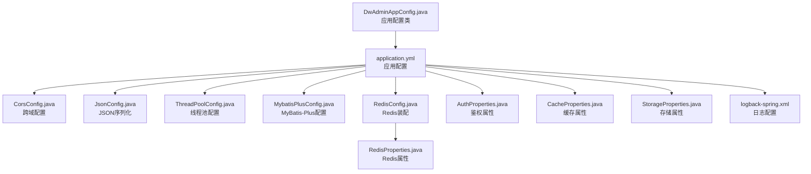
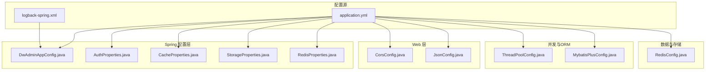
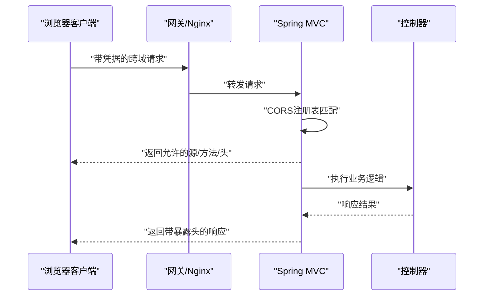
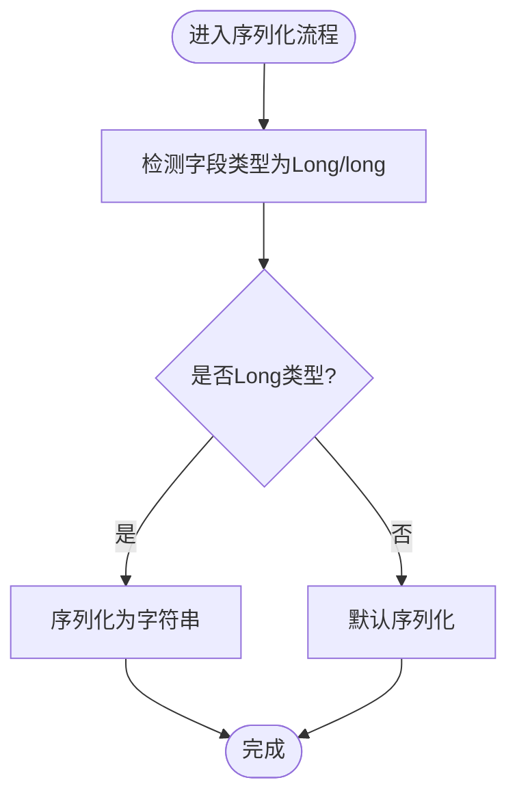
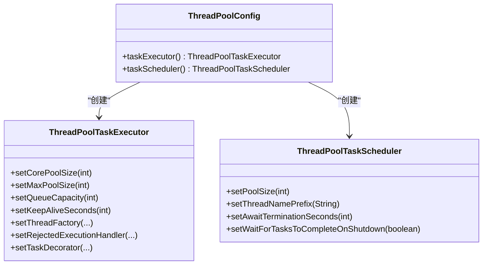
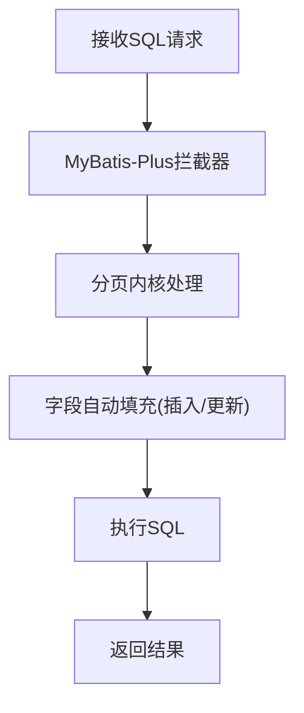
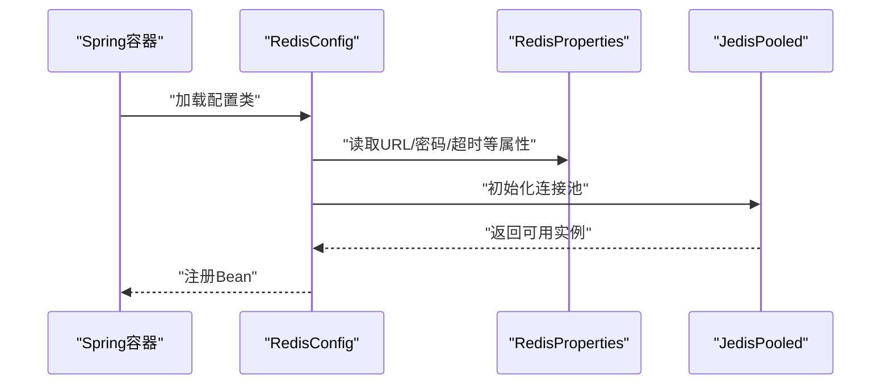
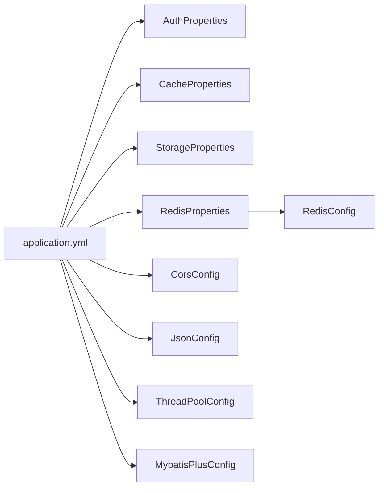

# 配置管理

<cite>
**本文引用的文件**
- [application.yml](file://src/main/resources/application.yml)
- [logback-spring.xml](file://src/main/resources/logback/logback-spring.xml)
- [CorsConfig.java](file://src/main/java/com/dw/admin/config/CorsConfig.java)
- [JsonConfig.java](file://src/main/java/com/dw/admin/config/JsonConfig.java)
- [ThreadPoolConfig.java](file://src/main/java/com/dw/admin/config/ThreadPoolConfig.java)
- [DwAdminAppConfig.java](file://src/main/java/com/dw/admin/config/DwAdminAppConfig.java)
- [MybatisPlusConfig.java](file://src/main/java/com/dw/admin/config/MybatisPlusConfig.java)
- [RedisConfig.java](file://src/main/java/com/dw/admin/components/redis/RedisConfig.java)
- [RedisProperties.java](file://src/main/java/com/dw/admin/components/redis/RedisProperties.java)
- [AuthProperties.java](file://src/main/java/com/dw/admin/components/auth/AuthProperties.java)
- [CacheProperties.java](file://src/main/java/com/dw/admin/components/cache/CacheProperties.java)
- [StorageProperties.java](file://src/main/java/com/dw/admin/components/storage/StorageProperties.java)
</cite>

## 目录
1. [简介](#简介)
2. [项目结构](#项目结构)
3. [核心组件](#核心组件)
4. [架构总览](#架构总览)
5. [详细组件分析](#详细组件分析)
6. [依赖关系分析](#依赖关系分析)
7. [性能考量](#性能考量)
8. [故障排查指南](#故障排查指南)
9. [结论](#结论)
10. [附录](#附录)

## 简介
本文件为配置管理系统的完整技术文档，覆盖以下主题：
- Spring Boot 配置文件结构与属性含义
- 跨域配置的实现与安全注意事项
- JSON 序列化与反序列化策略
- 线程池参数调优与性能影响
- 应用配置类的作用与扩展方式
- 多环境配置管理最佳实践
- 配置热更新与动态配置方案
- 配置安全与敏感信息保护

## 项目结构
该系统采用标准 Spring Boot 结构，配置相关的核心位置如下：
- 应用级配置：application.yml
- 日志配置：logback-spring.xml
- Web 配置：CorsConfig.java、JsonConfig.java
- 并发与调度：ThreadPoolConfig.java
- ORM 与插件：MybatisPlusConfig.java
- 组件属性绑定：AuthProperties.java、CacheProperties.java、StorageProperties.java、RedisProperties.java
- 组件装配：RedisConfig.java
- 应用配置类：DwAdminAppConfig.java

图表来源
- [application.yml](file://src/main/resources/application.yml#L1-L64)
- [CorsConfig.java](file://src/main/java/com/dw/admin/config/CorsConfig.java#L1-L26)
- [JsonConfig.java](file://src/main/java/com/dw/admin/config/JsonConfig.java#L1-L28)
- [ThreadPoolConfig.java](file://src/main/java/com/dw/admin/config/ThreadPoolConfig.java#L1-L61)
- [MybatisPlusConfig.java](file://src/main/java/com/dw/admin/config/MybatisPlusConfig.java#L1-L53)
- [RedisConfig.java](file://src/main/java/com/dw/admin/components/redis/RedisConfig.java#L1-L63)
- [RedisProperties.java](file://src/main/java/com/dw/admin/components/redis/RedisProperties.java)
- [AuthProperties.java](file://src/main/java/com/dw/admin/components/auth/AuthProperties.java#L1-L36)
- [CacheProperties.java](file://src/main/java/com/dw/admin/components/cache/CacheProperties.java#L1-L29)
- [StorageProperties.java](file://src/main/java/com/dw/admin/components/storage/StorageProperties.java#L1-L82)
- [logback-spring.xml](file://src/main/resources/logback/logback-spring.xml#L1-L72)
- [DwAdminAppConfig.java](file://src/main/java/com/dw/admin/config/DwAdminAppConfig.java#L1-L20)

章节来源
- [application.yml](file://src/main/resources/application.yml#L1-L64)
- [logback-spring.xml](file://src/main/resources/logback/logback-spring.xml#L1-L72)

## 核心组件
- 应用配置类：用于承载全局配置项，便于在业务层注入使用。
- 跨域配置：统一处理 CORS 规则，确保 Cookie 与多源访问安全可控。
- JSON 序列化：针对 Long 类型避免精度丢失，提升前后端交互稳定性。
- 线程池配置：提供任务执行器与调度器，支持虚拟线程与 TTL 线程上下文传递。
- MyBatis-Plus 配置：集成分页插件与字段自动填充。
- 组件属性绑定：鉴权、缓存、存储、Redis 的属性类，支持外部化配置。
- 日志配置：控制台与滚动文件输出，支持按级别与大小切割。

章节来源
- [DwAdminAppConfig.java](file://src/main/java/com/dw/admin/config/DwAdminAppConfig.java#L1-L20)
- [CorsConfig.java](file://src/main/java/com/dw/admin/config/CorsConfig.java#L1-L26)
- [JsonConfig.java](file://src/main/java/com/dw/admin/config/JsonConfig.java#L1-L28)
- [ThreadPoolConfig.java](file://src/main/java/com/dw/admin/config/ThreadPoolConfig.java#L1-L61)
- [MybatisPlusConfig.java](file://src/main/java/com/dw/admin/config/MybatisPlusConfig.java#L1-L53)
- [AuthProperties.java](file://src/main/java/com/dw/admin/components/auth/AuthProperties.java#L1-L36)
- [CacheProperties.java](file://src/main/java/com/dw/admin/components/cache/CacheProperties.java#L1-L29)
- [StorageProperties.java](file://src/main/java/com/dw/admin/components/storage/StorageProperties.java#L1-L82)
- [RedisProperties.java](file://src/main/java/com/dw/admin/components/redis/RedisProperties.java)
- [logback-spring.xml](file://src/main/resources/logback/logback-spring.xml#L1-L72)

## 架构总览
下图展示配置体系在运行时的关键交互：

图表来源
- [application.yml](file://src/main/resources/application.yml#L1-L64)
- [logback-spring.xml](file://src/main/resources/logback/logback-spring.xml#L1-L72)
- [DwAdminAppConfig.java](file://src/main/java/com/dw/admin/config/DwAdminAppConfig.java#L1-L20)
- [AuthProperties.java](file://src/main/java/com/dw/admin/components/auth/AuthProperties.java#L1-L36)
- [CacheProperties.java](file://src/main/java/com/dw/admin/components/cache/CacheProperties.java#L1-L29)
- [StorageProperties.java](file://src/main/java/com/dw/admin/components/storage/StorageProperties.java#L1-L82)
- [RedisProperties.java](file://src/main/java/com/dw/admin/components/redis/RedisProperties.java)
- [CorsConfig.java](file://src/main/java/com/dw/admin/config/CorsConfig.java#L1-L26)
- [JsonConfig.java](file://src/main/java/com/dw/admin/config/JsonConfig.java#L1-L28)
- [ThreadPoolConfig.java](file://src/main/java/com/dw/admin/config/ThreadPoolConfig.java#L1-L61)
- [MybatisPlusConfig.java](file://src/main/java/com/dw/admin/config/MybatisPlusConfig.java#L1-L53)
- [RedisConfig.java](file://src/main/java/com/dw/admin/components/redis/RedisConfig.java#L1-L63)

## 详细组件分析

### 应用配置类与扩展
- 作用：作为全局配置容器，可注入到任意组件中使用。
- 扩展方式：新增字段后通过 Spring 环境自动绑定 application.yml 中的命名空间；或通过 @ConfigurationProperties 注解绑定自定义前缀。
- 注意事项：建议保持字段与配置文件命名一致，便于维护与审计。

章节来源
- [DwAdminAppConfig.java](file://src/main/java/com/dw/admin/config/DwAdminAppConfig.java#L1-L20)

### 跨域配置（CORS）
- 实现要点
  - 全局映射：对所有路径生效
  - 凭据允许：支持携带 Cookie
  - 源匹配：使用通配模式以兼容多前端域名
  - 方法与头：开放常用方法与通配头
  - 暴露头：允许客户端读取响应头
- 安全考虑
  - 生产环境应限制 allowedOriginPatterns 为受信域名集合
  - 避免使用通配符 * 于复杂场景，优先使用精确域名
  - 结合网关或 Nginx 进一步限制来源与方法

图表来源
- [CorsConfig.java](file://src/main/java/com/dw/admin/config/CorsConfig.java#L1-L26)

章节来源
- [CorsConfig.java](file://src/main/java/com/dw/admin/config/CorsConfig.java#L1-L26)

### JSON 序列化与反序列化策略
- 目标：避免 Long 类型在传输过程中出现精度丢失
- 策略：通过 Jackson 自定义序列化器，将 Long 与 long 基本类型序列化为字符串
- 影响范围：所有基于 Jackson 的 HTTP 序列化场景
- 验证建议：在接口契约中明确长整型字段为字符串类型，前后端保持一致

图表来源
- [JsonConfig.java](file://src/main/java/com/dw/admin/config/JsonConfig.java#L1-L28)

章节来源
- [JsonConfig.java](file://src/main/java/com/dw/admin/config/JsonConfig.java#L1-L28)

### 线程池配置与参数调优
- 任务执行器（taskExecutor）
  - 核心线程数、最大线程数、队列容量、空闲存活时间
  - 使用虚拟线程工厂，降低传统线程上下文切换开销
  - 拒绝策略：调用方执行，保证任务不丢失
  - 装饰器：集成 TTL，支持父子线程间 ThreadLocal 传递
- 定时任务调度器（taskScheduler）
  - 固定大小线程池，优雅关闭等待时长，关闭时等待任务完成
- 参数调优建议
  - CPU 密集型：核心线程数≈CPU核数，队列适中
  - IO 密集型：适当提高最大线程数，增大队列
  - 虚拟线程：适用于大量短任务且阻塞较少的场景
  - 拒绝策略：生产环境谨慎使用 CallerRunsPolicy，必要时结合限流与降级

图表来源
- [ThreadPoolConfig.java](file://src/main/java/com/dw/admin/config/ThreadPoolConfig.java#L1-L61)

章节来源
- [ThreadPoolConfig.java](file://src/main/java/com/dw/admin/config/ThreadPoolConfig.java#L1-L61)

### MyBatis-Plus 配置
- 插件配置
  - 分页插件：MySQL 数据库类型，需置于插件列表末尾
- 字段自动填充
  - 创建与更新时间自动写入当前时间，减少重复代码
- 建议
  - 在多插件场景下注意插件顺序
  - 对需要审计的实体统一启用自动填充

图表来源
- [MybatisPlusConfig.java](file://src/main/java/com/dw/admin/config/MybatisPlusConfig.java#L1-L53)

章节来源
- [MybatisPlusConfig.java](file://src/main/java/com/dw/admin/config/MybatisPlusConfig.java#L1-L53)

### Redis 配置与属性绑定
- 属性绑定：通过 @EnableConfigurationProperties 与 @ConfigurationProperties 绑定 RedisProperties
- 条件装配：根据开关属性决定是否启用 Redis 组件
- 连接池：基于 JedisPooled，支持密码与超时设置
- 安全建议
  - 生产环境务必配置密码与网络隔离
  - 合理设置连接池上限与等待时间，避免资源耗尽

图表来源
- [RedisConfig.java](file://src/main/java/com/dw/admin/components/redis/RedisConfig.java#L1-L63)
- [RedisProperties.java](file://src/main/java/com/dw/admin/components/redis/RedisProperties.java)

章节来源
- [RedisConfig.java](file://src/main/java/com/dw/admin/components/redis/RedisConfig.java#L1-L63)
- [RedisProperties.java](file://src/main/java/com/dw/admin/components/redis/RedisProperties.java)

### 组件属性绑定（鉴权、缓存、存储）
- 鉴权属性（AuthProperties）
  - 开关、密钥、缓存类型、过期时间、清理任务表达式
- 缓存属性（CacheProperties）
  - 开关、缓存类型（本地/Redis）
- 存储属性（StorageProperties）
  - 提供商（阿里云 OSS、腾讯云 COS、本地）
  - 各提供商的密钥、Endpoint/Bucket、前缀路径、URL 过期时间
  - 本地存储的预览域名、路径与前缀

章节来源
- [AuthProperties.java](file://src/main/java/com/dw/admin/components/auth/AuthProperties.java#L1-L36)
- [CacheProperties.java](file://src/main/java/com/dw/admin/components/cache/CacheProperties.java#L1-L29)
- [StorageProperties.java](file://src/main/java/com/dw/admin/components/storage/StorageProperties.java#L1-L82)

### 日志配置
- 输出目标：控制台与滚动文件
- 级别过滤：INFO/ERROR 分离输出
- 滚动策略：按天与文件大小组合滚动，保留历史与总量上限
- 上下文：支持 traceId 等 MDC 字段输出

章节来源
- [logback-spring.xml](file://src/main/resources/logback/logback-spring.xml#L1-L72)

## 依赖关系分析
- 配置文件与组件的绑定关系
  - application.yml 与各 @ConfigurationProperties 类进行键值映射
  - RedisConfig 依赖 RedisProperties，条件注解控制启用
  - MyBatis-Plus 插件与自动填充在容器启动时注册
- 耦合与内聚
  - 属性类职责单一，与装配类解耦
  - Web 层配置独立于业务逻辑，便于复用与替换

图表来源
- [application.yml](file://src/main/resources/application.yml#L1-L64)
- [AuthProperties.java](file://src/main/java/com/dw/admin/components/auth/AuthProperties.java#L1-L36)
- [CacheProperties.java](file://src/main/java/com/dw/admin/components/cache/CacheProperties.java#L1-L29)
- [StorageProperties.java](file://src/main/java/com/dw/admin/components/storage/StorageProperties.java#L1-L82)
- [RedisProperties.java](file://src/main/java/com/dw/admin/components/redis/RedisProperties.java)
- [RedisConfig.java](file://src/main/java/com/dw/admin/components/redis/RedisConfig.java#L1-L63)
- [CorsConfig.java](file://src/main/java/com/dw/admin/config/CorsConfig.java#L1-L26)
- [JsonConfig.java](file://src/main/java/com/dw/admin/config/JsonConfig.java#L1-L28)
- [ThreadPoolConfig.java](file://src/main/java/com/dw/admin/config/ThreadPoolConfig.java#L1-L61)
- [MybatisPlusConfig.java](file://src/main/java/com/dw/admin/config/MybatisPlusConfig.java#L1-L53)

## 性能考量
- 线程池
  - 虚拟线程适合高并发短任务，减少上下文切换
  - 合理设置队列容量与拒绝策略，避免内存压力
- JSON 序列化
  - 长整型字符串化避免精度问题，但会增加带宽与解析成本
- ORM 自动填充
  - 统一时间字段减少业务代码，但需关注写入性能
- 日志
  - 滚动策略与文件大小限制防止磁盘膨胀
- Redis
  - 连接池参数与超时设置直接影响延迟与稳定性

[本节为通用指导，无需列出章节来源]

## 故障排查指南
- 跨域问题
  - 症状：预检失败或 Cookie 不生效
  - 排查：确认 allowedOriginPatterns 与 allowCredentials 配置
- JSON 精度丢失
  - 症状：长整型在前端显示异常
  - 排查：确认 Jackson 序列化器已注册
- 线程池饱和
  - 症状：任务堆积或拒绝
  - 排查：检查队列容量、最大线程数与拒绝策略
- Redis 连接失败
  - 症状：初始化异常日志
  - 排查：核对 URL、密码、超时与连接池参数
- 日志未输出或过大
  - 症状：无日志或磁盘占用过高
  - 排查：检查 logback 配置与滚动策略

章节来源
- [CorsConfig.java](file://src/main/java/com/dw/admin/config/CorsConfig.java#L1-L26)
- [JsonConfig.java](file://src/main/java/com/dw/admin/config/JsonConfig.java#L1-L28)
- [ThreadPoolConfig.java](file://src/main/java/com/dw/admin/config/ThreadPoolConfig.java#L1-L61)
- [RedisConfig.java](file://src/main/java/com/dw/admin/components/redis/RedisConfig.java#L1-L63)
- [logback-spring.xml](file://src/main/resources/logback/logback-spring.xml#L1-L72)

## 结论
本配置体系通过集中化的 application.yml 与属性绑定类，实现了清晰的配置分层与强约束。配合 CORS、Jackson 序列化、线程池与 ORM 插件等模块，满足了开发与运维的常见需求。建议在生产环境中进一步收紧跨域策略、强化敏感信息保护，并结合监控与告警完善配置治理。

[本节为总结性内容，无需列出章节来源]

## 附录

### 多环境配置管理最佳实践
- 环境隔离
  - 使用 Spring Profiles 切换 dev/staging/prod
  - 将敏感信息放入环境变量或密管系统
- 配置分层
  - application.yml 作为默认基线
  - application-{profile}.yml 覆盖特定环境差异
- 版本化
  - 将配置纳入版本控制，变更走审批与发布流程

[本节为通用指导，无需列出章节来源]

### 配置热更新与动态配置方案
- 可尝试方案
  - Spring Cloud Config + 配置中心
  - Apollo/Zookeeper 等分布式配置中心
  - 本地缓存 + 定时刷新策略（适用于轻量场景）
- 注意事项
  - 确保配置变更不影响正在执行的任务
  - 对关键配置（如数据库、Redis）变更需灰度与回滚预案

[本节为通用指导，无需列出章节来源]

### 配置安全与敏感信息保护
- 最小权限原则：仅授予必要访问权限
- 加密存储：数据库与缓存凭据加密
- 网络隔离：Redis/MQ/DB 放入内网或专用 VPC
- 审计与巡检：定期检查配置文件与环境变量

[本节为通用指导，无需列出章节来源]